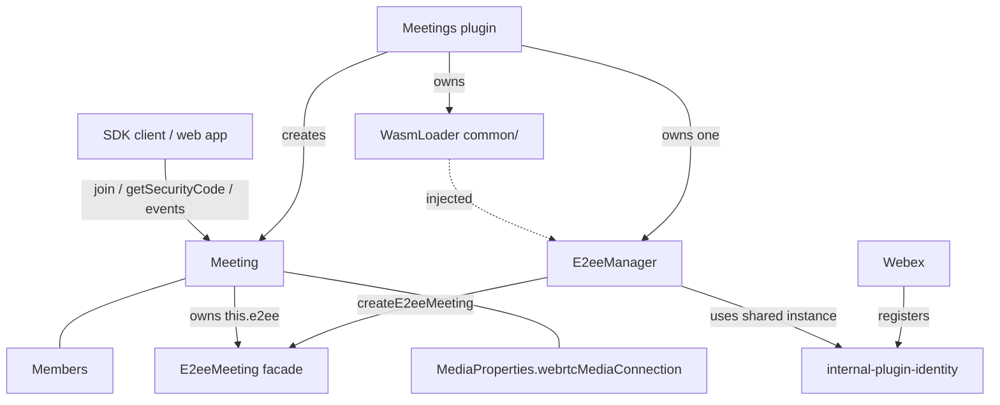
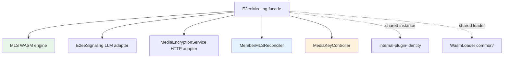
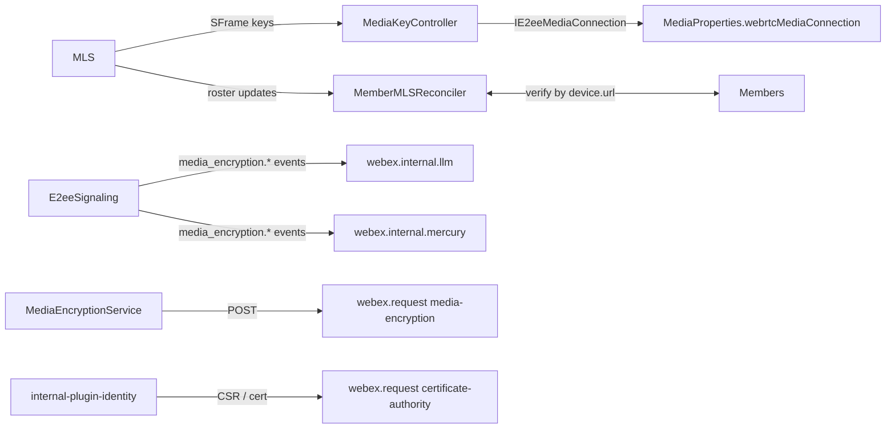

# E2EE / MLS integration into `plugin-meetings` — Design

> Status: **Under review.**
> This document describes how end-to-end-encrypted (E2EE) meetings, backed by MLS,
> are integrated into `@webex/plugin-meetings` so that SDK clients join an E2EE
> meeting exactly like any other meeting — the plugin handles all E2EE concerns.

## Goal / Requirements

Move E2EE (MLS) handling from the web-app proof-of-concept
(`webex-web-client/src/lib/mls.ts` from this [POC PR](https://github.com/WebexServices/webex-web-client/pull/10231)) into `plugin-meetings`, so any JS-SDK client
just calls `meeting.joinWithMedia()` as usual. The SDK must:

1. Let a client query the meeting **Security Code**.
2. Let a client query per-**Member** identity-verification status + certificate
   data (sourced from MLS roster updates).
3. Pass media encryption (SFrame) keys into the media connection stored in
   `MediaProperties.webrtcMediaConnection`
   (`RoapMediaConnection` | `MultistreamRoapMediaConnection`).
4. Detect whether **media services** (e.g. recording / transcoding / streaming
   servers) are present in the MLS roster, and expose it as a boolean on the
   meeting. Their presence means the meeting is not fully zero-trust, so the app
   needs this to indicate the meeting's zero-trust state in the UI.
5. Expose the meeting's **E2EE trust state** (`Calculating` | `Strong` | `ZeroTrust` |
   `AdaptiveStrong` | `AdaptiveZeroTrust`) as a getter on `Meeting`, derived **live** from the
   Locus DTO E2EE flags, the E2EE (MLS) state, and `hasMediaServices`. `Calculating` is
   reported while a zero-trust meeting's MLS join is still in progress.

### Capability signalling flow (how a meeting becomes E2EE)

Whether a given meeting is E2EE is negotiated with **Locus** through capabilities the client
advertises on the **join request** and flags Locus returns on the **Locus DTO**. Outbound signalling
requires both the `enableE2ee` config and WebAssembly support reported by
`WebCapabilities.supportsWasm()`. A client that has not enabled E2EE, or cannot run WebAssembly,
does not advertise E2EE support and does not start an MLS session.

**Outbound (client → Locus), set in the join request** (`meeting/request.ts` `joinMeeting`, only
when `enableE2ee` is on):

- `supportsV2E2EEncryption: true` — tells Locus this client supports **E2EE**
- `E2EE_1K_SUPPORTED` device capability — advertises support for E2EE meetings; pushed onto `deviceCapabilities`.

Both fields are set only when `WebCapabilities.supportsWasm()` reports `CAPABLE`.

**Inbound (Locus → client), parsed from the Locus DTO `info` onto `locusInfo.info`:**

- `isV2E2EEncrypted` — this meeting is an E2EE meeting, so an **MLS join and Sframe encryption for media is
  required**.
- `isBestEffortE2EEncryption` — the meeting uses **adaptive ("best effort")** E2EE; drives the
  `Adaptive*` trust states.
- `mediaEncryptionGroupUrl` — the **MLS group service URL** to join

The SDK only performs an actual MLS join when **`enableE2ee` is on AND `isV2E2EEncrypted` is true
AND `mediaEncryptionGroupUrl` is present** (see `E2eeMeeting.required()`). `isV2E2EEncrypted` and
`isBestEffortE2EEncryption` together (plus `hasMediaServices`) drive the `e2eeTrustState` getter.

**No SFrame ↔ SRTP upgrade/downgrade.** Once a meeting is joined with MLS, we **keep using the MLS
session and SFrame media encryption for the whole meeting** — there is no switching back to plain
SRTP mid-meeting (and no switching the other way). This holds even when the meeting's overall trust
level is **downgraded from "zero trust" to "strong"**: in an adaptive (`isBestEffortE2EEncryption`)
meeting this happens when a non-E2EE-capable client joins and **Homer** (a media service) handles
encryption on its behalf — the meeting is no longer fully zero-trust (`hasMediaServices` becomes
true, so `e2eeTrustState` drops `AdaptiveZeroTrust → AdaptiveStrong`), but our own media stays
SFrame-encrypted via the existing MLS session. The downgrade only changes the reported trust state,
not the media encryption path.

### Assumptions

- The WASM MLS engine is already relocated into the SDK. Moving it and deciding how or where it
  will be hosted are outside this design.

## Confirmed decisions

| # | Decision |
|---|----------|
| D1 | Media-key injection: **define the interface** `plugin-meetings` needs; assume `@webex/internal-media-core` implements it. The internal-media-core implementation is **out of scope**. The new internal-media-core method will be something like `MultistreamConnection.setEncryptionKeys(...)`. |
| D2 | Ownership: E2EE is a **per-meeting component** composed inside `Meeting` (`this.e2ee`), analogous to `this.members` / `this.roap`. |
| D3 | Member verification: public API **extends `Member`**, but internally MLS roster data lives in a **separate registry keyed by device URL**, because Locus member updates and MLS roster updates arrive independently, in any order, and either can be delayed. A reconciler merges them. |
| D4 | Security Code: `meeting.getSecurityCode()` getter **plus** a change event. |
| D5 | Identity/credentials: a **separate identity/credential provider** (CSR / CA / trust anchors), split from MLS group-session logic. |
| D6 | The SDK creates a **single `Identity` plugin instance per Webex client session**. It caches the CSR + CA certificate per contact and reuses credentials across meetings. |
| D7 | Verification: a `validationResult` of `E2eeValidationResult.Success` means **verified**. Surface per-device data **and** an aggregated state on `Member`. |
| D8 | Failure policy: on MLS `join_failure` / `evicted` / `timeout`, **force-leave** the meeting via `meeting.leave()` with **new dedicated leave reasons**, emit a **new failure event**, and surface a **new error class** so the app understands what happened. The meeting does **not** continue unencrypted. |
| D9 | A **new config entry** (`enableE2ee`, default `false`) gates the feature. |
| — | **WASM preloading**: the WASM load is slow, so it must **not** happen at join time. When `enableE2ee` is set, `Meetings.register()` preloads the WASM module so per-meeting init is fast. Credentials are **not** pre-warmed — they are generated + cached lazily on the first E2EE meeting. |

## Still-open items

- Exact name/shape of the new `internal-media-core` key API (`setEncryptionKeys`?) —
  align with the media team.

## Architecture overview

E2EE integration code lives under `packages/@webex/plugin-meetings/src/e2ee/`; identity and
certificate issuance live in `packages/@webex/internal-plugin-identity/`. The design is shown as
three focused views: **ownership/composition**, the **per-meeting components**, and the **runtime
data flow** across the engine and external boundaries.

### Ownership & composition

Who creates and owns what. The Meetings plugin creates one `E2eeManager` instance; each `Meeting` owns a
per-meeting `E2eeMeeting` facade (alongside `Members` and `MediaProperties`).



### Per-meeting E2EE components

The `E2eeMeeting` facade orchestrates five collaborators and reuses the shared `Identity` plugin
(registered on the Webex client) and the generic `WasmLoader` (owned by `Meetings`, injected via
`E2eeManager`).



### Runtime data flow & external boundaries

How the MLS engine's outputs reach media and members, and how the adapters reach external services.



Key property: `MLS` (the WASM protocol engine) has **no** webex / LLM /
HTTP dependencies — all I/O flows through injected adapters, so the engine is fully
unit-testable. The media-core coupling is isolated behind `IE2eeMediaConnection`.

`MediaEncryptionService` receives a bound `webex.request`; the identity plugin uses the request
method on its parent Webex client. `E2eeSignaling` receives `webex.internal.llm` and
`webex.internal.mercury` plus a `getLocusUrl()` callback (so it tracks the live locus URL across
breakout moves).

## File layout

```
packages/@webex/plugin-meetings/src/e2ee/
├── index.ts                  # barrel exports
├── E2eeManager.ts            # One instance per Meetings plugin: owns IdentityProvider + injected WasmLoader,
│                             #   preloads WASM in register(), factory for E2eeMeeting
├── E2eeMeeting.ts            # per-meeting facade / orchestrator (this.e2ee on Meeting)
├── mls.ts                    # MLS WASM protocol engine (refactor of the POC mls.ts)
├── E2eeSignaling.ts          # LLM adapter (webex.internal.llm media_encryption.* events)
├── MediaEncryptionService.ts # HTTP adapter (webex.request service:'media-encryption')
├── MemberMLSReconciler.ts   # MLS roster <-> Members reconciliation
├── MediaKeyController.ts      # key injection into IE2eeMediaConnection (buffers keys)
├── IE2eeMediaConnection.ts   # interface contract implemented by internal-media-core
├── types.ts                  # shared E2EE types
├── constants.ts              # e2ee constants (E2EE_WASM_URL, event / mercury names, timeouts)
└── wasm.d.ts                 # existing WASM typings (keep)
```

The generic `WasmLoader` is **not** E2EE-specific and lives outside this folder in
`common/wasm-loader.ts`; `Meetings` owns it and injects it into `E2eeManager`.

- The `e2ee/mls.ts` from POC code becomes `mls.ts` (stripped of webex/HTTP/LLM).
- `loadWasmModule` (and the module-cache globals) become `WasmLoader.preload(wasmUrl)` /
  `get(wasmUrl)`, warmed once per session and keyed by URL so one loader can serve many modules.
- The shared `WebexRequestMethod` type (a bound `webex.request`) lives in `common/types.ts`
  (reused by `hashTree` and the e2ee HTTP adapters), not under `e2ee/`.

## Shared types (`types.ts`)

```ts
interface E2eeKey {
  epoch: number;
  baseKey: Uint8Array;
  index: number;
  indexBits: number;
  canEncrypt: boolean;
}

interface SframeParams { cipherSuite: number; epochBits: number; } // from join_success

interface E2eeRosterMember {
  url: string;
  displayName: string;
  deviceType: string;
  validationResult: E2eeValidationResult;
}

interface E2eeDeviceVerification {
  deviceUrl: string;
  validationResult: E2eeValidationResult;  // Success means the device's identity is verified
  displayName?: string;
  deviceType?: string;
}

type E2eeMemberVerificationState =
  | 'unknown' | 'verified' | 'unverified' | 'partiallyVerified';

type E2eeState =
  | 'disabled' | 'initializing' | 'joining' | 'joined' | 'failed' | 'evicted' | 'left';

type E2eeTrustState =
  | 'Calculating' | 'Strong' | 'ZeroTrust' | 'AdaptiveStrong' | 'AdaptiveZeroTrust';

interface E2eeMeetingConfig {
  serviceUrl: string;
  joinTimeout?: number;
  coalesceWindow?: number;
  wasmUrl?: string;
}
```

## Module APIs

### `WasmLoader` (generic; owned by Meetings, lives in `common/wasm-loader.ts`)

```ts
constructor(options?: { importModule?: ModuleImporter });  // importModule override for tests
preload(wasmUrl: string): Promise<void>;     // loads + caches the module (the slow part); idempotent
get<TModule>(wasmUrl: string): Promise<TModule>;  // returns the cached module or awaits its load
isLoaded(wasmUrl: string): boolean;
```

Refactor of `loadWasmModule` + the `moduleInstance` / `moduleLoadPromise` globals into instance
state. Each module is uniquely identified by its `.wasm` URL (the `.js` loader URL is derived by
replacing the `.wasm` suffix), so a single loader can load and cache multiple distinct modules. The
E2EE module is loaded via the `E2EE_WASM_URL` constant (default `/wasm/e2ee.wasm`).

### `E2eeManager` (one instance per Meetings plugin)

```ts
constructor(deps: { webex; wasmLoader });  // wasmLoader injected (owned by Meetings)
get isEnabled(): boolean;         // webex.config.meetings.enableE2ee
preload(): Promise<void>;         // called from Meetings.register(); if isEnabled ->
                                  //   wasmLoader.preload(E2EE_WASM_URL) only; must NOT block/fail registration
                                  //   (credentials stay lazy - cached on first E2EE meeting)
createE2eeMeeting(meeting): E2eeMeeting; // factory; injects shared wasmLoader + identityProvider
```

Uses the shared `WasmLoader` and `webex.internal.identity` plugin. `createE2eeMeeting` returns a
facade whose `start()` is a no-op when `!isEnabled`, keeping `Meeting` code uniform.

### `MLS` (pure engine; no webex/HTTP/LLM deps)

```ts
constructor(deps: {
  httpClient: IMlsHttpClient;
  wasmLoader: WasmLoader;
  wasmUrl: string;            // which cached module to load (E2EE_WASM_URL)
});

initialize(cfg: {
  participantId; deviceUrl; deviceType; correlationId; displayName; serviceUrl;
  credentials?; trustAnchors?; joinTimeout?; coalesceWindow?;
}): Promise<void>;

join(): void;
leave(): void;
handleEvent(bytes: Uint8Array, source: E2eeSignalingSource): void;
setLlmConnectedBeforeJoin(b: boolean): void;
notifyLlmConnected(): void;
keepAlive(): void;
getSecurityCode(): string;
getRoster(): E2eeRosterMember[];
isLeader(): boolean;
```

Emits (typed `EventEmitter` or callback registry):

- `joinSuccess` `{ epoch, securityCode, sframe: SframeParams, key: E2eeKey }`
- `joinFailure` `{ reason }`
- `newKey` `(E2eeKey)` · `useKey` `{ epoch }` · `purgeKeys` `{ epoch }`
- `rosterAdded` `(E2eeRosterMember[])` · `rosterRemoved` `{ urls: string[] }`
- `leaderChanged` `{ isLeader }` · `evicted` · `versionNegotiated` `{ version }`
- `securityCodeChanged` `{ code }`

Internals map the WASM callbacks: `setOnHttpRequest` → `httpClient.request(url, bytes)` →
`completeHttpRequest`; `setOnWait` → `timers.setTimeout` → `completeWait`.

```ts
interface IMlsHttpClient { request(url: string, body: Uint8Array): Promise<Uint8Array>; }
```

### `MediaEncryptionService` (implements `IMlsHttpClient`)

```ts
constructor(deps: { webexRequest: WebexRequestMethod }); // a bound webex.request, not the whole webex
request(url: string, body: Uint8Array): Promise<Uint8Array>;
//  -> webexRequest({ method:'POST', service:'media-encryption', url,
//                    body: JSON.parse(decode(body)) })
//     then re-encode response.body to Uint8Array (matches the PoC makeHttpRequest).
```

Requests use the standard webex auth (`Authorization` bearer token added by
webex-core), matching the PoC — no custom auth header is needed.

### `E2eeSignaling` (LLM + mercury adapter)

```ts
constructor(deps: {
  llm;                              // webex.internal.llm (ILlmChannel: on/off/isConnected/getLocusUrl)
  mercury;                          // webex.internal.mercury (IMercuryChannel: on/off)
  getLocusUrl: () => string | undefined; // reads the meeting's live locus url (callback, not a ref)
  session: MLS;
});
start(): void;
stop(): void;
```

Subscribes **both** `llm` and `mercury` to the `media_encryption.*` events
(`leader_nominated`, `welcome`, `annotated_welcome`, `multi_welcome`, `group_update`,
`annotated_commit`, `large_group_update`, `use_key`, `join_request`, `leave_request`,
`join_failure`, `leader_changed`) — the same events can arrive on either channel — and forwards
each envelope to `session.handleEvent(bytes, source)`, tagging `source` as `'llm'` or `'mercury'`
(via per-channel handlers) so the engine's receive logs show which channel delivered the event.

Online handling (LLM-only): if `llm.isConnected()` and the locus URL matches this meeting, call
`session.setLlmConnectedBeforeJoin(true)`; otherwise listen once for `'online'`
(locus-URL matched, like the PoC `onceLLMOnline`) and call `session.notifyLlmConnected()`.
Guard: `getLocusUrl() === llm.getLocusUrl()`. `getLocusUrl` is a callback (not a stored meeting
reference) so the check stays correct when the locus URL changes, e.g. moving between breakouts.

### `@webex/internal-plugin-identity` (credentials; one instance per Webex client)

```ts
// Available as webex.internal.identity; registered by plugin-meetings.
getCredentials(contactId: string): Promise<{ privateKey: Uint8Array; certChain: ArrayBuffer[] }>;
//  -> generate EC P-256 CSR (pkijs/asn1js)
//  -> webex.request({ service:'webex-certificate-authority', resource:'certificates',
//                    headers:{ 'include-root-cert':'true' } })
//  -> parse PEM chain; CACHE result (per device/user) for reuse across meetings.
getTrustAnchors(): { webexCaRoots; domainNameRoots; userIdentityRoots };
```

The plugin owns `WEBEX_CA_PRODUCTION_ROOTS`, `generateCsrWithPkijs`, and the PEM helpers.
`domainNameRoots` / `userIdentityRoots` are TBD from the service (currently `''`).

### `MemberMLSReconciler`

```ts
constructor(deps: { membersCollection; reportMembersUpdated: (members) => void });
processMembersUpdate(payload: {delta}): void; // from the Members pre-emit processor
applyRosterAdded(added: E2eeRosterMember[]): void;
applyRosterRemoved(urls: string[]): void;
getDeviceVerification(url: string): E2eeDeviceVerification | undefined;
reset(): void;
```

The reconciler holds only `rosterByDeviceUrl: Map<string, E2eeRosterMember>` (the MLS roster).
The `deviceUrl -> Member` reverse index lives in **`MembersCollection`**
(`getMemberByDeviceUrl`, maintained in `set`/`remove`/`setAll`/`reset`), so it's always current and
reusable. Verification lives on each `Member` (`setE2eeDeviceVerification` /
`removeE2eeDeviceVerification` return whether they changed). Every path iterates its argument once.

There is **no separate `MEETING_E2EE_MEMBERS_VERIFICATION_UPDATED` event**. Verification is
surfaced through the existing `members:update`, which is always emitted by `Members`:

- **Member-driven** (a Locus participant update): `Members.locusParticipantsUpdate` invokes a
  registered pre-emit processor (`setMembersUpdateProcessor`) right before it triggers
  `members:update`. The reconciler registers `processMembersUpdate` as that processor; it stamps
  verification onto the (recreated) delta members from the roster, so it's present in that event.
- **Roster-driven** (MLS validation completes, no Locus update): `applyRosterAdded/Removed` look up
  each affected member via `membersCollection.getMemberByDeviceUrl` and update just that device;
  members whose verification actually changed are handed to `reportMembersUpdated`, which asks
  `Members` to emit a `members:update` (with those members in `delta.updated`).

Matching key: **`MLS RosterMember.url === Member.participant.devices[i].url`** (per-device).
Verified rule: `validationResult === E2eeValidationResult.Success`. Ordering between MLS roster events and Locus member
updates does not matter — roster entries with no matching member yet remain pending in the map and
are applied when that member is next processed.

The `E2eeMeeting` facade creates the reconciler in its **constructor** (gated on
`config.enableE2ee`) and registers the processor there, so member verification is stamped for the
whole meeting lifetime — even for member changes that occur outside a joined meeting.

### `IE2eeMediaConnection` (contract; implemented by `internal-media-core`, out of scope)

```ts
interface IE2eeMediaConnection {
  setEncryptionKeys(config: {
    cipherSuite: number;
    epochBits: number;
    keys: Array<{ epoch: number; baseKey: Uint8Array; index: number; indexBits: number }>;
    activeEncryptionEpoch?: number;   // undefined => decrypt-only (no egress encryption yet)
  }): void;
  disableE2ee(): void;
}

function hasE2eeSupport(mc): mc is IE2eeMediaConnection; // feature-detect during rollout
```

Implemented by both `RoapMediaConnection` and `MultistreamRoapMediaConnection`;
`internal-media-core` owns the SFrame worker + frame transforms internally. This is a
**new dedicated method** (working name `setEncryptionKeys`), **not** the existing
`setupEncodedTransform`; the exact name/shape must be aligned with the media team.

Design choice: pass the **full key set** on every call (idempotent — replaces media-core's
key table). This is resilient to reconnect, out-of-order delivery, and epoch rotation, and
pairs cleanly with the controller's buffer.

### `MediaKeyController` (buffers keys; survives media reconnect)

```ts
constructor();
setSframeParams(p: SframeParams): void;
attachMediaConnection(mc: IE2eeMediaConnection): void; // store mc, then flush()
detachMediaConnection(): void;                         // on closePeerConnections
addKey(k: E2eeKey): void;                              // buffer, then flush()
setActiveEpoch(epoch: number): void;                   // buffer, then flush()
purgeBefore(epoch: number): void;                      // drop from buffer, then flush()
private flush(): void {
  if (this.mc && this.params) {
    this.mc.setEncryptionKeys({
      ...this.params,
      keys: [...this.keys.values()],
      activeEncryptionEpoch: this.activeEpoch,
    });
  }
}
```

State: `mc?`, `params?: SframeParams`, `keys: Map<epoch, E2eeKey>`, `activeEpoch?`.
Handles keys arriving before media (buffered) and media recreated on reconnect (a single
idempotent `flush()`).

### `E2eeMeeting` (facade; `this.e2ee` on `Meeting`)

Created by `E2eeManager.createE2eeMeeting(meeting)`.

```ts
constructor(deps: {
  meeting; webex; wasmLoader: WasmLoader;
  identityProvider: IdentityProvider; config;
});

get state(): E2eeState;
get isEnabled(): boolean;
getSecurityCode(): string | undefined;
get hasMediaServices(): boolean;   // true if the MLS roster contains a media service
start(): Promise<void>;   // idempotent; guarded by required() + config.enableE2ee
stop(): Promise<void>;
attachMediaConnection(mc): void;
detachMediaConnection(): void;
private required(): boolean {
  return (
    this.config.enableE2ee &&
    !!this.meeting.locusInfo?.info?.isV2E2EEncrypted && // MLS join only for V2/zero-trust meetings
    !!this.meeting.locusInfo?.info?.mediaEncryptionGroupUrl // group URL is the MLS serviceUrl
  );
}
```

`start()`:

1. `if (!required()) return;` (state stays `disabled`; `required()` already checks
   `config.enableE2ee` + `isV2E2EEncrypted` + `mediaEncryptionGroupUrl`)
2. `await wasmLoader.get()` (already preloaded in `register()` → fast)
3. `creds = await identityProvider.getCredentials(webex.internal.device.userId)` (cached)
4. `httpClient = new MediaEncryptionService({ webexRequest: webex.request.bind(webex) })`
5. `session = new MLS({ httpClient, wasmLoader })`
6. `await session.initialize({ participantId: device.userId, deviceUrl: device.url,`
   `  deviceType: 'WEB', correlationId: meeting.correlationId, displayName: <self name>,`
   `  serviceUrl: meeting.locusInfo.info.mediaEncryptionGroupUrl, credentials: creds,`
   `  trustAnchors: identityProvider.getTrustAnchors(), joinTimeout, coalesceWindow })`
7. the reconciler is already created + registered as the Members pre-emit processor in the facade
   constructor (see `MemberMLSReconciler`); `start()` only wires its roster events
8. `mediaController = new MediaKeyController();` if
   `meeting.mediaProperties.webrtcMediaConnection` present → attach
9. wire session events:
   - `joinSuccess` → `mediaController.setSframeParams(sframe)`; `addKey(key)`;
     Meeting emits `SECURITY_CODE_UPDATED`. (Does NOT set `'joined'` — see completion rule.)
   - `newKey` → `mediaController.addKey`; `useKey` → `mediaController.setActiveEpoch`;
     `purgeKeys` → `mediaController.purgeBefore`
   - `rosterAdded` / `rosterRemoved` → `reconciler.applyRosterAdded` / `applyRosterRemoved`,
     then recompute `hasMediaServices` from the full roster (`session.getRoster()`); if it
     changed, Meeting emits `MEDIA_SERVICES_CHANGED`. Also re-check the join-completion rule:
     if our own device URL is now in the roster and `state !== 'joined'`, set `state = 'joined'`
     and Meeting emits `STATE_CHANGED` (this is what flips the trust state to `ZeroTrust`).
   - `securityCodeChanged` → Meeting emits `SECURITY_CODE_UPDATED`
   - `joinFailure` / `evicted` / `timeout` → `handleFatal(reason)`
10. `signaling = new E2eeSignaling({ llm: webex.internal.llm,`
    `  getLocusUrl: () => meeting.locusInfo?.url, session }); signaling.start();`
    then `session.join()`

`stop()`: `signaling.stop()`; `session.leave()`; `reconciler.reset()`;
`mediaController.detach()`; unsubscribe members; `setState('left')`.

`handleFatal(reason)`: `setState('failed' | 'evicted')`; Meeting emits
`MEETING_E2EE_FAILURE { reason }`; then **force-leave**:
`meeting.leave({ reason: MEETING_REMOVED_REASON.E2EE_<reason> })`, so the app gets
`meeting:removed` with an E2EE reason plus an `E2eeError`.

**MLS join completion:** `state` becomes `'joined'` only once our own device URL
(`webex.internal.device.url`) appears in the MLS roster — not merely on the WASM
`joinSuccess` event. `session.join()` moves `state` to `'joining'`; every roster change is
checked for our own device URL, which flips `state` to `'joined'` (and emits `STATE_CHANGED`).
This is the single source of truth for "MLS join complete" that `Meeting.e2eeTrustState`
relies on to move a zero-trust meeting from `Calculating` to `ZeroTrust`.

`hasMediaServices` is derived from the MLS roster: `true` when any roster member's
`deviceType` is `'MEDIA_SERVICE'` (recording / transcoding / streaming server). It is
recomputed on every roster change and reset to `false` on `stop()`; changes emit
`MEETING_E2EE_MEDIA_SERVICES_CHANGED { hasMediaServices }`. This is what the app uses
to surface the meeting's zero-trust state.

> **Future:** some media services can be *trusted*. If every media service in the
> roster is trusted, the meeting can retain its "zero-trust" status even though media
> services are present. This applies only to **video mesh** meetings. The current
> design treats any `'MEDIA_SERVICE'` presence as breaking zero-trust; the trusted-service
> distinction is out of scope for now but `hasMediaServices` (and the zero-trust
> computation behind it) should be able to evolve to account for it.

## `Member` changes (`member/index.ts`, `member/types.ts`, `members/index.ts`)

- `member/types.ts`: add `url: string` to `ParticipantDevice` (exists at runtime — used at
  `members/index.ts` for SIP lookup — but missing from the TS type).
- `Member`:
  - private `e2eeDeviceVerifications: Map<string, E2eeDeviceVerification> = new Map();`
  - public `e2eeVerificationState: E2eeMemberVerificationState = 'unknown';`
  - `setE2eeDeviceVerification(deviceUrl, data)`, `getE2eeDeviceVerification(deviceUrl)`,
    `getE2eeDeviceVerifications(): E2eeDeviceVerification[]`, `recomputeE2eeVerificationState()`.
- The reconciler is the source of truth and reapplies on each `MEMBERS_UPDATE`, so no
  change to `propsToKeepOnUpdate` is strictly needed. (Alternative: add
  `'e2eeDeviceVerifications'` to that array; the reapply approach is cleaner and avoids
  stale data.)

## `Meetings`-plugin integration (`meetings/index.ts`)

- `onReady()` (the `READY` handler): `this.e2eeManager = new E2eeManager({ webex: this.webex });`.
  Created here — **not** in the plugin constructor — because `webex.request` isn't available yet at
  construction time, and `E2eeManager` binds `webex.request` for its HTTP adapters. `onReady` runs
  before any meeting is created from a locus event, so `createMeeting` always has the manager.
- `register()`: after a successful register, fire-and-forget `this.e2eeManager?.preload()`, wrapped
  in a non-blocking `catch` (like `startReachability`), so it never blocks/fails registration. This
  warms the WASM module (no-op when `enableE2ee` is false). Credentials are not pre-warmed here —
  they are generated + cached lazily on the first E2EE meeting.
- `createMeeting()`: pass `e2eeManager` into `Meeting` attrs alongside
  `userId` / `deviceUrl` / `orgId`.

## `Meeting` integration (`meeting/index.ts`)

- Constructor: `this.e2ee = attrs.e2eeManager?.createE2eeMeeting(this)` (or an
  undefined-safe no-op facade). Because `createE2eeMeeting` returns a facade whose `start()`
  no-ops when E2EE is disabled, call sites stay unconditional.
- **MLS join is gated on Locus confirming self `JOINED`.** In `setUpLocusSelfListener` (the
  `LOCUS_INFO_UPDATE_SELF` handler), when self transitions to `JOINED`
  (`oldSelf.state !== JOINED && newSelf.state === JOINED`), call `this.e2ee.start().catch(log)`.
  Starting earlier — right after the join request response — is too early and also never fires
  while the user sits in the meeting lobby (self is not `JOINED` until admitted). `start()` is
  idempotent and self-guarded, so the edge check only keeps logs clean.
- `createMediaConnection()`: after `setMediaPeerConnection(mc)`, call
  `this.e2ee.attachMediaConnection(this.mediaProperties.webrtcMediaConnection)`.
- `closePeerConnections()`: `this.e2ee.detachMediaConnection()` before `mc.close()`.
- `clearMeetingData()`: `await this.e2ee.stop()`.
- Public: `getSecurityCode(): string | undefined { return this.e2ee?.getSecurityCode(); }`;
  `get e2eeState() { return this.e2ee?.state ?? 'disabled'; }`;
  `get e2eeHasMediaServices() { return this.e2ee?.hasMediaServices ?? false; }` (drives the
  app's zero-trust UI indicator). `getMembers()` unchanged.
- `get e2eeTrustState(): E2eeTrustState` — derived **live** from `locusInfo.info`
  flags plus `this.e2ee`:
  - `isBestEffortE2EEncryption` → `Adaptive*` (true) vs non-adaptive (false)
  - `isV2E2EEncrypted` → zero-trust (true) vs strong (false)
  - A zero-trust (`isV2E2EEncrypted`) meeting reports `Calculating` until MLS join is
    complete (`this.e2ee.state === 'joined'` — i.e. our own device URL is in the roster,
    see "MLS join completion" below). Only then is it eligible for `ZeroTrust`.
  - `hasMediaServices` downgrades a completed zero-trust result to the matching strong value
    (`ZeroTrust` → `Strong`, `AdaptiveZeroTrust` → `AdaptiveStrong`), since (untrusted)
    media services break zero trust.

  ```ts
  const info = this.locusInfo?.info;
  const adaptive = !!info?.isBestEffortE2EEncryption;
  const isEncrypted = !!info?.isV2E2EEncrypted;
  // a zero-trust meeting isn't zero-trust until our MLS join completes.
  if (isEncrypted && this.e2ee?.state !== 'joined') return 'Calculating';
  const zeroTrust = isEncrypted && !this.e2ee?.hasMediaServices;
  if (adaptive) return zeroTrust ? 'AdaptiveZeroTrust' : 'AdaptiveStrong';
  return zeroTrust ? 'ZeroTrust' : 'Strong';
  ```
  (`Strong` / `AdaptiveStrong` meetings do no MLS join, so they report immediately.)
  The app should re-read `e2eeTrustState` on `MEETING_E2EE_STATE_CHANGED` and
  `MEETING_E2EE_MEDIA_SERVICES_CHANGED`.

### New constants / errors / config

- `constants.ts` `EVENT_TRIGGERS`:
  - `MEETING_E2EE_SECURITY_CODE_UPDATED: 'meeting:e2ee:securityCodeUpdated'`
  - `MEETING_E2EE_STATE_CHANGED: 'meeting:e2ee:stateChanged'`
  - `MEETING_E2EE_MEDIA_SERVICES_CHANGED: 'meeting:e2ee:mediaServicesChanged'` (payload `{ hasMediaServices }`)
  - `MEETING_E2EE_FAILURE: 'meeting:e2ee:failure'` (payload `{ reason }`)
  - Member verification is surfaced via the existing `members:update` (no dedicated event); see
    `MemberMLSReconciler`.
- `constants.ts` `MEETING_REMOVED_REASON`: add `E2EE_JOIN_FAILURE`, `E2EE_EVICTED`,
  `E2EE_TIMEOUT` (used as leave/removed reasons on force-leave, so `meeting:removed`
  carries the cause).
- `common/errors/e2ee-error.ts`: new `E2eeError` (extends the existing error base) with a
  `reason` field; surfaced on the force-leave path.
- Config: add `enableE2ee` (default `false`) to the plugin-meetings config and
  `meetings.types`; read via `this.config.enableE2ee`.
- Join request (`meeting/request.ts` `joinMeeting`), both gated on the E2EE config flag
  (`enableE2ee`) so E2EE is only advertised to Locus when the SDK's E2EE config is enabled:
  - set `supportsV2E2EEncryption` from `enableE2ee`.
  - push the `E2EE_1K_SUPPORTED` device capability (constant in `e2ee/constants.ts`) onto
    `deviceCapabilities` when `enableE2ee` is set. This advertises support for large (1K) E2EE
    meetings
- `locus-info/infoUtils.ts`: parse `isV2E2EEncrypted`, `isBestEffortE2EEncryption`, and
  `mediaEncryptionGroupUrl` from the Locus DTO `info` onto `locusInfo.info`.

## Lifecycle ordering / edge cases

- The MLS group join is **independent** of media; keys are buffered in the controller until
  the media connection attaches.
- LLM may already be online when `start()` runs → signaling checks `isConnected()` + locus
  match and calls `setLlmConnectedBeforeJoin(true)` instead of waiting for `'online'`.
- Reconnect: `closePeerConnections()` → `detach`; `createMediaConnection()` → `attach`
  (replays keys). The MLS session and LLM persist, so the MLS group is **not** re-joined.
- Roster/Member out-of-order: solved by the reconciler map + reapply on `MEMBERS_UPDATE`.
- Failures: `joinFailure` / `evicted` / `timeout` → `handleFatal` → state +
  `MEETING_E2EE_FAILURE { reason }` + force-leave with an `E2EE_*` reason + `E2eeError`.
- `keepAlive`: the session may need a periodic `keepAlive()` timer while joined — confirm
  from the WASM engine.

## Test strategy

Per the webex-js-sdk conventions: specs live under `test/unit/spec/e2ee/**` (mirroring `src/`),
run with mocha (`yarn workspace @webex/plugin-meetings test:unit`), using `sinon` for
stubs/spies, `assert` from `@webex/test-helper-chai`, and `@webex/test-helper-mock-webex` for a
mock webex. (Filenames below are illustrative — each maps to a spec under `test/unit/spec/e2ee/`.)

- `WasmLoader.test.ts` — `preload` caches, `get()` awaits/returns cache, idempotent, error resets.
- `E2eeManager.test.ts` — `isEnabled` from config; `preload` warms WASM only, only when
  enabled, and never rejects; `createE2eeMeeting` injects shared instances; disabled → no-op facade.
- `MLS.test.ts` — mock `WasmLoader` returning a fake `WebE2EE`; assert callbacks
  map to emitted events; HTTP/wait routed to injected deps. Pure, no webex.
- `MediaEncryptionService.test.ts` — mock `webexRequest`; assert service/url/body encode+decode.
- `E2eeSignaling.test.ts` — mock `llm` (`on/off/isConnected/getLocusUrl`) + a `getLocusUrl`
  callback; assert subscription, locus-URL guard, forwarding, teardown.
- `internal-plugin-identity/test/unit/spec/identity.ts` — mock `webex.request` (CA request); assert CSR built, caching, trust anchors.
- `MemberMLSReconciler.test.ts` — fake members collection + roster; assert out-of-order both
  directions, per-device match by URL, aggregate state, reapply on `MEMBERS_UPDATE`.
- `MediaKeyController.test.ts` — fake `IE2eeMediaConnection`; keys-before-media buffering,
  replay on attach, reconnect replay, purge / active epoch.
- `E2eeMeeting.test.ts` — wire fakes; `start` guarded by `required()` + flag; happy path + failure;
  `hasMediaServices` derived from roster (media-service device type present/absent) + change event.
- Meeting integration — extend `meeting/index` tests for `getSecurityCode`, start/stop hooks,
  attach/detach on media create/close, and the new `EVENT_TRIGGERS`.

## Delivery phases (each independently testable)

| Phase | Scope |
|-------|-------|
| **P0** | `enableE2ee` config + `E2eeManager` + `WasmLoader` + `Meetings.register()` preload wiring (no per-meeting behavior yet; proves early WASM warm-up + single-instance plumbing). |
| **P1** | Extract/refactor `MLS` (engine) + `types` + WASM-loader use (no behavior change vs PoC). |
| **P2** | `MediaEncryptionService` + `internal-plugin-identity` (one instance per client) + `E2eeSignaling` (I/O adapters). |
| **P3** | `E2eeMeeting` facade + `Meeting` wiring (start/stop, `getSecurityCode`, events) — **security code works end-to-end**. |
| **P4** | `MemberMLSReconciler` + `Member` extension + verification events. |
| **P5** | `IE2eeMediaConnection` contract + `MediaKeyController` (media key injection); media-core impl (new `setEncryptionKeys` method) tracked separately (out of scope). |
| **P6** | Reconnection + force-leave failure policy (reasons/errors/events) + `keepAlive` hardening. |

## Design principles applied

Single-responsibility modules; dependency inversion at the `IE2eeMediaConnection` boundary;
adapter pattern for signaling / service / media; facade (`E2eeMeeting`); and isolation of the
protocol engine from I/O for testability.
