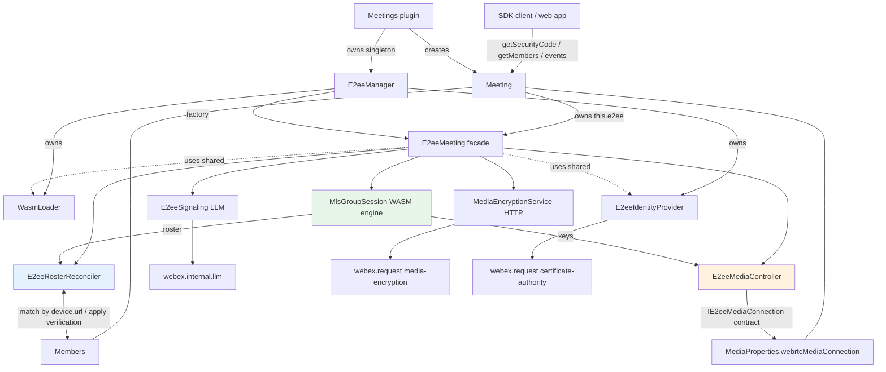

# E2EE / MLS integration into `plugin-meetings` — Design

> Status: **Design approved (high-level); detailed design under review.**
> This document describes how end-to-end-encrypted (E2EE) meetings, backed by MLS,
> are integrated into `@webex/plugin-meetings` so that SDK clients join an E2EE
> meeting exactly like any other meeting — the plugin handles all E2EE concerns.

## Goal / Requirements

Move E2EE (MLS) handling from the web-app proof-of-concept
(`webex-web-client/src/lib/mls.ts`) into `plugin-meetings`, so any JS-SDK client
just calls `meeting.join()` as usual. The SDK must:

1. Let a client query the meeting **Security Code**.
2. Let a client query per-**Member** identity-verification status + certificate
   data (sourced from MLS roster updates).
3. Pass media encryption (SFrame) keys into the media connection stored in
   `MediaProperties.webrtcMediaConnection`
   (`RoapMediaConnection` | `MultistreamRoapMediaConnection`).
4. Detect whether **media services** (e.g. recording / transcoding / streaming
   servers) are present in the MLS roster, and expose it as a boolean on the
   meeting. Their presence means the meeting is not fully zero-trust, so the app
   needs this to indicate the meeting's zero-trust state in the UI.
5. Expose the meeting's **E2EE trust state** (`Calculating` | `Strong` | `ZeroTrust` |
   `AdaptiveStrong` | `AdaptiveZeroTrust`) as a getter on `Meeting`, derived **live** from the
   Locus DTO E2EE flags, the E2EE (MLS) state, and `hasMediaServices`. `Calculating` is
   reported while a zero-trust meeting's MLS join is still in progress.

The WASM MLS engine is assumed already relocated into the SDK; moving it is **not**
part of this effort.

## Confirmed decisions

| # | Decision |
|---|----------|
| D1 | Media-key injection: **define the interface** `plugin-meetings` needs; assume `@webex/internal-media-core` implements it. The media-core implementation is **out of scope**. The new media-core method will be something like `MultistreamConnection.setEncryptionKeys(...)` (NOT the existing `setupEncodedTransform`). |
| D2 | Ownership: E2EE is a **per-meeting component** composed inside `Meeting` (`this.e2ee`), analogous to `this.members` / `this.roap`. |
| D3 | Member verification: public API **extends `Member`**, but internally MLS roster data lives in a **separate registry keyed by device URL**, because Locus member updates and MLS roster updates arrive independently, in any order, and either can be delayed. A reconciler merges them. |
| D4 | Security Code: `meeting.getSecurityCode()` getter **plus** a change event. |
| D5 | Identity/credentials: a **separate identity/credential provider** (CSR / CA / trust anchors), split from MLS group-session logic. |
| O1 | `E2eeIdentityProvider` is a **singleton within the Meetings plugin** (owned by `E2eeManager`), so the CSR + CA cert is generated once per session and reused across meetings. |
| O3 | Verification: `validation_result === 0` means **verified**. Surface per-device data **and** an aggregated state on `Member`. |
| O4 | Failure policy: on MLS `join_failure` / `evicted` / `timeout`, **force-leave** the meeting via `meeting.leave()` with **new dedicated leave reasons**, emit a **new failure event**, and surface a **new error class** so the app understands what happened. The meeting does **not** continue unencrypted. |
| O6 | A **new config entry** (`enableE2ee`, default `false`) gates the feature. |
| — | **WASM preloading**: the WASM load is slow, so it must **not** happen at join time. When `enableE2ee` is set, `Meetings.register()` preloads the WASM module so per-meeting init is fast. Credentials are **not** pre-warmed — they are generated + cached lazily on the first E2EE meeting. |

## Still-open items

- Exact name/shape of the new `internal-media-core` key API (`setEncryptionKeys`?) —
  align with the media team.

## Architecture overview

All new code lives under `packages/@webex/plugin-meetings/src/e2ee/`.



Key property: `MlsGroupSession` (the WASM protocol engine) has **no** webex / LLM /
HTTP dependencies — all I/O flows through injected adapters, so the engine is fully
unit-testable. The media-core coupling is isolated behind `IE2eeMediaConnection`.

## File layout

```
packages/@webex/plugin-meetings/src/e2ee/
├── index.ts                  # barrel exports
├── E2eeManager.ts            # Meetings-level SINGLETON: owns WasmLoader + IdentityProvider,
│                             #   preloads WASM in register(), factory for E2eeMeeting
├── E2eeMeeting.ts            # per-meeting facade / orchestrator (this.e2ee on Meeting)
├── MlsGroupSession.ts        # WASM protocol engine (refactor of mls.ts E2EEMeetingClient)
├── WasmLoader.ts             # injectable WASM module loader with preload() + cache
├── E2eeSignaling.ts          # LLM adapter (webex.internal.llm media_encryption.* events)
├── MediaEncryptionService.ts # HTTP adapter (webex.request service:'media-encryption')
├── E2eeIdentityProvider.ts   # CSR/CA credentials + trust anchors (singleton, cached)
├── E2eeRosterReconciler.ts   # MLS roster <-> Members reconciliation
├── E2eeMediaController.ts     # key injection into IE2eeMediaConnection (buffers keys)
├── IE2eeMediaConnection.ts   # interface contract implemented by internal-media-core
├── types.ts                  # shared E2EE types
├── constants.ts              # e2ee constants (event / mercury names, timeouts)
└── wasm.d.ts                 # existing WASM typings (keep)
```

- The current `e2ee/mls.ts` becomes `MlsGroupSession.ts` (stripped of webex/HTTP/LLM).
- `loadWasmModule` (and the module-cache globals) become `WasmLoader.preload()` / `get()`,
  warmed once per session.

## Shared types (`types.ts`)

```ts
interface E2eeKey {
  epoch: number;
  baseKey: Uint8Array;
  index: number;
  indexBits: number;
  canEncrypt: boolean;
}

interface SframeParams { cipherSuite: number; epochBits: number; } // from join_success

interface E2eeRosterMember {
  url: string;
  displayName: string;
  deviceType: string;
  validationResult: number;
}

interface E2eeDeviceVerification {
  deviceUrl: string;
  verified: boolean;            // validationResult === 0
  validationResult: number;
  displayName?: string;
  deviceType?: string;
}

type E2eeMemberVerificationState =
  | 'unknown' | 'verified' | 'unverified' | 'partiallyVerified';

type E2eeState =
  | 'disabled' | 'initializing' | 'joining' | 'joined' | 'failed' | 'evicted' | 'left';

type E2eeTrustState =
  | 'Calculating' | 'Strong' | 'ZeroTrust' | 'AdaptiveStrong' | 'AdaptiveZeroTrust';

interface E2eeMeetingConfig {
  serviceUrl: string;
  joinTimeout?: number;
  coalesceWindow?: number;
  wasmUrl?: string;
}
```

## Module APIs

### `WasmLoader` (injectable; session-scoped)

```ts
constructor(deps: { wasmUrl?: string; logger?: ILogger });
preload(): Promise<void>;         // loads + caches the module (the slow part); idempotent
get(): Promise<ModuleInstance>;   // returns the cached module or awaits preload
isLoaded(): boolean;
```

Refactor of `loadWasmModule` + the `moduleInstance` / `moduleLoadPromise` globals into
instance state.

### `E2eeManager` (Meetings-level singleton)

```ts
constructor(deps: { webex; config });
get isEnabled(): boolean;         // config.enableE2ee
preload(): Promise<void>;         // called from Meetings.register(); if isEnabled ->
                                  //   wasmLoader.preload() only; must NOT block/fail registration
                                  //   (credentials stay lazy - cached on first E2EE meeting)
createE2eeMeeting(meeting): E2eeMeeting; // factory; injects shared wasmLoader + identityProvider
```

Owns the shared `WasmLoader` and `E2eeIdentityProvider`. `createE2eeMeeting` returns a
facade whose `start()` is a no-op when `!isEnabled`, keeping `Meeting` code uniform.

### `MlsGroupSession` (pure engine; no webex/HTTP/LLM deps)

```ts
constructor(deps: {
  httpClient: IMlsHttpClient;
  wasmLoader: WasmLoader;
  timers?: ITimers;
  logger?: ILogger;
});

initialize(cfg: {
  participantId; deviceUrl; deviceType; correlationId; displayName; serviceUrl;
  credentials?; trustAnchors?; joinTimeout?; coalesceWindow?; wasmUrl?;
}): Promise<void>;

join(): void;
leave(): void;
handleEvent(bytes: Uint8Array): void;
setLlmConnectedBeforeJoin(b: boolean): void;
notifyLlmConnected(): void;
keepAlive(): void;
getSecurityCode(): string;
getRoster(): E2eeRosterMember[];
isLeader(): boolean;
```

Emits (typed `EventEmitter` or callback registry):

- `joinSuccess` `{ epoch, securityCode, sframe: SframeParams, key: E2eeKey }`
- `joinFailure` `{ reason }`
- `newKey` `(E2eeKey)` · `useKey` `{ epoch }` · `purgeKeys` `{ epoch }`
- `rosterAdded` `(E2eeRosterMember[])` · `rosterRemoved` `{ urls: string[] }`
- `leaderChanged` `{ isLeader }` · `evicted` · `versionNegotiated` `{ version }`
- `securityCodeChanged` `{ code }`

Internals map the WASM callbacks: `setOnHttpRequest` → `httpClient.request(url, bytes)` →
`completeHttpRequest`; `setOnWait` → `timers.setTimeout` → `completeWait`.

```ts
interface IMlsHttpClient { request(url: string, body: Uint8Array): Promise<Uint8Array>; }
```

### `MediaEncryptionService` (implements `IMlsHttpClient`)

```ts
constructor(deps: { webex });
request(url: string, body: Uint8Array): Promise<Uint8Array>;
//  -> webex.request({ method:'POST', service:'media-encryption', url,
//                     body: JSON.parse(decode(body)) })
//     then re-encode response.body to Uint8Array (matches the PoC makeHttpRequest).
```

Requests use the standard webex auth (`Authorization` bearer token added by
webex-core), matching the PoC — no custom auth header is needed.

### `E2eeSignaling` (LLM adapter)

```ts
constructor(deps: { webex; meeting; session: MlsGroupSession });
start(): void;
stop(): void;
```

Subscribes `webex.internal.llm` to the `media_encryption.*` mercury events
(`leader_nominated`, `welcome`, `annotated_welcome`, `multi_welcome`, `group_update`,
`annotated_commit`, `large_group_update`, `use_key`, `join_request`, `leave_request`,
`join_failure`, `leader_changed`) and forwards each envelope to `session.handleEvent`.

Online handling: if `llm.isConnected()` and the locus URL matches this meeting, call
`session.setLlmConnectedBeforeJoin(true)`; otherwise listen once for `'online'`
(locus-URL matched, like the PoC `onceLLMOnline`) and call `session.notifyLlmConnected()`.
Guard: `meeting.locusInfo.url === webex.internal.llm.getLocusUrl()`.

### `E2eeIdentityProvider` (credentials; singleton owned by `E2eeManager`)

```ts
constructor(deps: { webex });
getCredentials(contactId: string): Promise<{ privateKey: Uint8Array; certChain: ArrayBuffer[] }>;
//  -> generate EC P-256 CSR (pkijs/asn1js)
//  -> webex.request({ service:'webex-certificate-authority', resource:'certificates',
//                     headers:{ 'include-root-cert':'true' } })
//  -> parse PEM chain; CACHE result (per device/user) for reuse across meetings.
getTrustAnchors(): { webexCaRoots; domainNameRoots; userIdentityRoots };
```

Moves `WEBEX_CA_PRODUCTION_ROOTS`, `generateCsrWithPkijs`, and the PEM helpers here.
`domainNameRoots` / `userIdentityRoots` are TBD from the service (currently `''`).

### `E2eeRosterReconciler`

```ts
constructor(deps: { meeting; onVerificationChanged: () => void });
applyRosterAdded(added: E2eeRosterMember[]): void;   // store then reconcile
applyRosterRemoved(urls: string[]): void;
onMembersUpdate(): void;                             // subscribed to MEMBERS_UPDATE
getDeviceVerification(url: string): E2eeDeviceVerification | undefined;
reset(): void;
```

State: `rosterByDeviceUrl: Map<string, E2eeRosterMember>` — independent of `Member`.

Algorithm (runs on **every** roster change **and every** `MEMBERS_UPDATE`):

```
for each member in members.membersCollection.getAll():
  for each device in member.participant?.devices ?? []:
    const entry = rosterByDeviceUrl.get(device.url)
    if entry:
      member.setE2eeDeviceVerification(device.url, {
        verified: entry.validationResult === 0,
        validationResult: entry.validationResult,
        displayName: entry.displayName,
        deviceType: entry.deviceType,
      })
  member.recomputeE2eeVerificationState()   // verified | unverified | partiallyVerified | unknown
onVerificationChanged()                     // facade emits MEETING_E2EE_MEMBERS_VERIFICATION_UPDATED
```

Matching key: **`MLS RosterMember.url === Member.participant.devices[i].url`**. A member
can have multiple devices; exactly one device matches a roster entry, so verification is
**per-device**. Out-of-order updates are solved because the MLS data lives in the
reconciler map (surviving `Member` recreation) and is reapplied on each `MEMBERS_UPDATE`;
roster entries with no matching member yet simply remain pending in the map.

### `IE2eeMediaConnection` (contract; implemented by `internal-media-core`, out of scope)

```ts
interface IE2eeMediaConnection {
  setEncryptionKeys(config: {
    cipherSuite: number;
    epochBits: number;
    keys: Array<{ epoch: number; baseKey: Uint8Array; index: number; indexBits: number }>;
    activeEncryptionEpoch?: number;   // undefined => decrypt-only (no egress encryption yet)
  }): void;
  disableE2ee(): void;
}

function hasE2eeSupport(mc): mc is IE2eeMediaConnection; // feature-detect during rollout
```

Implemented by both `RoapMediaConnection` and `MultistreamRoapMediaConnection`;
`internal-media-core` owns the SFrame worker + frame transforms internally. This is a
**new dedicated method** (working name `setEncryptionKeys`), **not** the existing
`setupEncodedTransform`; the exact name/shape must be aligned with the media team.

Design choice: pass the **full key set** on every call (idempotent — replaces media-core's
key table). This is resilient to reconnect, out-of-order delivery, and epoch rotation, and
pairs cleanly with the controller's buffer.

### `E2eeMediaController` (buffers keys; survives media reconnect)

```ts
constructor();
setSframeParams(p: SframeParams): void;
attachMediaConnection(mc: IE2eeMediaConnection): void; // store mc, then flush()
detachMediaConnection(): void;                         // on closePeerConnections
addKey(k: E2eeKey): void;                              // buffer, then flush()
setActiveEpoch(epoch: number): void;                   // buffer, then flush()
purgeBefore(epoch: number): void;                      // drop from buffer, then flush()
// private flush(): if (mc && params) mc.setEncryptionKeys({ ...params, keys:[...], activeEncryptionEpoch })
```

State: `mc?`, `params?: SframeParams`, `keys: Map<epoch, E2eeKey>`, `activeEpoch?`.
Handles keys arriving before media (buffered) and media recreated on reconnect (a single
idempotent `flush()`).

### `E2eeMeeting` (facade; `this.e2ee` on `Meeting`)

Created by `E2eeManager.createE2eeMeeting(meeting)`.

```ts
constructor(deps: {
  meeting; webex; wasmLoader: WasmLoader;
  identityProvider: E2eeIdentityProvider; config;
});

get state(): E2eeState;
get isEnabled(): boolean;
getSecurityCode(): string | undefined;
get hasMediaServices(): boolean;   // true if the MLS roster contains a media service
start(): Promise<void>;   // idempotent; guarded by required() + config.enableE2ee
stop(): Promise<void>;
attachMediaConnection(mc): void;
detachMediaConnection(): void;
// private required(): boolean =
//   config.enableE2ee &&
//   !!meeting.locusInfo?.info?.isV2E2EEncrypted &&        // MLS join only for V2/zero-trust meetings
//   !!meeting.locusInfo?.info?.mediaEncryptionGroupUrl    // group URL is the MLS serviceUrl
```

`start()`:

1. `if (!required()) return;` (state stays `disabled`; `required()` already checks
   `config.enableE2ee` + `isV2E2EEncrypted` + `mediaEncryptionGroupUrl`)
2. `await wasmLoader.get()` (already preloaded in `register()` → fast)
3. `creds = await identityProvider.getCredentials(webex.internal.device.userId)` (cached)
4. `httpClient = new MediaEncryptionService({ webex })`
5. `session = new MlsGroupSession({ httpClient, wasmLoader })`
6. `await session.initialize({ participantId: device.userId, deviceUrl: device.url,`
   `  deviceType: 'WEB', correlationId: meeting.correlationId, displayName: <self name>,`
   `  serviceUrl: meeting.locusInfo.info.mediaEncryptionGroupUrl, credentials: creds,`
   `  trustAnchors: identityProvider.getTrustAnchors(), joinTimeout, coalesceWindow })`
7. `reconciler = new E2eeRosterReconciler({ meeting, onVerificationChanged });`
   subscribe `MEMBERS_UPDATE` → `reconciler.onMembersUpdate()`
8. `mediaController = new E2eeMediaController();` if
   `meeting.mediaProperties.webrtcMediaConnection` present → attach
9. wire session events:
   - `joinSuccess` → `mediaController.setSframeParams(sframe)`; `addKey(key)`;
     Meeting emits `SECURITY_CODE_UPDATED`. (Does NOT set `'joined'` — see completion rule.)
   - `newKey` → `mediaController.addKey`; `useKey` → `mediaController.setActiveEpoch`;
     `purgeKeys` → `mediaController.purgeBefore`
   - `rosterAdded` / `rosterRemoved` → `reconciler.applyRosterAdded` / `applyRosterRemoved`,
     then recompute `hasMediaServices` from the full roster (`session.getRoster()`); if it
     changed, Meeting emits `MEDIA_SERVICES_CHANGED`. Also re-check the join-completion rule:
     if our own device URL is now in the roster and `state !== 'joined'`, set `state = 'joined'`
     and Meeting emits `STATE_CHANGED` (this is what flips the trust state to `ZeroTrust`).
   - `securityCodeChanged` → Meeting emits `SECURITY_CODE_UPDATED`
   - `joinFailure` / `evicted` / `timeout` → `handleFatal(reason)`
10. `signaling = new E2eeSignaling({ webex, meeting, session }); signaling.start();`
    then `session.join()`

`stop()`: `signaling.stop()`; `session.leave()`; `reconciler.reset()`;
`mediaController.detach()`; unsubscribe members; `setState('left')`.

`handleFatal(reason)`: `setState('failed' | 'evicted')`; Meeting emits
`MEETING_E2EE_FAILURE { reason }`; then **force-leave**:
`meeting.leave({ reason: MEETING_REMOVED_REASON.E2EE_<reason> })`, so the app gets
`meeting:removed` with an E2EE reason plus an `E2eeError`.

**MLS join completion:** `state` becomes `'joined'` only once our own device URL
(`webex.internal.device.url`) appears in the MLS roster — not merely on the WASM
`joinSuccess` event. `session.join()` moves `state` to `'joining'`; every roster change is
checked for our own device URL, which flips `state` to `'joined'` (and emits `STATE_CHANGED`).
This is the single source of truth for "MLS join complete" that `Meeting.e2eeTrustState`
(Option B) relies on to move a zero-trust meeting from `Calculating` to `ZeroTrust`.

`hasMediaServices` is derived from the MLS roster: `true` when any roster member's
`deviceType` is `'MEDIA_SERVICE'` (recording / transcoding / streaming server). It is
recomputed on every roster change and reset to `false` on `stop()`; changes emit
`MEETING_E2EE_MEDIA_SERVICES_CHANGED { hasMediaServices }`. This is what the app uses
to surface the meeting's zero-trust state.

> **Future:** some media services can be *trusted*. If every media service in the
> roster is trusted, the meeting can retain its "zero-trust" status even though media
> services are present. This applies only to **video mesh** meetings. The current
> design treats any `'MEDIA_SERVICE'` presence as breaking zero-trust; the trusted-service
> distinction is out of scope for now but `hasMediaServices` (and the zero-trust
> computation behind it) should be able to evolve to account for it.

## `Member` changes (`member/index.ts`, `member/types.ts`, `members/index.ts`)

- `member/types.ts`: add `url: string` to `ParticipantDevice` (exists at runtime — used at
  `members/index.ts` for SIP lookup — but missing from the TS type).
- `Member`:
  - private `e2eeDeviceVerifications: Map<string, E2eeDeviceVerification> = new Map();`
  - public `e2eeVerificationState: E2eeMemberVerificationState = 'unknown';`
  - `setE2eeDeviceVerification(deviceUrl, data)`, `getE2eeDeviceVerification(deviceUrl)`,
    `getE2eeDeviceVerifications(): E2eeDeviceVerification[]`, `recomputeE2eeVerificationState()`.
- The reconciler is the source of truth and reapplies on each `MEMBERS_UPDATE`, so no
  change to `propsToKeepOnUpdate` is strictly needed. (Alternative: add
  `'e2eeDeviceVerifications'` to that array; the reapply approach is cleaner and avoids
  stale data.)

## `Meetings`-plugin integration (`meetings/index.ts`)

- Constructor: `this.e2eeManager = new E2eeManager({ webex: this.webex, config: this.config });`
- `register()`: add a step (or fire-and-forget after device register) calling
  `this.e2eeManager.preload()`, wrapped in a non-blocking `catch` (like `startReachability`), so
  it never blocks/fails registration. This warms the WASM module. Runs only when
  `config.enableE2ee`. (Credentials are not pre-warmed here — they are generated + cached lazily
  on the first E2EE meeting.)
- `createMeeting()`: pass `e2eeManager` into `Meeting` attrs alongside
  `userId` / `deviceUrl` / `orgId`.

## `Meeting` integration (`meeting/index.ts`)

- Constructor: `this.e2ee = attrs.e2eeManager?.createE2eeMeeting(this)` (or an
  undefined-safe no-op facade). Because `createE2eeMeeting` returns a facade whose `start()`
  no-ops when E2EE is disabled, call sites stay unconditional.
- `join()`: after the `saveDataChannelToken` / LLM setup block, call
  `this.e2ee.start().catch(log)` (self-guarded; safe for non-E2EE meetings).
- `createMediaConnection()`: after `setMediaPeerConnection(mc)`, call
  `this.e2ee.attachMediaConnection(this.mediaProperties.webrtcMediaConnection)`.
- `closePeerConnections()`: `this.e2ee.detachMediaConnection()` before `mc.close()`.
- `clearMeetingData()`: `await this.e2ee.stop()`.
- Public: `getSecurityCode(): string | undefined { return this.e2ee?.getSecurityCode(); }`;
  `get e2eeState() { return this.e2ee?.state ?? 'disabled'; }`;
  `get e2eeHasMediaServices() { return this.e2ee?.hasMediaServices ?? false; }` (drives the
  app's zero-trust UI indicator). `getMembers()` unchanged.
- `get e2eeTrustState(): E2eeTrustState` — derived **live** (Option B) from `locusInfo.info`
  flags plus `this.e2ee`:
  - `isBestEffortE2EEncryption` → `Adaptive*` (true) vs non-adaptive (false)
  - `isV2E2EEncrypted` → zero-trust (true) vs strong (false)
  - A zero-trust (`isV2E2EEncrypted`) meeting reports `Calculating` until MLS join is
    complete (`this.e2ee.state === 'joined'` — i.e. our own device URL is in the roster,
    see "MLS join completion" below). Only then is it eligible for `ZeroTrust`.
  - `hasMediaServices` downgrades a completed zero-trust result to the matching strong value
    (`ZeroTrust` → `Strong`, `AdaptiveZeroTrust` → `AdaptiveStrong`), since (untrusted)
    media services break zero trust.

  ```ts
  const info = this.locusInfo?.info;
  const adaptive = !!info?.isBestEffortE2EEncryption;
  const isV2 = !!info?.isV2E2EEncrypted;
  // Option B (live): a zero-trust meeting isn't zero-trust until our MLS join completes.
  if (isV2 && this.e2ee?.state !== 'joined') return 'Calculating';
  const zeroTrust = isV2 && !this.e2ee?.hasMediaServices;
  if (adaptive) return zeroTrust ? 'AdaptiveZeroTrust' : 'AdaptiveStrong';
  return zeroTrust ? 'ZeroTrust' : 'Strong';
  ```
  (Non-V2 `Strong` / `AdaptiveStrong` meetings do no MLS join, so they report immediately.)
  The app should re-read `e2eeTrustState` on `MEETING_E2EE_STATE_CHANGED` and
  `MEETING_E2EE_MEDIA_SERVICES_CHANGED`.

### New constants / errors / config

- `constants.ts` `EVENT_TRIGGERS`:
  - `MEETING_E2EE_SECURITY_CODE_UPDATED: 'meeting:e2ee:securityCodeUpdated'`
  - `MEETING_E2EE_STATE_CHANGED: 'meeting:e2ee:stateChanged'`
  - `MEETING_E2EE_MEMBERS_VERIFICATION_UPDATED: 'meeting:e2ee:membersVerificationUpdated'`
  - `MEETING_E2EE_MEDIA_SERVICES_CHANGED: 'meeting:e2ee:mediaServicesChanged'` (payload `{ hasMediaServices }`)
  - `MEETING_E2EE_FAILURE: 'meeting:e2ee:failure'` (payload `{ reason }`)
- `constants.ts` `MEETING_REMOVED_REASON`: add `E2EE_JOIN_FAILURE`, `E2EE_EVICTED`,
  `E2EE_TIMEOUT` (used as leave/removed reasons on force-leave, so `meeting:removed`
  carries the cause).
- `common/errors/e2ee-error.ts`: new `E2eeError` (extends the existing error base) with a
  `reason` field; surfaced on the force-leave path.
- Config: add `enableE2ee` (default `false`) to the plugin-meetings config and
  `meetings.types`; read via `this.config.enableE2ee`.
- Join request (`meeting/request.ts` `joinMeeting`): set `supportsV2E2EEncryption` from the
  E2EE config flag (`enableE2ee`) instead of the current hardcoded `true` (a temporary hack).
  Only advertise V2 E2EE support to Locus when the SDK's E2EE config is enabled.
- `locus-info/infoUtils.ts`: parse `isV2E2EEncrypted`, `isBestEffortE2EEncryption`, and
  `mediaEncryptionGroupUrl` from the Locus DTO `info` onto `locusInfo.info`.

## Lifecycle ordering / edge cases

- The MLS group join is **independent** of media; keys are buffered in the controller until
  the media connection attaches.
- LLM may already be online when `start()` runs → signaling checks `isConnected()` + locus
  match and calls `setLlmConnectedBeforeJoin(true)` instead of waiting for `'online'`.
- Reconnect: `closePeerConnections()` → `detach`; `createMediaConnection()` → `attach`
  (replays keys). The MLS session and LLM persist, so the MLS group is **not** re-joined.
- Roster/Member out-of-order: solved by the reconciler map + reapply on `MEMBERS_UPDATE`.
- Failures: `joinFailure` / `evicted` / `timeout` → `handleFatal` → state +
  `MEETING_E2EE_FAILURE { reason }` + force-leave with an `E2EE_*` reason + `E2eeError`.
- `keepAlive`: the session may need a periodic `keepAlive()` timer while joined — confirm
  from the WASM engine.

## Test strategy

Per `AGENTS.md`: colocated `*.test.ts`, jest, `import { it } from '@jest/globals'`.

- `WasmLoader.test.ts` — `preload` caches, `get()` awaits/returns cache, idempotent, error resets.
- `E2eeManager.test.ts` — `isEnabled` from config; `preload` warms WASM only, only when
  enabled, and never rejects; `createE2eeMeeting` injects shared singletons; disabled → no-op facade.
- `MlsGroupSession.test.ts` — mock `WasmLoader` returning a fake `WebE2EE`; assert callbacks
  map to emitted events; HTTP/wait routed to injected deps. Pure, no webex.
- `MediaEncryptionService.test.ts` — mock `webex.request`; assert service/url/body encode+decode.
- `E2eeSignaling.test.ts` — mock `webex.internal.llm` `on/once/off` + `isConnected/getLocusUrl`;
  assert subscription, locus-URL guard, forwarding, teardown.
- `E2eeIdentityProvider.test.ts` — mock CA request; assert CSR built, caching, trust anchors.
- `E2eeRosterReconciler.test.ts` — fake members collection + roster; assert out-of-order both
  directions, per-device match by URL, aggregate state, reapply on `MEMBERS_UPDATE`.
- `E2eeMediaController.test.ts` — fake `IE2eeMediaConnection`; keys-before-media buffering,
  replay on attach, reconnect replay, purge / active epoch.
- `E2eeMeeting.test.ts` — wire fakes; `start` guarded by `required()` + flag; happy path + failure;
  `hasMediaServices` derived from roster (media-service device type present/absent) + change event.
- Meeting integration — extend `meeting/index` tests for `getSecurityCode`, start/stop hooks,
  attach/detach on media create/close, and the new `EVENT_TRIGGERS`.

## Delivery phases (each independently testable)

| Phase | Scope |
|-------|-------|
| **P0** | `enableE2ee` config + `E2eeManager` + `WasmLoader` + `Meetings.register()` preload wiring (no per-meeting behavior yet; proves early WASM warm-up + singleton plumbing). |
| **P1** | Extract/refactor `MlsGroupSession` (engine) + `types` + WASM-loader use (no behavior change vs PoC). |
| **P2** | `MediaEncryptionService` + `E2eeIdentityProvider` (singleton) + `E2eeSignaling` (I/O adapters). |
| **P3** | `E2eeMeeting` facade + `Meeting` wiring (start/stop, `getSecurityCode`, events) — **security code works end-to-end**. |
| **P4** | `E2eeRosterReconciler` + `Member` extension + verification events. |
| **P5** | `IE2eeMediaConnection` contract + `E2eeMediaController` (media key injection); media-core impl (new `setEncryptionKeys` method) tracked separately (out of scope). |
| **P6** | Reconnection + force-leave failure policy (reasons/errors/events) + `keepAlive` hardening. |

## Design principles applied

Single-responsibility modules; dependency inversion at the `IE2eeMediaConnection` boundary;
adapter pattern for signaling / service / media; facade (`E2eeMeeting`); and isolation of the
protocol engine from I/O for testability.
