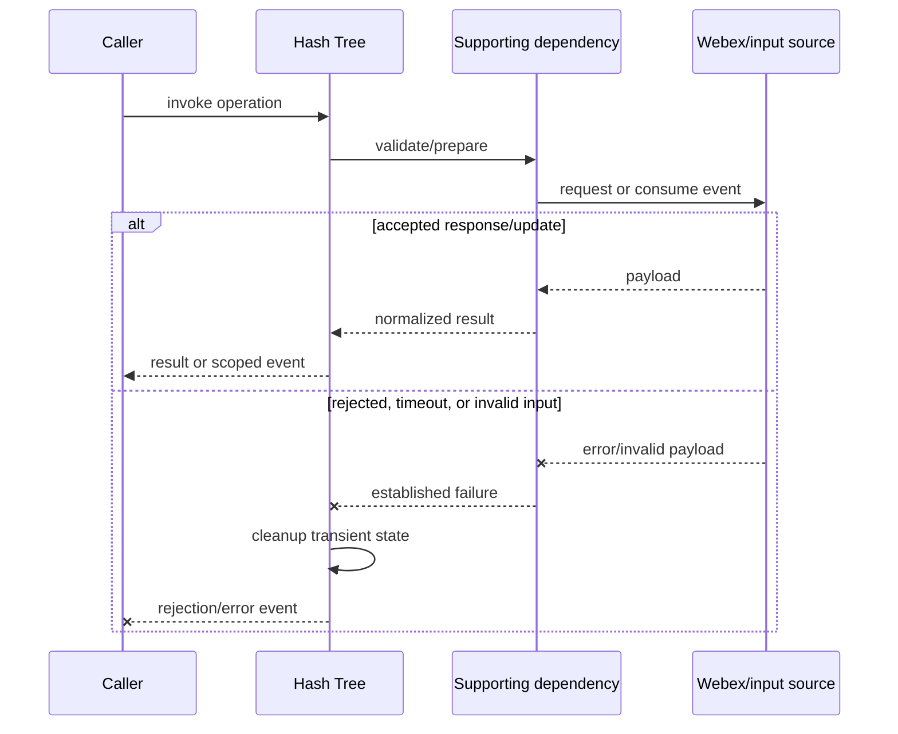
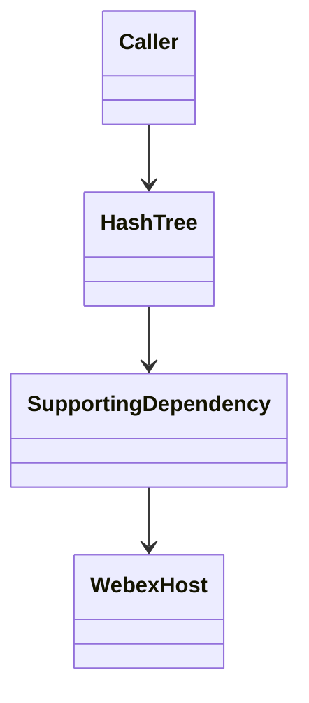
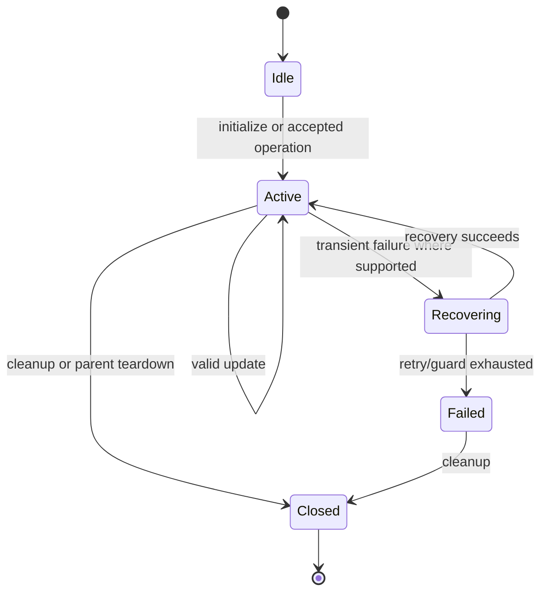

<!-- sdd-generated-metadata
doc_kind: module-spec
generated_from: module-spec@0.2.2
generator_plugin: repo-annotation@1.0.5+codex.20260818094939
generated_by: codex
approved_by: repository user
updated_at: 2026-08-18T15:33:39Z
validation_status: not-run
-->
# HASH TREE — SPEC

> Start here → root [`AGENTS.md`](../../../AGENTS.md) · router [`SPEC_INDEX.md`](../../../ai-docs/SPEC_INDEX.md) · system [`ARCHITECTURE.md`](../../../ai-docs/ARCHITECTURE.md). This is the canonical source-local spec for `src/hashTree/`.

## Metadata

| Field | Value |
|---|---|
| Module id | `hashTree` |
| Source path(s) | `src/hashTree/` |
| Parent spec | — |
| Doc kind | Module spec |
| Coverage score | 86% assessed 2026-08-18; 12/14 mandatory fields present; all critical fields present, two noncritical detail gaps remain |
| Generated from | `module-spec` @ SDLC template library `0.2.2` |
| generated_by / approved_by / updated_at | codex / repository user / 2026-08-18T15:33:39Z |
| Validation status | not-run |

## Evidence Rules

Requirements cite current implementation and mirrored unit-test paths. Current code wins over retained prose when they conflict; commit and PR history are excluded by repository-owner decision. Missing test evidence is stated as a gap rather than inferred.

## Source Material Register

| Source material | Scope | Decision | Detail location or disposition |
|---|---|---|---|
| No routed legacy module spec | overview / API / behavior / tests | none; generated from current hash-tree code and tests |
| Current source and mirrored tests | implementation / tests | verified | requirements, flows, failures, and test strategy below |

## Overview

For orientation, start at `src/hashTree/hashTree.ts`; supporting files under `src/hashTree/` separate request, parsing, collection, type, or utility concerns from parent orchestration. The module is composed by `Meeting`, `Meetings`, or the package entry as applicable. Remote Webex services/Locus remain authoritative, and all local state is scoped to the SDK, plugin, meeting, or operation lifetime.

## Purpose / Responsibility

Tracks incremental Locus dataset versions, detects gaps, fetches missing datasets, and emits typed update callbacks.

## Stack

TypeScript/JavaScript in the Node 22.14 Yarn workspace; Webex core/plugin abstractions and Mocha/Sinon/`@webex/test-helper-chai` tests. Build target: `yarn workspace @webex/plugin-meetings build:src`.

## Folder / Package Structure

```text
src/hashTree/
├── hashTree.ts — primary behavior/entry point
├── hashTreeParser.ts — request, parser, utility, or supporting behavior
└── ai-docs/hash-tree-spec.md — canonical module specification
```

## Key Files (source of truth)

| File | Holds |
|---|---|
| `src/hashTree/hashTree.ts` | Primary lifecycle and public/internal surface |
| `src/hashTree/hashTreeParser.ts` | Supporting transport, parser, or state behavior |
| `test/unit/spec/hashTree/hashTreeParser.ts` | Mirrored behavioral tests |
| `src/constants.ts` | Shared meeting/event/wire constants where consumed |

## Public Surface

| Contract ID | Type | Surface | Purpose | Compatibility / deprecation | Schema / detail link | Root index |
|---|---|---|---|---|---|---|
| `hashTree.1` | SDK / in-process / remote | parse hash-tree messages and objects | Preserve the module responsibility through a focused operation group | Consumer-visible methods/events are semver-sensitive when reachable from package objects | `src/hashTree/hashTree.ts` | [CONTRACTS](../../../ai-docs/CONTRACTS.md) |
| `hashTree.2` | SDK / in-process / remote | compare dataset versions and fetch missing data | Preserve the module responsibility through a focused operation group | Consumer-visible methods/events are semver-sensitive when reachable from package objects | `src/hashTree/hashTree.ts` | [CONTRACTS](../../../ai-docs/CONTRACTS.md) |
| `hashTree.3` | SDK / in-process / remote | apply dataset updates through callbacks | Preserve the module responsibility through a focused operation group | Consumer-visible methods/events are semver-sensitive when reachable from package objects | `src/hashTree/hashTree.ts` | [CONTRACTS](../../../ai-docs/CONTRACTS.md) |

Compatibility notes:
- Prefer additive options and payload fields. Preserve method/event names, rejection semantics, and cleanup timing; route public changes through `src/index.ts` or the documented owning object.

## Requires (dependencies)

Hash-tree wire messages, dataset request function, Locus identifiers, checksum utilities, and consumer callbacks.

## Requirements

| ID | WHAT | WHY | Source Evidence | Test / Example Evidence | Assumptions / Gaps | Confidence |
|---|---|---|---|---|---|---|
| `HASH-TREE-R-001` | parse hash-tree messages and objects. | Tracks incremental Locus dataset versions, detects gaps, fetches missing datasets, and emits typed update callbacks. | `src/hashTree/hashTree.ts` | `test/unit/spec/hashTree/hashTreeParser.ts` | none | PRESENT |
| `HASH-TREE-R-002` | compare dataset versions and fetch missing data. | Callers need deterministic observable behavior across async Webex inputs. | `src/hashTree/hashTree.ts`, `src/hashTree/hashTreeParser.ts` | `test/unit/spec/hashTree/hashTreeParser.ts` | additional edge cases may live in sibling tests | PRESENT |
| `HASH-TREE-R-003` | Failures reject/emit the established signal and release module-owned listeners, timers, or transient objects. | Hidden failure or leaked state causes later meeting operations to behave incorrectly. | `src/hashTree/hashTree.ts` | `test/unit/spec/hashTree/hashTreeParser.ts` | verify sibling test files for operation-specific cleanup | PRESENT |

## Design Overview

The primary entry point coordinates domain state and delegates transport/parsing to supporting files so those boundaries remain testable. Inputs are normalized before client state or events change. Async results preserve the established error signal, while teardown owns every listener, timer, or transient object allocated by this module.

## Data Flow


## Sequence Diagram(s)

Sequence coverage:

The operation groups below share the same caller → module → supporting dependency → Webex/input ordering and the same rejection/cleanup contract, so one combined diagram covers their common sequence; operation-specific state and guards are stated in the requirements and use cases.

| Operation group | Diagram | Failure / recovery coverage |
|---|---|---|
| parse hash-tree messages and objects | Primary operation | validation/service rejection and cleanup branch |
| compare dataset versions and fetch missing data | Async update | stale/error input is rejected or ignored according to current code |



## Class / Component Relationships



The primary module object owns its client state and composes/invokes supporting request, parser, collection, or utility code. The Webex host/service remains the authority for remote state.

## Use Cases

- **UC-1 Primary operation:** a consumer or parent module invokes parse hash-tree messages and objects; the module validates/delegates, normalizes the result, updates state where applicable, and returns or emits the established outcome. Evidence: `src/hashTree/hashTree.ts`, `test/unit/spec/hashTree/hashTreeParser.ts`.
- **UC-2 Async/change operation:** the parent or remote input triggers compare dataset versions and fetch missing data; the module reconciles it with current state and exposes one scoped result. Evidence: `src/hashTree/hashTree.ts`, `src/hashTree/hashTreeParser.ts`.

## State Model

Per-dataset sequence/hash metadata, pending synchronization work, and last applied objects are held in memory.

## Business Rules & Invariants

- A dataset update is applied only in a valid sequence; gaps or mismatches trigger synchronization rather than speculative state. Enforced by `src/hashTree/hashTree.ts` and supporting code under `src/hashTree/`.

## Concurrency & Reactive Flow

- Promise, event, media, and timer callbacks can interleave. Preserve existing sequence guards, make cleanup idempotent, and never start an unbounded retry/listener loop.
- Do not assume remote events are globally ordered unless the current parser/state code enforces ordering.

## State Machine



State labels summarize the module lifecycle; exact guards and values remain in `src/hashTree/hashTree.ts`.

## Protocol / Wire Format

- External payloads are parsed/serialized by files under `src/hashTree/` and existing Webex/media dependencies. Preserve current field names, enum/raw values, sequence identifiers, and compatibility behavior; do not treat the normalized client model as the wire schema.

## Error Handling & Failure Modes

| Condition | Signal | Caller recovery |
|---|---|---|
| invalid options or unsupported state | established validation/error rejection | correct input/state; do not retry unchanged |
| Webex/service/media rejection | propagated typed/request/media error | branch on the established error; retry only where module policy is bounded |
| timeout, stale update, or teardown race | timeout/rejection/ignored stale update per current path | re-read current meeting state; allow cleanup/recovery manager to finish |

## Pitfalls

- Sequence comparison includes rollover/ordering edge cases. Numeric or lexical comparison in place of the shared comparator corrupts reconciliation.
- Public behavior may be reachable through a parent `Meeting`/`Meetings` object even when the source helper is not exported directly.

## Key Design Trade-off

- Incremental datasets reduce full-state traffic but require version, checksum, and resynchronization bookkeeping.

## Test-Case Strategy (module)

Use the mirrored suite as the first characterization boundary. Cover each public operation with a successful result/state/event and a rejected/invalid branch; use fake timers for timeout/retry logic; assert listener/resource cleanup for async modules; keep request/parser fixtures representative without secrets.

| Behavior / Requirement | Existing test evidence | Gap |
|---|---|---|
| `HASH-TREE-R-001` | `test/unit/spec/hashTree/hashTreeParser.ts` | confirm sibling operation tests during focused changes |
| `HASH-TREE-R-002` | `test/unit/spec/hashTree/hashTreeParser.ts` | verify out-of-order/rejection edge where applicable |
| `HASH-TREE-R-003` | `test/unit/spec/hashTree/hashTreeParser.ts` | verify cleanup on every early-exit path |

## Traceability

- Repo architecture: [`ARCHITECTURE.md`](../../../ai-docs/ARCHITECTURE.md) · Registry: [`SPEC_INDEX.md`](../../../ai-docs/SPEC_INDEX.md)
- Coverage state and contracts baseline: `../../../.sdd/manifest.json`
