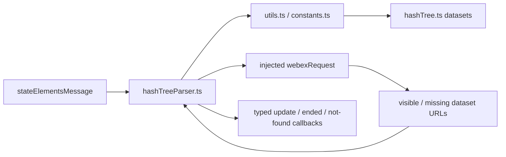
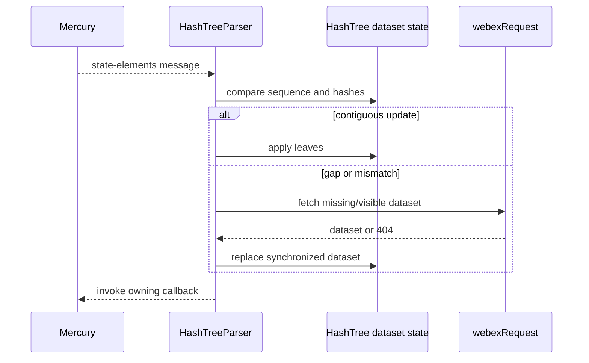
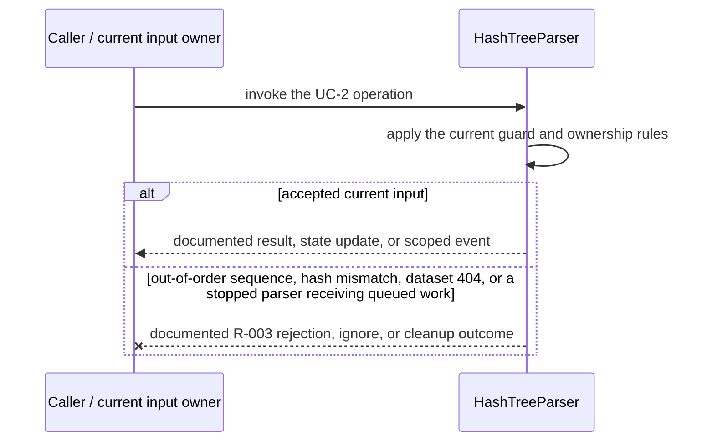
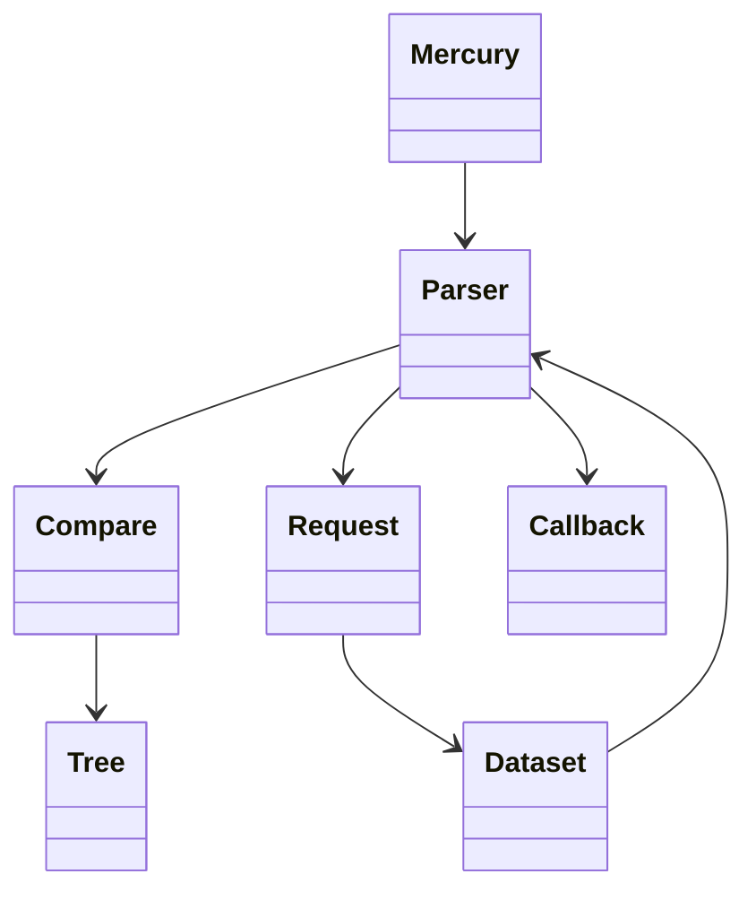
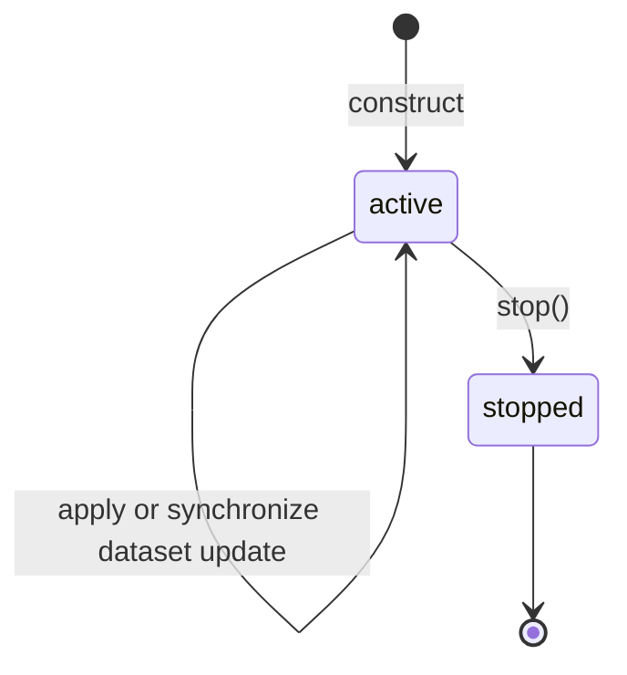

<!-- sdd-generated-metadata
doc_kind: module-spec
generated_from: module-spec@0.2.2
generator_plugin: repo-annotation@1.0.5+codex.20260818094939
generated_by: codex
approved_by: repository user
updated_at: 2026-08-21T06:10:05Z
validation_status: not-run
-->
# HASH TREE — SPEC

> Start here → root [`AGENTS.md`](../../../AGENTS.md) · router [`SPEC_INDEX.md`](../../../ai-docs/SPEC_INDEX.md) · system [`ARCHITECTURE.md`](../../../ai-docs/ARCHITECTURE.md). This is the canonical source-local spec for `src/hashTree/`.

## Metadata

| Field | Value |
|---|---|
| Module id | `hashTree` |
| Source path(s) | `src/hashTree/` |
| Parent spec | — |
| Doc kind | Module spec |
| Coverage score | 86% assessed 2026-08-21; 12/14 mandatory fields present; all critical fields present; one Important outcome-detail gap and one polish gap remain |
| Generated from | `module-spec` @ SDLC template library `0.2.2` |
| generated_by / approved_by / updated_at | codex / repository user / 2026-08-21T06:10:05Z |
| Validation status | not-run |

## Evidence Rules

Requirements cite current implementation and mirrored unit-test paths. Current code wins over retained prose when they conflict; commit and PR history are excluded by repository-owner decision. Missing test evidence is stated as a gap rather than inferred.

## Source Material Register

| Source material | Scope | Decision | Detail location or disposition |
|---|---|---|---|
| No routed legacy module spec | overview / API / behavior / tests | none; generated from current hash-tree code and tests |
| Current source and mirrored tests | implementation / tests | verified | requirements, flows, failures, and test strategy below |

## Overview

`src/hashTree/` contains 5 direct source/reference file(s) and has 3 mirrored unit-test file(s). This spec separates its public operations, runtime data movement, component ownership, state applicability, and verification boundary.

## Purpose / Responsibility

Tracks incremental Locus dataset versions, detects gaps, fetches missing datasets, and emits typed update callbacks.

## Stack

TypeScript/JavaScript in the Node 22.14 Yarn workspace; Webex core/plugin abstractions and Mocha/Sinon/`@webex/test-helper-chai` tests. Build target: `yarn workspace @webex/plugin-meetings build:src`.

## Folder / Package Structure

```text
src/hashTree/
├── constants.ts — module constants and wire values
├── hashTree.ts — hashTree implementation responsibility
├── hashTreeParser.ts — hashTreeParser implementation responsibility
├── types.ts — module type declarations
├── utils.ts — normalization/helper functions
└── ai-docs/hash-tree-spec.md — canonical module specification
```

## Key Files (source of truth)

| File | Holds |
|---|---|
| `src/hashTree/constants.ts` | module constants and wire values |
| `src/hashTree/hashTree.ts` | hashTree implementation responsibility |
| `src/hashTree/hashTreeParser.ts` | hashTreeParser implementation responsibility |
| `src/hashTree/types.ts` | module type declarations |
| `src/hashTree/utils.ts` | normalization/helper functions |
| `test/unit/spec/hashTree/hashTree.ts` and 2 sibling test file(s) | mirrored characterization/unit coverage |

## Public Surface

| Contract ID | Type | Surface | Purpose | Compatibility / deprecation | Schema / detail link | Root index |
|---|---|---|---|---|---|---|
| `hashTree.1` | SDK / in-process / remote | parse hash-tree messages and objects | Preserve the module responsibility through a focused operation group | Consumer-visible methods/events are semver-sensitive when reachable from package objects | `src/hashTree/hashTree.ts` | [CONTRACTS](../../../ai-docs/CONTRACTS.md) |
| `hashTree.2` | SDK / in-process / remote | compare dataset versions and fetch missing data | Preserve the module responsibility through a focused operation group | Consumer-visible methods/events are semver-sensitive when reachable from package objects | `src/hashTree/hashTree.ts` | [CONTRACTS](../../../ai-docs/CONTRACTS.md) |
| `hashTree.3` | SDK / in-process / remote | apply dataset updates through callbacks | Preserve the module responsibility through a focused operation group | Consumer-visible methods/events are semver-sensitive when reachable from package objects | `src/hashTree/hashTree.ts` | [CONTRACTS](../../../ai-docs/CONTRACTS.md) |

Compatibility notes:
- Prefer additive options and payload fields. Preserve method/event names, rejection semantics, and cleanup timing; route public changes through `src/index.ts` or the documented owning object.

## Requires (dependencies)

Hash-tree wire messages, dataset request function, Locus identifiers, checksum utilities, and consumer callbacks.

## Requirements

| ID | WHAT | WHY | Source Evidence | Test / Example Evidence | Assumptions / Gaps | Confidence |
|---|---|---|---|---|---|---|
| `HASH-TREE-R-001` | parse hash-tree messages and objects. | Tracks incremental Locus dataset versions, detects gaps, fetches missing datasets, and emits typed update callbacks. | `src/hashTree/hashTree.ts` | `test/unit/spec/hashTree/hashTreeParser.ts` | none | PRESENT |
| `HASH-TREE-R-002` | compare dataset versions and fetch missing data. | Callers need deterministic observable behavior across async Webex inputs. | `src/hashTree/hashTree.ts`, `src/hashTree/hashTreeParser.ts` | `test/unit/spec/hashTree/hashTreeParser.ts` | additional edge cases may live in sibling tests | PRESENT |
| `HASH-TREE-R-003` | Dataset request failures reject or invoke the established ended/not-found path; stopping the parser prevents later queued work from being applied. | Callers must receive the actual module failure outcome without false cleanup or event guarantees. | `src/hashTree/` | `test/unit/spec/hashTree/hashTreeParser.ts` | none | PRESENT |

## Design Overview

`HashTreeParser` consumes state-element messages, compares dataset versions with `utils.ts`, stores per-dataset hash metadata in `hashTree.ts`, fetches visible or missing datasets through its injected `webexRequest`, and reports normalized changes through callbacks.

## Data Flow



## Sequence Diagram(s)

Sequence coverage:

| Operation group | Diagram | Failure coverage |
|---|---|---|
| UC-1 — primary operation | Primary operation sequence | accepted and rejected dependency outcomes |
| UC-2 — secondary/change operation | Secondary operation and failure sequence | out-of-order sequence, hash mismatch, dataset 404, or a stopped parser receiving queued work |

### Primary operation sequence



### Secondary operation and failure sequence



## Class / Component Relationships



The arrows identify ownership and delegation inside `src/hashTree/`; files that only declare types or constants are not presented as transports.

## Use Cases

- **UC-1:** Apply contiguous dataset updates and invoke callbacks only after hash/sequence validation. Evidence: `src/hashTree/`.
- **UC-2:** Queue synchronization when a gap is detected; convert ended or missing Locus responses into the dedicated internal errors/callbacks. Evidence: `src/hashTree/`.

## State Model

Per-dataset sequence/hash metadata, pending synchronization work, and last applied objects are held in memory.

## Business Rules & Invariants

- A dataset update is applied only in a valid sequence; gaps or mismatches trigger synchronization rather than speculative state. Enforced by `src/hashTree/hashTree.ts` and supporting code under `src/hashTree/`.

## Concurrency & Reactive Flow

- Async work owned by `HashTreeParser` may complete after a newer caller or remote input. Preserve the identity, sequence, and resource-owner guards in `src/hashTree/`; a late completion must not replay UC-2 for superseded state.

## State Machine



The parser stores only `active` or `stopped` in `src/hashTree/hashTreeParser.ts`.

## Protocol / Wire Format

- External payloads are parsed/serialized by files under `src/hashTree/` and existing Webex/media dependencies. Preserve current field names, enum/raw values, sequence identifiers, and compatibility behavior; do not treat the normalized client model as the wire schema.

## Error Handling & Failure Modes

| Condition | Signal | Caller recovery |
|---|---|---|
| out-of-order sequence, hash mismatch, dataset 404, or a stopped parser receiving queued work | Follow the concrete rejection, ignore, state, or cleanup behavior in the module's R-003 requirement. | Resolve the named condition; retry only when another requirement defines a bound. |
| UC-1 succeeds | Return, update, callback, or scoped event identified by the Public Surface and primary sequence. | Continue from the owning module's accepted state. |

## Pitfalls

- Sequence comparison includes rollover/ordering edge cases. Numeric or lexical comparison in place of the shared comparator corrupts reconciliation.
- Public behavior may be reachable through a parent `Meeting`/`Meetings` object even when the source helper is not exported directly.

## Key Design Trade-off

- Incremental datasets reduce full-state traffic but require version, checksum, and resynchronization bookkeeping.

## Test-Case Strategy (module)

Use the current mirrored suites: `test/unit/spec/hashTree/hashTree.ts`, `test/unit/spec/hashTree/hashTreeParser.ts`, `test/unit/spec/hashTree/utils.ts`. Characterize the two code-grounded use cases above and the listed failure condition; add cleanup or transition cases only for resources and state this module actually owns.

| Behavior / Requirement | Existing test evidence | Gap |
|---|---|---|
| `HASH-TREE-R-001` | `test/unit/spec/hashTree/hashTreeParser.ts` | confirm the named operation against its owning sibling suite |
| `HASH-TREE-R-002` | `test/unit/spec/hashTree/hashTreeParser.ts` | verify the code-grounded rejection or stale-input branch |
| `HASH-TREE-R-003` | `test/unit/spec/hashTree/hashTreeParser.ts` | verify the concrete R-003 rejection, ignore, or cleanup outcome |

## Traceability

- Repo architecture: [`ARCHITECTURE.md`](../../../ai-docs/ARCHITECTURE.md) · Registry: [`SPEC_INDEX.md`](../../../ai-docs/SPEC_INDEX.md)
- Coverage state and contracts baseline: `../../../.sdd/manifest.json`
