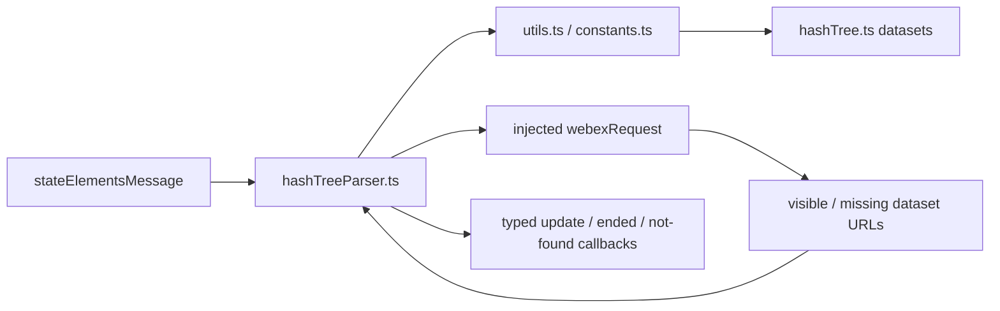
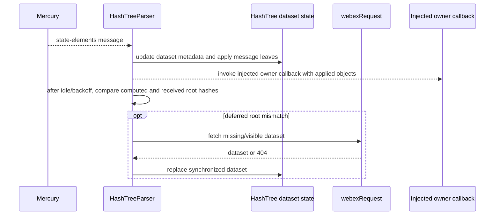
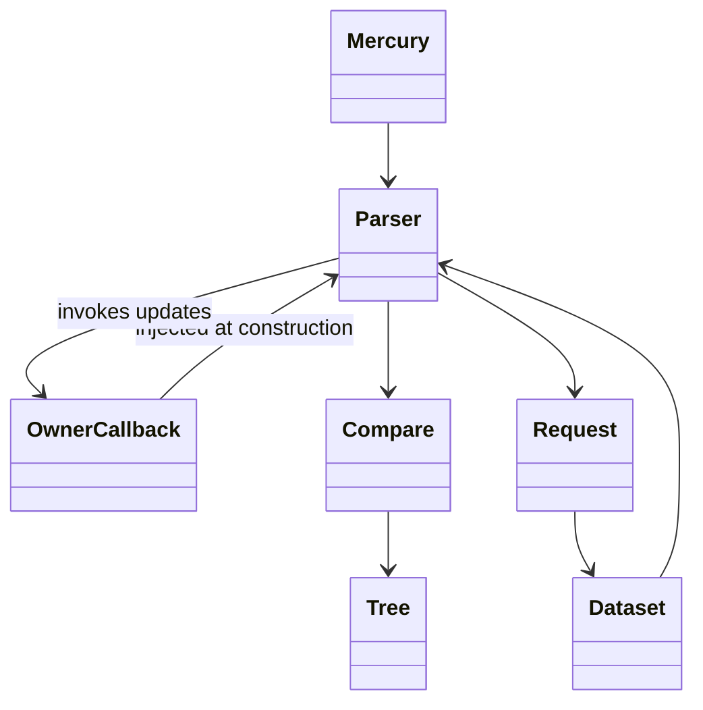
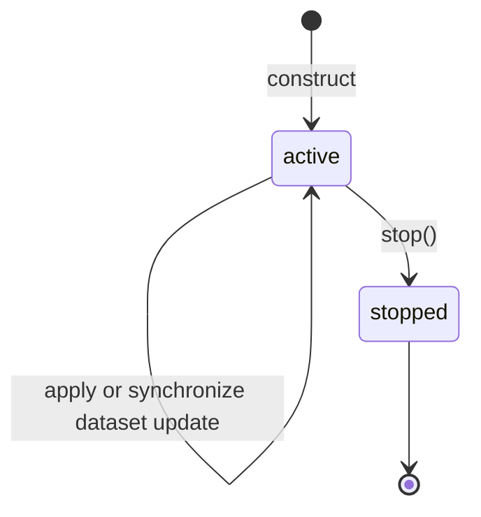

<!-- sdd-generated-metadata
doc_kind: module-spec
generated_from: module-spec@0.2.2
generator_plugin: repo-annotation@1.0.5+codex.20260818094939
generated_by: codex
approved_by: repository user
updated_at: 2026-08-22T15:21:29Z
validation_status: pass-with-warnings
-->
# HASH TREE — SPEC

> Start here → root [`AGENTS.md`](../../../AGENTS.md) · router [`SPEC_INDEX.md`](../../../ai-docs/SPEC_INDEX.md) · system [`ARCHITECTURE.md`](../../../ai-docs/ARCHITECTURE.md). This is the canonical source-local spec for `src/hashTree/`.

## Metadata

| Field | Value |
|---|---|
| Module id | `hashTree` |
| Source path(s) | `src/hashTree/` |
| Parent spec | — |
| Doc kind | Module spec |
| Coverage score | 93% assessed 2026-08-22; 13/14 mandatory fields present; all critical and Important fields present; one noncritical polish gap remains; pending independent validation of the participant-role repair |
| Generated from | `module-spec` @ SDLC template library `0.2.2` |
| generated_by / approved_by / updated_at | codex / repository user / 2026-08-22T15:21:29Z |
| Validation status | pass-with-warnings |

## Evidence Rules

Requirements cite current implementation and mirrored unit-test paths. Current code wins over retained prose when they conflict; commit and PR history are excluded by repository-owner decision. Missing test evidence is stated as a gap rather than inferred.

## Source Material Register

| Source material | Scope | Decision | Detail location or disposition |
|---|---|---|---|
| No routed legacy module spec | overview / API / behavior / tests | none; generated from current hash-tree code and tests |
| Current source and mirrored tests | implementation / tests | verified | requirements, flows, failures, and test strategy below |

## Overview

`src/hashTree/` contains 5 direct source/reference file(s) and has 3 mirrored unit-test file(s). This spec separates its public operations, runtime data movement, component ownership, state applicability, and verification boundary.

## Purpose / Responsibility

Tracks incremental Locus dataset versions, detects gaps, fetches missing datasets, and emits typed update callbacks.

## Stack

TypeScript/JavaScript in the Node 22.14 Yarn workspace; Webex core/plugin abstractions and Mocha/Sinon/`@webex/test-helper-chai` tests. Build target: `yarn workspace @webex/plugin-meetings build:src`.

## Folder / Package Structure

```text
src/hashTree/
├── constants.ts — module constants and wire values
├── hashTree.ts — hashTree implementation responsibility
├── hashTreeParser.ts — hashTreeParser implementation responsibility
├── types.ts — module type declarations
├── utils.ts — normalization/helper functions
└── ai-docs/hash-tree-spec.md — canonical module specification
```

## Key Files (source of truth)

| File | Holds |
|---|---|
| `src/hashTree/constants.ts` | module constants and wire values |
| `src/hashTree/hashTree.ts` | hashTree implementation responsibility |
| `src/hashTree/hashTreeParser.ts` | hashTreeParser implementation responsibility |
| `src/hashTree/types.ts` | module type declarations |
| `src/hashTree/utils.ts` | normalization/helper functions |
| `test/unit/spec/hashTree/hashTree.ts` and 2 sibling test file(s) | mirrored characterization/unit coverage |

## Public Surface

| Contract ID | Type | Surface | Purpose | Compatibility / deprecation | Schema / detail link | Root index |
|---|---|---|---|---|---|---|
| `hashTree.1` | in-memory structure | `HashTree.putItem()`, `putItems()`, `removeItem()`, `removeItems()`, and `updateItems()` | Apply version-aware leaf mutations to the pure hash-tree data structure. | Older/equal item versions do not replace newer data; preserve leaf-bucket semantics. | `src/hashTree/hashTree.ts` | [CONTRACTS](../../../ai-docs/CONTRACTS.md) |
| `hashTree.2` | in-memory structure | `computeLeafHash()`, `computeTreeHashes()`, `getHashes()`, `getRootHash()`, `getLeafCount()`, `getTotalItemCount()`, `getLeafData()`, and `getItemVersion()` | Compute and inspect dataset hashes and stored item/version information. | Hash ordering and result shapes are synchronization contracts. | `src/hashTree/hashTree.ts` | [CONTRACTS](../../../ai-docs/CONTRACTS.md) |
| `hashTree.3` | in-memory structure | `HashTree.resize()` and `diffHashes()` | Resize the leaf layout and locate differing hash ranges during synchronization. | Preserve deterministic redistribution and diff-index semantics. | `src/hashTree/hashTree.ts` | [CONTRACTS](../../../ai-docs/CONTRACTS.md) |
| `hashTree.4` | parser initialization | `HashTreeParser.initializeFromMessage()` and `initializeFromGetLociResponse()` | Seed dataset state from Mercury hash-tree metadata or a get-loci response before applying deltas. | Preserve dataset initialization priority and callback timing. | `src/hashTree/hashTreeParser.ts` | [CONTRACTS](../../../ai-docs/CONTRACTS.md) |
| `hashTree.5` | parser updates | `handleMetadataUpdate()`, `handleLocusUpdate()`, and `handleMessage()` | Apply message items, emit the resulting callback, and schedule any root-hash reconciliation required for the dataset. | Preserve the implemented ordering: `parseMessage()` mutates item state, `handleMessage()` invokes the callback, and the delayed sync algorithm checks the resulting root hash separately. | `src/hashTree/hashTreeParser.ts` | [CONTRACTS](../../../ai-docs/CONTRACTS.md) |
| `hashTree.6` | parser synchronization | `syncAllDatasets()`, `resumeFromMessage()`, and `resumeFromApiResponse()` | Fetch/replace missing datasets and resume queued processing from the synchronized view. | Preserve ended/not-found sentinel handling and stopped-parser guards. | `src/hashTree/hashTreeParser.ts` | [CONTRACTS](../../../ai-docs/CONTRACTS.md) |
| `hashTree.7` | parser lifecycle | `stop()` and `cleanUp()` | Stop future mutation and release queued/parser-owned state. | Work completed after stop must not mutate the stopped parser. | `src/hashTree/hashTreeParser.ts` | [CONTRACTS](../../../ai-docs/CONTRACTS.md) |
| `hashTree.8` | exported contracts/helpers | `EMPTY_HASH`, `DataSetNames`, `DATA_SET_INIT_PRIORITY`, `LLM_DATASET_NAMES`, `LeafDataItem`, `SyncAllBackoffType`, `DataSet`, `RootHashMessage`, `HashTreeMessage`, `VisibleDataSetInfo`, `LocusInfoUpdateType`, `LocusInfoUpdate`, `LocusInfoUpdateCallback`, `SyncLatencyTracker`, `HashTreeParserCallbacks`, `MeetingEndedError`, `LocusNotFoundError`, `ObjectType`, `ObjectTypeToLocusKeyMap`, `HtMeta`, `HashTreeObject`, `isSelf()`, `isMetadata()`, `deleteNestedObjectsWithHtMeta()`, `sortByInitPriority()`, and `sleep()` | Share the exact dataset protocol vocabulary, sentinel errors, and normalization helpers used by Locus integration. | Preserve dataset names, error identity, ordering, and raw message fields. | `src/hashTree/hashTree.ts`, `src/hashTree/hashTreeParser.ts`, `src/hashTree/types.ts`, `src/hashTree/constants.ts`, `src/hashTree/utils.ts` | [CONTRACTS](../../../ai-docs/CONTRACTS.md) |

Compatibility notes:
- Prefer additive options and payload fields. Preserve method/event names, rejection semantics, and cleanup timing; route public changes through `src/index.ts` or the documented owning object.

## Requires (dependencies)

Hash-tree wire messages, dataset request function, Locus identifiers, checksum utilities, and consumer callbacks.

## Requirements

| ID | WHAT | WHY | Source Evidence | Test / Example Evidence | Assumptions / Gaps | Confidence |
|---|---|---|---|---|---|---|
| `HASH-TREE-R-001` | `HashTreeParser` parses hash-tree messages, tracks dataset versions, detects gaps, fetches datasets, and emits typed update callbacks; `HashTree` stores leaf items and computes leaf/tree hashes. | Parser synchronization behavior and the hash data structure have different ownership and must not be attributed to the same file. | `src/hashTree/hashTreeParser.ts`, `src/hashTree/hashTree.ts` | `test/unit/spec/hashTree/hashTreeParser.ts`, `test/unit/spec/hashTree/hashTree.ts` | none | PRESENT |
| `HASH-TREE-R-002` | `HashTreeParser.parseMessage()` updates dataset metadata and applies message items; `handleMessage()` then invokes the object-update callback. `runSyncAlgorithm()` performs the root-hash comparison later after the configured idle/backoff delay and queues synchronization on mismatch. | Callers need the real callback-versus-reconciliation ordering and must not assume the callback waits for the deferred root-hash check. | `src/hashTree/hashTreeParser.ts`, `src/hashTree/hashTree.ts`, `src/hashTree/utils.ts` | `test/unit/spec/hashTree/hashTreeParser.ts`, `test/unit/spec/hashTree/hashTree.ts`, `test/unit/spec/hashTree/utils.ts` | none | PRESENT |
| `HASH-TREE-R-003` | `performSync()` converts meeting-ended/not-found responses into their sentinel callback paths, catches and logs other synchronization failures, and prevents stopped-parser work from being applied. | Sentinel dataset outcomes, logged sync failure, and stopped work must remain distinct so no failed fetch is misreported as a caller-visible rejection or current state. | `src/hashTree/hashTreeParser.ts` | `test/unit/spec/hashTree/hashTreeParser.ts` | non-sentinel failure recovery after logging needs explicit queue coverage | PRESENT |

## Design Overview

`HashTreeParser` consumes state-element messages, compares dataset versions with `utils.ts`, stores per-dataset hash metadata in `hashTree.ts`, fetches visible or missing datasets through its injected `webexRequest`, and reports normalized changes through callbacks.

## Data Flow



## Sequence Diagram(s)

Sequence coverage:

| Operation group | Diagram | Failure coverage |
|---|---|---|
| UC-1…UC-5 — hash-tree mutation and synchronization operation groups | Hash-tree mutation and synchronization primary sequence | stale/gapped metadata, ended/not-found datasets, logged sync failure, and stopped-parser suppression |
| UC-1…UC-5 — hash-tree mutation and synchronization alternate/failure paths | Hash-tree mutation and synchronization alternate/failure sequence | out-of-order sequence, hash mismatch, dataset 404, or a stopped parser receiving queued work |

### Hash-tree mutation and synchronization primary sequence



### Hash-tree mutation and synchronization alternate/failure sequence

```mermaid
sequenceDiagram
  participant Q as Queued state-elements message
  participant P as HashTreeParser
  participant W as Injected webexRequest
  participant C as Owning callback
  Q->>P: next sequence and hash-tree elements
  P->>P: apply message items and schedule root-hash check
  P-->>C: object update callback
  alt later root check or visible-dataset change requires synchronization
    P->>W: fetch dataset URL
    W-->>P: dataset, sentinel error, or non-sentinel rejection
    alt dataset succeeds
      P-->>C: synchronized object update callback
    else ended or not-found sentinel
      P-->>C: ended or not-found callback
    else non-sentinel rejection
      P->>P: log failure; invoke no owner callback
    end
  else parser has been stopped
    P->>P: discard queued work without applying it
  end
```

## Class / Component Relationships



The arrows identify ownership and delegation inside `src/hashTree/`; files that only declare types or constants are not presented as transports.

## Use Cases

- **UC-1:** Insert, update, remove, resize, and diff versioned items in the pure `HashTree` without invoking remote synchronization. Evidence: `src/hashTree/hashTree.ts`.
- **UC-2:** Initialize parser datasets from a Mercury message or get-loci response in declared dataset priority. Evidence: `src/hashTree/hashTreeParser.ts`, `src/hashTree/constants.ts`.
- **UC-3:** Apply message items in `parseMessage()` and invoke the normalized Locus callback from `handleMessage()` before the delayed root-hash reconciliation runs. Evidence: `src/hashTree/hashTreeParser.ts`.
- **UC-4:** Queue and synchronize missing datasets when a gap/hash mismatch is detected, mapping ended/not-found sentinels to their callback paths. Evidence: `src/hashTree/hashTreeParser.ts`.
- **UC-5:** Stop and clean up a parser so queued or later-completing work cannot mutate its state. Evidence: `src/hashTree/hashTreeParser.ts`.

## State Model

Per-dataset sequence/hash metadata, pending synchronization work, and last applied objects are held in memory.

## Business Rules & Invariants

- `HashTreeParser` applies only newer item versions and emits the applied-object callback for the received message. Root-hash mismatch detection is a later idle/backoff task that can enqueue synchronization; it is not a precondition for the first callback. Enforced by `src/hashTree/hashTreeParser.ts` and `src/hashTree/hashTree.ts`.

## Concurrency & Reactive Flow

- State-elements work applies through `parseMessage()` and callbacks synchronously within `handleMessage()`, while root-hash reconciliation is deferred by dataset timers. `stop()` prevents queued or subsequently completed dataset work from mutating the stopped parser.

## State Machine



The parser stores only `active` or `stopped` in `src/hashTree/hashTreeParser.ts`.

## Protocol / Wire Format

- External payloads are parsed/serialized by files under `src/hashTree/` and existing Webex/media dependencies. Preserve current field names, enum/raw values, sequence identifiers, and compatibility behavior; do not treat the normalized client model as the wire schema.

## Error Handling & Failure Modes

| Condition | Signal | Caller recovery |
|---|---|---|
| Sequence or hash comparison requires a missing/visible dataset | `hashTreeParser.ts` fetches the dataset through the injected request function before replacing the synchronized dataset. | Let the synchronization request settle; do not apply the incomplete delta directly. |
| Dataset fetch returns 404 or the dataset has ended | The parser invokes its established not-found/ended callback path. | The owner decides whether to stop or establish a new dataset. |
| Dataset fetch fails outside the ended/not-found sentinels, or queued work reaches a stopped parser | `performSync()` catches/logs the fetch failure; stopped-parser work is not applied. | Observe parser diagnostics and establish a new synchronization trigger if the owner still needs current state. |

## Pitfalls

- Sequence comparison includes rollover/ordering edge cases. Numeric or lexical comparison in place of the shared comparator corrupts reconciliation.
- Public behavior may be reachable through a parent `Meeting`/`Meetings` object even when the source helper is not exported directly.

## Key Design Trade-off

- Incremental datasets reduce full-state traffic but require version, checksum, and resynchronization bookkeeping.

## Test-Case Strategy (module)

Use the current mirrored suites: `test/unit/spec/hashTree/hashTree.ts`, `test/unit/spec/hashTree/hashTreeParser.ts`, `test/unit/spec/hashTree/utils.ts`. Characterize the hashTree-specific use cases above and each listed failure condition; add cleanup or transition cases only for resources and state this module actually owns.

| Behavior / Requirement | Existing test evidence | Gap |
|---|---|---|
| `HASH-TREE-R-001` | `test/unit/spec/hashTree/hashTreeParser.ts` | cover versioned put/remove/resize/diff separately from parser synchronization |
| `HASH-TREE-R-002` | `test/unit/spec/hashTree/hashTreeParser.ts` | non-sentinel synchronization failures are logged internally; verify queue behavior after that failure |
| `HASH-TREE-R-003` | `test/unit/spec/hashTree/hashTreeParser.ts` | separate sentinel callback handling, logged non-sentinel sync failure, and stopped-parser suppression cases |

## Traceability

- Repo architecture: [`ARCHITECTURE.md`](../../../ai-docs/ARCHITECTURE.md) · Registry: [`SPEC_INDEX.md`](../../../ai-docs/SPEC_INDEX.md)
- Coverage state and contracts baseline: `../../../.sdd/manifest.json`
