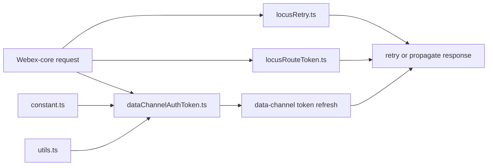
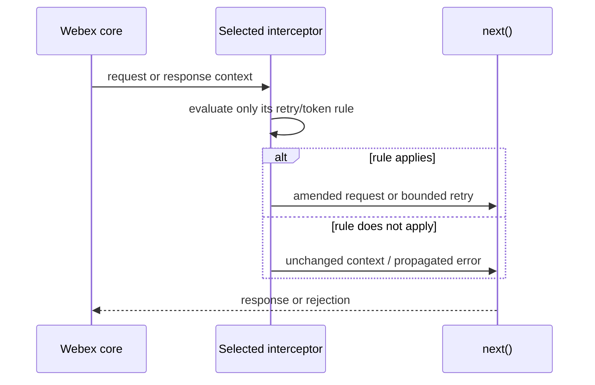
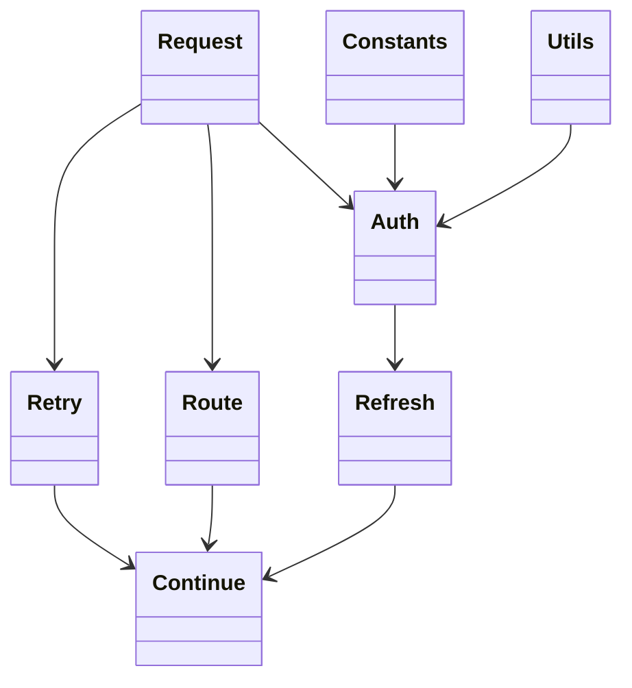

<!-- sdd-generated-metadata
doc_kind: module-spec
generated_from: module-spec@0.2.2
generator_plugin: repo-annotation@1.0.5+codex.20260818094939
generated_by: codex
approved_by: repository user
updated_at: 2026-08-22T15:21:29Z
validation_status: pass-with-warnings
-->
# INTERCEPTORS — SPEC

> Start here → root [`AGENTS.md`](../../../AGENTS.md) · router [`SPEC_INDEX.md`](../../../ai-docs/SPEC_INDEX.md) · system [`ARCHITECTURE.md`](../../../ai-docs/ARCHITECTURE.md). This is the canonical source-local spec for `src/interceptors/`.

## Metadata

| Field | Value |
|---|---|
| Module id | `interceptors` |
| Source path(s) | `src/interceptors/` |
| Parent spec | — |
| Doc kind | Module spec |
| Coverage score | 93% assessed 2026-08-22; 13/14 mandatory fields present; all critical and Important fields present; one noncritical polish gap remains; pending independent validation of the participant-role repair |
| Generated from | `module-spec` @ SDLC template library `0.2.2` |
| generated_by / approved_by / updated_at | codex / repository user / 2026-08-22T15:21:29Z |
| Validation status | pass-with-warnings |

## Evidence Rules

Requirements cite current source and mirrored tests. Current code wins over retained prose when they conflict; commit and PR history are excluded. Missing evidence stays a gap.

## Source Material Register

| Source material | Scope | Decision | Detail location or disposition |
|---|---|---|---|
| No routed legacy module spec | overview / API / behavior / tests | none; generated from current interceptors/constants/utilities and tests |
| Current source and mirrored tests | implementation / tests | verified | requirements, flows, failures, and test strategy below |

## Overview

`src/interceptors/` contains 6 direct source/reference file(s) and has 4 mirrored unit-test file(s). This spec separates its public operations, runtime data movement, component ownership, state applicability, and verification boundary.

## Purpose / Responsibility

Provides Webex-core request middleware for bounded Locus retries, Locus route-token propagation, and data-channel auth-token refresh.

## Stack

TypeScript/JavaScript in the Node 22.14 Yarn workspace; Webex core/plugin abstractions and Mocha/Sinon/`@webex/test-helper-chai` tests.

## Folder / Package Structure

```text
src/interceptors/
├── constant.ts — interceptor constants
├── dataChannelAuthToken.ts — dataChannelAuthToken implementation responsibility
├── index.ts — module facade/controller or primary exports
├── locusRetry.ts — locusRetry implementation responsibility
├── locusRouteToken.ts — locusRouteToken implementation responsibility
├── utils.ts — normalization/helper functions
└── ai-docs/interceptors-spec.md — canonical module specification
```

## Key Files (source of truth)

| File | Holds |
|---|---|
| `src/interceptors/constant.ts` | interceptor constants |
| `src/interceptors/dataChannelAuthToken.ts` | dataChannelAuthToken implementation responsibility |
| `src/interceptors/index.ts` | module facade/controller or primary exports |
| `src/interceptors/locusRetry.ts` | locusRetry implementation responsibility |
| `src/interceptors/locusRouteToken.ts` | locusRouteToken implementation responsibility |
| `src/interceptors/utils.ts` | normalization/helper functions |
| `test/unit/spec/interceptors/dataChannelAuthToken.ts` and 3 sibling test file(s) | mirrored characterization/unit coverage |

## Public Surface

| Contract ID | Type | Surface | Purpose | Compatibility / deprecation | Schema / detail link | Root index |
|---|---|---|---|---|---|---|
| `interceptors.1` | request interceptor | `LocusRetryStatusInterceptor.create()`, `onResponseError()`, and `handleRetryRequestLocusServiceError()` | Retry one eligible Locus 429/503 response while excluding hash-tree/sync recovery routes. | Preserve the instance-local one-retry `WeakMap` guard and server delay handling. | `src/interceptors/locusRetry.ts` | [CONTRACTS](../../../ai-docs/CONTRACTS.md) |
| `interceptors.2` | request/response interceptor | `LocusRouteTokenInterceptor.create()`, `getLocusIdByRequestUrl()`, `getLocusIdByResponseBody()`, `getHeader()`, `onResponse()`, `onRequest()`, `updateToken()`, and `getToken()` | Capture route tokens by Locus id and attach only the token matching the outgoing request. | Never leak a token across Locus ids; preserve response/header parsing. | `src/interceptors/locusRouteToken.ts` | [CONTRACTS](../../../ai-docs/CONTRACTS.md) |
| `interceptors.3` | auth interceptor | `DataChannelAuthTokenInterceptor.create()`, `onRequest()`, `onResponseError()`, and `refreshTokenAndRetryWithDelay()` | Attach a usable data-channel token and perform the bounded refresh/retry path after auth failure. | Preserve `MAX_RETRY = 1`, `RETRY_INTERVAL = 2000`, and per-options retry bookkeeping. | `src/interceptors/dataChannelAuthToken.ts` | [CONTRACTS](../../../ai-docs/CONTRACTS.md) |
| `interceptors.4` | exported utility | `isJwtTokenExpired()` | Treat a token as expired when its JWT expiry is within the 30-second safety buffer. | Preserve malformed-token handling and the exact buffer used before request dispatch. | `src/interceptors/utils.ts` | [CONTRACTS](../../../ai-docs/CONTRACTS.md) |
| `interceptors.5` | exported constants | `DATA_CHANNEL_AUTH_HEADER`, `MAX_RETRY`, `RETRY_INTERVAL`, and `RETRY_KEY` | Share the exact header and bounded-retry settings used by the auth interceptor. | Header/key values and retry limits are observable request behavior. | `src/interceptors/constant.ts` | [CONTRACTS](../../../ai-docs/CONTRACTS.md) |

Compatibility notes:
- Prefer additive fields/options and preserve current return and rejection semantics. Internal helpers are not public merely because they are exported within the source directory.

## Requires (dependencies)

Webex core Interceptor/request pipeline, JWT decoding/verification helpers, Meetings token state/services, request URLs/headers, timers, and retry constants.

## Requirements

| ID | WHAT | WHY | Source Evidence | Test / Example Evidence | Assumptions / Gaps | Confidence |
|---|---|---|---|---|---|---|
| `INTERCEPTORS-R-001` | retry eligible Locus failures using server delay/status rules. | Provides Webex-core request middleware for bounded Locus retries, Locus route-token propagation, and data-channel auth-token refresh. | `src/interceptors/index.ts` | `test/unit/spec/interceptors/dataChannelAuthToken.ts` | none | PRESENT |
| `INTERCEPTORS-R-002` | capture and attach route tokens keyed by Locus id. | A route or auth token attached to the wrong request can leak authority across meetings or retry indefinitely. | `src/interceptors/index.ts`, `src/interceptors/dataChannelAuthToken.ts` | `test/unit/spec/interceptors/dataChannelAuthToken.ts` | 30-second JWT boundary and refresh-key removal need explicit boundary coverage | PRESENT |
| `INTERCEPTORS-R-003` | Failures outside the eligible retry branches reject with the original reason. For an eligible Locus 429/503 after this interceptor instance has already retried once, `LocusRetryStatusInterceptor.onResponseError()` clears its retry flag and rejects with the request `options` object rather than the original HTTP reason. Retry counters and token-refresh retries remain bounded per interceptor. | Bounded, request-scoped retry state prevents loops, while documenting the already-retried branch avoids a false unchanged-error guarantee. | `src/interceptors/locusRetry.ts`, `src/interceptors/dataChannelAuthToken.ts` | `test/unit/spec/interceptors/locusRetry.ts`, `test/unit/spec/interceptors/dataChannelAuthToken.ts` | none | PRESENT |
| `INTERCEPTORS-R-004` | Locus retry handles one eligible 429/503 retry per interceptor instance using the `WeakMap` flag and the response `retry-after` value (default 2000 ms); Locus `/hashtree` and `/sync` 429/5xx responses are excluded. | Global request middleware must not amplify synchronization storms, retry terminal failures, or loop indefinitely. | `src/interceptors/locusRetry.ts` | `test/unit/spec/interceptors/locusRetry.ts` | none | PRESENT |
| `INTERCEPTORS-R-005` | Route tokens are extracted from supported Locus responses, keyed by Locus id, and attached only to matching requests. | Loose routing could omit a required token or leak it to an unrelated request. | `src/interceptors/locusRouteToken.ts` | `test/unit/spec/interceptors/locusRouteToken.ts` | none | PRESENT |
| `INTERCEPTORS-R-006` | Data-channel JWTs are treated as expired when `exp` is within the 30-second (`30 * 1000`) buffer, refreshed when needed, and retried once after 2000 ms on eligible 401/403 responses. | Refreshing before expiry avoids a request racing token expiration without creating an authentication retry storm. | `src/interceptors/dataChannelAuthToken.ts`, `src/interceptors/utils.ts`, `src/interceptors/constant.ts` | `test/unit/spec/interceptors/dataChannelAuthToken.ts`, `test/unit/spec/interceptors/utils.ts` | none | PRESENT |

## Design Overview

`index.ts` only exports three independent Webex-core interceptors. `locusRetry.ts` bounds eligible retries, `locusRouteToken.ts` stores/attaches tokens by Locus id, and `dataChannelAuthToken.ts` refreshes expiring channel credentials; none is a controller for the others.

## Data Flow



## Sequence Diagram(s)

Sequence coverage:

| Operation group | Diagram | Failure coverage |
|---|---|---|
| UC-1…UC-4 — request interceptor operation groups | Request interceptor primary sequence | ineligible Locus status, token mismatch/expiry, refresh failure, and retry exhaustion |
| UC-1…UC-4 — request interceptor alternate/failure paths | Request interceptor alternate/failure sequence | non-retryable status, exhausted retry count, missing Locus-token match, or failed data-channel token refresh |

### Request interceptor primary sequence



### Request interceptor alternate/failure sequence

```mermaid
sequenceDiagram
  participant W as Webex request pipeline
  participant I as Locus / data-channel interceptor
  participant T as Token refresh
  W->>I: response failure or authenticated request
  alt eligible Locus 429/503 outside /hashtree and /sync with no prior retry
    I->>I: wait Retry-After or 2000 ms; retry once
    I-->>W: retry result or rejection
  else eligible Locus request was already retried
    I--xW: reject with the options object
  else data-channel 401/403 with enabled token
    I->>T: refresh token after 2000 ms
    T-->>I: token or failure
    I-->>W: one retry result or wrapped refresh failure
  else other non-eligible failure
    I--xW: propagate the original rejection
  end
```

## Class / Component Relationships



The arrows identify ownership and delegation inside `src/interceptors/`; files that only declare types or constants are not presented as transports.

## Use Cases

- **UC-1:** Retry one eligible Locus 429/503 response after its server-directed delay while leaving hash-tree/sync failures to their owning recovery paths. Evidence: `src/interceptors/locusRetry.ts`.
- **UC-2:** Capture a route token from a Locus response and attach it only to a later request whose URL resolves to the same Locus id. Evidence: `src/interceptors/locusRouteToken.ts`.
- **UC-3:** Attach an unexpired data-channel token to an outgoing request, using the 30-second JWT expiry buffer. Evidence: `src/interceptors/dataChannelAuthToken.ts`.
- **UC-4:** On the handled auth failure, wait 2000 ms, refresh, retry once, and clear the retry key after success or refresh failure. Evidence: `src/interceptors/dataChannelAuthToken.ts`.

## Business Rules & Invariants

- Tokens attach only to intended request routes; JWT expiry includes the 30-second buffer; data-channel retry stops at `MAX_RETRY = 1`; terminal auth/service errors propagate. Enforced under `src/interceptors/`.

## Concurrency & Reactive Flow

- `LocusRetryStatusInterceptor` permits one retry per interceptor instance using its `WeakMap` flag and never retries Locus `/hashtree` or `/sync` 429/5xx failures. Data-channel retries are keyed on the request options, wait 2000 ms, and stop after `MAX_RETRY = 1`; the key is removed after success or refresh failure.

## Protocol / Wire Format

- Existing request/event/channel types and constants under `src/interceptors/` own serialization and parsing. Preserve field names, enum/raw values, identity/routing fields, and compatibility; normalized client properties are not a replacement wire schema.

## Error Handling & Failure Modes

| Condition | Signal | Caller recovery |
|---|---|---|
| Locus failure is not 429/503, is a `/hashtree` or `/sync` 429/5xx, or has already been retried | The interceptor rejects without another retry. | Let the normal sync/recovery path or caller policy handle the failure. |
| A route token does not match the request's Locus id | No unrelated route token is attached. | Continue without a token or obtain the token for the matching Locus. |
| Data-channel token refresh or its single retry fails | The interceptor clears its retry key and rejects with the original terminal response or a `DataChannel token refresh failed` error. | Re-establish valid data-channel credentials before a new request. |

## Pitfalls

- An interceptor runs across host requests. Loose URL matching or header reuse can leak meeting tokens to an unrelated service.
- Verify both typed constants/enums and raw wire values before changing a logical condition in this legacy package.

## Host Integration & Theming

The Webex SDK host provides request, identity, event, and media capabilities and exposes this module through `webex.meetings` or Meeting-composed controllers. The module renders no UI and has no theme contract.

## Test-Case Strategy (module)

Use the current mirrored suites: `test/unit/spec/interceptors/dataChannelAuthToken.ts`, `test/unit/spec/interceptors/locusRetry.ts`, `test/unit/spec/interceptors/locusRouteToken.ts`, `test/unit/spec/interceptors/utils.ts`. Characterize the interceptors-specific use cases above and each listed failure condition; add cleanup or transition cases only for resources and state this module actually owns.

| Behavior / Requirement | Existing test evidence | Gap |
|---|---|---|
| `INTERCEPTORS-R-001` | `test/unit/spec/interceptors/dataChannelAuthToken.ts` | cover retry, route-token, and data-channel interceptor families independently |
| `INTERCEPTORS-R-002` | `test/unit/spec/interceptors/locusRouteToken.ts` | add cross-Locus request/response cases proving tokens cannot be attached to the wrong id |
| `INTERCEPTORS-R-003` | `test/unit/spec/interceptors/dataChannelAuthToken.ts` | assert one delayed retry, the 30-second expiry boundary, and retry-key removal on both terminal paths |
| `INTERCEPTORS-R-004` | `test/unit/spec/interceptors/locusRetry.ts` | verify terminal status and retry exhaustion |
| `INTERCEPTORS-R-005` | `test/unit/spec/interceptors/locusRouteToken.ts` | verify unrelated URL never receives token |
| `INTERCEPTORS-R-006` | `test/unit/spec/interceptors/dataChannelAuthToken.ts`, `test/unit/spec/interceptors/utils.ts` | verify malformed/near-expiry tokens and retry exhaustion |

## Traceability

- Repo architecture: [`ARCHITECTURE.md`](../../../ai-docs/ARCHITECTURE.md) · Registry: [`SPEC_INDEX.md`](../../../ai-docs/SPEC_INDEX.md)
- Coverage state and contracts baseline: `../../../.sdd/manifest.json`
