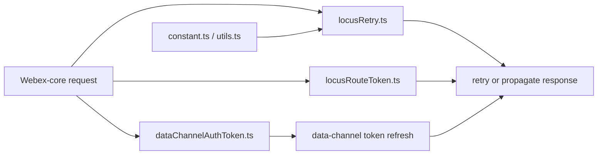
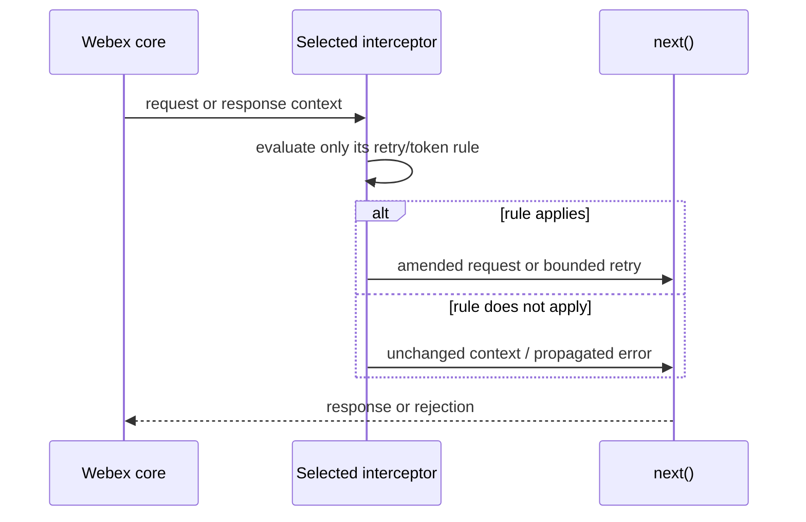
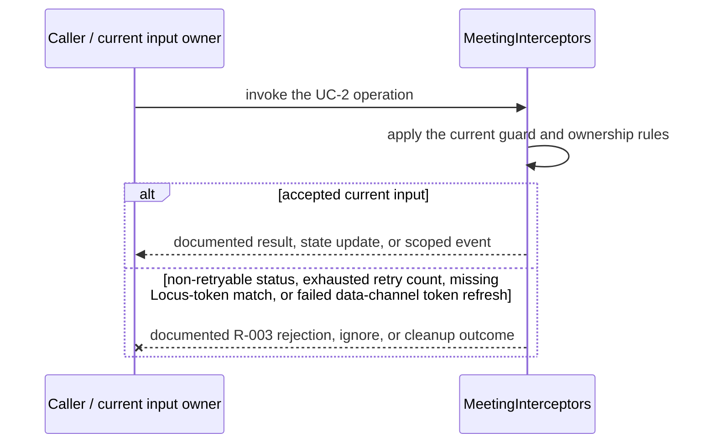
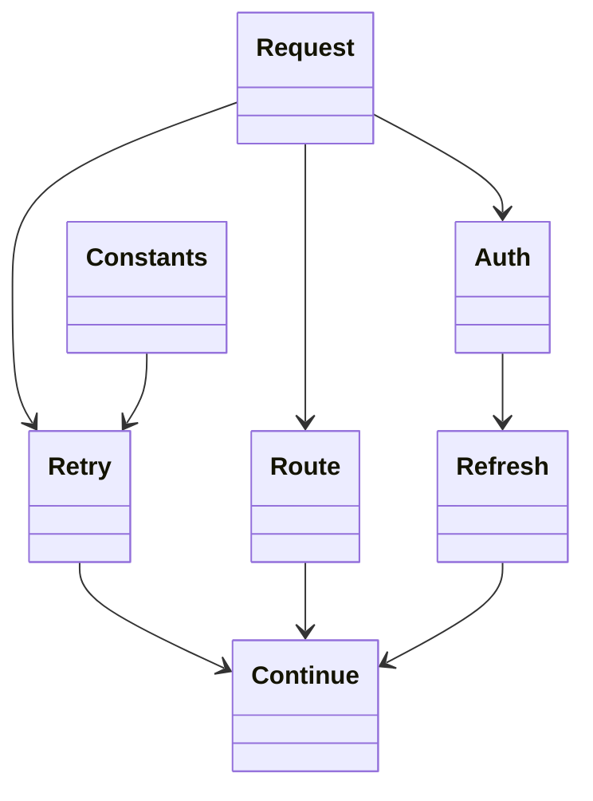

<!-- sdd-generated-metadata
doc_kind: module-spec
generated_from: module-spec@0.2.2
generator_plugin: repo-annotation@1.0.5+codex.20260818094939
generated_by: codex
approved_by: repository user
updated_at: 2026-08-21T06:10:05Z
validation_status: not-run
-->
# INTERCEPTORS — SPEC

> Start here → root [`AGENTS.md`](../../../AGENTS.md) · router [`SPEC_INDEX.md`](../../../ai-docs/SPEC_INDEX.md) · system [`ARCHITECTURE.md`](../../../ai-docs/ARCHITECTURE.md). This is the canonical source-local spec for `src/interceptors/`.

## Metadata

| Field | Value |
|---|---|
| Module id | `interceptors` |
| Source path(s) | `src/interceptors/` |
| Parent spec | — |
| Doc kind | Module spec |
| Coverage score | 93% assessed 2026-08-21; 13/14 mandatory fields present; all critical and Important fields present; one noncritical polish gap remains |
| Generated from | `module-spec` @ SDLC template library `0.2.2` |
| generated_by / approved_by / updated_at | codex / repository user / 2026-08-21T06:10:05Z |
| Validation status | not-run |

## Evidence Rules

Requirements cite current source and mirrored tests. Current code wins over retained prose when they conflict; commit and PR history are excluded. Missing evidence stays a gap.

## Source Material Register

| Source material | Scope | Decision | Detail location or disposition |
|---|---|---|---|
| No routed legacy module spec | overview / API / behavior / tests | none; generated from current interceptors/constants/utilities and tests |
| Current source and mirrored tests | implementation / tests | verified | requirements, flows, failures, and test strategy below |

## Overview

`src/interceptors/` contains 6 direct source/reference file(s) and has 4 mirrored unit-test file(s). This spec separates its public operations, runtime data movement, component ownership, state applicability, and verification boundary.

## Purpose / Responsibility

Provides Webex-core request middleware for bounded Locus retries, Locus route-token propagation, and data-channel auth-token refresh.

## Stack

TypeScript/JavaScript in the Node 22.14 Yarn workspace; Webex core/plugin abstractions and Mocha/Sinon/`@webex/test-helper-chai` tests.

## Folder / Package Structure

```text
src/interceptors/
├── constant.ts — interceptor constants
├── dataChannelAuthToken.ts — dataChannelAuthToken implementation responsibility
├── index.ts — module facade/controller or primary exports
├── locusRetry.ts — locusRetry implementation responsibility
├── locusRouteToken.ts — locusRouteToken implementation responsibility
├── utils.ts — normalization/helper functions
└── ai-docs/interceptors-spec.md — canonical module specification
```

## Key Files (source of truth)

| File | Holds |
|---|---|
| `src/interceptors/constant.ts` | interceptor constants |
| `src/interceptors/dataChannelAuthToken.ts` | dataChannelAuthToken implementation responsibility |
| `src/interceptors/index.ts` | module facade/controller or primary exports |
| `src/interceptors/locusRetry.ts` | locusRetry implementation responsibility |
| `src/interceptors/locusRouteToken.ts` | locusRouteToken implementation responsibility |
| `src/interceptors/utils.ts` | normalization/helper functions |
| `test/unit/spec/interceptors/dataChannelAuthToken.ts` and 3 sibling test file(s) | mirrored characterization/unit coverage |

## Public Surface

| Contract ID | Type | Surface | Purpose | Compatibility / deprecation | Schema / detail link | Root index |
|---|---|---|---|---|---|---|
| `interceptors.1` | SDK / in-process / remote | retry eligible Locus failures using server delay/status rules | Focused operation group owned by this module | Preserve methods/events/wire values reachable from package objects | `src/interceptors/index.ts` | [CONTRACTS](../../../ai-docs/CONTRACTS.md) |
| `interceptors.2` | SDK / in-process / remote | capture and attach route tokens keyed by Locus id | Focused operation group owned by this module | Preserve methods/events/wire values reachable from package objects | `src/interceptors/index.ts` | [CONTRACTS](../../../ai-docs/CONTRACTS.md) |
| `interceptors.3` | SDK / in-process / remote | attach, refresh, and bounded-retry data-channel authorization tokens | Focused operation group owned by this module | Preserve methods/events/wire values reachable from package objects | `src/interceptors/index.ts` | [CONTRACTS](../../../ai-docs/CONTRACTS.md) |

Compatibility notes:
- Prefer additive fields/options and preserve current return and rejection semantics. Internal helpers are not public merely because they are exported within the source directory.

## Requires (dependencies)

Webex core Interceptor/request pipeline, JWT decoding/verification helpers, Meetings token state/services, request URLs/headers, timers, and retry constants.

## Requirements

| ID | WHAT | WHY | Source Evidence | Test / Example Evidence | Assumptions / Gaps | Confidence |
|---|---|---|---|---|---|---|
| `INTERCEPTORS-R-001` | retry eligible Locus failures using server delay/status rules. | Provides Webex-core request middleware for bounded Locus retries, Locus route-token propagation, and data-channel auth-token refresh. | `src/interceptors/index.ts` | `test/unit/spec/interceptors/dataChannelAuthToken.ts` | none | PRESENT |
| `INTERCEPTORS-R-002` | capture and attach route tokens keyed by Locus id. | Consumers need deterministic behavior across meeting and remote updates. | `src/interceptors/index.ts`, `src/interceptors/dataChannelAuthToken.ts` | `test/unit/spec/interceptors/dataChannelAuthToken.ts` | inspect sibling tests for operation-specific cases | PRESENT |
| `INTERCEPTORS-R-003` | Non-eligible failures are propagated unchanged; retry counters and token-refresh retries are bounded by each interceptor rather than by shared listener or timer cleanup. | Callers must receive the actual module failure outcome without false cleanup or event guarantees. | `src/interceptors/` | `test/unit/spec/interceptors/dataChannelAuthToken.ts` | none | PRESENT |
| `INTERCEPTORS-R-004` | Locus retry handles only eligible response failures, uses the server retry delay/status policy, and stops at the configured bound. | Global request middleware must not retry terminal failures or loop indefinitely. | `src/interceptors/locusRetry.ts`, `src/interceptors/constant.ts` | `test/unit/spec/interceptors/locusRetry.ts` | none | PRESENT |
| `INTERCEPTORS-R-005` | Route tokens are extracted from supported Locus responses, keyed by Locus id, and attached only to matching requests. | Loose routing could omit a required token or leak it to an unrelated request. | `src/interceptors/locusRouteToken.ts` | `test/unit/spec/interceptors/locusRouteToken.ts` | none | PRESENT |
| `INTERCEPTORS-R-006` | Data-channel tokens are checked with an expiry buffer, refreshed when needed, and retried only through the bounded interceptor policy. | Expired credentials must recover without exposing tokens or creating an authentication retry storm. | `src/interceptors/dataChannelAuthToken.ts`, `src/interceptors/utils.ts` | `test/unit/spec/interceptors/dataChannelAuthToken.ts`, `test/unit/spec/interceptors/utils.ts` | none | PRESENT |

## Design Overview

`index.ts` only exports three independent Webex-core interceptors. `locusRetry.ts` bounds eligible retries, `locusRouteToken.ts` stores/attaches tokens by Locus id, and `dataChannelAuthToken.ts` refreshes expiring channel credentials; none is a controller for the others.

## Data Flow



## Sequence Diagram(s)

Sequence coverage:

| Operation group | Diagram | Failure coverage |
|---|---|---|
| UC-1 — primary operation | Primary operation sequence | accepted and rejected dependency outcomes |
| UC-2 — secondary/change operation | Secondary operation and failure sequence | non-retryable status, exhausted retry count, missing Locus-token match, or failed data-channel token refresh |

### Primary operation sequence



### Secondary operation and failure sequence



## Class / Component Relationships



The arrows identify ownership and delegation inside `src/interceptors/`; files that only declare types or constants are not presented as transports.

## Use Cases

- **UC-1:** Retry only eligible Locus response failures using the configured bound and server delay. Evidence: `src/interceptors/`.
- **UC-2:** Attach a route token only to its matching Locus request, and refresh a data-channel token only when the expiry buffer requires it. Evidence: `src/interceptors/`.

## Business Rules & Invariants

- Tokens attach only to intended request routes; expiry and retry counters are checked; retry is bounded; terminal auth/service errors propagate. Enforced under `src/interceptors/`.

## Concurrency & Reactive Flow

- Async work owned by `MeetingInterceptors` may complete after a newer caller or remote input. Preserve the identity, sequence, and resource-owner guards in `src/interceptors/`; a late completion must not replay UC-2 for superseded state.

## Protocol / Wire Format

- Existing request/event/channel types and constants under `src/interceptors/` own serialization and parsing. Preserve field names, enum/raw values, identity/routing fields, and compatibility; normalized client properties are not a replacement wire schema.

## Error Handling & Failure Modes

| Condition | Signal | Caller recovery |
|---|---|---|
| non-retryable status, exhausted retry count, missing Locus-token match, or failed data-channel token refresh | Follow the concrete rejection, ignore, state, or cleanup behavior in the module's R-003 requirement. | Resolve the named condition; retry only when another requirement defines a bound. |
| UC-1 succeeds | Return, update, callback, or scoped event identified by the Public Surface and primary sequence. | Continue from the owning module's accepted state. |

## Pitfalls

- An interceptor runs across host requests. Loose URL matching or header reuse can leak meeting tokens to an unrelated service.
- Verify both typed constants/enums and raw wire values before changing a logical condition in this legacy package.

## Host Integration & Theming

The Webex SDK host provides request, identity, event, and media capabilities and exposes this module through `webex.meetings` or Meeting-composed controllers. The module renders no UI and has no theme contract.

## Test-Case Strategy (module)

Use the current mirrored suites: `test/unit/spec/interceptors/dataChannelAuthToken.ts`, `test/unit/spec/interceptors/locusRetry.ts`, `test/unit/spec/interceptors/locusRouteToken.ts`, `test/unit/spec/interceptors/utils.ts`. Characterize the two code-grounded use cases above and the listed failure condition; add cleanup or transition cases only for resources and state this module actually owns.

| Behavior / Requirement | Existing test evidence | Gap |
|---|---|---|
| `INTERCEPTORS-R-001` | `test/unit/spec/interceptors/dataChannelAuthToken.ts` | inspect sibling tests for full operation matrix |
| `INTERCEPTORS-R-002` | `test/unit/spec/interceptors/dataChannelAuthToken.ts` | verify the operation-specific invalid-input and rejection branches |
| `INTERCEPTORS-R-003` | `test/unit/spec/interceptors/dataChannelAuthToken.ts` | verify the concrete R-003 rejection, ignore, or cleanup outcome |
| `INTERCEPTORS-R-004` | `test/unit/spec/interceptors/locusRetry.ts` | verify terminal status and retry exhaustion |
| `INTERCEPTORS-R-005` | `test/unit/spec/interceptors/locusRouteToken.ts` | verify unrelated URL never receives token |
| `INTERCEPTORS-R-006` | `test/unit/spec/interceptors/dataChannelAuthToken.ts`, `test/unit/spec/interceptors/utils.ts` | verify malformed/near-expiry tokens and retry exhaustion |

## Traceability

- Repo architecture: [`ARCHITECTURE.md`](../../../ai-docs/ARCHITECTURE.md) · Registry: [`SPEC_INDEX.md`](../../../ai-docs/SPEC_INDEX.md)
- Coverage state and contracts baseline: `../../../.sdd/manifest.json`
