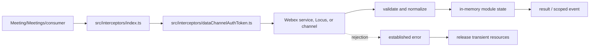
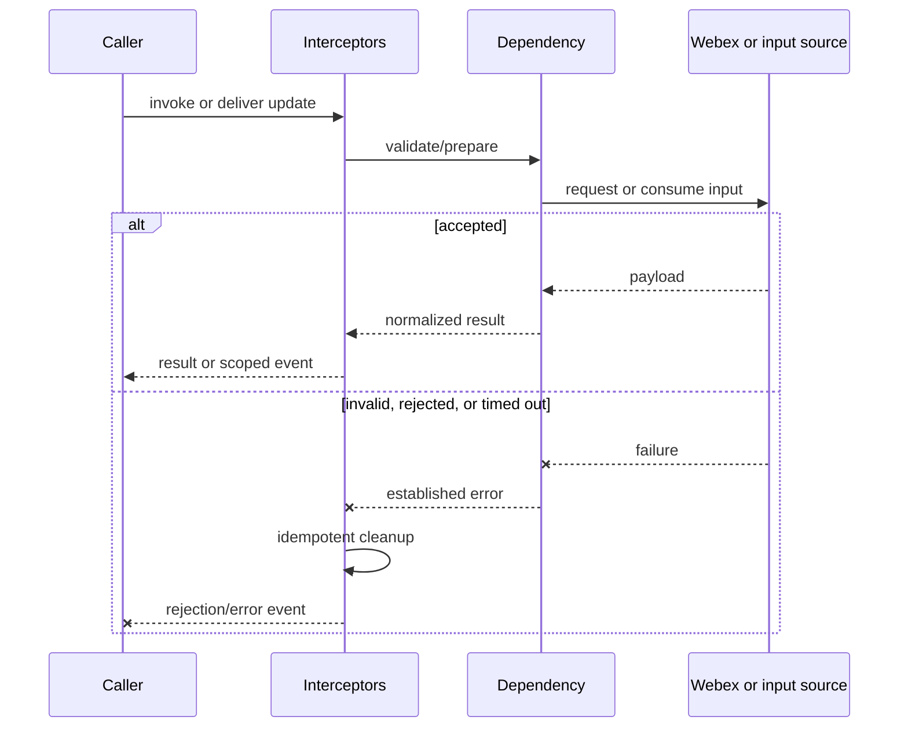
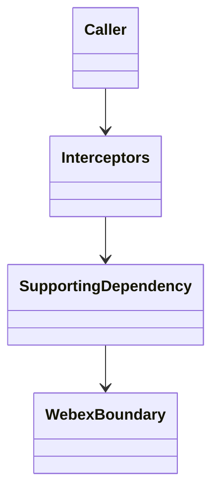

<!-- sdd-generated-metadata
doc_kind: module-spec
generated_from: module-spec@0.2.2
generator_plugin: repo-annotation@1.0.5+codex.20260818094939
generated_by: codex
approved_by: repository user
updated_at: 2026-08-18T15:33:39Z
validation_status: not-run
-->
# INTERCEPTORS — SPEC

> Start here → root [`AGENTS.md`](../../../AGENTS.md) · router [`SPEC_INDEX.md`](../../../ai-docs/SPEC_INDEX.md) · system [`ARCHITECTURE.md`](../../../ai-docs/ARCHITECTURE.md). This is the canonical source-local spec for `src/interceptors/`.

## Metadata

| Field | Value |
|---|---|
| Module id | `interceptors` |
| Source path(s) | `src/interceptors/` |
| Parent spec | — |
| Doc kind | Module spec |
| Coverage score | 93% assessed 2026-08-18; 13/14 mandatory fields present; all critical fields present, one noncritical detail gap remains |
| Generated from | `module-spec` @ SDLC template library `0.2.2` |
| generated_by / approved_by / updated_at | codex / repository user / 2026-08-18T15:33:39Z |
| Validation status | not-run |

## Evidence Rules

Requirements cite current source and mirrored tests. Current code wins over retained prose when they conflict; commit and PR history are excluded. Missing evidence stays a gap.

## Source Material Register

| Source material | Scope | Decision | Detail location or disposition |
|---|---|---|---|
| No routed legacy module spec | overview / API / behavior / tests | none; generated from current interceptors/constants/utilities and tests |
| Current source and mirrored tests | implementation / tests | verified | requirements, flows, failures, and test strategy below |

## Overview

For orientation, start at `src/interceptors/index.ts`; supporting files under `src/interceptors/` separate request, parsing, collection, type, or utility concerns from parent orchestration. The module is composed by `Meeting`, `Meetings`, or the package entry as applicable. Remote Webex services/Locus remain authoritative, and all local state is scoped to the SDK, plugin, meeting, or operation lifetime.

## Purpose / Responsibility

Provides Webex-core request middleware for bounded Locus retries, Locus route-token propagation, and data-channel auth-token refresh.

## Stack

TypeScript/JavaScript in the Node 22.14 Yarn workspace; Webex core/plugin abstractions and Mocha/Sinon/`@webex/test-helper-chai` tests.

## Folder / Package Structure

```text
src/interceptors/
├── index.ts — primary behavior/entry point
├── dataChannelAuthToken.ts — supporting request, type, utility, or constant behavior
└── ai-docs/interceptors-spec.md — canonical module specification
```

## Key Files (source of truth)

| File | Holds |
|---|---|
| `src/interceptors/index.ts` | Primary lifecycle and module surface |
| `src/interceptors/dataChannelAuthToken.ts` | Supporting transport, types, constants, or normalization |
| `test/unit/spec/interceptors/dataChannelAuthToken.ts` | Mirrored behavioral tests |

## Public Surface

| Contract ID | Type | Surface | Purpose | Compatibility / deprecation | Schema / detail link | Root index |
|---|---|---|---|---|---|---|
| `interceptors.1` | SDK / in-process / remote | retry eligible Locus failures using server delay/status rules | Focused operation group owned by this module | Preserve methods/events/wire values reachable from package objects | `src/interceptors/index.ts` | [CONTRACTS](../../../ai-docs/CONTRACTS.md) |
| `interceptors.2` | SDK / in-process / remote | capture and attach route tokens keyed by Locus id | Focused operation group owned by this module | Preserve methods/events/wire values reachable from package objects | `src/interceptors/index.ts` | [CONTRACTS](../../../ai-docs/CONTRACTS.md) |
| `interceptors.3` | SDK / in-process / remote | attach, refresh, and bounded-retry data-channel authorization tokens | Focused operation group owned by this module | Preserve methods/events/wire values reachable from package objects | `src/interceptors/index.ts` | [CONTRACTS](../../../ai-docs/CONTRACTS.md) |

Compatibility notes:
- Prefer additive fields/options and preserve current rejection/event/cleanup semantics. Internal helpers are not public merely because they are exported within the source directory.

## Requires (dependencies)

Webex core Interceptor/request pipeline, JWT decoding/verification helpers, Meetings token state/services, request URLs/headers, timers, and retry constants.

## Requirements

| ID | WHAT | WHY | Source Evidence | Test / Example Evidence | Assumptions / Gaps | Confidence |
|---|---|---|---|---|---|---|
| `INTERCEPTORS-R-001` | retry eligible Locus failures using server delay/status rules. | Provides Webex-core request middleware for bounded Locus retries, Locus route-token propagation, and data-channel auth-token refresh. | `src/interceptors/index.ts` | `test/unit/spec/interceptors/dataChannelAuthToken.ts` | none | PRESENT |
| `INTERCEPTORS-R-002` | capture and attach route tokens keyed by Locus id. | Consumers need deterministic behavior across meeting and remote updates. | `src/interceptors/index.ts`, `src/interceptors/dataChannelAuthToken.ts` | `test/unit/spec/interceptors/dataChannelAuthToken.ts` | inspect sibling tests for operation-specific cases | PRESENT |
| `INTERCEPTORS-R-003` | Invalid, rejected, or terminal operations preserve the established failure signal and release module-owned transient resources. | Hidden failure or leaked state corrupts later meeting behavior. | `src/interceptors/index.ts` | `test/unit/spec/interceptors/dataChannelAuthToken.ts` | verify every early exit during focused changes | PRESENT |
| `INTERCEPTORS-R-004` | Locus retry handles only eligible response failures, uses the server retry delay/status policy, and stops at the configured bound. | Global request middleware must not retry terminal failures or loop indefinitely. | `src/interceptors/locusRetry.ts`, `src/interceptors/constant.ts` | `test/unit/spec/interceptors/locusRetry.ts` | none | PRESENT |
| `INTERCEPTORS-R-005` | Route tokens are extracted from supported Locus responses, keyed by Locus id, and attached only to matching requests. | Loose routing could omit a required token or leak it to an unrelated request. | `src/interceptors/locusRouteToken.ts` | `test/unit/spec/interceptors/locusRouteToken.ts` | none | PRESENT |
| `INTERCEPTORS-R-006` | Data-channel tokens are checked with an expiry buffer, refreshed when needed, and retried only through the bounded interceptor policy. | Expired credentials must recover without exposing tokens or creating an authentication retry storm. | `src/interceptors/dataChannelAuthToken.ts`, `src/interceptors/utils.ts` | `test/unit/spec/interceptors/dataChannelAuthToken.ts`, `test/unit/spec/interceptors/utils.ts` | none | PRESENT |

## Design Overview

The primary controller/data module owns normalization and observable state while supporting files isolate request, type, constant, collection, or utility concerns. Capability and remote response data are checked before state changes. Async completion emits/returns one established outcome; cleanup handles listeners, timers, locks, channels, or transient requests owned by the module.

## Data Flow



## Sequence Diagram(s)

Sequence coverage:

The operation groups below share the same caller → module → supporting dependency → Webex/input ordering and the same rejection/cleanup contract, so one combined diagram covers their common sequence; operation-specific state and guards are stated in the requirements and use cases.

| Operation group | Diagram | Failure / recovery coverage |
|---|---|---|
| retry eligible Locus failures using server delay/status rules | Read/derive or initialize | invalid/capability rejection |
| capture and attach route tokens keyed by Locus id | Mutate or react | remote rejection/timeout and cleanup |



## Class / Component Relationships



The module owns its projection/controller and composes supporting requests, types, constants, collections, or utilities. The Webex boundary remains authoritative.

## Use Cases

- **UC-1 Primary:** the parent/consumer requests retry eligible Locus failures using server delay/status rules; the module validates or derives data and returns/emits the normalized outcome. Evidence: `src/interceptors/index.ts`, `test/unit/spec/interceptors/dataChannelAuthToken.ts`.
- **UC-2 Change:** the parent/consumer triggers capture and attach route tokens keyed by Locus id; capability/current state is checked, the dependency is invoked, and accepted state is exposed once. Evidence: `src/interceptors/index.ts`, `src/interceptors/dataChannelAuthToken.ts`.

## Business Rules & Invariants

- Tokens attach only to intended request routes; expiry and retry counters are checked; retry is bounded; terminal auth/service errors propagate. Enforced under `src/interceptors/`.

## Concurrency & Reactive Flow

- Remote/event/promise/timer callbacks may interleave. Preserve current identity/sequence guards, allow only the intended in-flight operation, and make listener/timer/channel cleanup idempotent.

## Protocol / Wire Format

- Existing request/event/channel types and constants under `src/interceptors/` own serialization and parsing. Preserve field names, enum/raw values, identity/routing fields, and compatibility; normalized client properties are not a replacement wire schema.

## Error Handling & Failure Modes

| Condition | Signal | Caller recovery |
|---|---|---|
| missing capability, identity, URL, or invalid options | validation/established rejection | refresh state or correct input; do not retry unchanged |
| service/channel/request rejection | propagated request or module error | branch on error; retry only through existing bounded policy |
| timeout, role change, or teardown race | rejected/ignored stale result with cleanup | re-read current meeting state and invoke again only if still eligible |

## Pitfalls

- An interceptor runs across host requests. Loose URL matching or header reuse can leak meeting tokens to an unrelated service.
- Verify both typed constants/enums and raw wire values before changing a logical condition in this legacy package.

## Host Integration & Theming

The Webex SDK host provides request, identity, event, and media capabilities and exposes this module through `webex.meetings` or Meeting-composed controllers. The module renders no UI and has no theme contract.

## Test-Case Strategy (module)

Start with the mirrored suite and sibling files in the same test directory. Cover successful derivation/mutation plus invalid capability/input, remote rejection, stale event, and cleanup. Use Sinon, `calledOnceWithExactly`, and fake timers for retry/lock/token/channel timing.

| Behavior / Requirement | Existing test evidence | Gap |
|---|---|---|
| `INTERCEPTORS-R-001` | `test/unit/spec/interceptors/dataChannelAuthToken.ts` | inspect sibling tests for full operation matrix |
| `INTERCEPTORS-R-002` | `test/unit/spec/interceptors/dataChannelAuthToken.ts` | verify rejected and role/capability-change branches |
| `INTERCEPTORS-R-003` | `test/unit/spec/interceptors/dataChannelAuthToken.ts` | verify cleanup on all early exits |
| `INTERCEPTORS-R-004` | `test/unit/spec/interceptors/locusRetry.ts` | verify terminal status and retry exhaustion |
| `INTERCEPTORS-R-005` | `test/unit/spec/interceptors/locusRouteToken.ts` | verify unrelated URL never receives token |
| `INTERCEPTORS-R-006` | `test/unit/spec/interceptors/dataChannelAuthToken.ts`, `test/unit/spec/interceptors/utils.ts` | verify malformed/near-expiry tokens and retry exhaustion |

## Traceability

- Repo architecture: [`ARCHITECTURE.md`](../../../ai-docs/ARCHITECTURE.md) · Registry: [`SPEC_INDEX.md`](../../../ai-docs/SPEC_INDEX.md)
- Coverage state and contracts baseline: `../../../.sdd/manifest.json`
