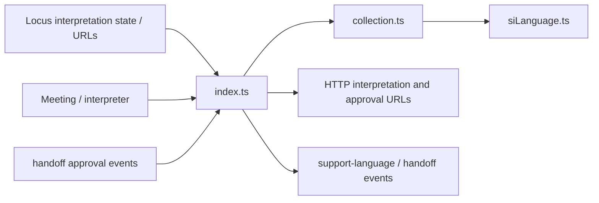
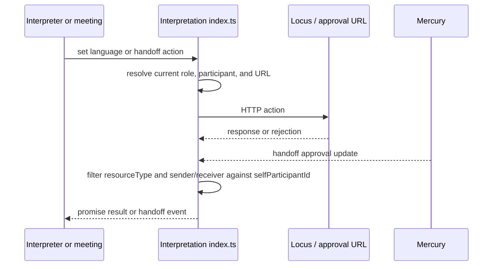
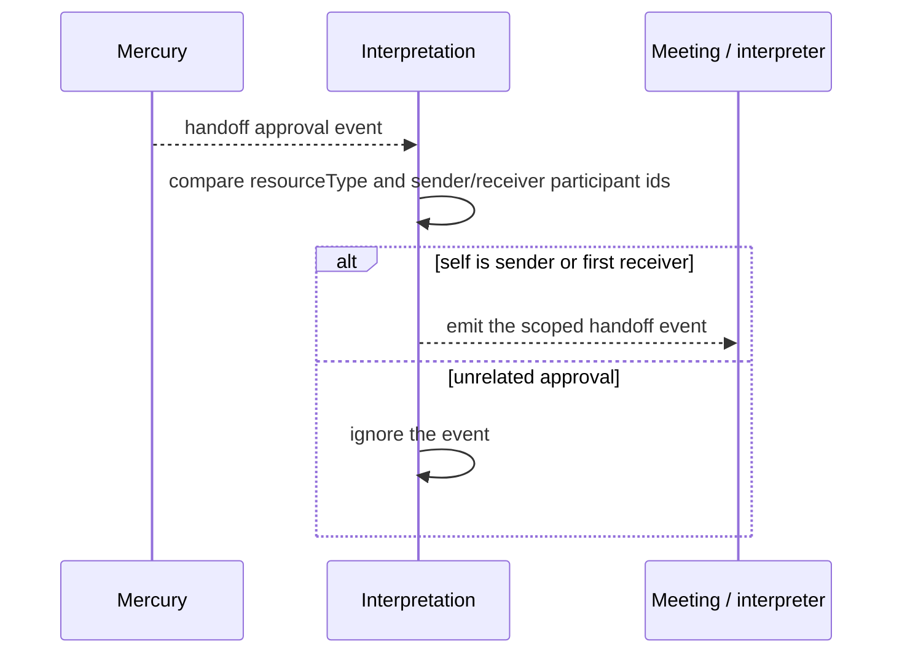
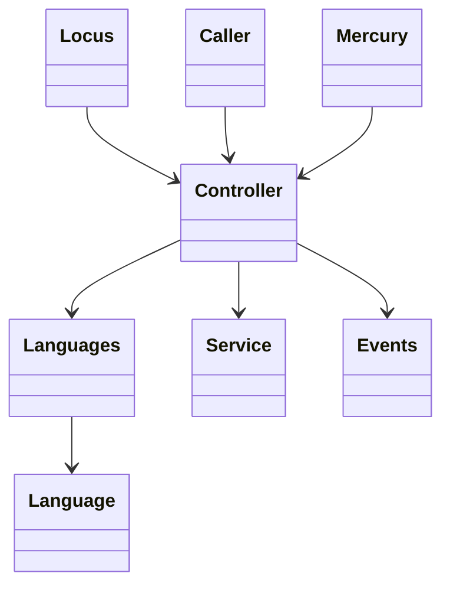
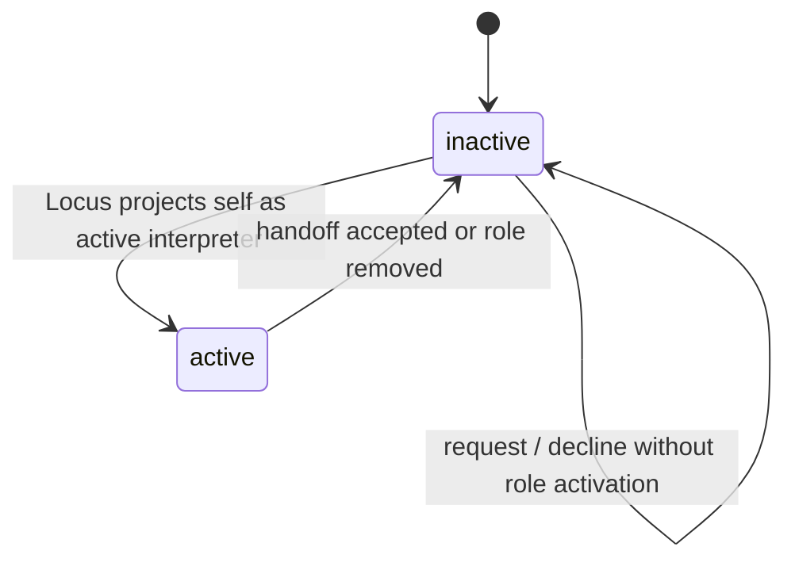

<!-- sdd-generated-metadata
doc_kind: module-spec
generated_from: module-spec@0.2.2
generator_plugin: repo-annotation@1.0.5+codex.20260818094939
generated_by: codex
approved_by: repository user
updated_at: 2026-08-22T15:21:29Z
validation_status: pass-with-warnings
-->
# INTERPRETATION — SPEC

> Start here → root [`AGENTS.md`](../../../AGENTS.md) · router [`SPEC_INDEX.md`](../../../ai-docs/SPEC_INDEX.md) · system [`ARCHITECTURE.md`](../../../ai-docs/ARCHITECTURE.md). This is the canonical source-local spec for `src/interpretation/`.

## Metadata

| Field | Value |
|---|---|
| Module id | `interpretation` |
| Source path(s) | `src/interpretation/` |
| Parent spec | — |
| Doc kind | Module spec |
| Coverage score | 93% assessed 2026-08-22; 13/14 mandatory fields present; all critical and Important fields present; one noncritical polish gap remains; pending independent validation of the participant-role repair |
| Generated from | `module-spec` @ SDLC template library `0.2.2` |
| generated_by / approved_by / updated_at | codex / repository user / 2026-08-22T15:21:29Z |
| Validation status | not-run |

## Evidence Rules

Requirements cite current source and mirrored tests. Current code wins over retained prose when they conflict; commit and PR history are excluded. Missing evidence stays a gap.

## Source Material Register

| Source material | Scope | Decision | Detail location or disposition |
|---|---|---|---|
| Retained simultaneous-interpretation guide | overview / API / behavior / tests | used and verified; attendee, host, interpreter, language, and handoff flows were placed into requirements, state, use cases, and failures |
| Current source and mirrored tests | implementation / tests | verified | requirements, flows, failures, and test strategy below |

## Overview

`src/interpretation/` contains 5 direct source/reference file(s) and has 3 mirrored unit-test file(s). This spec separates its public operations, runtime data movement, component ownership, state applicability, and verification boundary.

## Purpose / Responsibility

Owns simultaneous-interpretation language state, interpreter collections, direction changes, and interpreter handoff request/approval workflows.

## Stack

TypeScript/JavaScript in the Node 22.14 Yarn workspace; Webex core/plugin abstractions and Mocha/Sinon/`@webex/test-helper-chai` tests.

## Folder / Package Structure

```text
src/interpretation/
├── README.md — retained legacy reference input
├── collection.ts — module-owned collection
├── index.ts — module facade/controller or primary exports
├── interpretation.types.ts — module type declarations
├── siLanguage.ts — siLanguage implementation responsibility
└── ai-docs/interpretation-spec.md — canonical module specification
```

## Key Files (source of truth)

| File | Holds |
|---|---|
| `src/interpretation/README.md` | retained legacy reference input |
| `src/interpretation/collection.ts` | module-owned collection |
| `src/interpretation/index.ts` | module facade/controller or primary exports |
| `src/interpretation/interpretation.types.ts` | module type declarations |
| `src/interpretation/siLanguage.ts` | siLanguage implementation responsibility |
| `test/unit/spec/interpretation/collection.ts` and 2 sibling test file(s) | mirrored characterization/unit coverage |

## Public Surface

| Contract ID | Type | Surface | Purpose | Compatibility / deprecation | Schema / detail link | Root index |
|---|---|---|---|---|---|---|
| `interpretation.1` | SDK / lifecycle | `initialize()`, `cleanUp()`, `locusUrlUpdate()`, `approvalUrlUpdate()`, `updateCanManageInterpreters()`, `updateHostSIEnabled()`, `updateMeetingSIEnabled()`, `updateInterpretation()`, and `updateSelfInterpretation()` | Maintain meeting-scoped interpretation configuration and Mercury handoff listener ownership. | `initialize()` installs the listener before self-participant context may be available; cleanup removes it. | `src/interpretation/index.ts` | [CONTRACTS](../../../ai-docs/CONTRACTS.md) |
| `interpretation.2` | SDK / remote | `querySupportLanguages()` and `getTargetLanguageCode()` | Fetch supported languages and map the current source/target direction to its code. | Preserve collection replacement and language-code matching behavior. | `src/interpretation/index.ts` | [CONTRACTS](../../../ai-docs/CONTRACTS.md) |
| `interpretation.3` | SDK / remote | `getInterpreters()` and `updateInterpreters()` | Query and mutate interpreter assignments through the current Locus interpretation URL. | Preserve request bodies and caller-visible request rejection; these methods do not preflight capability or a missing `locusUrl`. | `src/interpretation/index.ts` | [CONTRACTS](../../../ai-docs/CONTRACTS.md) |
| `interpretation.4` | SDK / remote | `changeDirection()` | Change the configured interpretation direction for the supported current participant context. | Do not imply a separate attendee direction API that code does not expose. | `src/interpretation/index.ts` | [CONTRACTS](../../../ai-docs/CONTRACTS.md) |
| `interpretation.5` | SDK / event/remote | `listenToHandoffRequests()`, `handoffInterpreter()`, `requestHandoff()`, `acceptRequest()`, and `declineRequest()` | Receive and act on interpreter handoff approval requests using participant and approval URLs. | Preserve event filtering as implemented; the Mercury callback does not compare `locusUrl`. | `src/interpretation/index.ts` | [CONTRACTS](../../../ai-docs/CONTRACTS.md) |
| `interpretation.6` | exported types/models | `InterpreterUsingResource`, `Interpreter`, `SILanguage`, and `SILanguageCollection` | Represent supported-language and interpreter-resource data used by the controller and consumers. | Add fields compatibly; language collection identity remains code-driven. | `src/interpretation/interpretation.types.ts`, `src/interpretation/siLanguage.ts`, `src/interpretation/collection.ts` | [CONTRACTS](../../../ai-docs/CONTRACTS.md) |

### Emitted events

Current source emits or forwards these observable literals for this operation boundary. Preserve literal values, scope, payload shape, and emission timing; a constant name alone is not a substitute for the consumer-visible value.

| Event literal | Constant / expression | Emission evidence |
|---|---|---|
| `HANDOFF_REQUESTS_ARRIVED` | `INTERPRETATION.EVENTS.HANDOFF_REQUESTS_ARRIVED` | `src/interpretation/index.ts` |
| `meeting:interpretation:handoffRequestsArrived` | `EVENT_TRIGGERS.MEETING_INTERPRETATION_HANDOFF_REQUESTS_ARRIVED` | `src/meeting/index.ts` |
| `meeting:interpretation:supportLanguagesUpdate` | `EVENT_TRIGGERS.MEETING_INTERPRETATION_SUPPORT_LANGUAGES_UPDATE` | `src/meeting/index.ts` |
| `meeting:interpretation:update` | `EVENT_TRIGGERS.MEETING_INTERPRETATION_UPDATE` | `src/meeting/index.ts`, `src/meeting/util.ts` |
| `SUPPORT_LANGUAGES_UPDATE` | `INTERPRETATION.EVENTS.SUPPORT_LANGUAGES_UPDATE` | `src/interpretation/index.ts` |

Compatibility notes:
- Prefer additive fields/options and preserve current rejection/event/cleanup semantics. Internal helpers are not public merely because they are exported within the source directory.

## Requires (dependencies)

Parent Meeting/Locus state, approval URL, interpretation collections/types, member/self identity, request access, and scoped events.

## Requirements

| ID | WHAT | WHY | Source Evidence | Test / Example Evidence | Assumptions / Gaps | Confidence |
|---|---|---|---|---|---|---|
| `INTERPRETATION-R-001` | query supported languages and expose interpretation state. | Owns simultaneous-interpretation language state, interpreter collections, direction changes, and interpreter handoff request/approval workflows. | `src/interpretation/index.ts` | `test/unit/spec/interpretation/index.ts` | none | PRESENT |
| `INTERPRETATION-R-002` | change attendee/interpreter language direction. | Language-direction and interpreter-assignment bodies must match the current Locus interpretation contract. | `src/interpretation/index.ts`, `src/interpretation/siLanguage.ts` | `test/unit/spec/interpretation/index.ts` | listener initialization before self id and absent Locus-URL filtering need characterization | PRESENT |
| `INTERPRETATION-R-003` | HTTP failures reject their operations; `initialize()` installs the handoff Mercury listener immediately, before self participant id may be available, and `cleanUp()` removes owned listeners. The callback filters resource/participant roles but does not compare Locus URL. | Handoff listeners and request failures must reflect actual initialization/filter/cleanup behavior rather than an invented subscription or Locus guard. | `src/interpretation/index.ts` | `test/unit/spec/interpretation/index.ts` | listener-before-self and cross-Locus same-participant behavior need characterization | PRESENT |

## Design Overview

The controller maintains simultaneous-interpretation languages and participant role state, uses `collection.ts` and `siLanguage.ts` for language objects, calls the active Locus URLs directly, and filters Mercury handoff approval events by resource and self sender/receiver roles without comparing Locus URL.

## Data Flow



## Sequence Diagram(s)

Sequence coverage:

| Operation group | Diagram | Failure coverage |
|---|---|---|
| UC-1…UC-4 — interpretation and handoff operation groups | Interpretation and handoff primary sequence | unsupported language/direction, handoff request rejection, unrelated event handling, and listener cleanup |
| UC-1…UC-4 — interpretation and handoff alternate/failure paths | Interpretation and handoff alternate/failure sequence | explicit language/participant/approval validation, unguarded Locus-URL interpolation, or request rejection |

### Interpretation and handoff primary sequence



### Interpretation and handoff alternate/failure sequence



## Class / Component Relationships



The arrows identify ownership and delegation inside `src/interpretation/`; files that only declare types or constants are not presented as transports.

## Use Cases

- **UC-1:** Initialize meeting-scoped interpretation state and the handoff listener, then remove owned listener state during cleanup. Evidence: `src/interpretation/index.ts`.
- **UC-2:** Refresh supported-language objects from Locus and resolve the target language code for the current interpretation direction. Evidence: `src/interpretation/index.ts`, `src/interpretation/siLanguage.ts`.
- **UC-3:** Query/update interpreter assignments or change direction using the current interpretation URL and capability context. Evidence: `src/interpretation/index.ts`.
- **UC-4:** Offer, request, accept, decline, or relinquish an interpreter handoff against the current participant and approval URLs, without assuming an unimplemented Locus-URL event filter. Evidence: `src/interpretation/index.ts`.

## State Model

Supported languages, interpreters, self interpretation/direction, host/meeting enablement, management capability, and handoff listeners are meeting scoped.

## Business Rules & Invariants

- Direction and handoff actions require current language/interpreter/self data; only the intended approver/requester transition is applied; cleanup removes approval listeners. Enforced under `src/interpretation/`.

## Concurrency & Reactive Flow

- `initialize()` installs the Mercury subscription immediately, before `selfParticipantId` may be populated. Each callback reads the current id and filters only `resourceType` plus first-receiver/sender participant ids; it performs no Locus-URL comparison. Language and handoff HTTP operations settle their own returned promises.

## State Machine



The active/inactive projection is the concrete `isActive` state maintained in `src/interpretation/index.ts`.

## Error Handling & Failure Modes

| Condition | Signal | Caller recovery |
|---|---|---|
| `changeDirection()`, `handoffInterpreter()`, `requestHandoff()`, `acceptRequest()`, or `declineRequest()` lacks the input each method explicitly guards | The method returns a rejected promise before issuing its request. | Supply the language, participant, approval URL, or decision URL required by that operation. |
| `querySupportLanguages()`, `getInterpreters()`, or `updateInterpreters()` runs without `locusUrl` | No local pre-rejection occurs; the method builds a URI containing the current value (including `undefined`) and invokes `request()`. | Establish current Locus context before calling and handle the actual request outcome. |
| Interpretation or handoff HTTP request rejects | The same failure is logged and rethrown to the caller. | Handle the service rejection; retry only as a new caller operation. |
| Mercury approval has another resource type, or self is neither its first receiver nor its sender | The subscribed controller ignores it and emits no handoff event. A same-participant approval from another Locus is not filtered locally. | No caller action for a participant mismatch; consumers must not rely on this controller for Locus scoping. |

## Pitfalls

- Host-enabled, meeting-enabled, and self-interpreter state are distinct. Collapsing them yields incorrect controls and handoff eligibility.
- Verify both typed constants/enums and raw wire values before changing a logical condition in this legacy package.

## Module Do's / Don'ts

- DO preserve this boundary: Refresh supported-language objects from Locus and notify consumers when the catalog changes.
- DON'T move remote I/O or lifecycle ownership into a passive type, constant, catalog, or normalization file.

## Test-Case Strategy (module)

Use the current mirrored suites: `test/unit/spec/interpretation/collection.ts`, `test/unit/spec/interpretation/index.ts`, `test/unit/spec/interpretation/siLanguage.ts`. Characterize the interpretation-specific use cases above and each listed failure condition; add cleanup or transition cases only for resources and state this module actually owns.

| Behavior / Requirement | Existing test evidence | Gap |
|---|---|---|
| `INTERPRETATION-R-001` | `test/unit/spec/interpretation/index.ts` | cover initialization, language catalog, interpreter assignments, direction, and handoff families |
| `INTERPRETATION-R-002` | `test/unit/spec/interpretation/index.ts` | cover language-code resolution plus each interpreter-assignment and direction request body |
| `INTERPRETATION-R-003` | `test/unit/spec/interpretation/index.ts` | characterize listener installation before self id, absent Locus filtering, and exact cleanup removal |

## Traceability

- Repo architecture: [`ARCHITECTURE.md`](../../../ai-docs/ARCHITECTURE.md) · Registry: [`SPEC_INDEX.md`](../../../ai-docs/SPEC_INDEX.md)
- Coverage state and contracts baseline: `../../../.sdd/manifest.json`
