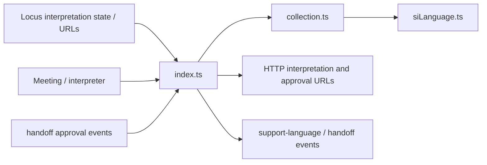
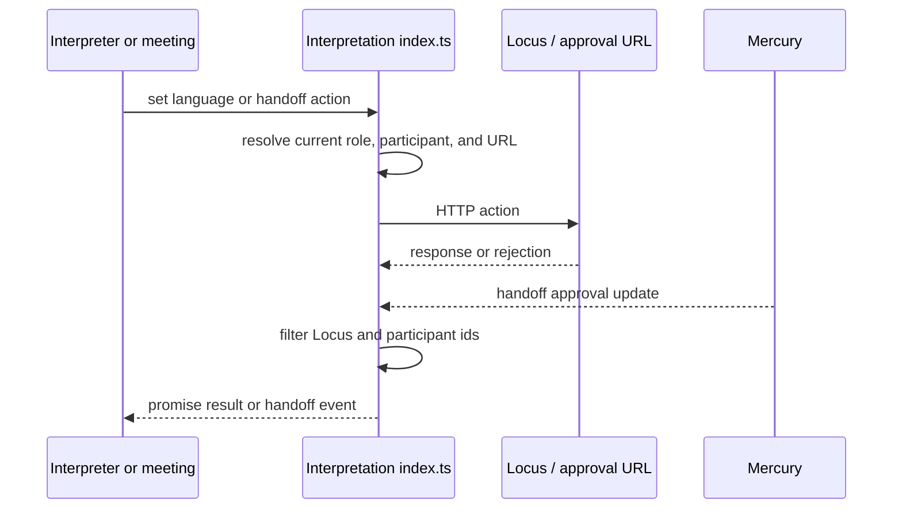
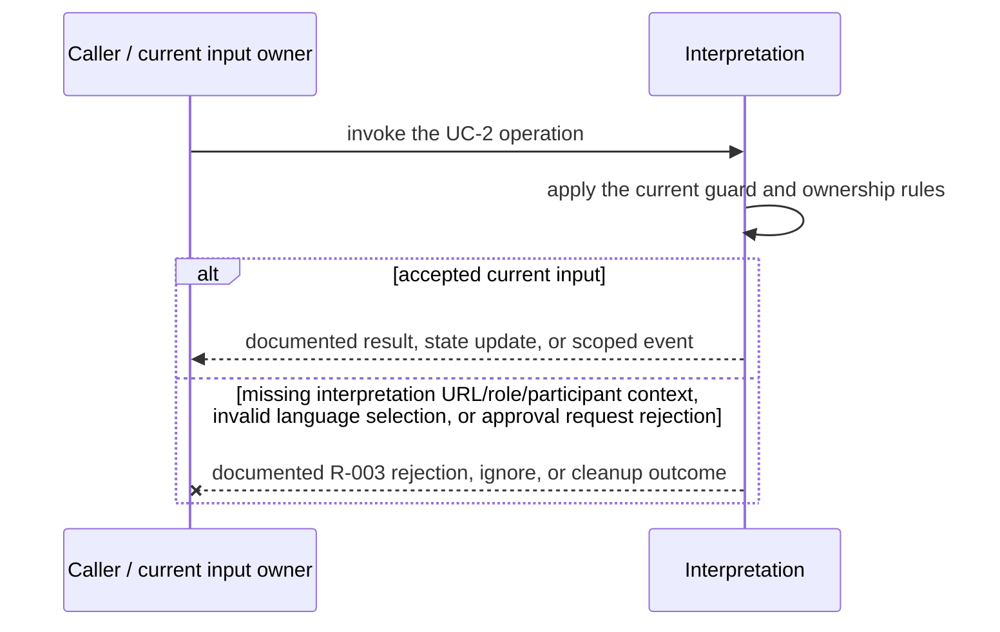
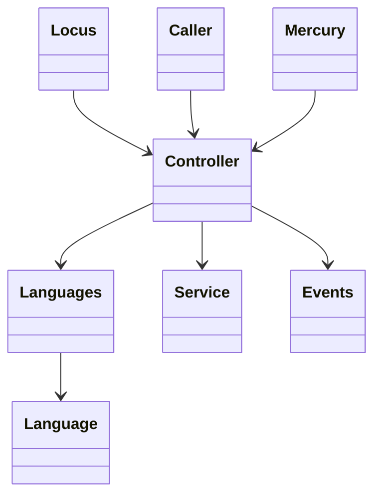
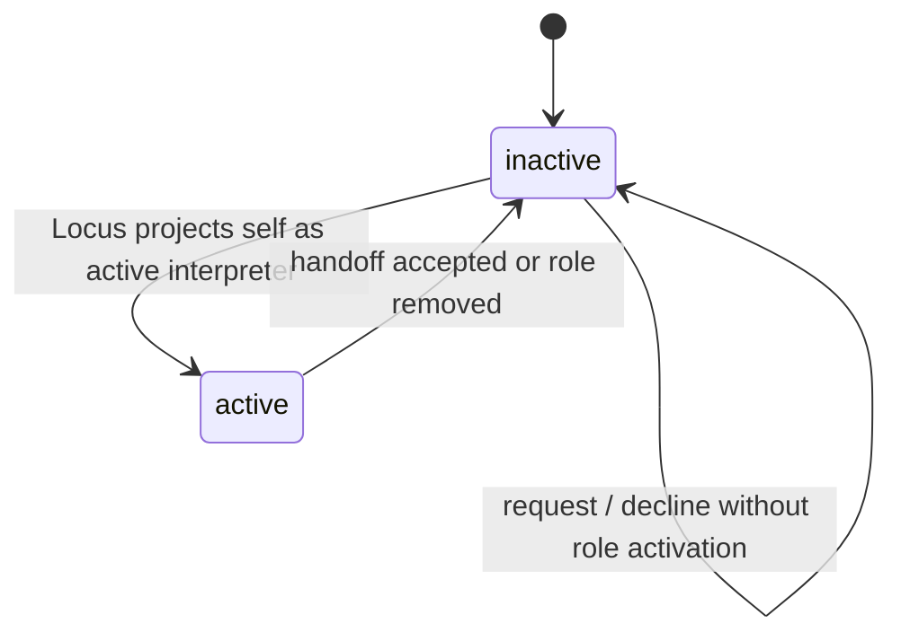

<!-- sdd-generated-metadata
doc_kind: module-spec
generated_from: module-spec@0.2.2
generator_plugin: repo-annotation@1.0.5+codex.20260818094939
generated_by: codex
approved_by: repository user
updated_at: 2026-08-21T06:10:05Z
validation_status: not-run
-->
# INTERPRETATION — SPEC

> Start here → root [`AGENTS.md`](../../../AGENTS.md) · router [`SPEC_INDEX.md`](../../../ai-docs/SPEC_INDEX.md) · system [`ARCHITECTURE.md`](../../../ai-docs/ARCHITECTURE.md). This is the canonical source-local spec for `src/interpretation/`.

## Metadata

| Field | Value |
|---|---|
| Module id | `interpretation` |
| Source path(s) | `src/interpretation/` |
| Parent spec | — |
| Doc kind | Module spec |
| Coverage score | 86% assessed 2026-08-21; 12/14 mandatory fields present; all critical fields present; one Important outcome-detail gap and one polish gap remain |
| Generated from | `module-spec` @ SDLC template library `0.2.2` |
| generated_by / approved_by / updated_at | codex / repository user / 2026-08-21T06:10:05Z |
| Validation status | not-run |

## Evidence Rules

Requirements cite current source and mirrored tests. Current code wins over retained prose when they conflict; commit and PR history are excluded. Missing evidence stays a gap.

## Source Material Register

| Source material | Scope | Decision | Detail location or disposition |
|---|---|---|---|
| Retained simultaneous-interpretation guide | overview / API / behavior / tests | used and verified; attendee, host, interpreter, language, and handoff flows were placed into requirements, state, use cases, and failures |
| Current source and mirrored tests | implementation / tests | verified | requirements, flows, failures, and test strategy below |

## Overview

`src/interpretation/` contains 5 direct source/reference file(s) and has 3 mirrored unit-test file(s). This spec separates its public operations, runtime data movement, component ownership, state applicability, and verification boundary.

## Purpose / Responsibility

Owns simultaneous-interpretation language state, interpreter collections, direction changes, and interpreter handoff request/approval workflows.

## Stack

TypeScript/JavaScript in the Node 22.14 Yarn workspace; Webex core/plugin abstractions and Mocha/Sinon/`@webex/test-helper-chai` tests.

## Folder / Package Structure

```text
src/interpretation/
├── README.md — retained legacy reference input
├── collection.ts — module-owned collection
├── index.ts — module facade/controller or primary exports
├── interpretation.types.ts — module type declarations
├── siLanguage.ts — siLanguage implementation responsibility
└── ai-docs/interpretation-spec.md — canonical module specification
```

## Key Files (source of truth)

| File | Holds |
|---|---|
| `src/interpretation/README.md` | retained legacy reference input |
| `src/interpretation/collection.ts` | module-owned collection |
| `src/interpretation/index.ts` | module facade/controller or primary exports |
| `src/interpretation/interpretation.types.ts` | module type declarations |
| `src/interpretation/siLanguage.ts` | siLanguage implementation responsibility |
| `test/unit/spec/interpretation/collection.ts` and 2 sibling test file(s) | mirrored characterization/unit coverage |

## Public Surface

| Contract ID | Type | Surface | Purpose | Compatibility / deprecation | Schema / detail link | Root index |
|---|---|---|---|---|---|---|
| `interpretation.1` | SDK / in-process / remote | query supported languages and expose interpretation state | Focused operation group owned by this module | Preserve methods/events/wire values reachable from package objects | `src/interpretation/index.ts` | [CONTRACTS](../../../ai-docs/CONTRACTS.md) |
| `interpretation.2` | SDK / in-process / remote | change attendee/interpreter language direction | Focused operation group owned by this module | Preserve methods/events/wire values reachable from package objects | `src/interpretation/index.ts` | [CONTRACTS](../../../ai-docs/CONTRACTS.md) |
| `interpretation.3` | SDK / in-process / remote | request, accept, decline, and apply interpreter handoffs | Focused operation group owned by this module | Preserve methods/events/wire values reachable from package objects | `src/interpretation/index.ts` | [CONTRACTS](../../../ai-docs/CONTRACTS.md) |

Compatibility notes:
- Prefer additive fields/options and preserve current rejection/event/cleanup semantics. Internal helpers are not public merely because they are exported within the source directory.

## Requires (dependencies)

Parent Meeting/Locus state, approval URL, interpretation collections/types, member/self identity, request access, and scoped events.

## Requirements

| ID | WHAT | WHY | Source Evidence | Test / Example Evidence | Assumptions / Gaps | Confidence |
|---|---|---|---|---|---|---|
| `INTERPRETATION-R-001` | query supported languages and expose interpretation state. | Owns simultaneous-interpretation language state, interpreter collections, direction changes, and interpreter handoff request/approval workflows. | `src/interpretation/index.ts` | `test/unit/spec/interpretation/index.ts` | none | PRESENT |
| `INTERPRETATION-R-002` | change attendee/interpreter language direction. | Consumers need deterministic behavior across meeting and remote updates. | `src/interpretation/index.ts`, `src/interpretation/siLanguage.ts` | `test/unit/spec/interpretation/index.ts` | inspect sibling tests for operation-specific cases | PRESENT |
| `INTERPRETATION-R-003` | HTTP failures reject the operation; unrelated Mercury approvals are ignored, and the controller subscribes once when participant identity becomes available. | Callers must receive the actual module failure outcome without false cleanup or event guarantees. | `src/interpretation/` | `test/unit/spec/interpretation/index.ts` | none | PRESENT |

## Design Overview

The controller maintains simultaneous-interpretation languages and participant role state, uses `collection.ts` and `siLanguage.ts` for language objects, calls the active Locus URLs directly, and filters Mercury handoff approval events to the current meeting.

## Data Flow



## Sequence Diagram(s)

Sequence coverage:

| Operation group | Diagram | Failure coverage |
|---|---|---|
| UC-1 — primary operation | Primary operation sequence | accepted and rejected dependency outcomes |
| UC-2 — secondary/change operation | Secondary operation and failure sequence | missing interpretation URL/role/participant context, invalid language selection, or approval request rejection |

### Primary operation sequence



### Secondary operation and failure sequence



## Class / Component Relationships



The arrows identify ownership and delegation inside `src/interpretation/`; files that only declare types or constants are not presented as transports.

## Use Cases

- **UC-1:** Refresh supported-language objects from Locus and notify consumers when the catalog changes. Evidence: `src/interpretation/`.
- **UC-2:** Offer, request, accept, decline, or relinquish an interpreter handoff against the current participant and approval URLs. Evidence: `src/interpretation/`.

## State Model

Supported languages, interpreters, self interpretation/direction, host/meeting enablement, management capability, and handoff listeners are meeting scoped.

## Business Rules & Invariants

- Direction and handoff actions require current language/interpreter/self data; only the intended approver/requester transition is applied; cleanup removes approval listeners. Enforced under `src/interpretation/`.

## Concurrency & Reactive Flow

- Async work owned by `Interpretation` may complete after a newer caller or remote input. Preserve the identity, sequence, and resource-owner guards in `src/interpretation/`; a late completion must not replay UC-2 for superseded state.

## State Machine



The active/inactive projection is the concrete `isActive` state maintained in `src/interpretation/index.ts`.

## Error Handling & Failure Modes

| Condition | Signal | Caller recovery |
|---|---|---|
| missing interpretation URL/role/participant context, invalid language selection, or approval request rejection | Follow the concrete rejection, ignore, state, or cleanup behavior in the module's R-003 requirement. | Resolve the named condition; retry only when another requirement defines a bound. |
| UC-1 succeeds | Return, update, callback, or scoped event identified by the Public Surface and primary sequence. | Continue from the owning module's accepted state. |

## Pitfalls

- Host-enabled, meeting-enabled, and self-interpreter state are distinct. Collapsing them yields incorrect controls and handoff eligibility.
- Verify both typed constants/enums and raw wire values before changing a logical condition in this legacy package.

## Module Do's / Don'ts

- DO preserve this boundary: Refresh supported-language objects from Locus and notify consumers when the catalog changes.
- DON'T move remote I/O or lifecycle ownership into a passive type, constant, catalog, or normalization file.

## Test-Case Strategy (module)

Use the current mirrored suites: `test/unit/spec/interpretation/collection.ts`, `test/unit/spec/interpretation/index.ts`, `test/unit/spec/interpretation/siLanguage.ts`. Characterize the two code-grounded use cases above and the listed failure condition; add cleanup or transition cases only for resources and state this module actually owns.

| Behavior / Requirement | Existing test evidence | Gap |
|---|---|---|
| `INTERPRETATION-R-001` | `test/unit/spec/interpretation/index.ts` | inspect sibling tests for full operation matrix |
| `INTERPRETATION-R-002` | `test/unit/spec/interpretation/index.ts` | verify the operation-specific invalid-input and rejection branches |
| `INTERPRETATION-R-003` | `test/unit/spec/interpretation/index.ts` | verify the concrete R-003 rejection, ignore, or cleanup outcome |

## Traceability

- Repo architecture: [`ARCHITECTURE.md`](../../../ai-docs/ARCHITECTURE.md) · Registry: [`SPEC_INDEX.md`](../../../ai-docs/SPEC_INDEX.md)
- Coverage state and contracts baseline: `../../../.sdd/manifest.json`
