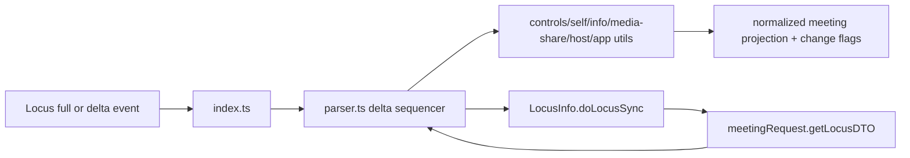
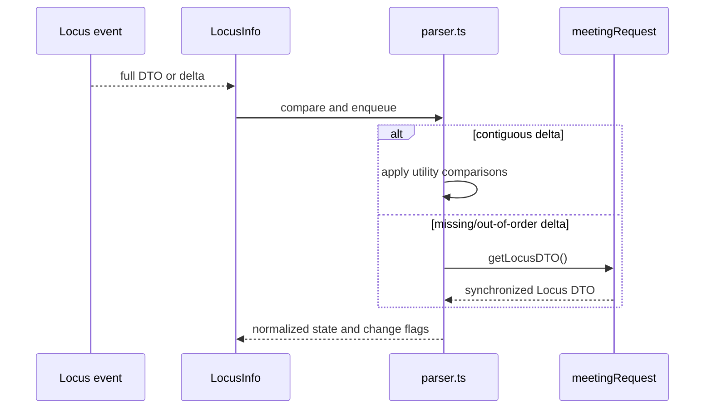
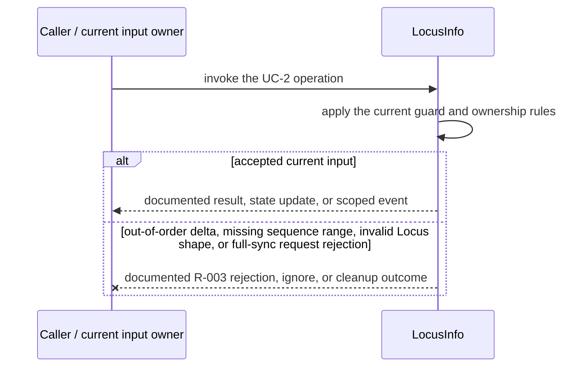
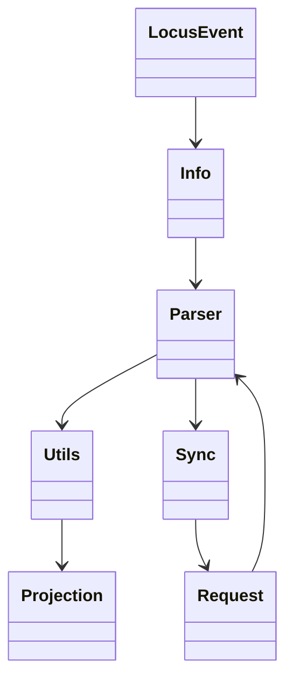
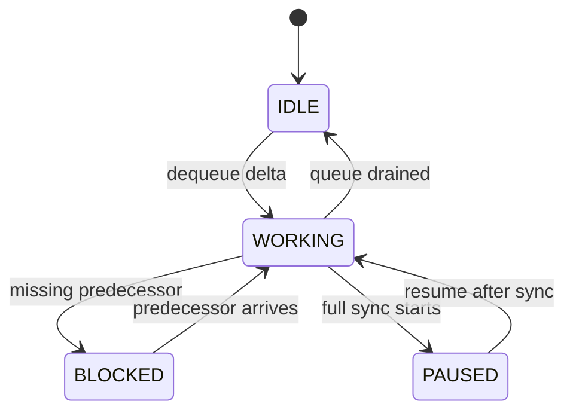

<!-- sdd-generated-metadata
doc_kind: module-spec
generated_from: module-spec@0.2.2
generator_plugin: repo-annotation@1.0.5+codex.20260818094939
generated_by: codex
approved_by: repository user
updated_at: 2026-08-21T06:10:05Z
validation_status: not-run
-->
# LOCUS INFO — SPEC

> Start here → root [`AGENTS.md`](../../../AGENTS.md) · router [`SPEC_INDEX.md`](../../../ai-docs/SPEC_INDEX.md) · system [`ARCHITECTURE.md`](../../../ai-docs/ARCHITECTURE.md). This is the canonical source-local spec for `src/locus-info/`.

## Metadata

| Field | Value |
|---|---|
| Module id | `locus-info` |
| Source path(s) | `src/locus-info/` |
| Parent spec | — |
| Doc kind | Module spec |
| Coverage score | 93% assessed 2026-08-21; 13/14 mandatory fields present; all critical and Important fields present; one noncritical polish gap remains |
| Generated from | `module-spec` @ SDLC template library `0.2.2` |
| generated_by / approved_by / updated_at | codex / repository user / 2026-08-21T06:10:05Z |
| Validation status | not-run |

## Evidence Rules

Requirements cite current implementation and mirrored unit-test paths. Current code wins over retained prose when they conflict; commit and PR history are excluded by repository-owner decision. Missing test evidence is stated as a gap rather than inferred.

## Source Material Register

| Source material | Scope | Decision | Detail location or disposition |
|---|---|---|---|
| No routed legacy module spec | overview / API / behavior / tests | none; generated from current parser/state code and tests |
| Current source and mirrored tests | implementation / tests | verified | requirements, flows, failures, and test strategy below |

## Overview

`src/locus-info/` contains 10 direct source/reference file(s) and has 10 mirrored unit-test file(s). This spec separates its public operations, runtime data movement, component ownership, state applicability, and verification boundary.

## Purpose / Responsibility

Normalizes Locus full-state, delta, API-response, and hash-tree inputs into one meeting-state projection and scoped callbacks.

## Stack

TypeScript/JavaScript in the Node 22.14 Yarn workspace; Webex core/plugin abstractions and Mocha/Sinon/`@webex/test-helper-chai` tests. Build target: `yarn workspace @webex/plugin-meetings build:src`.

## Folder / Package Structure

```text
src/locus-info/
├── controlsUtils.ts — controlsUtils implementation responsibility
├── embeddedAppsUtils.ts — embeddedAppsUtils implementation responsibility
├── fullState.ts — state projection or transition logic
├── hostUtils.ts — hostUtils implementation responsibility
├── index.ts — module facade/controller or primary exports
├── infoUtils.ts — infoUtils implementation responsibility
├── mediaSharesUtils.ts — mediaSharesUtils implementation responsibility
├── parser.ts — parser implementation responsibility
├── selfUtils.ts — selfUtils implementation responsibility
├── types.ts — module type declarations
└── ai-docs/locus-info-spec.md — canonical module specification
```

## Key Files (source of truth)

| File | Holds |
|---|---|
| `src/locus-info/controlsUtils.ts` | controlsUtils implementation responsibility |
| `src/locus-info/embeddedAppsUtils.ts` | embeddedAppsUtils implementation responsibility |
| `src/locus-info/fullState.ts` | state projection or transition logic |
| `src/locus-info/hostUtils.ts` | hostUtils implementation responsibility |
| `src/locus-info/index.ts` | module facade/controller or primary exports |
| `src/locus-info/infoUtils.ts` | infoUtils implementation responsibility |
| `src/locus-info/mediaSharesUtils.ts` | mediaSharesUtils implementation responsibility |
| `src/locus-info/parser.ts` | parser implementation responsibility |
| `src/locus-info/selfUtils.ts` | selfUtils implementation responsibility |
| `src/locus-info/types.ts` | module type declarations |
| `test/unit/spec/locus-info/controlsUtils.js` and 9 sibling test file(s) | mirrored characterization/unit coverage |

## Public Surface

| Contract ID | Type | Surface | Purpose | Compatibility / deprecation | Schema / detail link | Root index |
|---|---|---|---|---|---|---|
| `locus-info.1` | SDK / in-process / remote | initialize/parse/update Locus state | Preserve the module responsibility through a focused operation group | Consumer-visible methods/events are semver-sensitive when reachable from package objects | `src/locus-info/index.ts` | [CONTRACTS](../../../ai-docs/CONTRACTS.md) |
| `locus-info.2` | SDK / in-process / remote | apply full, delta, API, and hash-tree updates | Preserve the module responsibility through a focused operation group | Consumer-visible methods/events are semver-sensitive when reachable from package objects | `src/locus-info/index.ts` | [CONTRACTS](../../../ai-docs/CONTRACTS.md) |
| `locus-info.3` | SDK / in-process / remote | emit scoped meeting/member/control/share callbacks | Preserve the module responsibility through a focused operation group | Consumer-visible methods/events are semver-sensitive when reachable from package objects | `src/locus-info/index.ts` | [CONTRACTS](../../../ai-docs/CONTRACTS.md) |

Compatibility notes:
- Prefer additive options and payload fields. Preserve method/event names, rejection semantics, and cleanup timing; route public changes through `src/index.ts` or the documented owning object.

## Requires (dependencies)

Locus payloads and fetch access, hash-tree parser, event scope utilities, member/meeting callbacks, and metrics.

## Requirements

| ID | WHAT | WHY | Source Evidence | Test / Example Evidence | Assumptions / Gaps | Confidence |
|---|---|---|---|---|---|---|
| `LOCUS-INFO-R-001` | initialize/parse/update Locus state. | Normalizes Locus full-state, delta, API-response, and hash-tree inputs into one meeting-state projection and scoped callbacks. | `src/locus-info/index.ts` | `test/unit/spec/locus-info/index.js` | none | PRESENT |
| `LOCUS-INFO-R-002` | apply full, delta, API, and hash-tree updates. | Callers need deterministic observable behavior across async Webex inputs. | `src/locus-info/index.ts`, `src/locus-info/parser.ts` | `test/unit/spec/locus-info/index.js` | additional edge cases may live in sibling tests | PRESENT |
| `LOCUS-INFO-R-003` | Malformed or stale deltas follow parser comparison rules; sync failures reject through the owning request path without inventing a projection. | Callers must receive the actual module failure outcome without false cleanup or event guarantees. | `src/locus-info/` | `test/unit/spec/locus-info/index.js` | none | PRESENT |
| `LOCUS-INFO-R-004` | Full-state, delta, API-response, and hash-tree inputs converge through parsers into the same current Locus projection. | Alternate synchronization transports must not expose divergent meeting state. | `src/locus-info/index.ts`, `src/locus-info/parser.ts` | `test/unit/spec/locus-info/index.js`, `test/unit/spec/locus-info/parser.js` | none | PRESENT |
| `LOCUS-INFO-R-005` | Sequence/dataset mismatches trigger metric/reporting and synchronization rather than speculative application. | Applying stale or incomplete remote state can produce false meeting/member/control events. | `src/locus-info/index.ts`, `src/hashTree/hashTreeParser.ts` | `test/unit/spec/locus-info/index.js`, `test/unit/spec/hashTree/hashTreeParser.ts` | none | PRESENT |
| `LOCUS-INFO-R-006` | Normalized changes invoke the correct scoped callback/event for members, self, controls, media shares, host, embedded apps, and meeting lifecycle. | Parent Meeting and consumers need domain-specific deltas, not an undifferentiated Locus payload. | `src/locus-info/index.ts`, `src/locus-info/controlsUtils.ts`, `src/locus-info/selfUtils.ts` | `test/unit/spec/locus-info/index.js`, `test/unit/spec/locus-info/controlsUtils.js`, `test/unit/spec/locus-info/selfUtils.js` | none | PRESENT |

## Design Overview

`LocusInfo` owns the normalized meeting projection. The utility files compare individual Locus domains, while `parser.ts` serializes delta application and calls `LocusInfo.doLocusSync()` when a gap requires the parent meeting request to fetch a full DTO.

## Data Flow



## Sequence Diagram(s)

Sequence coverage:

| Operation group | Diagram | Failure coverage |
|---|---|---|
| UC-1 — primary operation | Primary operation sequence | accepted and rejected dependency outcomes |
| UC-2 — secondary/change operation | Secondary operation and failure sequence | out-of-order delta, missing sequence range, invalid Locus shape, or full-sync request rejection |

### Primary operation sequence



### Secondary operation and failure sequence



## Class / Component Relationships



The arrows identify ownership and delegation inside `src/locus-info/`; files that only declare types or constants are not presented as transports.

## Use Cases

- **UC-1:** Serialize Locus deltas so only one event mutates the projection at a time. Evidence: `src/locus-info/`.
- **UC-2:** Pause/block and perform a full Locus sync when sequence comparison shows missing or out-of-order state. Evidence: `src/locus-info/`.

## State Model

Normalized Locus, sequence/dataset state, meeting activity, partner/self/member projections, and suspension flags are held per meeting.

## Business Rules & Invariants

- Older or mismatched updates must not silently replace newer state; self participant existence and dataset consistency are repaired before callbacks. Enforced by `src/locus-info/index.ts` and supporting code under `src/locus-info/`.

## Concurrency & Reactive Flow

- Async work owned by `LocusInfo` may complete after a newer caller or remote input. Preserve the identity, sequence, and resource-owner guards in `src/locus-info/`; a late completion must not replay UC-2 for superseded state.

## State Machine



The diagram uses the parser's `IDLE`, `WORKING`, `BLOCKED`, and `PAUSED` values from `src/locus-info/parser.ts`.

## Protocol / Wire Format

- External payloads are parsed/serialized by files under `src/locus-info/` and existing Webex/media dependencies. Preserve current field names, enum/raw values, sequence identifiers, and compatibility behavior; do not treat the normalized client model as the wire schema.

## Error Handling & Failure Modes

| Condition | Signal | Caller recovery |
|---|---|---|
| out-of-order delta, missing sequence range, invalid Locus shape, or full-sync request rejection | Follow the concrete rejection, ignore, state, or cleanup behavior in the module's R-003 requirement. | Resolve the named condition; retry only when another requirement defines a bound. |
| UC-1 succeeds | Return, update, callback, or scoped event identified by the Public Surface and primary sequence. | Continue from the owning module's accepted state. |

## Pitfalls

- Full, delta, and hash-tree messages can overlap or arrive out of order. Updating callbacks before reconciliation creates transient false state.
- Public behavior may be reachable through a parent `Meeting`/`Meetings` object even when the source helper is not exported directly.

## Test-Case Strategy (module)

Use the current mirrored suites: `test/unit/spec/locus-info/controlsUtils.js`, `test/unit/spec/locus-info/embeddedAppsUtils.js`, `test/unit/spec/locus-info/index.js`, `test/unit/spec/locus-info/infoUtils.js`, `test/unit/spec/locus-info/lib/BasicSeqCmp.json`, `test/unit/spec/locus-info/lib/SeqCmp.json`, `test/unit/spec/locus-info/mediaSharesUtils.ts`, `test/unit/spec/locus-info/parser.js`, `test/unit/spec/locus-info/selfConstant.js`, `test/unit/spec/locus-info/selfUtils.js`. Characterize the two code-grounded use cases above and the listed failure condition; add cleanup or transition cases only for resources and state this module actually owns.

| Behavior / Requirement | Existing test evidence | Gap |
|---|---|---|
| `LOCUS-INFO-R-001` | `test/unit/spec/locus-info/index.js` | confirm the named operation against its owning sibling suite |
| `LOCUS-INFO-R-002` | `test/unit/spec/locus-info/index.js` | verify the code-grounded rejection or stale-input branch |
| `LOCUS-INFO-R-003` | `test/unit/spec/locus-info/index.js` | verify the concrete R-003 rejection, ignore, or cleanup outcome |
| `LOCUS-INFO-R-004` | `test/unit/spec/locus-info/index.js`, `test/unit/spec/locus-info/parser.js` | none |
| `LOCUS-INFO-R-005` | `test/unit/spec/locus-info/index.js`, `test/unit/spec/hashTree/hashTreeParser.ts` | verify all mismatch recovery outcomes |
| `LOCUS-INFO-R-006` | `test/unit/spec/locus-info/controlsUtils.js`, `test/unit/spec/locus-info/selfUtils.js` | verify every callback family during focused changes |

## Traceability

- Repo architecture: [`ARCHITECTURE.md`](../../../ai-docs/ARCHITECTURE.md) · Registry: [`SPEC_INDEX.md`](../../../ai-docs/SPEC_INDEX.md)
- Coverage state and contracts baseline: `../../../.sdd/manifest.json`
