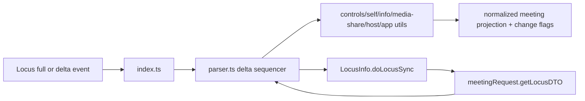
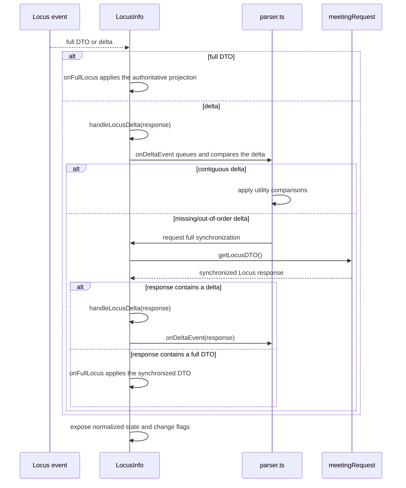
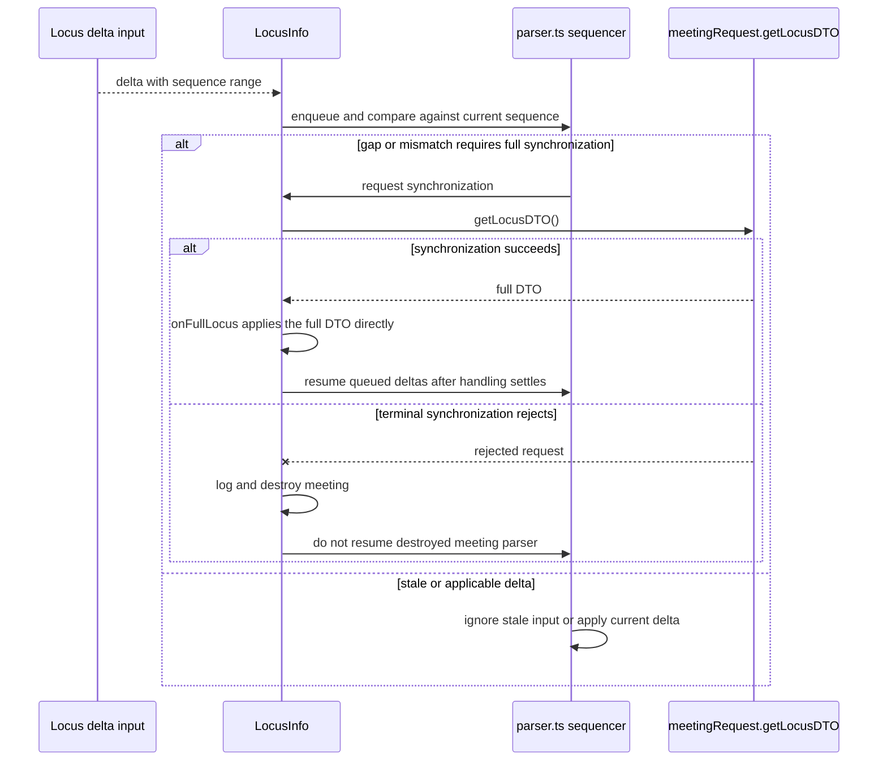
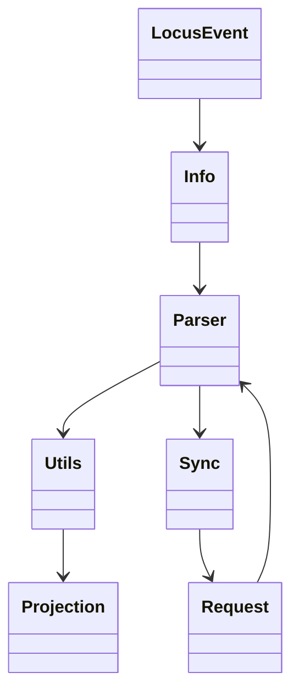
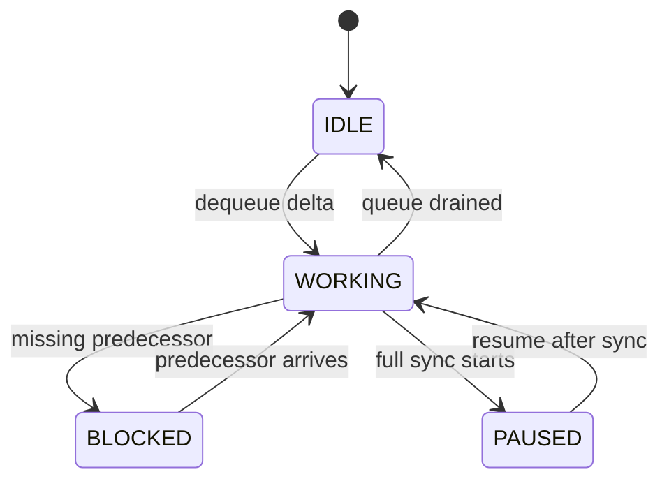

<!-- sdd-generated-metadata
doc_kind: module-spec
generated_from: module-spec@0.2.2
generator_plugin: repo-annotation@1.0.5+codex.20260818094939
generated_by: codex
approved_by: repository user
updated_at: 2026-08-22T15:21:29Z
validation_status: pass-with-warnings
-->
# LOCUS INFO — SPEC

> Start here → root [`AGENTS.md`](../../../AGENTS.md) · router [`SPEC_INDEX.md`](../../../ai-docs/SPEC_INDEX.md) · system [`ARCHITECTURE.md`](../../../ai-docs/ARCHITECTURE.md). This is the canonical source-local spec for `src/locus-info/`.

## Metadata

| Field | Value |
|---|---|
| Module id | `locus-info` |
| Source path(s) | `src/locus-info/` |
| Parent spec | — |
| Doc kind | Module spec |
| Coverage score | 93% assessed 2026-08-22; 13/14 mandatory fields present; all critical and Important fields present; one noncritical polish gap remains; pending independent validation of the participant-role repair |
| Generated from | `module-spec` @ SDLC template library `0.2.2` |
| generated_by / approved_by / updated_at | codex / repository user / 2026-08-22T15:21:29Z |
| Validation status | pass-with-warnings |

## Evidence Rules

Requirements cite current implementation and mirrored unit-test paths. Current code wins over retained prose when they conflict; commit and PR history are excluded by repository-owner decision. Missing test evidence is stated as a gap rather than inferred.

## Source Material Register

| Source material | Scope | Decision | Detail location or disposition |
|---|---|---|---|
| No routed legacy module spec | overview / API / behavior / tests | none; generated from current parser/state code and tests |
| Current source and mirrored tests | implementation / tests | verified | requirements, flows, failures, and test strategy below |

## Overview

`src/locus-info/` contains 10 direct source/reference file(s) and has 10 mirrored unit-test file(s). This spec separates its public operations, runtime data movement, component ownership, state applicability, and verification boundary.

## Purpose / Responsibility

Normalizes Locus full-state, delta, API-response, and hash-tree inputs into one meeting-state projection and scoped callbacks.

## Stack

TypeScript/JavaScript in the Node 22.14 Yarn workspace; Webex core/plugin abstractions and Mocha/Sinon/`@webex/test-helper-chai` tests. Build target: `yarn workspace @webex/plugin-meetings build:src`.

## Folder / Package Structure

```text
src/locus-info/
├── controlsUtils.ts — controlsUtils implementation responsibility
├── embeddedAppsUtils.ts — embeddedAppsUtils implementation responsibility
├── fullState.ts — state projection or transition logic
├── hostUtils.ts — hostUtils implementation responsibility
├── index.ts — module facade/controller or primary exports
├── infoUtils.ts — infoUtils implementation responsibility
├── mediaSharesUtils.ts — mediaSharesUtils implementation responsibility
├── parser.ts — parser implementation responsibility
├── selfUtils.ts — selfUtils implementation responsibility
├── types.ts — module type declarations
└── ai-docs/locus-info-spec.md — canonical module specification
```

## Key Files (source of truth)

| File | Holds |
|---|---|
| `src/locus-info/controlsUtils.ts` | controlsUtils implementation responsibility |
| `src/locus-info/embeddedAppsUtils.ts` | embeddedAppsUtils implementation responsibility |
| `src/locus-info/fullState.ts` | state projection or transition logic |
| `src/locus-info/hostUtils.ts` | hostUtils implementation responsibility |
| `src/locus-info/index.ts` | module facade/controller or primary exports |
| `src/locus-info/infoUtils.ts` | infoUtils implementation responsibility |
| `src/locus-info/mediaSharesUtils.ts` | mediaSharesUtils implementation responsibility |
| `src/locus-info/parser.ts` | parser implementation responsibility |
| `src/locus-info/selfUtils.ts` | selfUtils implementation responsibility |
| `src/locus-info/types.ts` | module type declarations |
| `test/unit/spec/locus-info/controlsUtils.js` and 9 sibling test file(s) | mirrored characterization/unit coverage |

## Public Surface

| Contract ID | Type | Surface | Purpose | Compatibility / deprecation | Schema / detail link | Root index |
|---|---|---|---|---|---|---|
| `locus-info.1` | SDK / initialization | `init()`, `initialSetup()`, `handleLocusAPIResponse()`, and `applyLocusDeltaData()` / `handleLocusDelta()` | Establish the Locus projection and serialize API/Mercury delta entry paths. | Preserve initialization order and single-event mutation discipline. | `src/locus-info/index.ts` | [CONTRACTS](../../../ai-docs/CONTRACTS.md) |
| `locus-info.2` | SDK / hash-tree | `updateLocusFromHashTreeObject()`, `sendClassicVsHashTreeMismatchMetric()`, and `syncAllHashTreeDatasets()` | Convert synchronized hash-tree objects into the same Locus projection and emit the existing metric when the update arrives in the unexpected transport shape. | Preserve parser callback ownership, metric trigger conditions, and dataset synchronization boundaries. | `src/locus-info/index.ts`, `src/hashTree/hashTreeParser.ts` | [CONTRACTS](../../../ai-docs/CONTRACTS.md) |
| `locus-info.3` | SDK / parsing/event | `parse()`, `emitScoped()`, `onFullLocus()`, `onDeltaLocus()`, and `handleOneOnOneEvent()` | Parse full/delta payloads and notify composed Meeting controllers through scoped callbacks. | Preserve callback names/payloads and one-on-one handling. | `src/locus-info/index.ts` | [CONTRACTS](../../../ai-docs/CONTRACTS.md) |
| `locus-info.4` | SDK / projection | `updateLocusInfo()`, `getLocusPartner()`, `isMeetingActive()`, `suspendDestroyMeeting()`, `compareAndUpdate()`, and `compareSelfAndHost()` | Reconcile core meeting activity, partner, self, and host changes without duplicating remote transport. | Preserve comparison semantics and destroy-suspension behavior. | `src/locus-info/index.ts` | [CONTRACTS](../../../ai-docs/CONTRACTS.md) |
| `locus-info.5` | SDK / projection | `updateParticipants()`, `updateControls()`, `updateConversationUrl()`, `updateCreated()`, `updateLinks()`, `updateFullState()`, `updateHostInfo()`, `updateMeetingInfo()`, `updateEmbeddedApps()`, `updateMediaShares()`, `updateReplaces()`, `updateSelf()`, `ensureSelfParticipantExists()`, and `mergeParticipants()` | Project the complete set of Locus subdocuments into Meeting, Members, controls, media shares, and related state. | Preserve per-subdocument comparison and callback routing. | `src/locus-info/index.ts`, `src/locus-info/controlsUtils.ts`, `src/locus-info/embeddedAppsUtils.ts`, `src/locus-info/mediaSharesUtils.ts` | [CONTRACTS](../../../ai-docs/CONTRACTS.md) |
| `locus-info.6` | SDK / identity/cache | `updateLocusUrl()`, `updateAclUrl()`, `updateBasequence()`, `updateSequence()`, `updateLocusCache()`, `getTheLocusToUpdate()`, `updateMainSessionLocusCache()`, `clearMainSessionLocusCache()`, and `cleanUp()` | Maintain the current/main Locus identity and cached payload used for subsequent comparison. | Preserve main-session separation and cleanup of owned parser/cache state. | `src/locus-info/index.ts` | [CONTRACTS](../../../ai-docs/CONTRACTS.md) |
| `locus-info.7` | parser comparison | `locus2string()`, `checkSequenceOverlap()`, `checkUnequalRanges()`, `checkForUniqueEntries()`, `checkIfOutOfSync()`, `compare()`, `compareFullDtoSequence()`, `isNewFullLocus()`, `compareSequence()`, `compareToAction()`, `extractComparisonState()`, `getMetaData()`, `getUniqueSequences()`, `getNumbersOutOfRange()`, `isValidLocus()`, `isSequenceEmpty()`, and `isLoci()` | Determine whether a delta is contiguous, duplicate, missing, or requires a full sync. | Preserve concrete `IDLE`, `PAUSED`, `WORKING`, and `BLOCKED` parser-state transitions. | `src/locus-info/parser.ts` | [CONTRACTS](../../../ai-docs/CONTRACTS.md) |
| `locus-info.8` | parser queue/lifecycle | `nextEvent()`, `onDeltaAction()`, `onDeltaEvent()`, `packComparisonResult()`, `pause()`, `processDeltaEvent()`, `resume()`, and `getDebugMessage()` | Serialize queued deltas and expose/debug the parser's current blocking/working state. | Pause/resume and queue ordering are observable through applied callback order. | `src/locus-info/parser.ts` | [CONTRACTS](../../../ai-docs/CONTRACTS.md) |
| `locus-info.9` | exported helpers/contracts | `findMeetingForHashTreeMessage()`, `createLocusFromHashTreeMessage()`, `LocusLLMEvent`, `LocusApiResponseBody`, `HashTreeParserEntry`, `LocusInfoCallbacks`, `DisplayHintSection`, `EndMeetingReason`, `LocusFullState`, `Links`, `LocusDTO`, `ReplacesInfo`, and `LocusErrorCodes` | Share the exact Locus/hash-tree integration vocabulary used by Meetings and composed controllers. | Add fields compatibly; raw error/status/link shapes remain cross-module contracts. | `src/locus-info/index.ts`, `src/locus-info/types.ts`, `src/locus-info/fullState.ts`, `src/locus-info/infoUtils.ts` | [CONTRACTS](../../../ai-docs/CONTRACTS.md) |

Compatibility notes:
- Prefer additive options and payload fields. Preserve method/event names, rejection semantics, and cleanup timing; route public changes through `src/index.ts` or the documented owning object.

## Requires (dependencies)

Locus payloads and fetch access, hash-tree parser, event scope utilities, member/meeting callbacks, and metrics.

## Requirements

| ID | WHAT | WHY | Source Evidence | Test / Example Evidence | Assumptions / Gaps | Confidence |
|---|---|---|---|---|---|---|
| `LOCUS-INFO-R-001` | initialize/parse/update Locus state. | Normalizes Locus full-state, delta, API-response, and hash-tree inputs into one meeting-state projection and scoped callbacks. | `src/locus-info/index.ts` | `test/unit/spec/locus-info/index.js` | none | PRESENT |
| `LOCUS-INFO-R-002` | apply full, delta, API, and hash-tree updates. | Full, delta, API, and hash-tree inputs must converge on one ordered Locus projection without applying gaps. | `src/locus-info/index.ts`, `src/locus-info/parser.ts` | `test/unit/spec/locus-info/index.js` | internal full-sync failure while parser is blocked needs explicit recovery coverage | PRESENT |
| `LOCUS-INFO-R-003` | Malformed or stale deltas follow parser comparison rules. `doLocusSync()` returns `undefined`, intentionally ignores the request chain, falls back from delta to full sync when allowed, logs/destroys on terminal failure, and resumes the parser in `finally` when the meeting survives. | Parser recovery is internal and must not be documented as a caller-visible rejected promise when no such promise is returned. | `src/locus-info/index.ts`, `src/locus-info/parser.ts` | `test/unit/spec/locus-info/index.js`, `test/unit/spec/locus-info/parser.js` | terminal sync/destroy and parser-resume ordering need explicit coverage | PRESENT |
| `LOCUS-INFO-R-004` | Full-state, delta, API-response, and hash-tree inputs converge through parsers into the same current Locus projection. | Alternate synchronization transports must not expose divergent meeting state. | `src/locus-info/index.ts`, `src/locus-info/parser.ts` | `test/unit/spec/locus-info/index.js`, `test/unit/spec/locus-info/parser.js` | none | PRESENT |
| `LOCUS-INFO-R-005` | Sequence/dataset gaps trigger synchronization rather than speculative application. `sendClassicVsHashTreeMismatchMetric()` reports an unexpected classic-Locus transport shape while hash-tree mode is enabled; it does not compare classic and hash-tree state values. | Applying stale or incomplete remote state can produce false meeting/member/control events, while the metric contract must not imply a state-diff computation that does not exist. | `src/locus-info/index.ts`, `src/hashTree/hashTreeParser.ts` | `test/unit/spec/locus-info/index.js`, `test/unit/spec/hashTree/hashTreeParser.ts` | none | PRESENT |
| `LOCUS-INFO-R-006` | Normalized changes invoke the correct scoped callback/event for members, self, controls, media shares, host, embedded apps, and meeting lifecycle. | Parent Meeting and consumers need domain-specific deltas, not an undifferentiated Locus payload. | `src/locus-info/index.ts`, `src/locus-info/controlsUtils.ts`, `src/locus-info/selfUtils.ts` | `test/unit/spec/locus-info/index.js`, `test/unit/spec/locus-info/controlsUtils.js`, `test/unit/spec/locus-info/selfUtils.js` | none | PRESENT |

## Design Overview

`LocusInfo` owns the normalized meeting projection. The utility files compare individual Locus domains, while `parser.ts` serializes delta application and calls `LocusInfo.doLocusSync()` when a gap requires the parent meeting request to fetch a full DTO.

## Data Flow



## Sequence Diagram(s)

Sequence coverage:

| Operation group | Diagram | Failure coverage |
|---|---|---|
| UC-1…UC-6 — Locus projection and recovery operation groups | Locus projection and recovery primary sequence | duplicate/out-of-order delta, blocked parser, internal sync failure, and cache cleanup |
| UC-1…UC-6 — Locus projection and recovery alternate/failure paths | Locus projection and recovery alternate/failure sequence | out-of-order delta, missing sequence range, invalid Locus shape, or full-sync request rejection |

### Locus projection and recovery primary sequence



### Locus projection and recovery alternate/failure sequence



## Class / Component Relationships



The arrows identify ownership and delegation inside `src/locus-info/`; files that only declare types or constants are not presented as transports.

## Use Cases

- **UC-1:** Initialize from a full Locus API response and project self, host, participants, controls, links, meeting info, shares, embedded apps, and replacement state. Evidence: `src/locus-info/index.ts`.
- **UC-2:** Serialize incoming Locus deltas so only one queued event mutates the projection at a time. Evidence: `src/locus-info/parser.ts`, `src/locus-info/index.ts`.
- **UC-3:** Pause/block parsing and initiate the internal full-sync path when sequence comparison finds missing or out-of-order state. Evidence: `src/locus-info/parser.ts`, `src/locus-info/index.ts`.
- **UC-4:** Convert hash-tree messages/API responses into Locus updates and emit the existing diagnostic when a classic-Locus-shaped update arrives while hash-tree mode is enabled; no classic-vs-hash-tree value comparison is performed. Evidence: `src/locus-info/index.ts`, `src/hashTree/hashTreeParser.ts`.
- **UC-5:** Emit scoped callbacks only for the Locus subdocuments that changed, preserving Meeting/Members/controller ownership. Evidence: `src/locus-info/index.ts`, `src/locus-info/controlsUtils.ts`, `src/locus-info/embeddedAppsUtils.ts`, `src/locus-info/mediaSharesUtils.ts`.
- **UC-6:** Maintain and clear distinct current/main-session Locus caches as breakout session context changes. Evidence: `src/locus-info/index.ts`.

## State Model

Normalized Locus, sequence/dataset state, meeting activity, partner/self/member projections, and suspension flags are held per meeting.

## Business Rules & Invariants

- Older or mismatched updates must not silently replace newer state; self participant existence and dataset consistency are repaired before callbacks. Enforced by `src/locus-info/index.ts` and supporting code under `src/locus-info/`.

## Concurrency & Reactive Flow

- Delta inputs are ordered by the parser's sequence state. A gap/mismatch enters the parser's synchronization path and the returned full DTO is parsed before later changes are exposed; stale inputs follow the comparison result instead of being applied speculatively.

## State Machine



The diagram uses the parser's `IDLE`, `WORKING`, `BLOCKED`, and `PAUSED` values from `src/locus-info/parser.ts`.

## Protocol / Wire Format

- External payloads are parsed/serialized by files under `src/locus-info/` and existing Webex/media dependencies. Preserve current field names, enum/raw values, sequence identifiers, and compatibility behavior; do not treat the normalized client model as the wire schema.

## Error Handling & Failure Modes

| Condition | Signal | Caller recovery |
|---|---|---|
| Delta sequence is stale, out of order, or has a missing range | `parser.ts` follows its sequence comparison result: stale input is not speculatively applied, and a gap requests full synchronization. | Wait for the synchronized DTO before consuming later projected changes. |
| `getLocusDTO()` rejects during `doLocusSync()` | The private method's internal promise chain handles the failure by logging and, on the terminal path, destroying the meeting; `doLocusSync()` itself returns `undefined`, so no rejection is propagated to a caller. Its `finally` resumes the parser when the meeting survives. | Observe the owning meeting/parser lifecycle rather than awaiting a nonexistent synchronization promise. |
| Full/API/hash-tree input is accepted | `LocusInfo` updates its normalized projection and invokes only the callbacks for changed member, self, control, share, host, app, or lifecycle fields. | Consume the scoped change callback rather than the raw Locus payload. |

## Pitfalls

- Full, delta, and hash-tree messages can overlap or arrive out of order. Updating callbacks before reconciliation creates transient false state.
- Public behavior may be reachable through a parent `Meeting`/`Meetings` object even when the source helper is not exported directly.

## Test-Case Strategy (module)

Use the current mirrored suites: `test/unit/spec/locus-info/controlsUtils.js`, `test/unit/spec/locus-info/embeddedAppsUtils.js`, `test/unit/spec/locus-info/index.js`, `test/unit/spec/locus-info/infoUtils.js`, `test/unit/spec/locus-info/lib/BasicSeqCmp.json`, `test/unit/spec/locus-info/lib/SeqCmp.json`, `test/unit/spec/locus-info/mediaSharesUtils.ts`, `test/unit/spec/locus-info/parser.js`, `test/unit/spec/locus-info/selfConstant.js`, `test/unit/spec/locus-info/selfUtils.js`. Characterize the locus-info-specific use cases above and each listed failure condition; add cleanup or transition cases only for resources and state this module actually owns.

| Behavior / Requirement | Existing test evidence | Gap |
|---|---|---|
| `LOCUS-INFO-R-001` | `test/unit/spec/locus-info/index.js` | cover full/API/delta/hash-tree entry paths and every changed-subdocument callback family |
| `LOCUS-INFO-R-002` | `test/unit/spec/locus-info/index.js` | internal full-sync failure while parser is blocked needs explicit recovery coverage |
| `LOCUS-INFO-R-003` | `test/unit/spec/locus-info/index.js`, `test/unit/spec/locus-info/parser.js` | characterize internal sync failure handling, blocked-queue resume, and cleanup without implying caller rejection |
| `LOCUS-INFO-R-004` | `test/unit/spec/locus-info/index.js`, `test/unit/spec/locus-info/parser.js` | none |
| `LOCUS-INFO-R-005` | `test/unit/spec/locus-info/index.js`, `test/unit/spec/hashTree/hashTreeParser.ts` | verify sequence/dataset recovery separately from the unexpected-transport-shape metric trigger |
| `LOCUS-INFO-R-006` | `test/unit/spec/locus-info/controlsUtils.js`, `test/unit/spec/locus-info/selfUtils.js` | verify every callback family during focused changes |

## Traceability

- Repo architecture: [`ARCHITECTURE.md`](../../../ai-docs/ARCHITECTURE.md) · Registry: [`SPEC_INDEX.md`](../../../ai-docs/SPEC_INDEX.md)
- Coverage state and contracts baseline: `../../../.sdd/manifest.json`
