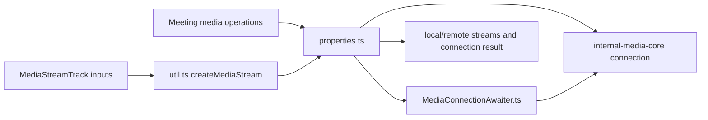
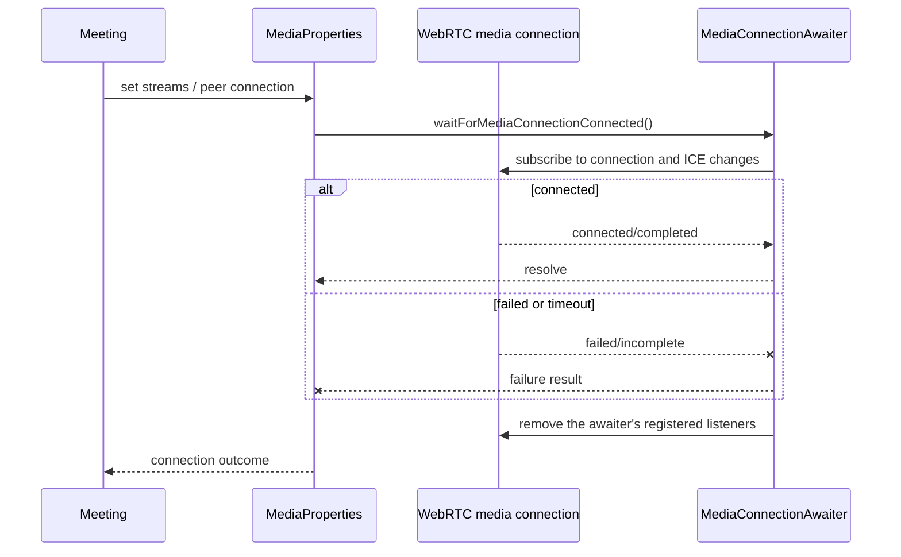
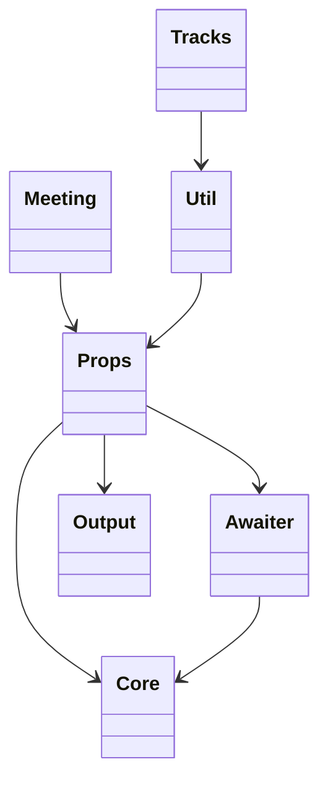

<!-- sdd-generated-metadata
doc_kind: module-spec
generated_from: module-spec@0.2.2
generator_plugin: repo-annotation@1.0.5+codex.20260818094939
generated_by: codex
approved_by: repository user
updated_at: 2026-08-22T15:21:29Z
validation_status: pass-with-warnings
-->
# MEDIA — SPEC

> Start here → root [`AGENTS.md`](../../../AGENTS.md) · router [`SPEC_INDEX.md`](../../../ai-docs/SPEC_INDEX.md) · system [`ARCHITECTURE.md`](../../../ai-docs/ARCHITECTURE.md). This is the canonical source-local spec for `src/media/`.

## Metadata

| Field | Value |
|---|---|
| Module id | `media` |
| Source path(s) | `src/media/` |
| Parent spec | — |
| Doc kind | Module spec |
| Coverage score | 93% assessed 2026-08-22; 13/14 mandatory fields present; all critical and Important fields present; one noncritical polish gap remains; pending independent validation of the participant-role repair |
| Generated from | `module-spec` @ SDLC template library `0.2.2` |
| generated_by / approved_by / updated_at | codex / repository user / 2026-08-22T15:21:29Z |
| Validation status | not-run |

## Evidence Rules

Requirements cite current implementation and mirrored unit-test paths. Current code wins over retained prose when they conflict; commit and PR history are excluded by repository-owner decision. Missing test evidence is stated as a gap rather than inferred.

## Source Material Register

| Source material | Scope | Decision | Detail location or disposition |
|---|---|---|---|
| Retained package README and upgrade guide | overview / API / behavior / tests | used and verified; local-media acquisition, add/update/stop media, ready/stopped events, and teardown guidance were placed into behavior and test strategy |
| Current source and mirrored tests | implementation / tests | verified | requirements, flows, failures, and test strategy below |

## Overview

`src/media/` contains 4 direct source/reference file(s) and has 3 mirrored unit-test file(s). This spec separates its public operations, runtime data movement, component ownership, state applicability, and verification boundary.

## Purpose / Responsibility

Creates/configures media-core connections, derives media properties, awaits readiness, and exposes media lifecycle helpers to Meeting.

## Stack

TypeScript/JavaScript in the Node 22.14 Yarn workspace; Webex core/plugin abstractions and Mocha/Sinon/`@webex/test-helper-chai` tests. Build target: `yarn workspace @webex/plugin-meetings build:src`.

## Folder / Package Structure

```text
src/media/
├── MediaConnectionAwaiter.ts — MediaConnectionAwaiter implementation responsibility
├── index.ts — module facade/controller or primary exports
├── properties.ts — properties implementation responsibility
├── util.ts — normalization/helper functions
└── ai-docs/media-spec.md — canonical module specification
```

## Key Files (source of truth)

| File | Holds |
|---|---|
| `src/media/MediaConnectionAwaiter.ts` | MediaConnectionAwaiter implementation responsibility |
| `src/media/index.ts` | module facade/controller or primary exports |
| `src/media/properties.ts` | properties implementation responsibility |
| `src/media/util.ts` | normalization/helper functions |
| `test/unit/spec/media/MediaConnectionAwaiter.ts` and 2 sibling test file(s) | mirrored characterization/unit coverage |

## Public Surface

| Contract ID | Type | Surface | Purpose | Compatibility / deprecation | Schema / detail link | Root index |
|---|---|---|---|---|---|---|
| `media.1` | SDK / in-process | `MediaProperties.setMediaDirection()`, `setMediaSettings()`, `setMediaPeerConnection()`, and `getVideoDeviceId()` / `setVideoDeviceId()` | Hold the media-core configuration and preferred camera identity used by Meeting. | Preserve default directions, null-device behavior, and setter names. | `src/media/properties.ts` | [CONTRACTS](../../../ai-docs/CONTRACTS.md) |
| `media.2` | SDK / in-process | local stream setters: `setLocalAudioStream()`, `setLocalVideoStream()`, `setLocalShareAudioStream()`, `setLocalShareVideoStream()`, and `hasLocalShareStream()` | Keep microphone, camera, and share tracks distinct so Meeting can publish and stop them independently. | Preserve optional-stream inputs and the boolean share predicate. | `src/media/properties.ts` | [CONTRACTS](../../../ai-docs/CONTRACTS.md) |
| `media.3` | SDK / in-process | remote setters: `setRemoteAudioStream()`, `setRemoteVideoStream()`, `setRemoteShareStream()`, `setRemoteQualityLevel()` | Store the remote media projections consumed by Meeting and UI code. | Preserve independent audio, video, share, and quality fields. | `src/media/properties.ts` | [CONTRACTS](../../../ai-docs/CONTRACTS.md) |
| `media.4` | SDK / lifecycle | `unsetRemoteMedia()`, `unsetRemoteShareStream()`, `unsetRemoteStreams()`, and `unsetPeerConnection()` | Detach stored references when the owning Meeting explicitly replaces or tears down media. | These methods do not close the peer connection or stop tracks themselves. | `src/media/properties.ts` | [CONTRACTS](../../../ai-docs/CONTRACTS.md) |
| `media.5` | SDK / async | `MediaProperties.waitForMediaConnectionConnected()` plus `MediaConnectionAwaiter.connectionStateChange()`, `peerConnectionStateHandler()`, `iceConnectionStateHandler()`, `iceGatheringStateHandler()`, `onTimeout()`, and `waitForMediaConnectionConnected()` | Resolve readiness or reject with `{iceConnected}` after concrete connection/ICE event and timeout evaluation. | Preserve the single retry for incomplete ICE gathering and listener cleanup on settlement. | `src/media/properties.ts`, `src/media/MediaConnectionAwaiter.ts` | [CONTRACTS](../../../ai-docs/CONTRACTS.md) |
| `media.6` | diagnostic | `MediaProperties.getCurrentConnectionInfo()`, `sendMediaIssueMetric()`, and `MediaConnectionAwaiter.sendMetric()` | Derive connection/IP diagnostics and emit bounded media issue information. | Preserve metric throttling and the existing unknown/fallback values. | `src/media/properties.ts`, `src/media/MediaConnectionAwaiter.ts` | [CONTRACTS](../../../ai-docs/CONTRACTS.md) |
| `media.7` | exported types/constants | `BundlePolicy`, `MediaDirection`, `IPVersion`, `MediaConnectionAwaiterProps`, and `FailureResult` | Provide the concrete configuration and failure shapes used across the meetings package. | Definitions are partitioned precisely: BundlePolicy is in the media index, MediaDirection and IPVersion are in properties, and the awaiter props/result types are in MediaConnectionAwaiter. Add fields compatibly; raw enum/type values are shared package contracts. | `src/media/index.ts`, `src/media/properties.ts`, `src/media/MediaConnectionAwaiter.ts` | [CONTRACTS](../../../ai-docs/CONTRACTS.md) |

### Emitted events

Current source emits or forwards these observable literals for this operation boundary. Preserve literal values, scope, payload shape, and emission timing; a constant name alone is not a substitute for the consumer-visible value.

| Event literal | Constant / expression | Emission evidence |
|---|---|---|
| `media:activeSpeakerChanged` | `EVENT_TRIGGERS.ACTIVE_SPEAKER_CHANGED` | `src/meeting/index.ts` |
| `media:codec:loaded` | `EVENT_TRIGGERS.MEDIA_CODEC_LOADED` | `src/meetings/util.ts` |
| `media:codec:missing` | `EVENT_TRIGGERS.MEDIA_CODEC_MISSING` | `src/meetings/util.ts` |
| `media:inboundAudio:issueDetected` | `EVENT_TRIGGERS.MEDIA_INBOUND_AUDIO_ISSUE_DETECTED` | `src/meeting/index.ts` |
| `media:negotiated` | `EVENT_TRIGGERS.MEDIA_NEGOTIATED` | `src/meeting/index.ts` |
| `media:ready` | `EVENT_TRIGGERS.MEDIA_READY` | `src/meeting/index.ts` |
| `media:remoteAudio:created` | `EVENT_TRIGGERS.REMOTE_MEDIA_AUDIO_CREATED` | `src/meeting/index.ts` |
| `media:remoteInterpretationAudio:created` | `EVENT_TRIGGERS.REMOTE_MEDIA_INTERPRETATION_AUDIO_CREATED` | `src/meeting/index.ts` |
| `media:remoteScreenShareAudio:created` | `EVENT_TRIGGERS.REMOTE_MEDIA_SCREEN_SHARE_AUDIO_CREATED` | `src/meeting/index.ts` |
| `media:remoteVideo:layoutChanged` | `EVENT_TRIGGERS.REMOTE_MEDIA_VIDEO_LAYOUT_CHANGED` | `src/meeting/index.ts` |
| `media:remoteAudioSourceCountChanged` | `EVENT_TRIGGERS.REMOTE_AUDIO_SOURCE_COUNT_CHANGED` | `src/meeting/index.ts` |
| `media:remoteVideoSourceCountChanged` | `EVENT_TRIGGERS.REMOTE_VIDEO_SOURCE_COUNT_CHANGED` | `src/meeting/index.ts` |
| `media:stopped` | `EVENT_TRIGGERS.MEDIA_STOPPED` | `src/meeting/index.ts` |

Compatibility notes:
- Prefer additive options and payload fields. Preserve method/event names, rejection semantics, and cleanup timing; route public changes through `src/index.ts` or the documented owning object.

## Requires (dependencies)

Browser WebRTC, @webex/internal-media-core, media helpers, meeting/Locus signaling, ROAP, and logging/metrics.

## Requirements

| ID | WHAT | WHY | Source Evidence | Test / Example Evidence | Assumptions / Gaps | Confidence |
|---|---|---|---|---|---|---|
| `MEDIA-R-001` | create and configure a media connection. | Creates/configures media-core connections, derives media properties, awaits readiness, and exposes media lifecycle helpers to Meeting. | `src/media/index.ts` | `test/unit/spec/media/index.ts` | none | PRESENT |
| `MEDIA-R-002` | `MediaProperties` attaches/replaces local and remote streams and the peer connection; `util.ts` constructs a `MediaStream` from received tracks. `MediaConnectionAwaiter` registers connection-readiness listeners and schedules its timeout, but its terminal branches do not all clear the timer explicitly. | Stream ownership must remain separate from readiness waiting, and documentation must preserve the timer asymmetry visible on immediate connection failure. | `src/media/properties.ts`, `src/media/util.ts`, `src/media/MediaConnectionAwaiter.ts` | `test/unit/spec/media/properties.ts`, `test/unit/spec/media/MediaConnectionAwaiter.ts` | none | PRESENT |
| `MEDIA-R-003` | Connection failure or timeout rejects with the awaiter result and `MediaConnectionAwaiter.clearCallbacks()` removes only the listeners it registered. It does not close the peer connection or unset streams; explicit `MediaProperties` unset methods detach stored references, while Meeting owns connection closure. | Callers must distinguish readiness-listener cleanup from transport and stream teardown. | `src/media/MediaConnectionAwaiter.ts`, `src/media/properties.ts`, `src/meeting/index.ts` | `test/unit/spec/media/MediaConnectionAwaiter.ts`, `test/unit/spec/media/properties.ts` | none | PRESENT |
| `MEDIA-R-004` | Media properties translate meeting options and local-stream state into media-core connection configuration. | Meeting callers should not depend directly on low-level media-core option shapes. | `src/media/properties.ts`, `src/media/index.ts` | `test/unit/spec/media/properties.ts`, `test/unit/spec/media/index.ts` | none | PRESENT |
| `MEDIA-R-005` | Readiness awaiting resolves on connection success after clearing the timer and listeners. On immediate connection failure, `connectionStateChange()` removes listeners and rejects but does not clear the scheduled timer; timeout settlement runs from the timer itself and removes listeners. | Consumers and maintainers must not infer uniform timer cleanup when the failure branch leaves its timeout callback scheduled. | `src/media/MediaConnectionAwaiter.ts` | `test/unit/spec/media/MediaConnectionAwaiter.ts` | characterize the post-failure timer callback and idempotent defer settlement | PRESENT |
| `MEDIA-R-006` | `MediaProperties.unsetRemoteStreams()` and `unsetPeerConnection()` detach the owned remote streams and connection during replacement/teardown; `util.ts` only creates a `MediaStream` from tracks. | Teardown ownership must be explicit so browser tracks and media-core callbacks do not outlive their meeting. | `src/media/properties.ts`, `src/media/util.ts` | `test/unit/spec/media/properties.ts` | none | PRESENT |

## Design Overview

`index.ts` exports media-facing types and helpers; `util.ts` only creates a `MediaStream`; `properties.ts` owns local/remote streams, the peer connection, teardown, and construction of `MediaConnectionAwaiter`, which waits on WebRTC/ICE events with bounded timeouts.

## Data Flow



## Sequence Diagram(s)

Sequence coverage:

| Operation group | Diagram | Failure coverage |
|---|---|---|
| UC-1…UC-5 — media properties and readiness operation groups | Media properties and readiness primary sequence | connection failure, bounded ICE timeout, listener removal, and explicit owner teardown |
| UC-1…UC-5 — media properties and readiness alternate/failure paths | Media properties and readiness alternate/failure sequence | WebRTC connection failure, incomplete ICE gathering after the bounded retry, missing tracks, or teardown during wait |

### Media properties and readiness primary sequence



### Media properties and readiness alternate/failure sequence

```mermaid
sequenceDiagram
  participant P as MediaProperties
  participant A as MediaConnectionAwaiter
  participant C as Media-core connection
  P->>A: waitForMediaConnectionConnected()
  A->>C: register connection and ICE listeners
  alt connection reaches connected/completed
    C-->>A: readiness event
    A-->>P: resolve once; clear timer and listeners
  else failure, closure, or timeout
    C--xA: terminal event or timer expiry
    A--xP: reject and remove listeners; immediate failure leaves timer scheduled
  end
```

## Class / Component Relationships



The arrows identify ownership and delegation inside `src/media/`; files that only declare types or constants are not presented as transports.

## Use Cases

- **UC-1:** Store media direction, media settings, preferred video device, and the active media-core connection on `MediaProperties`. Evidence: `src/media/properties.ts`.
- **UC-2:** Assign microphone, camera, share-audio, and share-video streams independently and test local sharing with `hasLocalShareStream()`. Evidence: `src/media/properties.ts`.
- **UC-3:** Replace or unset remote audio, video, and share references without treating those assignments as track or peer-connection closure. Evidence: `src/media/properties.ts`.
- **UC-4:** Await connection readiness, retry one incomplete ICE-gathering timeout, and remove only the awaiter's WebRTC listeners when it settles. Evidence: `src/media/MediaConnectionAwaiter.ts`.
- **UC-5:** Derive current connection diagnostics and throttle repeated media-issue metric submission. Evidence: `src/media/properties.ts`, `src/media/MediaConnectionAwaiter.ts`.

## State Model

Media connection, transceivers/streams, readiness waiters, and listener cleanup are held for the meeting media lifetime.

## Business Rules & Invariants

- Every readiness waiter exposes one defer result and removes registered listeners on its terminal path. Success clears the timer; immediate connection failure does not, so its timeout callback may still run later. Closed media is not reused, and permission/negotiation failures remain visible. Enforced by `src/media/MediaConnectionAwaiter.ts` and supporting code under `src/media/`.

## Concurrency & Reactive Flow

- Each `MediaConnectionAwaiter` uses one defer for its specific media-core connection and removes its WebRTC listeners on terminal paths. The connected path clears its timer; the immediate failed-state path does not. Replacing or tearing down media uses `MediaProperties.unsetRemoteStreams()` and `unsetPeerConnection()` so old stream/connection references are detached before reuse.

## Protocol / Wire Format

- External payloads are parsed/serialized by files under `src/media/` and existing Webex/media dependencies. Preserve current field names, enum/raw values, sequence identifiers, and compatibility behavior; do not treat the normalized client model as the wire schema.

## Error Handling & Failure Modes

| Condition | Signal | Caller recovery |
|---|---|---|
| Media connection reports immediate failure | `connectionStateChange()` rejects with its connection result and removes registered listeners but does not clear the scheduled timer. | Tear down or replace the connection; do not assume rejection canceled the timeout callback. |
| Media does not become ready before the awaiter's timeout | The timeout callback rejects with its connection result and removes registered listeners; one retry timer is scheduled when ICE gathering is incomplete on the first expiry. | Tear down or replace that connection before beginning a new media attempt. |
| Media connection reaches the expected connected/completed state | The awaiter resolves once and removes its listeners and timer. | Continue using the established connection. |
| Remote streams or peer connection are replaced/removed | `MediaProperties` unsets the owned stream or connection reference; `util.ts` only constructs a `MediaStream` from supplied tracks. | Do not assign transport lifecycle ownership to the utility helper. |

## Pitfalls

- Event listeners can fire before or after a wait begins. Register and inspect atomically. The connected path clears its timeout and listeners; the immediate failed-state path removes listeners but leaves the scheduled timeout callback in place, and timeout settlement removes listeners from within the timer path.
- Public behavior may be reachable through a parent `Meeting`/`Meetings` object even when the source helper is not exported directly.

## Key Design Trade-off

- A media-core adapter isolates Meeting from lower-level WebRTC details, adding translation code but keeping public meeting semantics stable.

## Test-Case Strategy (module)

Use the current mirrored suites: `test/unit/spec/media/MediaConnectionAwaiter.ts`, `test/unit/spec/media/index.ts`, `test/unit/spec/media/properties.ts`. Characterize the media-specific use cases above and each listed failure condition; add cleanup or transition cases only for resources and state this module actually owns.

| Behavior / Requirement | Existing test evidence | Gap |
|---|---|---|
| `MEDIA-R-001` | `test/unit/spec/media/index.ts` | cover property assignment, readiness waiting, diagnostics, and explicit teardown separately |
| `MEDIA-R-002` | `test/unit/spec/media/index.ts` | awaiter settlement versus Meeting-owned peer closure needs a boundary assertion |
| `MEDIA-R-003` | `test/unit/spec/media/MediaConnectionAwaiter.ts`, `test/unit/spec/media/properties.ts` | add a boundary assertion that awaiter rejection removes listeners but neither closes the connection nor unsets `MediaProperties` references |
| `MEDIA-R-004` | `test/unit/spec/media/properties.ts` | none |
| `MEDIA-R-005` | `test/unit/spec/media/MediaConnectionAwaiter.ts` | verify event-before-await race |
| `MEDIA-R-006` | `test/unit/spec/media/properties.ts` | verify unset during partial setup and replacement |

## Traceability

- Repo architecture: [`ARCHITECTURE.md`](../../../ai-docs/ARCHITECTURE.md) · Registry: [`SPEC_INDEX.md`](../../../ai-docs/SPEC_INDEX.md)
- Coverage state and contracts baseline: `../../../.sdd/manifest.json`
