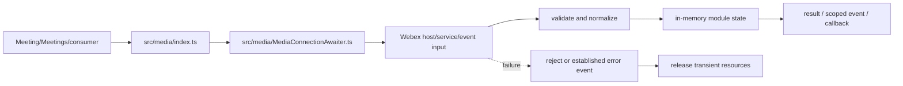
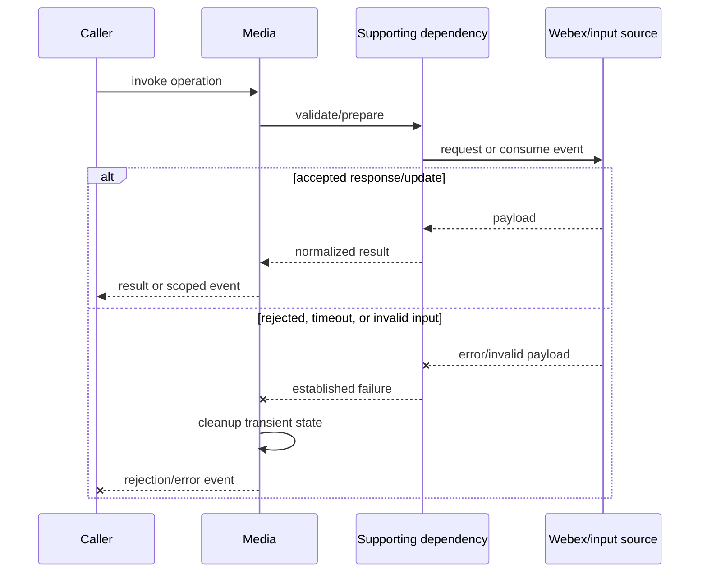
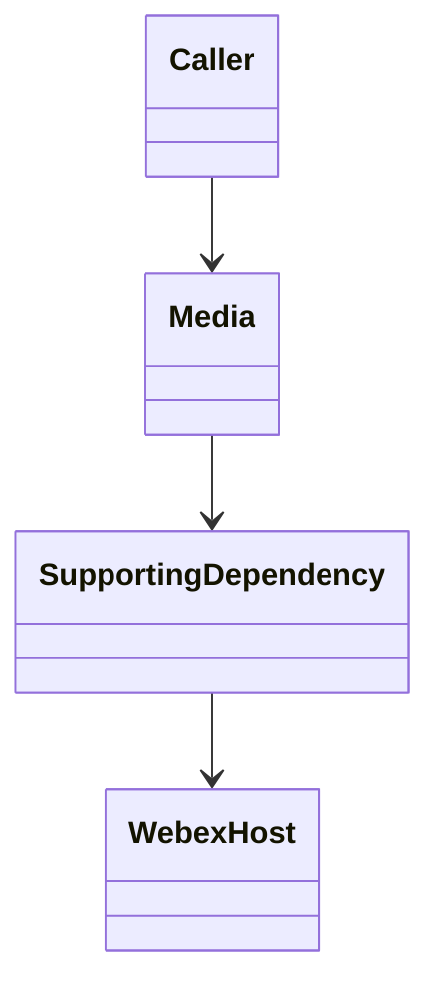
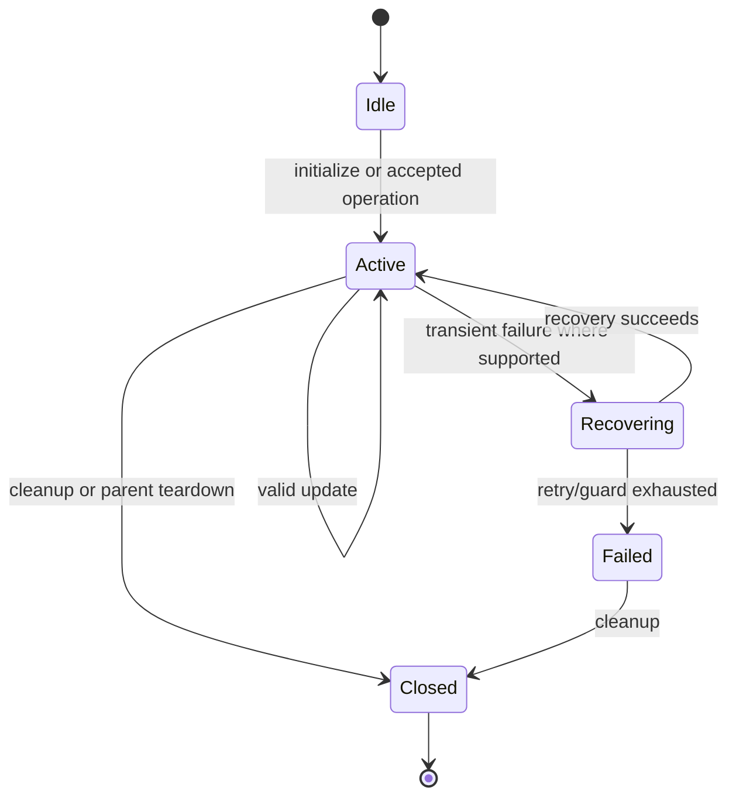

<!-- sdd-generated-metadata
doc_kind: module-spec
generated_from: module-spec@0.2.2
generator_plugin: repo-annotation@1.0.5+codex.20260818094939
generated_by: codex
approved_by: repository user
updated_at: 2026-08-18T15:33:39Z
validation_status: not-run
-->
# MEDIA — SPEC

> Start here → root [`AGENTS.md`](../../../AGENTS.md) · router [`SPEC_INDEX.md`](../../../ai-docs/SPEC_INDEX.md) · system [`ARCHITECTURE.md`](../../../ai-docs/ARCHITECTURE.md). This is the canonical source-local spec for `src/media/`.

## Metadata

| Field | Value |
|---|---|
| Module id | `media` |
| Source path(s) | `src/media/` |
| Parent spec | — |
| Doc kind | Module spec |
| Coverage score | 93% assessed 2026-08-18; 13/14 mandatory fields present; all critical fields present, one noncritical detail gap remains |
| Generated from | `module-spec` @ SDLC template library `0.2.2` |
| generated_by / approved_by / updated_at | codex / repository user / 2026-08-18T15:33:39Z |
| Validation status | not-run |

## Evidence Rules

Requirements cite current implementation and mirrored unit-test paths. Current code wins over retained prose when they conflict; commit and PR history are excluded by repository-owner decision. Missing test evidence is stated as a gap rather than inferred.

## Source Material Register

| Source material | Scope | Decision | Detail location or disposition |
|---|---|---|---|
| Retained package README and upgrade guide | overview / API / behavior / tests | used and verified; local-media acquisition, add/update/stop media, ready/stopped events, and teardown guidance were placed into behavior and test strategy |
| Current source and mirrored tests | implementation / tests | verified | requirements, flows, failures, and test strategy below |

## Overview

For orientation, start at `src/media/index.ts`; supporting files under `src/media/` separate request, parsing, collection, type, or utility concerns from parent orchestration. The module is composed by `Meeting`, `Meetings`, or the package entry as applicable. Remote Webex services/Locus remain authoritative, and all local state is scoped to the SDK, plugin, meeting, or operation lifetime.

## Purpose / Responsibility

Creates/configures media-core connections, derives media properties, awaits readiness, and exposes media lifecycle helpers to Meeting.

## Stack

TypeScript/JavaScript in the Node 22.14 Yarn workspace; Webex core/plugin abstractions and Mocha/Sinon/`@webex/test-helper-chai` tests. Build target: `yarn workspace @webex/plugin-meetings build:src`.

## Folder / Package Structure

```text
src/media/
├── index.ts — primary behavior/entry point
├── MediaConnectionAwaiter.ts — request, parser, utility, or supporting behavior
└── ai-docs/media-spec.md — canonical module specification
```

## Key Files (source of truth)

| File | Holds |
|---|---|
| `src/media/index.ts` | Primary lifecycle and public/internal surface |
| `src/media/MediaConnectionAwaiter.ts` | Supporting transport, parser, or state behavior |
| `test/unit/spec/media/index.ts` | Mirrored behavioral tests |
| `src/constants.ts` | Shared meeting/event/wire constants where consumed |

## Public Surface

| Contract ID | Type | Surface | Purpose | Compatibility / deprecation | Schema / detail link | Root index |
|---|---|---|---|---|---|---|
| `media.1` | SDK / in-process / remote | create and configure a media connection | Preserve the module responsibility through a focused operation group | Consumer-visible methods/events are semver-sensitive when reachable from package objects | `src/media/index.ts` | [CONTRACTS](../../../ai-docs/CONTRACTS.md) |
| `media.2` | SDK / in-process / remote | attach/update local streams and receive remote tracks | Preserve the module responsibility through a focused operation group | Consumer-visible methods/events are semver-sensitive when reachable from package objects | `src/media/index.ts` | [CONTRACTS](../../../ai-docs/CONTRACTS.md) |
| `media.3` | SDK / in-process / remote | await connection events with timeout and cleanup | Preserve the module responsibility through a focused operation group | Consumer-visible methods/events are semver-sensitive when reachable from package objects | `src/media/index.ts` | [CONTRACTS](../../../ai-docs/CONTRACTS.md) |

Compatibility notes:
- Prefer additive options and payload fields. Preserve method/event names, rejection semantics, and cleanup timing; route public changes through `src/index.ts` or the documented owning object.

## Requires (dependencies)

Browser WebRTC, @webex/internal-media-core, media helpers, meeting/Locus signaling, ROAP, and logging/metrics.

## Requirements

| ID | WHAT | WHY | Source Evidence | Test / Example Evidence | Assumptions / Gaps | Confidence |
|---|---|---|---|---|---|---|
| `MEDIA-R-001` | create and configure a media connection. | Creates/configures media-core connections, derives media properties, awaits readiness, and exposes media lifecycle helpers to Meeting. | `src/media/index.ts` | `test/unit/spec/media/index.ts` | none | PRESENT |
| `MEDIA-R-002` | attach/update local streams and receive remote tracks. | Callers need deterministic observable behavior across async Webex inputs. | `src/media/index.ts`, `src/media/MediaConnectionAwaiter.ts` | `test/unit/spec/media/index.ts` | additional edge cases may live in sibling tests | PRESENT |
| `MEDIA-R-003` | Failures reject/emit the established signal and release module-owned listeners, timers, or transient objects. | Hidden failure or leaked state causes later meeting operations to behave incorrectly. | `src/media/index.ts` | `test/unit/spec/media/index.ts` | verify sibling test files for operation-specific cleanup | PRESENT |
| `MEDIA-R-004` | Media properties translate meeting options and local-stream state into media-core connection configuration. | Meeting callers should not depend directly on low-level media-core option shapes. | `src/media/properties.ts`, `src/media/index.ts` | `test/unit/spec/media/properties.ts`, `test/unit/spec/media/index.ts` | none | PRESENT |
| `MEDIA-R-005` | Readiness awaiting settles once on the expected media event, timeout, error, or closure and removes listeners/timers. | A leaked or multiply settled waiter can hang join/update media and retain connection objects. | `src/media/MediaConnectionAwaiter.ts` | `test/unit/spec/media/MediaConnectionAwaiter.ts` | none | PRESENT |
| `MEDIA-R-006` | Closing or replacing a connection detaches remote tracks and prevents further use of the closed object. | Browser tracks and media-core callbacks otherwise outlive their meeting and surface stale streams. | `src/media/index.ts`, `src/media/util.ts` | `test/unit/spec/media/index.ts` | none | PRESENT |

## Design Overview

The primary entry point coordinates domain state and delegates transport/parsing to supporting files so those boundaries remain testable. Inputs are normalized before client state or events change. Async results preserve the established error signal, while teardown owns every listener, timer, or transient object allocated by this module.

## Data Flow



## Sequence Diagram(s)

Sequence coverage:

The operation groups below share the same caller → module → supporting dependency → Webex/input ordering and the same rejection/cleanup contract, so one combined diagram covers their common sequence; operation-specific state and guards are stated in the requirements and use cases.

| Operation group | Diagram | Failure / recovery coverage |
|---|---|---|
| create and configure a media connection | Primary operation | validation/service rejection and cleanup branch |
| attach/update local streams and receive remote tracks | Async update | stale/error input is rejected or ignored according to current code |



## Class / Component Relationships



The primary module object owns its client state and composes/invokes supporting request, parser, collection, or utility code. The Webex host/service remains the authority for remote state.

## Use Cases

- **UC-1 Primary operation:** a consumer or parent module invokes create and configure a media connection; the module validates/delegates, normalizes the result, updates state where applicable, and returns or emits the established outcome. Evidence: `src/media/index.ts`, `test/unit/spec/media/index.ts`.
- **UC-2 Async/change operation:** the parent or remote input triggers attach/update local streams and receive remote tracks; the module reconciles it with current state and exposes one scoped result. Evidence: `src/media/index.ts`, `src/media/MediaConnectionAwaiter.ts`.

## State Model

Media connection, transceivers/streams, readiness waiters, and listener cleanup are held for the meeting media lifetime.

## Business Rules & Invariants

- Every readiness waiter resolves/rejects once and removes listeners/timers; closed media is not reused; permission/negotiation failures remain visible. Enforced by `src/media/index.ts` and supporting code under `src/media/`.

## Concurrency & Reactive Flow

- Promise, event, media, and timer callbacks can interleave. Preserve existing sequence guards, make cleanup idempotent, and never start an unbounded retry/listener loop.
- Do not assume remote events are globally ordered unless the current parser/state code enforces ordering.

## State Machine



State labels summarize the module lifecycle; exact guards and values remain in `src/media/index.ts`.

## Protocol / Wire Format

- External payloads are parsed/serialized by files under `src/media/` and existing Webex/media dependencies. Preserve current field names, enum/raw values, sequence identifiers, and compatibility behavior; do not treat the normalized client model as the wire schema.

## Error Handling & Failure Modes

| Condition | Signal | Caller recovery |
|---|---|---|
| invalid options or unsupported state | established validation/error rejection | correct input/state; do not retry unchanged |
| Webex/service/media rejection | propagated typed/request/media error | branch on the established error; retry only where module policy is bounded |
| timeout, stale update, or teardown race | timeout/rejection/ignored stale update per current path | re-read current meeting state; allow cleanup/recovery manager to finish |

## Pitfalls

- Event listeners can fire before or after a wait begins. Register/inspect atomically and always clear timeout/listeners to avoid hangs and leaks.
- Public behavior may be reachable through a parent `Meeting`/`Meetings` object even when the source helper is not exported directly.

## Key Design Trade-off

- A media-core adapter isolates Meeting from lower-level WebRTC details, adding translation code but keeping public meeting semantics stable.

## Test-Case Strategy (module)

Use the mirrored suite as the first characterization boundary. Cover each public operation with a successful result/state/event and a rejected/invalid branch; use fake timers for timeout/retry logic; assert listener/resource cleanup for async modules; keep request/parser fixtures representative without secrets.

| Behavior / Requirement | Existing test evidence | Gap |
|---|---|---|
| `MEDIA-R-001` | `test/unit/spec/media/index.ts` | confirm sibling operation tests during focused changes |
| `MEDIA-R-002` | `test/unit/spec/media/index.ts` | verify out-of-order/rejection edge where applicable |
| `MEDIA-R-003` | `test/unit/spec/media/index.ts` | verify cleanup on every early-exit path |
| `MEDIA-R-004` | `test/unit/spec/media/properties.ts` | none |
| `MEDIA-R-005` | `test/unit/spec/media/MediaConnectionAwaiter.ts` | verify event-before-await race |
| `MEDIA-R-006` | `test/unit/spec/media/index.ts` | verify close during partial setup |

## Traceability

- Repo architecture: [`ARCHITECTURE.md`](../../../ai-docs/ARCHITECTURE.md) · Registry: [`SPEC_INDEX.md`](../../../ai-docs/SPEC_INDEX.md)
- Coverage state and contracts baseline: `../../../.sdd/manifest.json`
