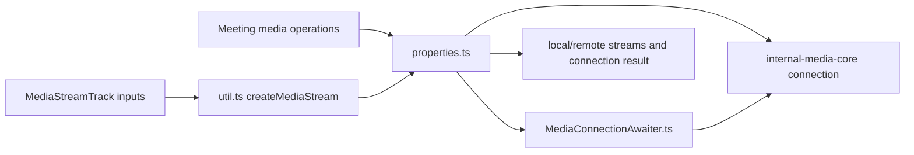
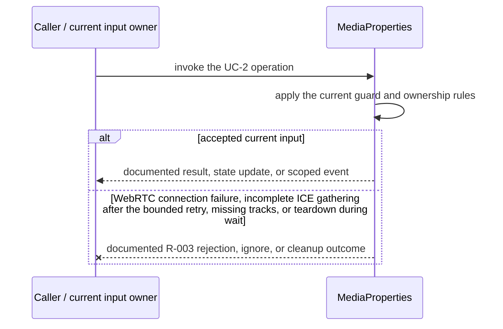
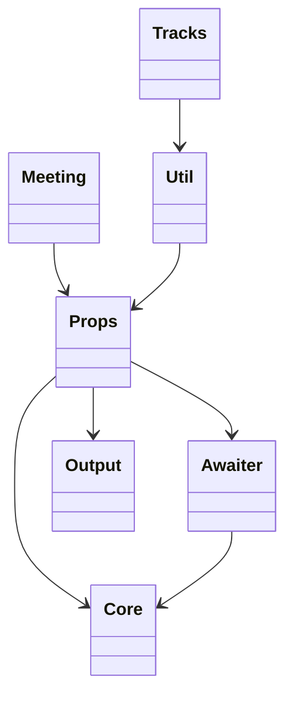

<!-- sdd-generated-metadata
doc_kind: module-spec
generated_from: module-spec@0.2.2
generator_plugin: repo-annotation@1.0.5+codex.20260818094939
generated_by: codex
approved_by: repository user
updated_at: 2026-08-21T06:10:05Z
validation_status: not-run
-->
# MEDIA — SPEC

> Start here → root [`AGENTS.md`](../../../AGENTS.md) · router [`SPEC_INDEX.md`](../../../ai-docs/SPEC_INDEX.md) · system [`ARCHITECTURE.md`](../../../ai-docs/ARCHITECTURE.md). This is the canonical source-local spec for `src/media/`.

## Metadata

| Field | Value |
|---|---|
| Module id | `media` |
| Source path(s) | `src/media/` |
| Parent spec | — |
| Doc kind | Module spec |
| Coverage score | 93% assessed 2026-08-21; 13/14 mandatory fields present; all critical and Important fields present; one noncritical polish gap remains |
| Generated from | `module-spec` @ SDLC template library `0.2.2` |
| generated_by / approved_by / updated_at | codex / repository user / 2026-08-21T06:10:05Z |
| Validation status | not-run |

## Evidence Rules

Requirements cite current implementation and mirrored unit-test paths. Current code wins over retained prose when they conflict; commit and PR history are excluded by repository-owner decision. Missing test evidence is stated as a gap rather than inferred.

## Source Material Register

| Source material | Scope | Decision | Detail location or disposition |
|---|---|---|---|
| Retained package README and upgrade guide | overview / API / behavior / tests | used and verified; local-media acquisition, add/update/stop media, ready/stopped events, and teardown guidance were placed into behavior and test strategy |
| Current source and mirrored tests | implementation / tests | verified | requirements, flows, failures, and test strategy below |

## Overview

`src/media/` contains 4 direct source/reference file(s) and has 3 mirrored unit-test file(s). This spec separates its public operations, runtime data movement, component ownership, state applicability, and verification boundary.

## Purpose / Responsibility

Creates/configures media-core connections, derives media properties, awaits readiness, and exposes media lifecycle helpers to Meeting.

## Stack

TypeScript/JavaScript in the Node 22.14 Yarn workspace; Webex core/plugin abstractions and Mocha/Sinon/`@webex/test-helper-chai` tests. Build target: `yarn workspace @webex/plugin-meetings build:src`.

## Folder / Package Structure

```text
src/media/
├── MediaConnectionAwaiter.ts — MediaConnectionAwaiter implementation responsibility
├── index.ts — module facade/controller or primary exports
├── properties.ts — properties implementation responsibility
├── util.ts — normalization/helper functions
└── ai-docs/media-spec.md — canonical module specification
```

## Key Files (source of truth)

| File | Holds |
|---|---|
| `src/media/MediaConnectionAwaiter.ts` | MediaConnectionAwaiter implementation responsibility |
| `src/media/index.ts` | module facade/controller or primary exports |
| `src/media/properties.ts` | properties implementation responsibility |
| `src/media/util.ts` | normalization/helper functions |
| `test/unit/spec/media/MediaConnectionAwaiter.ts` and 2 sibling test file(s) | mirrored characterization/unit coverage |

## Public Surface

| Contract ID | Type | Surface | Purpose | Compatibility / deprecation | Schema / detail link | Root index |
|---|---|---|---|---|---|---|
| `media.1` | SDK / in-process / remote | create and configure a media connection | Preserve the module responsibility through a focused operation group | Consumer-visible methods/events are semver-sensitive when reachable from package objects | `src/media/index.ts` | [CONTRACTS](../../../ai-docs/CONTRACTS.md) |
| `media.2` | SDK / in-process / remote | attach/update local streams and receive remote tracks | Preserve the module responsibility through a focused operation group | Consumer-visible methods/events are semver-sensitive when reachable from package objects | `src/media/index.ts` | [CONTRACTS](../../../ai-docs/CONTRACTS.md) |
| `media.3` | SDK / in-process / remote | `MediaProperties` constructs `MediaConnectionAwaiter` to await connection events with timeout and cleanup | Preserve the actual ownership boundary | Consumer-visible methods/events are semver-sensitive when reachable from package objects | `src/media/properties.ts`, `src/media/MediaConnectionAwaiter.ts` | [CONTRACTS](../../../ai-docs/CONTRACTS.md) |

Compatibility notes:
- Prefer additive options and payload fields. Preserve method/event names, rejection semantics, and cleanup timing; route public changes through `src/index.ts` or the documented owning object.

## Requires (dependencies)

Browser WebRTC, @webex/internal-media-core, media helpers, meeting/Locus signaling, ROAP, and logging/metrics.

## Requirements

| ID | WHAT | WHY | Source Evidence | Test / Example Evidence | Assumptions / Gaps | Confidence |
|---|---|---|---|---|---|---|
| `MEDIA-R-001` | create and configure a media connection. | Creates/configures media-core connections, derives media properties, awaits readiness, and exposes media lifecycle helpers to Meeting. | `src/media/index.ts` | `test/unit/spec/media/index.ts` | none | PRESENT |
| `MEDIA-R-002` | attach/update local streams and receive remote tracks. | Callers need deterministic observable behavior across async Webex inputs. | `src/media/index.ts`, `src/media/MediaConnectionAwaiter.ts` | `test/unit/spec/media/index.ts` | additional edge cases may live in sibling tests | PRESENT |
| `MEDIA-R-003` | Connection failure or timeout rejects with the awaiter result; `MediaConnectionAwaiter` removes registered WebRTC listeners, and `MediaProperties` unsets remote streams and the peer connection. | Callers must receive the actual module failure outcome without false cleanup or event guarantees. | `src/media/` | `test/unit/spec/media/index.ts` | none | PRESENT |
| `MEDIA-R-004` | Media properties translate meeting options and local-stream state into media-core connection configuration. | Meeting callers should not depend directly on low-level media-core option shapes. | `src/media/properties.ts`, `src/media/index.ts` | `test/unit/spec/media/properties.ts`, `test/unit/spec/media/index.ts` | none | PRESENT |
| `MEDIA-R-005` | Readiness awaiting settles once on the expected media event, timeout, error, or closure and removes listeners/timers. | A leaked or multiply settled waiter can hang join/update media and retain connection objects. | `src/media/MediaConnectionAwaiter.ts` | `test/unit/spec/media/MediaConnectionAwaiter.ts` | none | PRESENT |
| `MEDIA-R-006` | `MediaProperties.unsetRemoteStreams()` and `unsetPeerConnection()` detach the owned remote streams and connection during replacement/teardown; `util.ts` only creates a `MediaStream` from tracks. | Teardown ownership must be explicit so browser tracks and media-core callbacks do not outlive their meeting. | `src/media/properties.ts`, `src/media/util.ts` | `test/unit/spec/media/properties.ts` | none | PRESENT |

## Design Overview

`index.ts` exports media-facing types and helpers; `util.ts` only creates a `MediaStream`; `properties.ts` owns local/remote streams, the peer connection, teardown, and construction of `MediaConnectionAwaiter`, which waits on WebRTC/ICE events with bounded timeouts.

## Data Flow



## Sequence Diagram(s)

Sequence coverage:

| Operation group | Diagram | Failure coverage |
|---|---|---|
| UC-1 — primary operation | Primary operation sequence | accepted and rejected dependency outcomes |
| UC-2 — secondary/change operation | Secondary operation and failure sequence | WebRTC connection failure, incomplete ICE gathering after the bounded retry, missing tracks, or teardown during wait |

### Primary operation sequence

```mermaid
sequenceDiagram
  participant M as Meeting
  participant P as MediaProperties
  participant C as WebRTC media connection
  participant A as MediaConnectionAwaiter
  M->>P: set streams / peer connection
  P->>A: waitForMediaConnectionConnected()
  A->>C: subscribe to connection and ICE changes
  alt connected
    C-->>A: connected/completed
    A-->>P: resolve
  else failed or timeout
    C--xA: failed/incomplete
    A--xP: failure result
  end
  P->>P: remove listeners; unset streams/connection on teardown
  P-->>M: connection outcome
```

### Secondary operation and failure sequence



## Class / Component Relationships



The arrows identify ownership and delegation inside `src/media/`; files that only declare types or constants are not presented as transports.

## Use Cases

- **UC-1:** Create a stream from supplied tracks without performing transport I/O. Evidence: `src/media/`.
- **UC-2:** Wait for media connectivity in `MediaConnectionAwaiter`, then remove its listeners and let `MediaProperties` own stream/peer-connection teardown. Evidence: `src/media/`.

## State Model

Media connection, transceivers/streams, readiness waiters, and listener cleanup are held for the meeting media lifetime.

## Business Rules & Invariants

- Every readiness waiter resolves/rejects once and removes listeners/timers; closed media is not reused; permission/negotiation failures remain visible. Enforced by `src/media/index.ts` and supporting code under `src/media/`.

## Concurrency & Reactive Flow

- Async work owned by `MediaProperties` may complete after a newer caller or remote input. Preserve the identity, sequence, and resource-owner guards in `src/media/`; a late completion must not replay UC-2 for superseded state.

## Protocol / Wire Format

- External payloads are parsed/serialized by files under `src/media/` and existing Webex/media dependencies. Preserve current field names, enum/raw values, sequence identifiers, and compatibility behavior; do not treat the normalized client model as the wire schema.

## Error Handling & Failure Modes

| Condition | Signal | Caller recovery |
|---|---|---|
| WebRTC connection failure, incomplete ICE gathering after the bounded retry, missing tracks, or teardown during wait | Follow the concrete rejection, ignore, state, or cleanup behavior in the module's R-003 requirement. | Resolve the named condition; retry only when another requirement defines a bound. |
| UC-1 succeeds | Return, update, callback, or scoped event identified by the Public Surface and primary sequence. | Continue from the owning module's accepted state. |

## Pitfalls

- Event listeners can fire before or after a wait begins. Register/inspect atomically and always clear timeout/listeners to avoid hangs and leaks.
- Public behavior may be reachable through a parent `Meeting`/`Meetings` object even when the source helper is not exported directly.

## Key Design Trade-off

- A media-core adapter isolates Meeting from lower-level WebRTC details, adding translation code but keeping public meeting semantics stable.

## Test-Case Strategy (module)

Use the current mirrored suites: `test/unit/spec/media/MediaConnectionAwaiter.ts`, `test/unit/spec/media/index.ts`, `test/unit/spec/media/properties.ts`. Characterize the two code-grounded use cases above and the listed failure condition; add cleanup or transition cases only for resources and state this module actually owns.

| Behavior / Requirement | Existing test evidence | Gap |
|---|---|---|
| `MEDIA-R-001` | `test/unit/spec/media/index.ts` | confirm the named operation against its owning sibling suite |
| `MEDIA-R-002` | `test/unit/spec/media/index.ts` | verify the code-grounded rejection or stale-input branch |
| `MEDIA-R-003` | `test/unit/spec/media/index.ts` | verify the concrete R-003 rejection, ignore, or cleanup outcome |
| `MEDIA-R-004` | `test/unit/spec/media/properties.ts` | none |
| `MEDIA-R-005` | `test/unit/spec/media/MediaConnectionAwaiter.ts` | verify event-before-await race |
| `MEDIA-R-006` | `test/unit/spec/media/properties.ts` | verify unset during partial setup and replacement |

## Traceability

- Repo architecture: [`ARCHITECTURE.md`](../../../ai-docs/ARCHITECTURE.md) · Registry: [`SPEC_INDEX.md`](../../../ai-docs/SPEC_INDEX.md)
- Coverage state and contracts baseline: `../../../.sdd/manifest.json`
