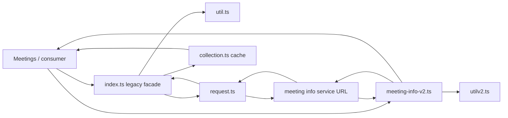
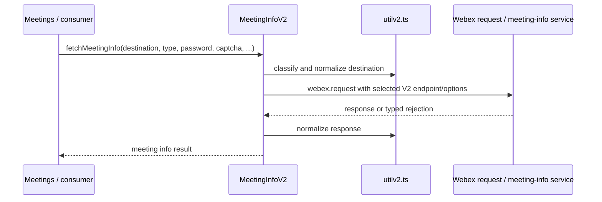
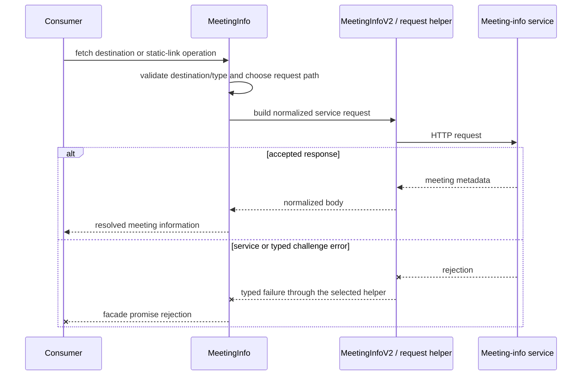
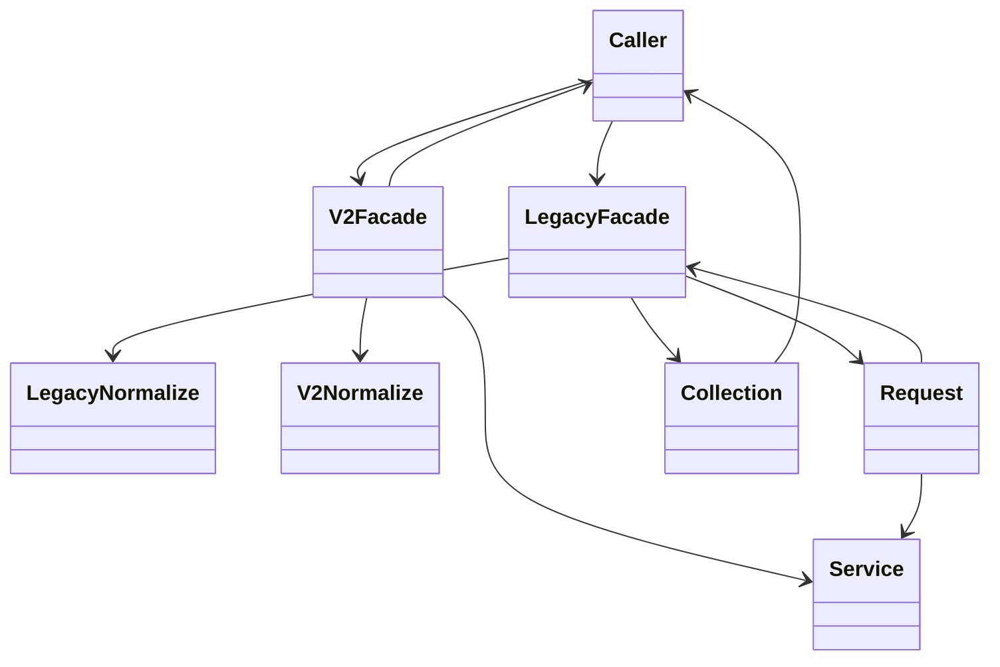

<!-- sdd-generated-metadata
doc_kind: module-spec
generated_from: module-spec@0.2.2
generator_plugin: repo-annotation@1.0.5+codex.20260818094939
generated_by: codex
approved_by: repository user
updated_at: 2026-08-22T15:21:29Z
validation_status: pass-with-warnings
-->
# MEETING INFO — SPEC

> Start here → root [`AGENTS.md`](../../../AGENTS.md) · router [`SPEC_INDEX.md`](../../../ai-docs/SPEC_INDEX.md) · system [`ARCHITECTURE.md`](../../../ai-docs/ARCHITECTURE.md). This is the canonical source-local spec for `src/meeting-info/`.

## Metadata

| Field | Value |
|---|---|
| Module id | `meeting-info` |
| Source path(s) | `src/meeting-info/` |
| Parent spec | — |
| Doc kind | Module spec |
| Coverage score | 93% assessed 2026-08-22; 13/14 mandatory fields present; all critical and Important fields present; one noncritical polish gap remains; pending independent validation of the participant-role repair |
| Generated from | `module-spec` @ SDLC template library `0.2.2` |
| generated_by / approved_by / updated_at | codex / repository user / 2026-08-22T15:21:29Z |
| Validation status | not-run |

## Evidence Rules

Requirements cite current implementation and mirrored unit-test paths. Current code wins over retained prose when they conflict; commit and PR history are excluded by repository-owner decision. Missing test evidence is stated as a gap rather than inferred.

## Source Material Register

| Source material | Scope | Decision | Detail location or disposition |
|---|---|---|---|
| No routed legacy module spec | overview / API / behavior / tests | none; generated from current source and mirrored tests |
| Current source and mirrored tests | implementation / tests | verified | requirements, flows, failures, and test strategy below |

## Overview

`src/meeting-info/` contains 6 direct source/reference file(s) and has 5 mirrored unit-test file(s). This spec separates its public operations, runtime data movement, component ownership, state applicability, and verification boundary.

## Purpose / Responsibility

Resolves meeting destinations into normalized meeting metadata and maps service-specific errors into caller-actionable failures.

## Stack

TypeScript/JavaScript in the Node 22.14 Yarn workspace; Webex core/plugin abstractions and Mocha/Sinon/`@webex/test-helper-chai` tests. Build target: `yarn workspace @webex/plugin-meetings build:src`.

## Folder / Package Structure

```text
src/meeting-info/
├── collection.ts — module-owned collection
├── index.ts — module facade/controller or primary exports
├── meeting-info-v2.ts — meeting-info-v2 implementation responsibility
├── request.ts — HTTP request boundary
├── util.ts — normalization/helper functions
├── utilv2.ts — utilv2 implementation responsibility
└── ai-docs/meeting-info-spec.md — canonical module specification
```

## Key Files (source of truth)

| File | Holds |
|---|---|
| `src/meeting-info/collection.ts` | module-owned collection |
| `src/meeting-info/index.ts` | module facade/controller or primary exports |
| `src/meeting-info/meeting-info-v2.ts` | meeting-info-v2 implementation responsibility |
| `src/meeting-info/request.ts` | HTTP request boundary |
| `src/meeting-info/util.ts` | normalization/helper functions |
| `src/meeting-info/utilv2.ts` | utilv2 implementation responsibility |
| `test/unit/spec/meeting-info/index.js` and 4 sibling test file(s) | mirrored characterization/unit coverage |

## Public Surface

| Contract ID | Type | Surface | Purpose | Compatibility / deprecation | Schema / detail link | Root index |
|---|---|---|---|---|---|---|
| `meeting-info.1` | SDK collection/model | `MeetingInfoCollection.get()` and `MeetingInfo.getMeetingInfo()`, `setMeetingInfo()`, `fetchMeetingInfo()` | Cache destination-keyed meeting information and refresh it through the selected request path. | Preserve collection identity, cache updates, and request rejection. | `src/meeting-info/collection.ts`, `src/meeting-info/index.ts` | [CONTRACTS](../../../ai-docs/CONTRACTS.md) |
| `meeting-info.2` | SDK / V2 remote | `MeetingInfoV2.fetchInfoOptions()` and `fetchMeetingInfo()` | Build V2 lookup options and normalize supported destination responses into meeting information. | Preserve password/captcha/registration inputs and typed error mapping. | `src/meeting-info/meeting-info-v2.ts` | [CONTRACTS](../../../ai-docs/CONTRACTS.md) |
| `meeting-info.3` | SDK / V2 remote | `createAdhocSpaceMeetingOrEnableStaticMeetingLink()`, `createAdhocSpaceMeeting()`, and `fetchStaticMeetingLink()` | Select existing static-link lookup versus ad-hoc creation/enablement for a space destination. | Preserve branch conditions and direct service outcomes. | `src/meeting-info/meeting-info-v2.ts` | [CONTRACTS](../../../ai-docs/CONTRACTS.md) |
| `meeting-info.4` | SDK / V2 remote | `enableStaticMeetingLink()` and `disableStaticMeetingLink()` | Mutate the static meeting-link state for the supplied space/context. | Preserve request route/body and typed V2 error behavior. | `src/meeting-info/meeting-info-v2.ts` | [CONTRACTS](../../../ai-docs/CONTRACTS.md) |
| `meeting-info.5` | request adapter | `MeetingInfoRequest.fetchMeetingInfo()` | Perform the legacy meeting-info request selected by the facade. | Preserve HTTP request parameters and direct response/rejection propagation. | `src/meeting-info/request.ts` | [CONTRACTS](../../../ai-docs/CONTRACTS.md) |
| `meeting-info.6` | package-exported utilities | `MeetingInfoUtil.getParsedUrl()`, `isMeetingLink()`, `isConversationUrl()`, `isSipUri()`, `isPhoneNumber()`, `getHydraId()`, `getSipUriFromHydraPersonId()`, `getDestinationType()`, `getRequestBody()`, `getWebexSite()`, and `getDirectMeetingInfoURI()` | Expose the destination classification and V2 request-body helpers exported as `MeetingInfoUtil` by `src/index.ts`. | Preserve classification precedence, URL parsing, and generated V2 body/URI shapes; methods that exist only on legacy `util.ts` are not package exports. | `src/index.ts`, `src/meeting-info/utilv2.ts` | [CONTRACTS](../../../ai-docs/CONTRACTS.md) |
| `meeting-info.7` | exported errors | `MeetingInfoV2PasswordError`, `MeetingInfoV2AdhocMeetingError`, `MeetingInfoV2PolicyError`, `MeetingInfoV2CaptchaError`, `MeetingInfoV2JoinWebinarError`, `MeetingInfoV2JoinForbiddenError`, `MeetingInfoV2StaticLinkDoesNotExistError`, `MeetingInfoV2MeetingIsInProgressError`, and `MeetingInfoV2StaticMeetingLinkAlreadyExists` | Give callers typed outcomes for service-specific meeting-info failures. | Preserve class identity and mapping from current service status/body conditions. | `src/meeting-info/meeting-info-v2.ts` | [CONTRACTS](../../../ai-docs/CONTRACTS.md) |
| `meeting-info.8` | V2 error mapping | `MeetingInfoV2.handlePolicyError()`, `handleJoinWebinarError()`, and `handleForbiddenError()` | Convert service policy/webinar/forbidden responses into the exported typed error classes. | Preserve response-condition precedence and error identity. | `src/meeting-info/meeting-info-v2.ts` | [CONTRACTS](../../../ai-docs/CONTRACTS.md) |

### Emitted events

Current source emits or forwards these observable literals for this operation boundary. Preserve literal values, scope, payload shape, and emission timing; a constant name alone is not a substitute for the consumer-visible value.

| Event literal | Constant / expression | Emission evidence |
|---|---|---|
| `meeting:meetingInfoAvailable` | `EVENT_TRIGGERS.MEETING_INFO_AVAILABLE` | `src/meeting/index.ts` |
| `meeting:meetingInfoUpdated` | `EVENT_TRIGGERS.MEETING_INFO_UPDATED` | `src/meeting/index.ts` |

Compatibility notes:
- Prefer additive options and payload fields. Preserve method/event names, rejection semantics, and cleanup timing; route public changes through `src/index.ts` or the documented owning object.

## Requires (dependencies)

Webex request/service access plus meeting, conversation, people, and webinar service responses.

## Requirements

| ID | WHAT | WHY | Source Evidence | Test / Example Evidence | Assumptions / Gaps | Confidence |
|---|---|---|---|---|---|---|
| `MEETING-INFO-R-001` | fetch meeting information for a destination/type. | Resolves meeting destinations into normalized meeting metadata and maps service-specific errors into caller-actionable failures. | `src/meeting-info/index.ts` | `test/unit/spec/meeting-info/index.js` | none | PRESENT |
| `MEETING-INFO-R-002` | resolve, enable, and disable static meeting links. | Static-link lookup and mutation select different V2 endpoints and typed error outcomes. | `src/meeting-info/index.ts`, `src/meeting-info/meeting-info-v2.ts` | `test/unit/spec/meeting-info/index.js` | static-link conflict and in-progress error mappings need a complete V2 matrix | PRESENT |
| `MEETING-INFO-R-003` | `MeetingInfoRequest.fetchMeetingInfo()` throws `ParameterError` synchronously when its options lack a type or destination. When the legacy facade invokes that helper inside its promise chain, the throw becomes the facade's returned rejection; V2 password, captcha, permission, and request failures also remain typed caller-visible promise outcomes. Request helpers own no persistent listeners or timers. | Callers must distinguish the direct request helper's synchronous validation boundary from facade/V2 promise failures while still retaining actionable typed errors. | `src/meeting-info/request.ts`, `src/meeting-info/index.ts`, `src/meeting-info/meeting-info-v2.ts` | `test/unit/spec/meeting-info/request.js`, `test/unit/spec/meeting-info/index.js`, `test/unit/spec/meeting-info/meetinginfov2.js` | none | PRESENT |
| `MEETING-INFO-R-004` | Emit CA request/response events only when both `meetingId` and `sendCAevents` are supplied, and emit the operation-specific behavioral success/failure metric on V2 outcomes. | Conditional correlation avoids unscoped CA telemetry, while stable behavioral metrics preserve operation-level observability for lookup and link-management failures. | `src/meeting-info/index.ts`, `src/meeting-info/meeting-info-v2.ts`, `src/metrics/constants.ts` | `test/unit/spec/meeting-info/index.js`, `test/unit/spec/meeting-info/meetinginfov2.js` | none | PRESENT |

## Design Overview

`index.ts` provides the legacy meeting-info facade, `request.ts` performs that facade's HTTP calls, and `collection.ts` caches its meeting-info objects. `meeting-info-v2.ts` implements the V2 pipeline and calls `webex.request` directly after using `utilv2.ts` for destination/response handling.

## Data Flow



## Sequence Diagram(s)

Sequence coverage:

| Operation group | Diagram | Failure coverage |
|---|---|---|
| UC-1…UC-5 — meeting-info lookup and static-link operation groups | Meeting-info lookup and static-link primary sequence | destination validation plus typed password/captcha/policy/static-link request failures |
| UC-1…UC-5 — meeting-info lookup and static-link alternate/failure paths | Meeting-info lookup and static-link alternate/failure sequence | unsupported destination, password/captcha challenge, permission error, or meeting-info service rejection |

### Meeting-info lookup and static-link primary sequence



### Meeting-info lookup and static-link alternate/failure sequence



## Class / Component Relationships



The arrows identify ownership and delegation inside `src/meeting-info/`; files that only declare types or constants are not presented as transports.

## Use Cases

- **UC-1:** Classify a SIP URI, meeting URL, conversation URL, phone number, or Hydra identity and construct the corresponding request inputs. Evidence: `src/meeting-info/util.ts`, `src/meeting-info/utilv2.ts`.
- **UC-2:** Resolve a destination through the legacy `MeetingInfoRequest` or V2 path selected by Meetings configuration and cache the normalized result. Evidence: `src/meeting-info/index.ts`, `src/meeting-info/request.ts`, `src/meeting-info/meeting-info-v2.ts`.
- **UC-3:** Supply password, captcha, registration, webinar, or policy context and preserve the matching typed V2 error outcome. Evidence: `src/meeting-info/meeting-info-v2.ts`.
- **UC-4:** Fetch or create an ad-hoc/static meeting link for a space, including the branch that enables an existing static link. Evidence: `src/meeting-info/meeting-info-v2.ts`.
- **UC-5:** Enable or disable a static meeting link and return the service result without substituting a legacy lookup. Evidence: `src/meeting-info/meeting-info-v2.ts`.

## State Model

A small in-memory collection may retain resolved meeting-info objects; remote services remain authoritative.

## Business Rules & Invariants

- Destination type and response error codes determine the correct request and typed error; invalid or forbidden meetings are never returned as successful metadata. Enforced by `src/meeting-info/index.ts` and supporting code under `src/meeting-info/`.

## Concurrency & Reactive Flow

- Each meeting-info/static-link call owns only its returned request promise; the helpers retain no listeners or timers. The V2 request path fetches directly and therefore does not imply that the legacy collection cache was populated.

## Error Handling & Failure Modes

| Condition | Signal | Caller recovery |
|---|---|---|
| Direct `MeetingInfoRequest.fetchMeetingInfo()` options omit type or destination | The helper throws `ParameterError` synchronously before issuing a request. The legacy `MeetingInfo.fetchMeetingInfo()` promise chain converts that helper throw into its returned rejection. | Validate direct-helper inputs synchronously; when using the facade, handle its returned rejection. |
| Service requires password/captcha, denies permission, or rejects the request | The module maps or propagates the typed caller-visible rejection. | Satisfy the challenge/permission requirement or handle the request failure. |
| Meeting-info response is accepted | The returned promise resolves with normalized meeting metadata; V2 lookup does not claim a legacy collection-cache update. | Use the resolved response as the current operation result. |

## Pitfalls

- Meeting-info v1 and v2 paths have different response/error mappings; do not assume one parser covers both.
- Public behavior may be reachable through a parent `Meeting`/`Meetings` object even when the source helper is not exported directly.
- The current `MeetingInfoV2PolicyError` and `MeetingInfoV2CaptchaError` constructors assign `name` values associated with other typed errors. Preserve and test the current behavior until a separately reviewed implementation/spec change intentionally corrects it; callers should prefer the actual error instance and documented fields over `name` alone. Evidence: `src/meeting-info/meeting-info-v2.ts`, `test/unit/spec/meeting-info/meetinginfov2.js`.

## Test-Case Strategy (module)

Use the current mirrored suites: `test/unit/spec/meeting-info/index.js`, `test/unit/spec/meeting-info/meetinginfov2.js`, `test/unit/spec/meeting-info/request.js`, `test/unit/spec/meeting-info/util.js`, `test/unit/spec/meeting-info/utilv2.js`. Characterize the meeting-info-specific use cases above and each listed failure condition; add cleanup or transition cases only for resources and state this module actually owns.

| Behavior / Requirement | Existing test evidence | Gap |
|---|---|---|
| `MEETING-INFO-R-001` | `test/unit/spec/meeting-info/index.js`, `test/unit/spec/meeting-info/meetinginfov2.js`, `test/unit/spec/meeting-info/request.js` | no mandatory coverage gap identified |
| `MEETING-INFO-R-002` | `test/unit/spec/meeting-info/meetinginfov2.js` | no mandatory coverage gap identified |
| `MEETING-INFO-R-003` | `test/unit/spec/meeting-info/meetinginfov2.js` | error-name inconsistencies are characterized as current behavior, not corrected here |
| `MEETING-INFO-R-004` | `test/unit/spec/meeting-info/index.js`, `test/unit/spec/meeting-info/meetinginfov2.js` | no mandatory coverage gap identified |

## Traceability

- Repo architecture: [`ARCHITECTURE.md`](../../../ai-docs/ARCHITECTURE.md) · Registry: [`SPEC_INDEX.md`](../../../ai-docs/SPEC_INDEX.md)
- Coverage state and contracts baseline: `../../../.sdd/manifest.json`
