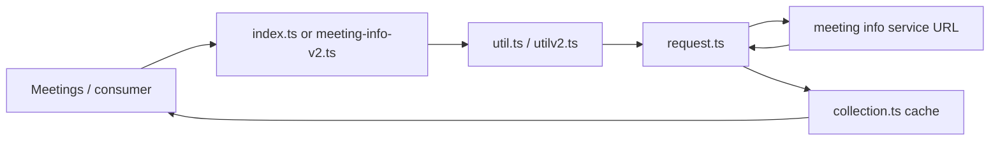
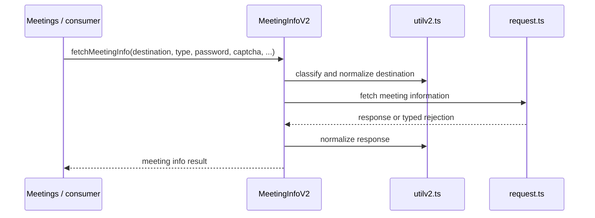
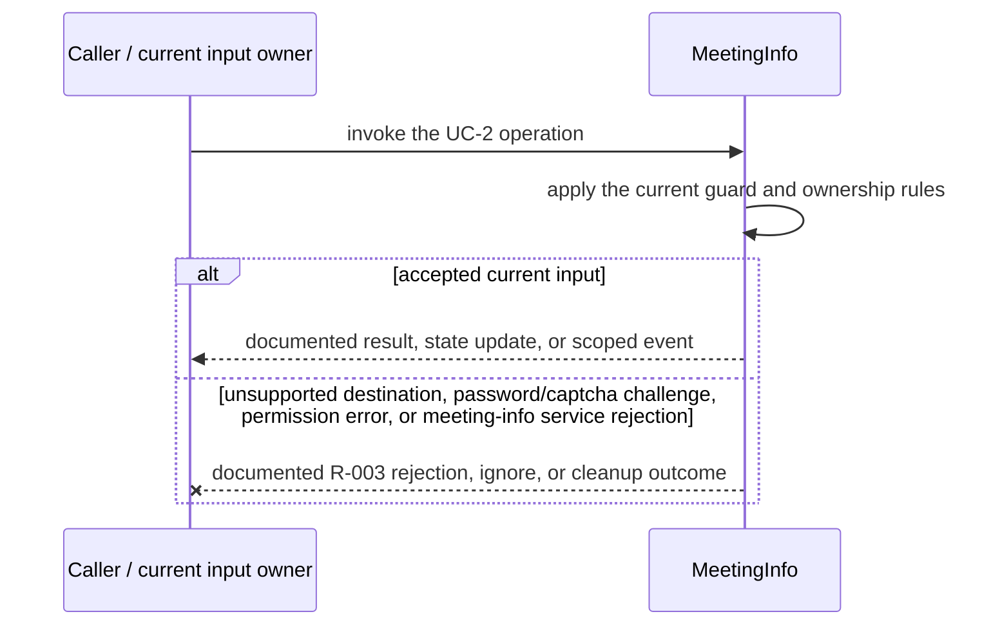
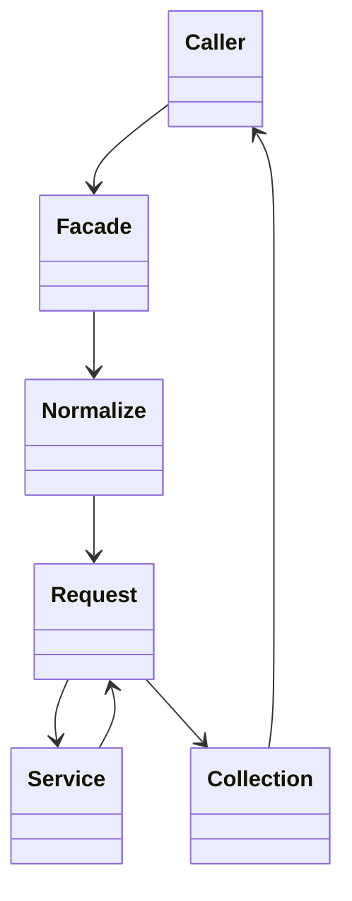

<!-- sdd-generated-metadata
doc_kind: module-spec
generated_from: module-spec@0.2.2
generator_plugin: repo-annotation@1.0.5+codex.20260818094939
generated_by: codex
approved_by: repository user
updated_at: 2026-08-21T06:10:05Z
validation_status: not-run
-->
# MEETING INFO — SPEC

> Start here → root [`AGENTS.md`](../../../AGENTS.md) · router [`SPEC_INDEX.md`](../../../ai-docs/SPEC_INDEX.md) · system [`ARCHITECTURE.md`](../../../ai-docs/ARCHITECTURE.md). This is the canonical source-local spec for `src/meeting-info/`.

## Metadata

| Field | Value |
|---|---|
| Module id | `meeting-info` |
| Source path(s) | `src/meeting-info/` |
| Parent spec | — |
| Doc kind | Module spec |
| Coverage score | 93% assessed 2026-08-21; 13/14 mandatory fields present; all critical and Important fields present; one noncritical polish gap remains |
| Generated from | `module-spec` @ SDLC template library `0.2.2` |
| generated_by / approved_by / updated_at | codex / repository user / 2026-08-21T06:10:05Z |
| Validation status | not-run |

## Evidence Rules

Requirements cite current implementation and mirrored unit-test paths. Current code wins over retained prose when they conflict; commit and PR history are excluded by repository-owner decision. Missing test evidence is stated as a gap rather than inferred.

## Source Material Register

| Source material | Scope | Decision | Detail location or disposition |
|---|---|---|---|
| No routed legacy module spec | overview / API / behavior / tests | none; generated from current source and mirrored tests |
| Current source and mirrored tests | implementation / tests | verified | requirements, flows, failures, and test strategy below |

## Overview

`src/meeting-info/` contains 6 direct source/reference file(s) and has 5 mirrored unit-test file(s). This spec separates its public operations, runtime data movement, component ownership, state applicability, and verification boundary.

## Purpose / Responsibility

Resolves meeting destinations into normalized meeting metadata and maps service-specific errors into caller-actionable failures.

## Stack

TypeScript/JavaScript in the Node 22.14 Yarn workspace; Webex core/plugin abstractions and Mocha/Sinon/`@webex/test-helper-chai` tests. Build target: `yarn workspace @webex/plugin-meetings build:src`.

## Folder / Package Structure

```text
src/meeting-info/
├── collection.ts — module-owned collection
├── index.ts — module facade/controller or primary exports
├── meeting-info-v2.ts — meeting-info-v2 implementation responsibility
├── request.ts — HTTP request boundary
├── util.ts — normalization/helper functions
├── utilv2.ts — utilv2 implementation responsibility
└── ai-docs/meeting-info-spec.md — canonical module specification
```

## Key Files (source of truth)

| File | Holds |
|---|---|
| `src/meeting-info/collection.ts` | module-owned collection |
| `src/meeting-info/index.ts` | module facade/controller or primary exports |
| `src/meeting-info/meeting-info-v2.ts` | meeting-info-v2 implementation responsibility |
| `src/meeting-info/request.ts` | HTTP request boundary |
| `src/meeting-info/util.ts` | normalization/helper functions |
| `src/meeting-info/utilv2.ts` | utilv2 implementation responsibility |
| `test/unit/spec/meeting-info/index.js` and 4 sibling test file(s) | mirrored characterization/unit coverage |

## Public Surface

| Contract ID | Type | Surface | Purpose | Compatibility / deprecation | Schema / detail link | Root index |
|---|---|---|---|---|---|---|
| `meeting-info.1` | SDK / in-process / remote | fetch meeting information for a destination/type | Preserve the module responsibility through a focused operation group | Consumer-visible methods/events are semver-sensitive when reachable from package objects | `src/meeting-info/index.ts` | [CONTRACTS](../../../ai-docs/CONTRACTS.md) |
| `meeting-info.2` | SDK / in-process / remote | resolve, enable, and disable static meeting links | Preserve the module responsibility through a focused operation group | Consumer-visible methods/events are semver-sensitive when reachable from package objects | `src/meeting-info/index.ts` | [CONTRACTS](../../../ai-docs/CONTRACTS.md) |
| `meeting-info.3` | SDK / in-process / remote | normalize destination and response variants | Preserve the module responsibility through a focused operation group | Consumer-visible methods/events are semver-sensitive when reachable from package objects | `src/meeting-info/index.ts` | [CONTRACTS](../../../ai-docs/CONTRACTS.md) |

Compatibility notes:
- Prefer additive options and payload fields. Preserve method/event names, rejection semantics, and cleanup timing; route public changes through `src/index.ts` or the documented owning object.

## Requires (dependencies)

Webex request/service access plus meeting, conversation, people, and webinar service responses.

## Requirements

| ID | WHAT | WHY | Source Evidence | Test / Example Evidence | Assumptions / Gaps | Confidence |
|---|---|---|---|---|---|---|
| `MEETING-INFO-R-001` | fetch meeting information for a destination/type. | Resolves meeting destinations into normalized meeting metadata and maps service-specific errors into caller-actionable failures. | `src/meeting-info/index.ts` | `test/unit/spec/meeting-info/index.js` | none | PRESENT |
| `MEETING-INFO-R-002` | resolve, enable, and disable static meeting links. | Callers need deterministic observable behavior across async Webex inputs. | `src/meeting-info/index.ts`, `src/meeting-info/meeting-info-v2.ts` | `test/unit/spec/meeting-info/index.js` | additional edge cases may live in sibling tests | PRESENT |
| `MEETING-INFO-R-003` | Parameter, password, captcha, permission, and request failures remain typed caller-visible rejections; request helpers own no persistent listeners or timers. | Callers must receive the actual module failure outcome without false cleanup or event guarantees. | `src/meeting-info/` | `test/unit/spec/meeting-info/meetinginfov2.js` | none | PRESENT |
| `MEETING-INFO-R-004` | Emit CA request/response events only when both `meetingId` and `sendCAevents` are supplied, and emit the operation-specific behavioral success/failure metric on V2 outcomes. | Conditional correlation avoids unscoped CA telemetry, while stable behavioral metrics preserve operation-level observability for lookup and link-management failures. | `src/meeting-info/index.ts`, `src/meeting-info/meeting-info-v2.ts`, `src/metrics/constants.ts` | `test/unit/spec/meeting-info/index.js`, `test/unit/spec/meeting-info/meetinginfov2.js` | none | PRESENT |

## Design Overview

`index.ts` provides the legacy meeting-info facade, `meeting-info-v2.ts` implements the V2 lookup pipeline, `request.ts` performs HTTP calls, the utilities normalize destinations/responses, and `collection.ts` caches meeting-info objects.

## Data Flow



## Sequence Diagram(s)

Sequence coverage:

| Operation group | Diagram | Failure coverage |
|---|---|---|
| UC-1 — primary operation | Primary operation sequence | accepted and rejected dependency outcomes |
| UC-2 — secondary/change operation | Secondary operation and failure sequence | unsupported destination, password/captcha challenge, permission error, or meeting-info service rejection |

### Primary operation sequence



### Secondary operation and failure sequence



## Class / Component Relationships



The arrows identify ownership and delegation inside `src/meeting-info/`; files that only declare types or constants are not presented as transports.

## Use Cases

- **UC-1:** Resolve a SIP/URL/id destination through the legacy or V2 path selected by Meetings configuration. Evidence: `src/meeting-info/`.
- **UC-2:** Preserve password/captcha and typed error outcomes while normalizing the service response into meeting information. Evidence: `src/meeting-info/`.

## State Model

A small in-memory collection may retain resolved meeting-info objects; remote services remain authoritative.

## Business Rules & Invariants

- Destination type and response error codes determine the correct request and typed error; invalid or forbidden meetings are never returned as successful metadata. Enforced by `src/meeting-info/index.ts` and supporting code under `src/meeting-info/`.

## Concurrency & Reactive Flow

- Async work owned by `MeetingInfo` may complete after a newer caller or remote input. Preserve the identity, sequence, and resource-owner guards in `src/meeting-info/`; a late completion must not replay UC-2 for superseded state.

## Error Handling & Failure Modes

| Condition | Signal | Caller recovery |
|---|---|---|
| unsupported destination, password/captcha challenge, permission error, or meeting-info service rejection | Follow the concrete rejection, ignore, state, or cleanup behavior in the module's R-003 requirement. | Resolve the named condition; retry only when another requirement defines a bound. |
| UC-1 succeeds | Return, update, callback, or scoped event identified by the Public Surface and primary sequence. | Continue from the owning module's accepted state. |

## Pitfalls

- Meeting-info v1 and v2 paths have different response/error mappings; do not assume one parser covers both.
- Public behavior may be reachable through a parent `Meeting`/`Meetings` object even when the source helper is not exported directly.
- The current `MeetingInfoV2PolicyError` and `MeetingInfoV2CaptchaError` constructors assign `name` values associated with other typed errors. Preserve and test the current behavior until a separately reviewed implementation/spec change intentionally corrects it; callers should prefer the actual error instance and documented fields over `name` alone. Evidence: `src/meeting-info/meeting-info-v2.ts`, `test/unit/spec/meeting-info/meetinginfov2.js`.

## Test-Case Strategy (module)

Use the current mirrored suites: `test/unit/spec/meeting-info/index.js`, `test/unit/spec/meeting-info/meetinginfov2.js`, `test/unit/spec/meeting-info/request.js`, `test/unit/spec/meeting-info/util.js`, `test/unit/spec/meeting-info/utilv2.js`. Characterize the two code-grounded use cases above and the listed failure condition; add cleanup or transition cases only for resources and state this module actually owns.

| Behavior / Requirement | Existing test evidence | Gap |
|---|---|---|
| `MEETING-INFO-R-001` | `test/unit/spec/meeting-info/index.js`, `test/unit/spec/meeting-info/meetinginfov2.js`, `test/unit/spec/meeting-info/request.js` | no mandatory coverage gap identified |
| `MEETING-INFO-R-002` | `test/unit/spec/meeting-info/meetinginfov2.js` | no mandatory coverage gap identified |
| `MEETING-INFO-R-003` | `test/unit/spec/meeting-info/meetinginfov2.js` | error-name inconsistencies are characterized as current behavior, not corrected here |
| `MEETING-INFO-R-004` | `test/unit/spec/meeting-info/index.js`, `test/unit/spec/meeting-info/meetinginfov2.js` | no mandatory coverage gap identified |

## Traceability

- Repo architecture: [`ARCHITECTURE.md`](../../../ai-docs/ARCHITECTURE.md) · Registry: [`SPEC_INDEX.md`](../../../ai-docs/SPEC_INDEX.md)
- Coverage state and contracts baseline: `../../../.sdd/manifest.json`
