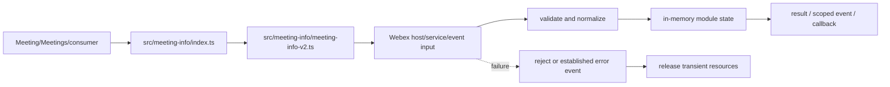
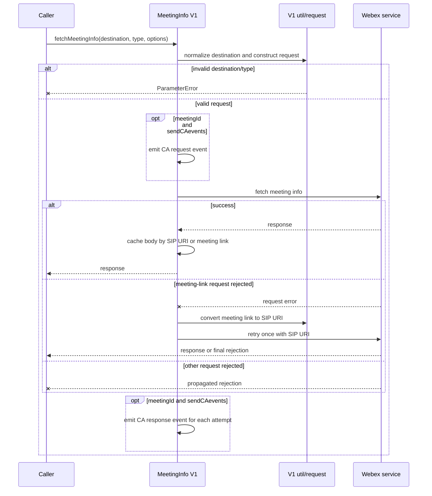
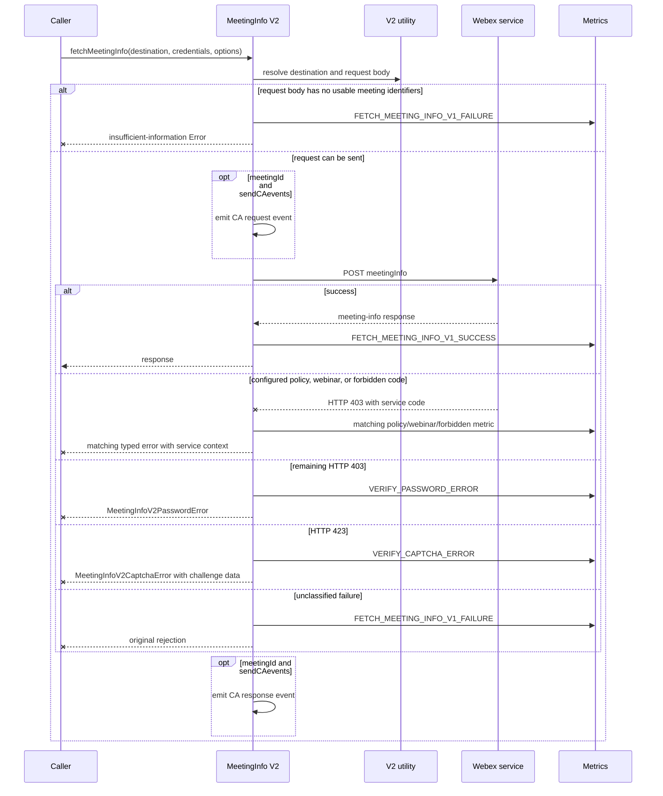
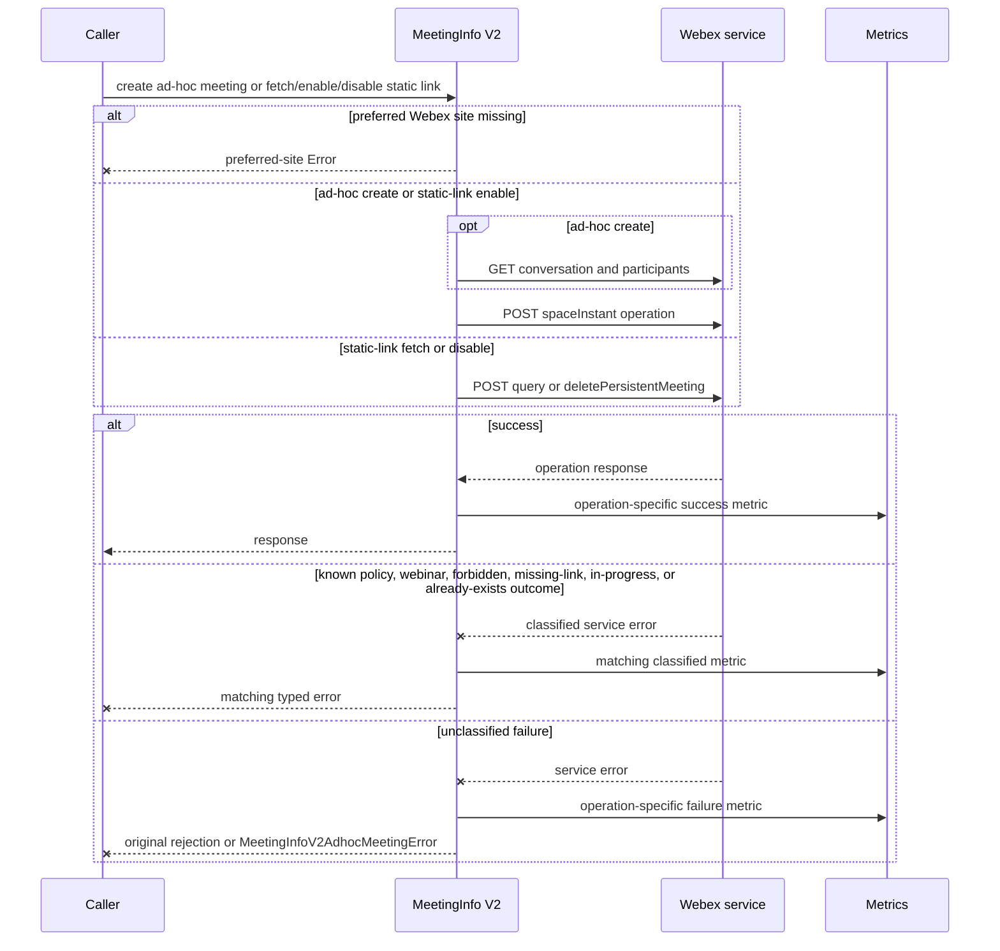
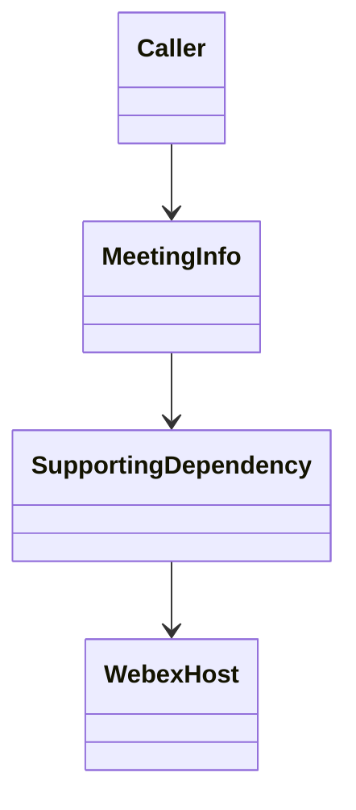

<!-- sdd-generated-metadata
doc_kind: module-spec
generated_from: module-spec@0.2.2
generator_plugin: repo-annotation@1.0.5+codex.20260818094939
generated_by: codex
approved_by: repository user
updated_at: 2026-08-19T06:54:36Z
validation_status: not-run
-->
# MEETING INFO — SPEC

> Start here → root [`AGENTS.md`](../../../AGENTS.md) · router [`SPEC_INDEX.md`](../../../ai-docs/SPEC_INDEX.md) · system [`ARCHITECTURE.md`](../../../ai-docs/ARCHITECTURE.md). This is the canonical source-local spec for `src/meeting-info/`.

## Metadata

| Field | Value |
|---|---|
| Module id | `meeting-info` |
| Source path(s) | `src/meeting-info/` |
| Parent spec | — |
| Doc kind | Module spec |
| Coverage score | 93% assessed 2026-08-19; 13/14 mandatory fields present; all critical and important fields present, one polish gap remains |
| Generated from | `module-spec` @ SDLC template library `0.2.2` |
| generated_by / approved_by / updated_at | codex / repository user / 2026-08-19T06:54:36Z |
| Validation status | not-run |

## Evidence Rules

Requirements cite current implementation and mirrored unit-test paths. Current code wins over retained prose when they conflict; commit and PR history are excluded by repository-owner decision. Missing test evidence is stated as a gap rather than inferred.

## Source Material Register

| Source material | Scope | Decision | Detail location or disposition |
|---|---|---|---|
| No routed legacy module spec | overview / API / behavior / tests | none; generated from current source and mirrored tests |
| Current source and mirrored tests | implementation / tests | verified | requirements, flows, failures, and test strategy below |

## Overview

For orientation, start at `src/meeting-info/index.ts`; supporting files under `src/meeting-info/` separate request, parsing, collection, type, or utility concerns from parent orchestration. The module is composed by `Meeting`, `Meetings`, or the package entry as applicable. Remote Webex services/Locus remain authoritative, and all local state is scoped to the SDK, plugin, meeting, or operation lifetime.

## Purpose / Responsibility

Resolves meeting destinations into normalized meeting metadata and maps service-specific errors into caller-actionable failures.

## Stack

TypeScript/JavaScript in the Node 22.14 Yarn workspace; Webex core/plugin abstractions and Mocha/Sinon/`@webex/test-helper-chai` tests. Build target: `yarn workspace @webex/plugin-meetings build:src`.

## Folder / Package Structure

```text
src/meeting-info/
├── index.ts — primary behavior/entry point
├── meeting-info-v2.ts — request, parser, utility, or supporting behavior
└── ai-docs/meeting-info-spec.md — canonical module specification
```

## Key Files (source of truth)

| File | Holds |
|---|---|
| `src/meeting-info/index.ts` | Primary lifecycle and public/internal surface |
| `src/meeting-info/meeting-info-v2.ts` | V2 meeting lookup, ad-hoc meeting, static-link, typed-error, and behavioral-metric behavior |
| `src/meeting-info/request.ts` | V1 request validation and meeting-info transport construction |
| `src/meeting-info/util.ts` | V1 destination normalization and request option construction |
| `src/meeting-info/utilv2.ts` | V2 destination resolution, request-body construction, and direct-URI selection |
| `test/unit/spec/meeting-info/index.js` | V1 lookup, retry, caching, and conditional CA-event behavior |
| `test/unit/spec/meeting-info/meetinginfov2.js` | V2 lookup, ad-hoc/static-link, typed-error, and behavioral-metric outcomes |
| `test/unit/spec/meeting-info/request.js` | V1 request boundary behavior |
| `src/constants.ts` | Shared meeting/event/wire constants where consumed |
| `src/metrics/constants.ts` | Stable behavioral-metric identifiers emitted by V2 operations |

## Public Surface

| Contract ID | Type | Surface | Purpose | Compatibility / deprecation | Schema / detail link | Root index |
|---|---|---|---|---|---|---|
| `meeting-info.1` | SDK / in-process / remote | fetch meeting information for a destination/type | Preserve the module responsibility through a focused operation group | Consumer-visible methods/events are semver-sensitive when reachable from package objects | `src/meeting-info/index.ts` | [CONTRACTS](../../../ai-docs/CONTRACTS.md) |
| `meeting-info.2` | SDK / in-process / remote | resolve, enable, and disable static meeting links | Preserve the module responsibility through a focused operation group | Consumer-visible methods/events are semver-sensitive when reachable from package objects | `src/meeting-info/index.ts` | [CONTRACTS](../../../ai-docs/CONTRACTS.md) |
| `meeting-info.3` | SDK / in-process / remote | normalize destination and response variants | Preserve the module responsibility through a focused operation group | Consumer-visible methods/events are semver-sensitive when reachable from package objects | `src/meeting-info/index.ts` | [CONTRACTS](../../../ai-docs/CONTRACTS.md) |

Compatibility notes:
- Prefer additive options and payload fields. Preserve method/event names, rejection semantics, and cleanup timing; route public changes through `src/index.ts` or the documented owning object.

## Requires (dependencies)

Webex request/service access plus meeting, conversation, people, and webinar service responses.

## Requirements

| ID | WHAT | WHY | Source Evidence | Test / Example Evidence | Assumptions / Gaps | Confidence |
|---|---|---|---|---|---|---|
| `MEETING-INFO-R-001` | fetch meeting information for a destination/type. | Resolves meeting destinations into normalized meeting metadata and maps service-specific errors into caller-actionable failures. | `src/meeting-info/index.ts` | `test/unit/spec/meeting-info/index.js` | none | PRESENT |
| `MEETING-INFO-R-002` | resolve, enable, and disable static meeting links. | Callers need deterministic observable behavior across async Webex inputs. | `src/meeting-info/index.ts`, `src/meeting-info/meeting-info-v2.ts` | `test/unit/spec/meeting-info/index.js` | additional edge cases may live in sibling tests | PRESENT |
| `MEETING-INFO-R-003` | Map V2 policy, webinar, forbidden, password, captcha, missing-link, in-progress, and already-existing outcomes to their established typed errors; propagate unclassified service failures. | Callers need to distinguish corrective input, authorization/policy, registration, and static-link conflicts without decoding raw transport responses. | `src/meeting-info/meeting-info-v2.ts` | `test/unit/spec/meeting-info/meetinginfov2.js` | none | PRESENT |
| `MEETING-INFO-R-004` | Emit CA request/response events only when both `meetingId` and `sendCAevents` are supplied, and emit the operation-specific behavioral success/failure metric on V2 outcomes. | Conditional correlation avoids unscoped CA telemetry, while stable behavioral metrics preserve operation-level observability for lookup and link-management failures. | `src/meeting-info/index.ts`, `src/meeting-info/meeting-info-v2.ts`, `src/metrics/constants.ts` | `test/unit/spec/meeting-info/index.js`, `test/unit/spec/meeting-info/meetinginfov2.js` | none | PRESENT |

## Design Overview

The primary entry point coordinates domain state and delegates transport/parsing to supporting files so those boundaries remain testable. Inputs are normalized before client state or events change. Async results preserve the established error signal, while teardown owns every listener, timer, or transient object allocated by this module.

## Data Flow



## Sequence Diagram(s)

Sequence coverage:

| Operation group | Diagram | Failure / recovery coverage |
|---|---|---|
| V1 meeting-info lookup | V1 lookup and meeting-link fallback | invalid request, first-request rejection, bounded SIP retry, and final rejection |
| V2 meeting-info lookup | V2 lookup and typed outcome mapping | insufficient input, policy/webinar/forbidden/password/captcha mapping, and unclassified rejection |
| V2 ad-hoc and static-link operations | Ad-hoc/static-link lifecycle | missing preferred site, policy/link-state typed errors, and generic failure propagation |







## Class / Component Relationships



The primary module object owns its client state and composes/invokes supporting request, parser, collection, or utility code. The Webex host/service remains the authority for remote state.

## Use Cases

- **UC-1 Primary operation:** a consumer or parent module invokes fetch meeting information for a destination/type; the module validates/delegates, normalizes the result, updates state where applicable, and returns or emits the established outcome. Evidence: `src/meeting-info/index.ts`, `test/unit/spec/meeting-info/index.js`.
- **UC-2 Ad-hoc/static-link operation:** V2 resolves a conversation into an ad-hoc meeting or fetches, enables, or disables its static meeting link. Each successful operation emits its matching behavioral metric; known policy and link-state failures become typed errors, while unknown failures retain the original rejection. Evidence: `src/meeting-info/meeting-info-v2.ts`, `test/unit/spec/meeting-info/meetinginfov2.js`.

## State Model

A small in-memory collection may retain resolved meeting-info objects; remote services remain authoritative.

## Business Rules & Invariants

- Destination type and response error codes determine the correct request and typed error; invalid or forbidden meetings are never returned as successful metadata. Enforced by `src/meeting-info/index.ts` and supporting code under `src/meeting-info/`.

## Concurrency & Reactive Flow

- Promise, event, media, and timer callbacks can interleave. Preserve existing sequence guards, make cleanup idempotent, and never start an unbounded retry/listener loop.
- Do not assume remote events are globally ordered unless the current parser/state code enforces ordering.

## Error Handling & Failure Modes

| Operation / condition | Observable signal | Metric / event outcome | Caller recovery | Evidence |
|---|---|---|---|---|
| V1 lookup succeeds | Return the response and cache its body by SIP URI or meeting link | Emit `internal.client.meetinginfo.response` and `client.meetinginfo.response` only when both `meetingId` and `sendCAevents` are present | Consume the normalized response; subsequent lookups may read the cached body | `src/meeting-info/index.ts`, `test/unit/spec/meeting-info/index.js` |
| V1 lookup fails for a meeting-link destination | Retry once after converting the meeting link to a SIP URI; reject the retry error if it also fails | Each attempted request emits correlated CA request/response events only when both telemetry inputs are present; failures are logged | Allow the bounded conversion retry; handle the final rejection | `src/meeting-info/index.ts`, `test/unit/spec/meeting-info/index.js` |
| V1 request lacks destination or type | Throw `ParameterError` before making the Webex request | No operation success metric | Correct the request inputs; retrying unchanged is invalid | `src/meeting-info/request.ts`, `test/unit/spec/meeting-info/request.js` |
| V2 request body contains only default properties | Throw `Error("Not enough information to fetch meeting info")` before transport | Emit `FETCH_MEETING_INFO_V1_FAILURE` with destination details | Provide a resolvable destination or additional meeting identifiers | `src/meeting-info/meeting-info-v2.ts`, `test/unit/spec/meeting-info/meetinginfov2.js`, `src/metrics/constants.ts` |
| V2 lookup succeeds | Return the service response | Emit `FETCH_MEETING_INFO_V1_SUCCESS`; emit CA response events only when both `meetingId` and `sendCAevents` are present | Consume the response | `src/meeting-info/meeting-info-v2.ts`, `test/unit/spec/meeting-info/meetinginfov2.js`, `src/metrics/constants.ts` |
| V2 returns a configured policy code (`403049`, `403104`, `403103`, `403048`, `403102`, or `403101`) | Throw `MeetingInfoV2PolicyError` with the service code and meeting info | Emit `MEETING_INFO_POLICY_ERROR`; correlated CA response events remain conditional | Surface the policy restriction; do not retry unchanged | `src/meeting-info/meeting-info-v2.ts`, `test/unit/spec/meeting-info/meetinginfov2.js`, `src/metrics/constants.ts` |
| V2 returns a configured webinar/registration code or forbidden code `403003` | Throw `MeetingInfoV2JoinWebinarError` or `MeetingInfoV2JoinForbiddenError` | Emit `JOIN_WEBINAR_ERROR` or `JOIN_FORBIDDEN_ERROR` | Complete the indicated registration/webcast requirement or stop the forbidden join | `src/meeting-info/meeting-info-v2.ts`, `test/unit/spec/meeting-info/meetinginfov2.js`, `src/metrics/constants.ts` |
| Remaining V2 HTTP 403 response | Throw `MeetingInfoV2PasswordError`, retaining service meeting info | Emit `VERIFY_PASSWORD_ERROR` | Prompt for/correct the password and retry with it | `src/meeting-info/meeting-info-v2.ts`, `test/unit/spec/meeting-info/meetinginfov2.js`, `src/metrics/constants.ts` |
| V2 HTTP 423 response | Throw `MeetingInfoV2CaptchaError` with captcha URLs; set password/registration flags from the service code | Emit `VERIFY_CAPTCHA_ERROR` | Complete the indicated captcha plus password or registration input, then retry | `src/meeting-info/meeting-info-v2.ts`, `test/unit/spec/meeting-info/meetinginfov2.js`, `src/metrics/constants.ts` |
| Ad-hoc meeting succeeds or fails | Return the created meeting; known policy/webinar/forbidden errors keep their typed forms, otherwise throw `MeetingInfoV2AdhocMeetingError` | Emit `ADHOC_MEETING_SUCCESS`; unclassified failure emits `ADHOC_MEETING_FAILURE` | Resolve the typed restriction or surface the ad-hoc failure | `src/meeting-info/meeting-info-v2.ts`, `test/unit/spec/meeting-info/meetinginfov2.js`, `src/metrics/constants.ts` |
| Static-link fetch returns HTTP 403 | Throw `MeetingInfoV2StaticLinkDoesNotExistError` | Emit `MEETING_LINK_DOES_NOT_EXIST_ERROR`; success and other failures emit their fetch-static-link metrics | Treat the link as absent; enable it if appropriate | `src/meeting-info/meeting-info-v2.ts`, `test/unit/spec/meeting-info/meetinginfov2.js`, `src/metrics/constants.ts` |
| Static-link enable returns HTTP 403 or 409 | Throw `MeetingInfoV2MeetingIsInProgressError` or `MeetingInfoV2StaticMeetingLinkAlreadyExists` | Emit the matching in-progress/already-exists metric; success and other failures emit their enable metrics | Wait for the active meeting to end, or accept the existing link | `src/meeting-info/meeting-info-v2.ts`, `test/unit/spec/meeting-info/meetinginfov2.js`, `src/metrics/constants.ts` |
| Static-link disable returns HTTP 403 | Throw `MeetingInfoV2MeetingIsInProgressError`; propagate other failures | Emit `MEETING_IS_IN_PROGRESS_ERROR`; success and other failures emit their disable metrics | Wait for the meeting to end before disabling | `src/meeting-info/meeting-info-v2.ts`, `test/unit/spec/meeting-info/meetinginfov2.js`, `src/metrics/constants.ts` |
| Any V2 ad-hoc/static-link operation lacks a preferred Webex site | Throw `Error("No preferred webex site found")` before its request | No success metric is emitted | Configure/resolve the preferred site before retrying | `src/meeting-info/meeting-info-v2.ts`, `test/unit/spec/meeting-info/meetinginfov2.js` |

## Pitfalls

- Meeting-info v1 and v2 paths have different response/error mappings; do not assume one parser covers both.
- Public behavior may be reachable through a parent `Meeting`/`Meetings` object even when the source helper is not exported directly.
- The current `MeetingInfoV2PolicyError` and `MeetingInfoV2CaptchaError` constructors assign `name` values associated with other typed errors. Preserve and test the current behavior until a separately reviewed implementation/spec change intentionally corrects it; callers should prefer the actual error instance and documented fields over `name` alone. Evidence: `src/meeting-info/meeting-info-v2.ts`, `test/unit/spec/meeting-info/meetinginfov2.js`.

## Test-Case Strategy (module)

Use the mirrored suite as the first characterization boundary. Cover each public operation with a successful result/state/event and a rejected/invalid branch; use fake timers for timeout/retry logic; assert listener/resource cleanup for async modules; keep request/parser fixtures representative without secrets.

| Behavior / Requirement | Existing test evidence | Gap |
|---|---|---|
| `MEETING-INFO-R-001` | `test/unit/spec/meeting-info/index.js`, `test/unit/spec/meeting-info/meetinginfov2.js`, `test/unit/spec/meeting-info/request.js` | no mandatory coverage gap identified |
| `MEETING-INFO-R-002` | `test/unit/spec/meeting-info/meetinginfov2.js` | no mandatory coverage gap identified |
| `MEETING-INFO-R-003` | `test/unit/spec/meeting-info/meetinginfov2.js` | error-name inconsistencies are characterized as current behavior, not corrected here |
| `MEETING-INFO-R-004` | `test/unit/spec/meeting-info/index.js`, `test/unit/spec/meeting-info/meetinginfov2.js` | no mandatory coverage gap identified |

## Traceability

- Repo architecture: [`ARCHITECTURE.md`](../../../ai-docs/ARCHITECTURE.md) · Registry: [`SPEC_INDEX.md`](../../../ai-docs/SPEC_INDEX.md)
- Coverage state and contracts baseline: `../../../.sdd/manifest.json`
