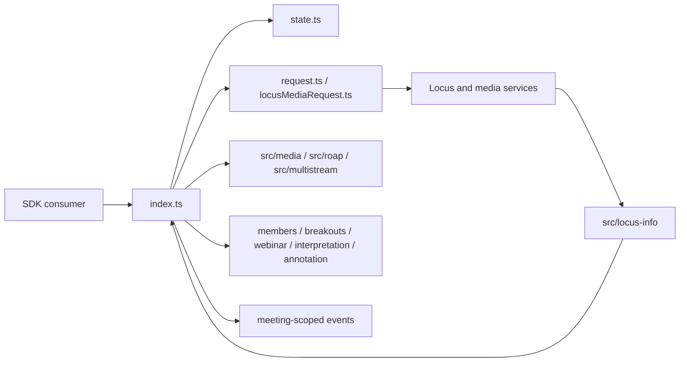
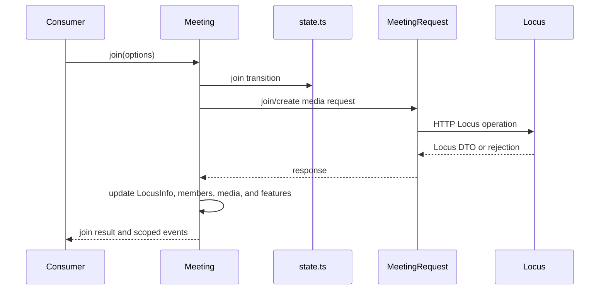
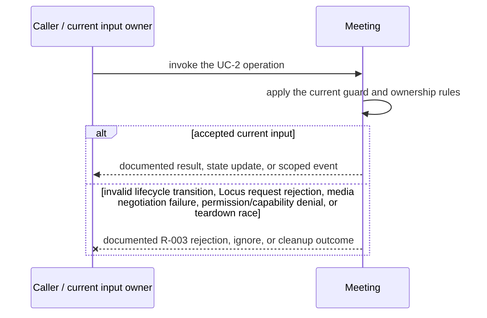
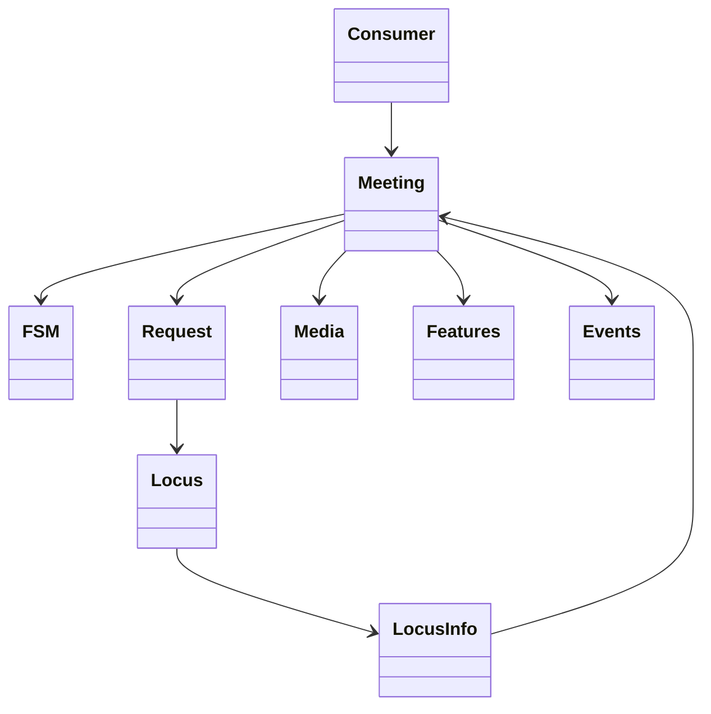
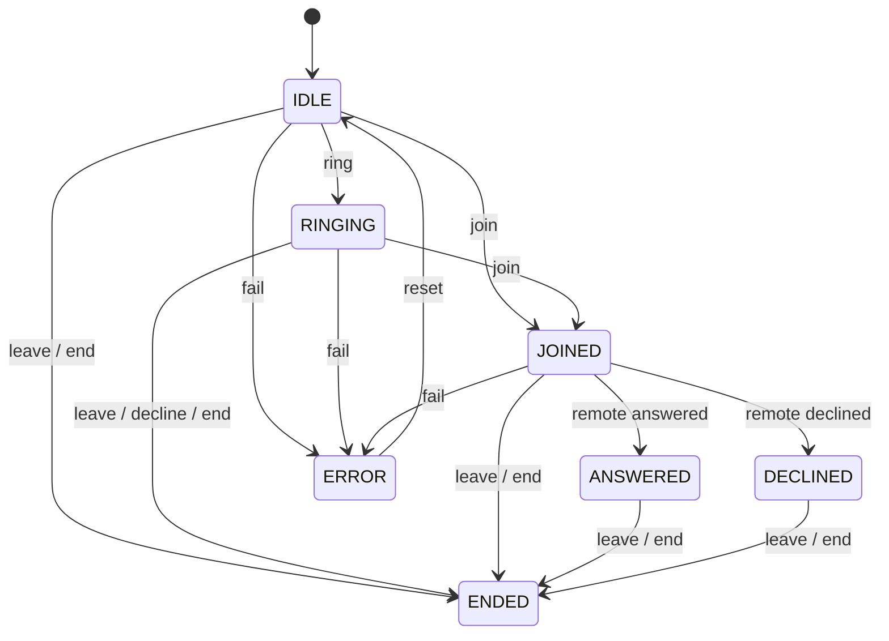

<!-- sdd-generated-metadata
doc_kind: module-spec
generated_from: module-spec@0.2.2
generator_plugin: repo-annotation@1.0.5+codex.20260818094939
generated_by: codex
approved_by: repository user
updated_at: 2026-08-21T06:10:05Z
validation_status: not-run
-->
# MEETING — SPEC

> Start here → root [`AGENTS.md`](../../../AGENTS.md) · router [`SPEC_INDEX.md`](../../../ai-docs/SPEC_INDEX.md) · system [`ARCHITECTURE.md`](../../../ai-docs/ARCHITECTURE.md). This is the canonical source-local spec for `src/meeting/`.

## Metadata

| Field | Value |
|---|---|
| Module id | `meeting` |
| Source path(s) | `src/meeting/` |
| Parent spec | — |
| Doc kind | Module spec |
| Coverage score | 93% assessed 2026-08-21; 13/14 mandatory fields present; all critical and Important fields present; one noncritical polish gap remains |
| Generated from | `module-spec` @ SDLC template library `0.2.2` |
| generated_by / approved_by / updated_at | codex / repository user / 2026-08-21T06:10:05Z |
| Validation status | not-run |

## Evidence Rules

Requirements cite current implementation and mirrored unit-test paths. Current code wins over retained prose when they conflict; commit and PR history are excluded by repository-owner decision. Missing test evidence is stated as a gap rather than inferred.

## Source Material Register

| Source material | Scope | Decision | Detail location or disposition |
|---|---|---|---|
| Retained package README and upgrade guide | overview / API / behavior / tests | used and verified; staged create/join/media/control/end flows and events were reorganized here, with current code correcting old usage details |
| Current source and mirrored tests | implementation / tests | verified | requirements, flows, failures, and test strategy below |

## Overview

`src/meeting/` contains 12 direct source/reference file(s) and has 9 mirrored unit-test file(s). This spec separates its public operations, runtime data movement, component ownership, state applicability, and verification boundary.

## Purpose / Responsibility

Owns one meeting's join/leave lifecycle, Locus projection integration, media, controls, feature controllers, events, and teardown.

## Stack

TypeScript/JavaScript in the Node 22.14 Yarn workspace; Webex core/plugin abstractions and Mocha/Sinon/`@webex/test-helper-chai` tests. Build target: `yarn workspace @webex/plugin-meetings build:src`.

## Folder / Package Structure

```text
src/meeting/
├── brbState.ts — state projection or transition logic
├── connectionStateHandler.ts — state projection or transition logic
├── in-meeting-actions.ts — in-meeting-actions implementation responsibility
├── index.ts — module facade/controller or primary exports
├── locusMediaRequest.ts — request coordination or payload types
├── muteState.ts — state projection or transition logic
├── request.ts — HTTP request boundary
├── request.type.ts — request coordination or payload types
├── state.ts — state projection or transition logic
├── type.ts — type implementation responsibility
├── util.ts — normalization/helper functions
├── voicea-meeting.ts — voicea-meeting implementation responsibility
└── ai-docs/meeting-spec.md — canonical module specification
```

## Key Files (source of truth)

| File | Holds |
|---|---|
| `src/meeting/brbState.ts` | state projection or transition logic |
| `src/meeting/connectionStateHandler.ts` | state projection or transition logic |
| `src/meeting/in-meeting-actions.ts` | in-meeting-actions implementation responsibility |
| `src/meeting/index.ts` | module facade/controller or primary exports |
| `src/meeting/locusMediaRequest.ts` | request coordination or payload types |
| `src/meeting/muteState.ts` | state projection or transition logic |
| `src/meeting/request.ts` | HTTP request boundary |
| `src/meeting/request.type.ts` | request coordination or payload types |
| `src/meeting/state.ts` | state projection or transition logic |
| `src/meeting/type.ts` | type implementation responsibility |
| `src/meeting/util.ts` | normalization/helper functions |
| `src/meeting/voicea-meeting.ts` | voicea-meeting implementation responsibility |
| `test/unit/spec/meeting/brbState.ts` and 8 sibling test file(s) | mirrored characterization/unit coverage |

## Public Surface

| Contract ID | Type | Surface | Purpose | Compatibility / deprecation | Schema / detail link | Root index |
|---|---|---|---|---|---|---|
| `meeting.1` | SDK / in-process / remote | join, acknowledge, leave, and end-for-all lifecycle | Preserve the module responsibility through a focused operation group | Consumer-visible methods/events are semver-sensitive when reachable from package objects | `src/meeting/index.ts` | [CONTRACTS](../../../ai-docs/CONTRACTS.md) |
| `meeting.2` | SDK / in-process / remote | add/update/stop media and local/remote stream state | Preserve the module responsibility through a focused operation group | Consumer-visible methods/events are semver-sensitive when reachable from package objects | `src/meeting/index.ts` | [CONTRACTS](../../../ai-docs/CONTRACTS.md) |
| `meeting.3` | SDK / in-process / remote | meeting controls, members, recording, share, reactions, captions/transcription, and feature access | Preserve the module responsibility through a focused operation group | Consumer-visible methods/events are semver-sensitive when reachable from package objects | `src/meeting/index.ts` | [CONTRACTS](../../../ai-docs/CONTRACTS.md) |

Compatibility notes:
- Prefer additive options and payload fields. Preserve method/event names, rejection semantics, and cleanup timing; route public changes through `src/index.ts` or the documented owning object.

## Requires (dependencies)

Meetings host, LocusInfo, Members, meeting requests, media/ROAP/multistream, reconnection, reachability, feature controllers, Webex services, and metrics.

## Requirements

| ID | WHAT | WHY | Source Evidence | Test / Example Evidence | Assumptions / Gaps | Confidence |
|---|---|---|---|---|---|---|
| `MEETING-R-001` | join, acknowledge, leave, and end-for-all lifecycle. | Owns one meeting's join/leave lifecycle, Locus projection integration, media, controls, feature controllers, events, and teardown. | `src/meeting/index.ts` | `test/unit/spec/meeting/index.js` | none | PRESENT |
| `MEETING-R-002` | add/update/stop media and local/remote stream state. | Callers need deterministic observable behavior across async Webex inputs. | `src/meeting/index.ts`, `src/meeting/request.ts` | `test/unit/spec/meeting/index.js` | additional edge cases may live in sibling tests | PRESENT |
| `MEETING-R-003` | Typed join/media/control failures remain caller-visible; leave/destroy paths stop media and owned listeners/controllers, while state-machine failure transitions preserve the error state. | Callers must receive the actual module failure outcome without false cleanup or event guarantees. | `src/meeting/` | `test/unit/spec/meeting/index.js` | none | PRESENT |
| `MEETING-R-004` | Join applies returned Locus state and can complete before media is added or ready. | The retained staged lifecycle and current code allow signaling participation without conflating it with WebRTC readiness. | `src/meeting/index.ts`, `src/meeting/request.ts` | `test/unit/spec/meeting/index.js`, `test/unit/spec/meeting/request.js` | none | PRESENT |
| `MEETING-R-005` | Media setup uses provided/acquired local streams, negotiates signaling, and emits media readiness/stopped outcomes by media type. | Consumers attach media asynchronously and need local, remote audio/video, and remote-share distinctions. | `src/meeting/index.ts`, `src/media/index.ts` | `test/unit/spec/meeting/index.js`, `test/unit/spec/media/index.ts` | none | PRESENT |
| `MEETING-R-006` | Locus updates refresh members, actions, lock/recording/share/self state, and composed feature controllers before scoped consumer events. | Consumers require one coherent per-meeting projection rather than unrelated raw event payloads. | `src/meeting/index.ts`, `src/locus-info/index.ts` | `test/unit/spec/meeting/index.js`, `test/unit/spec/locus-info/index.js` | none | PRESENT |
| `MEETING-R-007` | Locking, host transfer, recording, mute, share, reactions, BRB, stage, DTMF, and end-for-all operations use current capability/role and request contracts. | These are privileged or state-sensitive mutations and invalid exposure leads to server rejection or incorrect UI actions. | `src/meeting/index.ts`, `src/meeting/request.ts`, `src/meeting/in-meeting-actions.ts` | `test/unit/spec/meeting/index.js`, `test/unit/spec/meeting/request.js`, `test/unit/spec/meeting/in-meeting-actions.ts` | none | PRESENT |
| `MEETING-R-008` | Leave/destroy closes media and remote streams, cancels timers/requests, and cleans members, Locus, data-channel, and feature listeners exactly once. | Partially initialized or recovered calls otherwise leak resources and contaminate later meetings. | `src/meeting/index.ts`, `src/meeting/state.ts` | `test/unit/spec/meeting/index.js`, `test/unit/spec/meeting/connectionStateHandler.ts` | verify integration cleanup for every optional controller | PRESENT |

## Design Overview

`Meeting` orchestrates join/leave, controls, media, Locus, members, feature controllers, and metrics. `state.ts` is the package lifecycle FSM; request and media helpers own remote calls, while specialized files own mute, BRB, connection, in-meeting actions, and Voicea behavior.

## Data Flow



## Sequence Diagram(s)

Sequence coverage:

| Operation group | Diagram | Failure coverage |
|---|---|---|
| UC-1 — primary operation | Primary operation sequence | accepted and rejected dependency outcomes |
| UC-2 — secondary/change operation | Secondary operation and failure sequence | invalid lifecycle transition, Locus request rejection, media negotiation failure, permission/capability denial, or teardown race |

### Primary operation sequence



### Secondary operation and failure sequence



## Class / Component Relationships



The arrows identify ownership and delegation inside `src/meeting/`; files that only declare types or constants are not presented as transports.

## Use Cases

- **UC-1:** Join and leave through the lifecycle FSM while reconciling accepted Locus state into composed controllers. Evidence: `src/meeting/`.
- **UC-2:** Apply meeting controls/media changes through their owning request or helper and preserve the established meeting-scoped event contract. Evidence: `src/meeting/`.

## State Model

Identity, meeting/locus state, members, local and remote streams, media connection, mute/share/BRB/control state, feature controllers, timers, and correlation identifiers are meeting-scoped.

## Business Rules & Invariants

- Remote Locus state remains authoritative; media and listeners must be closed exactly once during leave/destroy; privileged operations require current capability/role data. Enforced by `src/meeting/index.ts` and supporting code under `src/meeting/`.

## Concurrency & Reactive Flow

- Async work owned by `Meeting` may complete after a newer caller or remote input. Preserve the identity, sequence, and resource-owner guards in `src/meeting/`; a late completion must not replay UC-2 for superseded state.

## State Machine



The diagram follows the `MEETING_STATE_MACHINE` values and transition table implemented in `src/meeting/state.ts`.

## Protocol / Wire Format

- External payloads are parsed/serialized by files under `src/meeting/` and existing Webex/media dependencies. Preserve current field names, enum/raw values, sequence identifiers, and compatibility behavior; do not treat the normalized client model as the wire schema.

## Error Handling & Failure Modes

| Condition | Signal | Caller recovery |
|---|---|---|
| invalid lifecycle transition, Locus request rejection, media negotiation failure, permission/capability denial, or teardown race | Follow the concrete rejection, ignore, state, or cleanup behavior in the module's R-003 requirement. | Resolve the named condition; retry only when another requirement defines a bound. |
| UC-1 succeeds | Return, update, callback, or scoped event identified by the Public Surface and primary sequence. | Continue from the owning module's accepted state. |

## Pitfalls

- Joining and adding media are distinct stages. A join can succeed before streams are ready, and teardown must handle partially initialized media.
- Public behavior may be reachable through a parent `Meeting`/`Meetings` object even when the source helper is not exported directly.

## Module Do's / Don'ts

- DO preserve this boundary: Join and leave through the lifecycle FSM while reconciling accepted Locus state into composed controllers.
- DON'T move remote I/O or lifecycle ownership into a passive type, constant, catalog, or normalization file.

## Host Integration & Theming

The Webex SDK host supplies initialized request/device/Mercury/media capabilities and exposes this behavior through `webex.meetings` or its Meeting objects. The module renders no UI and has no theme contract.

## Key Design Trade-off

- The object composes many controllers to give consumers one stable meeting surface; the cost is careful delegation and lifecycle cleanup.

## Test-Case Strategy (module)

Use the current mirrored suites: `test/unit/spec/meeting/brbState.ts`, `test/unit/spec/meeting/connectionStateHandler.ts`, `test/unit/spec/meeting/in-meeting-actions.ts`, `test/unit/spec/meeting/index.js`, `test/unit/spec/meeting/locusMediaRequest.ts`, `test/unit/spec/meeting/muteState.js`, `test/unit/spec/meeting/request.js`, `test/unit/spec/meeting/utils.js`, `test/unit/spec/meeting/voicea-meeting.ts`. Characterize the two code-grounded use cases above and the listed failure condition; add cleanup or transition cases only for resources and state this module actually owns.

| Behavior / Requirement | Existing test evidence | Gap |
|---|---|---|
| `MEETING-R-001` | `test/unit/spec/meeting/index.js` | confirm the named operation against its owning sibling suite |
| `MEETING-R-002` | `test/unit/spec/meeting/index.js` | verify the code-grounded rejection or stale-input branch |
| `MEETING-R-003` | `test/unit/spec/meeting/index.js` | verify the concrete R-003 rejection, ignore, or cleanup outcome |
| `MEETING-R-004` | `test/unit/spec/meeting/index.js`, `test/unit/spec/meeting/request.js` | none |
| `MEETING-R-005` | `test/unit/spec/meeting/index.js`, `test/unit/spec/media/index.ts` | verify every media type and partial initialization |
| `MEETING-R-006` | `test/unit/spec/meeting/index.js`, `test/unit/spec/locus-info/index.js` | verify event ordering for each projection family |
| `MEETING-R-007` | `test/unit/spec/meeting/request.js`, `test/unit/spec/meeting/in-meeting-actions.ts` | verify capability-denied cases for each control |
| `MEETING-R-008` | `test/unit/spec/meeting/index.js` | verify every optional controller cleanup path |

## Traceability

- Repo architecture: [`ARCHITECTURE.md`](../../../ai-docs/ARCHITECTURE.md) · Registry: [`SPEC_INDEX.md`](../../../ai-docs/SPEC_INDEX.md)
- Coverage state and contracts baseline: `../../../.sdd/manifest.json`
