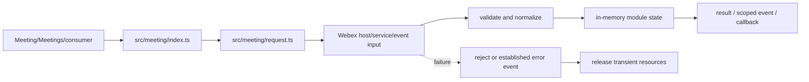
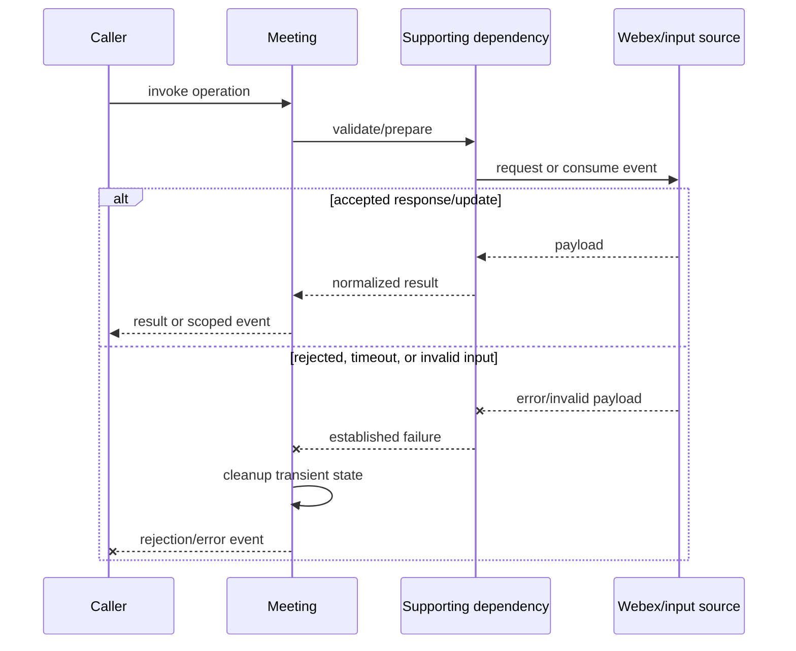
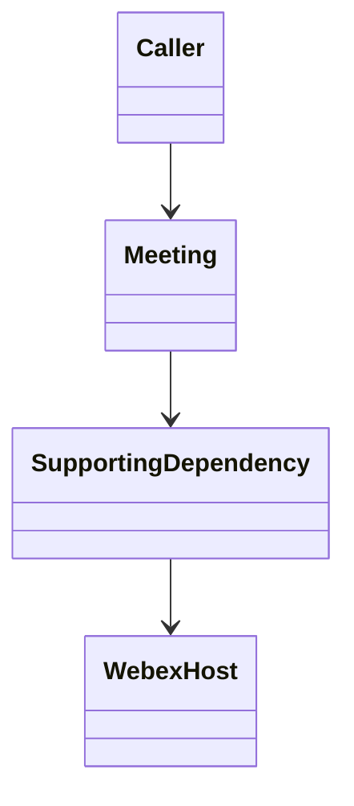
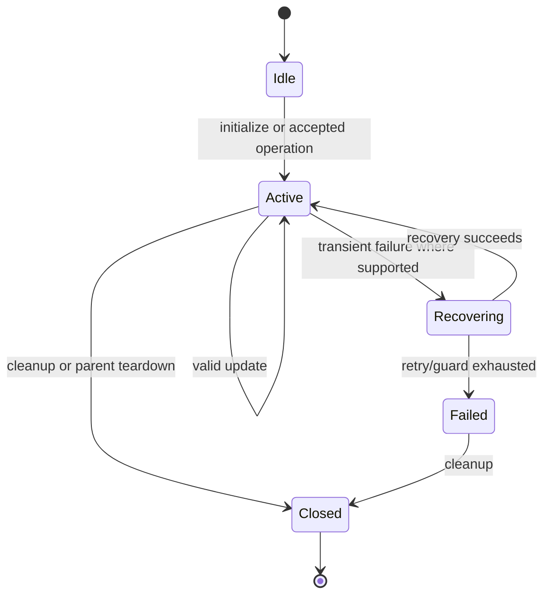

<!-- sdd-generated-metadata
doc_kind: module-spec
generated_from: module-spec@0.2.2
generator_plugin: repo-annotation@1.0.5+codex.20260818094939
generated_by: codex
approved_by: repository user
updated_at: 2026-08-18T15:33:39Z
validation_status: not-run
-->
# MEETING — SPEC

> Start here → root [`AGENTS.md`](../../../AGENTS.md) · router [`SPEC_INDEX.md`](../../../ai-docs/SPEC_INDEX.md) · system [`ARCHITECTURE.md`](../../../ai-docs/ARCHITECTURE.md). This is the canonical source-local spec for `src/meeting/`.

## Metadata

| Field | Value |
|---|---|
| Module id | `meeting` |
| Source path(s) | `src/meeting/` |
| Parent spec | — |
| Doc kind | Module spec |
| Coverage score | 93% assessed 2026-08-18; 13/14 mandatory fields present; all critical fields present, one noncritical detail gap remains |
| Generated from | `module-spec` @ SDLC template library `0.2.2` |
| generated_by / approved_by / updated_at | codex / repository user / 2026-08-18T15:33:39Z |
| Validation status | not-run |

## Evidence Rules

Requirements cite current implementation and mirrored unit-test paths. Current code wins over retained prose when they conflict; commit and PR history are excluded by repository-owner decision. Missing test evidence is stated as a gap rather than inferred.

## Source Material Register

| Source material | Scope | Decision | Detail location or disposition |
|---|---|---|---|
| Retained package README and upgrade guide | overview / API / behavior / tests | used and verified; staged create/join/media/control/end flows and events were reorganized here, with current code correcting old usage details |
| Current source and mirrored tests | implementation / tests | verified | requirements, flows, failures, and test strategy below |

## Overview

For orientation, start at `src/meeting/index.ts`; supporting files under `src/meeting/` separate request, parsing, collection, type, or utility concerns from parent orchestration. The module is composed by `Meeting`, `Meetings`, or the package entry as applicable. Remote Webex services/Locus remain authoritative, and all local state is scoped to the SDK, plugin, meeting, or operation lifetime.

## Purpose / Responsibility

Owns one meeting's join/leave lifecycle, Locus projection integration, media, controls, feature controllers, events, and teardown.

## Stack

TypeScript/JavaScript in the Node 22.14 Yarn workspace; Webex core/plugin abstractions and Mocha/Sinon/`@webex/test-helper-chai` tests. Build target: `yarn workspace @webex/plugin-meetings build:src`.

## Folder / Package Structure

```text
src/meeting/
├── index.ts — primary behavior/entry point
├── request.ts — request, parser, utility, or supporting behavior
└── ai-docs/meeting-spec.md — canonical module specification
```

## Key Files (source of truth)

| File | Holds |
|---|---|
| `src/meeting/index.ts` | Primary lifecycle and public/internal surface |
| `src/meeting/request.ts` | Supporting transport, parser, or state behavior |
| `test/unit/spec/meeting/index.js` | Mirrored behavioral tests |
| `src/constants.ts` | Shared meeting/event/wire constants where consumed |

## Public Surface

| Contract ID | Type | Surface | Purpose | Compatibility / deprecation | Schema / detail link | Root index |
|---|---|---|---|---|---|---|
| `meeting.1` | SDK / in-process / remote | join, acknowledge, leave, and end-for-all lifecycle | Preserve the module responsibility through a focused operation group | Consumer-visible methods/events are semver-sensitive when reachable from package objects | `src/meeting/index.ts` | [CONTRACTS](../../../ai-docs/CONTRACTS.md) |
| `meeting.2` | SDK / in-process / remote | add/update/stop media and local/remote stream state | Preserve the module responsibility through a focused operation group | Consumer-visible methods/events are semver-sensitive when reachable from package objects | `src/meeting/index.ts` | [CONTRACTS](../../../ai-docs/CONTRACTS.md) |
| `meeting.3` | SDK / in-process / remote | meeting controls, members, recording, share, reactions, captions/transcription, and feature access | Preserve the module responsibility through a focused operation group | Consumer-visible methods/events are semver-sensitive when reachable from package objects | `src/meeting/index.ts` | [CONTRACTS](../../../ai-docs/CONTRACTS.md) |

Compatibility notes:
- Prefer additive options and payload fields. Preserve method/event names, rejection semantics, and cleanup timing; route public changes through `src/index.ts` or the documented owning object.

## Requires (dependencies)

Meetings host, LocusInfo, Members, meeting requests, media/ROAP/multistream, reconnection, reachability, feature controllers, Webex services, and metrics.

## Requirements

| ID | WHAT | WHY | Source Evidence | Test / Example Evidence | Assumptions / Gaps | Confidence |
|---|---|---|---|---|---|---|
| `MEETING-R-001` | join, acknowledge, leave, and end-for-all lifecycle. | Owns one meeting's join/leave lifecycle, Locus projection integration, media, controls, feature controllers, events, and teardown. | `src/meeting/index.ts` | `test/unit/spec/meeting/index.js` | none | PRESENT |
| `MEETING-R-002` | add/update/stop media and local/remote stream state. | Callers need deterministic observable behavior across async Webex inputs. | `src/meeting/index.ts`, `src/meeting/request.ts` | `test/unit/spec/meeting/index.js` | additional edge cases may live in sibling tests | PRESENT |
| `MEETING-R-003` | Failures reject/emit the established signal and release module-owned listeners, timers, or transient objects. | Hidden failure or leaked state causes later meeting operations to behave incorrectly. | `src/meeting/index.ts` | `test/unit/spec/meeting/index.js` | verify sibling test files for operation-specific cleanup | PRESENT |
| `MEETING-R-004` | Join applies returned Locus state and can complete before media is added or ready. | The retained staged lifecycle and current code allow signaling participation without conflating it with WebRTC readiness. | `src/meeting/index.ts`, `src/meeting/request.ts` | `test/unit/spec/meeting/index.js`, `test/unit/spec/meeting/request.js` | none | PRESENT |
| `MEETING-R-005` | Media setup uses provided/acquired local streams, negotiates signaling, and emits media readiness/stopped outcomes by media type. | Consumers attach media asynchronously and need local, remote audio/video, and remote-share distinctions. | `src/meeting/index.ts`, `src/media/index.ts` | `test/unit/spec/meeting/index.js`, `test/unit/spec/media/index.ts` | none | PRESENT |
| `MEETING-R-006` | Locus updates refresh members, actions, lock/recording/share/self state, and composed feature controllers before scoped consumer events. | Consumers require one coherent per-meeting projection rather than unrelated raw event payloads. | `src/meeting/index.ts`, `src/locus-info/index.ts` | `test/unit/spec/meeting/index.js`, `test/unit/spec/locus-info/index.js` | none | PRESENT |
| `MEETING-R-007` | Locking, host transfer, recording, mute, share, reactions, BRB, stage, DTMF, and end-for-all operations use current capability/role and request contracts. | These are privileged or state-sensitive mutations and invalid exposure leads to server rejection or incorrect UI actions. | `src/meeting/index.ts`, `src/meeting/request.ts`, `src/meeting/in-meeting-actions.ts` | `test/unit/spec/meeting/index.js`, `test/unit/spec/meeting/request.js`, `test/unit/spec/meeting/in-meeting-actions.ts` | none | PRESENT |
| `MEETING-R-008` | Leave/destroy closes media and remote streams, cancels timers/requests, and cleans members, Locus, data-channel, and feature listeners exactly once. | Partially initialized or recovered calls otherwise leak resources and contaminate later meetings. | `src/meeting/index.ts`, `src/meeting/state.ts` | `test/unit/spec/meeting/index.js`, `test/unit/spec/meeting/connectionStateHandler.ts` | verify integration cleanup for every optional controller | PRESENT |

## Design Overview

The primary entry point coordinates domain state and delegates transport/parsing to supporting files so those boundaries remain testable. Inputs are normalized before client state or events change. Async results preserve the established error signal, while teardown owns every listener, timer, or transient object allocated by this module.

## Data Flow



## Sequence Diagram(s)

Sequence coverage:

The operation groups below share the same caller → module → supporting dependency → Webex/input ordering and the same rejection/cleanup contract, so one combined diagram covers their common sequence; operation-specific state and guards are stated in the requirements and use cases.

| Operation group | Diagram | Failure / recovery coverage |
|---|---|---|
| join, acknowledge, leave, and end-for-all lifecycle | Primary operation | validation/service rejection and cleanup branch |
| add/update/stop media and local/remote stream state | Async update | stale/error input is rejected or ignored according to current code |



## Class / Component Relationships



The primary module object owns its client state and composes/invokes supporting request, parser, collection, or utility code. The Webex host/service remains the authority for remote state.

## Use Cases

- **UC-1 Primary operation:** a consumer or parent module invokes join, acknowledge, leave, and end-for-all lifecycle; the module validates/delegates, normalizes the result, updates state where applicable, and returns or emits the established outcome. Evidence: `src/meeting/index.ts`, `test/unit/spec/meeting/index.js`.
- **UC-2 Async/change operation:** the parent or remote input triggers add/update/stop media and local/remote stream state; the module reconciles it with current state and exposes one scoped result. Evidence: `src/meeting/index.ts`, `src/meeting/request.ts`.

## State Model

Identity, meeting/locus state, members, local and remote streams, media connection, mute/share/BRB/control state, feature controllers, timers, and correlation identifiers are meeting-scoped.

## Business Rules & Invariants

- Remote Locus state remains authoritative; media and listeners must be closed exactly once during leave/destroy; privileged operations require current capability/role data. Enforced by `src/meeting/index.ts` and supporting code under `src/meeting/`.

## Concurrency & Reactive Flow

- Promise, event, media, and timer callbacks can interleave. Preserve existing sequence guards, make cleanup idempotent, and never start an unbounded retry/listener loop.
- Do not assume remote events are globally ordered unless the current parser/state code enforces ordering.

## State Machine



State labels summarize the module lifecycle; exact guards and values remain in `src/meeting/index.ts`.

## Protocol / Wire Format

- External payloads are parsed/serialized by files under `src/meeting/` and existing Webex/media dependencies. Preserve current field names, enum/raw values, sequence identifiers, and compatibility behavior; do not treat the normalized client model as the wire schema.

## Error Handling & Failure Modes

| Condition | Signal | Caller recovery |
|---|---|---|
| invalid options or unsupported state | established validation/error rejection | correct input/state; do not retry unchanged |
| Webex/service/media rejection | propagated typed/request/media error | branch on the established error; retry only where module policy is bounded |
| timeout, stale update, or teardown race | timeout/rejection/ignored stale update per current path | re-read current meeting state; allow cleanup/recovery manager to finish |

## Pitfalls

- Joining and adding media are distinct stages. A join can succeed before streams are ready, and teardown must handle partially initialized media.
- Public behavior may be reachable through a parent `Meeting`/`Meetings` object even when the source helper is not exported directly.

## Module Do's / Don'ts

- DO preserve the module's existing state/event/request delegation and mirror new cases under `test/unit/spec/meeting/`.
- DON'T duplicate Locus/server state or bypass the owning request/controller helper.

## Host Integration & Theming

The Webex SDK host supplies initialized request/device/Mercury/media capabilities and exposes this behavior through `webex.meetings` or its Meeting objects. The module renders no UI and has no theme contract.

## Key Design Trade-off

- The object composes many controllers to give consumers one stable meeting surface; the cost is careful delegation and lifecycle cleanup.

## Test-Case Strategy (module)

Use the mirrored suite as the first characterization boundary. Cover each public operation with a successful result/state/event and a rejected/invalid branch; use fake timers for timeout/retry logic; assert listener/resource cleanup for async modules; keep request/parser fixtures representative without secrets.

| Behavior / Requirement | Existing test evidence | Gap |
|---|---|---|
| `MEETING-R-001` | `test/unit/spec/meeting/index.js` | confirm sibling operation tests during focused changes |
| `MEETING-R-002` | `test/unit/spec/meeting/index.js` | verify out-of-order/rejection edge where applicable |
| `MEETING-R-003` | `test/unit/spec/meeting/index.js` | verify cleanup on every early-exit path |
| `MEETING-R-004` | `test/unit/spec/meeting/index.js`, `test/unit/spec/meeting/request.js` | none |
| `MEETING-R-005` | `test/unit/spec/meeting/index.js`, `test/unit/spec/media/index.ts` | verify every media type and partial initialization |
| `MEETING-R-006` | `test/unit/spec/meeting/index.js`, `test/unit/spec/locus-info/index.js` | verify event ordering for each projection family |
| `MEETING-R-007` | `test/unit/spec/meeting/request.js`, `test/unit/spec/meeting/in-meeting-actions.ts` | verify capability-denied cases for each control |
| `MEETING-R-008` | `test/unit/spec/meeting/index.js` | verify every optional controller cleanup path |

## Traceability

- Repo architecture: [`ARCHITECTURE.md`](../../../ai-docs/ARCHITECTURE.md) · Registry: [`SPEC_INDEX.md`](../../../ai-docs/SPEC_INDEX.md)
- Coverage state and contracts baseline: `../../../.sdd/manifest.json`
