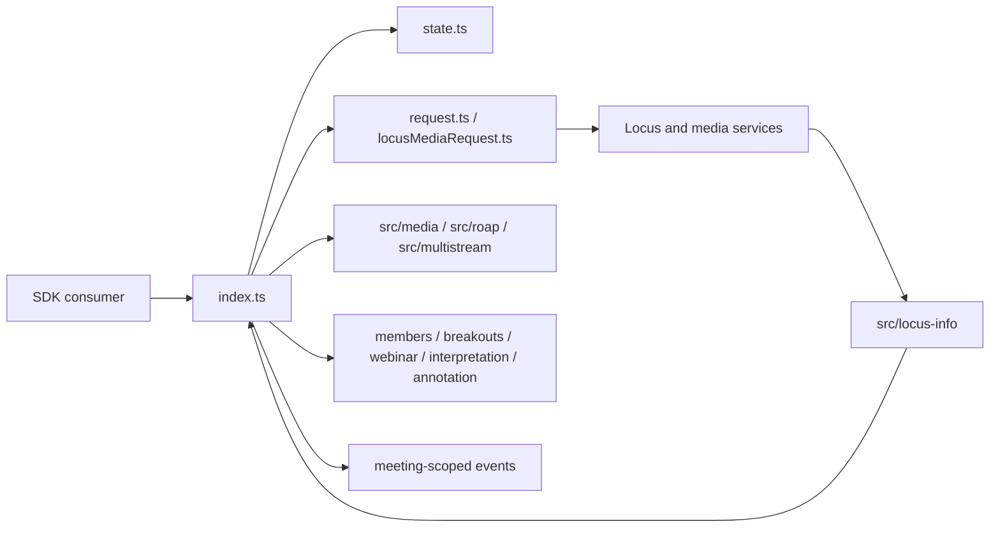
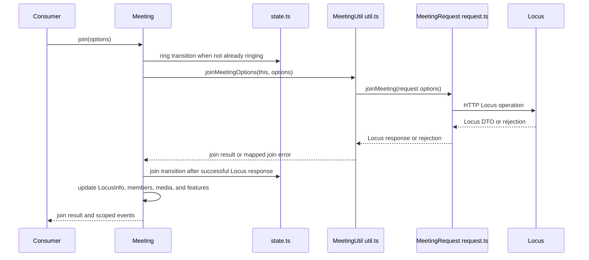
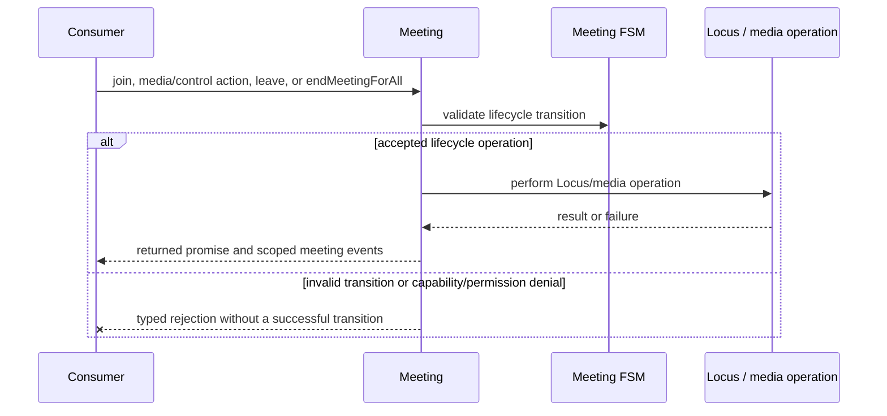
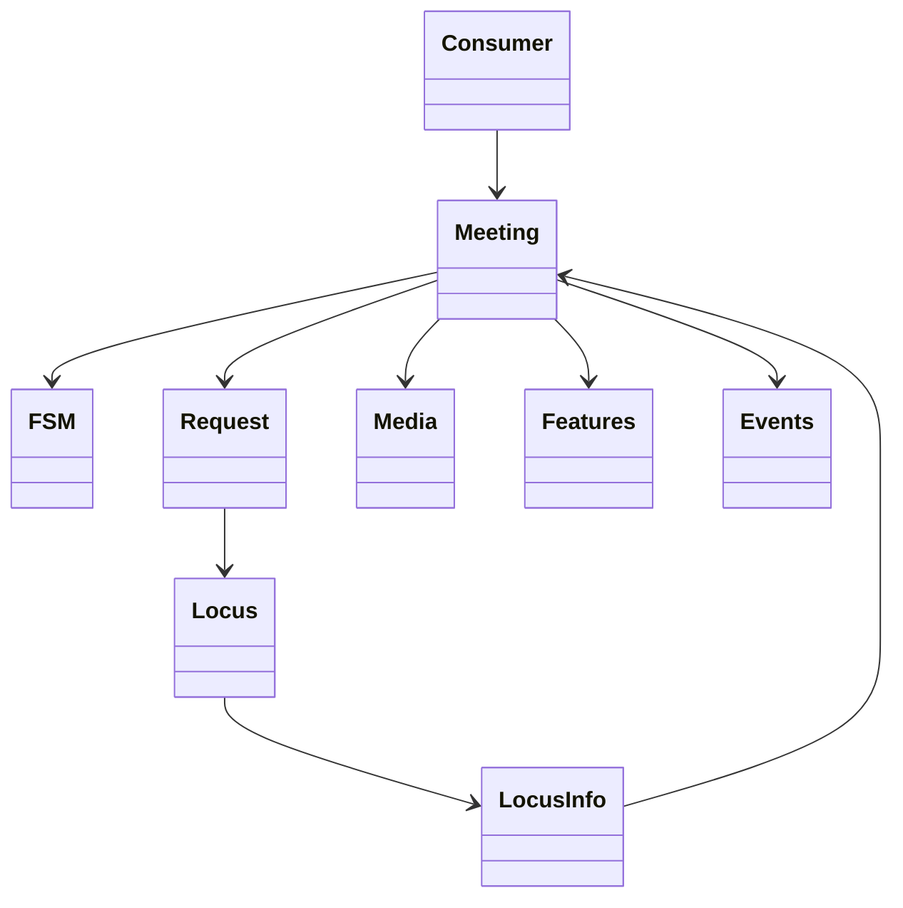
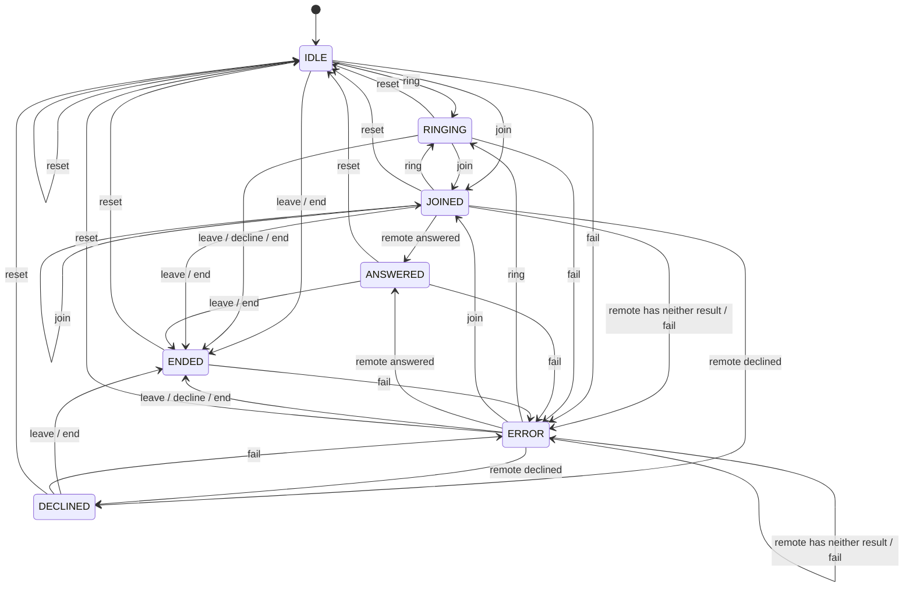

<!-- sdd-generated-metadata
doc_kind: module-spec
generated_from: module-spec@0.2.2
generator_plugin: repo-annotation@1.0.5+codex.20260818094939
generated_by: codex
approved_by: repository user
updated_at: 2026-08-22T15:21:29Z
validation_status: pass-with-warnings
-->
# MEETING — SPEC

> Start here → root [`AGENTS.md`](../../../AGENTS.md) · router [`SPEC_INDEX.md`](../../../ai-docs/SPEC_INDEX.md) · system [`ARCHITECTURE.md`](../../../ai-docs/ARCHITECTURE.md). This is the canonical source-local spec for `src/meeting/`.

## Metadata

| Field | Value |
|---|---|
| Module id | `meeting` |
| Source path(s) | `src/meeting/` |
| Parent spec | — |
| Doc kind | Module spec |
| Coverage score | 93% assessed 2026-08-22; 13/14 mandatory fields present; all critical and Important fields present; one noncritical polish gap remains; pending independent validation of the participant-role repair |
| Generated from | `module-spec` @ SDLC template library `0.2.2` |
| generated_by / approved_by / updated_at | codex / repository user / 2026-08-22T15:21:29Z |
| Validation status | pass-with-warnings |

## Evidence Rules

Requirements cite current implementation and mirrored unit-test paths. Current code wins over retained prose when they conflict; commit and PR history are excluded by repository-owner decision. Missing test evidence is stated as a gap rather than inferred.

## Source Material Register

| Source material | Scope | Decision | Detail location or disposition |
|---|---|---|---|
| Retained package README and upgrade guide | overview / API / behavior / tests | used and verified; staged create/join/media/control/end flows and events were reorganized here, with current code correcting old usage details |
| Current source and mirrored tests | implementation / tests | verified | requirements, flows, failures, and test strategy below |

## Overview

`src/meeting/` contains 12 direct source/reference file(s) and has 9 mirrored unit-test file(s). This spec separates its public operations, runtime data movement, component ownership, state applicability, and verification boundary.

## Purpose / Responsibility

Owns one meeting's join/leave lifecycle, Locus projection integration, media, controls, feature controllers, events, and teardown.

## Stack

TypeScript/JavaScript in the Node 22.14 Yarn workspace; Webex core/plugin abstractions and Mocha/Sinon/`@webex/test-helper-chai` tests. Build target: `yarn workspace @webex/plugin-meetings build:src`.

## Folder / Package Structure

```text
src/meeting/
├── brbState.ts — state projection or transition logic
├── connectionStateHandler.ts — state projection or transition logic
├── in-meeting-actions.ts — in-meeting-actions implementation responsibility
├── index.ts — module facade/controller or primary exports
├── locusMediaRequest.ts — request coordination or payload types
├── muteState.ts — state projection or transition logic
├── request.ts — HTTP request boundary
├── request.type.ts — request coordination or payload types
├── state.ts — state projection or transition logic
├── type.ts — type implementation responsibility
├── util.ts — normalization/helper functions
├── voicea-meeting.ts — voicea-meeting implementation responsibility
└── ai-docs/meeting-spec.md — canonical module specification
```

## Key Files (source of truth)

| File | Holds |
|---|---|
| `src/meeting/brbState.ts` | state projection or transition logic |
| `src/meeting/connectionStateHandler.ts` | state projection or transition logic |
| `src/meeting/in-meeting-actions.ts` | in-meeting-actions implementation responsibility |
| `src/meeting/index.ts` | module facade/controller or primary exports |
| `src/meeting/locusMediaRequest.ts` | request coordination or payload types |
| `src/meeting/muteState.ts` | state projection or transition logic |
| `src/meeting/request.ts` | HTTP request boundary |
| `src/meeting/request.type.ts` | request coordination or payload types |
| `src/meeting/state.ts` | state projection or transition logic |
| `src/meeting/type.ts` | type implementation responsibility |
| `src/meeting/util.ts` | normalization/helper functions |
| `src/meeting/voicea-meeting.ts` | voicea-meeting implementation responsibility |
| `test/unit/spec/meeting/brbState.ts` and 8 sibling test file(s) | mirrored characterization/unit coverage |

## Public Surface

| Contract ID | Type | Surface | Purpose | Compatibility / deprecation | Schema / detail link | Root index |
|---|---|---|---|---|---|---|
| `meeting.1` | SDK / identity/metrics | `getWebexObject()`, `isLocusCall()`, `correlationId`, `pstnCorrelationId`, `userNameInput`, `emailInput`, `sessionCorrelationId`, `isoLocalClientMeetingJoinTime`, `setCorrelationId()`, `updateCallStateForMetrics()`, `postMetrics()`, and `getCurUserType()` | Expose meeting identity and maintain correlation/call-state context used by requests and telemetry. | Preserve accessor semantics, correlation propagation, and metric field names. | `src/meeting/index.ts` | [CONTRACTS](../../../ai-docs/CONTRACTS.md) |
| `meeting.2` | SDK / meeting-info/auth | `injectMeetingInfo()`, `refreshPermissionToken()`, `fetchMeetingInfo()`, `verifyPassword()`, `verifyRegistrationId()`, `refreshCaptcha()`, `parseMeetingInfo()`, `setSelfUserPolicies()`, `setPermissionTokenPayload()`, `setSipUri()`, `getPermissionTokenExpiryInfo()`, and `checkAndRefreshPermissionToken()` | Resolve destination/authentication context before joining and refresh expiring permission state. | Preserve typed meeting-info failures, token ownership, and direct request outcomes. | `src/meeting/index.ts`, `src/meeting-info/index.ts` | [CONTRACTS](../../../ai-docs/CONTRACTS.md) |
| `meeting.3` | SDK / members, breakouts, and BRB | `setUpBreakoutsListener()`, `invite()`, `cancelPhoneInvite()`, `cancelInviteByMemberId()`, `admit()`, `beRightBack()`, `remove()`, `mute()`, `transfer()`, and `getMembers()` | Delegate roster/lobby/host operations to Members, bridge breakout events, and route BRB changes through the Meeting-owned `brbState`. | Preserve target member ids, returned promises, scoped event behavior, and BRB's multistream/media-connection guards. | `src/meeting/index.ts`, `src/meeting/brbState.ts`, `src/members/index.ts`, `src/breakouts/index.ts` | [CONTRACTS](../../../ai-docs/CONTRACTS.md) |
| `meeting.4` | SDK / Locus/log/event plus module helper | Meeting methods `finalizeMeetingAfterInitialLocusSetup()`, `setLocus()`, `uploadLogs()`, `startPeriodicLogUpload()`, `stopPeriodicLogUpload()`, `setMercuryListener()`, `forwardEvent()`, and `handleDataChannelUrlChange()`; module-level export `storeEventForDebugging()` | Establish composed controller state, own Meeting listener forwarding, and capture/upload meeting diagnostics without presenting the module helper as a Meeting instance method. | Preserve listener/event names, periodic upload lifecycle, and the module-level helper boundary. | `src/meeting/index.ts` | [CONTRACTS](../../../ai-docs/CONTRACTS.md) |
| `meeting.5` | SDK / teardown | `unsetRemoteStreams()`, `closeRemoteStream()`, `closeRemoteStreams()`, `cleanupLocalStreams()`, `closePeerConnections()`, `unsetPeerConnections()`, `clearDataChannelToken()`, and `saveDataChannelToken()` | Release or detach the stream, peer-connection, and token resources owned by the Meeting lifecycle. | Keep close versus unset semantics distinct and cleanup idempotent. | `src/meeting/index.ts`, `src/media/properties.ts` | [CONTRACTS](../../../ai-docs/CONTRACTS.md) |
| `meeting.6` | SDK / local mute | `muteAudio()`, `unmuteAudio()`, `muteVideo()`, and `unmuteVideo()` | Apply local audio/video mute intent through the Meeting mute/media state. | Preserve remote-mute/unmute constraints and caller-visible outcomes. | `src/meeting/index.ts`, `src/meeting/muteState.ts` | [CONTRACTS](../../../ai-docs/CONTRACTS.md) |
| `meeting.7` | SDK / lifecycle/media | `joinWithMedia()`, `reconnect()`, `join()`, `addMedia()`, `canUpdateMedia()`, `updateMedia()`, `acknowledge()`, `decline()`, `buildLeaveFetchRequestOptions()`, `leave()`, `endMeetingForAll()`, and `getMediaConnectionDebugId()` | Drive the join/leave FSM and establish or renegotiate media against current Locus state. | Preserve state guards, request ordering, media options, and rollback/cleanup behavior. | `src/meeting/index.ts`, `src/meeting/request.ts`, `src/meeting/locusMediaRequest.ts` | [CONTRACTS](../../../ai-docs/CONTRACTS.md) |
| `meeting.8` | SDK / captions/reactions/consent | `isTranscriptionSupported()`, `isReactionsSupported()`, `setCaptionLanguage()`, `setSpokenLanguage()`, `startTranscription()`, `stopTranscription()`, `sendReaction()`, `toggleReactions()`, `extendMeeting()`, and `setPostMeetingDataConsent()` | Expose optional in-meeting collaboration features through their current request/data-channel paths. | Preserve implemented support checks and event values; `setPostMeetingDataConsent()` forwards its request without a local feature/capability check. | `src/meeting/index.ts`, `src/reactions/reactions.ts` | [CONTRACTS](../../../ai-docs/CONTRACTS.md) |
| `meeting.9` | SDK / telephony/move | `usePhoneAudio()`, `disconnectPhoneAudio()`, `moveTo()`, `moveFrom()`, `sendDTMF()`, `sipCallOut()`, and `cancelSipCallOut()` | Switch audio devices/meetings and operate PSTN/SIP signaling within the current meeting. | Preserve correlation/participant context and direct request failures. | `src/meeting/index.ts`, `src/meeting/request.ts` | [CONTRACTS](../../../ai-docs/CONTRACTS.md) |
| `meeting.10` | SDK / meeting controls | `startRecording()`, `stopRecording()`, `pauseRecording()`, `resumeRecording()`, `setMuteOnEntry()`, `setDisallowUnmute()`, `setMuteAll()`, `lockMeeting()`, `unlockMeeting()`, `changeVideoLayout()`, and `setRemoteQualityLevel()` | Delegate recording, meeting-control, layout, and remote-quality actions to their owning controller/request. | Preserve capability checks, action values, and service-vs-Locus routing. | `src/meeting/index.ts`, `src/recording-controller/index.ts`, `src/controls-options-manager/index.ts` | [CONTRACTS](../../../ai-docs/CONTRACTS.md) |
| `meeting.11` | SDK / share/publication | `startWhiteboardShare()`, `stopWhiteboardShare()`, `enableMusicMode()`, `setSendNamedMediaGroup()`, `publishStreams()`, and `unpublishStreams()` | Start/stop whiteboard sharing and configure/publish/unpublish local media-core streams. | Preserve explicit stream lists, publication state, and share cleanup reasons. | `src/meeting/index.ts` | [CONTRACTS](../../../ai-docs/CONTRACTS.md) |
| `meeting.12` | SDK / stage/LLM/data channel | `setStage()`, `unsetStage()`, `notifyHost()`, `updateLLMConnection()`, `refreshDataChannelToken()`, and `getDataChannelTokenType()` | Manage stage synchronization, host notification, and meeting data-channel authorization/connection state. | Preserve stage payload options and token-type selection; `refreshDataChannelToken()` logs request failure and resolves `null` rather than rejecting. | `src/meeting/index.ts`, `src/meeting/request.ts` | [CONTRACTS](../../../ai-docs/CONTRACTS.md) |
| `meeting.13` | exported helper classes | `BrbState.enable()` / `handleServerBrbUpdate()`; `LocusMediaRequest.send()` / `isConfluenceCreated()` / `downgradeFromMultistreamToTranscoded()`; `MuteState.init()`, `handleLocalStreamChange()`, `enable()`, `handleLocalStreamMuteStateChange()`, `applyClientStateLocally()`, `handleServerRemoteMuteUpdate()`, `handleServerLocalUnmuteRequired()`, `isMuted()`, `isRemotelyMuted()`, `isUnmuteAllowed()`, and `isLocallyMuted()` | Separate BRB, mute, and Locus-media mechanics from the main Meeting facade. | Preserve helper state transitions and media-request contract shapes. | `src/meeting/brbState.ts`, `src/meeting/locusMediaRequest.ts`, `src/meeting/muteState.ts` | [CONTRACTS](../../../ai-docs/CONTRACTS.md) |
| `meeting.14` | exported request adapter | `MeetingRequest.joinMeeting()`, `getLocusDTO()`, `prepareLeaveMeetingRequestOptions()`, `leaveMeeting()`, `buildLeaveMeetingRequestOptions()`, `acknowledgeMeeting()`, `lockMeeting()`, `declineMeeting()`, `changeMeetingFloor()`, `sendDTMF()`, `changeVideoLayout()`, `endMeetingForAll()`, `keepAlive()`, `sendReaction()`, `extendMeeting()`, `toggleReactions()`, `getLocusStatusByUrl()`, `setBrb()`, `setPostMeetingDataConsent()`, `synchronizeStage()`, `notifyHost()`, `sipCallOut()`, `cancelSipCallOut()`, and `fetchDatachannelToken()` | Provide the direct Locus/request boundary used by Meeting operations. | Preserve per-method HTTP outcomes: missing data-channel token inputs reject, while a token transport failure is caught and resolves `null`; other adapters retain their implemented response/rejection behavior. | `src/meeting/request.ts` | [CONTRACTS](../../../ai-docs/CONTRACTS.md) |
| `meeting.15` | exported contracts | `createBrbState`, `BrbState`, `ConnectionStateEvent`, `ConnectionStateChangedEvent`, `ConnectionStateHandler`, `InMeetingActions`, `CaptionData`, `Transcription`, `LocalStreams`, `AddMediaOptions`, `AdditionalMediaOptions`, `CallStateForMetrics`, `MEDIA_UPDATE_TYPE`, `ScreenShareFloorStatus`, `RequestResult`, `RoapRequest`, `LocalMuteRequest`, `Request`, `Config`, `MediaRequestType`, `LocusMediaRequest`, `createMuteState`, `MuteState`, `MeetingRequest`, `SendReactionOptions`, `ToggleReactionsOptions`, `BrbOptions`, `PostMeetingDataConsentOptions`, `StageCustomLogoPositions`, `StageNameLabelType`, `StageCustomBackground`, `StageCustomLogo`, `StageCustomNameLabel`, `SetStageOptions`, `SetStageVideoLayout`, `UnsetStageVideoLayout`, `fetchDataChannelTokenOptions`, `SynchronizeVideoLayout`, `Invitee`, `getSpeaker()`, `getSpeakerFromProxyOrStore()`, and `processNewCaptions()` | Share the exact state, option, request, stage, caption, speaker, and event vocabulary used by Meeting consumers and helpers. | Add fields/options compatibly; existing raw media-update, screen-share, layout, and request values are observable contracts. | `src/meeting/index.ts`, `src/meeting/brbState.ts`, `src/meeting/connectionStateHandler.ts`, `src/meeting/in-meeting-actions.ts`, `src/meeting/locusMediaRequest.ts`, `src/meeting/muteState.ts`, `src/meeting/request.ts`, `src/meeting/type.ts`, `src/meeting/request.type.ts`, `src/meeting/state.ts`, `src/meeting/util.ts`, `src/meeting/voicea-meeting.ts` | [CONTRACTS](../../../ai-docs/CONTRACTS.md) |
| `meeting.16` | SDK / negotiation/keepalive | `handleRoapFailure()`, `roapMessageReceived()`, `setupSdpListeners()`, `setupMediaConnectionListeners()`, `setupStatsAnalyzerEventHandlers()`, `mediaNegotiatedEvent()`, `processNextQueuedMediaUpdate()`, `clearMeetingData()`, `startKeepAlive()`, and `stopKeepAlive()` | Coordinate ROAP/media event listeners, queued renegotiation, meeting-data reset, and Locus keepalive around the main lifecycle. | Preserve queue ordering, listener ownership, and keepalive timer cleanup. | `src/meeting/index.ts` | [CONTRACTS](../../../ai-docs/CONTRACTS.md) |

### Emitted events

Current source emits or forwards these observable literals for this operation boundary. Preserve literal values, scope, payload shape, and emission timing; a constant name alone is not a substitute for the consumer-visible value.

| Event literal | Constant / expression | Emission evidence |
|---|---|---|
| `meeting:caption-received` | `EVENT_TRIGGERS.MEETING_CAPTION_RECEIVED` | `src/meeting/index.ts` |
| `meeting:embeddedApps:update` | `EVENT_TRIGGERS.MEETING_EMBEDDED_APPS_UPDATE` | `src/meeting/index.ts` |
| `meeting:entryExitTone:update` | `EVENT_TRIGGERS.MEETING_ENTRY_EXIT_TONE_UPDATE` | `src/meeting/index.ts` |
| `meeting:locked` | `EVENT_TRIGGERS.MEETING_LOCKED` | `src/meeting/index.ts` |
| `meeting:locus:locusUrl:update` | `EVENT_TRIGGERS.MEETING_LOCUS_URL_UPDATE` | `src/meeting/index.ts` |
| `meeting:manualCaptionControl:updated` | `EVENT_TRIGGERS.MEETING_MANUAL_CAPTION_UPDATED` | `src/meeting/index.ts` |
| `meeting:media:local:start` | `EVENT_TRIGGERS.MEETING_MEDIA_LOCAL_STARTED` | `src/meeting/index.ts` |
| `meeting:media:remote:start` | `EVENT_TRIGGERS.MEETING_MEDIA_REMOTE_STARTED` | `src/meeting/index.ts` |
| `meeting:meetingContainer:update` | `EVENT_TRIGGERS.MEETING_MEETING_CONTAINER_UPDATE` | `src/meeting/index.ts` |
| `meeting:participant-reason-changed` | `EVENT_TRIGGERS.MEETING_PARTICIPANT_REASON_CHANGED` | `src/meeting/index.ts` |
| `meeting:receiveTranscription:started` | `EVENT_TRIGGERS.MEETING_STARTED_RECEIVING_TRANSCRIPTION` | `src/meeting/index.ts` |
| `meeting:receiveTranscription:stopped` | `EVENT_TRIGGERS.MEETING_STOPPED_RECEIVING_TRANSCRIPTION` | `src/meeting/index.ts` |
| `meeting:recording:paused` | `EVENT_TRIGGERS.MEETING_PAUSED_RECORDING` | `src/meeting/index.ts` |
| `meeting:recording:resumed` | `EVENT_TRIGGERS.MEETING_RESUMED_RECORDING` | `src/meeting/index.ts` |
| `meeting:recording:started` | `EVENT_TRIGGERS.MEETING_STARTED_RECORDING` | `src/meeting/index.ts` |
| `meeting:recording:stopped` | `EVENT_TRIGGERS.MEETING_STOPPED_RECORDING` | `src/meeting/index.ts` |
| `meeting:resourceLinks:update` | `EVENT_TRIGGERS.MEETING_RESOURCE_LINKS_UPDATE` | `src/meeting/index.ts` |
| `meeting:ringing` | `EVENT_TRIGGERS.MEETING_RINGING` | `src/meeting/state.ts` |
| `meeting:ringingStop` | `EVENT_TRIGGERS.MEETING_RINGING_STOP` | `src/meeting/state.ts` |
| `meeting:self:brbUpdate` | `EVENT_TRIGGERS.MEETING_SELF_BRB_UPDATE` | `src/meeting/index.ts` |
| `meeting:self:cannotViewParticipantList` | `EVENT_TRIGGERS.MEETING_SELF_CANNOT_VIEW_PARTICIPANT_LIST` | `src/meeting/index.ts` |
| `meeting:self:guestAdmitted` | `EVENT_TRIGGERS.MEETING_SELF_GUEST_ADMITTED` | `src/meeting/index.ts` |
| `meeting:self:isSharingBlocked` | `EVENT_TRIGGERS.MEETING_SELF_IS_SHARING_BLOCKED` | `src/meeting/index.ts` |
| `meeting:self:left` | `EVENT_TRIGGERS.MEETING_SELF_LEFT` | `src/meeting/index.ts` |
| `meeting:self:lobbyWaiting` | `EVENT_TRIGGERS.MEETING_SELF_LOBBY_WAITING` | `src/meeting/index.ts` |
| `meeting:self:mutedByOthers` | `EVENT_TRIGGERS.MEETING_SELF_MUTED_BY_OTHERS` | `src/meeting/index.ts` |
| `meeting:self:phoneAudioUpdate` | `EVENT_TRIGGERS.MEETING_SELF_PHONE_AUDIO_UPDATE` | `src/meeting/index.ts` |
| `meeting:self:requestedToUnmute` | `EVENT_TRIGGERS.MEETING_SELF_REQUESTED_TO_UNMUTE` | `src/meeting/index.ts` |
| `meeting:self:rolesChanged` | `EVENT_TRIGGERS.MEETING_SELF_ROLES_CHANGED` | `src/meeting/index.ts` |
| `meeting:self:unmutedByOthers` | `EVENT_TRIGGERS.MEETING_SELF_UNMUTED_BY_OTHERS` | `src/meeting/index.ts` |
| `meeting:self:videoMutedByOthers` | `EVENT_TRIGGERS.MEETING_SELF_VIDEO_MUTED_BY_OTHERS` | `src/meeting/index.ts` |
| `meeting:self:videoUnmutedByOthers` | `EVENT_TRIGGERS.MEETING_SELF_VIDEO_UNMUTED_BY_OTHERS` | `src/meeting/index.ts` |
| `media:remoteAudio:created` | `EVENT_TRIGGERS.REMOTE_MEDIA_AUDIO_CREATED` | `src/meeting/index.ts` |
| `media:remoteInterpretationAudio:created` | `EVENT_TRIGGERS.REMOTE_MEDIA_INTERPRETATION_AUDIO_CREATED` | `src/meeting/index.ts` |
| `media:remoteScreenShareAudio:created` | `EVENT_TRIGGERS.REMOTE_MEDIA_SCREEN_SHARE_AUDIO_CREATED` | `src/meeting/index.ts` |
| `media:remoteVideo:layoutChanged` | `EVENT_TRIGGERS.REMOTE_MEDIA_VIDEO_LAYOUT_CHANGED` | `src/meeting/index.ts` |
| `meeting:srtpCipher:updated` | `EVENT_TRIGGERS.MEETING_SRTP_CIPHER_UPDATED` | `src/meeting/index.ts` |
| `meeting:startedSharingLocal` | `EVENT_TRIGGERS.MEETING_STARTED_SHARING_LOCAL` | `src/meeting/index.ts` |
| `meeting:startedSharingRemote` | `EVENT_TRIGGERS.MEETING_STARTED_SHARING_REMOTE` | `src/meeting/index.ts` |
| `meeting:startedSharingWhiteboard` | `EVENT_TRIGGERS.MEETING_STARTED_SHARING_WHITEBOARD` | `src/meeting/index.ts` |
| `meeting:stateChange` | `EVENT_TRIGGERS.MEETING_STATE_CHANGE` | `src/meeting/index.ts` |
| `meeting:stoppedSharingRemote` | `EVENT_TRIGGERS.MEETING_STOPPED_SHARING_REMOTE` | `src/meeting/index.ts` |
| `meeting:stoppedSharingWhiteboard` | `EVENT_TRIGGERS.MEETING_STOPPED_SHARING_WHITEBOARD` | `src/meeting/index.ts` |
| `meeting:streamPublishStateChanged` | `EVENT_TRIGGERS.MEETING_STREAM_PUBLISH_STATE_CHANGED` | `src/meeting/index.ts` |
| `meeting:transcription:connected` | `EVENT_TRIGGERS.MEETING_TRANSCRIPTION_CONNECTED` | `src/meeting/index.ts` |
| `meeting:transcription:spokenLanguageUpdate` | `EVENT_TRIGGERS.MEETING_TRANSCRIPTION_SPOKEN_LANGUAGE_UPDATED` | `src/meeting/index.ts` |
| `meeting:unlocked` | `EVENT_TRIGGERS.MEETING_UNLOCKED` | `src/meeting/index.ts` |
| `network:connected` | `EVENT_TRIGGERS.MEETINGS_NETWORK_CONNECTED` | `src/meeting/index.ts` |
| `network:disconnected` | `EVENT_TRIGGERS.MEETINGS_NETWORK_DISCONNECTED` | `src/meeting/index.ts`, `src/meetings/index.ts` |
| `network:quality` | `EVENT_TRIGGERS.NETWORK_QUALITY` | `src/meeting/index.ts` |

Compatibility notes:
- Prefer additive options and payload fields. Preserve method/event names, rejection semantics, and cleanup timing; route public changes through `src/index.ts` or the documented owning object.

## Requires (dependencies)

Meetings host, LocusInfo, Members, meeting requests, media/ROAP/multistream, reconnection, reachability, feature controllers, Webex services, and metrics.

## Requirements

| ID | WHAT | WHY | Source Evidence | Test / Example Evidence | Assumptions / Gaps | Confidence |
|---|---|---|---|---|---|---|
| `MEETING-R-001` | join, acknowledge, leave, and end-for-all lifecycle. | Owns one meeting's join/leave lifecycle, Locus projection integration, media, controls, feature controllers, events, and teardown. | `src/meeting/index.ts` | `test/unit/spec/meeting/index.js` | none | PRESENT |
| `MEETING-R-002` | add/update/stop media and local/remote stream state. | Media establishment/update and stream teardown must follow lifecycle state so a failed transition does not leak resources. | `src/meeting/index.ts`, `src/meeting/request.ts` | `test/unit/spec/meeting/index.js` | queued media update during leave/reconnect needs explicit ordering coverage | PRESENT |
| `MEETING-R-003` | Typed join/media/control failures remain caller-visible. Successful leave and the Meetings-owned destroy path both invoke `MeetingUtil.cleanUp()`, which closes remote streams/peer connections and detaches local-stream state. Before leave/end requests, `stopListeningForMeetingEvents()` removes the LLM, bound Mercury `ONLINE`/`OFFLINE`, transcription, and annotation listeners it owns; it does not remove the LocusInfo listener set, which can still process Locus-driven triggers while the request is in flight. FSM `fail(error)` transitions to `ERROR` and supplies the error to `onEnterError`. | Callers must receive the actual failure outcome, and partial pre-request listener teardown must not be described as cleanup of every Meeting listener or attributed to a nonexistent `Meeting.destroy()`/`stopMedia()` method. | `src/meeting/index.ts`, `src/meeting/util.ts`, `src/meeting/state.ts`, `src/meetings/index.ts` | `test/unit/spec/meeting/index.js`, `test/unit/spec/meeting/connectionStateHandler.ts` | characterize LocusInfo callbacks that arrive between listener subset teardown and leave/end settlement | PRESENT |
| `MEETING-R-004` | Join applies returned Locus state and can complete before media is added or ready. | The retained staged lifecycle and current code allow signaling participation without conflating it with WebRTC readiness. | `src/meeting/index.ts`, `src/meeting/request.ts` | `test/unit/spec/meeting/index.js`, `test/unit/spec/meeting/request.js` | none | PRESENT |
| `MEETING-R-005` | Media setup uses provided/acquired local streams, negotiates signaling, and emits media readiness/stopped outcomes by media type. | Consumers attach media asynchronously and need local, remote audio/video, and remote-share distinctions. | `src/meeting/index.ts`, `src/media/index.ts` | `test/unit/spec/meeting/index.js`, `test/unit/spec/media/index.ts` | none | PRESENT |
| `MEETING-R-006` | Locus updates refresh members, actions, lock/recording/share/self state, and composed feature controllers before scoped consumer events. | Consumers require one coherent per-meeting projection rather than unrelated raw event payloads. | `src/meeting/index.ts`, `src/locus-info/index.ts` | `test/unit/spec/meeting/index.js`, `test/unit/spec/locus-info/index.js` | none | PRESENT |
| `MEETING-R-007` | Locking, host transfer, recording, mute, share, reactions, BRB, stage, DTMF, and end-for-all operations use current capability/role and request contracts. | These are privileged or state-sensitive mutations and invalid exposure leads to server rejection or incorrect UI actions. | `src/meeting/index.ts`, `src/meeting/request.ts`, `src/meeting/in-meeting-actions.ts` | `test/unit/spec/meeting/index.js`, `test/unit/spec/meeting/request.js`, `test/unit/spec/meeting/in-meeting-actions.ts` | none | PRESENT |
| `MEETING-R-008` | `MeetingUtil.cleanUp()` closes remote streams and peer connections, detaches local streams, resets reconnection/media state, stops keepalive, and cleans breakout/webinar/interpretation/Locus/LLM resources. Before leave/end, `stopListeningForMeetingEvents()` removes only LLM, the meeting's bound Mercury `ONLINE`/`OFFLINE`, transcription, and annotation listeners; LocusInfo listeners remain until later cleanup. Meetings-owned destroy delegates to `MeetingUtil.cleanUp()`. | Partially initialized or recovered calls otherwise leak resources, while accurately scoping the pre-request subset avoids a false guarantee that no Locus-driven callback can run during leave/end. | `src/meeting/index.ts`, `src/meeting/util.ts`, `src/meetings/index.ts` | `test/unit/spec/meeting/index.js`, `test/unit/spec/meeting/connectionStateHandler.ts` | verify integration cleanup for every optional controller and the in-flight LocusInfo-listener window | PRESENT |

## Design Overview

`Meeting` orchestrates join/leave, controls, media, Locus, members, feature controllers, and metrics. `state.ts` is the package lifecycle FSM; request and media helpers own remote calls, while specialized files own mute, BRB, connection, in-meeting actions, and Voicea behavior.

## Data Flow



## Sequence Diagram(s)

Sequence coverage:

| Operation group | Diagram | Failure coverage |
|---|---|---|
| UC-1…UC-8 — meeting lifecycle and feature operation groups | Meeting lifecycle and feature primary sequence | join/media/control rejection, lifecycle rollback, queued update ordering, and resource cleanup |
| UC-1…UC-8 — meeting lifecycle and feature alternate/failure paths | Meeting lifecycle and feature alternate/failure sequence | invalid lifecycle transition, Locus request rejection, media negotiation failure, permission/capability denial, or teardown race |

### Meeting lifecycle and feature primary sequence



### Meeting lifecycle and feature alternate/failure sequence



## Class / Component Relationships



The arrows identify ownership and delegation inside `src/meeting/`; files that only declare types or constants are not presented as transports.

## Use Cases

- **UC-1:** Resolve meeting info, password/registration/captcha, and permission-token context before joining, preserving typed lookup/authentication failures. Evidence: `src/meeting/index.ts`, `src/meeting-info/index.ts`.
- **UC-2:** Join, acknowledge, decline, leave, reconnect, or end-for-all through the lifecycle FSM while reconciling accepted Locus state into composed controllers. Evidence: `src/meeting/index.ts`, `src/meeting/request.ts`.
- **UC-3:** Add or update media, publish/unpublish local streams, mute/unmute audio/video, and cleanly close/detach remote/local media resources. Evidence: `src/meeting/index.ts`, `src/media/properties.ts`, `src/meeting/muteState.ts`.
- **UC-4:** Invite, admit, remove, mute, transfer, or retrieve members; bridge breakout events; and apply BRB through `brbState.enable()` after multistream/media-connection guards. Evidence: `src/meeting/index.ts`, `src/meeting/brbState.ts`, `src/members/index.ts`, `src/breakouts/index.ts`.
- **UC-5:** Start/stop/pause/resume recording, update entry/mute controls, lock/unlock, change layout, and select remote quality through the owning controller. Evidence: `src/meeting/index.ts`, `src/recording-controller/index.ts`, `src/controls-options-manager/index.ts`.
- **UC-6:** Send reactions, configure captions/languages, start/stop transcription, or extend the meeting under their implemented checks; forward post-meeting consent directly without inventing a local feature gate. Evidence: `src/meeting/index.ts`, `src/reactions/reactions.ts`.
- **UC-7:** Switch to/from phone audio, move between meetings, send DTMF, or initiate/cancel SIP call-out while retaining correlation context. Evidence: `src/meeting/index.ts`, `src/meeting/request.ts`.
- **UC-8:** Synchronize stage, notify host, refresh the data-channel token, and update the LLM connection while preserving Meeting-owned listener/token cleanup. Evidence: `src/meeting/index.ts`, `src/meeting/request.ts`.

## State Model

Identity, meeting/locus state, members, local and remote streams, media connection, mute/share/BRB/control state, feature controllers, timers, and correlation identifiers are meeting-scoped.

## Business Rules & Invariants

- Remote Locus state remains authoritative; `MeetingUtil.cleanUp()` owns media/resource closure for successful leave and Meetings-owned destroy. Before leave/end, `stopListeningForMeetingEvents()` removes the LLM/Mercury/transcription/annotation subset but not LocusInfo listeners; privileged operations require current capability/role data. Enforced by `src/meeting/index.ts`, `src/meeting/util.ts`, and `src/meetings/index.ts`.

## Concurrency & Reactive Flow

- Meeting lifecycle work is serialized through the meeting FSM and current Locus/media state. Failure transitions receive their error payload; successful leave and Meetings-owned destroy use `MeetingUtil.cleanUp()`. Leave/end remove the LLM, bound Mercury, transcription, and annotation listener subset before the Locus operation, but LocusInfo listeners are not part of that method and can still process Locus-driven callbacks until later cleanup.

## State Machine



The diagram follows the `MEETING_STATE_MACHINE` values and transition table implemented in `src/meeting/state.ts`.

## Protocol / Wire Format

- External payloads are parsed/serialized by files under `src/meeting/` and existing Webex/media dependencies. Preserve current field names, enum/raw values, sequence identifiers, and compatibility behavior; do not treat the normalized client model as the wire schema.

## Error Handling & Failure Modes

| Condition | Signal | Caller recovery |
|---|---|---|
| Lifecycle transition is invalid or a required permission/capability is absent | The public operation rejects and does not report a successful transition. | Refresh current meeting state/capabilities before issuing another operation. |
| Locus or media negotiation fails | The returned promise rejects with the typed/current failure and the FSM failure path preserves the error for meeting failure handling. | Handle the error; start a new operation only if current meeting state permits it. |
| Data-channel token inputs are missing or retrieval fails | `MeetingRequest.fetchDatachannelToken()` rejects for missing Locus/participant ids but catches transport failure and returns `null`; `refreshDataChannelToken()` also logs and returns `null`. | Branch on `null` before using token fields; do not handle transport failure as a rejected refresh promise. |
| Post-meeting consent is requested | `setPostMeetingDataConsent()` forwards the supplied boolean and current Locus/device/self context without a local feature or capability check. | Treat server/request outcome as authoritative; do not rely on a client-side eligibility rejection. |
| Successful leave or Meetings-owned destroy runs while media/listeners/controllers are owned | `MeetingUtil.cleanUp()` closes remote streams/peer connections and cleans feature/reconnection/keepalive state. Before leave/end, only the LLM, bound Mercury, transcription, and annotation subset is stopped; LocusInfo listeners can remain active until later cleanup. | Do not assume pre-request teardown suppresses every Locus-driven callback, and do not reuse a removed meeting instance. |

## Pitfalls

- Joining and adding media are distinct stages. A join can succeed before streams are ready, and teardown must handle partially initialized media.
- Public behavior may be reachable through a parent `Meeting`/`Meetings` object even when the source helper is not exported directly.

## Module Do's / Don'ts

- DO preserve this boundary: Join and leave through the lifecycle FSM while reconciling accepted Locus state into composed controllers.
- DON'T move remote I/O or lifecycle ownership into a passive type, constant, catalog, or normalization file.

## Host Integration & Theming

The Webex SDK host supplies initialized request/device/Mercury/media capabilities and exposes this behavior through `webex.meetings` or its Meeting objects. The module renders no UI and has no theme contract.

## Key Design Trade-off

- The object composes many controllers to give consumers one stable meeting surface; the cost is careful delegation and lifecycle cleanup.

## Test-Case Strategy (module)

Use the current mirrored suites: `test/unit/spec/meeting/brbState.ts`, `test/unit/spec/meeting/connectionStateHandler.ts`, `test/unit/spec/meeting/in-meeting-actions.ts`, `test/unit/spec/meeting/index.js`, `test/unit/spec/meeting/locusMediaRequest.ts`, `test/unit/spec/meeting/muteState.js`, `test/unit/spec/meeting/request.js`, `test/unit/spec/meeting/utils.js`, `test/unit/spec/meeting/voicea-meeting.ts`. Characterize the meeting-specific use cases above and each listed failure condition; add cleanup or transition cases only for resources and state this module actually owns.

| Behavior / Requirement | Existing test evidence | Gap |
|---|---|---|
| `MEETING-R-001` | `test/unit/spec/meeting/index.js` | cover each lifecycle/media/member/control/feature/telephony/stage operation group represented above |
| `MEETING-R-002` | `test/unit/spec/meeting/index.js` | queued media update during leave/reconnect needs explicit ordering coverage |
| `MEETING-R-003` | `test/unit/spec/meeting/index.js` | split lifecycle rejection, rollback, stream/peer cleanup, listener removal, and token cleanup into independently asserted outcomes |
| `MEETING-R-004` | `test/unit/spec/meeting/index.js`, `test/unit/spec/meeting/request.js` | none |
| `MEETING-R-005` | `test/unit/spec/meeting/index.js`, `test/unit/spec/media/index.ts` | verify every media type and partial initialization |
| `MEETING-R-006` | `test/unit/spec/meeting/index.js`, `test/unit/spec/locus-info/index.js` | verify event ordering for each projection family |
| `MEETING-R-007` | `test/unit/spec/meeting/request.js`, `test/unit/spec/meeting/in-meeting-actions.ts` | verify capability-denied cases for each control |
| `MEETING-R-008` | `test/unit/spec/meeting/index.js` | verify every optional controller cleanup path |

## Traceability

- Repo architecture: [`ARCHITECTURE.md`](../../../ai-docs/ARCHITECTURE.md) · Registry: [`SPEC_INDEX.md`](../../../ai-docs/SPEC_INDEX.md)
- Coverage state and contracts baseline: `../../../.sdd/manifest.json`
