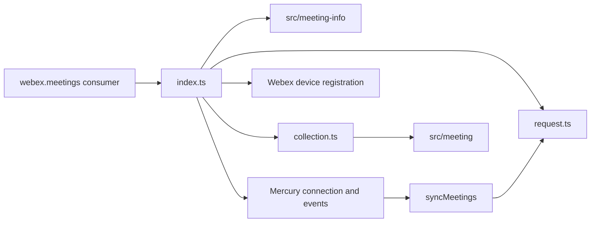
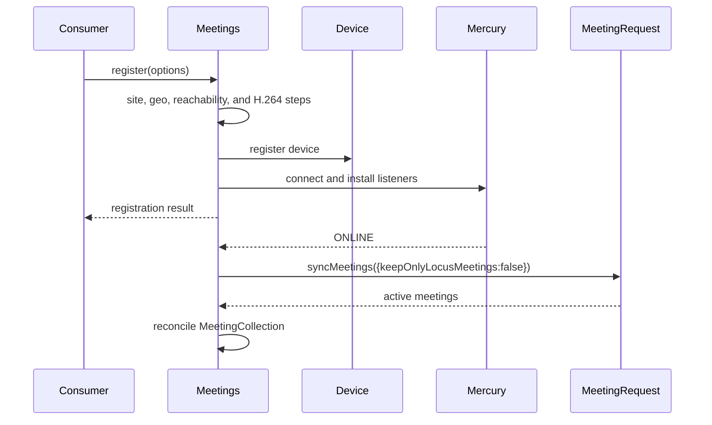
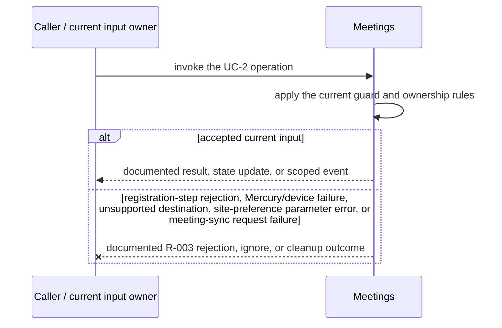
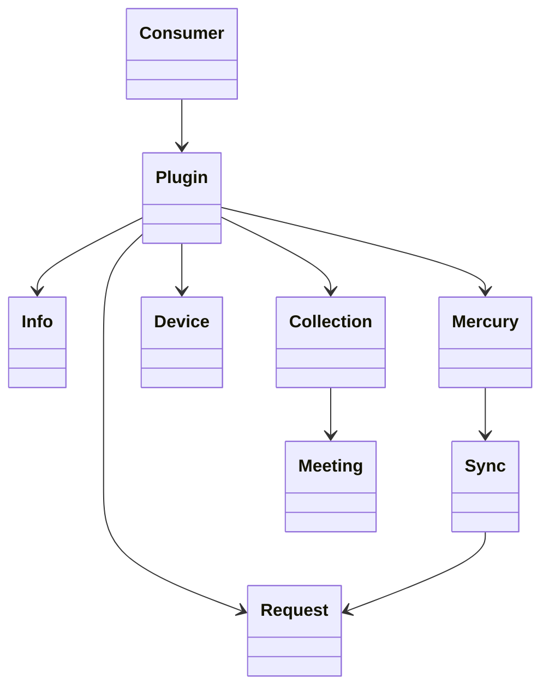
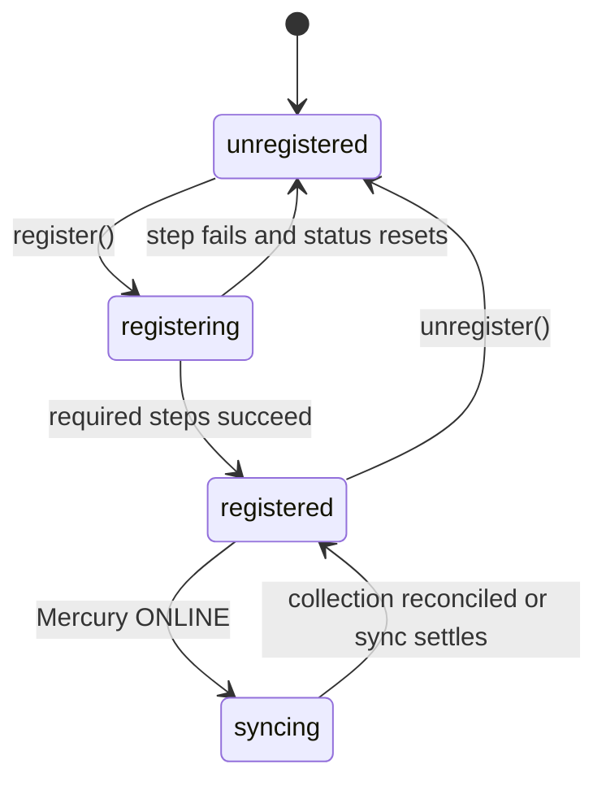

<!-- sdd-generated-metadata
doc_kind: module-spec
generated_from: module-spec@0.2.2
generator_plugin: repo-annotation@1.0.5+codex.20260818094939
generated_by: codex
approved_by: repository user
updated_at: 2026-08-21T06:10:05Z
validation_status: not-run
-->
# MEETINGS — SPEC

> Start here → root [`AGENTS.md`](../../../AGENTS.md) · router [`SPEC_INDEX.md`](../../../ai-docs/SPEC_INDEX.md) · system [`ARCHITECTURE.md`](../../../ai-docs/ARCHITECTURE.md). This is the canonical source-local spec for `src/meetings/`.

## Metadata

| Field | Value |
|---|---|
| Module id | `meetings` |
| Source path(s) | `src/meetings/` |
| Parent spec | — |
| Doc kind | Module spec |
| Coverage score | 93% assessed 2026-08-21; 13/14 mandatory fields present; all critical and Important fields present; one noncritical polish gap remains |
| Generated from | `module-spec` @ SDLC template library `0.2.2` |
| generated_by / approved_by / updated_at | codex / repository user / 2026-08-21T06:10:05Z |
| Validation status | not-run |

## Evidence Rules

Requirements cite current implementation and mirrored unit-test paths. Current code wins over retained prose when they conflict; commit and PR history are excluded by repository-owner decision. Missing test evidence is stated as a gap rather than inferred.

## Source Material Register

| Source material | Scope | Decision | Detail location or disposition |
|---|---|---|---|
| Retained package consumer documentation | overview / API / behavior / tests | used and verified; creation, registration, collection, PMR, and event behavior moved into requirements/use cases; examples remain in the retained guide |
| Current source and mirrored tests | implementation / tests | verified | requirements, flows, failures, and test strategy below |

## Overview

`src/meetings/` contains 5 direct source/reference file(s) and has 4 mirrored unit-test file(s). This spec separates its public operations, runtime data movement, component ownership, state applicability, and verification boundary.

## Purpose / Responsibility

Owns the registered plugin lifecycle, meeting discovery, registration, realtime routing, and the top-level meeting collection.

## Stack

TypeScript/JavaScript in the Node 22.14 Yarn workspace; Webex core/plugin abstractions and Mocha/Sinon/`@webex/test-helper-chai` tests. Build target: `yarn workspace @webex/plugin-meetings build:src`.

## Folder / Package Structure

```text
src/meetings/
├── collection.ts — module-owned collection
├── index.ts — module facade/controller or primary exports
├── meetings.types.ts — module type declarations
├── request.ts — HTTP request boundary
├── util.ts — normalization/helper functions
└── ai-docs/meetings-spec.md — canonical module specification
```

## Key Files (source of truth)

| File | Holds |
|---|---|
| `src/meetings/collection.ts` | module-owned collection |
| `src/meetings/index.ts` | module facade/controller or primary exports |
| `src/meetings/meetings.types.ts` | module type declarations |
| `src/meetings/request.ts` | HTTP request boundary |
| `src/meetings/util.ts` | normalization/helper functions |
| `test/unit/spec/meetings/collection.js` and 3 sibling test file(s) | mirrored characterization/unit coverage |

## Public Surface

| Contract ID | Type | Surface | Purpose | Compatibility / deprecation | Schema / detail link | Root index |
|---|---|---|---|---|---|---|
| `meetings.1` | SDK / in-process / remote | create/get meeting and collection lookup | Preserve the module responsibility through a focused operation group | Consumer-visible methods/events are semver-sensitive when reachable from package objects | `src/meetings/index.ts` | [CONTRACTS](../../../ai-docs/CONTRACTS.md) |
| `meetings.2` | SDK / in-process / remote | register/unregister device and Mercury lifecycle | Preserve the module responsibility through a focused operation group | Consumer-visible methods/events are semver-sensitive when reachable from package objects | `src/meetings/index.ts` | [CONTRACTS](../../../ai-docs/CONTRACTS.md) |
| `meetings.3` | SDK / in-process / remote | reachability, preferences, PMR, and active-meeting synchronization | Preserve the module responsibility through a focused operation group | Consumer-visible methods/events are semver-sensitive when reachable from package objects | `src/meetings/index.ts` | [CONTRACTS](../../../ai-docs/CONTRACTS.md) |

Compatibility notes:
- Prefer additive options and payload fields. Preserve method/event names, rejection semantics, and cleanup timing; route public changes through `src/index.ts` or the documented owning object.

## Requires (dependencies)

Webex core host, device and Mercury plugins, meeting-info services, Meeting construction, reachability, and metrics.

## Requirements

| ID | WHAT | WHY | Source Evidence | Test / Example Evidence | Assumptions / Gaps | Confidence |
|---|---|---|---|---|---|---|
| `MEETINGS-R-001` | create/get meeting and collection lookup. | Owns the registered plugin lifecycle, meeting discovery, registration, realtime routing, and the top-level meeting collection. | `src/meetings/index.ts` | `test/unit/spec/meetings/index.js` | none | PRESENT |
| `MEETINGS-R-002` | register/unregister device and Mercury lifecycle. | Callers need deterministic observable behavior across async Webex inputs. | `src/meetings/index.ts`, `src/meetings/request.ts` | `test/unit/spec/meetings/index.js` | additional edge cases may live in sibling tests | PRESENT |
| `MEETINGS-R-003` | Registration step failures update the tracked step status and reject; unregister removes Mercury listeners and device state, while sync request failures remain separate from register completion. | Callers must receive the actual module failure outcome without false cleanup or event guarantees. | `src/meetings/` | `test/unit/spec/meetings/index.js` | none | PRESENT |
| `MEETINGS-R-004` | `register()` executes site, geo, reachability, device-registration, Mercury-connect, and H.264 steps with separately observable status. `syncMeetings()` runs later from the Mercury `ONLINE` handler installed by `listenForEvents()`. | Registration readiness and active-meeting synchronization are distinct phases; merging them hides which prerequisite failed and misstates when collection reconciliation occurs. | `src/meetings/index.ts`, `src/meetings/meetings.types.ts` | `test/unit/spec/meetings/index.js` | none | PRESENT |
| `MEETINGS-R-005` | Mercury/Locus events resolve an existing meeting by supported keys before creating or routing a new object. | Stable meeting identity prevents duplicate Meeting objects and misrouted realtime updates. | `src/meetings/index.ts`, `src/meetings/collection.ts` | `test/unit/spec/meetings/index.js`, `test/unit/spec/meetings/collection.js` | none | PRESENT |
| `MEETINGS-R-006` | Reachability, geo hints, site preferences, PMR, and active-meeting queries delegate to their current request/controller boundaries. | Central plugin access must preserve host credentials, service discovery, and established response/error behavior. | `src/meetings/index.ts`, `src/meetings/request.ts` | `test/unit/spec/meetings/request.js` | none | PRESENT |

## Design Overview

`Meetings` is the registered plugin facade and collection owner. `register()` executes site/geo/reachability/device/Mercury/H.264 steps and then installs event listeners; synchronization is a separate `syncMeetings()` call triggered by the Mercury `ONLINE` handler.

## Data Flow



## Sequence Diagram(s)

Sequence coverage:

| Operation group | Diagram | Failure coverage |
|---|---|---|
| UC-1 — primary operation | Primary operation sequence | accepted and rejected dependency outcomes |
| UC-2 — secondary/change operation | Secondary operation and failure sequence | registration-step rejection, Mercury/device failure, unsupported destination, site-preference parameter error, or meeting-sync request failure |

### Primary operation sequence



### Secondary operation and failure sequence



## Class / Component Relationships



The arrows identify ownership and delegation inside `src/meetings/`; files that only declare types or constants are not presented as transports.

## Use Cases

- **UC-1:** Register device and Mercury through tracked registration steps without treating meeting synchronization as part of `register()` itself. Evidence: `src/meetings/`.
- **UC-2:** On Mercury `ONLINE`, fetch active meetings and reconcile the collection; create/find operations use meeting-info and collection helpers. Evidence: `src/meetings/`.

## State Model

Registration progress, meeting collection entries, sync state, and listener handles are held in memory for the plugin lifetime.

## Business Rules & Invariants

- A realtime event is routed to its corresponding meeting before a new meeting is created; unregister removes host listeners and registration state. Enforced by `src/meetings/index.ts` and supporting code under `src/meetings/`.

## Concurrency & Reactive Flow

- Async work owned by `Meetings` may complete after a newer caller or remote input. Preserve the identity, sequence, and resource-owner guards in `src/meetings/`; a late completion must not replay UC-2 for superseded state.

## State Machine



These labels summarize the concrete `registered`, registration-promise, registration-step, and Mercury-`ONLINE` transitions in `src/meetings/index.ts`.

## Error Handling & Failure Modes

| Condition | Signal | Caller recovery |
|---|---|---|
| registration-step rejection, Mercury/device failure, unsupported destination, site-preference parameter error, or meeting-sync request failure | Follow the concrete rejection, ignore, state, or cleanup behavior in the module's R-003 requirement. | Resolve the named condition; retry only when another requirement defines a bound. |
| UC-1 succeeds | Return, update, callback, or scoped event identified by the Public Surface and primary sequence. | Continue from the owning module's accepted state. |

## Pitfalls

- Registration is multi-step. Treating device registration, Mercury setup, and active-meeting sync as one opaque call loses the failing stage and can leak listeners.
- Public behavior may be reachable through a parent `Meeting`/`Meetings` object even when the source helper is not exported directly.

## Host Integration & Theming

The Webex SDK host supplies initialized request/device/Mercury/media capabilities and exposes this behavior through `webex.meetings` or its Meeting objects. The module renders no UI and has no theme contract.

## Key Design Trade-off

- Central coordination favors consistent event routing and one meeting collection at the cost of a large orchestrator; feature behavior stays in child modules.

## Test-Case Strategy (module)

Use the current mirrored suites: `test/unit/spec/meetings/collection.js`, `test/unit/spec/meetings/index.js`, `test/unit/spec/meetings/request.js`, `test/unit/spec/meetings/utils.js`. Characterize the two code-grounded use cases above and the listed failure condition; add cleanup or transition cases only for resources and state this module actually owns.

| Behavior / Requirement | Existing test evidence | Gap |
|---|---|---|
| `MEETINGS-R-001` | `test/unit/spec/meetings/index.js` | confirm the named operation against its owning sibling suite |
| `MEETINGS-R-002` | `test/unit/spec/meetings/index.js` | verify the code-grounded rejection or stale-input branch |
| `MEETINGS-R-003` | `test/unit/spec/meetings/index.js` | verify the concrete R-003 rejection, ignore, or cleanup outcome |
| `MEETINGS-R-004` | `test/unit/spec/meetings/index.js` | verify each registration-step rejection |
| `MEETINGS-R-005` | `test/unit/spec/meetings/index.js`, `test/unit/spec/meetings/collection.js` | verify alternate-key collision cases |
| `MEETINGS-R-006` | `test/unit/spec/meetings/request.js` | none |

## Traceability

- Repo architecture: [`ARCHITECTURE.md`](../../../ai-docs/ARCHITECTURE.md) · Registry: [`SPEC_INDEX.md`](../../../ai-docs/SPEC_INDEX.md)
- Coverage state and contracts baseline: `../../../.sdd/manifest.json`
