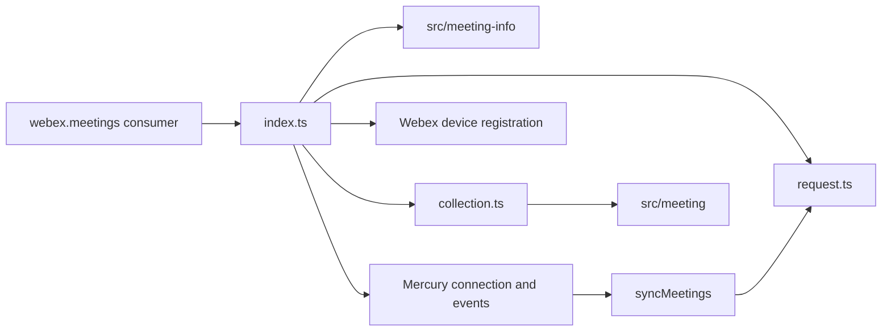
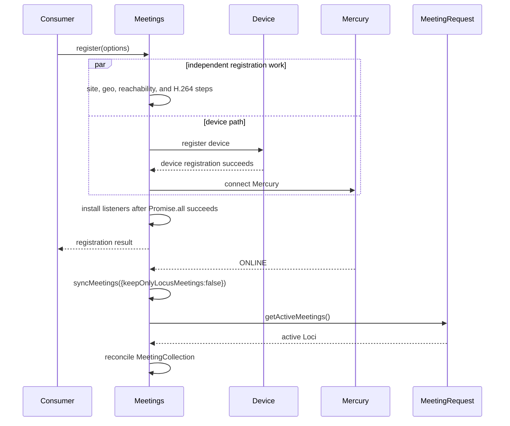
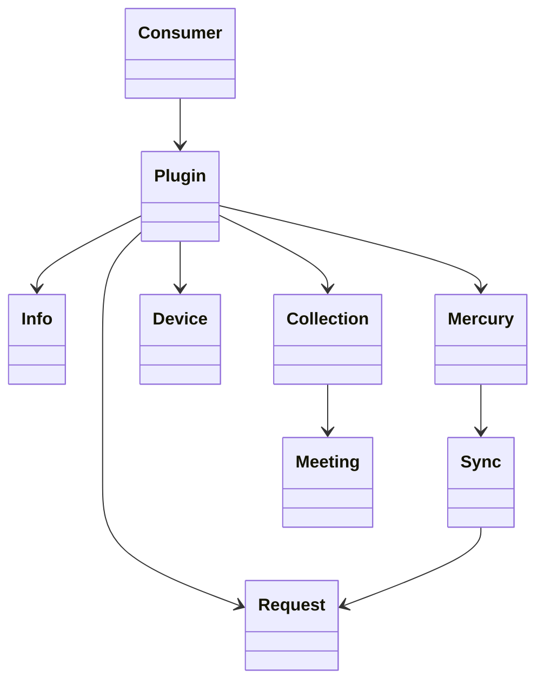

<!-- sdd-generated-metadata
doc_kind: module-spec
generated_from: module-spec@0.2.2
generator_plugin: repo-annotation@1.0.5+codex.20260818094939
generated_by: codex
approved_by: repository user
updated_at: 2026-08-22T15:21:29Z
validation_status: pass-with-warnings
-->
# MEETINGS — SPEC

> Start here → root [`AGENTS.md`](../../../AGENTS.md) · router [`SPEC_INDEX.md`](../../../ai-docs/SPEC_INDEX.md) · system [`ARCHITECTURE.md`](../../../ai-docs/ARCHITECTURE.md). This is the canonical source-local spec for `src/meetings/`.

## Metadata

| Field | Value |
|---|---|
| Module id | `meetings` |
| Source path(s) | `src/meetings/` |
| Parent spec | — |
| Doc kind | Module spec |
| Coverage score | 93% assessed 2026-08-22; 13/14 mandatory fields present; all critical and Important fields present; one noncritical polish gap remains; pending independent validation of the participant-role repair |
| Generated from | `module-spec` @ SDLC template library `0.2.2` |
| generated_by / approved_by / updated_at | codex / repository user / 2026-08-22T15:21:29Z |
| Validation status | pass-with-warnings |

## Evidence Rules

Requirements cite current implementation and mirrored unit-test paths. Current code wins over retained prose when they conflict; commit and PR history are excluded by repository-owner decision. Missing test evidence is stated as a gap rather than inferred.

## Source Material Register

| Source material | Scope | Decision | Detail location or disposition |
|---|---|---|---|
| Retained package consumer documentation | overview / API / behavior / tests | used and verified; creation, registration, collection, PMR, and event behavior moved into requirements/use cases; examples remain in the retained guide |
| Current source and mirrored tests | implementation / tests | verified | requirements, flows, failures, and test strategy below |

## Overview

`src/meetings/` contains 5 direct source/reference file(s) and has 4 mirrored unit-test file(s). This spec separates its public operations, runtime data movement, component ownership, state applicability, and verification boundary.

## Purpose / Responsibility

Owns the registered plugin lifecycle, meeting discovery, registration, realtime routing, and the top-level meeting collection.

## Stack

TypeScript/JavaScript in the Node 22.14 Yarn workspace; Webex core/plugin abstractions and Mocha/Sinon/`@webex/test-helper-chai` tests. Build target: `yarn workspace @webex/plugin-meetings build:src`.

## Folder / Package Structure

```text
src/meetings/
├── collection.ts — module-owned collection
├── index.ts — module facade/controller or primary exports
├── meetings.types.ts — module type declarations
├── request.ts — HTTP request boundary
├── util.ts — normalization/helper functions
└── ai-docs/meetings-spec.md — canonical module specification
```

## Key Files (source of truth)

| File | Holds |
|---|---|
| `src/meetings/collection.ts` | module-owned collection |
| `src/meetings/index.ts` | module facade/controller or primary exports |
| `src/meetings/meetings.types.ts` | module type declarations |
| `src/meetings/request.ts` | HTTP request boundary |
| `src/meetings/util.ts` | normalization/helper functions |
| `test/unit/spec/meetings/collection.js` and 3 sibling test file(s) | mirrored characterization/unit coverage |

## Public Surface

| Contract ID | Type | Surface | Purpose | Compatibility / deprecation | Schema / detail link | Root index |
|---|---|---|---|---|---|---|
| `meetings.1` | SDK collection | `MeetingCollection.set()`, `getByKey()`, `getActiveBreakoutLocus()`, and `getActiveWebrtcMeeting()` | Store Meeting models and resolve current normal/breakout active meetings. | Preserve collection key aliases and active-meeting selection. | `src/meetings/collection.ts` | [CONTRACTS](../../../ai-docs/CONTRACTS.md) |
| `meetings.2` | SDK / registration | `executeRegistrationStep()`, `register()`, and `unregister()` | Coordinate device registration and Meetings-owned Mercury/Locus/ROAP listener lifecycle. | Preserve tracked step results and the exact listeners each lifecycle method adds/removes. | `src/meetings/index.ts` | [CONTRACTS](../../../ai-docs/CONTRACTS.md) |
| `meetings.3` | SDK / diagnostics/media effects | `uploadLogs()`, `getReachability()`, `startReachability()`, `getGeoHint()`, `createNoiseReductionEffect()`, and `createVirtualBackgroundEffect()` | Expose logs, reachability/geo diagnostics, and configured media-effect creation. | `startReachability()` returns the gather promise directly. Only the separate registration callback absorbs its rejection. Preserve that boundary, other request outcomes, and effect construction inputs. | `src/meetings/index.ts` | [CONTRACTS](../../../ai-docs/CONTRACTS.md) |
| `meetings.4` | SDK / preferences | `fetchUserPreferredWebexSite()`, `getPersonalMeetingRoom()`, `fetchSitePreferencesMeViaSite()`, and `getBasicMeetingInformation()` | Fetch account/site preferences, PMR, and lightweight meeting information. | Preserve parallel independent request behavior; do not claim a strict ordering across site/geo/reachability/H264 setup. | `src/meetings/index.ts` | [CONTRACTS](../../../ai-docs/CONTRACTS.md) |
| `meetings.5` | SDK / static links | `fetchStaticMeetingLink()`, `enableStaticMeetingLink()`, and `disableStaticMeetingLink()` | Delegate static meeting-link lookup and mutation to meeting-info V2. | Preserve typed meeting-info errors and direct service outcomes. | `src/meetings/index.ts`, `src/meeting-info/meeting-info-v2.ts` | [CONTRACTS](../../../ai-docs/CONTRACTS.md) |
| `meetings.6` | SDK / meeting lookup | `create()`, `getMeetingByType()`, `getAllMeetings()`, and `getActiveWebrtcMeeting()` | Create/find/list Meeting models from destination information and collection keys. | Preserve model reuse/collection identity and lookup-type behavior. | `src/meetings/index.ts`, `src/meetings/collection.ts` | [CONTRACTS](../../../ai-docs/CONTRACTS.md) |
| `meetings.7` | SDK / synchronization | `syncMeetings()`, `sortLocusArrayToUpdate()`, `checkHandleBreakoutLocus()`, and `getCorrespondingMeetingByLocus()` | Reconcile active Loci into the collection, including breakout/main relationships. | All four methods are defined on `Meetings` in `index.ts`; Online Mercury handling invokes this sync, while `register()` itself does not. | `src/meetings/index.ts` | [CONTRACTS](../../../ai-docs/CONTRACTS.md) |
| `meetings.8` | request/types | `MeetingRequest.getActiveMeetings()`, `fetchGeoHint()`, `getMeetingPreferences()`, `fetchSitePreferencesMeViaSite()`, and `determineRedirections()` plus `LocusEvent`, `BasicMeetingInformation`, `INoiseReductionEffect`, `IVirtualBackgroundEffect`, `MEETING_KEY`, `MeetingRegistrationStatus`, `SitePreferenceSelectOption`, `FetchSitePreferencesMeViaSiteOptions`, `DEFAULT_SITE_PREFERENCE_SELECT_OPTIONS`, and `SitePreferencesResponse` | Provide direct service requests and the exact collection/configuration vocabulary consumed by Meetings. | Preserve request result shapes, enum/raw option values, and default site-selection options. | `src/meetings/request.ts`, `src/meetings/meetings.types.ts`, `src/meetings/index.ts` | [CONTRACTS](../../../ai-docs/CONTRACTS.md) |
| `meetings.9` | SDK / diagnostics | `getLogger()` | Return the logger used by Meetings and child meeting operations. | Preserve logger identity and existing call sites. | `src/meetings/index.ts` | [CONTRACTS](../../../ai-docs/CONTRACTS.md) |

### Emitted events

Current source emits or forwards these observable literals for this operation boundary. Preserve literal values, scope, payload shape, and emission timing; a constant name alone is not a substitute for the consumer-visible value.

| Event literal | Constant / expression | Emission evidence |
|---|---|---|
| `meeting:added` | `EVENT_TRIGGERS.MEETING_ADDED` | `src/meetings/index.ts` |
| `meeting:logUpload:failure` | `EVENT_TRIGGERS.MEETING_LOG_UPLOAD_FAILURE` | `src/meetings/index.ts` |
| `meeting:logUpload:success` | `EVENT_TRIGGERS.MEETING_LOG_UPLOAD_SUCCESS` | `src/meetings/index.ts` |
| `meeting:removed` | `EVENT_TRIGGERS.MEETING_REMOVED` | `src/meetings/index.ts` |
| `meetings:ready` | `EVENT_TRIGGERS.MEETINGS_READY` | `src/meetings/index.ts` |
| `meetings:registered` | `EVENT_TRIGGERS.MEETINGS_REGISTERED` | `src/meetings/index.ts` |
| `meetings:unregistered` | `EVENT_TRIGGERS.MEETINGS_UNREGISTERED` | `src/meetings/index.ts` |

Compatibility notes:
- Prefer additive options and payload fields. Preserve method/event names, rejection semantics, and cleanup timing; route public changes through `src/index.ts` or the documented owning object.

## Requires (dependencies)

Webex core host, device and Mercury plugins, meeting-info services, Meeting construction, reachability, and metrics.

## Requirements

| ID | WHAT | WHY | Source Evidence | Test / Example Evidence | Assumptions / Gaps | Confidence |
|---|---|---|---|---|---|---|
| `MEETINGS-R-001` | create/get meeting and collection lookup. | Owns the registered plugin lifecycle, meeting discovery, registration, realtime routing, and the top-level meeting collection. | `src/meetings/index.ts` | `test/unit/spec/meetings/index.js` | none | PRESENT |
| `MEETINGS-R-002` | register/unregister device and Mercury lifecycle. | Registration owns device/listener readiness; active-meeting synchronization is a separate online-event flow. | `src/meetings/index.ts`, `src/meetings/request.ts` | `test/unit/spec/meetings/index.js` | unregister does not remove the OFFLINE listener; retain as a targeted teardown gap | PRESENT |
| `MEETINGS-R-003` | `executeRegistrationStep()` marks a step `true` whenever its supplied promise resolves and rethrows a rejection without resetting other flags. `fetchUserPreferredWebexSite()` catches its own failures and resolves, while the `startReachability` registration callback catches that gather rejection and resolves; those two steps are therefore marked successful even when their underlying work failed. `unregister()` removes Locus, ROAP, and `ONLINE` Mercury listeners plus device state, but leaves the `OFFLINE` listener installed. | Registration status records wrapper settlement, not necessarily underlying site/reachability success; other rejected steps preserve partial progress until the next `register()` reset, and the residual `OFFLINE` listener must stay visible as a teardown gap. | `src/meetings/index.ts` | `test/unit/spec/meetings/index.js` | characterize absorbed site/reachability failures, partial status after a non-absorbed rejection, and the surviving `OFFLINE` callback | PRESENT |
| `MEETINGS-R-004` | `register()` starts site, geo, reachability, device-registration, and H.264 work together through `Promise.all`; Mercury connect is chained after device registration. Each wrapper-resolved step updates its own status, including the failure-absorbing site and reachability wrappers. `syncMeetings()` runs later from the Mercury `ONLINE` handler installed by `listenForEvents()`. | Registration readiness and active-meeting synchronization are distinct phases, and preserving wrapper-level settlement and actual concurrency prevents callers from depending on a nonexistent success definition or serial order. | `src/meetings/index.ts`, `src/meetings/meetings.types.ts` | `test/unit/spec/meetings/index.js` | none | PRESENT |
| `MEETINGS-R-005` | Mercury/Locus events resolve an existing meeting by supported keys before creating or routing a new object. | Stable meeting identity prevents duplicate Meeting objects and misrouted realtime updates. | `src/meetings/index.ts`, `src/meetings/collection.ts` | `test/unit/spec/meetings/index.js`, `test/unit/spec/meetings/collection.js` | none | PRESENT |
| `MEETINGS-R-006` | Reachability, geo hints, site preferences, PMR, and active-meeting queries delegate to their current request/controller boundaries. | Central plugin access must preserve host credentials, service discovery, and established response/error behavior. | `src/meetings/index.ts`, `src/meetings/request.ts` | `test/unit/spec/meetings/request.js` | none | PRESENT |

## Design Overview

`Meetings` is the registered plugin facade and collection owner. `register()` starts site, geo, reachability, device-registration, and H.264 steps concurrently in `Promise.all`; Mercury connection follows successful device registration, and listeners are installed only after the aggregate succeeds. Site-preference fetching absorbs its own failures, and the registration callback absorbs a reachability rejection, so both wrappers can resolve and be marked successful without completing their underlying work. Synchronization is a separate `syncMeetings()` call triggered by the Mercury `ONLINE` handler.

## Data Flow



## Sequence Diagram(s)

Sequence coverage:

| Operation group | Diagram | Failure coverage |
|---|---|---|
| UC-1…UC-5 — Meetings registration and synchronization operation groups | Meetings registration and synchronization primary sequence | registration-step failure, independent setup requests, online sync rejection, and listener teardown |
| UC-1…UC-5 — Meetings registration and synchronization alternate/failure paths | Meetings registration and synchronization alternate/failure sequence | registration-step rejection, Mercury/device failure, unsupported destination, site-preference parameter error, or meeting-sync request failure |

### Meetings registration and synchronization primary sequence



### Meetings registration and synchronization alternate/failure sequence

```mermaid
sequenceDiagram
  participant C as SDK consumer
  participant M as Meetings
  participant W as Webex registration dependencies
  C->>M: register or unregister
  alt registration
    M->>W: run the configured steps; site/geo/reachability/H.264 setup may run in parallel
    W-->>M: step result, absorbed site/reachability failure, or propagated rejection
    M-->>C: registration result; absorbed steps are marked true and completed flags remain set on propagated rejection
  else unregistration
    M->>W: remove Mercury/device registration state
    W-->>M: cleanup result
    M-->>C: unregistration result
  end
```

## Class / Component Relationships



The arrows identify ownership and delegation inside `src/meetings/`; files that only declare types or constants are not presented as transports.

## Use Cases

- **UC-1:** Register device and Meetings-owned listeners through tracked registration steps without treating active-meeting synchronization as part of `register()` itself. Evidence: `src/meetings/index.ts`.
- **UC-2:** On Mercury `ONLINE`, `Meetings.syncMeetings()` fetches active Loci through `MeetingRequest.getActiveMeetings()` and reconciles corresponding main/breakout Meeting models into the collection. Evidence: `src/meetings/index.ts`, `src/meetings/request.ts`.
- **UC-3:** Create or retrieve a Meeting by destination/type while reusing collection identity when a matching model exists. Evidence: `src/meetings/index.ts`, `src/meetings/collection.ts`.
- **UC-4:** Start/read reachability, fetch geo/site preferences, PMR, or basic meeting information through their independent request paths. Evidence: `src/meetings/index.ts`, `src/meetings/request.ts`.
- **UC-5:** Fetch, enable, or disable a static meeting link through the meeting-info V2 facade and preserve its typed outcomes. Evidence: `src/meetings/index.ts`, `src/meeting-info/meeting-info-v2.ts`.

## State Model

Registration progress, meeting collection entries, sync state, and listener handles are held in memory for the plugin lifetime.

## Business Rules & Invariants

- A realtime event is routed to its corresponding meeting before a new meeting is created; unregister removes Locus/ROAP/`ONLINE` listeners and registration state but currently leaves the `OFFLINE` listener installed. Enforced by `src/meetings/index.ts`.

## Concurrency & Reactive Flow

- Registration steps run through one `Promise.all` aggregate, with Mercury connection chained behind device registration. `executeRegistrationStep()` sets a flag after its callback resolves. Site-preference fetching and the registration reachability callback absorb their own failures and therefore still set their flags; a rejection from another step propagates without clearing flags already set. Unregistration removes the Mercury/device registration owned by the plugin; individual meeting synchronization requests remain separate returned promises rather than silently changing registration success.

## State Machine

```mermaid
stateDiagram-v2
  [*] --> unregistered
  unregistered --> registering: register()
  registering --> registered: required steps succeed
  registering --> unregistered: aggregate rejects; completed step flags remain until next register()
  registered --> syncing: Mercury ONLINE
  syncing --> registered: collection reconciled or sync settles
  registered --> unregistered: unregister()
```



These labels summarize the concrete `registered`, registration-promise, registration-step, and Mercury-`ONLINE` transitions in `src/meetings/index.ts`.

## Error Handling & Failure Modes

| Condition | Signal | Caller recovery |
|---|---|---|
| Site-preference fetching or the registration reachability call fails | The inner catch logs/absorbs the failure, `executeRegistrationStep()` observes resolution, and `fetchWebexSite` or `startReachability` is marked `true`; that failure alone does not reject registration. | Treat those flags as wrapper-completion indicators and inspect diagnostics/current data before assuming the underlying work succeeded. |
| Another registration step or Mercury/device registration rejects | The returned registration promise rejects. The failing step is not marked successful, and flags already set by concurrently completed steps are not reset until the next `register()` initializes registration status. | Correct the failing dependency and treat the next registration call as the status reset boundary. |
| `fetchSitePreferencesMeViaSite()` has neither `options.siteUrl` nor `preferredWebexSite` | `MeetingRequest.fetchSitePreferencesMeViaSite()` throws `ParameterError` synchronously before returning a promise; the non-`async` facade returns that direct call, so `.catch()` on a nonexistent result cannot observe the error. | Supply either site URL and wrap the call boundary in synchronous error handling when inputs may be absent. |
| Another destination or preference request rejects | Its returned request promise preserves the implemented rejection. | Supply supported input or handle the returned rejection for that specific operation. |
| Meeting synchronization request rejects | That sync request rejects independently of plugin registration state. | Handle or repeat synchronization under the owning meeting workflow. |

## Pitfalls

- Registration is multi-step. Treating device registration, Mercury setup, and active-meeting sync as one opaque call loses the failing stage and can leak listeners.
- Public behavior may be reachable through a parent `Meeting`/`Meetings` object even when the source helper is not exported directly.

## Host Integration & Theming

The Webex SDK host supplies initialized request/device/Mercury/media capabilities and exposes this behavior through `webex.meetings` or its Meeting objects. The module renders no UI and has no theme contract.

## Key Design Trade-off

- Central coordination favors consistent event routing and one meeting collection at the cost of a large orchestrator; feature behavior stays in child modules.

## Test-Case Strategy (module)

Use the current mirrored suites: `test/unit/spec/meetings/collection.js`, `test/unit/spec/meetings/index.js`, `test/unit/spec/meetings/request.js`, `test/unit/spec/meetings/utils.js`. Characterize the meetings-specific use cases above and each listed failure condition; add cleanup or transition cases only for resources and state this module actually owns.

| Behavior / Requirement | Existing test evidence | Gap |
|---|---|---|
| `MEETINGS-R-001` | `test/unit/spec/meetings/index.js` | cover registration, online sync, create/lookup, preferences, reachability, and static-link groups |
| `MEETINGS-R-002` | `test/unit/spec/meetings/index.js` | unregister does not remove the OFFLINE listener; retain as a targeted teardown gap |
| `MEETINGS-R-003` | `test/unit/spec/meetings/index.js` | assert absorbed site/reachability failures mark their wrapper steps true, plus exact listener removal and the surviving `OFFLINE` listener |
| `MEETINGS-R-004` | `test/unit/spec/meetings/index.js` | verify `Promise.all` concurrency, device-before-Mercury ordering, wrapper-settlement flags, and non-absorbed rejection without a failure reset |
| `MEETINGS-R-005` | `test/unit/spec/meetings/index.js`, `test/unit/spec/meetings/collection.js` | verify alternate-key collision cases |
| `MEETINGS-R-006` | `test/unit/spec/meetings/request.js` | none |

## Traceability

- Repo architecture: [`ARCHITECTURE.md`](../../../ai-docs/ARCHITECTURE.md) · Registry: [`SPEC_INDEX.md`](../../../ai-docs/SPEC_INDEX.md)
- Coverage state and contracts baseline: `../../../.sdd/manifest.json`
