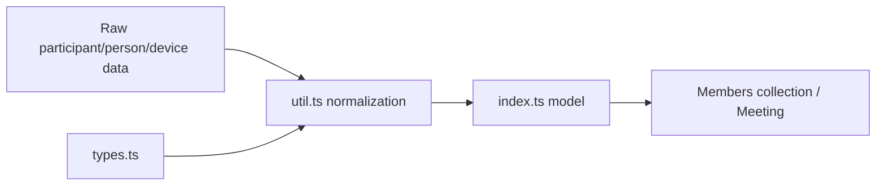
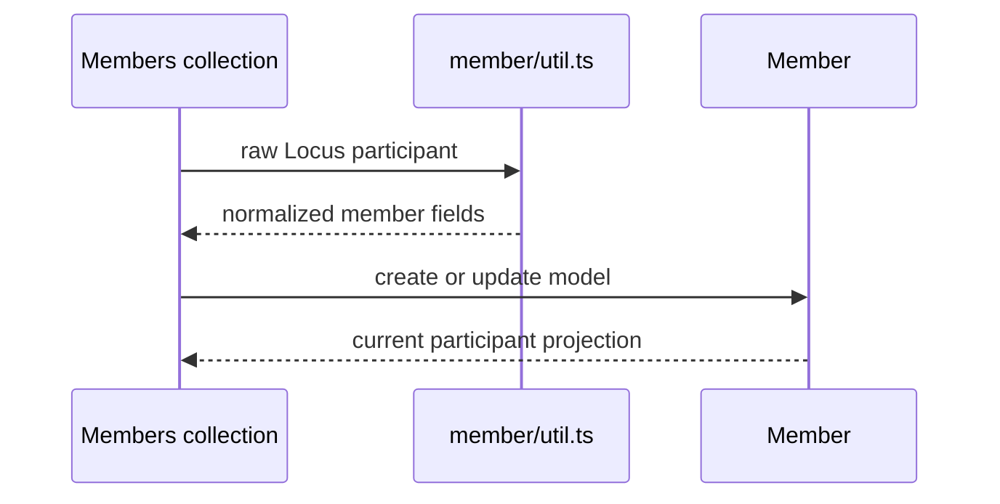
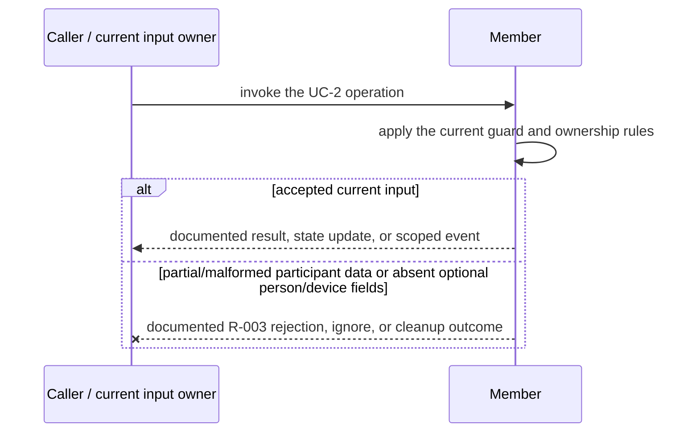
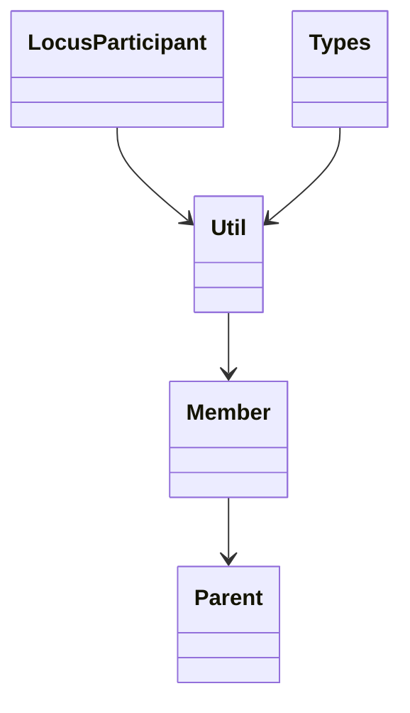

<!-- sdd-generated-metadata
doc_kind: module-spec
generated_from: module-spec@0.2.2
generator_plugin: repo-annotation@1.0.5+codex.20260818094939
generated_by: codex
approved_by: repository user
updated_at: 2026-08-21T06:10:05Z
validation_status: not-run
-->
# MEMBER — SPEC

> Start here → root [`AGENTS.md`](../../../AGENTS.md) · router [`SPEC_INDEX.md`](../../../ai-docs/SPEC_INDEX.md) · system [`ARCHITECTURE.md`](../../../ai-docs/ARCHITECTURE.md). This is the canonical source-local spec for `src/member/`.

## Metadata

| Field | Value |
|---|---|
| Module id | `member` |
| Source path(s) | `src/member/` |
| Parent spec | — |
| Doc kind | Module spec |
| Coverage score | 86% assessed 2026-08-21; 12/14 mandatory fields present; all critical fields present; one Important outcome-detail gap and one polish gap remain |
| Generated from | `module-spec` @ SDLC template library `0.2.2` |
| generated_by / approved_by / updated_at | codex / repository user / 2026-08-21T06:10:05Z |
| Validation status | not-run |

## Evidence Rules

Requirements cite current implementation and mirrored unit-test paths. Current code wins over retained prose when they conflict; commit and PR history are excluded by repository-owner decision. Missing test evidence is stated as a gap rather than inferred.

## Source Material Register

| Source material | Scope | Decision | Detail location or disposition |
|---|---|---|---|
| Retained package consumer documentation | overview / API / behavior / tests | used and verified; participant property semantics and the participant-email privacy change were placed in public surface, invariants, and security |
| Current source and mirrored tests | implementation / tests | verified | requirements, flows, failures, and test strategy below |

## Overview

`src/member/` contains 3 direct source/reference file(s) and has 2 mirrored unit-test file(s). This spec separates its public operations, runtime data movement, component ownership, state applicability, and verification boundary.

## Purpose / Responsibility

Builds and updates the normalized client projection for one Locus participant.

## Stack

TypeScript/JavaScript in the Node 22.14 Yarn workspace; Webex core/plugin abstractions and Mocha/Sinon/`@webex/test-helper-chai` tests. Build target: `yarn workspace @webex/plugin-meetings build:src`.

## Folder / Package Structure

```text
src/member/
├── index.ts — module facade/controller or primary exports
├── types.ts — module type declarations
├── util.ts — normalization/helper functions
└── ai-docs/member-spec.md — canonical module specification
```

## Key Files (source of truth)

| File | Holds |
|---|---|
| `src/member/index.ts` | module facade/controller or primary exports |
| `src/member/types.ts` | module type declarations |
| `src/member/util.ts` | normalization/helper functions |
| `test/unit/spec/member/index.js` and 1 sibling test file(s) | mirrored characterization/unit coverage |

## Public Surface

| Contract ID | Type | Surface | Purpose | Compatibility / deprecation | Schema / detail link | Root index |
|---|---|---|---|---|---|---|
| `member.1` | SDK / in-process | construct a member from participant data | Preserve the module responsibility through a focused operation group | Consumer-visible methods/events are semver-sensitive when reachable from package objects | `src/member/index.ts` | [CONTRACTS](../../../ai-docs/CONTRACTS.md) |
| `member.2` | SDK / in-process | update identity, roles, controls, status, and media properties | Preserve the module responsibility through a focused operation group | Consumer-visible methods/events are semver-sensitive when reachable from package objects | `src/member/index.ts` | [CONTRACTS](../../../ai-docs/CONTRACTS.md) |
| `member.3` | SDK / in-process | expose normalized participant fields to roster consumers | Preserve the module responsibility through a focused operation group | Consumer-visible methods/events are semver-sensitive when reachable from package objects | `src/member/index.ts` | [CONTRACTS](../../../ai-docs/CONTRACTS.md) |

Compatibility notes:
- Prefer additive options and payload fields. Preserve method/event names, rejection semantics, and cleanup timing; route public changes through `src/index.ts` or the documented owning object.

## Requires (dependencies)

Locus participant payloads, member normalization utilities, and shared constants.

## Requirements

| ID | WHAT | WHY | Source Evidence | Test / Example Evidence | Assumptions / Gaps | Confidence |
|---|---|---|---|---|---|---|
| `MEMBER-R-001` | construct a member from participant data. | Builds and updates the normalized client projection for one Locus participant. | `src/member/index.ts` | `test/unit/spec/member/index.js` | none | PRESENT |
| `MEMBER-R-002` | update identity, roles, controls, status, and media properties. | Callers need deterministic observable behavior across async Webex inputs. | `src/member/index.ts`, `src/member/util.ts` | `test/unit/spec/member/index.js` | additional edge cases may live in sibling tests | PRESENT |
| `MEMBER-R-003` | Missing or partial fields follow the existing normalizer defaults; the module has no asynchronous resource, listener, or timer to release. | Callers must receive the actual module failure outcome without false cleanup or event guarantees. | `src/member/` | `test/unit/spec/member/index.js` | none | PRESENT |

## Design Overview

`Member` is a local participant model. `util.ts` synchronously normalizes Locus participant/person/device fields into the model and `types.ts` defines shapes; the module performs no request or event transport.

## Data Flow



## Sequence Diagram(s)

Sequence coverage:

| Operation group | Diagram | Failure coverage |
|---|---|---|
| UC-1 — primary operation | Primary operation sequence | accepted and rejected dependency outcomes |
| UC-2 — secondary/change operation | Secondary operation and failure sequence | partial/malformed participant data or absent optional person/device fields |

### Primary operation sequence



### Secondary operation and failure sequence



## Class / Component Relationships



The arrows identify ownership and delegation inside `src/member/`; files that only declare types or constants are not presented as transports.

## Use Cases

- **UC-1:** Normalize participant, person, device, controls, and status data into one local member projection. Evidence: `src/member/`.
- **UC-2:** Update an existing Member without performing I/O; roster transport and events remain owned by `src/members/`. Evidence: `src/member/`.

## State Model

One in-memory participant projection is updated in place as Locus/member data changes.

## Business Rules & Invariants

- Participant identity and role/media/control fields derive from the newest supported payload; removed PII such as participant email is not reintroduced. Enforced by `src/member/index.ts` and supporting code under `src/member/`.

## Pitfalls

- A participant can expose identity, person, device, and media fragments at different times; treat missing optional fragments as incomplete state, not deletion.
- Public behavior may be reachable through a parent `Meeting`/`Meetings` object even when the source helper is not exported directly.

## Test-Case Strategy (module)

Use the current mirrored suites: `test/unit/spec/member/index.js`, `test/unit/spec/member/util.js`. Characterize the two code-grounded use cases above and the listed failure condition; add cleanup or transition cases only for resources and state this module actually owns.

| Behavior / Requirement | Existing test evidence | Gap |
|---|---|---|
| `MEMBER-R-001` | `test/unit/spec/member/index.js` | confirm the named operation against its owning sibling suite |
| `MEMBER-R-002` | `test/unit/spec/member/index.js` | verify the code-grounded rejection or stale-input branch |
| `MEMBER-R-003` | `test/unit/spec/member/index.js` | verify the concrete R-003 rejection, ignore, or cleanup outcome |

## Traceability

- Repo architecture: [`ARCHITECTURE.md`](../../../ai-docs/ARCHITECTURE.md) · Registry: [`SPEC_INDEX.md`](../../../ai-docs/SPEC_INDEX.md)
- Coverage state and contracts baseline: `../../../.sdd/manifest.json`
