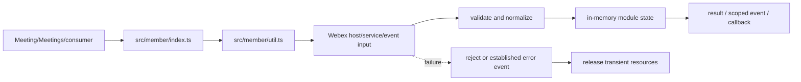
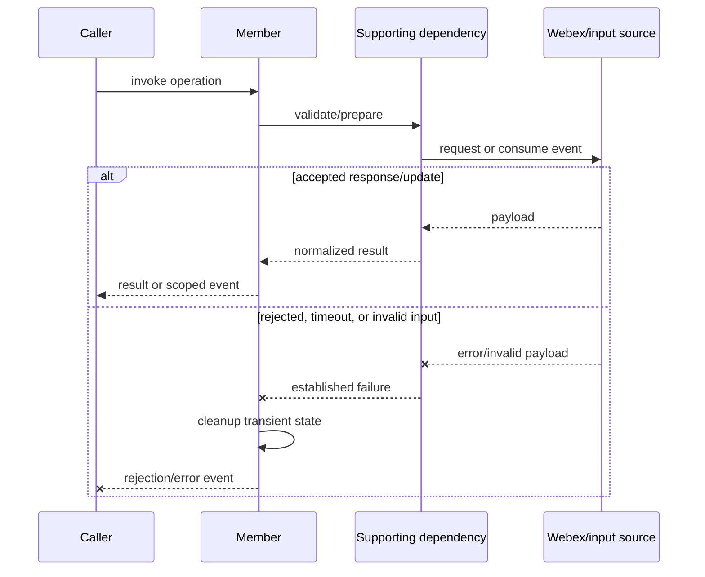
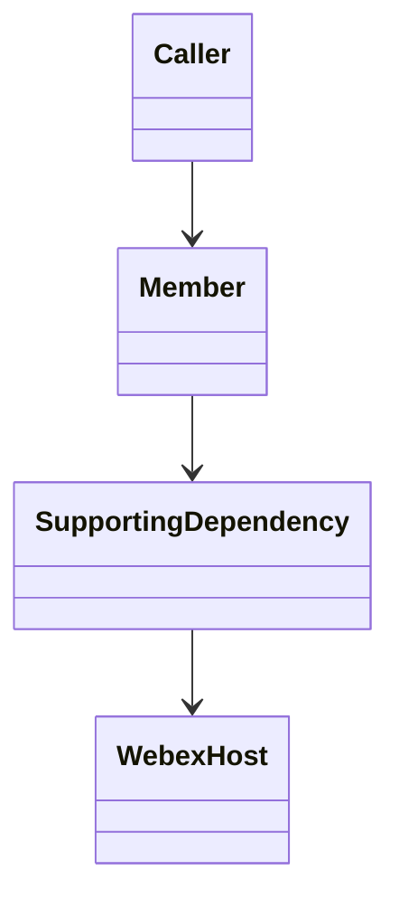

<!-- sdd-generated-metadata
doc_kind: module-spec
generated_from: module-spec@0.2.2
generator_plugin: repo-annotation@1.0.5+codex.20260818094939
generated_by: codex
approved_by: repository user
updated_at: 2026-08-18T15:33:39Z
validation_status: not-run
-->
# MEMBER — SPEC

> Start here → root [`AGENTS.md`](../../../AGENTS.md) · router [`SPEC_INDEX.md`](../../../ai-docs/SPEC_INDEX.md) · system [`ARCHITECTURE.md`](../../../ai-docs/ARCHITECTURE.md). This is the canonical source-local spec for `src/member/`.

## Metadata

| Field | Value |
|---|---|
| Module id | `member` |
| Source path(s) | `src/member/` |
| Parent spec | — |
| Doc kind | Module spec |
| Coverage score | 86% assessed 2026-08-18; 12/14 mandatory fields present; all critical fields present, two noncritical detail gaps remain |
| Generated from | `module-spec` @ SDLC template library `0.2.2` |
| generated_by / approved_by / updated_at | codex / repository user / 2026-08-18T15:33:39Z |
| Validation status | not-run |

## Evidence Rules

Requirements cite current implementation and mirrored unit-test paths. Current code wins over retained prose when they conflict; commit and PR history are excluded by repository-owner decision. Missing test evidence is stated as a gap rather than inferred.

## Source Material Register

| Source material | Scope | Decision | Detail location or disposition |
|---|---|---|---|
| Retained package consumer documentation | overview / API / behavior / tests | used and verified; participant property semantics and the participant-email privacy change were placed in public surface, invariants, and security |
| Current source and mirrored tests | implementation / tests | verified | requirements, flows, failures, and test strategy below |

## Overview

For orientation, start at `src/member/index.ts`; supporting files under `src/member/` separate request, parsing, collection, type, or utility concerns from parent orchestration. The module is composed by `Meeting`, `Meetings`, or the package entry as applicable. Remote Webex services/Locus remain authoritative, and all local state is scoped to the SDK, plugin, meeting, or operation lifetime.

## Purpose / Responsibility

Builds and updates the normalized client projection for one Locus participant.

## Stack

TypeScript/JavaScript in the Node 22.14 Yarn workspace; Webex core/plugin abstractions and Mocha/Sinon/`@webex/test-helper-chai` tests. Build target: `yarn workspace @webex/plugin-meetings build:src`.

## Folder / Package Structure

```text
src/member/
├── index.ts — primary behavior/entry point
├── util.ts — request, parser, utility, or supporting behavior
└── ai-docs/member-spec.md — canonical module specification
```

## Key Files (source of truth)

| File | Holds |
|---|---|
| `src/member/index.ts` | Primary lifecycle and public/internal surface |
| `src/member/util.ts` | Supporting transport, parser, or state behavior |
| `test/unit/spec/member/index.js` | Mirrored behavioral tests |
| `src/constants.ts` | Shared meeting/event/wire constants where consumed |

## Public Surface

| Contract ID | Type | Surface | Purpose | Compatibility / deprecation | Schema / detail link | Root index |
|---|---|---|---|---|---|---|
| `member.1` | SDK / in-process | construct a member from participant data | Preserve the module responsibility through a focused operation group | Consumer-visible methods/events are semver-sensitive when reachable from package objects | `src/member/index.ts` | [CONTRACTS](../../../ai-docs/CONTRACTS.md) |
| `member.2` | SDK / in-process | update identity, roles, controls, status, and media properties | Preserve the module responsibility through a focused operation group | Consumer-visible methods/events are semver-sensitive when reachable from package objects | `src/member/index.ts` | [CONTRACTS](../../../ai-docs/CONTRACTS.md) |
| `member.3` | SDK / in-process | expose normalized participant fields to roster consumers | Preserve the module responsibility through a focused operation group | Consumer-visible methods/events are semver-sensitive when reachable from package objects | `src/member/index.ts` | [CONTRACTS](../../../ai-docs/CONTRACTS.md) |

Compatibility notes:
- Prefer additive options and payload fields. Preserve method/event names, rejection semantics, and cleanup timing; route public changes through `src/index.ts` or the documented owning object.

## Requires (dependencies)

Locus participant payloads, member normalization utilities, and shared constants.

## Requirements

| ID | WHAT | WHY | Source Evidence | Test / Example Evidence | Assumptions / Gaps | Confidence |
|---|---|---|---|---|---|---|
| `MEMBER-R-001` | construct a member from participant data. | Builds and updates the normalized client projection for one Locus participant. | `src/member/index.ts` | `test/unit/spec/member/index.js` | none | PRESENT |
| `MEMBER-R-002` | update identity, roles, controls, status, and media properties. | Callers need deterministic observable behavior across async Webex inputs. | `src/member/index.ts`, `src/member/util.ts` | `test/unit/spec/member/index.js` | additional edge cases may live in sibling tests | PRESENT |
| `MEMBER-R-003` | Failures reject/emit the established signal and release module-owned listeners, timers, or transient objects. | Hidden failure or leaked state causes later meeting operations to behave incorrectly. | `src/member/index.ts` | `test/unit/spec/member/index.js` | verify sibling test files for operation-specific cleanup | PRESENT |

## Design Overview

The primary entry point coordinates domain state and delegates transport/parsing to supporting files so those boundaries remain testable. Inputs are normalized before client state or events change. Async results preserve the established error signal, while teardown owns every listener, timer, or transient object allocated by this module.

## Data Flow



## Sequence Diagram(s)

Sequence coverage:

The operation groups below share the same caller → module → supporting dependency → Webex/input ordering and the same rejection/cleanup contract, so one combined diagram covers their common sequence; operation-specific state and guards are stated in the requirements and use cases.

| Operation group | Diagram | Failure / recovery coverage |
|---|---|---|
| construct a member from participant data | Primary operation | validation/service rejection and cleanup branch |
| update identity, roles, controls, status, and media properties | Async update | stale/error input is rejected or ignored according to current code |



## Class / Component Relationships



The primary module object owns its client state and composes/invokes supporting request, parser, collection, or utility code. The Webex host/service remains the authority for remote state.

## Use Cases

- **UC-1 Primary operation:** a consumer or parent module invokes construct a member from participant data; the module validates/delegates, normalizes the result, updates state where applicable, and returns or emits the established outcome. Evidence: `src/member/index.ts`, `test/unit/spec/member/index.js`.
- **UC-2 Async/change operation:** the parent or remote input triggers update identity, roles, controls, status, and media properties; the module reconciles it with current state and exposes one scoped result. Evidence: `src/member/index.ts`, `src/member/util.ts`.

## State Model

One in-memory participant projection is updated in place as Locus/member data changes.

## Business Rules & Invariants

- Participant identity and role/media/control fields derive from the newest supported payload; removed PII such as participant email is not reintroduced. Enforced by `src/member/index.ts` and supporting code under `src/member/`.

## Pitfalls

- A participant can expose identity, person, device, and media fragments at different times; treat missing optional fragments as incomplete state, not deletion.
- Public behavior may be reachable through a parent `Meeting`/`Meetings` object even when the source helper is not exported directly.

## Test-Case Strategy (module)

Use the mirrored suite as the first characterization boundary. Cover each public operation with a successful result/state/event and a rejected/invalid branch; use fake timers for timeout/retry logic; assert listener/resource cleanup for async modules; keep request/parser fixtures representative without secrets.

| Behavior / Requirement | Existing test evidence | Gap |
|---|---|---|
| `MEMBER-R-001` | `test/unit/spec/member/index.js` | confirm sibling operation tests during focused changes |
| `MEMBER-R-002` | `test/unit/spec/member/index.js` | verify out-of-order/rejection edge where applicable |
| `MEMBER-R-003` | `test/unit/spec/member/index.js` | verify cleanup on every early-exit path |

## Traceability

- Repo architecture: [`ARCHITECTURE.md`](../../../ai-docs/ARCHITECTURE.md) · Registry: [`SPEC_INDEX.md`](../../../ai-docs/SPEC_INDEX.md)
- Coverage state and contracts baseline: `../../../.sdd/manifest.json`
