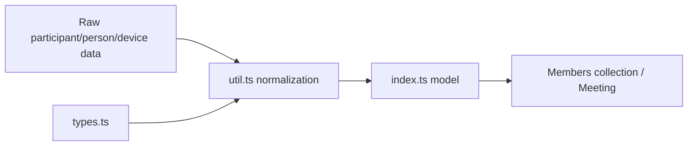
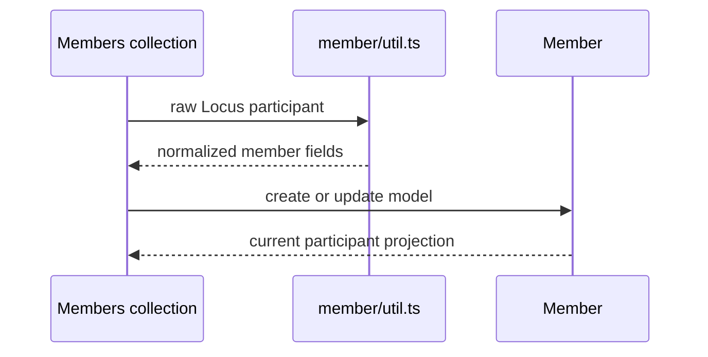
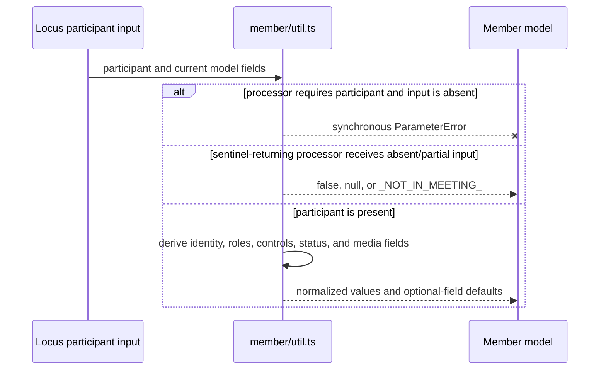
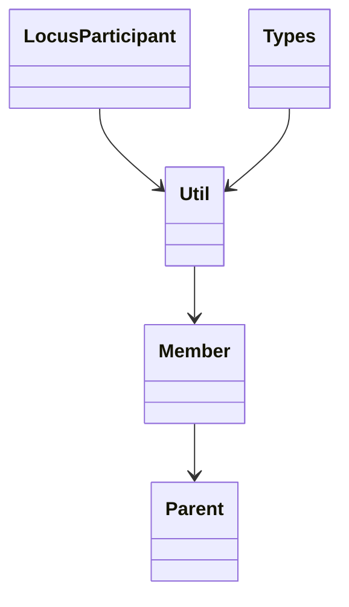

<!-- sdd-generated-metadata
doc_kind: module-spec
generated_from: module-spec@0.2.2
generator_plugin: repo-annotation@1.0.5+codex.20260818094939
generated_by: codex
approved_by: repository user
updated_at: 2026-08-22T15:21:29Z
validation_status: pass-with-warnings
-->
# MEMBER — SPEC

> Start here → root [`AGENTS.md`](../../../AGENTS.md) · router [`SPEC_INDEX.md`](../../../ai-docs/SPEC_INDEX.md) · system [`ARCHITECTURE.md`](../../../ai-docs/ARCHITECTURE.md). This is the canonical source-local spec for `src/member/`.

## Metadata

| Field | Value |
|---|---|
| Module id | `member` |
| Source path(s) | `src/member/` |
| Parent spec | — |
| Doc kind | Module spec |
| Coverage score | 93% assessed 2026-08-22; 13/14 mandatory fields present; all critical and Important fields present; one noncritical polish gap remains; pending independent validation of the participant-role repair |
| Generated from | `module-spec` @ SDLC template library `0.2.2` |
| generated_by / approved_by / updated_at | codex / repository user / 2026-08-22T15:21:29Z |
| Validation status | pass-with-warnings |

## Evidence Rules

Requirements cite current implementation and mirrored unit-test paths. Current code wins over retained prose when they conflict; commit and PR history are excluded by repository-owner decision. Missing test evidence is stated as a gap rather than inferred.

## Source Material Register

| Source material | Scope | Decision | Detail location or disposition |
|---|---|---|---|
| Retained package consumer documentation | overview / API / behavior / tests | used and verified; participant property semantics and the participant-email privacy change were placed in public surface, invariants, and security |
| Current source and mirrored tests | implementation / tests | verified | requirements, flows, failures, and test strategy below |

## Overview

`src/member/` contains 3 direct source/reference file(s) and has 2 mirrored unit-test file(s). This spec separates its public operations, runtime data movement, component ownership, state applicability, and verification boundary.

## Purpose / Responsibility

Builds and updates the normalized client projection for one Locus participant.

## Stack

TypeScript/JavaScript in the Node 22.14 Yarn workspace; Webex core/plugin abstractions and Mocha/Sinon/`@webex/test-helper-chai` tests. Build target: `yarn workspace @webex/plugin-meetings build:src`.

## Folder / Package Structure

```text
src/member/
├── index.ts — module facade/controller or primary exports
├── types.ts — module type declarations
├── util.ts — normalization/helper functions
└── ai-docs/member-spec.md — canonical module specification
```

## Key Files (source of truth)

| File | Holds |
|---|---|
| `src/member/index.ts` | module facade/controller or primary exports |
| `src/member/types.ts` | module type declarations |
| `src/member/util.ts` | normalization/helper functions |
| `test/unit/spec/member/index.js` and 1 sibling test file(s) | mirrored characterization/unit coverage |

## Public Surface

| Contract ID | Type | Surface | Purpose | Compatibility / deprecation | Schema / detail link | Root index |
|---|---|---|---|---|---|---|
| `member.1` | SDK model | `Member` construction/update from `Participant` | Normalize participant person/device, roles, controls, status, media, and identifiers into the roster model. | Preserve the observable member fields consumed by `MembersCollection` and Meeting. | `src/member/index.ts`, `src/member/types.ts` | [CONTRACTS](../../../ai-docs/CONTRACTS.md) |
| `member.2` | SDK mutation | `processPairedDevice()`, `setIsHost()`, and `setIsSelf()` | Derive paired-device and local host/self flags from authoritative participant context. | Preserve each processor's synchronous throw-or-sentinel behavior; do not generalize all missing inputs into `ParameterError` or a remote rejection. | `src/member/index.ts`, `src/member/util.ts` | [CONTRACTS](../../../ai-docs/CONTRACTS.md) |
| `member.3` | SDK mutation | `setIsContentSharing()`, `processIsContentSharing()`, and `processIsRecording()` | Project current share and recording state onto the member without owning their transport. | Preserve boolean projection rules and synchronous updates. | `src/member/index.ts` | [CONTRACTS](../../../ai-docs/CONTRACTS.md) |
| `member.4` | exported participant contracts | `MemberId`, `IExternalRoles`, `ServerRoles`, `ServerRoleShape`, `MediaStatus`, `IMediaStatus`, `Csi`, `Direction`, `ParticipantUrl`, `MediaSession`, `Intent`, `ParticipantDevice`, `ParticipantPerson`, `ParticipantMediaStatus`, `ParticipantControls`, and `Participant` | Share the exact participant input vocabulary used by Locus parsing and roster reconciliation. | Add fields compatibly; role, direction, and media raw values remain package contracts. | `src/member/types.ts`, `src/member/index.ts` | [CONTRACTS](../../../ai-docs/CONTRACTS.md) |

Compatibility notes:
- Prefer additive options and payload fields. Preserve method/event names, rejection semantics, and cleanup timing; route public changes through `src/index.ts` or the documented owning object.

## Requires (dependencies)

Locus participant payloads, member normalization utilities, and shared constants.

## Requirements

| ID | WHAT | WHY | Source Evidence | Test / Example Evidence | Assumptions / Gaps | Confidence |
|---|---|---|---|---|---|---|
| `MEMBER-R-001` | construct a member from participant data. | Builds and updates the normalized client projection for one Locus participant. | `src/member/index.ts` | `test/unit/spec/member/index.js` | none | PRESENT |
| `MEMBER-R-002` | update identity, roles, controls, status, and media properties. | Roster consumers rely on stable synchronous participant projections even as Locus fields arrive incrementally. | `src/member/index.ts`, `src/member/util.ts` | `test/unit/spec/member/index.js` | malformed paired-device/role inputs need synchronous error coverage | PRESENT |
| `MEMBER-R-003` | Missing participant input has processor-specific synchronous outcomes: validation-heavy helpers such as audio/video/hand/feature/recording/media-status processing and `canReclaimHost()` throw `ParameterError`; `canApproveAIEnablement()` and only the helpers whose implementations explicitly default a present participant's policy value return `false`; identity/name/recording-member extractors may return `null`; `extractStatus()` returns `_NOT_IN_MEETING_`. The module owns no asynchronous resource, listener, or timer. | Callers must preserve each helper's implemented sentinel or exception instead of treating all malformed or partial participant data as one failure contract. | `src/member/` | `test/unit/spec/member/index.js`, `test/unit/spec/member/util.js` | none | PRESENT |

## Design Overview

`Member` is a local participant model. `util.ts` synchronously normalizes Locus participant/person/device fields into the model and `types.ts` defines shapes; the module performs no request or event transport.

## Data Flow



## Sequence Diagram(s)

Sequence coverage:

| Operation group | Diagram | Failure coverage |
|---|---|---|
| UC-1…UC-3 — member projection operation groups | Member projection primary sequence | malformed participant input and synchronous projection updates without transport cleanup |
| UC-1…UC-3 — member projection alternate/failure paths | Member projection alternate/failure sequence | partial/malformed participant data or absent optional person/device fields |

### Member projection primary sequence



### Member projection alternate/failure sequence



## Class / Component Relationships



The arrows identify ownership and delegation inside `src/member/`; files that only declare types or constants are not presented as transports.

## Use Cases

- **UC-1:** Normalize a `Participant` with person, device, role, controls, status, and media data into one local `Member` projection. Evidence: `src/member/index.ts`.
- **UC-2:** Recompute host/self/paired-device flags when authoritative Locus context changes, preserving the selected processor's synchronous `ParameterError`, `false`, `null`, or `_NOT_IN_MEETING_` outcome for absent/partial input. Evidence: `src/member/index.ts`, `src/member/util.ts`.
- **UC-3:** Update content-sharing and recording projections without performing I/O; roster requests and update events remain owned by `src/members/`. Evidence: `src/member/index.ts`, `src/members/index.ts`.

## State Model

One in-memory participant projection is updated in place as Locus/member data changes.

## Business Rules & Invariants

- Participant identity and role/media/control fields derive from the newest supported payload; removed PII such as participant email is not reintroduced. Enforced by `src/member/index.ts` and supporting code under `src/member/`.

## Pitfalls

- A participant can expose identity, person, device, and media fragments at different times; treat missing optional fragments as incomplete state, not deletion.
- Public behavior may be reachable through a parent `Meeting`/`Meetings` object even when the source helper is not exported directly.

## Test-Case Strategy (module)

Use the current mirrored suites: `test/unit/spec/member/index.js`, `test/unit/spec/member/util.js`. Characterize the member-specific use cases above and each listed failure condition; add cleanup or transition cases only for resources and state this module actually owns.

| Behavior / Requirement | Existing test evidence | Gap |
|---|---|---|
| `MEMBER-R-001` | `test/unit/spec/member/index.js` | cover participant construction plus each synchronous projection processor |
| `MEMBER-R-002` | `test/unit/spec/member/index.js` | malformed paired-device/role inputs need synchronous error coverage |
| `MEMBER-R-003` | `test/unit/spec/member/index.js`, `test/unit/spec/member/util.js` | assert the per-helper `ParameterError`, `false`, `null`, and `_NOT_IN_MEETING_` matrix without inventing transport rejection or cleanup |

## Traceability

- Repo architecture: [`ARCHITECTURE.md`](../../../ai-docs/ARCHITECTURE.md) · Registry: [`SPEC_INDEX.md`](../../../ai-docs/SPEC_INDEX.md)
- Coverage state and contracts baseline: `../../../.sdd/manifest.json`
