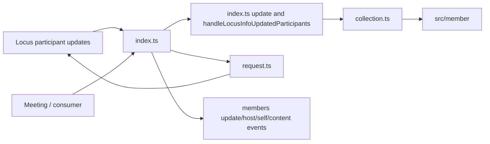
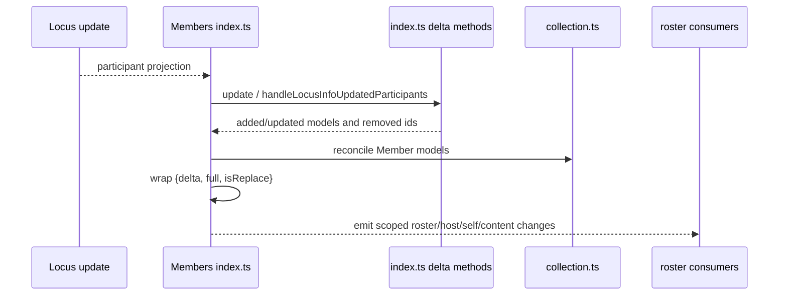
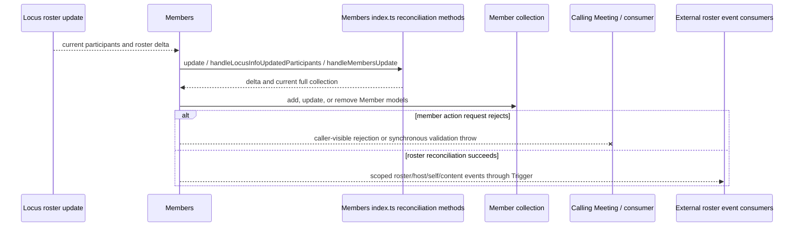
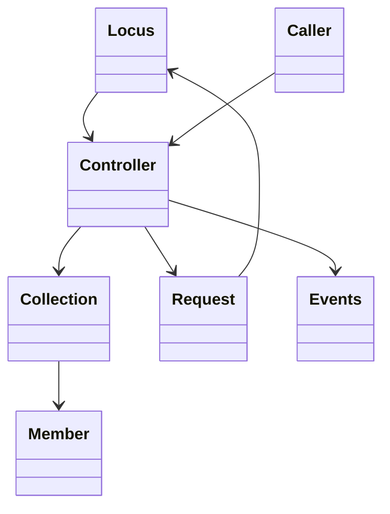

<!-- sdd-generated-metadata
doc_kind: module-spec
generated_from: module-spec@0.2.2
generator_plugin: repo-annotation@1.0.5+codex.20260818094939
generated_by: codex
approved_by: repository user
updated_at: 2026-08-22T15:21:29Z
validation_status: pass-with-warnings
-->
# MEMBERS — SPEC

> Start here → root [`AGENTS.md`](../../../AGENTS.md) · router [`SPEC_INDEX.md`](../../../ai-docs/SPEC_INDEX.md) · system [`ARCHITECTURE.md`](../../../ai-docs/ARCHITECTURE.md). This is the canonical source-local spec for `src/members/`.

## Metadata

| Field | Value |
|---|---|
| Module id | `members` |
| Source path(s) | `src/members/` |
| Parent spec | — |
| Doc kind | Module spec |
| Coverage score | 93% assessed 2026-08-22; 13/14 mandatory fields present; all critical and Important fields present; one noncritical polish gap remains; pending independent validation of the participant-role repair |
| Generated from | `module-spec` @ SDLC template library `0.2.2` |
| generated_by / approved_by / updated_at | codex / repository user / 2026-08-22T15:21:29Z |
| Validation status | not-run |

## Evidence Rules

Requirements cite current implementation and mirrored unit-test paths. Current code wins over retained prose when they conflict; commit and PR history are excluded by repository-owner decision. Missing test evidence is stated as a gap rather than inferred.

## Source Material Register

| Source material | Scope | Decision | Detail location or disposition |
|---|---|---|---|
| Retained package consumer documentation | overview / API / behavior / tests | used and verified; member collection properties, mutations, and events were distributed across the public surface, requirements, and use cases |
| Current source and mirrored tests | implementation / tests | verified | requirements, flows, failures, and test strategy below |

## Overview

`src/members/` contains 5 direct source/reference file(s) and has 4 mirrored unit-test file(s). This spec separates its public operations, runtime data movement, component ownership, state applicability, and verification boundary.

## Purpose / Responsibility

Owns the meeting roster collection, reconciles participant updates, performs participant mutations, and emits member events.

## Stack

TypeScript/JavaScript in the Node 22.14 Yarn workspace; Webex core/plugin abstractions and Mocha/Sinon/`@webex/test-helper-chai` tests. Build target: `yarn workspace @webex/plugin-meetings build:src`.

## Folder / Package Structure

```text
src/members/
├── collection.ts — module-owned collection
├── index.ts — module facade/controller or primary exports
├── request.ts — HTTP request boundary
├── types.ts — module type declarations
├── util.ts — normalization/helper functions
└── ai-docs/members-spec.md — canonical module specification
```

## Key Files (source of truth)

| File | Holds |
|---|---|
| `src/members/collection.ts` | module-owned collection |
| `src/members/index.ts` | module facade/controller or primary exports |
| `src/members/request.ts` | HTTP request boundary |
| `src/members/types.ts` | module type declarations |
| `src/members/util.ts` | normalization/helper functions |
| `test/unit/spec/members/collection.js` and 3 sibling test file(s) | mirrored characterization/unit coverage |

## Public Surface

| Contract ID | Type | Surface | Purpose | Compatibility / deprecation | Schema / detail link | Root index |
|---|---|---|---|---|---|---|
| `members.1` | SDK collection | `MembersCollection.set()`, `setAll()`, `get()`, `getAll()`, `remove()`, and `reset()` | Store member models by identity and support atomic roster replacement/reset. | Preserve collection keying and returned model identity. | `src/members/collection.ts` | [CONTRACTS](../../../ai-docs/CONTRACTS.md) |
| `members.2` | SDK / Locus input | `locusSelfUpdate()`, `locusHostUpdate()`, `locusParticipantsUpdate()`, `locusMediaSharesUpdate()`, `locusUrlUpdate()`, `locusFullStateTypeUpdate()`, `setLocusUrl()`, `setHostId()`, `setType()`, `setSelfId()`, `setMediaShareContentId()`, `setMediaShareWhiteboardId()`, and `clearMembers()` | Reconcile authoritative Locus roster/context into the current collection. | Preserve one `MEMBERS_UPDATE` emission with `{delta, full, isReplace}`; the nested delta carries added/updated/removed ids/models. | `src/members/index.ts` | [CONTRACTS](../../../ai-docs/CONTRACTS.md) |
| `members.3` | SDK / model mutation | `addMember()` and participant reconciliation | Create/update `Member` projections and compute the ids reported in the roster update payload. | Preserve member identity and local comparison behavior. | `src/members/index.ts`, `src/member/index.ts` | [CONTRACTS](../../../ai-docs/CONTRACTS.md) |
| `members.4` | SDK / remote | `cancelPhoneInvite()`, `cancelInviteByMemberId()`, `admitMembers()`, `removeMember()`, and `muteMember()` | Execute invitation/lobby/removal/mute operations against current Locus/member URLs. | Preserve request inputs and each method's actual caller-visible failure boundary: returned rejections are common, while `admitMembers()` can surface a synchronous `MembersRequest.admitMember()` validation throw. No blanket local capability pre-check exists for every operation. | `src/members/index.ts`, `src/members/request.ts` | [CONTRACTS](../../../ai-docs/CONTRACTS.md) |
| `members.5` | SDK / remote | `assignRoles()`, `moveToLobby()`, `raiseOrLowerHand()`, `lowerAllHands()`, and `transferHostToMember()` | Mutate participant roles, lobby placement, hand state, or host assignment. | Preserve role/action body shapes and current per-method validation. | `src/members/index.ts`, `src/members/request.ts` | [CONTRACTS](../../../ai-docs/CONTRACTS.md) |
| `members.6` | SDK / remote | `sendDialPadKey()` and `editDisplayName()` | Send member-scoped DTMF or display-name changes through the request adapter. | Preserve target member/session context and caller-visible request errors. | `src/members/index.ts`, `src/members/request.ts` | [CONTRACTS](../../../ai-docs/CONTRACTS.md) |
| `members.7` | SDK / query | `findMemberByCsi()` and `getCsisForMember()` | Resolve media CSI/member relationships from the current roster projection. | Preserve null/empty outcomes for unresolved mappings. | `src/members/index.ts` | [CONTRACTS](../../../ai-docs/CONTRACTS.md) |
| `members.8` | request/types | `MembersRequest.addMembers()`, `admitMember()`, `removeMember()`, `muteMember()`, `assignRolesMember()`, `moveToLobbyMember()`, `raiseOrLowerHandMember()`, `lowerAllHandsMember()`, `editDisplayNameMember()`, `transferHostToMember()`, `sendDialPadKey()`, `cancelPhoneInvite()`, and `cancelInviteByMemberId()` plus `ServerRoles`, `ServerRoleShape`, `RoleAssignmentOptions`, `RoleAssignmentBody`, and `RoleAssignmentRequest` | Provide the direct HTTP boundary and exact role-assignment vocabulary used by the facade. | Request helpers do not own roster mutation; role raw values are compatibility-sensitive. | `src/members/request.ts`, `src/members/types.ts` | [CONTRACTS](../../../ai-docs/CONTRACTS.md) |

### Emitted events

Current source emits or forwards these observable literals for this operation boundary. Preserve literal values, scope, payload shape, and emission timing; a constant name alone is not a substitute for the consumer-visible value.

| Event literal | Constant / expression | Emission evidence |
|---|---|---|
| `members:clear` | `EVENT_TRIGGERS.MEMBERS_CLEAR` | `src/members/index.ts` |
| `members:content:update` | `EVENT_TRIGGERS.MEMBERS_CONTENT_UPDATE` | `src/members/index.ts` |
| `members:host:update` | `EVENT_TRIGGERS.MEMBERS_HOST_UPDATE` | `src/members/index.ts` |
| `members:self:update` | `EVENT_TRIGGERS.MEMBERS_SELF_UPDATE` | `src/members/index.ts` |
| `members:update` | `EVENT_TRIGGERS.MEMBERS_UPDATE` | `src/members/index.ts` |

Compatibility notes:
- Prefer additive options and payload fields. Preserve method/event names, rejection semantics, and cleanup timing; route public changes through `src/index.ts` or the documented owning object.

## Requires (dependencies)

Locus participant updates, Member models, meeting/Locus URLs, request helper, event utilities, and role/capability state.

## Requirements

| ID | WHAT | WHY | Source Evidence | Test / Example Evidence | Assumptions / Gaps | Confidence |
|---|---|---|---|---|---|---|
| `MEMBERS-R-001` | initialize and reconcile the members collection. | Owns the meeting roster collection, reconciles participant updates, performs participant mutations, and emits member events. | `src/members/index.ts` | `test/unit/spec/members/index.js` | none | PRESENT |
| `MEMBERS-R-002` | admit/remove/mute/transfer-role and related participant controls. | Participant controls target distinct URLs/bodies, while roster state changes only from authoritative Locus updates. | `src/members/index.ts`, `src/members/request.ts` | `test/unit/spec/members/index.js` | mixed add/update/remove reconciliation needs one-payload assertions | PRESENT |
| `MEMBERS-R-003` | Server failures reject their caller, while validation may either return a rejected promise or throw synchronously at the request-helper boundary; malformed/stale roster updates follow existing diff rules, and collection reset removes the local models owned by this module. | Callers must handle the actual synchronous-versus-promise boundary, while roster consumers need one authoritative update payload and a deterministic local reset. | `src/members/` | `test/unit/spec/members/index.js`, `test/unit/spec/members/request.js` | none | PRESENT |
| `MEMBERS-R-004` | Roster reconciliation preserves one Member per participant id and emits `{delta, full, isReplace}`; `delta` contains the added/updated models and removed ids, while `full` is the current collection. | Stable object identity and the exact wrapper shape let consumers distinguish incremental versus replacement updates without inventing top-level changed/removed fields. | `src/members/index.ts`, `src/members/collection.ts` | `test/unit/spec/members/index.js`, `test/unit/spec/members/collection.js` | none | PRESENT |
| `MEMBERS-R-005` | Host, self, and active-content changes emit their dedicated member events with active/ended ids. | These roles/streams can change independently of general participant fields and consumers need focused transitions. | `src/members/index.ts`, `src/members/types.ts` | `test/unit/spec/members/index.js` | none | PRESENT |
| `MEMBERS-R-006` | Participant mutations use current Locus/device/participant context and propagate server rejection. | Admit, remove, mute, and role changes are privileged remote state, not optimistic local edits. | `src/members/index.ts`, `src/members/request.ts` | `test/unit/spec/members/request.js` | none | PRESENT |

## Design Overview

`Members` owns roster collection reconciliation and member-control requests. `index.ts` computes the added/updated/removed delta in `update()`; `handleLocusInfoUpdatedParticipants()` updates contextual ids, delegates participant reconciliation to `update()`, and applies removed participant ids before `locusParticipantsUpdate()` wraps the result with the full collection and `isReplace`. `collection.ts` stores `Member` models and `request.ts` sends admit/remove/mute/role operations to current Locus URLs.

## Data Flow



## Sequence Diagram(s)

Sequence coverage:

| Operation group | Diagram | Failure coverage |
|---|---|---|
| UC-1…UC-5 — roster and member-control operation groups | Roster and member-control primary sequence | stale roster input, request rejection, single update payload, and collection reset |
| UC-1…UC-5 — roster and member-control alternate/failure paths | Roster and member-control alternate/failure sequence | missing member/Locus URL, request rejection, or inconsistent roster update; no blanket local capability gate |

### Roster and member-control primary sequence



### Roster and member-control alternate/failure sequence



## Class / Component Relationships



The arrows identify ownership and delegation inside `src/members/`; files that only declare types or constants are not presented as transports.

## Use Cases

- **UC-1:** Replace or incrementally reconcile Locus participants into stable `Member` models and emit one `MEMBERS_UPDATE` payload shaped as `{delta, full, isReplace}`. Evidence: `src/members/index.ts`, `src/members/collection.ts`.
- **UC-2:** Resolve member/CSI relationships for media consumers from the current roster. Evidence: `src/members/index.ts`.
- **UC-3:** Cancel invitations, admit lobby members, remove or mute a participant using current Locus/member request context. Evidence: `src/members/index.ts`, `src/members/request.ts`.
- **UC-4:** Assign roles, move to lobby, raise/lower hands, lower all hands, or transfer host using each method's actual validation/body. Evidence: `src/members/index.ts`, `src/members/request.ts`.
- **UC-5:** Send member DTMF or edit a display name and propagate the request adapter's outcome. Evidence: `src/members/index.ts`, `src/members/request.ts`.

## State Model

The roster collection, self/host/participant indexes, and event-listener state are scoped to a meeting.

## Business Rules & Invariants

- Each participant id maps to one current Member and removed participants leave the collection. Remote mutations validate their own ids/Locus context, but `Members` does not apply a blanket meeting-capability check before sending them. Enforced by `src/members/index.ts` and supporting code under `src/members/`.

## Concurrency & Reactive Flow

- Roster reconciliation keys additions, updates, and removals by current participant/member identity before mutating the collection. `reset()` removes the local member models; member-control requests settle independently and do not turn a rejected server action into a local optimistic update.

## Error Handling & Failure Modes

| Condition | Signal | Caller recovery |
|---|---|---|
| Required input to a synchronous context setter such as `setLocusUrl()`, `setHostId()`, `setType()`, or `setSelfId()` is absent | The setter throws `ParameterError` synchronously. | Supply the direct value or its accepted Locus/full-state container before calling. |
| `admitMembers()` receives an empty member-id array | It returns a rejected `ParameterError` promise before constructing request options. | Supply at least one member id and handle the returned rejection. |
| `admitMembers()` receives member ids but its generated request options lack `locusUrl` | `MembersRequest.admitMember()` throws `ParameterError` synchronously; `admitMembers()` is not `async`, so a chained `.catch()` does not observe this validation error. | Refresh Locus context and catch at the synchronous call boundary when it may be absent. |
| `sendDialPadKey()` cannot resolve the member | It returns a rejected `ParameterError` promise. | Refresh the roster and retry with a current member id. |
| `sendDialPadKey()` resolves the member but lacks a Locus URL or SIP device URL | It returns a rejected plain `Error` promise, not `ParameterError`. | Restore the meeting/device call-control context before retrying. |
| Member-control request rejects | The request promise rejects and no successful server mutation is claimed. | Handle the rejection before attempting a later action. |
| Accepted roster update adds, changes, or removes participants | The collection reconciles the affected `Member` models and emits only the scoped roster/host/self/content changes. | Consume the updated collection projection. |

## Pitfalls

- Roster snapshots and deltas may represent the same participant differently. Replacing the collection wholesale can lose object identity and event semantics.
- Public behavior may be reachable through a parent `Meeting`/`Meetings` object even when the source helper is not exported directly.

## Test-Case Strategy (module)

Use the current mirrored suites: `test/unit/spec/members/collection.js`, `test/unit/spec/members/index.js`, `test/unit/spec/members/request.js`, `test/unit/spec/members/utils.js`. Characterize the members-specific use cases above and each listed failure condition; add cleanup or transition cases only for resources and state this module actually owns.

| Behavior / Requirement | Existing test evidence | Gap |
|---|---|---|
| `MEMBERS-R-001` | `test/unit/spec/members/index.js` | cover collection reconciliation, CSI queries, and every member request family |
| `MEMBERS-R-002` | `test/unit/spec/members/index.js` | mixed add/update/remove reconciliation needs one-payload assertions |
| `MEMBERS-R-003` | `test/unit/spec/members/index.js` | assert the exact `{delta, full, isReplace}` payload and per-operation request rejection without a fabricated global capability gate |
| `MEMBERS-R-004` | `test/unit/spec/members/index.js`, `test/unit/spec/members/collection.js` | none |
| `MEMBERS-R-005` | `test/unit/spec/members/index.js` | verify simultaneous host/content changes |
| `MEMBERS-R-006` | `test/unit/spec/members/request.js` | verify service rejection and confirm the facade does not invent a local capability-denied branch |

## Traceability

- Repo architecture: [`ARCHITECTURE.md`](../../../ai-docs/ARCHITECTURE.md) · Registry: [`SPEC_INDEX.md`](../../../ai-docs/SPEC_INDEX.md)
- Coverage state and contracts baseline: `../../../.sdd/manifest.json`
