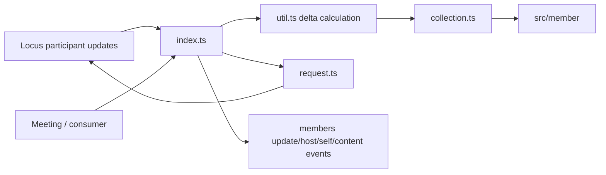
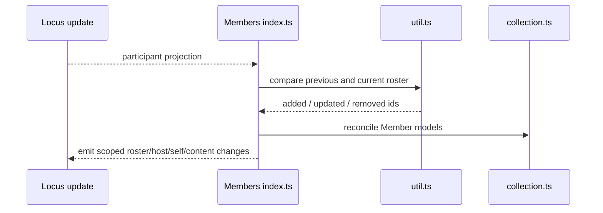
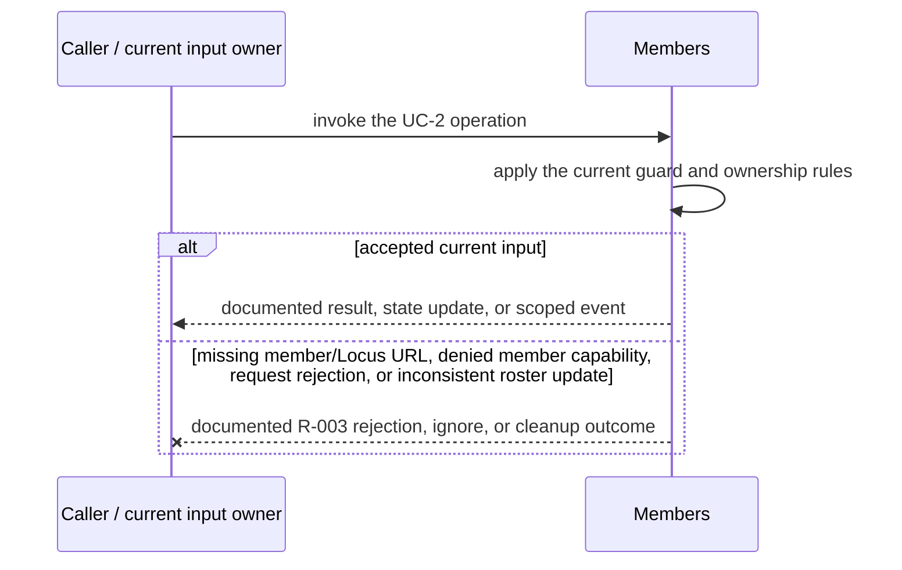
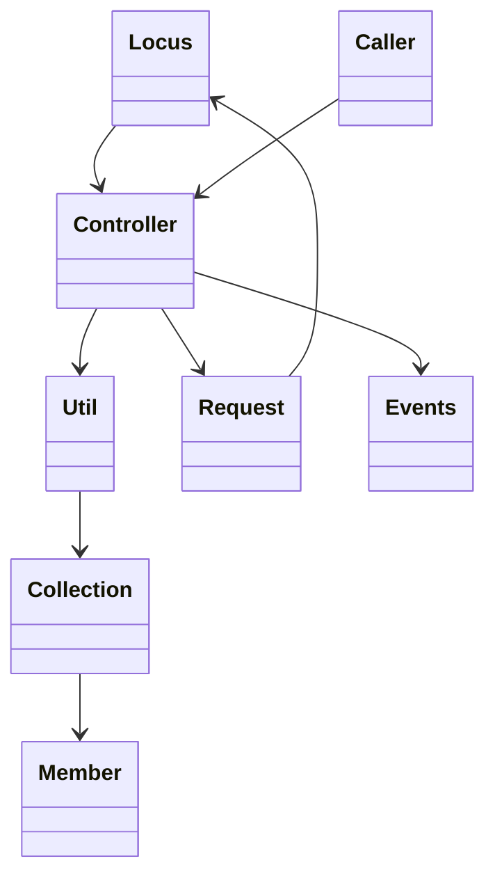

<!-- sdd-generated-metadata
doc_kind: module-spec
generated_from: module-spec@0.2.2
generator_plugin: repo-annotation@1.0.5+codex.20260818094939
generated_by: codex
approved_by: repository user
updated_at: 2026-08-21T06:10:05Z
validation_status: not-run
-->
# MEMBERS — SPEC

> Start here → root [`AGENTS.md`](../../../AGENTS.md) · router [`SPEC_INDEX.md`](../../../ai-docs/SPEC_INDEX.md) · system [`ARCHITECTURE.md`](../../../ai-docs/ARCHITECTURE.md). This is the canonical source-local spec for `src/members/`.

## Metadata

| Field | Value |
|---|---|
| Module id | `members` |
| Source path(s) | `src/members/` |
| Parent spec | — |
| Doc kind | Module spec |
| Coverage score | 93% assessed 2026-08-21; 13/14 mandatory fields present; all critical and Important fields present; one noncritical polish gap remains |
| Generated from | `module-spec` @ SDLC template library `0.2.2` |
| generated_by / approved_by / updated_at | codex / repository user / 2026-08-21T06:10:05Z |
| Validation status | not-run |

## Evidence Rules

Requirements cite current implementation and mirrored unit-test paths. Current code wins over retained prose when they conflict; commit and PR history are excluded by repository-owner decision. Missing test evidence is stated as a gap rather than inferred.

## Source Material Register

| Source material | Scope | Decision | Detail location or disposition |
|---|---|---|---|
| Retained package consumer documentation | overview / API / behavior / tests | used and verified; member collection properties, mutations, and events were distributed across the public surface, requirements, and use cases |
| Current source and mirrored tests | implementation / tests | verified | requirements, flows, failures, and test strategy below |

## Overview

`src/members/` contains 5 direct source/reference file(s) and has 4 mirrored unit-test file(s). This spec separates its public operations, runtime data movement, component ownership, state applicability, and verification boundary.

## Purpose / Responsibility

Owns the meeting roster collection, reconciles participant updates, performs participant mutations, and emits member events.

## Stack

TypeScript/JavaScript in the Node 22.14 Yarn workspace; Webex core/plugin abstractions and Mocha/Sinon/`@webex/test-helper-chai` tests. Build target: `yarn workspace @webex/plugin-meetings build:src`.

## Folder / Package Structure

```text
src/members/
├── collection.ts — module-owned collection
├── index.ts — module facade/controller or primary exports
├── request.ts — HTTP request boundary
├── types.ts — module type declarations
├── util.ts — normalization/helper functions
└── ai-docs/members-spec.md — canonical module specification
```

## Key Files (source of truth)

| File | Holds |
|---|---|
| `src/members/collection.ts` | module-owned collection |
| `src/members/index.ts` | module facade/controller or primary exports |
| `src/members/request.ts` | HTTP request boundary |
| `src/members/types.ts` | module type declarations |
| `src/members/util.ts` | normalization/helper functions |
| `test/unit/spec/members/collection.js` and 3 sibling test file(s) | mirrored characterization/unit coverage |

## Public Surface

| Contract ID | Type | Surface | Purpose | Compatibility / deprecation | Schema / detail link | Root index |
|---|---|---|---|---|---|---|
| `members.1` | SDK / in-process / remote | initialize and reconcile the members collection | Preserve the module responsibility through a focused operation group | Consumer-visible methods/events are semver-sensitive when reachable from package objects | `src/members/index.ts` | [CONTRACTS](../../../ai-docs/CONTRACTS.md) |
| `members.2` | SDK / in-process / remote | admit/remove/mute/transfer-role and related participant controls | Preserve the module responsibility through a focused operation group | Consumer-visible methods/events are semver-sensitive when reachable from package objects | `src/members/index.ts` | [CONTRACTS](../../../ai-docs/CONTRACTS.md) |
| `members.3` | SDK / in-process / remote | emit member added, updated, and removed events | Preserve the module responsibility through a focused operation group | Consumer-visible methods/events are semver-sensitive when reachable from package objects | `src/members/index.ts` | [CONTRACTS](../../../ai-docs/CONTRACTS.md) |

Compatibility notes:
- Prefer additive options and payload fields. Preserve method/event names, rejection semantics, and cleanup timing; route public changes through `src/index.ts` or the documented owning object.

## Requires (dependencies)

Locus participant updates, Member models, meeting/Locus URLs, request helper, event utilities, and role/capability state.

## Requirements

| ID | WHAT | WHY | Source Evidence | Test / Example Evidence | Assumptions / Gaps | Confidence |
|---|---|---|---|---|---|---|
| `MEMBERS-R-001` | initialize and reconcile the members collection. | Owns the meeting roster collection, reconciles participant updates, performs participant mutations, and emits member events. | `src/members/index.ts` | `test/unit/spec/members/index.js` | none | PRESENT |
| `MEMBERS-R-002` | admit/remove/mute/transfer-role and related participant controls. | Callers need deterministic observable behavior across async Webex inputs. | `src/members/index.ts`, `src/members/request.ts` | `test/unit/spec/members/index.js` | additional edge cases may live in sibling tests | PRESENT |
| `MEMBERS-R-003` | Request failures reject their caller; malformed/stale roster updates follow existing diff rules, and collection reset removes the local models owned by this module. | Callers must receive the actual module failure outcome without false cleanup or event guarantees. | `src/members/` | `test/unit/spec/members/index.js` | none | PRESENT |
| `MEMBERS-R-004` | Roster reconciliation preserves one Member per participant id and emits added/updated/removed deltas plus the current collection. | Stable object identity and explicit deltas let consumers update participant state without rebuilding unrelated views. | `src/members/index.ts`, `src/members/collection.ts` | `test/unit/spec/members/index.js`, `test/unit/spec/members/collection.js` | none | PRESENT |
| `MEMBERS-R-005` | Host, self, and active-content changes emit their dedicated member events with active/ended ids. | These roles/streams can change independently of general participant fields and consumers need focused transitions. | `src/members/index.ts`, `src/members/types.ts` | `test/unit/spec/members/index.js` | none | PRESENT |
| `MEMBERS-R-006` | Participant mutations use current Locus/device/participant context and propagate server rejection. | Admit, remove, mute, and role changes are privileged remote state, not optimistic local edits. | `src/members/index.ts`, `src/members/request.ts` | `test/unit/spec/members/request.js` | none | PRESENT |

## Design Overview

`Members` owns roster collection reconciliation and member-control requests. `collection.ts` stores `Member` models, `util.ts` computes roster deltas, and `request.ts` sends admit/remove/mute/role operations to current Locus URLs.

## Data Flow



## Sequence Diagram(s)

Sequence coverage:

| Operation group | Diagram | Failure coverage |
|---|---|---|
| UC-1 — primary operation | Primary operation sequence | accepted and rejected dependency outcomes |
| UC-2 — secondary/change operation | Secondary operation and failure sequence | missing member/Locus URL, denied member capability, request rejection, or inconsistent roster update |

### Primary operation sequence



### Secondary operation and failure sequence



## Class / Component Relationships



The arrows identify ownership and delegation inside `src/members/`; files that only declare types or constants are not presented as transports.

## Use Cases

- **UC-1:** Reconcile Locus participant changes into Member models and emit the specific roster change categories. Evidence: `src/members/`.
- **UC-2:** Send member control operations through `MembersRequest` with current Locus/member URLs and capabilities. Evidence: `src/members/`.

## State Model

The roster collection, self/host/participant indexes, and event-listener state are scoped to a meeting.

## Business Rules & Invariants

- Each participant id maps to one current Member; removed participants leave the collection; privileged mutations require the relevant meeting capability. Enforced by `src/members/index.ts` and supporting code under `src/members/`.

## Concurrency & Reactive Flow

- Async work owned by `Members` may complete after a newer caller or remote input. Preserve the identity, sequence, and resource-owner guards in `src/members/`; a late completion must not replay UC-2 for superseded state.

## Error Handling & Failure Modes

| Condition | Signal | Caller recovery |
|---|---|---|
| missing member/Locus URL, denied member capability, request rejection, or inconsistent roster update | Follow the concrete rejection, ignore, state, or cleanup behavior in the module's R-003 requirement. | Resolve the named condition; retry only when another requirement defines a bound. |
| UC-1 succeeds | Return, update, callback, or scoped event identified by the Public Surface and primary sequence. | Continue from the owning module's accepted state. |

## Pitfalls

- Roster snapshots and deltas may represent the same participant differently. Replacing the collection wholesale can lose object identity and event semantics.
- Public behavior may be reachable through a parent `Meeting`/`Meetings` object even when the source helper is not exported directly.

## Test-Case Strategy (module)

Use the current mirrored suites: `test/unit/spec/members/collection.js`, `test/unit/spec/members/index.js`, `test/unit/spec/members/request.js`, `test/unit/spec/members/utils.js`. Characterize the two code-grounded use cases above and the listed failure condition; add cleanup or transition cases only for resources and state this module actually owns.

| Behavior / Requirement | Existing test evidence | Gap |
|---|---|---|
| `MEMBERS-R-001` | `test/unit/spec/members/index.js` | confirm the named operation against its owning sibling suite |
| `MEMBERS-R-002` | `test/unit/spec/members/index.js` | verify the code-grounded rejection or stale-input branch |
| `MEMBERS-R-003` | `test/unit/spec/members/index.js` | verify the concrete R-003 rejection, ignore, or cleanup outcome |
| `MEMBERS-R-004` | `test/unit/spec/members/index.js`, `test/unit/spec/members/collection.js` | none |
| `MEMBERS-R-005` | `test/unit/spec/members/index.js` | verify simultaneous host/content changes |
| `MEMBERS-R-006` | `test/unit/spec/members/request.js` | verify capability-denied mutations |

## Traceability

- Repo architecture: [`ARCHITECTURE.md`](../../../ai-docs/ARCHITECTURE.md) · Registry: [`SPEC_INDEX.md`](../../../ai-docs/SPEC_INDEX.md)
- Coverage state and contracts baseline: `../../../.sdd/manifest.json`
