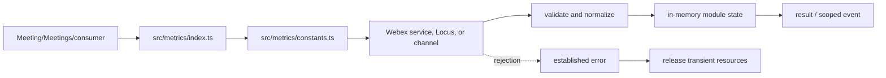
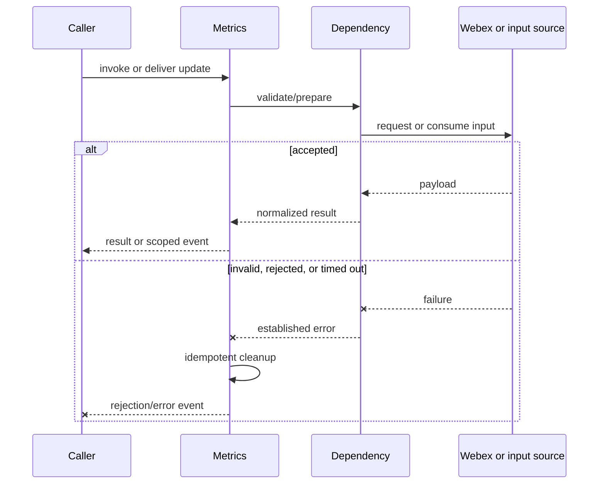
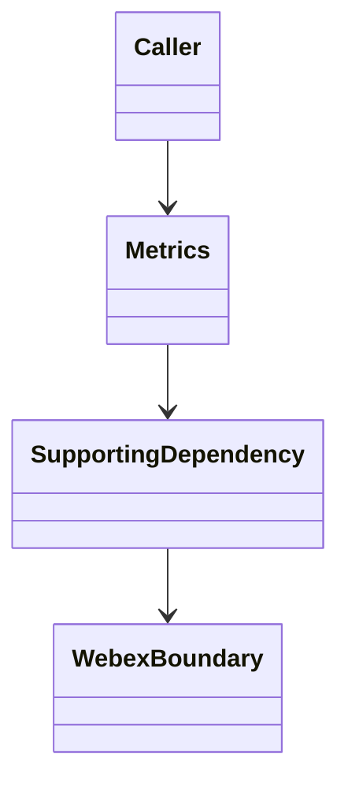

<!-- sdd-generated-metadata
doc_kind: module-spec
generated_from: module-spec@0.2.2
generator_plugin: repo-annotation@1.0.5+codex.20260818094939
generated_by: codex
approved_by: repository user
updated_at: 2026-08-18T15:33:39Z
validation_status: not-run
-->
# METRICS — SPEC

> Start here → root [`AGENTS.md`](../../../AGENTS.md) · router [`SPEC_INDEX.md`](../../../ai-docs/SPEC_INDEX.md) · system [`ARCHITECTURE.md`](../../../ai-docs/ARCHITECTURE.md). This is the canonical source-local spec for `src/metrics/`.

## Metadata

| Field | Value |
|---|---|
| Module id | `metrics` |
| Source path(s) | `src/metrics/` |
| Parent spec | — |
| Doc kind | Module spec |
| Coverage score | 93% assessed 2026-08-18; 13/14 mandatory fields present; all critical fields present, one noncritical detail gap remains |
| Generated from | `module-spec` @ SDLC template library `0.2.2` |
| generated_by / approved_by / updated_at | codex / repository user / 2026-08-18T15:33:39Z |
| Validation status | not-run |

## Evidence Rules

Requirements cite current source and mirrored tests. Current code wins over retained prose when they conflict; commit and PR history are excluded. Missing evidence stays a gap.

## Source Material Register

| Source material | Scope | Decision | Detail location or disposition |
|---|---|---|---|
| No routed legacy module spec | overview / API / behavior / tests | none; generated from current metrics implementation/constants and tests |
| Current source and mirrored tests | implementation / tests | verified | requirements, flows, failures, and test strategy below |

## Overview

For orientation, start at `src/metrics/index.ts`; supporting files under `src/metrics/` separate request, parsing, collection, type, or utility concerns from parent orchestration. The module is composed by `Meeting`, `Meetings`, or the package entry as applicable. Remote Webex services/Locus remain authoritative, and all local state is scoped to the SDK, plugin, meeting, or operation lifetime.

## Purpose / Responsibility

Initializes meeting behavioral telemetry, flattens metric fields, and submits established metric names/tags through the Webex metrics host.

## Stack

TypeScript/JavaScript in the Node 22.14 Yarn workspace; Webex core/plugin abstractions and Mocha/Sinon/`@webex/test-helper-chai` tests.

## Folder / Package Structure

```text
src/metrics/
├── index.ts — primary behavior/entry point
├── constants.ts — supporting request, type, utility, or constant behavior
└── ai-docs/metrics-spec.md — canonical module specification
```

## Key Files (source of truth)

| File | Holds |
|---|---|
| `src/metrics/index.ts` | Primary lifecycle and module surface |
| `src/metrics/constants.ts` | Supporting transport, types, constants, or normalization |
| `test/unit/spec/metrics/index.js` | Mirrored behavioral tests |

## Public Surface

| Contract ID | Type | Surface | Purpose | Compatibility / deprecation | Schema / detail link | Root index |
|---|---|---|---|---|---|---|
| `metrics.1` | SDK / in-process / remote | initialize the metrics host once | Focused operation group owned by this module | Preserve methods/events/wire values reachable from package objects | `src/metrics/index.ts` | [CONTRACTS](../../../ai-docs/CONTRACTS.md) |
| `metrics.2` | SDK / in-process / remote | prepare/flatten bounded metric fields | Focused operation group owned by this module | Preserve methods/events/wire values reachable from package objects | `src/metrics/index.ts` | [CONTRACTS](../../../ai-docs/CONTRACTS.md) |
| `metrics.3` | SDK / in-process / remote | send named behavioral metrics with fields and tags | Focused operation group owned by this module | Preserve methods/events/wire values reachable from package objects | `src/metrics/index.ts` | [CONTRACTS](../../../ai-docs/CONTRACTS.md) |

Compatibility notes:
- Prefer additive fields/options and preserve current rejection/event/cleanup semantics. Internal helpers are not public merely because they are exported within the source directory.

## Requires (dependencies)

Webex metrics plugin/host, behavioral metric constants, logging/error handling, and callers in meeting/feature modules.

## Requirements

| ID | WHAT | WHY | Source Evidence | Test / Example Evidence | Assumptions / Gaps | Confidence |
|---|---|---|---|---|---|---|
| `METRICS-R-001` | initialize the metrics host once. | Initializes meeting behavioral telemetry, flattens metric fields, and submits established metric names/tags through the Webex metrics host. | `src/metrics/index.ts` | `test/unit/spec/metrics/index.js` | none | PRESENT |
| `METRICS-R-002` | prepare/flatten bounded metric fields. | Consumers need deterministic behavior across meeting and remote updates. | `src/metrics/index.ts`, `src/metrics/constants.ts` | `test/unit/spec/metrics/index.js` | inspect sibling tests for operation-specific cases | PRESENT |
| `METRICS-R-003` | Invalid, rejected, or terminal operations preserve the established failure signal and release module-owned transient resources. | Hidden failure or leaked state corrupts later meeting behavior. | `src/metrics/index.ts` | `test/unit/spec/metrics/index.js` | verify every early exit during focused changes | PRESENT |

## Design Overview

The primary controller/data module owns normalization and observable state while supporting files isolate request, type, constant, collection, or utility concerns. Capability and remote response data are checked before state changes. Async completion emits/returns one established outcome; cleanup handles listeners, timers, locks, channels, or transient requests owned by the module.

## Data Flow



## Sequence Diagram(s)

Sequence coverage:

The operation groups below share the same caller → module → supporting dependency → Webex/input ordering and the same rejection/cleanup contract, so one combined diagram covers their common sequence; operation-specific state and guards are stated in the requirements and use cases.

| Operation group | Diagram | Failure / recovery coverage |
|---|---|---|
| initialize the metrics host once | Read/derive or initialize | invalid/capability rejection |
| prepare/flatten bounded metric fields | Mutate or react | remote rejection/timeout and cleanup |



## Class / Component Relationships



The module owns its projection/controller and composes supporting requests, types, constants, collections, or utilities. The Webex boundary remains authoritative.

## Use Cases

- **UC-1 Primary:** the parent/consumer requests initialize the metrics host once; the module validates or derives data and returns/emits the normalized outcome. Evidence: `src/metrics/index.ts`, `test/unit/spec/metrics/index.js`.
- **UC-2 Change:** the parent/consumer triggers prepare/flatten bounded metric fields; capability/current state is checked, the dependency is invoked, and accepted state is exposed once. Evidence: `src/metrics/index.ts`, `src/metrics/constants.ts`.

## Business Rules & Invariants

- Metrics are sent only after setup; names use the declared catalog; sensitive tokens/content/PII are excluded; flattening is deterministic. Enforced under `src/metrics/`.

## Concurrency & Reactive Flow

- Remote/event/promise/timer callbacks may interleave. Preserve current identity/sequence guards, allow only the intended in-flight operation, and make listener/timer/channel cleanup idempotent.

## Pitfalls

- Flattening arbitrary service payloads can create unbounded or sensitive tags. Callers must submit an intentional bounded projection.
- Verify both typed constants/enums and raw wire values before changing a logical condition in this legacy package.

## Test-Case Strategy (module)

Start with the mirrored suite and sibling files in the same test directory. Cover successful derivation/mutation plus invalid capability/input, remote rejection, stale event, and cleanup. Use Sinon, `calledOnceWithExactly`, and fake timers for retry/lock/token/channel timing.

| Behavior / Requirement | Existing test evidence | Gap |
|---|---|---|
| `METRICS-R-001` | `test/unit/spec/metrics/index.js` | inspect sibling tests for full operation matrix |
| `METRICS-R-002` | `test/unit/spec/metrics/index.js` | verify rejected and role/capability-change branches |
| `METRICS-R-003` | `test/unit/spec/metrics/index.js` | verify cleanup on all early exits |

## Traceability

- Repo architecture: [`ARCHITECTURE.md`](../../../ai-docs/ARCHITECTURE.md) · Registry: [`SPEC_INDEX.md`](../../../ai-docs/SPEC_INDEX.md)
- Coverage state and contracts baseline: `../../../.sdd/manifest.json`
