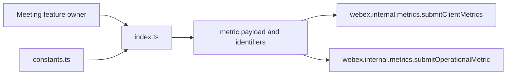
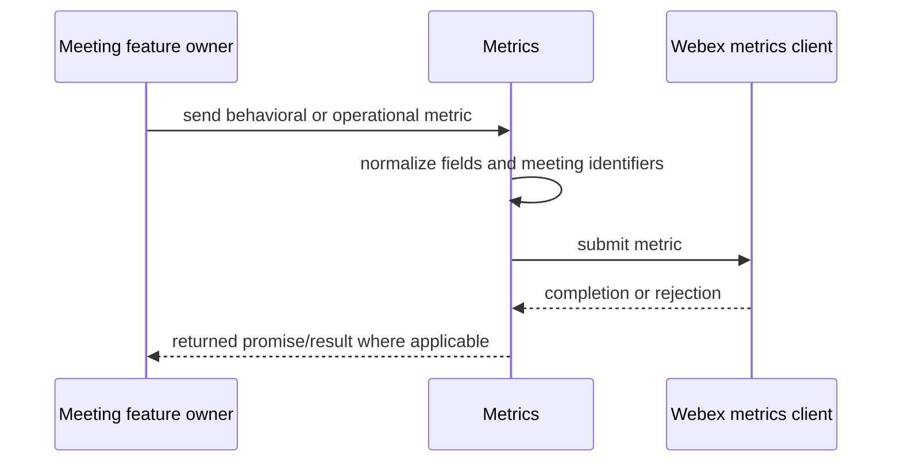
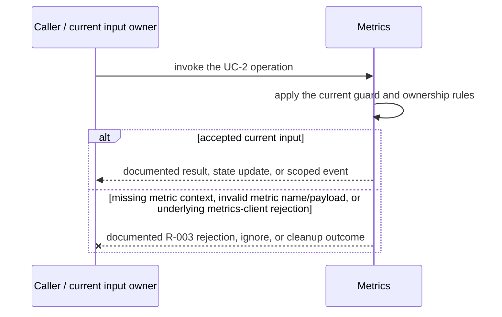
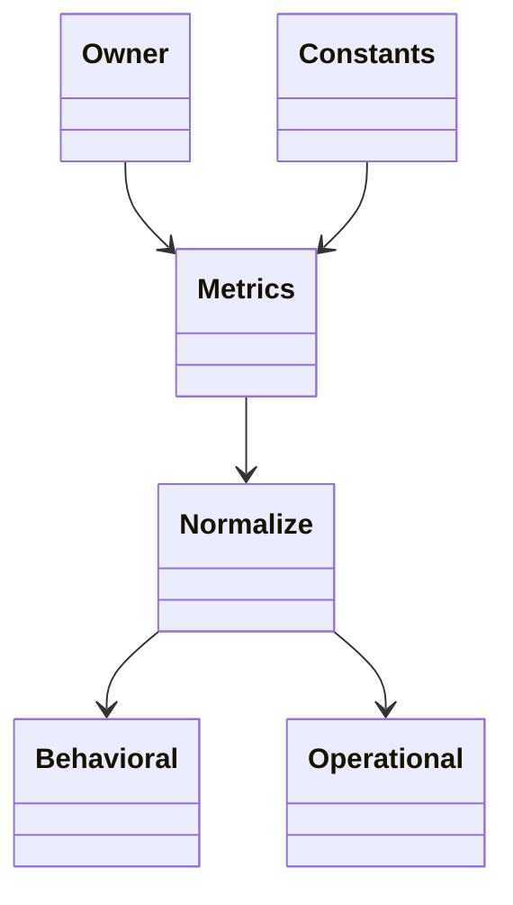

<!-- sdd-generated-metadata
doc_kind: module-spec
generated_from: module-spec@0.2.2
generator_plugin: repo-annotation@1.0.5+codex.20260818094939
generated_by: codex
approved_by: repository user
updated_at: 2026-08-21T06:10:05Z
validation_status: not-run
-->
# METRICS — SPEC

> Start here → root [`AGENTS.md`](../../../AGENTS.md) · router [`SPEC_INDEX.md`](../../../ai-docs/SPEC_INDEX.md) · system [`ARCHITECTURE.md`](../../../ai-docs/ARCHITECTURE.md). This is the canonical source-local spec for `src/metrics/`.

## Metadata

| Field | Value |
|---|---|
| Module id | `metrics` |
| Source path(s) | `src/metrics/` |
| Parent spec | — |
| Doc kind | Module spec |
| Coverage score | 93% assessed 2026-08-21; 13/14 mandatory fields present; all critical and Important fields present; one noncritical polish gap remains |
| Generated from | `module-spec` @ SDLC template library `0.2.2` |
| generated_by / approved_by / updated_at | codex / repository user / 2026-08-21T06:10:05Z |
| Validation status | not-run |

## Evidence Rules

Requirements cite current source and mirrored tests. Current code wins over retained prose when they conflict; commit and PR history are excluded. Missing evidence stays a gap.

## Source Material Register

| Source material | Scope | Decision | Detail location or disposition |
|---|---|---|---|
| No routed legacy module spec | overview / API / behavior / tests | none; generated from current metrics implementation/constants and tests |
| Current source and mirrored tests | implementation / tests | verified | requirements, flows, failures, and test strategy below |

## Overview

`src/metrics/` contains 2 direct source/reference file(s) and has 1 mirrored unit-test file(s). This spec separates its public operations, runtime data movement, component ownership, state applicability, and verification boundary.

## Purpose / Responsibility

Initializes meeting behavioral telemetry, flattens metric fields, and submits established metric names/tags through the Webex metrics host.

## Stack

TypeScript/JavaScript in the Node 22.14 Yarn workspace; Webex core/plugin abstractions and Mocha/Sinon/`@webex/test-helper-chai` tests.

## Folder / Package Structure

```text
src/metrics/
├── constants.ts — module constants and wire values
├── index.ts — module facade/controller or primary exports
└── ai-docs/metrics-spec.md — canonical module specification
```

## Key Files (source of truth)

| File | Holds |
|---|---|
| `src/metrics/constants.ts` | module constants and wire values |
| `src/metrics/index.ts` | module facade/controller or primary exports |
| `test/unit/spec/metrics/index.js` | mirrored characterization/unit coverage |

## Public Surface

| Contract ID | Type | Surface | Purpose | Compatibility / deprecation | Schema / detail link | Root index |
|---|---|---|---|---|---|---|
| `metrics.1` | SDK / in-process / remote | initialize the metrics host once | Focused operation group owned by this module | Preserve methods/events/wire values reachable from package objects | `src/metrics/index.ts` | [CONTRACTS](../../../ai-docs/CONTRACTS.md) |
| `metrics.2` | SDK / in-process / remote | prepare/flatten bounded metric fields | Focused operation group owned by this module | Preserve methods/events/wire values reachable from package objects | `src/metrics/index.ts` | [CONTRACTS](../../../ai-docs/CONTRACTS.md) |
| `metrics.3` | SDK / in-process / remote | send named behavioral metrics with fields and tags | Focused operation group owned by this module | Preserve methods/events/wire values reachable from package objects | `src/metrics/index.ts` | [CONTRACTS](../../../ai-docs/CONTRACTS.md) |

Compatibility notes:
- Prefer additive fields/options and preserve current return and rejection semantics. Internal helpers are not public merely because they are exported within the source directory.

## Requires (dependencies)

Webex metrics plugin/host, behavioral metric constants, logging/error handling, and callers in meeting/feature modules.

## Requirements

| ID | WHAT | WHY | Source Evidence | Test / Example Evidence | Assumptions / Gaps | Confidence |
|---|---|---|---|---|---|---|
| `METRICS-R-001` | initialize the metrics host once. | Initializes meeting behavioral telemetry, flattens metric fields, and submits established metric names/tags through the Webex metrics host. | `src/metrics/index.ts` | `test/unit/spec/metrics/index.js` | none | PRESENT |
| `METRICS-R-002` | prepare/flatten bounded metric fields. | Consumers need deterministic behavior across meeting and remote updates. | `src/metrics/index.ts`, `src/metrics/constants.ts` | `test/unit/spec/metrics/index.js` | inspect sibling tests for operation-specific cases | PRESENT |
| `METRICS-R-003` | Submission errors follow the current metrics-client return/logging path; the static facade allocates no listener, lock, or timer. | Callers must receive the actual module failure outcome without false cleanup or event guarantees. | `src/metrics/` | `test/unit/spec/metrics/index.js` | none | PRESENT |

## Design Overview

`src/metrics/index.ts` is a static normalization/submission facade over the SDK metrics clients. `constants.ts` defines field and event names. The module owns no lifecycle state, listener, timer, or remote controller.

## Data Flow



## Sequence Diagram(s)

Sequence coverage:

| Operation group | Diagram | Failure coverage |
|---|---|---|
| UC-1 — primary operation | Primary operation sequence | accepted and rejected dependency outcomes |
| UC-2 — secondary/change operation | Secondary operation and failure sequence | missing metric context, invalid metric name/payload, or underlying metrics-client rejection |

### Primary operation sequence



### Secondary operation and failure sequence



## Class / Component Relationships



The arrows identify ownership and delegation inside `src/metrics/`; files that only declare types or constants are not presented as transports.

## Use Cases

- **UC-1:** Normalize shared identifiers and event-specific fields before behavioral submission. Evidence: `src/metrics/`.
- **UC-2:** Forward operational measurements through the SDK metrics client without maintaining module state. Evidence: `src/metrics/`.

## Business Rules & Invariants

- Metrics are sent only after setup; names use the declared catalog; sensitive tokens/content/PII are excluded; flattening is deterministic. Enforced under `src/metrics/`.

## Pitfalls

- Flattening arbitrary service payloads can create unbounded or sensitive tags. Callers must submit an intentional bounded projection.
- Verify both typed constants/enums and raw wire values before changing a logical condition in this legacy package.

## Test-Case Strategy (module)

Use the current mirrored suites: `test/unit/spec/metrics/index.js`. Characterize the two code-grounded use cases above and the listed failure condition; add cleanup or transition cases only for resources and state this module actually owns.

| Behavior / Requirement | Existing test evidence | Gap |
|---|---|---|
| `METRICS-R-001` | `test/unit/spec/metrics/index.js` | inspect sibling tests for full operation matrix |
| `METRICS-R-002` | `test/unit/spec/metrics/index.js` | verify the operation-specific invalid-input and rejection branches |
| `METRICS-R-003` | `test/unit/spec/metrics/index.js` | verify the concrete R-003 rejection, ignore, or cleanup outcome |

## Traceability

- Repo architecture: [`ARCHITECTURE.md`](../../../ai-docs/ARCHITECTURE.md) · Registry: [`SPEC_INDEX.md`](../../../ai-docs/SPEC_INDEX.md)
- Coverage state and contracts baseline: `../../../.sdd/manifest.json`
