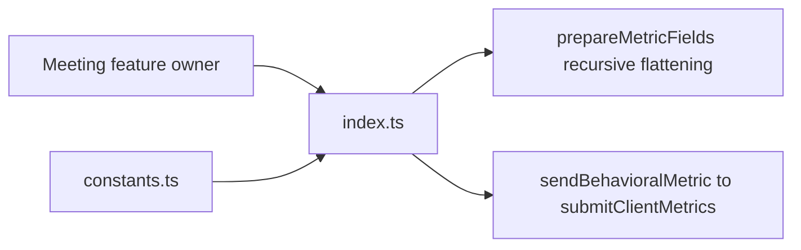
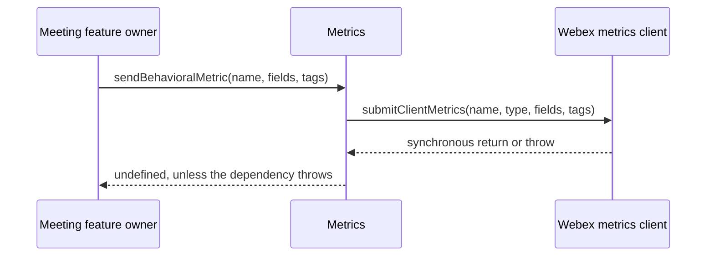
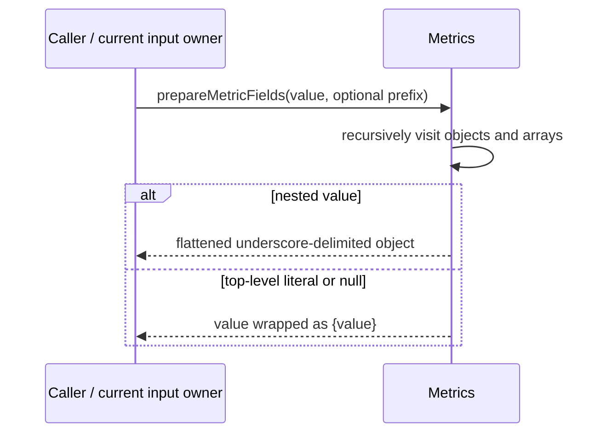
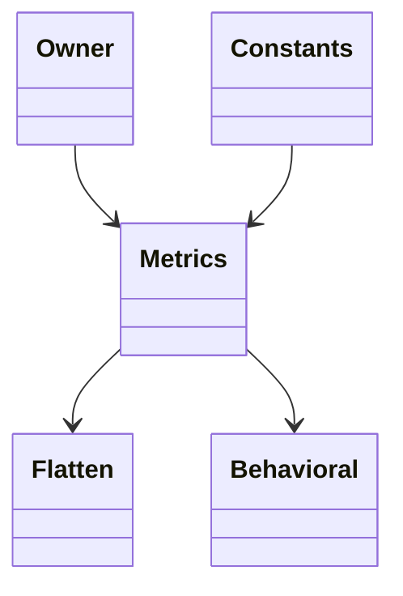

<!-- sdd-generated-metadata
doc_kind: module-spec
generated_from: module-spec@0.2.2
generator_plugin: repo-annotation@1.0.5+codex.20260818094939
generated_by: codex
approved_by: repository user
updated_at: 2026-08-22T15:21:29Z
validation_status: pass-with-warnings
-->
# METRICS — SPEC

> Start here → root [`AGENTS.md`](../../../AGENTS.md) · router [`SPEC_INDEX.md`](../../../ai-docs/SPEC_INDEX.md) · system [`ARCHITECTURE.md`](../../../ai-docs/ARCHITECTURE.md). This is the canonical source-local spec for `src/metrics/`.

## Metadata

| Field | Value |
|---|---|
| Module id | `metrics` |
| Source path(s) | `src/metrics/` |
| Parent spec | — |
| Doc kind | Module spec |
| Coverage score | 93% assessed 2026-08-22; 13/14 mandatory fields present; all critical and Important fields present; one noncritical polish gap remains; pending independent validation of the participant-role repair |
| Generated from | `module-spec` @ SDLC template library `0.2.2` |
| generated_by / approved_by / updated_at | codex / repository user / 2026-08-22T15:21:29Z |
| Validation status | pass-with-warnings |

## Evidence Rules

Requirements cite current source and mirrored tests. Current code wins over retained prose when they conflict; commit and PR history are excluded. Missing evidence stays a gap.

## Source Material Register

| Source material | Scope | Decision | Detail location or disposition |
|---|---|---|---|
| No routed legacy module spec | overview / API / behavior / tests | none; generated from current metrics implementation/constants and tests |
| Current source and mirrored tests | implementation / tests | verified | requirements, flows, failures, and test strategy below |

## Overview

`src/metrics/` contains 2 direct source/reference file(s) and has 1 mirrored unit-test file(s). This spec separates its public operations, runtime data movement, component ownership, state applicability, and verification boundary.

## Purpose / Responsibility

Initializes meeting behavioral telemetry, flattens metric fields, and submits established metric names/tags through the Webex metrics host.

## Stack

TypeScript/JavaScript in the Node 22.14 Yarn workspace; Webex core/plugin abstractions and Mocha/Sinon/`@webex/test-helper-chai` tests.

## Folder / Package Structure

```text
src/metrics/
├── constants.ts — module constants and wire values
├── index.ts — module facade/controller or primary exports
└── ai-docs/metrics-spec.md — canonical module specification
```

## Key Files (source of truth)

| File | Holds |
|---|---|
| `src/metrics/constants.ts` | module constants and wire values |
| `src/metrics/index.ts` | module facade/controller or primary exports |
| `test/unit/spec/metrics/index.js` | mirrored characterization/unit coverage |

## Public Surface

| Contract ID | Type | Surface | Purpose | Compatibility / deprecation | Schema / detail link | Root index |
|---|---|---|---|---|---|---|
| `metrics.1` | singleton setup | default singleton `initialSetup(webex)` | Store the Webex host used by later behavioral submissions. | Repeated setup replaces the host; there is no one-time guard or readiness check. | `src/metrics/index.ts` | [CONTRACTS](../../../ai-docs/CONTRACTS.md) |
| `metrics.2` | pure normalization | `prepareMetricFields(payload, prefix)` | Flatten nested objects/arrays and wrap root literals for clients that reject nested metric fields. | Preserve underscore path construction, array indices, and `{value}` root-literal behavior. | `src/metrics/index.ts` | [CONTRACTS](../../../ai-docs/CONTRACTS.md) |
| `metrics.3` | remote side effect | `sendBehavioralMetric(metricName, metricFields, metricTags)` | Forward the metric name, configured metrics type, fields, and tags to `submitClientMetrics()`. | The method returns `void` and does not expose an operational-metric API or promise. | `src/metrics/index.ts` | [CONTRACTS](../../../ai-docs/CONTRACTS.md) |

Compatibility notes:
- Prefer additive fields/options and preserve current return and rejection semantics. Internal helpers are not public merely because they are exported within the source directory.

## Requires (dependencies)

Webex metrics plugin/host, behavioral metric constants, logging/error handling, and callers in meeting/feature modules.

## Requirements

| ID | WHAT | WHY | Source Evidence | Test / Example Evidence | Assumptions / Gaps | Confidence |
|---|---|---|---|---|---|---|
| `METRICS-R-001` | `initialSetup(webex)` replaces the singleton's stored Webex host on every call. | Later behavioral submissions must use the host supplied by the owning SDK instance without implying an idempotence guard the implementation does not have. | `src/metrics/index.ts` | `test/unit/spec/metrics/index.js` | repeat setup is not covered explicitly | PRESENT |
| `METRICS-R-002` | `prepareMetricFields` recursively flattens objects and arrays into underscore-delimited keys and wraps a top-level literal as `{value}`. | The behavioral metrics client cannot accept nested field objects, so callers need a deterministic flattening helper. | `src/metrics/index.ts` | `test/unit/spec/metrics/index.js` | no cycle or size bound is implemented | PRESENT |
| `METRICS-R-003` | `sendBehavioralMetric` calls `webex.internal.metrics.submitClientMetrics` with the configured metric type, supplied fields, and tags; the method returns no independent result. | The facade must preserve the actual behavioral-metrics boundary without inventing an operational-metrics API or lifecycle guarantee. | `src/metrics/index.ts` | `test/unit/spec/metrics/index.js` | thrown dependency errors propagate synchronously | PRESENT |

## Design Overview

`src/metrics/index.ts` is a singleton facade that stores the current Webex host, flattens caller-supplied fields, and forwards behavioral metrics to `submitClientMetrics`. `constants.ts` defines meeting metric names and fields. The module owns no listener, timer, or remote controller.

## Data Flow



## Sequence Diagram(s)

Sequence coverage:

| Operation group | Diagram | Failure coverage |
|---|---|---|
| UC-1…UC-2 — behavioral metrics operation groups | Behavioral metrics primary sequence | uninitialized host submission failure and nested/array/literal field normalization |
| UC-2 — field preparation | Behavioral metrics alternate/failure sequence | literal, array, object, and optional-prefix branches |

### Behavioral metrics primary sequence



### Behavioral metrics alternate/failure sequence



## Class / Component Relationships



The arrows identify ownership and delegation inside `src/metrics/`; files that only declare types or constants are not presented as transports.

## Use Cases

- **UC-1:** Initialize the singleton with a Webex host and forward a named behavioral metric with configured type plus caller-supplied fields/tags. Evidence: `src/metrics/index.ts`.
- **UC-2:** Flatten nested objects, arrays, prefixed values, null, and root literals into the exact field shape accepted by the metrics client. Evidence: `src/metrics/index.ts`.

## Business Rules & Invariants

- Behavioral submission requires `initialSetup` to have assigned a Webex host; the facade does not validate metric names or remove sensitive fields. Flattening is deterministic but unbounded, so callers remain responsible for bounded, non-sensitive input. Enforced under `src/metrics/`.

## Pitfalls

- Flattening arbitrary service payloads can create unbounded or sensitive tags. Callers must submit an intentional bounded projection.
- Verify both typed constants/enums and raw wire values before changing a logical condition in this legacy package.

## Test-Case Strategy (module)

Use the current mirrored suites: `test/unit/spec/metrics/index.js`. Characterize the metrics-specific use cases above and each listed failure condition; add cleanup or transition cases only for resources and state this module actually owns.

| Behavior / Requirement | Existing test evidence | Gap |
|---|---|---|
| `METRICS-R-001` | `test/unit/spec/metrics/index.js` | cover singleton setup, submission, and recursive flattening branches |
| `METRICS-R-002` | `test/unit/spec/metrics/index.js` | extend the flattening matrix for nested arrays, prefixed primitives, and null values |
| `METRICS-R-003` | `test/unit/spec/metrics/index.js` | assert the exact `submitClientMetrics` call and the method's `undefined` return |

## Traceability

- Repo architecture: [`ARCHITECTURE.md`](../../../ai-docs/ARCHITECTURE.md) · Registry: [`SPEC_INDEX.md`](../../../ai-docs/SPEC_INDEX.md)
- Coverage state and contracts baseline: `../../../.sdd/manifest.json`
