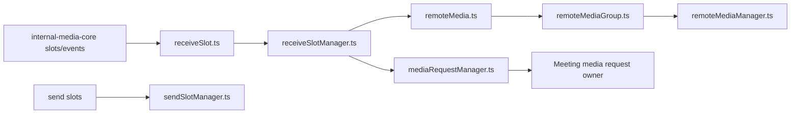
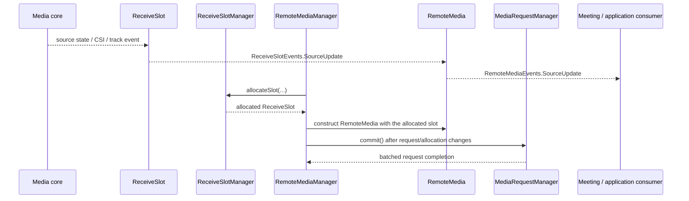
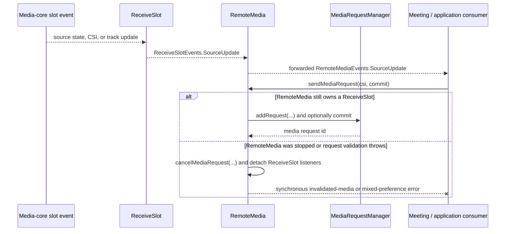
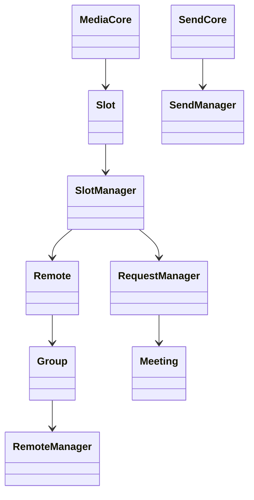

<!-- sdd-generated-metadata
doc_kind: module-spec
generated_from: module-spec@0.2.2
generator_plugin: repo-annotation@1.0.5+codex.20260818094939
generated_by: codex
approved_by: repository user
updated_at: 2026-08-22T15:21:29Z
validation_status: pass-with-warnings
-->
# MULTISTREAM — SPEC

> Start here → root [`AGENTS.md`](../../../AGENTS.md) · router [`SPEC_INDEX.md`](../../../ai-docs/SPEC_INDEX.md) · system [`ARCHITECTURE.md`](../../../ai-docs/ARCHITECTURE.md). This is the canonical source-local spec for `src/multistream/`.

## Metadata

| Field | Value |
|---|---|
| Module id | `multistream` |
| Source path(s) | `src/multistream/` |
| Parent spec | — |
| Doc kind | Module spec |
| Coverage score | 93% assessed 2026-08-22; 13/14 mandatory fields present; all critical and Important fields present; one noncritical polish gap remains; pending independent validation of the participant-role repair |
| Generated from | `module-spec` @ SDLC template library `0.2.2` |
| generated_by / approved_by / updated_at | codex / repository user / 2026-08-22T15:21:29Z |
| Validation status | pass-with-warnings |

## Evidence Rules

Requirements cite current implementation and mirrored unit-test paths. Current code wins over retained prose when they conflict; commit and PR history are excluded by repository-owner decision. Missing test evidence is stated as a gap rather than inferred.

## Source Material Register

| Source material | Scope | Decision | Detail location or disposition |
|---|---|---|---|
| No routed legacy module spec | overview / API / behavior / tests | none; generated from current slot/remote-media managers and tests |
| Current source and mirrored tests | implementation / tests | verified | requirements, flows, failures, and test strategy below |

## Overview

`src/multistream/` contains 7 direct source/reference file(s) and has 7 mirrored unit-test file(s). This spec separates its public operations, runtime data movement, component ownership, state applicability, and verification boundary.

## Purpose / Responsibility

Maps multistream media-core slots to stable remote-media objects/groups and arbitrates send/receive requests.

## Stack

TypeScript/JavaScript in the Node 22.14 Yarn workspace; Webex core/plugin abstractions and Mocha/Sinon/`@webex/test-helper-chai` tests. Build target: `yarn workspace @webex/plugin-meetings build:src`.

## Folder / Package Structure

```text
src/multistream/
├── mediaRequestManager.ts — request coordination or payload types
├── receiveSlot.ts — receiveSlot implementation responsibility
├── receiveSlotManager.ts — receiveSlotManager implementation responsibility
├── remoteMedia.ts — remoteMedia implementation responsibility
├── remoteMediaGroup.ts — remoteMediaGroup implementation responsibility
├── remoteMediaManager.ts — remoteMediaManager implementation responsibility
├── sendSlotManager.ts — sendSlotManager implementation responsibility
└── ai-docs/multistream-spec.md — canonical module specification
```

## Key Files (source of truth)

| File | Holds |
|---|---|
| `src/multistream/mediaRequestManager.ts` | request coordination or payload types |
| `src/multistream/receiveSlot.ts` | receiveSlot implementation responsibility |
| `src/multistream/receiveSlotManager.ts` | receiveSlotManager implementation responsibility |
| `src/multistream/remoteMedia.ts` | remoteMedia implementation responsibility |
| `src/multistream/remoteMediaGroup.ts` | remoteMediaGroup implementation responsibility |
| `src/multistream/remoteMediaManager.ts` | remoteMediaManager implementation responsibility |
| `src/multistream/sendSlotManager.ts` | sendSlotManager implementation responsibility |
| `test/unit/spec/multistream/mediaRequestManager.ts` and 6 sibling test file(s) | mirrored characterization/unit coverage |

## Public Surface

| Contract ID | Type | Surface | Purpose | Compatibility / deprecation | Schema / detail link | Root index |
|---|---|---|---|---|---|---|
| `multistream.1` | SDK / in-process | `ReceiveSlot`: `memberId`, `csi`, `sourceState`, `stream`, `setMaxFs()`, `findMemberId()`, `logString()`, and `wcmeReceiveSlot` | Expose one stable wrapper around a media-core receive slot and its resolved participant/source state. | Preserve accessors and source-state event behavior across slot reassignment. | `src/multistream/receiveSlot.ts` | [CONTRACTS](../../../ai-docs/CONTRACTS.md) |
| `multistream.2` | SDK / lifecycle | `ReceiveSlotManager.allocateSlot()`, `releaseSlot()`, `reset()`, `getStats()`, `updateMemberIds()`, `findReceiveSlotBySsrc()` | Allocate, recycle, inspect, and reconcile the finite receive-slot pool. | `releaseSlot()` only moves the same slot object from the allocated pool to the free pool; it does not reset CSI/member/source state or detach listeners. | `src/multistream/receiveSlotManager.ts` | [CONTRACTS](../../../ai-docs/CONTRACTS.md) |
| `multistream.3` | SDK / in-process | `RemoteMedia.setSizeHint()`, `getEffectiveMaxFs()`, `stop()`, `sendMediaRequest()`, `cancelMediaRequest()`, `mediaType`, `memberId`, `csi`, `sourceState`, `stream`, and `getUnderlyingReceiveSlot()` | Give consumers a stable remote-media identity while its underlying slot and request change. | `stop()` cancels the request and removes owned slot listeners; it is not an async transport result. | `src/multistream/remoteMedia.ts` | [CONTRACTS](../../../ai-docs/CONTRACTS.md) |
| `multistream.4` | SDK / in-process | `RemoteMediaGroup.getRemoteMedia()`, `setActiveSpeakerCsis()`, `pin()`, `unpin()`, `isPinned()`, `setPreferLiveVideo()`, `setNamedMediaGroup()`, `stop()`, `includes()`, and `getEffectiveMaxFs()` | Coordinate a related set of stable remote-media objects and pin/preference policy. | Preserve group membership and pinning semantics when layouts change. | `src/multistream/remoteMediaGroup.ts` | [CONTRACTS](../../../ai-docs/CONTRACTS.md) |
| `multistream.5` | SDK / lifecycle | `RemoteMediaManager.start()`, `stop()`, `setLayout()`, `getLayoutId()`, `setPreferLiveVideo()`, `setActiveSpeakerCsis()`, `setReceiveNamedMediaGroup()`, `logAllReceiveSlots()`, `setRemoteVideoCsis()`, `setRemoteVideoCsi()`, `addMemberVideoPane()`, `removeMemberVideoPane()`, `pinActiveSpeakerVideoPane()`, `unpinActiveSpeakerVideoPane()`, and `isPinned()` | Translate meeting layout and CSI intent into remote-media groups and receive-slot assignments. | Preserve manager-scoped event/listener cleanup and current layout identifiers. | `src/multistream/remoteMediaManager.ts` | [CONTRACTS](../../../ai-docs/CONTRACTS.md) |
| `multistream.6` | SDK / in-process | `MediaRequestManager.addRequest()`, `cancelRequest()`, `commit()`, `reset()`, `setDegradationPreferences()`, and `setNumCurrentSources()` | Batch active-speaker/receiver-selected constraints and synchronously deliver `StreamRequest[]` to media core. | Mixed active-speaker `preferLiveVideo` values throw synchronously; the callback returns `void`. | `src/multistream/mediaRequestManager.ts` | [CONTRACTS](../../../ai-docs/CONTRACTS.md) |
| `multistream.7` | SDK / lifecycle | `SendSlotManager.createSlot()`, `getSlot()`, `setNamedMediaGroups()`, `setSourceStateOverride()`, `publishStream()`, `unpublishStream()`, `setActive()`, `setCodecParameters()`, `deleteCodecParameters()`, `setCustomCodecParameters()`, `markCustomCodecParametersForDeletion()`, and `reset()` | Own outgoing media-core send-slot publication and codec configuration. | Preserve explicit publication and codec-deletion operations. | `src/multistream/sendSlotManager.ts` | [CONTRACTS](../../../ai-docs/CONTRACTS.md) |
| `multistream.8` | exported layout/configuration | `VideoLayout`, `ActiveSpeakerVideoPaneGroup`, `MemberVideoPane`, `Configuration`, `DefaultConfiguration`, `Event`, `Events`, `LayoutId`, `PaneSize`, `PaneId`, `PaneGroupId`, and `VideoLayoutChangedEventData` | Define the layout model and events consumed by `RemoteMediaManager`. | Add layout fields and events compatibly; existing ids and defaults are observable. | `src/multistream/remoteMediaManager.ts` | [CONTRACTS](../../../ai-docs/CONTRACTS.md) |
| `multistream.9` | exported media contracts | `AV1_CODEC_PARAMETERS`, `H264_CODEC_PARAMETERS`, `ActiveSpeakerPolicyInfo`, `ReceiverSelectedPolicyInfo`, `PolicyInfo`, `H264CodecInfo`, `CodecInfo`, `MediaRequest`, `MediaRequestId`, `ReceiveSlotEvents`, `StreamState`, `CSI`, `MemberId`, `ReceiveSlotId`, `FindMemberIdCallback`, `CreateSlotCallback`, `RemoteMediaEvents`, `RemoteVideoResolution`, `MAX_FS_VALUES`, `getMaxFs()`, and `RemoteMediaId` | Share the exact request, codec, resolution, event, and identity vocabulary across Meeting and media-core adapters. | `StreamState` is imported and re-exported from `@webex/internal-media-core` by `receiveSlot.ts`, not defined locally; preserve that upstream type identity plus raw codec values, max-fs mapping, event names, and other identifier types. | `src/multistream/receiveSlot.ts`, `src/multistream/` | [CONTRACTS](../../../ai-docs/CONTRACTS.md) |

### Emitted events

These are object-local `EventsScope` emissions on exported consumer-reachable classes, not package-wide `Trigger`/`TriggerProxy` events. Preserve each literal, emitting object, timing, and payload.

| Emitter | Event literal | Timing | Payload | Emission evidence |
|---|---|---|---|---|
| `ReceiveSlot` | `sourceUpdate` | After an internal-media-core source update refreshes state/CSI/member id, or when `findMemberId()` later resolves a previously unknown member. | `{state, csi, memberId}` | `src/multistream/receiveSlot.ts` |
| `ReceiveSlot` | `maxFsUpdate` | Synchronously when `setMaxFs(newFs)` is called. | `{maxFs: newFs}` | `src/multistream/receiveSlot.ts` |
| `RemoteMedia` | `sourceUpdate` | When the associated `ReceiveSlot` emits `sourceUpdate`; the same payload is forwarded. | `{state, csi, memberId}` | `src/multistream/remoteMedia.ts` |
| `RemoteMedia` | `stopped` | After `stop()` cancels its request, removes receive-slot listeners, and clears the slot association. | `{}` | `src/multistream/remoteMedia.ts` |
| `RemoteMediaManager` | `AudioCreated` | After the main-audio `RemoteMediaGroup` is created during startup. | main-audio `RemoteMediaGroup` | `src/multistream/remoteMediaManager.ts` |
| `RemoteMediaManager` | `InterpretationAudioCreated` | After a configured interpretation/named-audio `RemoteMediaGroup` is created. | interpretation-audio `RemoteMediaGroup` | `src/multistream/remoteMediaManager.ts` |
| `RemoteMediaManager` | `ScreenShareAudioCreated` | After screen-share audio slots exist and their `RemoteMediaGroup` is created. | screen-share-audio `RemoteMediaGroup` | `src/multistream/remoteMediaManager.ts` |
| `RemoteMediaManager` | `VideoLayoutChanged` | After `setLayout()` updates receive slots and remote-media objects for the selected layout. | `VideoLayoutChangedEventData` (`layoutId`, active-speaker groups, member panes, optional screen-share video) | `src/multistream/remoteMediaManager.ts` |

Compatibility notes:
- Prefer additive options and payload fields. Preserve method/event names, rejection semantics, and cleanup timing; route public changes through `src/index.ts` or the documented owning object.

## Requires (dependencies)

internal-media-core multistream connection, member CSI data, codecs, event callbacks, and Meeting media state.

## Requirements

| ID | WHAT | WHY | Source Evidence | Test / Example Evidence | Assumptions / Gaps | Confidence |
|---|---|---|---|---|---|---|
| `MULTISTREAM-R-001` | manage receive slots and remote-media groups. | Maps multistream media-core slots to stable remote-media objects/groups and arbitrates send/receive requests. | `src/multistream/remoteMediaManager.ts` | `test/unit/spec/multistream/remoteMediaManager.ts` | none | PRESENT |
| `MULTISTREAM-R-002` | Map member/CSI/layout requests to media-core. `ReceiveSlotManager.releaseSlot()` changes pool membership only; any association/listener cleanup must already be owned by `RemoteMedia.stop()`, request cancellation, or the surrounding manager flow. | Member, CSI, slot, and layout mappings must remain consistent while media-core reuses transport resources, without assigning cleanup behavior to a pool operation that does not perform it. | `src/multistream/remoteMediaManager.ts`, `src/multistream/receiveSlotManager.ts`, `src/multistream/remoteMedia.ts` | `test/unit/spec/multistream/remoteMediaManager.ts`, `test/unit/spec/multistream/receiveSlotManager.ts` | simultaneous slot reuse and layout change needs listener-identity coverage | PRESENT |
| `MULTISTREAM-R-003` | `MediaRequestManager` performs synchronous validation and calls its `sendMediaRequestsCallback(StreamRequest[])`, whose return type is `void`; it has no async rejection path. A mix of active-speaker requests with different `preferLiveVideo` values throws synchronously. `RemoteMedia.stop()` and request cancellation detach their owned associations/listeners; `releaseSlot()` does not. | Callers must handle the implemented synchronous validation boundary without inventing a rejected media-request promise, and cleanup must remain attributed to the object that performs it. | `src/multistream/mediaRequestManager.ts`, `src/multistream/remoteMedia.ts`, `src/multistream/receiveSlotManager.ts` | `test/unit/spec/multistream/mediaRequestManager.ts`, `test/unit/spec/multistream/remoteMedia.ts`, `test/unit/spec/multistream/receiveSlotManager.ts` | none | PRESENT |
| `MULTISTREAM-R-004` | RemoteMedia identity remains stable while tracks/receive slots and member CSI mappings change. Exported `ReceiveSlot`, `RemoteMedia`, and `RemoteMediaManager` objects emit the object-local event literals and payloads listed above at their concrete update/creation/stop boundaries. | Consumers keep references to remote media across layout and transport updates and rely on scoped events to know when those stable objects change. | `src/multistream/receiveSlot.ts`, `src/multistream/remoteMedia.ts`, `src/multistream/remoteMediaManager.ts` | `test/unit/spec/multistream/receiveSlot.ts`, `test/unit/spec/multistream/remoteMedia.ts`, `test/unit/spec/multistream/remoteMediaManager.ts` | none | PRESENT |
| `MULTISTREAM-R-005` | `RemoteMedia.stop()` cancels its request, removes listeners from its receive slot, and invalidates the association. `MediaRequestManager.cancelRequest()` removes its `SourceUpdate` and `MaxFsUpdate` handlers from every request slot before deletion. | Slot reuse must not deliver another participant's media or request callbacks through stale listeners. | `src/multistream/remoteMedia.ts`, `src/multistream/mediaRequestManager.ts` | `test/unit/spec/multistream/remoteMedia.ts`, `test/unit/spec/multistream/mediaRequestManager.ts` | none | PRESENT |
| `MULTISTREAM-R-006` | Media request arbitration and send-slot management preserve the latest supported layout/send intent. | Concurrent layout/member changes should not apply obsolete stream requests. | `src/multistream/mediaRequestManager.ts`, `src/multistream/sendSlotManager.ts` | `test/unit/spec/multistream/mediaRequestManager.ts`, `test/unit/spec/multistream/sendSlotManager.ts` | none | PRESENT |

## Design Overview

The module is a set of cooperating media managers rather than one entry controller: receive slots project remote sources, remote-media groups expose them, the media-request manager batches receive requests, and the send-slot manager applies source-state overrides.

## Data Flow



## Sequence Diagram(s)

Sequence coverage:

| Operation group | Diagram | Failure coverage |
|---|---|---|
| UC-1…UC-6 — multistream slot and request operation groups | Multistream slot and request primary sequence | unknown/reused slot, pool-only release, removed source, mixed-preference validation, and owner-specific listener detachment |
| UC-1…UC-6 — multistream slot and request alternate/failure paths | Multistream slot and request alternate/failure sequence | unknown slot/CSI, removed remote source, conflicting slot assignment, or mixed `preferLiveVideo` validation |

### Multistream slot and request primary sequence



### Multistream slot and request alternate/failure sequence



## Class / Component Relationships



The arrows identify ownership and delegation inside `src/multistream/`; files that only declare types or constants are not presented as transports.

## Use Cases

- **UC-1:** Allocate receive slots and return them to the free pool. `releaseSlot()` preserves the slot object's current CSI/member/source/listener state; callers must perform any required association cleanup through its actual owner before pool reuse. Evidence: `src/multistream/receiveSlotManager.ts`, `src/multistream/receiveSlot.ts`, `src/multistream/remoteMedia.ts`.
- **UC-2:** Keep a `RemoteMedia` identity stable as its receive slot, track, source state, member id, or size hint changes. Evidence: `src/multistream/remoteMedia.ts`.
- **UC-3:** Build remote-media groups, switch layouts, update active-speaker/CSI intent, and pin or unpin the active-speaker pane. Evidence: `src/multistream/remoteMediaGroup.ts`, `src/multistream/remoteMediaManager.ts`.
- **UC-4:** Add, cancel, and commit media requests, applying degradation and current-source limits before synchronously delivering `StreamRequest[]`. Evidence: `src/multistream/mediaRequestManager.ts`.
- **UC-5:** Reject a commit synchronously when active-speaker request groups disagree on `preferLiveVideo`. Evidence: `src/multistream/mediaRequestManager.ts`.
- **UC-6:** Publish/unpublish outgoing send slots and update named media groups, source-state overrides, active state, and codec parameters. Evidence: `src/multistream/sendSlotManager.ts`.

## State Model

Receive/send slots, remote-media objects/groups, requested layouts, CSI mappings, and pending media requests live for the connection lifetime.

## Business Rules & Invariants

- A slot has one active owner/mapping while allocated. Returning it to the free pool does not itself detach tracks/listeners or reset CSI/member/source state; `RemoteMedia.stop()` and request cancellation own their respective cleanup. Object-local emissions retain the exact literals/payloads listed under Public Surface, and request arbitration preserves the latest supported layout intent. Enforced by current code under `src/multistream/`.

## Concurrency & Reactive Flow

- Receive-slot and RemoteMedia identity is checked at each association change. `RemoteMedia.stop()` and `MediaRequestManager.cancelRequest()` detach the listeners they own; `ReceiveSlotManager.releaseSlot()` only changes pool membership. `MediaRequestManager` arbitrates changed constraints so a superseded slot/group does not consume a later request result.

## State Machine


The diagram records the initialized `no source` value and the `live` source path consumed by current multistream code and tests.

## Protocol / Wire Format

- External payloads are parsed/serialized by files under `src/multistream/` and existing Webex/media dependencies. Preserve current field names, enum/raw values, sequence identifiers, and compatibility behavior; do not treat the normalized client model as the wire schema.

## Error Handling & Failure Modes

| Condition | Signal | Caller recovery |
|---|---|---|
| Slot/CSI is unknown or a remote source is removed | The owning association is absent or detached by its `RemoteMedia`/request lifecycle. Merely calling `releaseSlot()` changes pool membership and provides no cleanup signal. | Reconcile against the current slot/member mapping and invoke the actual association owner before returning a slot to the pool. |
| Active-speaker requests mix different `preferLiveVideo` values | `MediaRequestManager.commit()` throws synchronously before delivering stream requests. | Make the grouped active-speaker policy consistent, then commit again. |
| Current slot reports a live source | The stable `RemoteMedia` object receives the slot/track update and emits its scoped update. | Continue using the stable remote-media identity. |

## Pitfalls

- Remote-media identity is not the same as a transient track or slot. Recreating objects on every update breaks consumer references.
- `Event.InterpretationAudioCreated` is emitted at runtime, but the current exported `Events` interface does not declare its callback alongside the other manager events. Treat the runtime event as observable and the type-interface omission as a separate possible product/type defect.
- Public behavior may be reachable through a parent `Meeting`/`Meetings` object even when the source helper is not exported directly.

## Key Design Trade-off

- Stable remote-media objects are favored over exposing raw media-core slots, requiring explicit mapping and lifecycle management.

## Test-Case Strategy (module)

Use the current mirrored suites: `test/unit/spec/multistream/mediaRequestManager.ts`, `test/unit/spec/multistream/receiveSlot.ts`, `test/unit/spec/multistream/receiveSlotManager.ts`, `test/unit/spec/multistream/remoteMedia.ts`, `test/unit/spec/multistream/remoteMediaGroup.ts`, `test/unit/spec/multistream/remoteMediaManager.ts`, `test/unit/spec/multistream/sendSlotManager.ts`. Characterize the multistream-specific use cases above and each listed failure condition; add cleanup or transition cases only for resources and state this module actually owns.

| Behavior / Requirement | Existing test evidence | Gap |
|---|---|---|
| `MULTISTREAM-R-001` | `test/unit/spec/multistream/remoteMediaManager.ts` | cover each receive-slot, remote-media/group/manager, request-manager, layout, and send-slot family |
| `MULTISTREAM-R-002` | `test/unit/spec/multistream/remoteMediaManager.ts` | simultaneous slot reuse and layout change needs listener-identity coverage |
| `MULTISTREAM-R-003` | `test/unit/spec/multistream/mediaRequestManager.ts` | assert the synchronous mixed-`preferLiveVideo` throw and that the `void` callback is not treated as a promise |
| `MULTISTREAM-R-004` | `test/unit/spec/multistream/remoteMedia.ts`, `test/unit/spec/multistream/remoteMediaManager.ts` | none |
| `MULTISTREAM-R-005` | `test/unit/spec/multistream/receiveSlot.ts`, `test/unit/spec/multistream/receiveSlotManager.ts`, `test/unit/spec/multistream/remoteMedia.ts` | verify rapid slot reuse while distinguishing pool-only release from RemoteMedia/request listener cleanup |
| `MULTISTREAM-R-006` | `test/unit/spec/multistream/mediaRequestManager.ts`, `test/unit/spec/multistream/sendSlotManager.ts` | verify stale request suppression |

## Traceability

- Repo architecture: [`ARCHITECTURE.md`](../../../ai-docs/ARCHITECTURE.md) · Registry: [`SPEC_INDEX.md`](../../../ai-docs/SPEC_INDEX.md)
- Coverage state and contracts baseline: `../../../.sdd/manifest.json`
