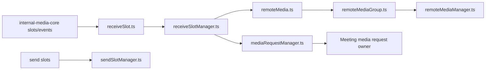
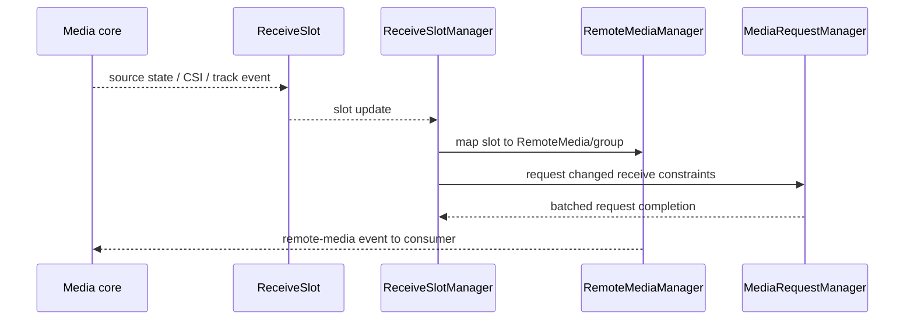
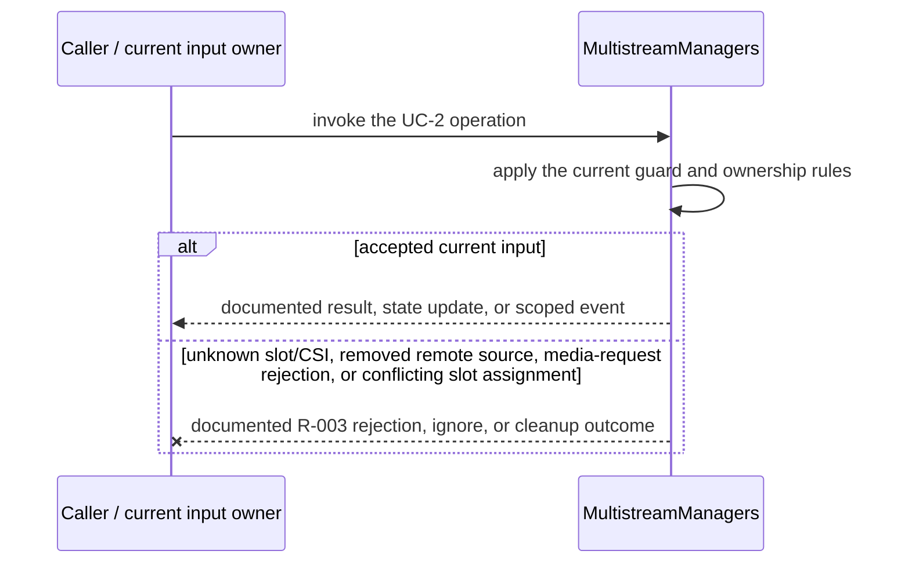
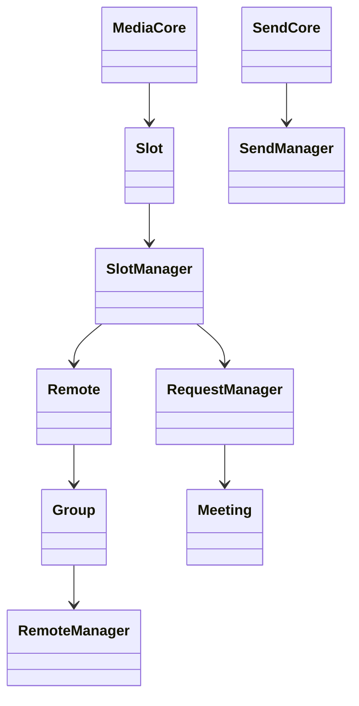
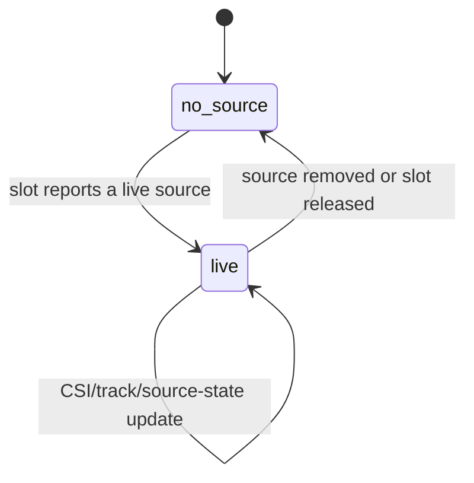

<!-- sdd-generated-metadata
doc_kind: module-spec
generated_from: module-spec@0.2.2
generator_plugin: repo-annotation@1.0.5+codex.20260818094939
generated_by: codex
approved_by: repository user
updated_at: 2026-08-21T06:10:05Z
validation_status: not-run
-->
# MULTISTREAM — SPEC

> Start here → root [`AGENTS.md`](../../../AGENTS.md) · router [`SPEC_INDEX.md`](../../../ai-docs/SPEC_INDEX.md) · system [`ARCHITECTURE.md`](../../../ai-docs/ARCHITECTURE.md). This is the canonical source-local spec for `src/multistream/`.

## Metadata

| Field | Value |
|---|---|
| Module id | `multistream` |
| Source path(s) | `src/multistream/` |
| Parent spec | — |
| Doc kind | Module spec |
| Coverage score | 93% assessed 2026-08-21; 13/14 mandatory fields present; all critical and Important fields present; one noncritical polish gap remains |
| Generated from | `module-spec` @ SDLC template library `0.2.2` |
| generated_by / approved_by / updated_at | codex / repository user / 2026-08-21T06:10:05Z |
| Validation status | not-run |

## Evidence Rules

Requirements cite current implementation and mirrored unit-test paths. Current code wins over retained prose when they conflict; commit and PR history are excluded by repository-owner decision. Missing test evidence is stated as a gap rather than inferred.

## Source Material Register

| Source material | Scope | Decision | Detail location or disposition |
|---|---|---|---|
| No routed legacy module spec | overview / API / behavior / tests | none; generated from current slot/remote-media managers and tests |
| Current source and mirrored tests | implementation / tests | verified | requirements, flows, failures, and test strategy below |

## Overview

`src/multistream/` contains 7 direct source/reference file(s) and has 7 mirrored unit-test file(s). This spec separates its public operations, runtime data movement, component ownership, state applicability, and verification boundary.

## Purpose / Responsibility

Maps multistream media-core slots to stable remote-media objects/groups and arbitrates send/receive requests.

## Stack

TypeScript/JavaScript in the Node 22.14 Yarn workspace; Webex core/plugin abstractions and Mocha/Sinon/`@webex/test-helper-chai` tests. Build target: `yarn workspace @webex/plugin-meetings build:src`.

## Folder / Package Structure

```text
src/multistream/
├── mediaRequestManager.ts — request coordination or payload types
├── receiveSlot.ts — receiveSlot implementation responsibility
├── receiveSlotManager.ts — receiveSlotManager implementation responsibility
├── remoteMedia.ts — remoteMedia implementation responsibility
├── remoteMediaGroup.ts — remoteMediaGroup implementation responsibility
├── remoteMediaManager.ts — remoteMediaManager implementation responsibility
├── sendSlotManager.ts — sendSlotManager implementation responsibility
└── ai-docs/multistream-spec.md — canonical module specification
```

## Key Files (source of truth)

| File | Holds |
|---|---|
| `src/multistream/mediaRequestManager.ts` | request coordination or payload types |
| `src/multistream/receiveSlot.ts` | receiveSlot implementation responsibility |
| `src/multistream/receiveSlotManager.ts` | receiveSlotManager implementation responsibility |
| `src/multistream/remoteMedia.ts` | remoteMedia implementation responsibility |
| `src/multistream/remoteMediaGroup.ts` | remoteMediaGroup implementation responsibility |
| `src/multistream/remoteMediaManager.ts` | remoteMediaManager implementation responsibility |
| `src/multistream/sendSlotManager.ts` | sendSlotManager implementation responsibility |
| `test/unit/spec/multistream/mediaRequestManager.ts` and 6 sibling test file(s) | mirrored characterization/unit coverage |

## Public Surface

| Contract ID | Type | Surface | Purpose | Compatibility / deprecation | Schema / detail link | Root index |
|---|---|---|---|---|---|---|
| `multistream.1` | SDK / in-process / remote | manage receive slots and remote-media groups | Preserve the module responsibility through a focused operation group | Consumer-visible methods/events are semver-sensitive when reachable from package objects | `src/multistream/remoteMediaManager.ts` | [CONTRACTS](../../../ai-docs/CONTRACTS.md) |
| `multistream.2` | SDK / in-process / remote | map member/CSI/layout requests to media-core | Preserve the module responsibility through a focused operation group | Consumer-visible methods/events are semver-sensitive when reachable from package objects | `src/multistream/remoteMediaManager.ts` | [CONTRACTS](../../../ai-docs/CONTRACTS.md) |
| `multistream.3` | SDK / in-process / remote | manage send slots and media request ordering | Preserve the module responsibility through a focused operation group | Consumer-visible methods/events are semver-sensitive when reachable from package objects | `src/multistream/remoteMediaManager.ts` | [CONTRACTS](../../../ai-docs/CONTRACTS.md) |

Compatibility notes:
- Prefer additive options and payload fields. Preserve method/event names, rejection semantics, and cleanup timing; route public changes through `src/index.ts` or the documented owning object.

## Requires (dependencies)

internal-media-core multistream connection, member CSI data, codecs, event callbacks, and Meeting media state.

## Requirements

| ID | WHAT | WHY | Source Evidence | Test / Example Evidence | Assumptions / Gaps | Confidence |
|---|---|---|---|---|---|---|
| `MULTISTREAM-R-001` | manage receive slots and remote-media groups. | Maps multistream media-core slots to stable remote-media objects/groups and arbitrates send/receive requests. | `src/multistream/remoteMediaManager.ts` | `test/unit/spec/multistream/remoteMediaManager.ts` | none | PRESENT |
| `MULTISTREAM-R-002` | map member/CSI/layout requests to media-core. | Callers need deterministic observable behavior across async Webex inputs. | `src/multistream/remoteMediaManager.ts`, `src/multistream/receiveSlotManager.ts` | `test/unit/spec/multistream/remoteMediaManager.ts` | additional edge cases may live in sibling tests | PRESENT |
| `MULTISTREAM-R-003` | Media-request failures reject through the request manager; slot/group removal detaches the owned associations and event subscriptions before reuse. | Callers must receive the actual module failure outcome without false cleanup or event guarantees. | `src/multistream/` | `test/unit/spec/multistream/remoteMediaManager.ts` | none | PRESENT |
| `MULTISTREAM-R-004` | RemoteMedia identity remains stable while tracks/receive slots and member CSI mappings change. | Consumers keep references to remote media across layout and transport updates. | `src/multistream/remoteMedia.ts`, `src/multistream/remoteMediaManager.ts` | `test/unit/spec/multistream/remoteMedia.ts`, `test/unit/spec/multistream/remoteMediaManager.ts` | none | PRESENT |
| `MULTISTREAM-R-005` | Receive-slot allocation/release maintains one active mapping and detaches old listeners/tracks. | Slot reuse must not deliver another participant's media through a stale object. | `src/multistream/receiveSlot.ts`, `src/multistream/receiveSlotManager.ts` | `test/unit/spec/multistream/receiveSlot.ts`, `test/unit/spec/multistream/receiveSlotManager.ts` | none | PRESENT |
| `MULTISTREAM-R-006` | Media request arbitration and send-slot management preserve the latest supported layout/send intent. | Concurrent layout/member changes should not apply obsolete stream requests. | `src/multistream/mediaRequestManager.ts`, `src/multistream/sendSlotManager.ts` | `test/unit/spec/multistream/mediaRequestManager.ts`, `test/unit/spec/multistream/sendSlotManager.ts` | none | PRESENT |

## Design Overview

The module is a set of cooperating media managers rather than one entry controller: receive slots project remote sources, remote-media groups expose them, the media-request manager batches receive requests, and the send-slot manager applies source-state overrides.

## Data Flow



## Sequence Diagram(s)

Sequence coverage:

| Operation group | Diagram | Failure coverage |
|---|---|---|
| UC-1 — primary operation | Primary operation sequence | accepted and rejected dependency outcomes |
| UC-2 — secondary/change operation | Secondary operation and failure sequence | unknown slot/CSI, removed remote source, media-request rejection, or conflicting slot assignment |

### Primary operation sequence



### Secondary operation and failure sequence



## Class / Component Relationships



The arrows identify ownership and delegation inside `src/multistream/`; files that only declare types or constants are not presented as transports.

## Use Cases

- **UC-1:** Map receive-slot source and track changes into stable `RemoteMedia` objects and groups. Evidence: `src/multistream/`.
- **UC-2:** Batch receive constraints and propagate send-source overrides without duplicating slot ownership. Evidence: `src/multistream/`.

## State Model

Receive/send slots, remote-media objects/groups, requested layouts, CSI mappings, and pending media requests live for the connection lifetime.

## Business Rules & Invariants

- A slot has one active owner/mapping; released slots detach tracks/listeners; request arbitration preserves the latest supported layout intent. Enforced by `src/multistream/remoteMediaManager.ts` and supporting code under `src/multistream/`.

## Concurrency & Reactive Flow

- Async work owned by `MultistreamManagers` may complete after a newer caller or remote input. Preserve the identity, sequence, and resource-owner guards in `src/multistream/`; a late completion must not replay UC-2 for superseded state.

## State Machine



The diagram records the initialized `no source` value and the `live` source path consumed by current multistream code and tests.

## Protocol / Wire Format

- External payloads are parsed/serialized by files under `src/multistream/` and existing Webex/media dependencies. Preserve current field names, enum/raw values, sequence identifiers, and compatibility behavior; do not treat the normalized client model as the wire schema.

## Error Handling & Failure Modes

| Condition | Signal | Caller recovery |
|---|---|---|
| unknown slot/CSI, removed remote source, media-request rejection, or conflicting slot assignment | Follow the concrete rejection, ignore, state, or cleanup behavior in the module's R-003 requirement. | Resolve the named condition; retry only when another requirement defines a bound. |
| UC-1 succeeds | Return, update, callback, or scoped event identified by the Public Surface and primary sequence. | Continue from the owning module's accepted state. |

## Pitfalls

- Remote-media identity is not the same as a transient track or slot. Recreating objects on every update breaks consumer references.
- Public behavior may be reachable through a parent `Meeting`/`Meetings` object even when the source helper is not exported directly.

## Key Design Trade-off

- Stable remote-media objects are favored over exposing raw media-core slots, requiring explicit mapping and lifecycle management.

## Test-Case Strategy (module)

Use the current mirrored suites: `test/unit/spec/multistream/mediaRequestManager.ts`, `test/unit/spec/multistream/receiveSlot.ts`, `test/unit/spec/multistream/receiveSlotManager.ts`, `test/unit/spec/multistream/remoteMedia.ts`, `test/unit/spec/multistream/remoteMediaGroup.ts`, `test/unit/spec/multistream/remoteMediaManager.ts`, `test/unit/spec/multistream/sendSlotManager.ts`. Characterize the two code-grounded use cases above and the listed failure condition; add cleanup or transition cases only for resources and state this module actually owns.

| Behavior / Requirement | Existing test evidence | Gap |
|---|---|---|
| `MULTISTREAM-R-001` | `test/unit/spec/multistream/remoteMediaManager.ts` | confirm the named operation against its owning sibling suite |
| `MULTISTREAM-R-002` | `test/unit/spec/multistream/remoteMediaManager.ts` | verify the code-grounded rejection or stale-input branch |
| `MULTISTREAM-R-003` | `test/unit/spec/multistream/remoteMediaManager.ts` | verify the concrete R-003 rejection, ignore, or cleanup outcome |
| `MULTISTREAM-R-004` | `test/unit/spec/multistream/remoteMedia.ts`, `test/unit/spec/multistream/remoteMediaManager.ts` | none |
| `MULTISTREAM-R-005` | `test/unit/spec/multistream/receiveSlot.ts`, `test/unit/spec/multistream/receiveSlotManager.ts` | verify rapid slot reuse |
| `MULTISTREAM-R-006` | `test/unit/spec/multistream/mediaRequestManager.ts`, `test/unit/spec/multistream/sendSlotManager.ts` | verify stale request suppression |

## Traceability

- Repo architecture: [`ARCHITECTURE.md`](../../../ai-docs/ARCHITECTURE.md) · Registry: [`SPEC_INDEX.md`](../../../ai-docs/SPEC_INDEX.md)
- Coverage state and contracts baseline: `../../../.sdd/manifest.json`
