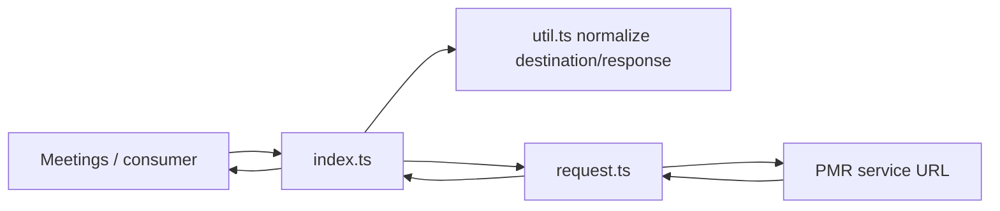
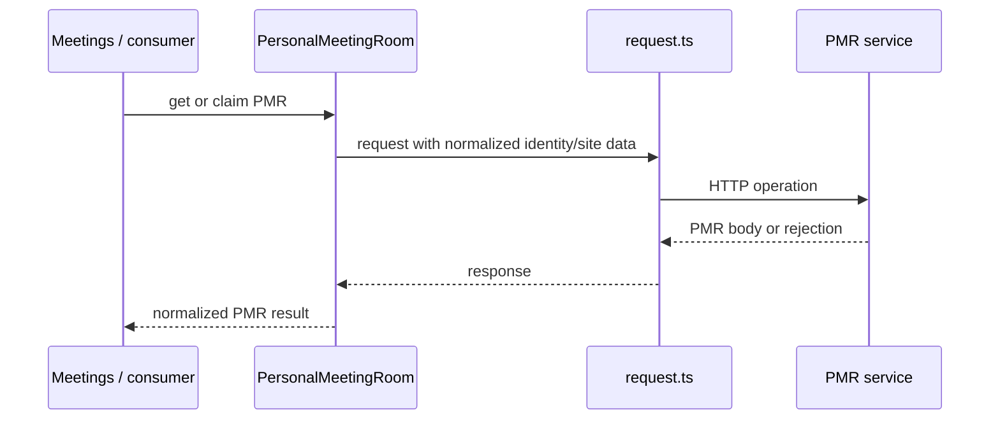
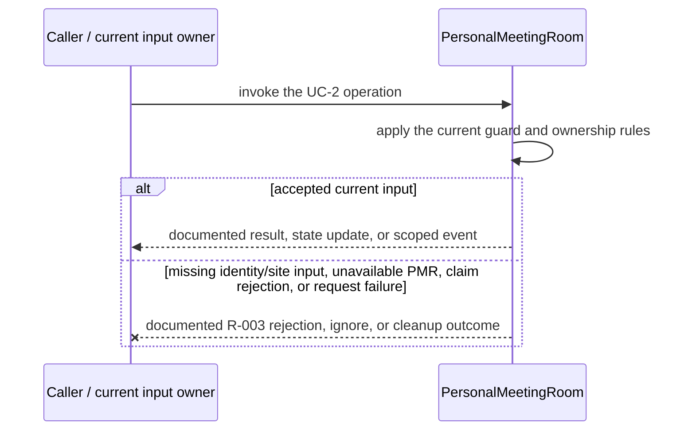
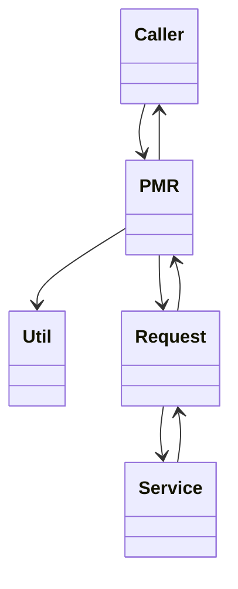

<!-- sdd-generated-metadata
doc_kind: module-spec
generated_from: module-spec@0.2.2
generator_plugin: repo-annotation@1.0.5+codex.20260818094939
generated_by: codex
approved_by: repository user
updated_at: 2026-08-21T06:10:05Z
validation_status: not-run
-->
# PERSONAL MEETING ROOM — SPEC

> Start here → root [`AGENTS.md`](../../../AGENTS.md) · router [`SPEC_INDEX.md`](../../../ai-docs/SPEC_INDEX.md) · system [`ARCHITECTURE.md`](../../../ai-docs/ARCHITECTURE.md). This is the canonical source-local spec for `src/personal-meeting-room/`.

## Metadata

| Field | Value |
|---|---|
| Module id | `personal-meeting-room` |
| Source path(s) | `src/personal-meeting-room/` |
| Parent spec | — |
| Doc kind | Module spec |
| Coverage score | 93% assessed 2026-08-21; 13/14 mandatory fields present; all critical and Important fields present; one noncritical polish gap remains |
| Generated from | `module-spec` @ SDLC template library `0.2.2` |
| generated_by / approved_by / updated_at | codex / repository user / 2026-08-21T06:10:05Z |
| Validation status | not-run |

## Evidence Rules

Requirements cite current source and mirrored tests. Current code wins over retained prose when they conflict; commit and PR history are excluded. Missing evidence stays a gap.

## Source Material Register

| Source material | Scope | Decision | Detail location or disposition |
|---|---|---|---|
| Retained package consumer documentation | overview / API / behavior / tests | used and verified; PMR retrieval/claim usage was placed in the public surface and use cases |
| Current source and mirrored tests | implementation / tests | verified | requirements, flows, failures, and test strategy below |

## Overview

`src/personal-meeting-room/` contains 3 direct source/reference file(s) and has 1 mirrored unit-test file(s). This spec separates its public operations, runtime data movement, component ownership, state applicability, and verification boundary.

## Purpose / Responsibility

Retrieves a user's Personal Meeting Room information and performs the claim operation through the Webex service boundary.

## Stack

TypeScript/JavaScript in the Node 22.14 Yarn workspace; Webex core/plugin abstractions and Mocha/Sinon/`@webex/test-helper-chai` tests.

## Folder / Package Structure

```text
src/personal-meeting-room/
├── index.ts — module facade/controller or primary exports
├── request.ts — HTTP request boundary
├── util.ts — normalization/helper functions
└── ai-docs/personal-meeting-room-spec.md — canonical module specification
```

## Key Files (source of truth)

| File | Holds |
|---|---|
| `src/personal-meeting-room/index.ts` | module facade/controller or primary exports |
| `src/personal-meeting-room/request.ts` | HTTP request boundary |
| `src/personal-meeting-room/util.ts` | normalization/helper functions |
| `test/unit/spec/personal-meeting-room/personal-meeting-room.js` | mirrored characterization/unit coverage |

## Public Surface

| Contract ID | Type | Surface | Purpose | Compatibility / deprecation | Schema / detail link | Root index |
|---|---|---|---|---|---|---|
| `personal-meeting-room.1` | SDK / in-process / remote | fetch the current user's Personal Meeting Room | Focused operation group owned by this module | Preserve methods/events/wire values reachable from package objects | `src/personal-meeting-room/index.ts` | [CONTRACTS](../../../ai-docs/CONTRACTS.md) |
| `personal-meeting-room.2` | SDK / in-process / remote | normalize PMR meeting information | Focused operation group owned by this module | Preserve methods/events/wire values reachable from package objects | `src/personal-meeting-room/index.ts` | [CONTRACTS](../../../ai-docs/CONTRACTS.md) |
| `personal-meeting-room.3` | SDK / in-process / remote | claim the PMR using current identity/request context | Focused operation group owned by this module | Preserve methods/events/wire values reachable from package objects | `src/personal-meeting-room/index.ts` | [CONTRACTS](../../../ai-docs/CONTRACTS.md) |

Compatibility notes:
- Prefer additive fields/options and preserve current return and rejection semantics. Internal helpers are not public merely because they are exported within the source directory.

## Requires (dependencies)

Webex host/request access, user/device identity, PMR service discovery, meeting-info normalization, and request errors.

## Requirements

| ID | WHAT | WHY | Source Evidence | Test / Example Evidence | Assumptions / Gaps | Confidence |
|---|---|---|---|---|---|---|
| `PERSONAL-MEETING-ROOM-R-001` | fetch the current user's Personal Meeting Room. | Retrieves a user's Personal Meeting Room information and performs the claim operation through the Webex service boundary. | `src/personal-meeting-room/index.ts` | `test/unit/spec/personal-meeting-room/personal-meeting-room.js` | none | PRESENT |
| `PERSONAL-MEETING-ROOM-R-002` | normalize PMR meeting information. | Consumers need deterministic behavior across meeting and remote updates. | `src/personal-meeting-room/index.ts`, `src/personal-meeting-room/request.ts` | `test/unit/spec/personal-meeting-room/personal-meeting-room.js` | inspect sibling tests for operation-specific cases | PRESENT |
| `PERSONAL-MEETING-ROOM-R-003` | Parameter and service errors reject the returned promise; this stateless request facade owns no listener, timer, lock, or event cleanup. | Callers must receive the actual module failure outcome without false cleanup or event guarantees. | `src/personal-meeting-room/` | `test/unit/spec/personal-meeting-room/personal-meeting-room.js` | none | PRESENT |

## Design Overview

`PersonalMeetingRoom` is a small request facade. `request.ts` performs PMR lookup/claim operations and `util.ts` derives/normalizes PMR data; it has no listeners, timers, or event-emission lifecycle.

## Data Flow



## Sequence Diagram(s)

Sequence coverage:

| Operation group | Diagram | Failure coverage |
|---|---|---|
| UC-1 — primary operation | Primary operation sequence | accepted and rejected dependency outcomes |
| UC-2 — secondary/change operation | Secondary operation and failure sequence | missing identity/site input, unavailable PMR, claim rejection, or request failure |

### Primary operation sequence



### Secondary operation and failure sequence



## Class / Component Relationships



The arrows identify ownership and delegation inside `src/personal-meeting-room/`; files that only declare types or constants are not presented as transports.

## Use Cases

- **UC-1:** Fetch personal-room information through the PMR request helper. Evidence: `src/personal-meeting-room/`.
- **UC-2:** Claim a PMR using the current request contract and return the normalized server result. Evidence: `src/personal-meeting-room/`.

## State Model

The plugin retains current PMR information and request helper state for the owning SDK instance.

## Business Rules & Invariants

- PMR data comes from the service response; claim uses current authenticated identity and never fabricates room ownership. Enforced under `src/personal-meeting-room/`.

## Concurrency & Reactive Flow

- Async work owned by `PersonalMeetingRoom` may complete after a newer caller or remote input. Preserve the identity, sequence, and resource-owner guards in `src/personal-meeting-room/`; a late completion must not replay UC-2 for superseded state.

## Error Handling & Failure Modes

| Condition | Signal | Caller recovery |
|---|---|---|
| missing identity/site input, unavailable PMR, claim rejection, or request failure | Follow the concrete rejection, ignore, state, or cleanup behavior in the module's R-003 requirement. | Resolve the named condition; retry only when another requirement defines a bound. |
| UC-1 succeeds | Return, update, callback, or scoped event identified by the Public Surface and primary sequence. | Continue from the owning module's accepted state. |

## Pitfalls

- A PMR is meeting metadata, not an already joined Meeting. Consumers must still create/join through Meetings.
- Verify both typed constants/enums and raw wire values before changing a logical condition in this legacy package.

## Test-Case Strategy (module)

Use the current mirrored suites: `test/unit/spec/personal-meeting-room/personal-meeting-room.js`. Characterize the two code-grounded use cases above and the listed failure condition; add cleanup or transition cases only for resources and state this module actually owns.

| Behavior / Requirement | Existing test evidence | Gap |
|---|---|---|
| `PERSONAL-MEETING-ROOM-R-001` | `test/unit/spec/personal-meeting-room/personal-meeting-room.js` | inspect sibling tests for full operation matrix |
| `PERSONAL-MEETING-ROOM-R-002` | `test/unit/spec/personal-meeting-room/personal-meeting-room.js` | verify the operation-specific invalid-input and rejection branches |
| `PERSONAL-MEETING-ROOM-R-003` | `test/unit/spec/personal-meeting-room/personal-meeting-room.js` | verify the concrete R-003 rejection, ignore, or cleanup outcome |

## Traceability

- Repo architecture: [`ARCHITECTURE.md`](../../../ai-docs/ARCHITECTURE.md) · Registry: [`SPEC_INDEX.md`](../../../ai-docs/SPEC_INDEX.md)
- Coverage state and contracts baseline: `../../../.sdd/manifest.json`
