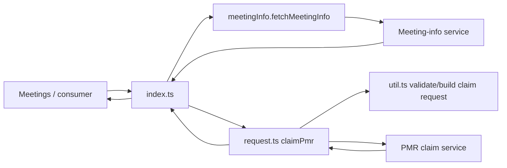
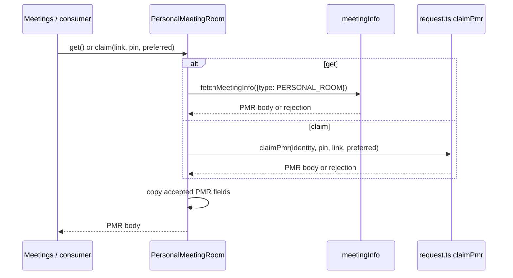
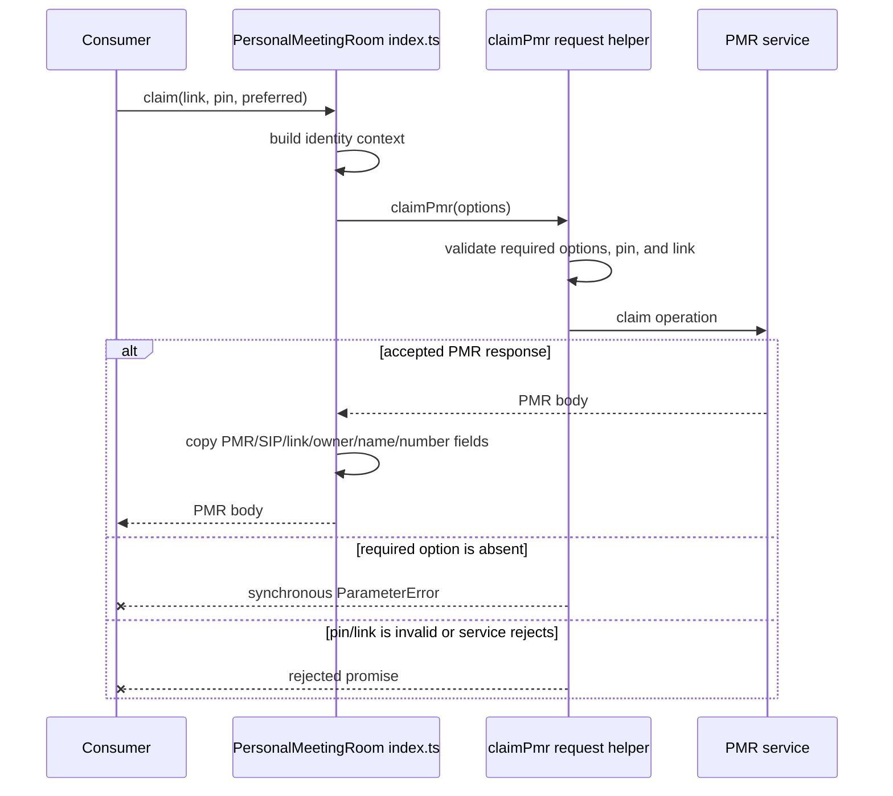
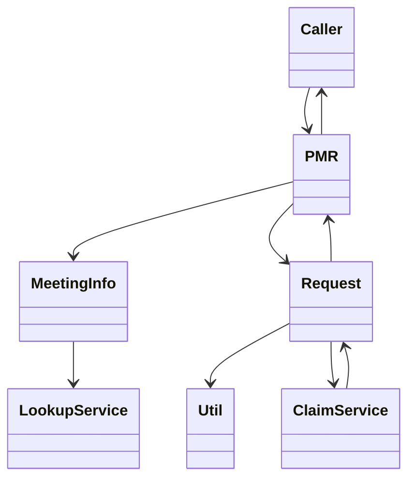

<!-- sdd-generated-metadata
doc_kind: module-spec
generated_from: module-spec@0.2.2
generator_plugin: repo-annotation@1.0.5+codex.20260818094939
generated_by: codex
approved_by: repository user
updated_at: 2026-08-22T15:21:29Z
validation_status: pass-with-warnings
-->
# PERSONAL MEETING ROOM — SPEC

> Start here → root [`AGENTS.md`](../../../AGENTS.md) · router [`SPEC_INDEX.md`](../../../ai-docs/SPEC_INDEX.md) · system [`ARCHITECTURE.md`](../../../ai-docs/ARCHITECTURE.md). This is the canonical source-local spec for `src/personal-meeting-room/`.

## Metadata

| Field | Value |
|---|---|
| Module id | `personal-meeting-room` |
| Source path(s) | `src/personal-meeting-room/` |
| Parent spec | — |
| Doc kind | Module spec |
| Coverage score | 93% assessed 2026-08-22; 13/14 mandatory fields present; all critical and Important fields present; one noncritical polish gap remains; pending independent validation of the participant-role repair |
| Generated from | `module-spec` @ SDLC template library `0.2.2` |
| generated_by / approved_by / updated_at | codex / repository user / 2026-08-22T15:21:29Z |
| Validation status | pass-with-warnings |

## Evidence Rules

Requirements cite current source and mirrored tests. Current code wins over retained prose when they conflict; commit and PR history are excluded. Missing evidence stays a gap.

## Source Material Register

| Source material | Scope | Decision | Detail location or disposition |
|---|---|---|---|
| Retained package consumer documentation | overview / API / behavior / tests | used and verified; PMR retrieval/claim usage was placed in the public surface and use cases |
| Current source and mirrored tests | implementation / tests | verified | requirements, flows, failures, and test strategy below |

## Overview

`src/personal-meeting-room/` contains 3 direct source/reference file(s) and has 1 mirrored unit-test file(s). This spec separates its public operations, runtime data movement, component ownership, state applicability, and verification boundary.

## Purpose / Responsibility

Retrieves a user's Personal Meeting Room information and performs the claim operation through the Webex service boundary.

## Stack

TypeScript/JavaScript in the Node 22.14 Yarn workspace; Webex core/plugin abstractions and Mocha/Sinon/`@webex/test-helper-chai` tests.

## Folder / Package Structure

```text
src/personal-meeting-room/
├── index.ts — module facade/controller or primary exports
├── request.ts — PMR-claim validation and HTTP request boundary
├── util.ts — normalization/helper functions
└── ai-docs/personal-meeting-room-spec.md — canonical module specification
```

## Key Files (source of truth)

| File | Holds |
|---|---|
| `src/personal-meeting-room/index.ts` | module facade/controller or primary exports |
| `src/personal-meeting-room/request.ts` | PMR-claim validation and HTTP request boundary |
| `src/personal-meeting-room/util.ts` | normalization/helper functions |
| `test/unit/spec/personal-meeting-room/personal-meeting-room.js` | mirrored characterization/unit coverage |

## Public Surface

| Contract ID | Type | Surface | Purpose | Compatibility / deprecation | Schema / detail link | Root index |
|---|---|---|---|---|---|---|
| `personal-meeting-room.1` | SDK / remote | `PersonalMeetingRoom.get()` | Fetch the current user's room through the injected meeting-info service and store a valid PMR projection. | Reject absent/non-PMR results; preserve the returned model state. | `src/personal-meeting-room/index.ts` | [CONTRACTS](../../../ai-docs/CONTRACTS.md) |
| `personal-meeting-room.2` | SDK / remote | `PersonalMeetingRoom.claim()` | Claim the current PMR through the request dependency, cache accepted response fields, and return the response body. | Preserve request rejection and response-body return semantics. | `src/personal-meeting-room/index.ts` | [CONTRACTS](../../../ai-docs/CONTRACTS.md) |
| `personal-meeting-room.3` | request adapter | `PersonalMeetingRoomRequest.claimPmr()` | Issue the PMR claim request with current Webex identity/request context. | This adapter performs claim I/O only; room lookup belongs to the injected meeting-info service. | `src/personal-meeting-room/request.ts` | [CONTRACTS](../../../ai-docs/CONTRACTS.md) |

Compatibility notes:
- Prefer additive fields/options and preserve current return and rejection semantics. Internal helpers are not public merely because they are exported within the source directory.

## Requires (dependencies)

Webex host/request access, user/device identity, PMR service discovery, meeting-info normalization, and request errors.

## Requirements

| ID | WHAT | WHY | Source Evidence | Test / Example Evidence | Assumptions / Gaps | Confidence |
|---|---|---|---|---|---|---|
| `PERSONAL-MEETING-ROOM-R-001` | fetch the current user's Personal Meeting Room. | Retrieves a user's Personal Meeting Room information and performs the claim operation through the Webex service boundary. | `src/personal-meeting-room/index.ts` | `test/unit/spec/personal-meeting-room/personal-meeting-room.js` | none | PRESENT |
| `PERSONAL-MEETING-ROOM-R-002` | Copy a validated PMR response into the instance's PMR, SIP URI, meeting link, owner, name, and number fields. | Both lookup and claim must expose the same current room projection without attributing lookup to the claim-only request helper. | `src/personal-meeting-room/index.ts` | `test/unit/spec/personal-meeting-room/personal-meeting-room.js` | none | PRESENT |
| `PERSONAL-MEETING-ROOM-R-003` | `PersonalMeetingRoomRequest.claimPmr()` throws `ParameterError` synchronously when required claim options are absent, returns a rejected `ParameterError` promise for an invalid pin or link, and otherwise returns the request promise. Lookup/service failures and an accepted claim response without a body reject their returned chains; the instance owns no listener, timer, lock, or event cleanup. | Callers must distinguish the request builder's synchronous option validation from returned validation/service rejections while not confusing cached room metadata with an async lifecycle resource. | `src/personal-meeting-room/index.ts`, `src/personal-meeting-room/request.ts` | `test/unit/spec/personal-meeting-room/personal-meeting-room.js` | none | PRESENT |

## Design Overview

`PersonalMeetingRoom.get()` delegates lookup to the injected `meetingInfo.fetchMeetingInfo`; `claim()` delegates only the claim operation to `PersonalMeetingRoomRequest.claimPmr`. `request.ts` and `util.ts` validate/build the claim request, while `index.ts` copies accepted response fields into the instance. The module has no listeners, timers, or event-emission lifecycle.

## Data Flow



## Sequence Diagram(s)

Sequence coverage:

| Operation group | Diagram | Failure coverage |
|---|---|---|
| UC-1…UC-3 — personal-room lookup and claim operation groups | Personal-room lookup and claim primary sequence | absent/non-PMR lookup, claim rejection, and cache preservation |
| UC-1…UC-3 — personal-room lookup and claim alternate/failure paths | Personal-room lookup and claim alternate/failure sequence | missing identity/site input, unavailable PMR, claim rejection, or request failure |

### Personal-room lookup and claim primary sequence



### Personal-room lookup and claim alternate/failure sequence



## Class / Component Relationships



The arrows identify ownership and delegation inside `src/personal-meeting-room/`; files that only declare types or constants are not presented as transports.

## Use Cases

- **UC-1:** Fetch personal-room information through the injected meeting-info service and reject a response that is absent or not a PMR. Evidence: `src/personal-meeting-room/index.ts`.
- **UC-2:** Claim a PMR through `PersonalMeetingRoomRequest.claimPmr()`, cache accepted response fields, and return the response body. Evidence: `src/personal-meeting-room/index.ts`, `src/personal-meeting-room/request.ts`.
- **UC-3:** Propagate lookup or claim failures without fabricating a cached room or fallback transport. Evidence: `src/personal-meeting-room/index.ts`, `src/personal-meeting-room/request.ts`.

## State Model

The plugin retains current PMR information and request helper state for the owning SDK instance.

## Business Rules & Invariants

- PMR data comes from the service response; claim uses current authenticated identity and never fabricates room ownership. Enforced under `src/personal-meeting-room/`.

## Concurrency & Reactive Flow

- Lookup and claim calls are independent promises with no cancellation or response-order guard. Each accepted completion calls `set`, so the last completion to resolve overwrites the cached PMR fields.

## Error Handling & Failure Modes

| Condition | Signal | Caller recovery |
|---|---|---|
| A required request-builder option is absent | `PersonalMeetingRoomRequest.claimPmr()` throws `ParameterError` synchronously before it returns a promise. | Supply user id, passcode, meeting address, and a truthy preferred flag before calling. |
| Pin or meeting link has an invalid format | `PersonalMeetingRoomRequest.claimPmr()` returns a rejected `ParameterError` promise. | Correct the formatted pin/link and handle the returned rejection. |
| Lookup returns no PMR or lookup/claim service rejects | The returned promise rejects; no listener/timer cleanup is involved. | Handle service availability or retry as a new lookup/claim. |
| Lookup or claim returns an accepted PMR body | `index.ts` copies the PMR, SIP URI, link, owner, name, and number fields and returns the body. | Read the instance's current cached room projection. |

## Pitfalls

- A PMR is meeting metadata, not an already joined Meeting. Consumers must still create/join through Meetings.
- Verify both typed constants/enums and raw wire values before changing a logical condition in this legacy package.

## Test-Case Strategy (module)

Use the current mirrored suites: `test/unit/spec/personal-meeting-room/personal-meeting-room.js`. Characterize the personal-meeting-room-specific use cases above and each listed failure condition; add cleanup or transition cases only for resources and state this module actually owns.

| Behavior / Requirement | Existing test evidence | Gap |
|---|---|---|
| `PERSONAL-MEETING-ROOM-R-001` | `test/unit/spec/personal-meeting-room/personal-meeting-room.js` | cover valid/invalid lookup and successful/failed claim as separate paths |
| `PERSONAL-MEETING-ROOM-R-002` | `test/unit/spec/personal-meeting-room/personal-meeting-room.js` | cover accepted claim response fields and request-body forwarding together |
| `PERSONAL-MEETING-ROOM-R-003` | `test/unit/spec/personal-meeting-room/personal-meeting-room.js` | distinguish synchronous missing-option throws from invalid pin/link and service promise rejections, and assert failures leave no fabricated cached state |

## Traceability

- Repo architecture: [`ARCHITECTURE.md`](../../../ai-docs/ARCHITECTURE.md) · Registry: [`SPEC_INDEX.md`](../../../ai-docs/SPEC_INDEX.md)
- Coverage state and contracts baseline: `../../../.sdd/manifest.json`
