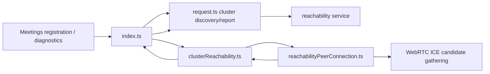
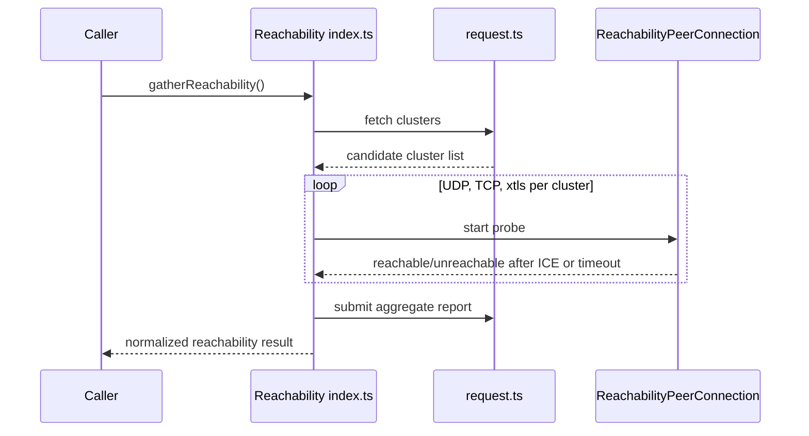
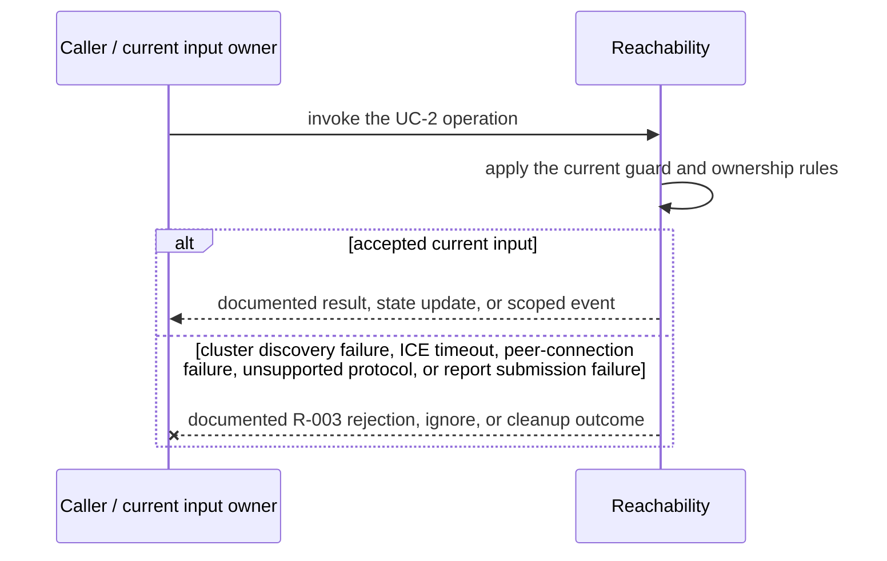
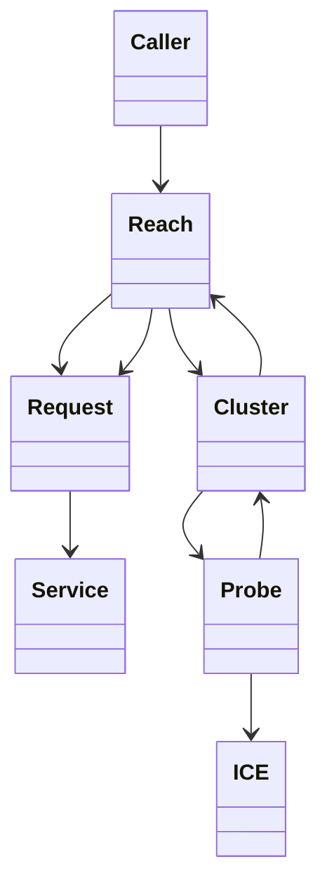

<!-- sdd-generated-metadata
doc_kind: module-spec
generated_from: module-spec@0.2.2
generator_plugin: repo-annotation@1.0.5+codex.20260818094939
generated_by: codex
approved_by: repository user
updated_at: 2026-08-21T06:10:05Z
validation_status: not-run
-->
# REACHABILITY — SPEC

> Start here → root [`AGENTS.md`](../../../AGENTS.md) · router [`SPEC_INDEX.md`](../../../ai-docs/SPEC_INDEX.md) · system [`ARCHITECTURE.md`](../../../ai-docs/ARCHITECTURE.md). This is the canonical source-local spec for `src/reachability/`.

## Metadata

| Field | Value |
|---|---|
| Module id | `reachability` |
| Source path(s) | `src/reachability/` |
| Parent spec | — |
| Doc kind | Module spec |
| Coverage score | 93% assessed 2026-08-21; 13/14 mandatory fields present; all critical and Important fields present; one noncritical polish gap remains |
| Generated from | `module-spec` @ SDLC template library `0.2.2` |
| generated_by / approved_by / updated_at | codex / repository user / 2026-08-21T06:10:05Z |
| Validation status | not-run |

## Evidence Rules

Requirements cite current implementation and mirrored unit-test paths. Current code wins over retained prose when they conflict; commit and PR history are excluded by repository-owner decision. Missing test evidence is stated as a gap rather than inferred.

## Source Material Register

| Source material | Scope | Decision | Detail location or disposition |
|---|---|---|---|
| No routed legacy module spec | overview / API / behavior / tests | none; generated from current cluster/probe/request code and tests |
| Current source and mirrored tests | implementation / tests | verified | requirements, flows, failures, and test strategy below |

## Overview

`src/reachability/` contains 6 direct source/reference file(s) and has 4 mirrored unit-test file(s). This spec separates its public operations, runtime data movement, component ownership, state applicability, and verification boundary.

## Purpose / Responsibility

Discovers media clusters, probes protocol reachability with peer connections, determines NAT characteristics, and reports results.

## Stack

TypeScript/JavaScript in the Node 22.14 Yarn workspace; Webex core/plugin abstractions and Mocha/Sinon/`@webex/test-helper-chai` tests. Build target: `yarn workspace @webex/plugin-meetings build:src`.

## Folder / Package Structure

```text
src/reachability/
├── clusterReachability.ts — clusterReachability implementation responsibility
├── index.ts — module facade/controller or primary exports
├── reachability.types.ts — module type declarations
├── reachabilityPeerConnection.ts — reachabilityPeerConnection implementation responsibility
├── request.ts — HTTP request boundary
├── util.ts — normalization/helper functions
└── ai-docs/reachability-spec.md — canonical module specification
```

## Key Files (source of truth)

| File | Holds |
|---|---|
| `src/reachability/clusterReachability.ts` | clusterReachability implementation responsibility |
| `src/reachability/index.ts` | module facade/controller or primary exports |
| `src/reachability/reachability.types.ts` | module type declarations |
| `src/reachability/reachabilityPeerConnection.ts` | reachabilityPeerConnection implementation responsibility |
| `src/reachability/request.ts` | HTTP request boundary |
| `src/reachability/util.ts` | normalization/helper functions |
| `test/unit/spec/reachability/clusterReachability.ts` and 3 sibling test file(s) | mirrored characterization/unit coverage |

## Public Surface

| Contract ID | Type | Surface | Purpose | Compatibility / deprecation | Schema / detail link | Root index |
|---|---|---|---|---|---|---|
| `reachability.1` | SDK / in-process / remote | fetch and normalize candidate clusters | Preserve the module responsibility through a focused operation group | Consumer-visible methods/events are semver-sensitive when reachable from package objects | `src/reachability/index.ts` | [CONTRACTS](../../../ai-docs/CONTRACTS.md) |
| `reachability.2` | SDK / in-process / remote | run `udp` / `tcp` / `xtls` reachability probes | Preserve the code-level protocol and metric field names | Consumer-visible methods/events are semver-sensitive when reachable from package objects | `src/reachability/index.ts` | [CONTRACTS](../../../ai-docs/CONTRACTS.md) |
| `reachability.3` | SDK / in-process / remote | return/report reachability and NAT results | Preserve the module responsibility through a focused operation group | Consumer-visible methods/events are semver-sensitive when reachable from package objects | `src/reachability/index.ts` | [CONTRACTS](../../../ai-docs/CONTRACTS.md) |

Compatibility notes:
- Prefer additive options and payload fields. Preserve method/event names, rejection semantics, and cleanup timing; route public changes through `src/index.ts` or the documented owning object.

## Requires (dependencies)

Webex reachability services, browser RTCPeerConnection, STUN/TURN candidates, timers, and metrics/request access.

## Requirements

| ID | WHAT | WHY | Source Evidence | Test / Example Evidence | Assumptions / Gaps | Confidence |
|---|---|---|---|---|---|---|
| `REACHABILITY-R-001` | fetch and normalize candidate clusters. | Discovers media clusters, probes protocol reachability with peer connections, determines NAT characteristics, and reports results. | `src/reachability/index.ts` | `test/unit/spec/reachability/index.ts` | none | PRESENT |
| `REACHABILITY-R-002` | Run the `udp`, `tcp`, and `xtls` reachability probes used by code and metric keys. | Callers and telemetry consumers need the exact wire/field name rather than an ambiguous prose-only TLS label. | `src/reachability/index.ts`, `src/reachability/clusterReachability.ts`, `src/reachability/reachability.types.ts` | `test/unit/spec/reachability/index.ts` | none | PRESENT |
| `REACHABILITY-R-003` | Discovery/report failures reject their requests; each probe resolves unreachable or rejects per current path and always closes its peer connection and timeout. | Callers must receive the actual module failure outcome without false cleanup or event guarantees. | `src/reachability/` | `test/unit/spec/reachability/index.ts` | none | PRESENT |
| `REACHABILITY-R-004` | Each cluster/protocol probe settles once, closes its peer connection/timer, and contributes an explicit reachable/unreachable result. | ICE events and timeouts race; deterministic cleanup and aggregation prevent false success and leaks. | `src/reachability/clusterReachability.ts`, `src/reachability/reachabilityPeerConnection.ts` | `test/unit/spec/reachability/clusterReachability.ts` | none | PRESENT |
| `REACHABILITY-R-005` | The aggregate report preserves IP version, NAT/protocol/cluster outcomes, previous-report context, and trigger. | The backend and media selection need comparable current results rather than a single boolean. | `src/reachability/index.ts`, `src/reachability/reachability.types.ts`, `src/reachability/request.ts` | `test/unit/spec/reachability/index.ts`, `test/unit/spec/reachability/request.js` | none | PRESENT |

## Design Overview

`Reachability` fetches media clusters with `request.ts`, builds a `ClusterReachability` aggregate per cluster, and runs UDP/TCP/`xtls` probes through `ReachabilityPeerConnection`; each probe owns and closes its peer connection and timeout.

## Data Flow



## Sequence Diagram(s)

Sequence coverage:

| Operation group | Diagram | Failure coverage |
|---|---|---|
| UC-1 — primary operation | Primary operation sequence | accepted and rejected dependency outcomes |
| UC-2 — secondary/change operation | Secondary operation and failure sequence | cluster discovery failure, ICE timeout, peer-connection failure, unsupported protocol, or report submission failure |

### Primary operation sequence



### Secondary operation and failure sequence



## Class / Component Relationships



The arrows identify ownership and delegation inside `src/reachability/`; files that only declare types or constants are not presented as transports.

## Use Cases

- **UC-1:** Probe each discovered cluster over the code-level transport names `udp`, `tcp`, and `xtls`. Evidence: `src/reachability/`.
- **UC-2:** Settle every probe exactly once and aggregate protocol, NAT, IP-version, previous-report, and trigger context. Evidence: `src/reachability/`.

## State Model

Cluster/protocol probe state, peer connections, timers, partial results, and cached report data exist for one reachability run.

## Business Rules & Invariants

- Each probe settles once and closes its peer connection/timer; unsupported or failed protocols are reported rather than inferred reachable. Enforced by `src/reachability/index.ts` and supporting code under `src/reachability/`.

## Concurrency & Reactive Flow

- Async work owned by `Reachability` may complete after a newer caller or remote input. Preserve the identity, sequence, and resource-owner guards in `src/reachability/`; a late completion must not replay UC-2 for superseded state.

## Protocol / Wire Format

- External payloads are parsed/serialized by files under `src/reachability/` and existing Webex/media dependencies. Preserve current field names, enum/raw values, sequence identifiers, and compatibility behavior; do not treat the normalized client model as the wire schema.

## Error Handling & Failure Modes

| Condition | Signal | Caller recovery |
|---|---|---|
| cluster discovery failure, ICE timeout, peer-connection failure, unsupported protocol, or report submission failure | Follow the concrete rejection, ignore, state, or cleanup behavior in the module's R-003 requirement. | Resolve the named condition; retry only when another requirement defines a bound. |
| UC-1 succeeds | Return, update, callback, or scoped event identified by the Public Surface and primary sequence. | Continue from the owning module's accepted state. |

## Pitfalls

- Browser ICE callbacks and timeout can race. Cleanup must be idempotent and partial results must not be presented as a complete success.
- Public behavior may be reachable through a parent `Meeting`/`Meetings` object even when the source helper is not exported directly.

## Key Design Trade-off

- Parallel probes reduce startup time but require per-probe isolation and deterministic aggregation.

## Test-Case Strategy (module)

Use the current mirrored suites: `test/unit/spec/reachability/clusterReachability.ts`, `test/unit/spec/reachability/index.ts`, `test/unit/spec/reachability/request.js`, `test/unit/spec/reachability/util.ts`. Characterize the two code-grounded use cases above and the listed failure condition; add cleanup or transition cases only for resources and state this module actually owns.

| Behavior / Requirement | Existing test evidence | Gap |
|---|---|---|
| `REACHABILITY-R-001` | `test/unit/spec/reachability/index.ts` | confirm the named operation against its owning sibling suite |
| `REACHABILITY-R-002` | `test/unit/spec/reachability/index.ts` | verify the code-grounded rejection or stale-input branch |
| `REACHABILITY-R-003` | `test/unit/spec/reachability/index.ts` | verify the concrete R-003 rejection, ignore, or cleanup outcome |
| `REACHABILITY-R-004` | `test/unit/spec/reachability/clusterReachability.ts` | verify callback/timeout races |
| `REACHABILITY-R-005` | `test/unit/spec/reachability/index.ts`, `test/unit/spec/reachability/request.js` | verify partial/mixed protocol reports |

## Traceability

- Repo architecture: [`ARCHITECTURE.md`](../../../ai-docs/ARCHITECTURE.md) · Registry: [`SPEC_INDEX.md`](../../../ai-docs/SPEC_INDEX.md)
- Coverage state and contracts baseline: `../../../.sdd/manifest.json`
