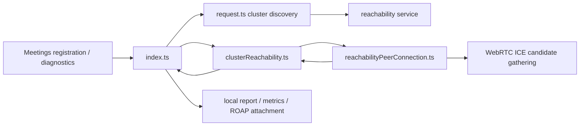
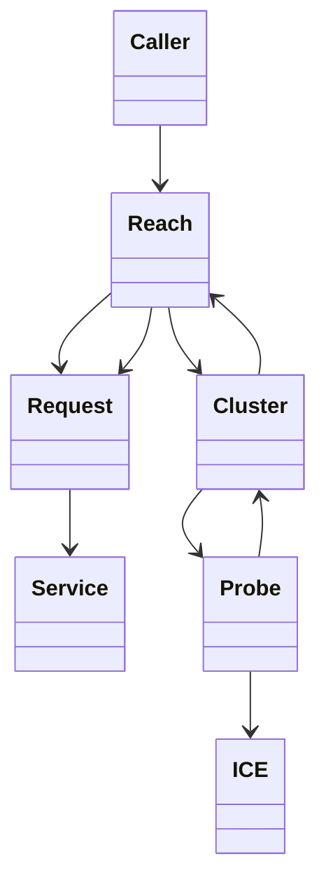

<!-- sdd-generated-metadata
doc_kind: module-spec
generated_from: module-spec@0.2.2
generator_plugin: repo-annotation@1.0.5+codex.20260818094939
generated_by: codex
approved_by: repository user
updated_at: 2026-08-22T15:21:29Z
validation_status: pass-with-warnings
-->
# REACHABILITY — SPEC

> Start here → root [`AGENTS.md`](../../../AGENTS.md) · router [`SPEC_INDEX.md`](../../../ai-docs/SPEC_INDEX.md) · system [`ARCHITECTURE.md`](../../../ai-docs/ARCHITECTURE.md). This is the canonical source-local spec for `src/reachability/`.

## Metadata

| Field | Value |
|---|---|
| Module id | `reachability` |
| Source path(s) | `src/reachability/` |
| Parent spec | — |
| Doc kind | Module spec |
| Coverage score | 93% assessed 2026-08-22; 13/14 mandatory fields present; all critical and Important fields present; one noncritical polish gap remains; pending independent validation of the participant-role repair |
| Generated from | `module-spec` @ SDLC template library `0.2.2` |
| generated_by / approved_by / updated_at | codex / repository user / 2026-08-22T15:21:29Z |
| Validation status | pass-with-warnings |

## Evidence Rules

Requirements cite current implementation and mirrored unit-test paths. Current code wins over retained prose when they conflict; commit and PR history are excluded by repository-owner decision. Missing test evidence is stated as a gap rather than inferred.

## Source Material Register

| Source material | Scope | Decision | Detail location or disposition |
|---|---|---|---|
| No routed legacy module spec | overview / API / behavior / tests | none; generated from current cluster/probe/request code and tests |
| Current source and mirrored tests | implementation / tests | verified | requirements, flows, failures, and test strategy below |

## Overview

`src/reachability/` contains 6 direct source/reference file(s) and has 4 mirrored unit-test file(s). This spec separates its public operations, runtime data movement, component ownership, state applicability, and verification boundary.

## Purpose / Responsibility

Discovers media clusters, probes protocol reachability with peer connections, determines NAT characteristics, and reports results.

## Stack

TypeScript/JavaScript in the Node 22.14 Yarn workspace; Webex core/plugin abstractions and Mocha/Sinon/`@webex/test-helper-chai` tests. Build target: `yarn workspace @webex/plugin-meetings build:src`.

## Folder / Package Structure

```text
src/reachability/
├── clusterReachability.ts — clusterReachability implementation responsibility
├── index.ts — module facade/controller or primary exports
├── reachability.types.ts — module type declarations
├── reachabilityPeerConnection.ts — reachabilityPeerConnection implementation responsibility
├── request.ts — HTTP request boundary
├── util.ts — normalization/helper functions
└── ai-docs/reachability-spec.md — canonical module specification
```

## Key Files (source of truth)

| File | Holds |
|---|---|
| `src/reachability/clusterReachability.ts` | clusterReachability implementation responsibility |
| `src/reachability/index.ts` | module facade/controller or primary exports |
| `src/reachability/reachability.types.ts` | module type declarations |
| `src/reachability/reachabilityPeerConnection.ts` | reachabilityPeerConnection implementation responsibility |
| `src/reachability/request.ts` | HTTP request boundary |
| `src/reachability/util.ts` | normalization/helper functions |
| `test/unit/spec/reachability/clusterReachability.ts` and 3 sibling test file(s) | mirrored characterization/unit coverage |

## Public Surface

| Contract ID | Type | Surface | Purpose | Compatibility / deprecation | Schema / detail link | Root index |
|---|---|---|---|---|---|---|
| `reachability.1` | SDK / remote | `Reachability.getClusters()` and `gatherReachability()` | Fetch cluster discovery data, cache the join cookie, and start a configured reachability run. | Disabled reachability rejects before the catch boundary; missing WebRTC capability or caught discovery/probe failure returns `{}`; a started successful run resolves its defer promise with `undefined` after storing results. | `src/reachability/index.ts`, `src/reachability/request.ts` | [CONTRACTS](../../../ai-docs/CONTRACTS.md) |
| `reachability.2` | SDK / async | `ClusterReachability.getResult()`, `start()`, `abort()` and `ReachabilityPeerConnection.getResult()`, `start()`, `abort()` | Run and settle per-cluster/per-protocol WebRTC probes with owned timers and peer connections. | Preserve the `udp`, `tcp`, and `xtls` protocol names and one-settlement cleanup. | `src/reachability/clusterReachability.ts`, `src/reachability/reachabilityPeerConnection.ts` | [CONTRACTS](../../../ai-docs/CONTRACTS.md) |
| `reachability.3` | SDK / lifecycle | `gatherReachabilityFallback()` and `stopReachability()` | Restart with fallback discovery when the minimum cluster target is missed, or abort an active run. | Both paths absorb their documented internal failures; stop emits `reachability:stopped` only for an active timer. | `src/reachability/index.ts` | [CONTRACTS](../../../ai-docs/CONTRACTS.md) |
| `reachability.4` | SDK / query | `isSubnetReachable()`, `isAnyPublicClusterReachable()`, `isWebexMediaBackendUnreachable()`, and `isAnyClusterReachableViaProtocol()` | Answer media-selection questions from the latest in-memory cluster results. | Preserve boolean/null semantics and current public/video-mesh distinctions. | `src/reachability/index.ts` | [CONTRACTS](../../../ai-docs/CONTRACTS.md) |
| `reachability.5` | SDK / report | `getJoinCookie()`, `getReachabilityReport()`, `getReachabilityMetrics()`, `getReachabilityResults()`, `getClientMediaPreferences()`, and `getReachabilityReportToAttachToRoap()` | Read cached/in-memory results and format local metrics, media preferences, or ROAP attachment data. | These methods construct/return data; they do not submit a reachability report to the service. | `src/reachability/index.ts` | [CONTRACTS](../../../ai-docs/CONTRACTS.md) |
| `reachability.6` | exported utilities | `resolveReachabilityProtocols()`, `isReachabilityEnabled()`, `convertStunUrlToTurn()`, and `convertStunUrlToTurnTls()` | Resolve configured protocol sets and transform validated STUN URLs for probe setup. | Invalid STUN input throws; preserve `xtls` and URL conversion behavior. | `src/reachability/util.ts` | [CONTRACTS](../../../ai-docs/CONTRACTS.md) |
| `reachability.7` | exported events/types | `Events`, `ResultEventData`, `ClientMediaIpsUpdatedEventData`, `NatTypeUpdatedEventData`, `Protocol`, `ResolvedReachabilityProtocols`, `ReachabilityProtocolConfig`, `EnableReachabilityChecksConfig`, `ReachabilityPeerConnectionEvents`, `TransportResult`, `NatType`, `ClusterReachabilityResult`, `ReachabilityMetrics`, `TransportResultForBackend`, `ReachabilityResultForBackend`, `ReachabilityResultsForBackend`, `ReachabilityResults`, `ReachabilityReportV0`, `ReachabilityReportV1`, `ClientMediaPreferences`, `GetClustersTrigger`, `ClusterNode`, and `ClusterList` | Share the exact probe/result vocabulary with Meetings, metrics, and ROAP code. | Add fields compatibly and preserve raw result/protocol/NAT values. | `src/reachability/clusterReachability.ts`, `src/reachability/reachability.types.ts`, `src/reachability/request.ts` | [CONTRACTS](../../../ai-docs/CONTRACTS.md) |
| `reachability.8` | dormant request helper | `ReachabilityRequest.remoteSDPForClusters()` | POST local SDP offers to the reachability resource and return remote SDP bodies when called directly. | No current package code invokes this exported helper; do not present it as part of `gatherReachability()`. | `src/reachability/request.ts` | [CONTRACTS](../../../ai-docs/CONTRACTS.md) |

### Emitted events

Current source emits these observable literals from the `Reachability` controller. Preserve literal values and the current terminal/progress timing.

| Event literal | Constant / expression | Emission evidence |
|---|---|---|
| `reachability:done` | inline literal | `src/reachability/index.ts` |
| `reachability:firstResultAvailable` | inline literal | `src/reachability/index.ts` |
| `reachability:stopped` | inline literal | `src/reachability/index.ts` |

Compatibility notes:
- Prefer additive options and payload fields. Preserve method/event names, rejection semantics, and cleanup timing; route public changes through `src/index.ts` or the documented owning object.

## Requires (dependencies)

Webex reachability services, browser RTCPeerConnection, STUN/TURN candidates, timers, and metrics/request access.

## Requirements

| ID | WHAT | WHY | Source Evidence | Test / Example Evidence | Assumptions / Gaps | Confidence |
|---|---|---|---|---|---|---|
| `REACHABILITY-R-001` | fetch and normalize candidate clusters. | Discovers media clusters, probes protocol reachability with peer connections, determines NAT characteristics, and reports results. | `src/reachability/index.ts` | `test/unit/spec/reachability/index.ts` | none | PRESENT |
| `REACHABILITY-R-002` | Run the `udp`, `tcp`, and `xtls` reachability probes used by code and metric keys. | Callers and telemetry consumers need the exact wire/field name rather than an ambiguous prose-only TLS label. | `src/reachability/index.ts`, `src/reachability/clusterReachability.ts`, `src/reachability/reachability.types.ts` | `test/unit/spec/reachability/index.ts` | none | PRESENT |
| `REACHABILITY-R-003` | `gatherReachability()` throws from its `async` body when reachability is disabled before entering its `try`, so the returned promise rejects; it returns `{}` when WebRTC is unavailable or when discovery/probe setup fails inside the `try`. A started successful run returns the defer promise, which resolves with `undefined` after results are stored. `getClusters()` retries once and can reject its direct caller on the second failure; fallback catches and logs its own failures. | Callers must distinguish the disabled-config rejection, empty-object skip/failure sentinel, and successful void settlement instead of treating every gather outcome as `{}` or a rejection. | `src/reachability/index.ts`, `src/reachability/clusterReachability.ts`, `src/reachability/reachabilityPeerConnection.ts` | `test/unit/spec/reachability/index.ts`, `test/unit/spec/reachability/clusterReachability.ts` | none | PRESENT |
| `REACHABILITY-R-004` | Each cluster/protocol probe settles once, closes its peer connection/timer, and contributes an explicit reachable/unreachable result. | ICE events and timeouts race; deterministic cleanup and aggregation prevent false success and leaks. | `src/reachability/clusterReachability.ts`, `src/reachability/reachabilityPeerConnection.ts` | `test/unit/spec/reachability/clusterReachability.ts` | none | PRESENT |
| `REACHABILITY-R-005` | The aggregate report preserves IP version, NAT/protocol/cluster outcomes, previous-report context, and trigger. | The backend and media selection need comparable current results rather than a single boolean. | `src/reachability/index.ts`, `src/reachability/reachability.types.ts`, `src/reachability/request.ts` | `test/unit/spec/reachability/index.ts`, `test/unit/spec/reachability/request.js` | none | PRESENT |

## Design Overview

`Reachability` fetches media clusters with `request.ts`, builds a `ClusterReachability` aggregate per cluster, and runs UDP/TCP/`xtls` probes through `ReachabilityPeerConnection`; each probe owns and closes its peer connection and timeout.

## Data Flow



## Sequence Diagram(s)

Sequence coverage:

| Operation group | Diagram | Failure coverage |
|---|---|---|
| UC-1…UC-5 — reachability discovery and probe operation groups | Reachability discovery and probe primary sequence | second discovery failure, absorbed gather failure, probe timeout/abort, and peer cleanup |
| UC-1…UC-5 — reachability discovery and probe alternate/failure paths | Reachability discovery and probe alternate/failure sequence | cluster discovery failure, ICE timeout, peer-connection failure, unsupported protocol, or explicit stop |

### Reachability discovery and probe primary sequence

```mermaid
sequenceDiagram
  participant C as Caller
  participant R as Reachability index.ts
  participant Q as request.ts
  participant P as ReachabilityPeerConnection
  C->>R: gatherReachability()
  R->>Q: fetch clusters
  Q-->>R: candidate cluster list
  loop UDP, TCP, xtls per cluster
    R->>P: start probe
    P-->>R: reachable/unreachable after ICE or timeout
  end
  R->>R: build in-memory results/report data
  R-->>C: defer settles undefined; disabled rejects; skipped/caught failure returns empty object
```

### Reachability discovery and probe alternate/failure sequence

```mermaid
sequenceDiagram
  participant R as Reachability
  participant P as Protocol probe
  participant W as RTCPeerConnection
  R->>P: probe cluster with udp, tcp, or xtls
  P->>W: gather ICE candidates
  alt candidate proves reachable
    W-->>P: matching candidate
    P-->>R: reachable result; close connection/timer
  else timeout or terminal probe error
    W--xP: timeout/error
    P-->>R: unreachable result or rejection; close connection/timer
  end
```

## Class / Component Relationships



The arrows identify ownership and delegation inside `src/reachability/`; files that only declare types or constants are not presented as transports.

## Use Cases

- **UC-1:** Fetch clusters with one retry, store the returned join cookie, and start enabled `udp`, `tcp`, and `xtls` probes. Evidence: `src/reachability/index.ts`, `src/reachability/request.ts`.
- **UC-2:** Settle each cluster/protocol probe once and close its timer and peer connection on success, failure, timeout, or abort. Evidence: `src/reachability/clusterReachability.ts`, `src/reachability/reachabilityPeerConnection.ts`.
- **UC-3:** Reject before probing when reachability is disabled, return `{}` when WebRTC is unavailable or a discovery/probe setup failure is caught, and otherwise resolve the run's defer with `undefined` after storing results. Evidence: `src/reachability/index.ts`.
- **UC-4:** Trigger fallback discovery when the minimum reachable-cluster threshold is missed, aborting the previous run before probing the replacement list. Evidence: `src/reachability/index.ts`.
- **UC-5:** Read results as metrics, client media preferences, or a ROAP attachment without calling the dormant `ReachabilityRequest.remoteSDPForClusters()` helper. Evidence: `src/reachability/index.ts`, `src/reachability/request.ts`.

## State Model

Cluster/protocol probe state, peer connections, timers, partial results, and cached report data exist for one reachability run.

## Business Rules & Invariants

- Each probe settles once and closes its peer connection/timer; unsupported or failed protocols are reported rather than inferred reachable. Enforced by `src/reachability/index.ts` and supporting code under `src/reachability/`.

## Concurrency & Reactive Flow

- Each cluster/protocol probe owns one peer connection and timeout, settles once from its ICE/error/timeout path, and closes both resources before contributing to the aggregate. Cluster discovery is requested remotely; report/metric/ROAP shapes are constructed locally. Only failures inside `gatherReachability()`'s `try` are absorbed as `{}`; disabled configuration rejects before that boundary.

## Protocol / Wire Format

- External payloads are parsed/serialized by files under `src/reachability/` and existing Webex/media dependencies. Preserve current field names, enum/raw values, sequence identifiers, and compatibility behavior; do not treat the normalized client model as the wire schema.

## Error Handling & Failure Modes

| Condition | Signal | Caller recovery |
|---|---|---|
| Reachability is disabled in configuration | `gatherReachability()` throws `enableReachabilityChecks is disabled in config` from its `async` body before entering the catch block, which rejects the returned promise. | Enable the configured checks or handle the rejection; do not expect `{}` for this path. |
| Cluster discovery still fails after `getClusters()` retries once | A direct `getClusters()` caller receives the rejection; `gatherReachability()` and fallback callers catch it and resolve with their documented empty/void outcome. | Distinguish direct discovery from the failure-absorbing gather APIs. |
| ICE timeout or supported probe cannot establish reachability | The probe settles on its current unreachable/rejection path and closes its peer connection and timeout. | Record the explicit unreachable result; do not retain the probe connection. |
| All `udp`, `tcp`, and `xtls` probes settle | The module stores aggregate protocol/cluster/NAT/IP-version results, emits completion, and resolves the gather defer with `undefined`; no report-submission call is made. | Read the stored/local report through the query/report helpers rather than expecting the gather promise to carry the result object. |

## Pitfalls

- Browser ICE callbacks and timeout can race. Cleanup must be idempotent and partial results must not be presented as a complete success.
- Public behavior may be reachable through a parent `Meeting`/`Meetings` object even when the source helper is not exported directly.

## Key Design Trade-off

- Parallel probes reduce startup time but require per-probe isolation and deterministic aggregation.

## Test-Case Strategy (module)

Use the current mirrored suites: `test/unit/spec/reachability/clusterReachability.ts`, `test/unit/spec/reachability/index.ts`, `test/unit/spec/reachability/request.js`, `test/unit/spec/reachability/util.ts`. Characterize the reachability-specific use cases above and each listed failure condition; add cleanup or transition cases only for resources and state this module actually owns.

| Behavior / Requirement | Existing test evidence | Gap |
|---|---|---|
| `REACHABILITY-R-001` | `test/unit/spec/reachability/index.ts` | cover discovery, probe, fallback, stop, query, and report-format groups |
| `REACHABILITY-R-002` | `test/unit/spec/reachability/index.ts` | second discovery failure versus absorbed gather failure needs paired assertions |
| `REACHABILITY-R-003` | `test/unit/spec/reachability/index.ts` | keep paired assertions for disabled-config rejection, WebRTC/caught-failure `{}`, successful `undefined` defer settlement, and no `remoteSDPForClusters()` invocation |
| `REACHABILITY-R-004` | `test/unit/spec/reachability/clusterReachability.ts` | verify callback/timeout races |
| `REACHABILITY-R-005` | `test/unit/spec/reachability/index.ts`, `test/unit/spec/reachability/request.js` | verify partial/mixed protocol reports |

## Traceability

- Repo architecture: [`ARCHITECTURE.md`](../../../ai-docs/ARCHITECTURE.md) · Registry: [`SPEC_INDEX.md`](../../../ai-docs/SPEC_INDEX.md)
- Coverage state and contracts baseline: `../../../.sdd/manifest.json`
