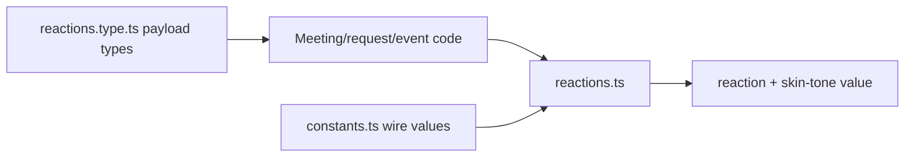
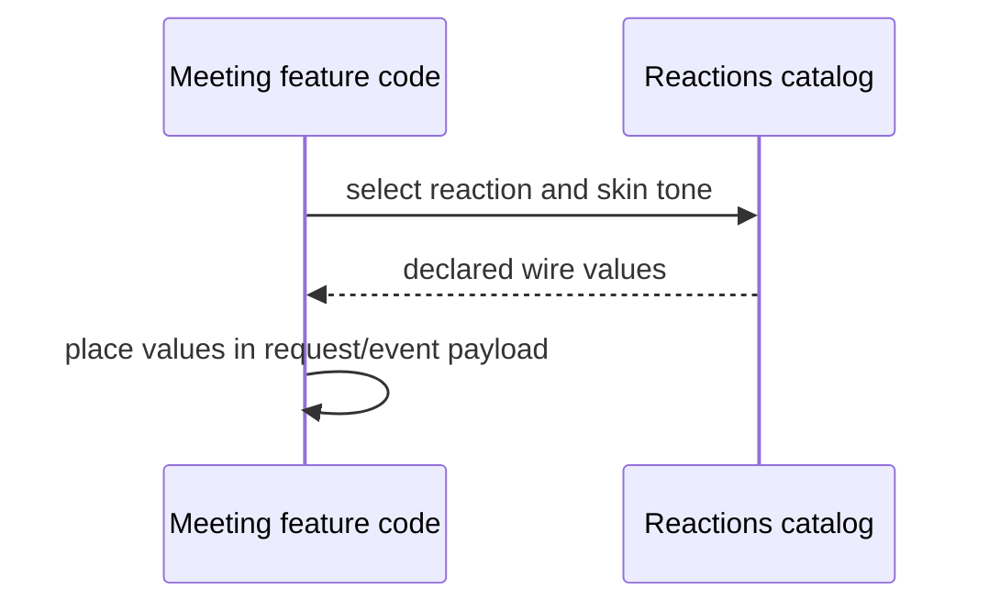
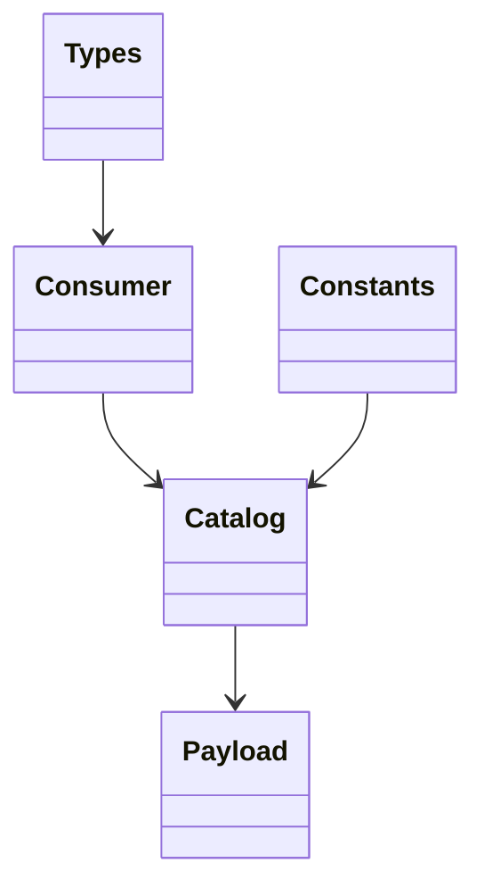

<!-- sdd-generated-metadata
doc_kind: module-spec
generated_from: module-spec@0.2.2
generator_plugin: repo-annotation@1.0.5+codex.20260818094939
generated_by: codex
approved_by: repository user
updated_at: 2026-08-22T15:21:29Z
validation_status: pass-with-warnings
-->
# REACTIONS — SPEC

> Start here → root [`AGENTS.md`](../../../AGENTS.md) · router [`SPEC_INDEX.md`](../../../ai-docs/SPEC_INDEX.md) · system [`ARCHITECTURE.md`](../../../ai-docs/ARCHITECTURE.md). This is the canonical source-local spec for `src/reactions/`.

## Metadata

| Field | Value |
|---|---|
| Module id | `reactions` |
| Source path(s) | `src/reactions/` |
| Parent spec | — |
| Doc kind | Module spec |
| Coverage score | 93% assessed 2026-08-22; 13/14 mandatory fields present; all critical and Important fields present; one noncritical polish gap remains; pending independent validation of the participant-role repair |
| Generated from | `module-spec` @ SDLC template library `0.2.2` |
| generated_by / approved_by / updated_at | codex / repository user / 2026-08-22T15:21:29Z |
| Validation status | not-run |

## Evidence Rules

Requirements cite current source and mirrored tests. Current code wins over retained prose when they conflict; commit and PR history are excluded. Missing evidence stays a gap.

## Source Material Register

| Source material | Scope | Decision | Detail location or disposition |
|---|---|---|---|
| Retained package consumer documentation | overview / API / behavior / tests | used and verified; reaction availability and event/request meaning were placed into the public surface and invariants |
| Current source and mirrored tests | implementation / tests | verified | requirements, flows, failures, and test strategy below |

## Overview

`src/reactions/` contains 3 direct source/reference file(s) and has 0 mirrored unit-test file(s). This spec separates its public operations, runtime data movement, component ownership, state applicability, and verification boundary.

## Purpose / Responsibility

Defines static reaction and skin-tone catalogs plus TypeScript shapes for reaction, sender, and relay payloads; owning Meeting code performs runtime lookup and fallback.

## Stack

TypeScript/JavaScript in the Node 22.14 Yarn workspace; Webex core/plugin abstractions and Mocha/Sinon/`@webex/test-helper-chai` tests.

## Folder / Package Structure

```text
src/reactions/
├── constants.ts — module constants and wire values
├── reactions.ts — reactions implementation responsibility
├── reactions.type.ts — reactions.type implementation responsibility
└── ai-docs/reactions-spec.md — canonical module specification
```

## Key Files (source of truth)

| File | Holds |
|---|---|
| `src/reactions/constants.ts` | module constants and wire values |
| `src/reactions/reactions.ts` | reactions implementation responsibility |
| `src/reactions/reactions.type.ts` | reactions.type implementation responsibility |
| no source-local mirrored test directory | explicit characterization gap |

## Public Surface

| Contract ID | Type | Surface | Purpose | Compatibility / deprecation | Schema / detail link | Root index |
|---|---|---|---|---|---|---|
| `reactions.1` | exported catalogs | `REACTION_RELAY_TYPES`, `Reactions`, and `SkinTones` | Define the supported relay, reaction, and skin-tone values consumed by Meeting request/event code. | Preserve existing raw values; add new catalog members compatibly. | `src/reactions/constants.ts`, `src/reactions/reactions.ts` | [CONTRACTS](../../../ai-docs/CONTRACTS.md) |
| `reactions.2` | exported types | `EmoticonData`, `SkinTone`, `Reaction`, `ReactionServerType`, `SkinToneType`, `Sender`, `ProcessedReaction`, and `RelayEvent` | Type the sender, relay, server, and normalized reaction payloads crossing the Meeting boundary. | Type changes must remain compatible with existing relay and sender shapes. | `src/reactions/reactions.type.ts` | [CONTRACTS](../../../ai-docs/CONTRACTS.md) |

### Emitted events

Current source emits or forwards these observable literals for this operation boundary. Preserve literal values, scope, payload shape, and emission timing; a constant name alone is not a substitute for the consumer-visible value.

| Event literal | Constant / expression | Emission evidence |
|---|---|---|
| `meeting:receiveReactions` | `EVENT_TRIGGERS.MEETING_RECEIVE_REACTIONS` | `src/meeting/index.ts` |

Compatibility notes:
- Prefer additive fields/options and preserve current return and rejection semantics. Internal helpers are not public merely because they are exported within the source directory.

## Requires (dependencies)

Reaction constants/types and Meeting reaction request/event paths.

## Requirements

| ID | WHAT | WHY | Source Evidence | Test / Example Evidence | Assumptions / Gaps | Confidence |
|---|---|---|---|---|---|---|
| `REACTIONS-R-001` | Export the supported `Reactions` and `SkinTones` record values without executable normalization or transport behavior. | Owning Meeting code needs one stable catalog of server type/codepoint/shortcode values while retaining responsibility for selection and fallback. | `src/reactions/reactions.ts` | `test/unit/spec/meeting/index.js`, `test/unit/spec/meeting/request.js` | no source-local mirrored test exists | PRESENT |
| `REACTIONS-R-002` | type reaction, sender, and relay payloads. | Meeting serialization depends on the exact reaction, skin-tone, sender, and relay type vocabulary. | `src/reactions/reactions.ts`, `src/reactions/reactions.type.ts` | `test/unit/spec/meeting/request.js` | catalog values need an exhaustive serializer compatibility matrix in the owning Meeting tests | PRESENT |
| `REACTIONS-R-003` | The catalogs are plain records and perform no validation, parsing, serialization, or fallible I/O; `Meeting.sendReaction` passes an unknown reaction type through and falls back to the normal skin tone for an unknown tone. | The spec must not turn static data declarations into a runtime normalization API or rejection contract. | `src/reactions/`, `src/meeting/index.ts` | `test/unit/spec/meeting/index.js`, `test/unit/spec/meeting/request.js` | none | PRESENT |

## Design Overview

`reactions.ts` and `constants.ts` export static reaction/skin-tone values, while `reactions.type.ts` supplies compile-time payload shapes. The module has no runtime transport or lifecycle state.

## Data Flow



## Sequence Diagram(s)

Sequence coverage:

| Operation group | Diagram | Failure coverage |
|---|---|---|
| UC-1…UC-2 — reaction catalog and payload operation groups | Reaction catalog and payload primary sequence | catalog/type-only behavior and owning Meeting serialization/request failure |
| UC-1…UC-2 — reaction catalog and payload alternate/failure paths | Reaction catalog and payload alternate/failure sequence | consumer supplies a value outside the exported catalog or an owning request rejects it |

### Reaction catalog and payload primary sequence



### Reaction catalog and payload alternate/failure sequence

```mermaid
sequenceDiagram
  participant C as Caller / current input owner
  participant M as Meeting.sendReaction
  participant R as Reactions/SkinTones records
  C->>M: sendReaction(reactionType, skinToneType)
  M->>R: look up catalog entries
  alt known reaction/tone
    R-->>M: declared catalog values
  else unknown value
    M->>M: pass through custom reaction type; use normal tone fallback
  end
  M-->>C: request promise, or plain Error rejection when reactionChannelUrl is absent
```

## Class / Component Relationships



The arrows identify ownership and delegation inside `src/reactions/`; files that only declare types or constants are not presented as transports.

## Use Cases

- **UC-1:** Resolve consumer reaction and skin-tone choices from the exported `Reactions` and `SkinTones` catalogs before `Meeting.sendReaction()` serializes them. Evidence: `src/reactions/reactions.ts`, `src/meeting/index.ts`.
- **UC-2:** Carry sender identity and relay payloads through the exported reaction types while leaving parsing, validation, and transport to Meeting. Evidence: `src/reactions/reactions.type.ts`, `src/meeting/index.ts`.

## Business Rules & Invariants

- Consumer/server reaction and skin-tone values use declared enums/catalogs; participant sender data follows package privacy rules. Enforced under `src/reactions/`.

## Protocol / Wire Format

- `src/reactions/` declares catalog values and TypeScript payload shapes used by owning request/event code. Preserve type names, enum/raw values, sender identity fields, and relay structure; parsing and serialization occur outside this module.

## Pitfalls

- Display glyph/name and server relay type are different representations. Send the declared server value, not an arbitrary UI label.
- Verify both typed constants/enums and raw wire values before changing a logical condition in this legacy package.

## Test-Case Strategy (module)

No mirrored module test directory exists. Characterize the reactions-specific use cases above and each listed failure condition; add cleanup or transition cases only for resources and state this module actually owns.

| Behavior / Requirement | Existing test evidence | Gap |
|---|---|---|
| `REACTIONS-R-001` | `test/unit/spec/meeting/request.js` | cover every exported catalog value and payload shape through owning Meeting serialization tests |
| `REACTIONS-R-002` | `test/unit/spec/meeting/request.js` | keep serializer coverage tied to every exported reaction and skin-tone raw value |
| `REACTIONS-R-003` | `test/unit/spec/meeting/request.js` | add a boundary case showing transport failure belongs to Meeting rather than this catalog/type module |

## Traceability

- Repo architecture: [`ARCHITECTURE.md`](../../../ai-docs/ARCHITECTURE.md) · Registry: [`SPEC_INDEX.md`](../../../ai-docs/SPEC_INDEX.md)
- Coverage state and contracts baseline: `../../../.sdd/manifest.json`
