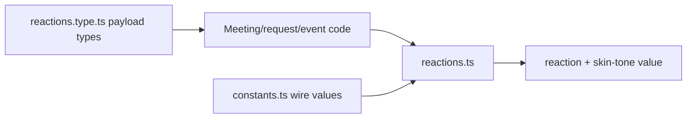
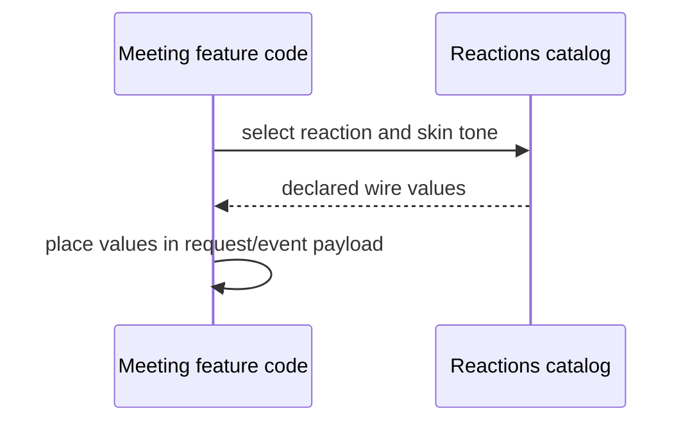
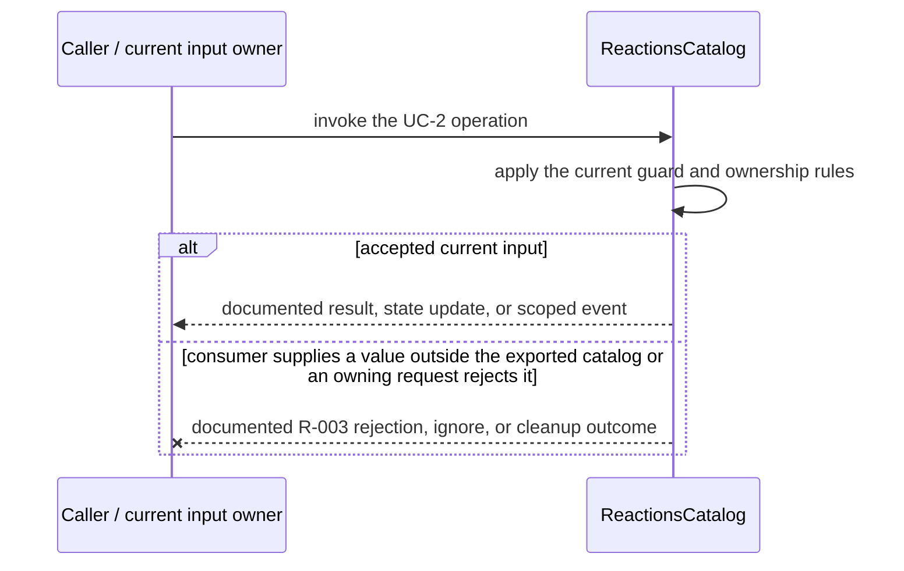
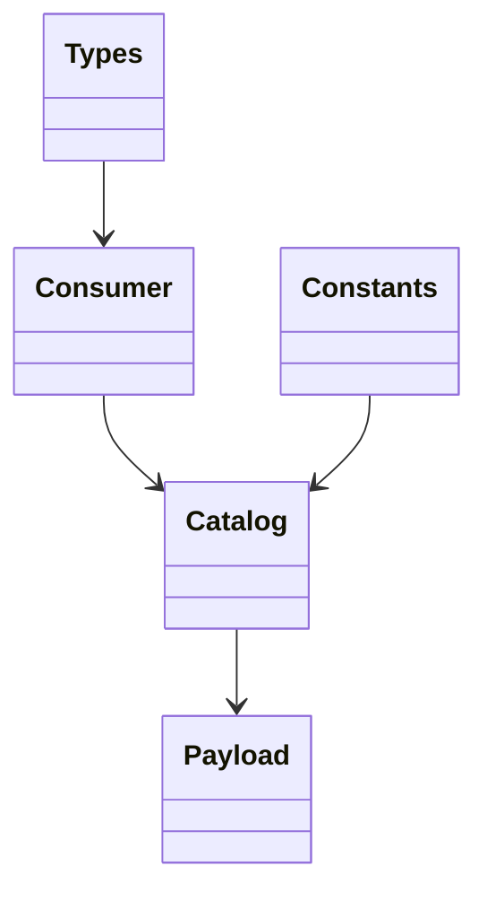

<!-- sdd-generated-metadata
doc_kind: module-spec
generated_from: module-spec@0.2.2
generator_plugin: repo-annotation@1.0.5+codex.20260818094939
generated_by: codex
approved_by: repository user
updated_at: 2026-08-21T06:10:05Z
validation_status: not-run
-->
# REACTIONS — SPEC

> Start here → root [`AGENTS.md`](../../../AGENTS.md) · router [`SPEC_INDEX.md`](../../../ai-docs/SPEC_INDEX.md) · system [`ARCHITECTURE.md`](../../../ai-docs/ARCHITECTURE.md). This is the canonical source-local spec for `src/reactions/`.

## Metadata

| Field | Value |
|---|---|
| Module id | `reactions` |
| Source path(s) | `src/reactions/` |
| Parent spec | — |
| Doc kind | Module spec |
| Coverage score | 93% assessed 2026-08-21; 13/14 mandatory fields present; all critical and Important fields present; one noncritical polish gap remains |
| Generated from | `module-spec` @ SDLC template library `0.2.2` |
| generated_by / approved_by / updated_at | codex / repository user / 2026-08-21T06:10:05Z |
| Validation status | not-run |

## Evidence Rules

Requirements cite current source and mirrored tests. Current code wins over retained prose when they conflict; commit and PR history are excluded. Missing evidence stays a gap.

## Source Material Register

| Source material | Scope | Decision | Detail location or disposition |
|---|---|---|---|
| Retained package consumer documentation | overview / API / behavior / tests | used and verified; reaction availability and event/request meaning were placed into the public surface and invariants |
| Current source and mirrored tests | implementation / tests | verified | requirements, flows, failures, and test strategy below |

## Overview

`src/reactions/` contains 3 direct source/reference file(s) and has 0 mirrored unit-test file(s). This spec separates its public operations, runtime data movement, component ownership, state applicability, and verification boundary.

## Purpose / Responsibility

Defines the supported reaction and skin-tone catalogs plus typed normalization between consumer reaction data and server relay values.

## Stack

TypeScript/JavaScript in the Node 22.14 Yarn workspace; Webex core/plugin abstractions and Mocha/Sinon/`@webex/test-helper-chai` tests.

## Folder / Package Structure

```text
src/reactions/
├── constants.ts — module constants and wire values
├── reactions.ts — reactions implementation responsibility
├── reactions.type.ts — reactions.type implementation responsibility
└── ai-docs/reactions-spec.md — canonical module specification
```

## Key Files (source of truth)

| File | Holds |
|---|---|
| `src/reactions/constants.ts` | module constants and wire values |
| `src/reactions/reactions.ts` | reactions implementation responsibility |
| `src/reactions/reactions.type.ts` | reactions.type implementation responsibility |
| no source-local mirrored test directory | explicit characterization gap |

## Public Surface

| Contract ID | Type | Surface | Purpose | Compatibility / deprecation | Schema / detail link | Root index |
|---|---|---|---|---|---|---|
| `reactions.1` | SDK / in-process | export supported reaction and skin-tone catalogs | Focused operation group owned by this module | Preserve methods/events/wire values reachable from package objects | `src/reactions/reactions.ts` | [CONTRACTS](../../../ai-docs/CONTRACTS.md) |
| `reactions.2` | SDK / in-process | type reaction, sender, and relay payloads | Focused operation group owned by this module | Preserve methods/events/wire values reachable from package objects | `src/reactions/reactions.ts` | [CONTRACTS](../../../ai-docs/CONTRACTS.md) |
| `reactions.3` | SDK / in-process | normalize reaction values used by meeting requests/events | Focused operation group owned by this module | Preserve methods/events/wire values reachable from package objects | `src/reactions/reactions.ts` | [CONTRACTS](../../../ai-docs/CONTRACTS.md) |

Compatibility notes:
- Prefer additive fields/options and preserve current return and rejection semantics. Internal helpers are not public merely because they are exported within the source directory.

## Requires (dependencies)

Reaction constants/types and Meeting reaction request/event paths.

## Requirements

| ID | WHAT | WHY | Source Evidence | Test / Example Evidence | Assumptions / Gaps | Confidence |
|---|---|---|---|---|---|---|
| `REACTIONS-R-001` | export supported reaction and skin-tone catalogs. | Defines the supported reaction and skin-tone catalogs plus typed normalization between consumer reaction data and server relay values. | `src/reactions/reactions.ts` | `test/unit/spec/meeting/request.js` | none | PRESENT |
| `REACTIONS-R-002` | type reaction, sender, and relay payloads. | Consumers need deterministic behavior across meeting and remote updates. | `src/reactions/reactions.ts`, `src/reactions/reactions.type.ts` | `test/unit/spec/meeting/request.js` | inspect sibling tests for operation-specific cases | PRESENT |
| `REACTIONS-R-003` | The catalogs perform no fallible I/O; unsupported values are prevented by declared constants/types or handled by the owning request path. | Callers must receive the actual module failure outcome without false cleanup or event guarantees. | `src/reactions/` | `test/unit/spec/meeting/request.js` | none | PRESENT |

## Design Overview

`reactions.ts` and `constants.ts` export static reaction/skin-tone values, while `reactions.type.ts` supplies compile-time payload shapes. The module has no runtime transport or lifecycle state.

## Data Flow



## Sequence Diagram(s)

Sequence coverage:

| Operation group | Diagram | Failure coverage |
|---|---|---|
| UC-1 — primary operation | Primary operation sequence | accepted and rejected dependency outcomes |
| UC-2 — secondary/change operation | Secondary operation and failure sequence | consumer supplies a value outside the exported catalog or an owning request rejects it |

### Primary operation sequence



### Secondary operation and failure sequence



## Class / Component Relationships



The arrows identify ownership and delegation inside `src/reactions/`; files that only declare types or constants are not presented as transports.

## Use Cases

- **UC-1:** Expose the supported reaction and skin-tone catalogs to package consumers. Evidence: `src/reactions/`.
- **UC-2:** Type reaction relay/sender payloads used by owning meeting request and event code. Evidence: `src/reactions/`.

## Business Rules & Invariants

- Consumer/server reaction and skin-tone values use declared enums/catalogs; participant sender data follows package privacy rules. Enforced under `src/reactions/`.

## Protocol / Wire Format

- Existing request/event/channel types and constants under `src/reactions/` own serialization and parsing. Preserve field names, enum/raw values, identity/routing fields, and compatibility; normalized client properties are not a replacement wire schema.

## Pitfalls

- Display glyph/name and server relay type are different representations. Send the declared server value, not an arbitrary UI label.
- Verify both typed constants/enums and raw wire values before changing a logical condition in this legacy package.

## Test-Case Strategy (module)

No mirrored module test directory exists. Characterize the two code-grounded use cases above and the listed failure condition; add cleanup or transition cases only for resources and state this module actually owns.

| Behavior / Requirement | Existing test evidence | Gap |
|---|---|---|
| `REACTIONS-R-001` | `test/unit/spec/meeting/request.js` | inspect sibling tests for full operation matrix |
| `REACTIONS-R-002` | `test/unit/spec/meeting/request.js` | verify the operation-specific invalid-input and rejection branches |
| `REACTIONS-R-003` | `test/unit/spec/meeting/request.js` | verify the concrete R-003 rejection, ignore, or cleanup outcome |

## Traceability

- Repo architecture: [`ARCHITECTURE.md`](../../../ai-docs/ARCHITECTURE.md) · Registry: [`SPEC_INDEX.md`](../../../ai-docs/SPEC_INDEX.md)
- Coverage state and contracts baseline: `../../../.sdd/manifest.json`
