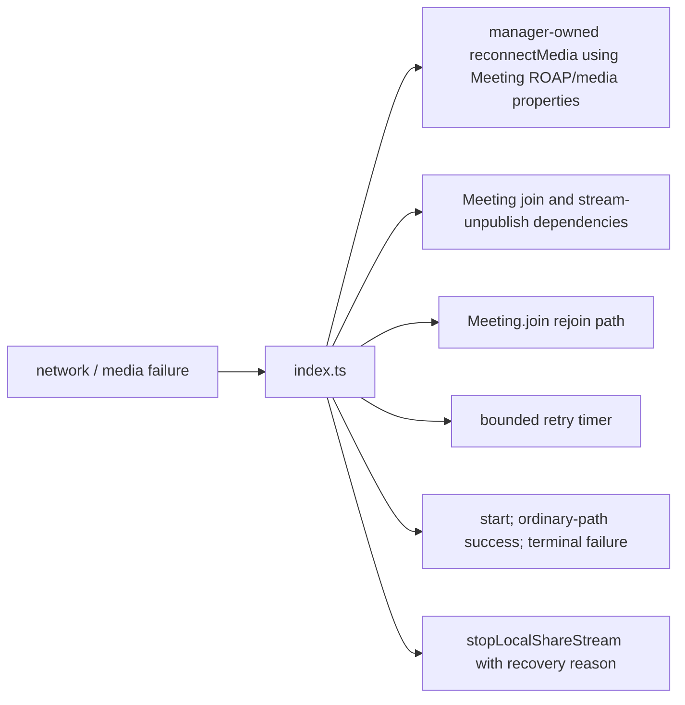
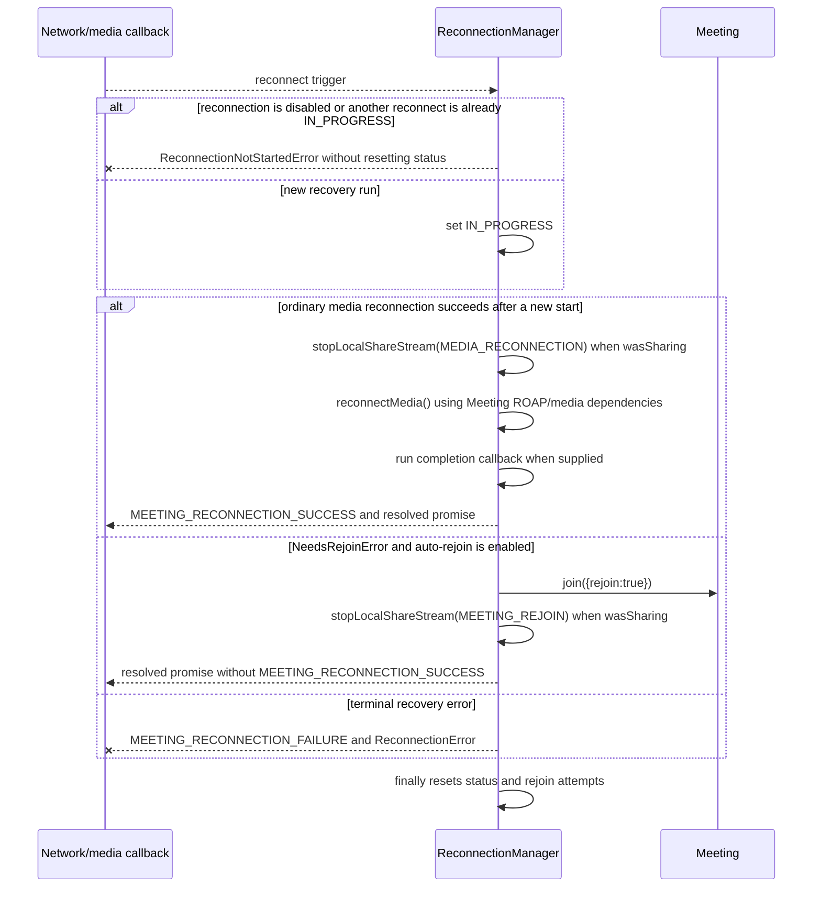
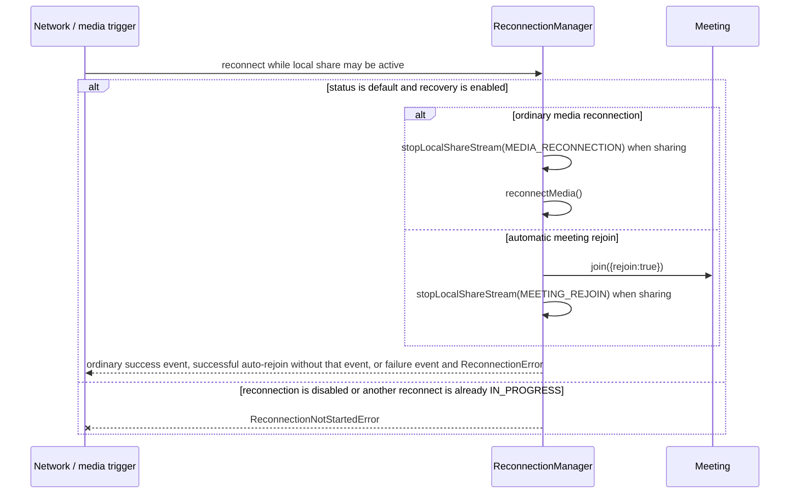
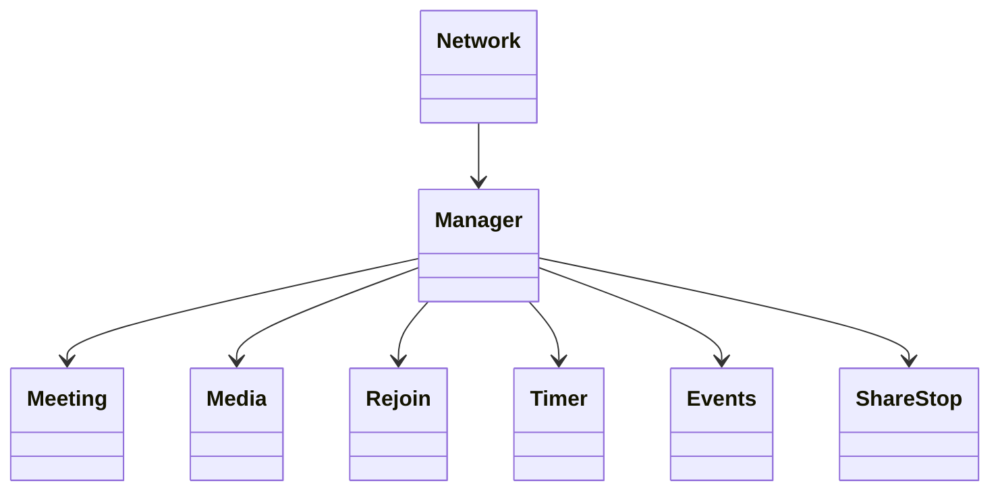

<!-- sdd-generated-metadata
doc_kind: module-spec
generated_from: module-spec@0.2.2
generator_plugin: repo-annotation@1.0.5+codex.20260818094939
generated_by: codex
approved_by: repository user
updated_at: 2026-08-22T15:21:29Z
validation_status: pass-with-warnings
-->
# RECONNECTION MANAGER — SPEC

> Start here → root [`AGENTS.md`](../../../AGENTS.md) · router [`SPEC_INDEX.md`](../../../ai-docs/SPEC_INDEX.md) · system [`ARCHITECTURE.md`](../../../ai-docs/ARCHITECTURE.md). This is the canonical source-local spec for `src/reconnection-manager/`.

## Metadata

| Field | Value |
|---|---|
| Module id | `reconnection-manager` |
| Source path(s) | `src/reconnection-manager/` |
| Parent spec | — |
| Doc kind | Module spec |
| Coverage score | 93% assessed 2026-08-22; 13/14 mandatory fields present; all critical and Important fields present; one noncritical polish gap remains; pending independent validation of the participant-role repair |
| Generated from | `module-spec` @ SDLC template library `0.2.2` |
| generated_by / approved_by / updated_at | codex / repository user / 2026-08-22T15:21:29Z |
| Validation status | pass-with-warnings |

## Evidence Rules

Requirements cite current implementation and mirrored unit-test paths. Current code wins over retained prose when they conflict; commit and PR history are excluded by repository-owner decision. Missing test evidence is stated as a gap rather than inferred.

## Source Material Register

| Source material | Scope | Decision | Detail location or disposition |
|---|---|---|---|
| No routed legacy module spec | overview / API / behavior / tests | none; generated from current recovery state machine and tests |
| Current source and mirrored tests | implementation / tests | verified | requirements, flows, failures, and test strategy below |

## Overview

`src/reconnection-manager/` contains 1 direct source/reference file(s) and has 1 mirrored unit-test file(s). This spec separates its public operations, runtime data movement, component ownership, state applicability, and verification boundary.

## Purpose / Responsibility

Coordinates bounded network/media recovery, escalating from reconnecting media to rejoining the meeting when required.

## Stack

TypeScript/JavaScript in the Node 22.14 Yarn workspace; Webex core/plugin abstractions and Mocha/Sinon/`@webex/test-helper-chai` tests. Build target: `yarn workspace @webex/plugin-meetings build:src`.

## Folder / Package Structure

```text
src/reconnection-manager/
├── index.ts — module facade/controller or primary exports
└── ai-docs/reconnection-manager-spec.md — canonical module specification
```

## Key Files (source of truth)

| File | Holds |
|---|---|
| `src/reconnection-manager/index.ts` | module facade/controller or primary exports |
| `test/unit/spec/reconnection-manager/index.js` | mirrored characterization/unit coverage |

## Public Surface

| Contract ID | Type | Surface | Purpose | Compatibility / deprecation | Schema / detail link | Root index |
|---|---|---|---|---|---|---|
| `reconnection-manager.1` | SDK / state | `ReconnectionManager.isReconnectInProgress()`, `reset()`, and `cleanUp()` | Expose the duplicate-run guard and reset only reconnection status plus rejoin attempts. | `cleanUp()` calls `reset()`; neither clears `iceState.timer` nor settles/clears the ICE defer. Use `resetReconnectionTimer()` for that separate state. | `src/reconnection-manager/index.ts` | [CONTRACTS](../../../ai-docs/CONTRACTS.md) |
| `reconnection-manager.2` | SDK / ICE wait | `waitForIceReconnect()`, `iceReconnected()`, and `resetReconnectionTimer()` | Wait for a bounded ICE recovery signal and settle/clear the owned timer/defer. | Preserve timeout duration, settlement, and reset ordering. | `src/reconnection-manager/index.ts` | [CONTRACTS](../../../ai-docs/CONTRACTS.md) |
| `reconnection-manager.3` | SDK / recovery | `reconnect()` | Run one guarded recovery sequence, emitting success after the ordinary recovery/completion-callback path and failure on terminal errors. | A successful auto-rejoin returns before `MEETING_RECONNECTION_SUCCESS`; disabled/duplicate starts throw, and terminal failure resets status/attempts in `finally`. | `src/reconnection-manager/index.ts` | [CONTRACTS](../../../ai-docs/CONTRACTS.md) |
| `reconnection-manager.4` | SDK / recovery | `reconnectMedia()` | Retry the current media reconnection path within configured attempt limits. | Preserve attempt bounds and escalation to meeting rejoin. | `src/reconnection-manager/index.ts` | [CONTRACTS](../../../ai-docs/CONTRACTS.md) |
| `reconnection-manager.5` | SDK / recovery | `rejoinMeeting()` | Rejoin the meeting and stop a share that was active at recovery start with the recovery reason. | Current code does not restore or republish sharing after recovery. | `src/reconnection-manager/index.ts` | [CONTRACTS](../../../ai-docs/CONTRACTS.md) |

### Emitted events

Current source emits or forwards these observable literals for this operation boundary. Preserve literal values, scope, payload shape, and emission timing; a constant name alone is not a substitute for the consumer-visible value.

| Event literal | Constant / expression | Emission evidence |
|---|---|---|
| `meeting:reconnectionFailure` | `EVENT_TRIGGERS.MEETING_RECONNECTION_FAILURE` | `src/reconnection-manager/index.ts` |
| `meeting:reconnectionStarting` | `EVENT_TRIGGERS.MEETING_RECONNECTION_STARTING` | `src/reconnection-manager/index.ts` |
| `meeting:reconnectionSuccess` | `EVENT_TRIGGERS.MEETING_RECONNECTION_SUCCESS` | `src/reconnection-manager/index.ts` |
| `meeting:stoppedSharingLocal` | `EVENT_TRIGGERS.MEETING_STOPPED_SHARING_LOCAL` | `src/meeting/index.ts`, `src/reconnection-manager/index.ts` |

`MEETING_RECONNECTION_SUCCESS` is emitted only after `executeReconnection()` and any completion callback finish on the ordinary path. When a `NeedsRejoinError` is handled by successful automatic rejoin, `reconnect()` returns immediately after `rejoinMeeting()` and skips that success event. Terminal errors still emit `MEETING_RECONNECTION_FAILURE`.

Compatibility notes:
- Prefer additive options and payload fields. Preserve method/event names, rejection semantics, and cleanup timing; route public changes through `src/index.ts` or the documented owning object.

## Requires (dependencies)

Meeting lifecycle/media methods, network state callbacks, timers, retry configuration, logging, events, and metrics.

## Requirements

| ID | WHAT | WHY | Source Evidence | Test / Example Evidence | Assumptions / Gaps | Confidence |
|---|---|---|---|---|---|---|
| `RECONNECTION-MANAGER-R-001` | start/reset/inspect reconnection state. | Coordinates bounded network/media recovery, escalating from reconnecting media to rejoining the meeting when required. | `src/reconnection-manager/index.ts` | `test/unit/spec/reconnection-manager/index.js` | none | PRESENT |
| `RECONNECTION-MANAGER-R-002` | retry media reconnection with timers. | Attempt limits and timers determine when recovery stays in media reconnect versus escalating to a full rejoin. | `src/reconnection-manager/index.ts` | `test/unit/spec/reconnection-manager/index.js` | ICE event/timeout races at the final attempt boundary need explicit coverage | PRESENT |
| `RECONNECTION-MANAGER-R-003` | Duplicate starts throw `ReconnectionNotStartedError`. Ordinary successful recovery emits `MEETING_RECONNECTION_SUCCESS` after its completion callback, but successful automatic rejoin returns before that emission. Terminal recovery failures emit `MEETING_RECONNECTION_FAILURE` and reject with `ReconnectionError`; some inner paths assign `FAILURE`, but the outer `finally` calls `reset()` and returns status to the default value. | Callers must not treat success-event presence as proof of every successful recovery mode, and must rely on the returned rejection/failure event rather than assume that `FAILURE` persists after settlement. | `src/reconnection-manager/index.ts` | `test/unit/spec/reconnection-manager/index.js` | characterize the absent success event after successful auto-rejoin | PRESENT |
| `RECONNECTION-MANAGER-R-004` | `status === IN_PROGRESS` prevents a second recovery run; `rejoinAttempts` is bounded by `maxRejoinAttempts` and both fields are reset by `reconnect()` cleanup. The separate ICE-wait path owns `iceState.timer` and clears it through `resetReconnectionTimer()`; `cleanUp()` does not invoke that method. | Concurrent network/media callbacks must not launch duplicate media negotiations or meeting joins, and lifecycle cleanup must not be documented as settling an independent ICE wait that current code leaves intact. | `src/reconnection-manager/index.ts` | `test/unit/spec/reconnection-manager/index.js` | characterize `cleanUp()` while an ICE wait is pending | PRESENT |
| `RECONNECTION-MANAGER-R-005` | Recovery first reconnects media where allowed, then escalates to meeting rejoin. If recovery started while sharing, current code calls `stopLocalShareStream` with `MEDIA_RECONNECTION` or `MEETING_REJOIN`; it does not republish or restore sharing. | This records the observable behavior and prevents a future test or caller from assuming restoration that does not exist. | `src/reconnection-manager/index.ts` | `test/unit/spec/reconnection-manager/index.js` | Possible product defect: user intent may be to restore prior sharing after recovery, but no restoration path exists. | PRESENT |

## Design Overview

The manager serializes one recovery run, first attempting its own `reconnectMedia()` operation and then calling `Meeting.join()` when rejoin is required. It owns retry counters/timers and `stopLocalShareStream()`; its media operation reaches into the Meeting's ROAP and media-connection dependencies rather than calling a `Meeting.reconnectMedia()` method.

## Data Flow



## Sequence Diagram(s)

Sequence coverage:

| Operation group | Diagram | Failure coverage |
|---|---|---|
| UC-1…UC-4 — reconnection and rejoin operation groups | Reconnection and rejoin primary sequence | disabled/duplicate start, ICE timeout, bounded retry escalation, and terminal reset |
| UC-1…UC-4 — reconnection and rejoin alternate/failure paths | Reconnection and rejoin alternate/failure sequence | duplicate start, exhausted retry count, media reconnection rejection, meeting rejoin rejection, or network state change during recovery |

### Reconnection and rejoin primary sequence



### Reconnection and rejoin alternate/failure sequence



## Class / Component Relationships



The arrows identify ownership and delegation inside `src/reconnection-manager/`; files that only declare types or constants are not presented as transports.

## Use Cases

- **UC-1:** Reject recovery when reconnection is disabled or another `reconnect()` already owns the `IN_PROGRESS` state. Evidence: `src/reconnection-manager/index.ts`.
- **UC-2:** Wait for bounded ICE reconnection, clearing the timer/defer when ICE returns or the wait resets. Evidence: `src/reconnection-manager/index.ts`.
- **UC-3:** Retry media reconnection within configured limits, then escalate to meeting rejoin. Emit success only after the ordinary recovery/completion-callback path; a successful automatic rejoin resolves without that event, while terminal errors emit failure. Evidence: `src/reconnection-manager/index.ts`.
- **UC-4:** When recovery began while sharing, stop the local share stream with the matching recovery reason; current code does not restore or republish it. Evidence: `src/reconnection-manager/index.ts`.

## State Model

The manager stores reconnection `status`, `rejoinAttempts`, configured attempt limits, and `iceState` (`disconnected`, resolver, timer, timeout). Sharing is read from the owning Meeting when recovery starts; there is no stored reconnect promise or last-recovery-mode field.

## Business Rules & Invariants

- Only one recovery run is active and retries are bounded. `reconnect()` success/failure resets reconnection status and attempts; the independent ICE timer/defer is cleared only through `iceReconnected()`/`resetReconnectionTimer()`, not by `cleanUp()`. A previously active share is stopped with a recovery-specific reason and is not restored by this module. Evidence: `src/reconnection-manager/index.ts`.

## Concurrency & Reactive Flow

- `status === IN_PROGRESS` is the duplicate-run guard for the duration of `reconnect()`. The outer `finally` resets status and `rejoinAttempts`; the independent ICE-wait timer is cleared by `iceReconnected()`/`resetReconnectionTimer()`. A share active at recovery start is stopped with the concrete recovery reason and is not republished by a later completion.

## State Machine

```mermaid
stateDiagram-v2
  state "'' (default)" as DEFAULT
  [*] --> DEFAULT
  DEFAULT --> IN_PROGRESS: reconnect()
  IN_PROGRESS --> DEFAULT: recovery succeeds / reset()
  IN_PROGRESS --> FAILURE: terminal recovery error
  FAILURE --> DEFAULT: reset()
```

The diagram uses the concrete `''`, `IN_PROGRESS`, and `FAILURE` values declared for reconnection status.

## Error Handling & Failure Modes

| Condition | Signal | Caller recovery |
|---|---|---|
| Reconnection is disabled or status is already `IN_PROGRESS` | `reconnect()` throws `ReconnectionNotStartedError`. | Wait for the active run to settle or enable recovery before a new attempt. |
| Media/WebSocket/rejoin recovery reaches a terminal failure | The manager emits `MEETING_RECONNECTION_FAILURE`, rejects with `ReconnectionError`, and `finally` resets status/attempts; inner `FAILURE` assignments are not persistent terminal state. | Handle the failure event/rejection and inspect current meeting state before another run. |
| `NeedsRejoinError` is handled by a successful automatic rejoin | `reconnect()` resolves after `rejoinMeeting()` and returns before `MEETING_RECONNECTION_SUCCESS` or the recovered metric is emitted. | Treat the resolved operation/current meeting state as the outcome; do not wait for a success event on this path. |
| Recovery began while local sharing was active | Current code unpublishes/stops the local share with `MEDIA_RECONNECTION` or `MEETING_REJOIN`; it does not restore or republish it. | Treat restoration as a separate product decision/operation. |
| `cleanUp()` runs while `waitForIceReconnect()` is pending | Status and rejoin attempts reset, but the ICE timer/defer remain active because `cleanUp()` does not call `resetReconnectionTimer()`. | Explicitly invoke the ICE reset path when the owner intends to settle that pending wait. |

## Pitfalls

- Network and media events can request recovery concurrently. Starting a second timer/promise produces duplicate joins and stale completion callbacks.
- `cleanUp()` is not a full ICE-wait teardown: it resets status/attempts only. An owner that needs to settle and clear `iceState` must call `resetReconnectionTimer()` explicitly.
- Public behavior may be reachable through a parent `Meeting`/`Meetings` object even when the source helper is not exported directly.

## Key Design Trade-off

- Escalating recovery favors continuity over immediate failure, with bounded delay and more lifecycle complexity.

## Test-Case Strategy (module)

Use the current mirrored suites: `test/unit/spec/reconnection-manager/index.js`. Characterize the reconnection-manager-specific use cases above and each listed failure condition; add cleanup or transition cases only for resources and state this module actually owns.

| Behavior / Requirement | Existing test evidence | Gap |
|---|---|---|
| `RECONNECTION-MANAGER-R-001` | `test/unit/spec/reconnection-manager/index.js` | cover state reset, ICE wait, media retry, rejoin, and sharing-stop groups |
| `RECONNECTION-MANAGER-R-002` | `test/unit/spec/reconnection-manager/index.js` | ICE event/timeout races at the final attempt boundary need explicit coverage |
| `RECONNECTION-MANAGER-R-003` | `test/unit/spec/reconnection-manager/index.js` | assert successful auto-rejoin resolves without `MEETING_RECONNECTION_SUCCESS`, both recovery reasons stop an active share, and no completion path republishes it |
| `RECONNECTION-MANAGER-R-004` | `test/unit/spec/reconnection-manager/index.js` | verify concurrent triggers and exhausted retries |
| `RECONNECTION-MANAGER-R-005` | `test/unit/spec/reconnection-manager/index.js` | characterize both `stopLocalShareStream` recovery reasons; restoration remains a product-decision gap |

## Traceability

- Repo architecture: [`ARCHITECTURE.md`](../../../ai-docs/ARCHITECTURE.md) · Registry: [`SPEC_INDEX.md`](../../../ai-docs/SPEC_INDEX.md)
- Coverage state and contracts baseline: `../../../.sdd/manifest.json`
