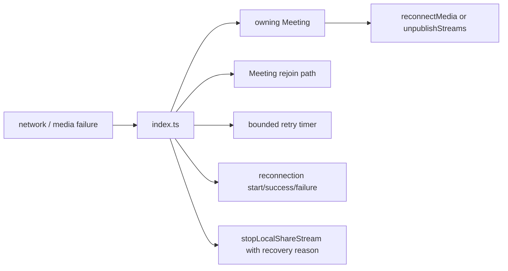
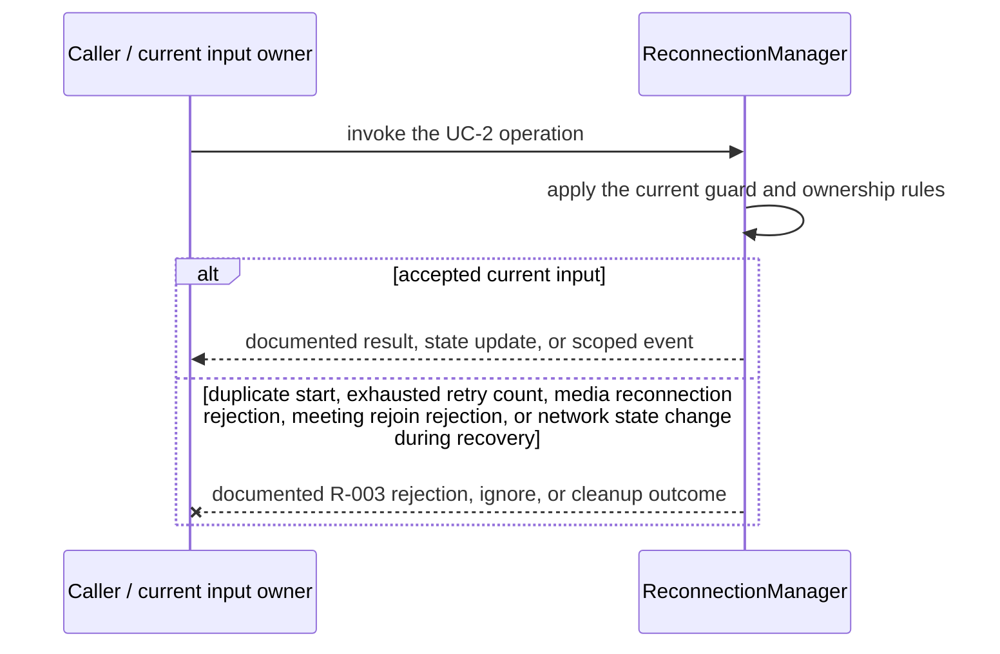
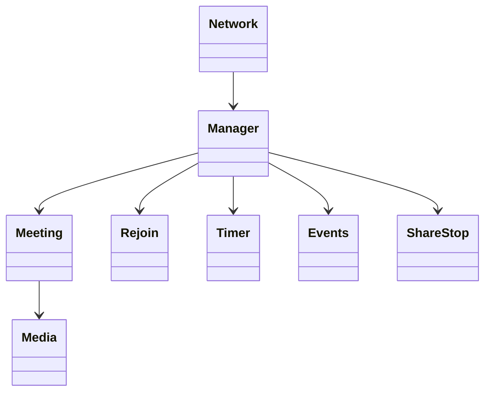

<!-- sdd-generated-metadata
doc_kind: module-spec
generated_from: module-spec@0.2.2
generator_plugin: repo-annotation@1.0.5+codex.20260818094939
generated_by: codex
approved_by: repository user
updated_at: 2026-08-21T06:10:05Z
validation_status: not-run
-->
# RECONNECTION MANAGER — SPEC

> Start here → root [`AGENTS.md`](../../../AGENTS.md) · router [`SPEC_INDEX.md`](../../../ai-docs/SPEC_INDEX.md) · system [`ARCHITECTURE.md`](../../../ai-docs/ARCHITECTURE.md). This is the canonical source-local spec for `src/reconnection-manager/`.

## Metadata

| Field | Value |
|---|---|
| Module id | `reconnection-manager` |
| Source path(s) | `src/reconnection-manager/` |
| Parent spec | — |
| Doc kind | Module spec |
| Coverage score | 93% assessed 2026-08-21; 13/14 mandatory fields present; all critical and Important fields present; one noncritical polish gap remains |
| Generated from | `module-spec` @ SDLC template library `0.2.2` |
| generated_by / approved_by / updated_at | codex / repository user / 2026-08-21T06:10:05Z |
| Validation status | not-run |

## Evidence Rules

Requirements cite current implementation and mirrored unit-test paths. Current code wins over retained prose when they conflict; commit and PR history are excluded by repository-owner decision. Missing test evidence is stated as a gap rather than inferred.

## Source Material Register

| Source material | Scope | Decision | Detail location or disposition |
|---|---|---|---|
| No routed legacy module spec | overview / API / behavior / tests | none; generated from current recovery state machine and tests |
| Current source and mirrored tests | implementation / tests | verified | requirements, flows, failures, and test strategy below |

## Overview

`src/reconnection-manager/` contains 1 direct source/reference file(s) and has 1 mirrored unit-test file(s). This spec separates its public operations, runtime data movement, component ownership, state applicability, and verification boundary.

## Purpose / Responsibility

Coordinates bounded network/media recovery, escalating from reconnecting media to rejoining the meeting when required.

## Stack

TypeScript/JavaScript in the Node 22.14 Yarn workspace; Webex core/plugin abstractions and Mocha/Sinon/`@webex/test-helper-chai` tests. Build target: `yarn workspace @webex/plugin-meetings build:src`.

## Folder / Package Structure

```text
src/reconnection-manager/
├── index.ts — module facade/controller or primary exports
└── ai-docs/reconnection-manager-spec.md — canonical module specification
```

## Key Files (source of truth)

| File | Holds |
|---|---|
| `src/reconnection-manager/index.ts` | module facade/controller or primary exports |
| `test/unit/spec/reconnection-manager/index.js` | mirrored characterization/unit coverage |

## Public Surface

| Contract ID | Type | Surface | Purpose | Compatibility / deprecation | Schema / detail link | Root index |
|---|---|---|---|---|---|---|
| `reconnection-manager.1` | SDK / in-process | start/reset/inspect reconnection state | Preserve the module responsibility through a focused operation group | Consumer-visible methods/events are semver-sensitive when reachable from package objects | `src/reconnection-manager/index.ts` | [CONTRACTS](../../../ai-docs/CONTRACTS.md) |
| `reconnection-manager.2` | SDK / in-process | retry media reconnection with timers | Preserve the module responsibility through a focused operation group | Consumer-visible methods/events are semver-sensitive when reachable from package objects | `src/reconnection-manager/index.ts` | [CONTRACTS](../../../ai-docs/CONTRACTS.md) |
| `reconnection-manager.3` | SDK / in-process | rejoin the meeting and stop a previously active local share with the recovery reason | Preserve the current observable recovery behavior; restoration is not implemented | Consumer-visible methods/events are semver-sensitive when reachable from package objects | `src/reconnection-manager/index.ts` | [CONTRACTS](../../../ai-docs/CONTRACTS.md) |

Compatibility notes:
- Prefer additive options and payload fields. Preserve method/event names, rejection semantics, and cleanup timing; route public changes through `src/index.ts` or the documented owning object.

## Requires (dependencies)

Meeting lifecycle/media methods, network state callbacks, timers, retry configuration, logging, events, and metrics.

## Requirements

| ID | WHAT | WHY | Source Evidence | Test / Example Evidence | Assumptions / Gaps | Confidence |
|---|---|---|---|---|---|---|
| `RECONNECTION-MANAGER-R-001` | start/reset/inspect reconnection state. | Coordinates bounded network/media recovery, escalating from reconnecting media to rejoining the meeting when required. | `src/reconnection-manager/index.ts` | `test/unit/spec/reconnection-manager/index.js` | none | PRESENT |
| `RECONNECTION-MANAGER-R-002` | retry media reconnection with timers. | Callers need deterministic observable behavior across async Webex inputs. | `src/reconnection-manager/index.ts`, `src/reconnection-manager/index.ts` | `test/unit/spec/reconnection-manager/index.js` | additional edge cases may live in sibling tests | PRESENT |
| `RECONNECTION-MANAGER-R-003` | Terminal media/rejoin failures set `FAILURE`, emit the established failure signal, and clear the active timer/promise state; duplicate starts are rejected. | Callers must receive the actual module failure outcome without false cleanup or event guarantees. | `src/reconnection-manager/` | `test/unit/spec/reconnection-manager/index.js` | none | PRESENT |
| `RECONNECTION-MANAGER-R-004` | At most one reconnection run is active; attempt counters/timers are bounded and reset on success or terminal failure. | Concurrent network/media callbacks must not launch duplicate media negotiations or meeting joins. | `src/reconnection-manager/index.ts` | `test/unit/spec/reconnection-manager/index.js` | none | PRESENT |
| `RECONNECTION-MANAGER-R-005` | Recovery first reconnects media where allowed, then escalates to meeting rejoin. If recovery started while sharing, current code calls `stopLocalShareStream` with `MEDIA_RECONNECTION` or `MEETING_REJOIN`; it does not republish or restore sharing. | This records the observable behavior and prevents a future test or caller from assuming restoration that does not exist. | `src/reconnection-manager/index.ts` | `test/unit/spec/reconnection-manager/index.js` | Possible product defect: user intent may be to restore prior sharing after recovery, but no restoration path exists. | PRESENT |

## Design Overview

The manager serializes one recovery run, first attempting media reconnection and then meeting rejoin when configured. It owns retry counters/timers and delegates all media/join actions to its Meeting reference.

## Data Flow



## Sequence Diagram(s)

Sequence coverage:

| Operation group | Diagram | Failure coverage |
|---|---|---|
| UC-1 — primary operation | Primary operation sequence | accepted and rejected dependency outcomes |
| UC-2 — secondary/change operation | Secondary operation and failure sequence | duplicate start, exhausted retry count, media reconnection rejection, meeting rejoin rejection, or network state change during recovery |

### Primary operation sequence

```mermaid
sequenceDiagram
  participant N as Network/media callback
  participant R as ReconnectionManager
  participant M as Meeting
  N-->>R: reconnect trigger
  R->>R: reject duplicate run; set IN_PROGRESS
  alt media reconnection allowed
    R->>M: reconnect media
    R->>M: stopLocalShareStream(MEDIA_RECONNECTION) when wasSharing
  else escalate to rejoin
    R->>M: unpublishStreams and rejoin
    R->>M: stopLocalShareStream(MEETING_REJOIN) when wasSharing
  end
  R->>R: reset on success or set FAILURE on terminal error
  R-->>N: success/failure event and promise result
```

### Secondary operation and failure sequence



## Class / Component Relationships



The arrows identify ownership and delegation inside `src/reconnection-manager/`; files that only declare types or constants are not presented as transports.

## Use Cases

- **UC-1:** Run one bounded recovery attempt sequence and escalate from media reconnection to meeting rejoin according to current guards. Evidence: `src/reconnection-manager/`.
- **UC-2:** When recovery began while sharing, stop the local share stream with the matching recovery reason; current code does not restore or republish it. Evidence: `src/reconnection-manager/`.

## State Model

Reconnection status, attempt counters, timers, in-flight promise, sharing intent, and last recovery mode are meeting scoped.

## Business Rules & Invariants

- Only one recovery run is active; retries are bounded; success and terminal failure clear timers/state. A previously active share is stopped with a recovery-specific reason and is not restored by this module. Evidence: `src/reconnection-manager/index.ts`.

## Concurrency & Reactive Flow

- Async work owned by `ReconnectionManager` may complete after a newer caller or remote input. Preserve the identity, sequence, and resource-owner guards in `src/reconnection-manager/`; a late completion must not replay UC-2 for superseded state.

## State Machine

```mermaid
stateDiagram-v2
  state "'' (default)" as DEFAULT
  [*] --> DEFAULT
  DEFAULT --> IN_PROGRESS: reconnect()
  IN_PROGRESS --> DEFAULT: recovery succeeds / reset()
  IN_PROGRESS --> FAILURE: terminal recovery error
  FAILURE --> DEFAULT: reset()
```

The diagram uses the concrete `''`, `IN_PROGRESS`, and `FAILURE` values declared for reconnection status.

## Error Handling & Failure Modes

| Condition | Signal | Caller recovery |
|---|---|---|
| duplicate start, exhausted retry count, media reconnection rejection, meeting rejoin rejection, or network state change during recovery | Follow the concrete rejection, ignore, state, or cleanup behavior in the module's R-003 requirement. | Resolve the named condition; retry only when another requirement defines a bound. |
| UC-1 succeeds | Return, update, callback, or scoped event identified by the Public Surface and primary sequence. | Continue from the owning module's accepted state. |

## Pitfalls

- Network and media events can request recovery concurrently. Starting a second timer/promise produces duplicate joins and stale completion callbacks.
- Public behavior may be reachable through a parent `Meeting`/`Meetings` object even when the source helper is not exported directly.

## Key Design Trade-off

- Escalating recovery favors continuity over immediate failure, with bounded delay and more lifecycle complexity.

## Test-Case Strategy (module)

Use the current mirrored suites: `test/unit/spec/reconnection-manager/index.js`. Characterize the two code-grounded use cases above and the listed failure condition; add cleanup or transition cases only for resources and state this module actually owns.

| Behavior / Requirement | Existing test evidence | Gap |
|---|---|---|
| `RECONNECTION-MANAGER-R-001` | `test/unit/spec/reconnection-manager/index.js` | confirm the named operation against its owning sibling suite |
| `RECONNECTION-MANAGER-R-002` | `test/unit/spec/reconnection-manager/index.js` | verify the code-grounded rejection or stale-input branch |
| `RECONNECTION-MANAGER-R-003` | `test/unit/spec/reconnection-manager/index.js` | verify the concrete R-003 rejection, ignore, or cleanup outcome |
| `RECONNECTION-MANAGER-R-004` | `test/unit/spec/reconnection-manager/index.js` | verify concurrent triggers and exhausted retries |
| `RECONNECTION-MANAGER-R-005` | `test/unit/spec/reconnection-manager/index.js` | characterize both `stopLocalShareStream` recovery reasons; restoration remains a product-decision gap |

## Traceability

- Repo architecture: [`ARCHITECTURE.md`](../../../ai-docs/ARCHITECTURE.md) · Registry: [`SPEC_INDEX.md`](../../../ai-docs/SPEC_INDEX.md)
- Coverage state and contracts baseline: `../../../.sdd/manifest.json`
