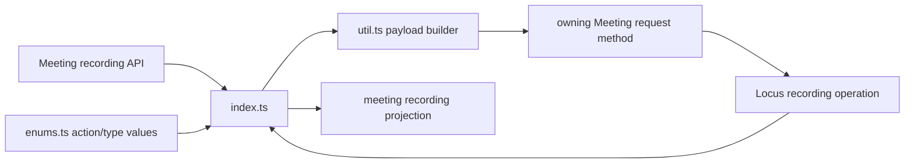
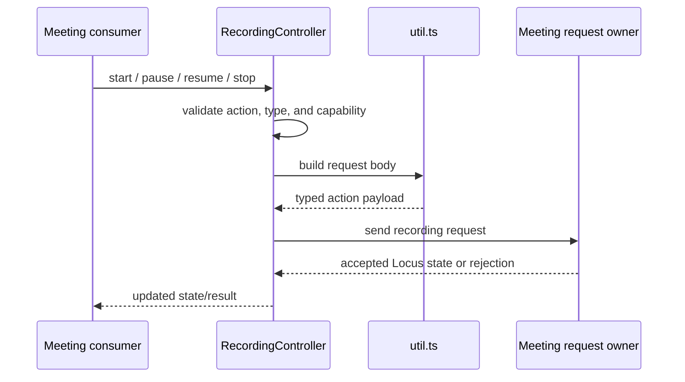
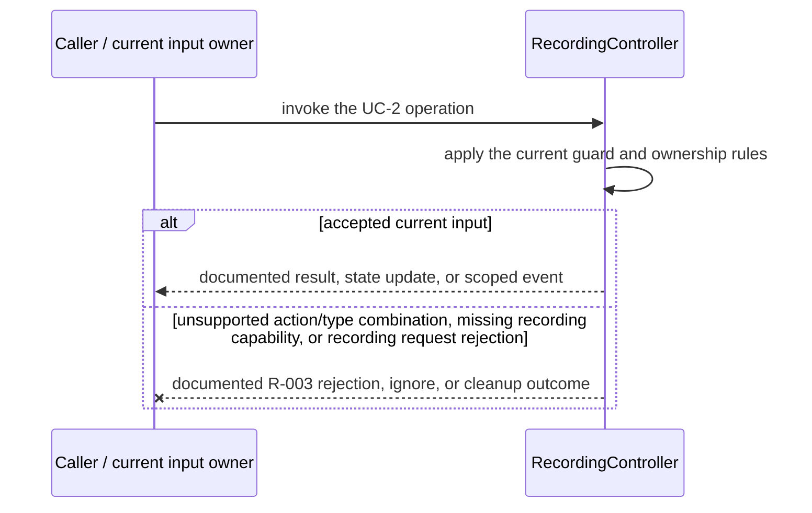
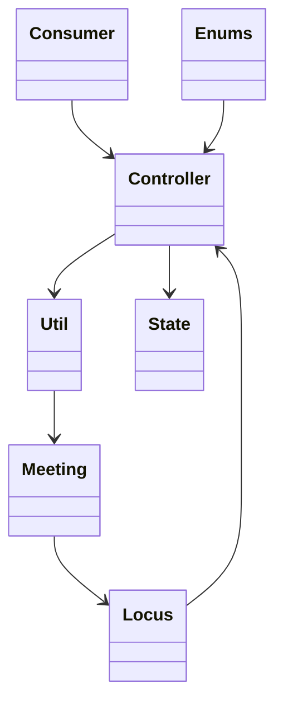

<!-- sdd-generated-metadata
doc_kind: module-spec
generated_from: module-spec@0.2.2
generator_plugin: repo-annotation@1.0.5+codex.20260818094939
generated_by: codex
approved_by: repository user
updated_at: 2026-08-21T06:10:05Z
validation_status: not-run
-->
# RECORDING CONTROLLER — SPEC

> Start here → root [`AGENTS.md`](../../../AGENTS.md) · router [`SPEC_INDEX.md`](../../../ai-docs/SPEC_INDEX.md) · system [`ARCHITECTURE.md`](../../../ai-docs/ARCHITECTURE.md). This is the canonical source-local spec for `src/recording-controller/`.

## Metadata

| Field | Value |
|---|---|
| Module id | `recording-controller` |
| Source path(s) | `src/recording-controller/` |
| Parent spec | — |
| Doc kind | Module spec |
| Coverage score | 93% assessed 2026-08-21; 13/14 mandatory fields present; all critical and Important fields present; one noncritical polish gap remains |
| Generated from | `module-spec` @ SDLC template library `0.2.2` |
| generated_by / approved_by / updated_at | codex / repository user / 2026-08-21T06:10:05Z |
| Validation status | not-run |

## Evidence Rules

Requirements cite current source and mirrored tests. Current code wins over retained prose when they conflict; commit and PR history are excluded. Missing evidence stays a gap.

## Source Material Register

| Source material | Scope | Decision | Detail location or disposition |
|---|---|---|---|
| No routed legacy module spec | overview / API / behavior / tests | none; generated from current recording controller/util/enums and tests |
| Current source and mirrored tests | implementation / tests | verified | requirements, flows, failures, and test strategy below |

## Overview

`src/recording-controller/` contains 3 direct source/reference file(s) and has 2 mirrored unit-test file(s). This spec separates its public operations, runtime data movement, component ownership, state applicability, and verification boundary.

## Purpose / Responsibility

Converts consumer recording actions into validated meeting requests and applies the returned recording state.

## Stack

TypeScript/JavaScript in the Node 22.14 Yarn workspace; Webex core/plugin abstractions and Mocha/Sinon/`@webex/test-helper-chai` tests.

## Folder / Package Structure

```text
src/recording-controller/
├── enums.ts — declared action/control enum values
├── index.ts — module facade/controller or primary exports
├── util.ts — normalization/helper functions
└── ai-docs/recording-controller-spec.md — canonical module specification
```

## Key Files (source of truth)

| File | Holds |
|---|---|
| `src/recording-controller/enums.ts` | declared action/control enum values |
| `src/recording-controller/index.ts` | module facade/controller or primary exports |
| `src/recording-controller/util.ts` | normalization/helper functions |
| `test/unit/spec/recording-controller/index.js` and 1 sibling test file(s) | mirrored characterization/unit coverage |

## Public Surface

| Contract ID | Type | Surface | Purpose | Compatibility / deprecation | Schema / detail link | Root index |
|---|---|---|---|---|---|---|
| `recording-controller.1` | SDK / in-process / remote | start, pause, resume, or stop recording | Focused operation group owned by this module | Preserve methods/events/wire values reachable from package objects | `src/recording-controller/index.ts` | [CONTRACTS](../../../ai-docs/CONTRACTS.md) |
| `recording-controller.2` | SDK / in-process / remote | select recording type/action payload | Focused operation group owned by this module | Preserve methods/events/wire values reachable from package objects | `src/recording-controller/index.ts` | [CONTRACTS](../../../ai-docs/CONTRACTS.md) |
| `recording-controller.3` | SDK / in-process / remote | propagate request outcome and refreshed Locus state | Focused operation group owned by this module | Preserve methods/events/wire values reachable from package objects | `src/recording-controller/index.ts` | [CONTRACTS](../../../ai-docs/CONTRACTS.md) |

Compatibility notes:
- Prefer additive fields/options and preserve current return and rejection semantics. Internal helpers are not public merely because they are exported within the source directory.

## Requires (dependencies)

Meeting request access, Locus URL/state, recording action/type enums, capability state, and utility validation.

## Requirements

| ID | WHAT | WHY | Source Evidence | Test / Example Evidence | Assumptions / Gaps | Confidence |
|---|---|---|---|---|---|---|
| `RECORDING-CONTROLLER-R-001` | start, pause, resume, or stop recording. | Converts consumer recording actions into validated meeting requests and applies the returned recording state. | `src/recording-controller/index.ts` | `test/unit/spec/recording-controller/index.js` | none | PRESENT |
| `RECORDING-CONTROLLER-R-002` | select recording type/action payload. | Consumers need deterministic behavior across meeting and remote updates. | `src/recording-controller/index.ts`, `src/recording-controller/util.ts` | `test/unit/spec/recording-controller/index.js` | inspect sibling tests for operation-specific cases | PRESENT |
| `RECORDING-CONTROLLER-R-003` | Invalid action/type/capability inputs or request failures reject the returned promise; this controller allocates no independent listener, lock, or timer. | Callers must receive the actual module failure outcome without false cleanup or event guarantees. | `src/recording-controller/` | `test/unit/spec/recording-controller/index.js` | none | PRESENT |

## Design Overview

`RecordingController` validates an action/type against `enums.ts`, uses `util.ts` to build the recording payload, delegates the HTTP operation to its Meeting request owner, and applies only the returned/Locus recording state. It owns no listeners or timers.

## Data Flow



## Sequence Diagram(s)

Sequence coverage:

| Operation group | Diagram | Failure coverage |
|---|---|---|
| UC-1 — primary operation | Primary operation sequence | accepted and rejected dependency outcomes |
| UC-2 — secondary/change operation | Secondary operation and failure sequence | unsupported action/type combination, missing recording capability, or recording request rejection |

### Primary operation sequence



### Secondary operation and failure sequence



## Class / Component Relationships



The arrows identify ownership and delegation inside `src/recording-controller/`; files that only declare types or constants are not presented as transports.

## Use Cases

- **UC-1:** Map start, pause, resume, and stop to the declared recording action/type payload. Evidence: `src/recording-controller/`.
- **UC-2:** Propagate the owning Meeting request result and update state only from accepted server/Locus data. Evidence: `src/recording-controller/`.

## State Model

The controller references its meeting and derives current recording/capability state; remote recording service/Locus remains authoritative.

## Business Rules & Invariants

- Only supported action/type combinations are sent; recording state changes only from accepted response/Locus data; privileged capability remains enforced. Enforced under `src/recording-controller/`.

## Concurrency & Reactive Flow

- Async work owned by `RecordingController` may complete after a newer caller or remote input. Preserve the identity, sequence, and resource-owner guards in `src/recording-controller/`; a late completion must not replay UC-2 for superseded state.

## Error Handling & Failure Modes

| Condition | Signal | Caller recovery |
|---|---|---|
| unsupported action/type combination, missing recording capability, or recording request rejection | Follow the concrete rejection, ignore, state, or cleanup behavior in the module's R-003 requirement. | Resolve the named condition; retry only when another requirement defines a bound. |
| UC-1 succeeds | Return, update, callback, or scoped event identified by the Public Surface and primary sequence. | Continue from the owning module's accepted state. |

## Pitfalls

- Action names and recording types are separate enums. Conflating them produces a syntactically valid request with the wrong server meaning.
- Verify both typed constants/enums and raw wire values before changing a logical condition in this legacy package.

## Test-Case Strategy (module)

Use the current mirrored suites: `test/unit/spec/recording-controller/index.js`, `test/unit/spec/recording-controller/util.js`. Characterize the two code-grounded use cases above and the listed failure condition; add cleanup or transition cases only for resources and state this module actually owns.

| Behavior / Requirement | Existing test evidence | Gap |
|---|---|---|
| `RECORDING-CONTROLLER-R-001` | `test/unit/spec/recording-controller/index.js` | inspect sibling tests for full operation matrix |
| `RECORDING-CONTROLLER-R-002` | `test/unit/spec/recording-controller/index.js` | verify the operation-specific invalid-input and rejection branches |
| `RECORDING-CONTROLLER-R-003` | `test/unit/spec/recording-controller/index.js` | verify the concrete R-003 rejection, ignore, or cleanup outcome |

## Traceability

- Repo architecture: [`ARCHITECTURE.md`](../../../ai-docs/ARCHITECTURE.md) · Registry: [`SPEC_INDEX.md`](../../../ai-docs/SPEC_INDEX.md)
- Coverage state and contracts baseline: `../../../.sdd/manifest.json`
