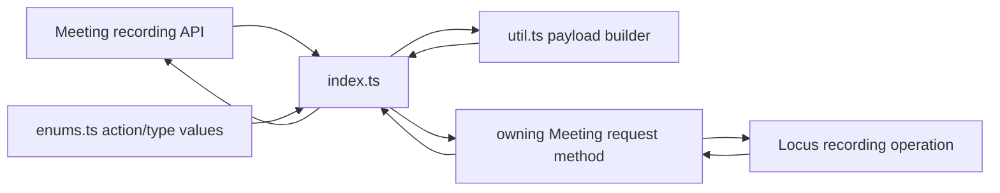
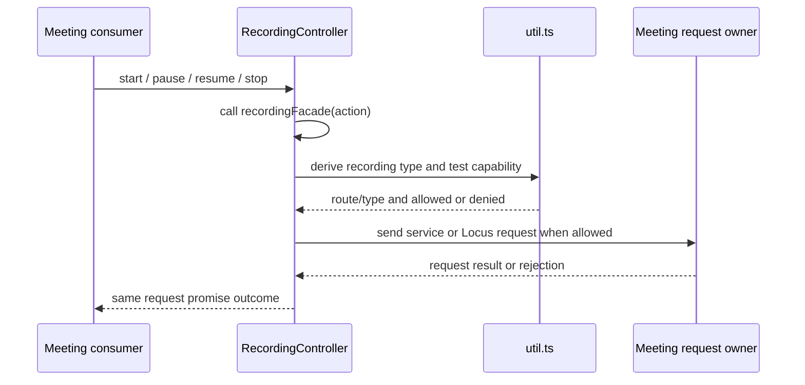
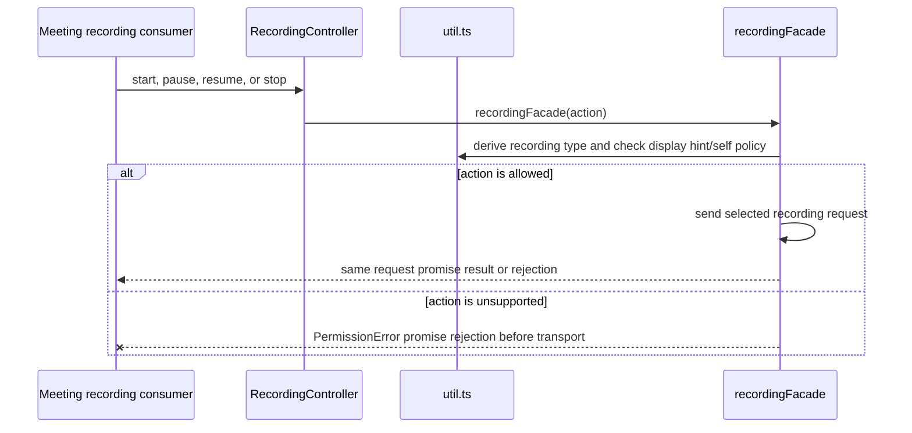
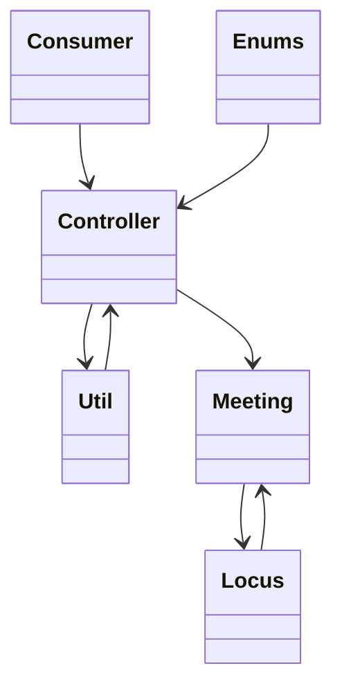

<!-- sdd-generated-metadata
doc_kind: module-spec
generated_from: module-spec@0.2.2
generator_plugin: repo-annotation@1.0.5+codex.20260818094939
generated_by: codex
approved_by: repository user
updated_at: 2026-08-22T15:21:29Z
validation_status: pass-with-warnings
-->
# RECORDING CONTROLLER — SPEC

> Start here → root [`AGENTS.md`](../../../AGENTS.md) · router [`SPEC_INDEX.md`](../../../ai-docs/SPEC_INDEX.md) · system [`ARCHITECTURE.md`](../../../ai-docs/ARCHITECTURE.md). This is the canonical source-local spec for `src/recording-controller/`.

## Metadata

| Field | Value |
|---|---|
| Module id | `recording-controller` |
| Source path(s) | `src/recording-controller/` |
| Parent spec | — |
| Doc kind | Module spec |
| Coverage score | 93% assessed 2026-08-22; 13/14 mandatory fields present; all critical and Important fields present; one noncritical polish gap remains; pending independent validation of the participant-role repair |
| Generated from | `module-spec` @ SDLC template library `0.2.2` |
| generated_by / approved_by / updated_at | codex / repository user / 2026-08-22T15:21:29Z |
| Validation status | not-run |

## Evidence Rules

Requirements cite current source and mirrored tests. Current code wins over retained prose when they conflict; commit and PR history are excluded. Missing evidence stays a gap.

## Source Material Register

| Source material | Scope | Decision | Detail location or disposition |
|---|---|---|---|
| No routed legacy module spec | overview / API / behavior / tests | none; generated from current recording controller/util/enums and tests |
| Current source and mirrored tests | implementation / tests | verified | requirements, flows, failures, and test strategy below |

## Overview

`src/recording-controller/` contains 3 direct source/reference file(s) and has 2 mirrored unit-test file(s). This spec separates its public operations, runtime data movement, component ownership, state applicability, and verification boundary.

## Purpose / Responsibility

Validates consumer recording actions against display hints/policy, selects cloud or premise recording, and returns the owning request method's promise.

## Stack

TypeScript/JavaScript in the Node 22.14 Yarn workspace; Webex core/plugin abstractions and Mocha/Sinon/`@webex/test-helper-chai` tests.

## Folder / Package Structure

```text
src/recording-controller/
├── enums.ts — declared action/control enum values
├── index.ts — module facade/controller or primary exports
├── util.ts — normalization/helper functions
└── ai-docs/recording-controller-spec.md — canonical module specification
```

## Key Files (source of truth)

| File | Holds |
|---|---|
| `src/recording-controller/enums.ts` | declared action/control enum values |
| `src/recording-controller/index.ts` | module facade/controller or primary exports |
| `src/recording-controller/util.ts` | normalization/helper functions |
| `test/unit/spec/recording-controller/index.js` and 1 sibling test file(s) | mirrored characterization/unit coverage |

## Public Surface

| Contract ID | Type | Surface | Purpose | Compatibility / deprecation | Schema / detail link | Root index |
|---|---|---|---|---|---|---|
| `recording-controller.1` | SDK / configuration | `RecordingController.set()`, `setLocusUrl()`, `setDisplayHints()`, `setUserPolicy()`, `setSessionId()`, `setServiceUrl()`, `getLocusUrl()`, `getLocusId()`, `getSessionId()`, `getServiceUrl()`, and `getDisplayHints()` | Refresh/read the request context and capability inputs used by later recording actions. | Preserve derived Locus id and getter/setter behavior; no recording status is stored. | `src/recording-controller/index.ts` | [CONTRACTS](../../../ai-docs/CONTRACTS.md) |
| `recording-controller.2` | SDK / remote | `startRecording()` | Validate the current start capability and send a `START` action with the selected `RecordingType`. | Preserve action/type values and selected service-vs-Locus route. | `src/recording-controller/index.ts` | [CONTRACTS](../../../ai-docs/CONTRACTS.md) |
| `recording-controller.3` | SDK / remote | `pauseRecording()` and `resumeRecording()` | Map pause/resume intent to the permitted recording action under current display hints/policy. | Rejections remain the selected facade promise; the controller applies no response state. | `src/recording-controller/index.ts` | [CONTRACTS](../../../ai-docs/CONTRACTS.md) |
| `recording-controller.4` | SDK / remote | `stopRecording()` | Send the permitted `STOP` action through the current recording route. | Preserve caller-visible rejection and remote-authority ownership of final status. | `src/recording-controller/index.ts` | [CONTRACTS](../../../ai-docs/CONTRACTS.md) |
| `recording-controller.5` | exported enums | `RecordingAction` and `RecordingType` | Define the exact action/type vocabulary serialized by controller operations. | Existing raw enum values are request contracts; additions must be compatible. | `src/recording-controller/enums.ts` | [CONTRACTS](../../../ai-docs/CONTRACTS.md) |

Compatibility notes:
- Prefer additive fields/options and preserve current return and rejection semantics. Internal helpers are not public merely because they are exported within the source directory.

## Requires (dependencies)

Meeting request access, Locus URL/state, recording action/type enums, capability state, and utility validation.

## Requirements

| ID | WHAT | WHY | Source Evidence | Test / Example Evidence | Assumptions / Gaps | Confidence |
|---|---|---|---|---|---|---|
| `RECORDING-CONTROLLER-R-001` | `startRecording`, `pauseRecording`, `resumeRecording`, and `stopRecording` call `recordingFacade()` immediately. The facade derives the recording type, checks the corresponding display hint/self policy, rejects a denied action before transport, and otherwise returns the selected request promise. | The permission decision belongs inside the facade, while accepted actions must preserve the actual request result without inventing local state application. | `src/recording-controller/index.ts` | `test/unit/spec/recording-controller/index.js` | none | PRESENT |
| `RECORDING-CONTROLLER-R-002` | select recording type/action payload. | Recording action/type pairs choose the remote transition and cannot be generalized without changing service behavior. | `src/recording-controller/index.ts`, `src/recording-controller/util.ts` | `test/unit/spec/recording-controller/index.js` | service and Locus paths need the same action/type rejection matrix | PRESENT |
| `RECORDING-CONTROLLER-R-003` | Invalid action/type/capability inputs or request failures reject the returned promise; this controller allocates no independent listener, lock, or timer. | Remote recording state remains authoritative, so rejection cannot be masked by a fabricated local transition. | `src/recording-controller/` | `test/unit/spec/recording-controller/index.js` | none | PRESENT |

## Design Overview

`RecordingController` stores request context, validates actions through `util.ts`, selects cloud or premise recording, and delegates either to `request.request` for the recording service or `request.locusDeltaRequest` for legacy Locus controls. It returns that promise and does not inspect the response or apply recording state. It owns no listeners or timers.

## Data Flow



## Sequence Diagram(s)

Sequence coverage:

| Operation group | Diagram | Failure coverage |
|---|---|---|
| UC-1…UC-3 — recording control operation groups | Recording control primary sequence | denied action/type, service-vs-Locus request rejection, and no local state application |
| UC-1…UC-3 — recording control alternate/failure paths | Recording control alternate/failure sequence | unsupported action/type combination, missing recording capability, or recording request rejection |

### Recording control primary sequence



### Recording control alternate/failure sequence



## Class / Component Relationships



The arrows identify ownership and delegation inside `src/recording-controller/`; files that only declare types or constants are not presented as transports.

## Use Cases

- **UC-1:** Refresh Locus/service/session/display-hint/policy context without creating a local recording-status projection. Evidence: `src/recording-controller/index.ts`.
- **UC-2:** Map start, pause, resume, and stop to the exact `RecordingAction`/`RecordingType` payload allowed by current hints and policy. Evidence: `src/recording-controller/index.ts`.
- **UC-3:** Route through the recording service when `serviceUrl` is present; otherwise send the derived `record` body through `locusDeltaRequest`, returning the selected dependency promise unchanged. Evidence: `src/recording-controller/index.ts`.

## State Model

The controller stores `serviceUrl`, `sessionId`, `locusUrl`, derived `locusId`, `displayHints`, and `selfUserPolicies`. It does not store current recording status or apply a response projection; the recording service/Locus remains authoritative.

## Business Rules & Invariants

- Only actions allowed by the current display hints/self policy are sent. Presence of `serviceUrl` selects the recording-service PUT; absence selects the Locus controls PATCH. The controller itself makes no recording-state change. Enforced under `src/recording-controller/`.

## Concurrency & Reactive Flow

- Each accepted action returns an independent request promise. The controller has no queue, cancellation, response ordering, or supersession guard; callers and the remote recording authority determine the outcome of overlapping actions.

## Error Handling & Failure Modes

| Condition | Signal | Caller recovery |
|---|---|---|
| Display hint/self policy does not permit the requested operation | The public method calls `recordingFacade()`; the facade returns a rejected `PermissionError` promise before selecting either transport request. | Refresh recording controls and issue only a currently allowed action. |
| `recordingFacade` request rejects | The controller returns that rejected promise; it does not apply a fabricated local recording state. | Handle the request failure and wait for authoritative recording state. |
| Recording action is accepted | The caller receives the facade request result for the selected typed payload. | Continue from service/Locus-projected recording state. |

## Pitfalls

- Action names and recording types are separate enums. Conflating them produces a syntactically valid request with the wrong server meaning.
- Verify both typed constants/enums and raw wire values before changing a logical condition in this legacy package.

## Test-Case Strategy (module)

Use the current mirrored suites: `test/unit/spec/recording-controller/index.js`, `test/unit/spec/recording-controller/util.js`. Characterize the recording-controller-specific use cases above and each listed failure condition; add cleanup or transition cases only for resources and state this module actually owns.

| Behavior / Requirement | Existing test evidence | Gap |
|---|---|---|
| `RECORDING-CONTROLLER-R-001` | `test/unit/spec/recording-controller/index.js` | cover configuration plus each recording action on service and Locus routes |
| `RECORDING-CONTROLLER-R-002` | `test/unit/spec/recording-controller/index.js` | cover every action/type payload against both service and Locus routing contexts |
| `RECORDING-CONTROLLER-R-003` | `test/unit/spec/recording-controller/index.js` | assert facade rejection is returned unchanged and no local recording status is applied |

## Traceability

- Repo architecture: [`ARCHITECTURE.md`](../../../ai-docs/ARCHITECTURE.md) · Registry: [`SPEC_INDEX.md`](../../../ai-docs/SPEC_INDEX.md)
- Coverage state and contracts baseline: `../../../.sdd/manifest.json`
