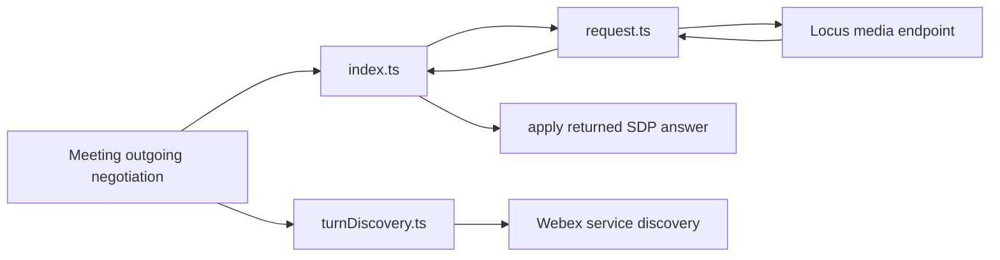
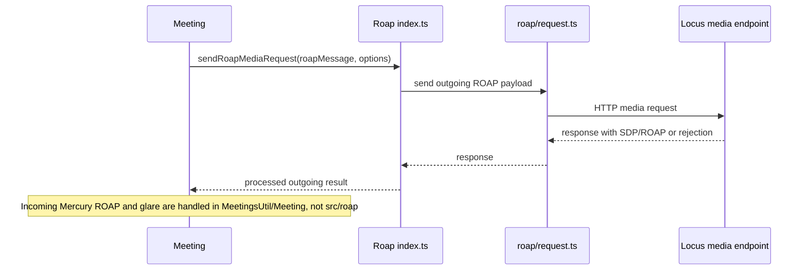
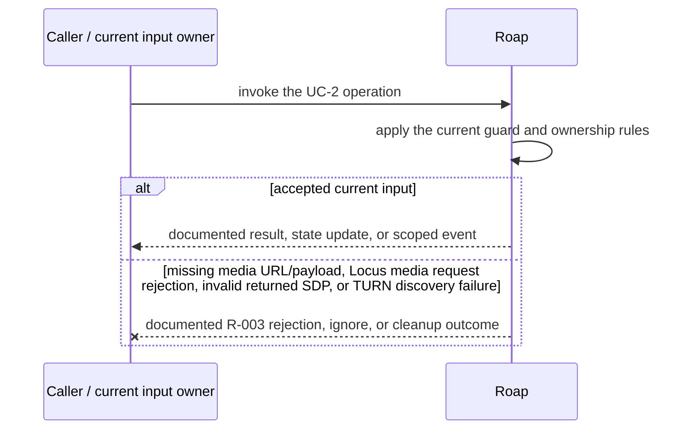
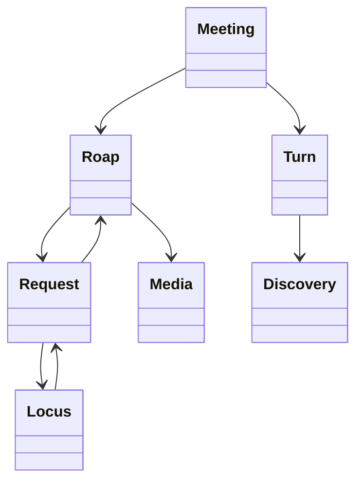

<!-- sdd-generated-metadata
doc_kind: module-spec
generated_from: module-spec@0.2.2
generator_plugin: repo-annotation@1.0.5+codex.20260818094939
generated_by: codex
approved_by: repository user
updated_at: 2026-08-21T06:10:05Z
validation_status: not-run
-->
# ROAP — SPEC

> Start here → root [`AGENTS.md`](../../../AGENTS.md) · router [`SPEC_INDEX.md`](../../../ai-docs/SPEC_INDEX.md) · system [`ARCHITECTURE.md`](../../../ai-docs/ARCHITECTURE.md). This is the canonical source-local spec for `src/roap/`.

## Metadata

| Field | Value |
|---|---|
| Module id | `roap` |
| Source path(s) | `src/roap/` |
| Parent spec | — |
| Doc kind | Module spec |
| Coverage score | 93% assessed 2026-08-21; 13/14 mandatory fields present; all critical and Important fields present; one noncritical polish gap remains |
| Generated from | `module-spec` @ SDLC template library `0.2.2` |
| generated_by / approved_by / updated_at | codex / repository user / 2026-08-21T06:10:05Z |
| Validation status | not-run |

## Evidence Rules

Requirements cite current implementation and mirrored unit-test paths. Current code wins over retained prose when they conflict; commit and PR history are excluded by repository-owner decision. Missing test evidence is stated as a gap rather than inferred.

## Source Material Register

| Source material | Scope | Decision | Detail location or disposition |
|---|---|---|---|
| No routed legacy module spec | overview / API / behavior / tests | none; generated from current ROAP/request/TURN code and tests |
| Current source and mirrored tests | implementation / tests | verified | requirements, flows, failures, and test strategy below |

## Overview

`src/roap/` contains 4 direct source/reference file(s) and has 3 mirrored unit-test file(s). This spec separates its public operations, runtime data movement, component ownership, state applicability, and verification boundary.

## Purpose / Responsibility

Sends outgoing ROAP media requests, processes their SDP responses, and performs TURN discovery for meeting media. Incoming Mercury ROAP routing and glare handling are owned by `MeetingsUtil` and `Meeting`.

## Stack

TypeScript/JavaScript in the Node 22.14 Yarn workspace; Webex core/plugin abstractions and Mocha/Sinon/`@webex/test-helper-chai` tests. Build target: `yarn workspace @webex/plugin-meetings build:src`.

## Folder / Package Structure

```text
src/roap/
├── index.ts — module facade/controller or primary exports
├── request.ts — HTTP request boundary
├── turnDiscovery.ts — turnDiscovery implementation responsibility
├── types.ts — module type declarations
└── ai-docs/roap-spec.md — canonical module specification
```

## Key Files (source of truth)

| File | Holds |
|---|---|
| `src/roap/index.ts` | module facade/controller or primary exports |
| `src/roap/request.ts` | HTTP request boundary |
| `src/roap/turnDiscovery.ts` | turnDiscovery implementation responsibility |
| `src/roap/types.ts` | module type declarations |
| `test/unit/spec/roap/index.ts` and 2 sibling test file(s) | mirrored characterization/unit coverage |

## Public Surface

| Contract ID | Type | Surface | Purpose | Compatibility / deprecation | Schema / detail link | Root index |
|---|---|---|---|---|---|---|
| `roap.1` | SDK / in-process / remote | send outgoing ROAP messages and process their response | Preserve the module responsibility without assigning inbound handling to this directory | Consumer-visible methods/events are semver-sensitive when reachable from package objects | `src/roap/index.ts` | [CONTRACTS](../../../ai-docs/CONTRACTS.md) |
| `roap.2` | SDK / in-process / remote | send Locus media requests and apply SDP answers | Preserve the module responsibility through a focused operation group | Consumer-visible methods/events are semver-sensitive when reachable from package objects | `src/roap/index.ts` | [CONTRACTS](../../../ai-docs/CONTRACTS.md) |
| `roap.3` | SDK / in-process / remote | discover and normalize TURN service information | Preserve the module responsibility through a focused operation group | Consumer-visible methods/events are semver-sensitive when reachable from package objects | `src/roap/index.ts` | [CONTRACTS](../../../ai-docs/CONTRACTS.md) |

Compatibility notes:
- Prefer additive options and payload fields. Preserve method/event names, rejection semantics, and cleanup timing; route public changes through `src/index.ts` or the documented owning object.

## Requires (dependencies)

Meeting/Locus media request transport, SDP utilities, media connection, Webex TURN discovery, and sequence state.

## Requirements

| ID | WHAT | WHY | Source Evidence | Test / Example Evidence | Assumptions / Gaps | Confidence |
|---|---|---|---|---|---|---|
| `ROAP-R-001` | Send outgoing ROAP media messages and process the returned response; inbound Mercury routing is outside `src/roap/`. | Ownership must match current call paths so changes to incoming sequence/glare logic are made in `MeetingsUtil` and `Meeting`, not in this sender. | `src/roap/index.ts`, `src/meetings/util.ts`, `src/meeting/index.ts` | `test/unit/spec/roap/index.ts`, `test/unit/spec/meeting/index.js` | none | PRESENT |
| `ROAP-R-002` | send Locus media requests and apply SDP answers. | Callers need deterministic observable behavior across async Webex inputs. | `src/roap/index.ts`, `src/roap/request.ts` | `test/unit/spec/roap/index.ts` | additional edge cases may live in sibling tests | PRESENT |
| `ROAP-R-003` | Outgoing media-request and TURN-discovery failures reject their callers; this sender owns no inbound event listener or lifecycle state to clean up. | Callers must receive the actual module failure outcome without false cleanup or event guarantees. | `src/roap/` | `test/unit/spec/roap/index.ts` | none | PRESENT |
| `ROAP-R-004` | Incoming ROAP sequence and glare handling are delegated by `MeetingsUtil.handleRoapMercury()` to `Meeting.roapMessageReceived()`; `src/roap/types.ts` only declares TURN-discovery shapes. | Explicit cross-module ownership prevents passive TURN types from being mistaken for inbound negotiation guards. | `src/meetings/util.ts`, `src/meeting/index.ts`, `src/roap/types.ts` | `test/unit/spec/meeting/index.js` | none | PRESENT |
| `ROAP-R-005` | TURN discovery normalizes service results for the active media negotiation and propagates discovery failure. | Media setup needs the correct relay configuration and must not silently use fabricated credentials. | `src/roap/turnDiscovery.ts`, `src/roap/request.ts` | `test/unit/spec/roap/turnDiscovery.ts`, `test/unit/spec/roap/request.ts` | none | PRESENT |

## Design Overview

`src/roap/index.ts` is the outgoing ROAP sender: it builds/sends Locus media requests through `request.ts` and handles the returned SDP answer. `turnDiscovery.ts` separately resolves TURN data. Incoming Mercury routing and glare handling belong to `MeetingsUtil` and `Meeting`, outside this module.

## Data Flow



## Sequence Diagram(s)

Sequence coverage:

| Operation group | Diagram | Failure coverage |
|---|---|---|
| UC-1 — primary operation | Primary operation sequence | accepted and rejected dependency outcomes |
| UC-2 — secondary/change operation | Secondary operation and failure sequence | missing media URL/payload, Locus media request rejection, invalid returned SDP, or TURN discovery failure |

### Primary operation sequence



### Secondary operation and failure sequence



## Class / Component Relationships



The arrows identify ownership and delegation inside `src/roap/`; files that only declare types or constants are not presented as transports.

## Use Cases

- **UC-1:** Send an outgoing offer/answer payload to the current Locus media endpoint and return/apply the response. Evidence: `src/roap/`.
- **UC-2:** Discover TURN service information independently through `turnDiscovery.ts`; do not attribute inbound Mercury/glare ownership to this module. Evidence: `src/roap/`.

## State Model

ROAP sequence, pending offer/answer, negotiation state, and TURN discovery results are held per media negotiation.

## Business Rules & Invariants

- `src/roap/` owns outgoing request/response and TURN discovery only. Incoming Mercury sequencing/glare remains in `src/meetings/util.ts` and `src/meeting/index.ts`; request and discovery failures reject their callers.

## Concurrency & Reactive Flow

- Async work owned by `Roap` may complete after a newer caller or remote input. Preserve the identity, sequence, and resource-owner guards in `src/roap/`; a late completion must not replay UC-2 for superseded state.

## Protocol / Wire Format

- External payloads are parsed/serialized by files under `src/roap/` and existing Webex/media dependencies. Preserve current field names, enum/raw values, sequence identifiers, and compatibility behavior; do not treat the normalized client model as the wire schema.

## Error Handling & Failure Modes

| Condition | Signal | Caller recovery |
|---|---|---|
| missing media URL/payload, Locus media request rejection, invalid returned SDP, or TURN discovery failure | Follow the concrete rejection, ignore, state, or cleanup behavior in the module's R-003 requirement. | Resolve the named condition; retry only when another requirement defines a bound. |
| UC-1 succeeds | Return, update, callback, or scoped event identified by the Public Surface and primary sequence. | Continue from the owning module's accepted state. |

## Pitfalls

- Offer/answer messages are ordered protocol state. Retrying or applying a stale sequence can corrupt the peer connection.
- Public behavior may be reachable through a parent `Meeting`/`Meetings` object even when the source helper is not exported directly.

## Key Design Trade-off

- Explicit ROAP state preserves interoperability and recoverable errors but makes media setup sequential and stateful.

## Test-Case Strategy (module)

Use the current mirrored suites: `test/unit/spec/roap/index.ts`, `test/unit/spec/roap/request.ts`, `test/unit/spec/roap/turnDiscovery.ts`. Characterize the two code-grounded use cases above and the listed failure condition; add cleanup or transition cases only for resources and state this module actually owns.

| Behavior / Requirement | Existing test evidence | Gap |
|---|---|---|
| `ROAP-R-001` | `test/unit/spec/roap/index.ts` | confirm the named operation against its owning sibling suite |
| `ROAP-R-002` | `test/unit/spec/roap/index.ts` | verify the code-grounded rejection or stale-input branch |
| `ROAP-R-003` | `test/unit/spec/roap/index.ts` | verify the concrete R-003 rejection, ignore, or cleanup outcome |
| `ROAP-R-004` | `test/unit/spec/meeting/index.js` | keep inbound sequence/glare coverage with the owning Meeting module |
| `ROAP-R-005` | `test/unit/spec/roap/turnDiscovery.ts`, `test/unit/spec/roap/request.ts` | none |

## Traceability

- Repo architecture: [`ARCHITECTURE.md`](../../../ai-docs/ARCHITECTURE.md) · Registry: [`SPEC_INDEX.md`](../../../ai-docs/SPEC_INDEX.md)
- Coverage state and contracts baseline: `../../../.sdd/manifest.json`
