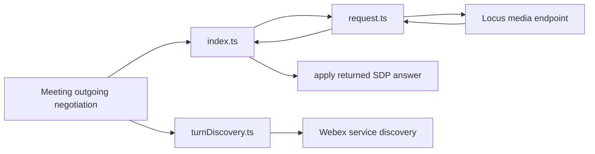
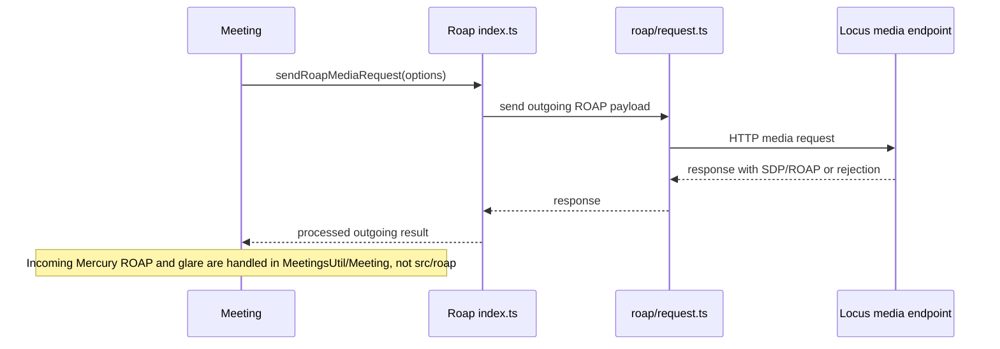
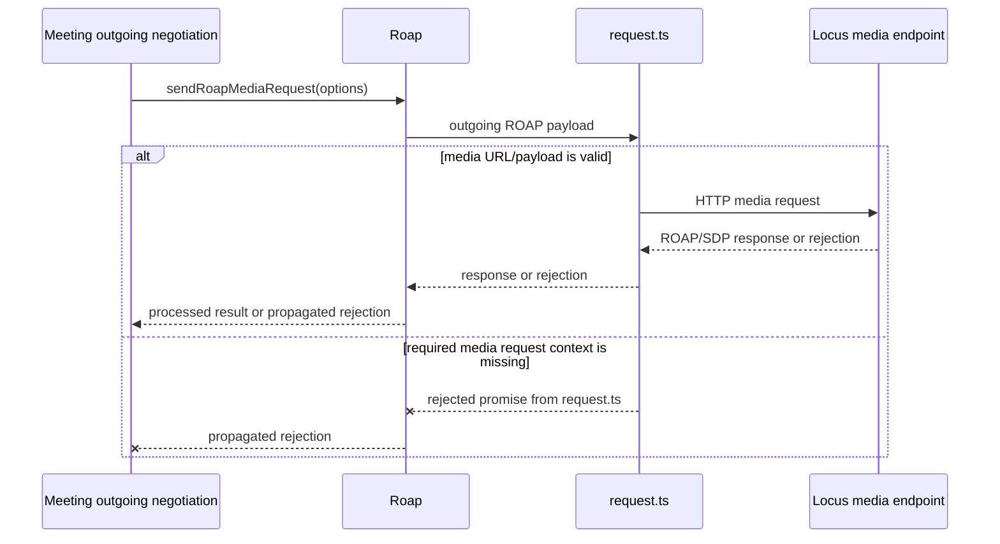
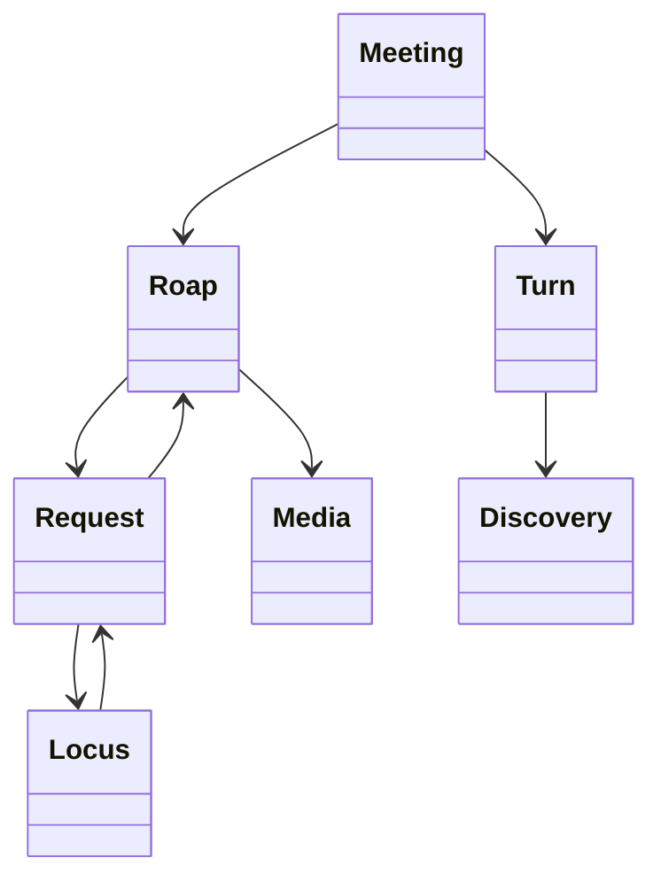

<!-- sdd-generated-metadata
doc_kind: module-spec
generated_from: module-spec@0.2.2
generator_plugin: repo-annotation@1.0.5+codex.20260818094939
generated_by: codex
approved_by: repository user
updated_at: 2026-08-22T15:21:29Z
validation_status: pass-with-warnings
-->
# ROAP — SPEC

> Start here → root [`AGENTS.md`](../../../AGENTS.md) · router [`SPEC_INDEX.md`](../../../ai-docs/SPEC_INDEX.md) · system [`ARCHITECTURE.md`](../../../ai-docs/ARCHITECTURE.md). This is the canonical source-local spec for `src/roap/`.

## Metadata

| Field | Value |
|---|---|
| Module id | `roap` |
| Source path(s) | `src/roap/` |
| Parent spec | — |
| Doc kind | Module spec |
| Coverage score | 93% assessed 2026-08-22; 13/14 mandatory fields present; all critical and Important fields present; one noncritical polish gap remains; pending independent validation of the participant-role repair |
| Generated from | `module-spec` @ SDLC template library `0.2.2` |
| generated_by / approved_by / updated_at | codex / repository user / 2026-08-22T15:21:29Z |
| Validation status | not-run |

## Evidence Rules

Requirements cite current implementation and mirrored unit-test paths. Current code wins over retained prose when they conflict; commit and PR history are excluded by repository-owner decision. Missing test evidence is stated as a gap rather than inferred.

## Source Material Register

| Source material | Scope | Decision | Detail location or disposition |
|---|---|---|---|
| No routed legacy module spec | overview / API / behavior / tests | none; generated from current ROAP/request/TURN code and tests |
| Current source and mirrored tests | implementation / tests | verified | requirements, flows, failures, and test strategy below |

## Overview

`src/roap/` contains 4 direct source/reference file(s) and has 3 mirrored unit-test file(s). This spec separates its public operations, runtime data movement, component ownership, state applicability, and verification boundary.

## Purpose / Responsibility

Sends outgoing ROAP media requests, processes their SDP responses, and performs TURN discovery for meeting media. Incoming Mercury ROAP routing and glare handling are owned by `MeetingsUtil` and `Meeting`.

## Stack

TypeScript/JavaScript in the Node 22.14 Yarn workspace; Webex core/plugin abstractions and Mocha/Sinon/`@webex/test-helper-chai` tests. Build target: `yarn workspace @webex/plugin-meetings build:src`.

## Folder / Package Structure

```text
src/roap/
├── index.ts — module facade/controller or primary exports
├── request.ts — HTTP request boundary
├── turnDiscovery.ts — turnDiscovery implementation responsibility
├── types.ts — module type declarations
└── ai-docs/roap-spec.md — canonical module specification
```

## Key Files (source of truth)

| File | Holds |
|---|---|
| `src/roap/index.ts` | module facade/controller or primary exports |
| `src/roap/request.ts` | HTTP request boundary |
| `src/roap/turnDiscovery.ts` | turnDiscovery implementation responsibility |
| `src/roap/types.ts` | module type declarations |
| `test/unit/spec/roap/index.ts` and 2 sibling test file(s) | mirrored characterization/unit coverage |

## Public Surface

| Contract ID | Type | Surface | Purpose | Compatibility / deprecation | Schema / detail link | Root index |
|---|---|---|---|---|---|---|
| `roap.1` | SDK / remote | `Roap.sendRoapOK()`, `sendRoapAnswer()`, `sendRoapError()`, and `sendRoapMediaRequest()` | Build and send outgoing ROAP control/media messages through the current Locus media route. | Preserve message/action fields and returned promise behavior; inbound Mercury ordering is owned elsewhere. | `src/roap/index.ts` | [CONTRACTS](../../../ai-docs/CONTRACTS.md) |
| `roap.2` | request adapter | `RoapRequest.sendRoap()` | Issue the outgoing Locus media request and return its response/rejection to `Roap`. | Preserve request URL/body and direct promise propagation. | `src/roap/request.ts` | [CONTRACTS](../../../ai-docs/CONTRACTS.md) |
| `roap.3` | TURN discovery | `Roap.doTurnDiscovery()`, `generateTurnDiscoveryRequestMessage()`, `handleTurnDiscoveryHttpResponse()`, and `abortTurnDiscovery()` | Delegate TURN discovery lifecycle through the active `TurnDiscovery` instance. | Preserve skip-vs-rethrow distinctions and abort ownership. | `src/roap/index.ts`, `src/roap/turnDiscovery.ts` | [CONTRACTS](../../../ai-docs/CONTRACTS.md) |
| `roap.4` | TURN discovery component | `TurnDiscovery.handleTurnDiscoveryResponse()`, `generateTurnDiscoveryRequestMessage()`, `handleTurnDiscoveryHttpResponse()`, `abort()`, `sendRoapOK()`, `isSkipped()`, and `doTurnDiscovery()` | Generate the discovery offer, interpret HTTP results, and expose normalized TURN server information or skip reason. | HTTP 409/403 are rethrown; other handled discovery failures may resolve a skipped result. | `src/roap/turnDiscovery.ts` | [CONTRACTS](../../../ai-docs/CONTRACTS.md) |
| `roap.5` | exported contracts | `TurnDiscoveryResult`, `TurnServerInfo`, and `TurnDiscoverySkipReason` | Share the exact success/skip shape returned to Meeting negotiation. | Add fields and skip reasons compatibly; existing values are consumer-visible. | `src/roap/types.ts`, `src/roap/turnDiscovery.ts` | [CONTRACTS](../../../ai-docs/CONTRACTS.md) |

Compatibility notes:
- Prefer additive options and payload fields. Preserve method/event names, rejection semantics, and cleanup timing; route public changes through `src/index.ts` or the documented owning object.

## Requires (dependencies)

Meeting/Locus media request transport, SDP utilities, media connection, Webex TURN discovery, and sequence state.

## Requirements

| ID | WHAT | WHY | Source Evidence | Test / Example Evidence | Assumptions / Gaps | Confidence |
|---|---|---|---|---|---|---|
| `ROAP-R-001` | Send outgoing ROAP media messages and process the returned response; inbound Mercury routing is outside `src/roap/`. | Ownership must match current call paths so changes to incoming sequence/glare logic are made in `MeetingsUtil` and `Meeting`, not in this sender. | `src/roap/index.ts`, `src/meetings/util.ts`, `src/meeting/index.ts` | `test/unit/spec/roap/index.ts`, `test/unit/spec/meeting/index.js` | none | PRESENT |
| `ROAP-R-002` | send Locus media requests and apply SDP answers. | Locus media requests and TURN discovery have different response and failure semantics during negotiation. | `src/roap/index.ts`, `src/roap/request.ts` | `test/unit/spec/roap/index.ts` | non-409/403 TURN failures need explicit skip-reason coverage | PRESENT |
| `ROAP-R-003` | Outgoing media-request failures reject their caller. TURN discovery rethrows HTTP 409/403, while other handled discovery failures resolve a result with `turnDiscoverySkippedReason`; this sender owns no inbound Mercury listener. | Negotiation code must distinguish direct request rejection from TURN skip results and the specific 409/403 rethrow path. | `src/roap/index.ts`, `src/roap/request.ts`, `src/roap/turnDiscovery.ts` | `test/unit/spec/roap/index.ts`, `test/unit/spec/roap/turnDiscovery.ts` | non-409/403 skip reasons need a complete matrix | PRESENT |
| `ROAP-R-004` | Incoming ROAP sequence and glare handling are delegated by `MeetingsUtil.handleRoapMercury()` to `Meeting.roapMessageReceived()`; `src/roap/types.ts` only declares TURN-discovery shapes. | Explicit cross-module ownership prevents passive TURN types from being mistaken for inbound negotiation guards. | `src/meetings/util.ts`, `src/meeting/index.ts`, `src/roap/types.ts` | `test/unit/spec/meeting/index.js` | none | PRESENT |
| `ROAP-R-005` | TURN discovery normalizes service results for the active media negotiation, rethrows 409/403, and reports other handled failures through the documented skip reason. | Media setup needs the correct relay configuration and an explicit skipped outcome rather than fabricated credentials or a blanket rejection claim. | `src/roap/turnDiscovery.ts`, `src/roap/request.ts` | `test/unit/spec/roap/turnDiscovery.ts`, `test/unit/spec/roap/request.ts` | none | PRESENT |

## Design Overview

`src/roap/index.ts` is the outgoing ROAP sender: it builds/sends Locus media requests through `request.ts` and handles the returned SDP answer. `turnDiscovery.ts` separately resolves TURN data. Incoming Mercury routing and glare handling belong to `MeetingsUtil` and `Meeting`, outside this module.

## Data Flow



## Sequence Diagram(s)

Sequence coverage:

| Operation group | Diagram | Failure coverage |
|---|---|---|
| UC-1…UC-4 — outgoing ROAP and TURN operation groups | Outgoing ROAP and TURN primary sequence | outgoing request rejection, TURN 409/403 rethrow, handled skip result, and abort |
| UC-1…UC-4 — outgoing ROAP and TURN alternate/failure paths | Outgoing ROAP and TURN alternate/failure sequence | missing media URL/payload, Locus media request rejection, invalid returned SDP, or TURN discovery failure |

### Outgoing ROAP and TURN primary sequence



### Outgoing ROAP and TURN alternate/failure sequence



## Class / Component Relationships



The arrows identify ownership and delegation inside `src/roap/`; files that only declare types or constants are not presented as transports.

## Use Cases

- **UC-1:** Send outgoing ROAP OK, answer, error, or media-request payloads through `RoapRequest.sendRoap()` and return the response/rejection. Evidence: `src/roap/index.ts`, `src/roap/request.ts`.
- **UC-2:** Generate a TURN discovery request, interpret its response, and expose normalized TURN server information. Evidence: `src/roap/turnDiscovery.ts`.
- **UC-3:** Abort an active discovery through the owning `Roap`/`TurnDiscovery` lifecycle. Evidence: `src/roap/index.ts`, `src/roap/turnDiscovery.ts`.
- **UC-4:** Distinguish 409/403 rethrows from other handled discovery outcomes that produce a skip reason, without assigning inbound Mercury/glare processing to this module. Evidence: `src/roap/turnDiscovery.ts`, `src/meeting/index.ts`, `src/meetings/util.ts`.

## State Model

ROAP sequence, pending offer/answer, negotiation state, and TURN discovery results are held per media negotiation.

## Business Rules & Invariants

- `src/roap/` owns outgoing request/response and TURN discovery only. Incoming Mercury sequencing/glare remains in `src/meetings/util.ts` and `src/meeting/index.ts`. Direct outgoing ROAP request failures reject; TURN discovery rethrows 409/403, while its other handled failures resolve a result containing `turnDiscoverySkippedReason`.

## Concurrency & Reactive Flow

- Each outgoing ROAP/TURN operation is represented by its returned promise and owns no inbound Mercury listener or persistent negotiation state. Incoming ROAP sequence/glare ordering remains in `MeetingsUtil.handleRoapMercury()` and `Meeting.roapMessageReceived()`.

## Protocol / Wire Format

- External payloads are parsed/serialized by files under `src/roap/` and existing Webex/media dependencies. Preserve current field names, enum/raw values, sequence identifiers, and compatibility behavior; do not treat the normalized client model as the wire schema.

## Error Handling & Failure Modes

| Condition | Signal | Caller recovery |
|---|---|---|
| Required Locus media request context/payload is absent | The request helper rejects rather than issuing an invalid outgoing ROAP request. | Supply the current media URL and ROAP payload. |
| Locus media request rejects, or TURN discovery encounters a handled failure | The media-request promise rejects; TURN 409/403 rethrows, while other handled discovery failures resolve with `turnDiscoverySkippedReason`. `src/roap/` has no inbound Mercury listener to clean up. | Branch on request rejection versus TURN rethrow/skip result in the Meeting negotiation flow. |
| Locus returns an accepted ROAP/SDP response | `Roap` processes and returns the outgoing operation result to Meeting. | Apply it only within the current Meeting negotiation. |

## Pitfalls

- Offer/answer messages are ordered protocol state. Retrying or applying a stale sequence can corrupt the peer connection.
- Public behavior may be reachable through a parent `Meeting`/`Meetings` object even when the source helper is not exported directly.

## Key Design Trade-off

- Explicit ROAP state preserves interoperability and recoverable errors but makes media setup sequential and stateful.

## Test-Case Strategy (module)

Use the current mirrored suites: `test/unit/spec/roap/index.ts`, `test/unit/spec/roap/request.ts`, `test/unit/spec/roap/turnDiscovery.ts`. Characterize the roap-specific use cases above and each listed failure condition; add cleanup or transition cases only for resources and state this module actually owns.

| Behavior / Requirement | Existing test evidence | Gap |
|---|---|---|
| `ROAP-R-001` | `test/unit/spec/roap/index.ts` | cover outgoing ROAP, request adapter, TURN discovery, skip/rethrow, and abort groups |
| `ROAP-R-002` | `test/unit/spec/roap/index.ts` | non-409/403 TURN failures need explicit skip-reason coverage |
| `ROAP-R-003` | `test/unit/spec/roap/index.ts`, `test/unit/spec/roap/turnDiscovery.ts` | cover 409/403 rethrow, handled skip results, and abort as distinct outcomes |
| `ROAP-R-004` | `test/unit/spec/meeting/index.js` | keep inbound sequence/glare coverage with the owning Meeting module |
| `ROAP-R-005` | `test/unit/spec/roap/turnDiscovery.ts`, `test/unit/spec/roap/request.ts` | none |

## Traceability

- Repo architecture: [`ARCHITECTURE.md`](../../../ai-docs/ARCHITECTURE.md) · Registry: [`SPEC_INDEX.md`](../../../ai-docs/SPEC_INDEX.md)
- Coverage state and contracts baseline: `../../../.sdd/manifest.json`
