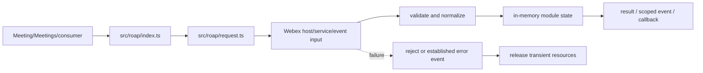
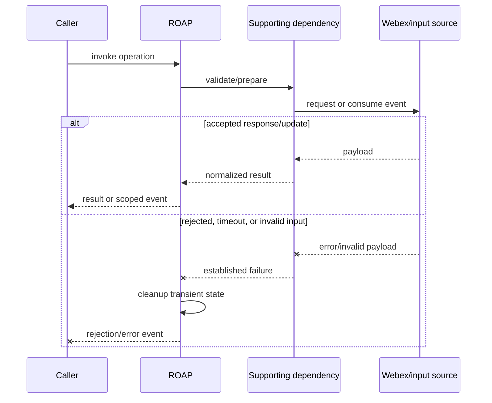
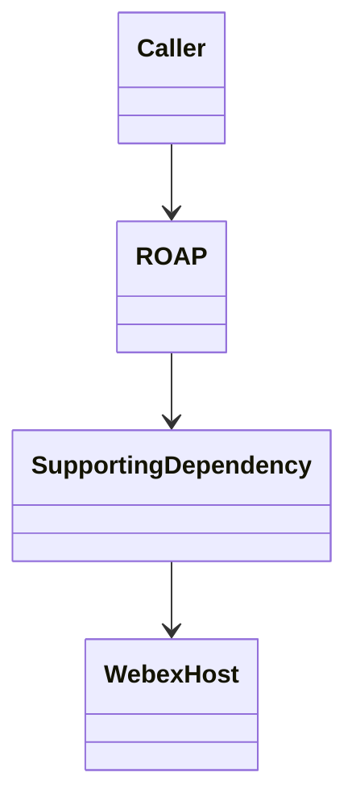
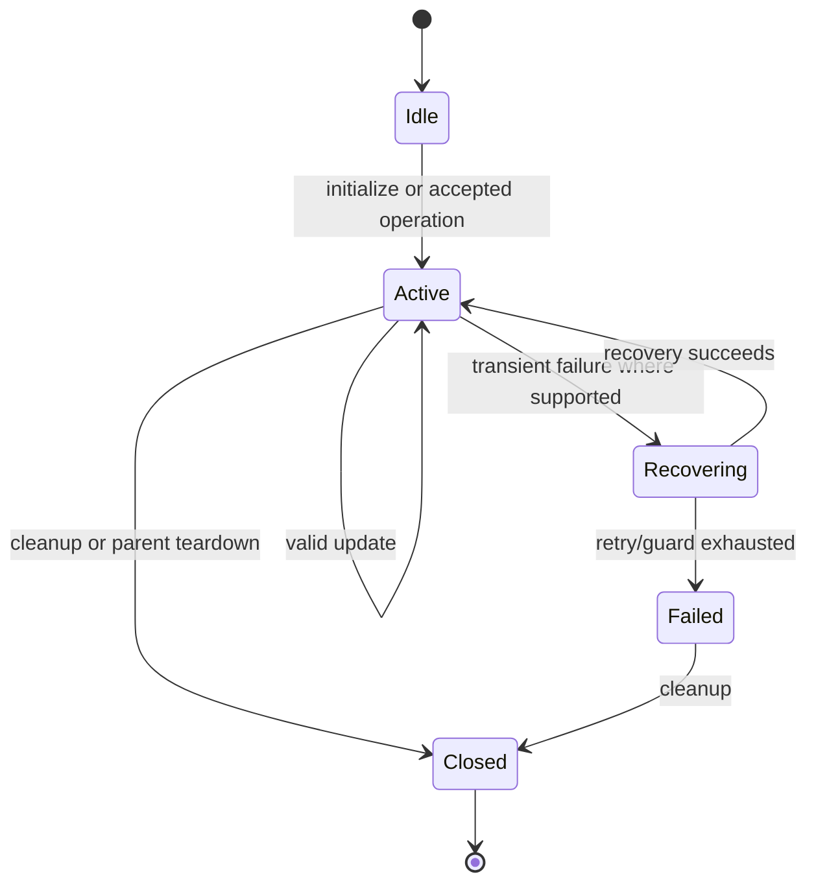

<!-- sdd-generated-metadata
doc_kind: module-spec
generated_from: module-spec@0.2.2
generator_plugin: repo-annotation@1.0.5+codex.20260818094939
generated_by: codex
approved_by: repository user
updated_at: 2026-08-18T15:33:39Z
validation_status: not-run
-->
# ROAP — SPEC

> Start here → root [`AGENTS.md`](../../../AGENTS.md) · router [`SPEC_INDEX.md`](../../../ai-docs/SPEC_INDEX.md) · system [`ARCHITECTURE.md`](../../../ai-docs/ARCHITECTURE.md). This is the canonical source-local spec for `src/roap/`.

## Metadata

| Field | Value |
|---|---|
| Module id | `roap` |
| Source path(s) | `src/roap/` |
| Parent spec | — |
| Doc kind | Module spec |
| Coverage score | 93% assessed 2026-08-18; 13/14 mandatory fields present; all critical fields present, one noncritical detail gap remains |
| Generated from | `module-spec` @ SDLC template library `0.2.2` |
| generated_by / approved_by / updated_at | codex / repository user / 2026-08-18T15:33:39Z |
| Validation status | not-run |

## Evidence Rules

Requirements cite current implementation and mirrored unit-test paths. Current code wins over retained prose when they conflict; commit and PR history are excluded by repository-owner decision. Missing test evidence is stated as a gap rather than inferred.

## Source Material Register

| Source material | Scope | Decision | Detail location or disposition |
|---|---|---|---|
| No routed legacy module spec | overview / API / behavior / tests | none; generated from current ROAP/request/TURN code and tests |
| Current source and mirrored tests | implementation / tests | verified | requirements, flows, failures, and test strategy below |

## Overview

For orientation, start at `src/roap/index.ts`; supporting files under `src/roap/` separate request, parsing, collection, type, or utility concerns from parent orchestration. The module is composed by `Meeting`, `Meetings`, or the package entry as applicable. Remote Webex services/Locus remain authoritative, and all local state is scoped to the SDK, plugin, meeting, or operation lifetime.

## Purpose / Responsibility

Coordinates ROAP offer/answer messages, SDP processing, glare/error handling, and TURN discovery for meeting media.

## Stack

TypeScript/JavaScript in the Node 22.14 Yarn workspace; Webex core/plugin abstractions and Mocha/Sinon/`@webex/test-helper-chai` tests. Build target: `yarn workspace @webex/plugin-meetings build:src`.

## Folder / Package Structure

```text
src/roap/
├── index.ts — primary behavior/entry point
├── request.ts — request, parser, utility, or supporting behavior
└── ai-docs/roap-spec.md — canonical module specification
```

## Key Files (source of truth)

| File | Holds |
|---|---|
| `src/roap/index.ts` | Primary lifecycle and public/internal surface |
| `src/roap/request.ts` | Supporting transport, parser, or state behavior |
| `test/unit/spec/roap/index.ts` | Mirrored behavioral tests |
| `src/constants.ts` | Shared meeting/event/wire constants where consumed |

## Public Surface

| Contract ID | Type | Surface | Purpose | Compatibility / deprecation | Schema / detail link | Root index |
|---|---|---|---|---|---|---|
| `roap.1` | SDK / in-process / remote | process incoming/outgoing ROAP messages | Preserve the module responsibility through a focused operation group | Consumer-visible methods/events are semver-sensitive when reachable from package objects | `src/roap/index.ts` | [CONTRACTS](../../../ai-docs/CONTRACTS.md) |
| `roap.2` | SDK / in-process / remote | send Locus media requests and apply SDP answers | Preserve the module responsibility through a focused operation group | Consumer-visible methods/events are semver-sensitive when reachable from package objects | `src/roap/index.ts` | [CONTRACTS](../../../ai-docs/CONTRACTS.md) |
| `roap.3` | SDK / in-process / remote | discover and normalize TURN service information | Preserve the module responsibility through a focused operation group | Consumer-visible methods/events are semver-sensitive when reachable from package objects | `src/roap/index.ts` | [CONTRACTS](../../../ai-docs/CONTRACTS.md) |

Compatibility notes:
- Prefer additive options and payload fields. Preserve method/event names, rejection semantics, and cleanup timing; route public changes through `src/index.ts` or the documented owning object.

## Requires (dependencies)

Meeting/Locus media request transport, SDP utilities, media connection, Webex TURN discovery, and sequence state.

## Requirements

| ID | WHAT | WHY | Source Evidence | Test / Example Evidence | Assumptions / Gaps | Confidence |
|---|---|---|---|---|---|---|
| `ROAP-R-001` | process incoming/outgoing ROAP messages. | Coordinates ROAP offer/answer messages, SDP processing, glare/error handling, and TURN discovery for meeting media. | `src/roap/index.ts` | `test/unit/spec/roap/index.ts` | none | PRESENT |
| `ROAP-R-002` | send Locus media requests and apply SDP answers. | Callers need deterministic observable behavior across async Webex inputs. | `src/roap/index.ts`, `src/roap/request.ts` | `test/unit/spec/roap/index.ts` | additional edge cases may live in sibling tests | PRESENT |
| `ROAP-R-003` | Failures reject/emit the established signal and release module-owned listeners, timers, or transient objects. | Hidden failure or leaked state causes later meeting operations to behave incorrectly. | `src/roap/index.ts` | `test/unit/spec/roap/index.ts` | verify sibling test files for operation-specific cleanup | PRESENT |
| `ROAP-R-004` | ROAP message type and sequence guard valid offer/answer, glare, and error transitions. | Applying a stale or illegal message can corrupt SDP state and the peer connection. | `src/roap/index.ts`, `src/roap/types.ts` | `test/unit/spec/roap/index.ts` | none | PRESENT |
| `ROAP-R-005` | TURN discovery normalizes service results for the active media negotiation and propagates discovery failure. | Media setup needs the correct relay configuration and must not silently use fabricated credentials. | `src/roap/turnDiscovery.ts`, `src/roap/request.ts` | `test/unit/spec/roap/turnDiscovery.ts`, `test/unit/spec/roap/request.ts` | none | PRESENT |

## Design Overview

The primary entry point coordinates domain state and delegates transport/parsing to supporting files so those boundaries remain testable. Inputs are normalized before client state or events change. Async results preserve the established error signal, while teardown owns every listener, timer, or transient object allocated by this module.

## Data Flow



## Sequence Diagram(s)

Sequence coverage:

The operation groups below share the same caller → module → supporting dependency → Webex/input ordering and the same rejection/cleanup contract, so one combined diagram covers their common sequence; operation-specific state and guards are stated in the requirements and use cases.

| Operation group | Diagram | Failure / recovery coverage |
|---|---|---|
| process incoming/outgoing ROAP messages | Primary operation | validation/service rejection and cleanup branch |
| send Locus media requests and apply SDP answers | Async update | stale/error input is rejected or ignored according to current code |



## Class / Component Relationships



The primary module object owns its client state and composes/invokes supporting request, parser, collection, or utility code. The Webex host/service remains the authority for remote state.

## Use Cases

- **UC-1 Primary operation:** a consumer or parent module invokes process incoming/outgoing ROAP messages; the module validates/delegates, normalizes the result, updates state where applicable, and returns or emits the established outcome. Evidence: `src/roap/index.ts`, `test/unit/spec/roap/index.ts`.
- **UC-2 Async/change operation:** the parent or remote input triggers send Locus media requests and apply SDP answers; the module reconciles it with current state and exposes one scoped result. Evidence: `src/roap/index.ts`, `src/roap/request.ts`.

## State Model

ROAP sequence, pending offer/answer, negotiation state, and TURN discovery results are held per media negotiation.

## Business Rules & Invariants

- ROAP sequence/order and message type determine valid transitions; terminal errors reject the active negotiation instead of being ignored. Enforced by `src/roap/index.ts` and supporting code under `src/roap/`.

## Concurrency & Reactive Flow

- Promise, event, media, and timer callbacks can interleave. Preserve existing sequence guards, make cleanup idempotent, and never start an unbounded retry/listener loop.
- Do not assume remote events are globally ordered unless the current parser/state code enforces ordering.

## State Machine



State labels summarize the module lifecycle; exact guards and values remain in `src/roap/index.ts`.

## Protocol / Wire Format

- External payloads are parsed/serialized by files under `src/roap/` and existing Webex/media dependencies. Preserve current field names, enum/raw values, sequence identifiers, and compatibility behavior; do not treat the normalized client model as the wire schema.

## Error Handling & Failure Modes

| Condition | Signal | Caller recovery |
|---|---|---|
| invalid options or unsupported state | established validation/error rejection | correct input/state; do not retry unchanged |
| Webex/service/media rejection | propagated typed/request/media error | branch on the established error; retry only where module policy is bounded |
| timeout, stale update, or teardown race | timeout/rejection/ignored stale update per current path | re-read current meeting state; allow cleanup/recovery manager to finish |

## Pitfalls

- Offer/answer messages are ordered protocol state. Retrying or applying a stale sequence can corrupt the peer connection.
- Public behavior may be reachable through a parent `Meeting`/`Meetings` object even when the source helper is not exported directly.

## Key Design Trade-off

- Explicit ROAP state preserves interoperability and recoverable errors but makes media setup sequential and stateful.

## Test-Case Strategy (module)

Use the mirrored suite as the first characterization boundary. Cover each public operation with a successful result/state/event and a rejected/invalid branch; use fake timers for timeout/retry logic; assert listener/resource cleanup for async modules; keep request/parser fixtures representative without secrets.

| Behavior / Requirement | Existing test evidence | Gap |
|---|---|---|
| `ROAP-R-001` | `test/unit/spec/roap/index.ts` | confirm sibling operation tests during focused changes |
| `ROAP-R-002` | `test/unit/spec/roap/index.ts` | verify out-of-order/rejection edge where applicable |
| `ROAP-R-003` | `test/unit/spec/roap/index.ts` | verify cleanup on every early-exit path |
| `ROAP-R-004` | `test/unit/spec/roap/index.ts` | verify stale sequence, glare, and error messages |
| `ROAP-R-005` | `test/unit/spec/roap/turnDiscovery.ts`, `test/unit/spec/roap/request.ts` | none |

## Traceability

- Repo architecture: [`ARCHITECTURE.md`](../../../ai-docs/ARCHITECTURE.md) · Registry: [`SPEC_INDEX.md`](../../../ai-docs/SPEC_INDEX.md)
- Coverage state and contracts baseline: `../../../.sdd/manifest.json`
