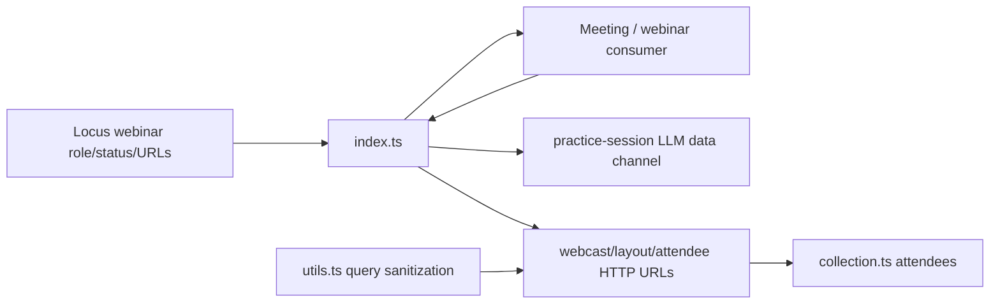
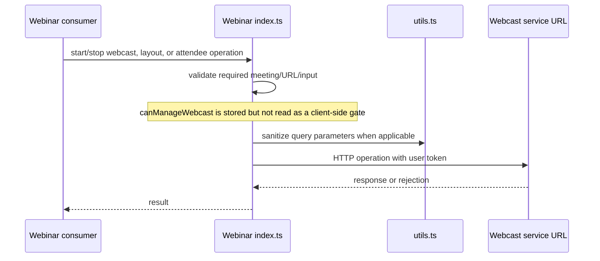
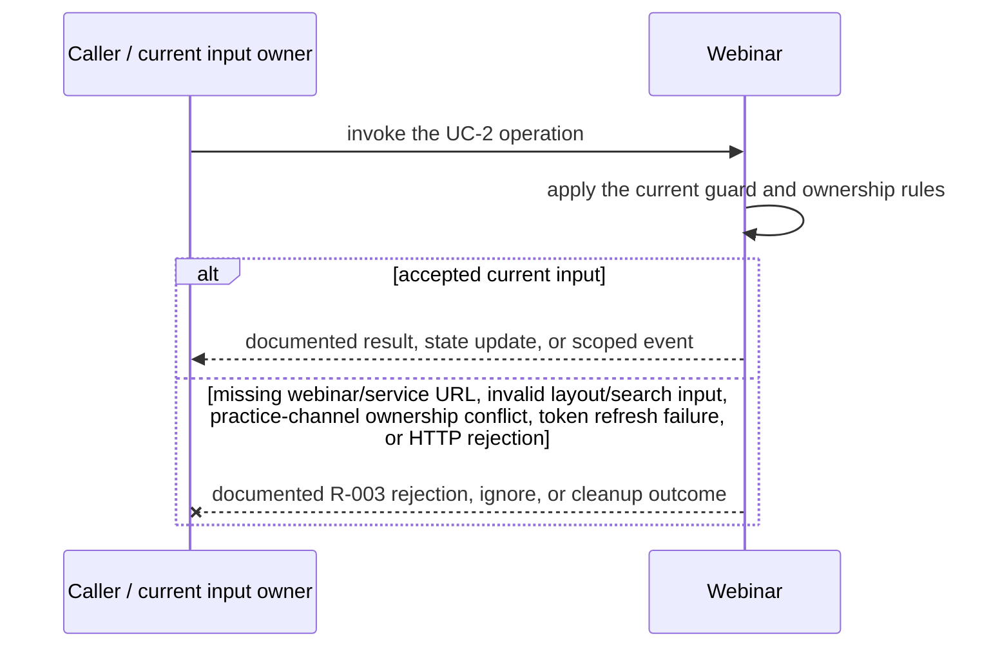
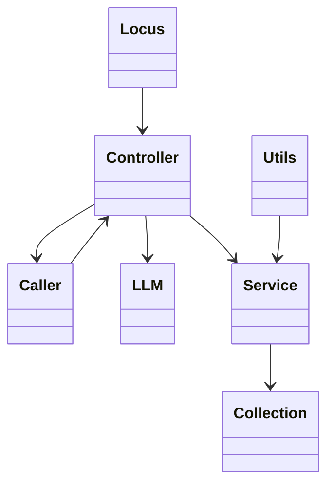
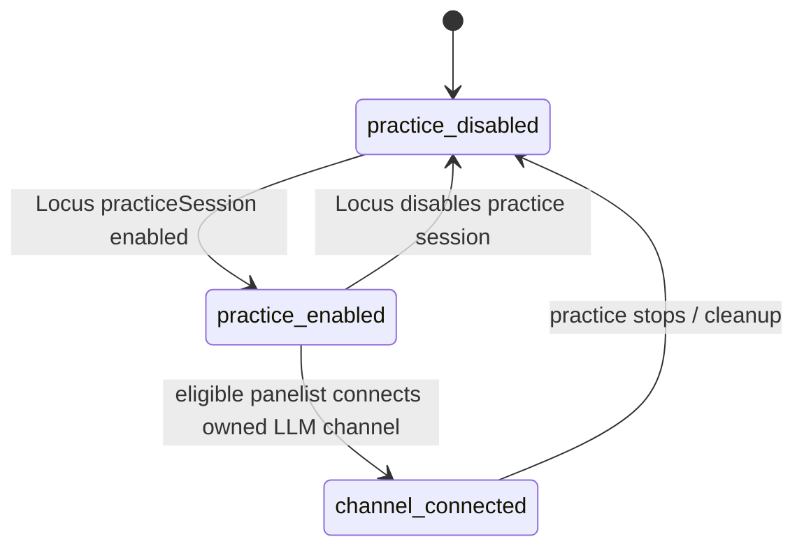

<!-- sdd-generated-metadata
doc_kind: module-spec
generated_from: module-spec@0.2.2
generator_plugin: repo-annotation@1.0.5+codex.20260818094939
generated_by: codex
approved_by: repository user
updated_at: 2026-08-21T06:10:05Z
validation_status: not-run
-->
# WEBINAR — SPEC

> Start here → root [`AGENTS.md`](../../../AGENTS.md) · router [`SPEC_INDEX.md`](../../../ai-docs/SPEC_INDEX.md) · system [`ARCHITECTURE.md`](../../../ai-docs/ARCHITECTURE.md). This is the canonical source-local spec for `src/webinar/`.

## Metadata

| Field | Value |
|---|---|
| Module id | `webinar` |
| Source path(s) | `src/webinar/` |
| Parent spec | — |
| Doc kind | Module spec |
| Coverage score | 93% assessed 2026-08-21; 13/14 mandatory fields present; all critical and Important fields present; one noncritical polish gap remains |
| Generated from | `module-spec` @ SDLC template library `0.2.2` |
| generated_by / approved_by / updated_at | codex / repository user / 2026-08-21T06:10:05Z |
| Validation status | not-run |

## Evidence Rules

Requirements cite current source and mirrored tests. Current code wins over retained prose when they conflict; commit and PR history are excluded. Missing evidence stays a gap.

## Source Material Register

| Source material | Scope | Decision | Detail location or disposition |
|---|---|---|---|
| No routed legacy module spec | overview / API / behavior / tests | none; generated from current webinar controller, collection, utilities, and tests |
| Current source and mirrored tests | implementation / tests | verified | requirements, flows, failures, and test strategy below |

## Overview

`src/webinar/` contains 3 direct source/reference file(s) and has 3 mirrored unit-test file(s). This spec separates its public operations, runtime data movement, component ownership, state applicability, and verification boundary.

## Purpose / Responsibility

Owns webinar practice-session data-channel lifecycle, role/status projection, and host webcast controls including layout and attendee operations.

## Stack

TypeScript/JavaScript in the Node 22.14 Yarn workspace; Webex core/plugin abstractions and Mocha/Sinon/`@webex/test-helper-chai` tests.

## Folder / Package Structure

```text
src/webinar/
├── collection.ts — module-owned collection
├── index.ts — module facade/controller or primary exports
├── utils.ts — normalization/helper functions
└── ai-docs/webinar-spec.md — canonical module specification
```

## Key Files (source of truth)

| File | Holds |
|---|---|
| `src/webinar/collection.ts` | module-owned collection |
| `src/webinar/index.ts` | module facade/controller or primary exports |
| `src/webinar/utils.ts` | normalization/helper functions |
| `test/unit/spec/webinar/collection.ts` and 2 sibling test file(s) | mirrored characterization/unit coverage |

## Public Surface

| Contract ID | Type | Surface | Purpose | Compatibility / deprecation | Schema / detail link | Root index |
|---|---|---|---|---|---|---|
| `webinar.1` | SDK / in-process / remote | derive webinar role, practice-session, and webcast state | Focused operation group owned by this module | Preserve methods/events/wire values reachable from package objects | `src/webinar/index.ts` | [CONTRACTS](../../../ai-docs/CONTRACTS.md) |
| `webinar.2` | SDK / in-process / remote | start/stop practice-session data channel and webcast | Focused operation group owned by this module | Preserve methods/events/wire values reachable from package objects | `src/webinar/index.ts` | [CONTRACTS](../../../ai-docs/CONTRACTS.md) |
| `webinar.3` | SDK / in-process / remote | query/update layout and search/view/expel webcast attendees | Focused operation group owned by this module | Preserve methods/events/wire values reachable from package objects | `src/webinar/index.ts` | [CONTRACTS](../../../ai-docs/CONTRACTS.md) |

Compatibility notes:
- Prefer additive fields/options and preserve current rejection/event/cleanup semantics. Internal helpers are not public merely because they are exported within the source directory.

## Requires (dependencies)

Parent Meeting/Locus state, webinar service URLs, data-channel tokens/media, role/capability state, collection/request access, and metrics/events.

## Requirements

| ID | WHAT | WHY | Source Evidence | Test / Example Evidence | Assumptions / Gaps | Confidence |
|---|---|---|---|---|---|---|
| `WEBINAR-R-001` | derive webinar role, practice-session, and webcast state. | Owns webinar practice-session data-channel lifecycle, role/status projection, and host webcast controls including layout and attendee operations. | `src/webinar/index.ts` | `test/unit/spec/webinar/index.ts` | none | PRESENT |
| `WEBINAR-R-002` | start/stop practice-session data channel and webcast. | Consumers need deterministic behavior across meeting and remote updates. | `src/webinar/index.ts`, `src/webinar/utils.ts` | `test/unit/spec/webinar/index.ts` | inspect sibling tests for operation-specific cases | PRESENT |
| `WEBINAR-R-003` | Invalid inputs and HTTP/channel failures remain visible; practice-session cleanup removes the relay listener/token ownership only for the meeting that owns the channel. | Callers must receive the actual module failure outcome without false cleanup or event guarantees. | `src/webinar/` | `test/unit/spec/webinar/index.ts` | none | PRESENT |
| `WEBINAR-R-004` | Practice-session data-channel token/connection state is created, replaced, and cleaned independently from the public meeting channel. | Practice participants must not receive or retain events on the wrong session transport. | `src/webinar/index.ts` | `test/unit/spec/webinar/index.ts` | none | PRESENT |
| `WEBINAR-R-005` | Webcast start/stop/layout and attendee search/view/expel operations validate their required URL/input and send the request with the user token. `canManageWebcast` is stored but is not read as a client-side authorization gate. | This describes current observable enforcement without implying a capability check that the implementation does not perform. | `src/webinar/index.ts`, `src/webinar/utils.ts` | `test/unit/spec/webinar/index.ts`, `test/unit/spec/webinar/utils.ts` | Possible product authorization defect: confirm whether these operations should reject locally when `canManageWebcast` is false. | PRESENT |
| `WEBINAR-R-006` | Role and practice/webcast status updates refresh the controller before exposing the new state. | Consumer controls must follow the latest Locus role/status projection rather than stale local intent. | `src/webinar/index.ts`, `src/webinar/collection.ts` | `test/unit/spec/webinar/index.ts`, `test/unit/spec/webinar/collection.ts` | none | PRESENT |

## Design Overview

`Webinar` projects Locus role/practice/webcast data, owns the practice-session LLM data-channel token/listener lifecycle, and calls webcast/layout/attendee URLs directly. `collection.ts` stores attendee results and `utils.ts` sanitizes query parameters.

## Data Flow



## Sequence Diagram(s)

Sequence coverage:

| Operation group | Diagram | Failure coverage |
|---|---|---|
| UC-1 — primary operation | Primary operation sequence | accepted and rejected dependency outcomes |
| UC-2 — secondary/change operation | Secondary operation and failure sequence | missing webinar/service URL, invalid layout/search input, practice-channel ownership conflict, token refresh failure, or HTTP rejection |

### Primary operation sequence



### Secondary operation and failure sequence



## Class / Component Relationships



The arrows identify ownership and delegation inside `src/webinar/`; files that only declare types or constants are not presented as transports.

## Use Cases

- **UC-1:** Connect or disconnect the practice-session LLM channel only for the owning meeting and remove its relay listener during cleanup. Evidence: `src/webinar/`.
- **UC-2:** Execute webcast, layout, and attendee operations after current input/URL checks; current code does not enforce `canManageWebcast` before these calls. Evidence: `src/webinar/`.

## State Model

Webcast URL, management capability, role transition, practice-session status/channel/token, layout, attendee collection, and listeners are meeting scoped.

## Business Rules & Invariants

- Practice-channel replacement is meeting-owner scoped and query parameters are sanitized. Webcast operations currently rely on URL/input validation and server authorization; they do not consult `canManageWebcast`. Evidence: `src/webinar/index.ts`, `src/webinar/utils.ts`.

## Concurrency & Reactive Flow

- Async work owned by `Webinar` may complete after a newer caller or remote input. Preserve the identity, sequence, and resource-owner guards in `src/webinar/`; a late completion must not replay UC-2 for superseded state.

## State Machine



These transitions combine the stored `practiceSessionEnabled` projection with the explicitly owned practice-session LLM connection lifecycle in `src/webinar/index.ts`.

## Error Handling & Failure Modes

| Condition | Signal | Caller recovery |
|---|---|---|
| missing webinar/service URL, invalid layout/search input, practice-channel ownership conflict, token refresh failure, or HTTP rejection | Follow the concrete rejection, ignore, state, or cleanup behavior in the module's R-003 requirement. | Resolve the named condition; retry only when another requirement defines a bound. |
| UC-1 succeeds | Return, update, callback, or scoped event identified by the Public Surface and primary sequence. | Continue from the owning module's accepted state. |

## Pitfalls

- Practice-session media/data-channel state differs from public webcast state. Reusing the ordinary meeting channel without cleanup can deliver events to the wrong session.
- Verify both typed constants/enums and raw wire values before changing a logical condition in this legacy package.

## Test-Case Strategy (module)

Use the current mirrored suites: `test/unit/spec/webinar/collection.ts`, `test/unit/spec/webinar/index.ts`, `test/unit/spec/webinar/utils.ts`. Characterize the two code-grounded use cases above and the listed failure condition; add cleanup or transition cases only for resources and state this module actually owns.

| Behavior / Requirement | Existing test evidence | Gap |
|---|---|---|
| `WEBINAR-R-001` | `test/unit/spec/webinar/index.ts` | inspect sibling tests for full operation matrix |
| `WEBINAR-R-002` | `test/unit/spec/webinar/index.ts` | verify the operation-specific invalid-input and rejection branches |
| `WEBINAR-R-003` | `test/unit/spec/webinar/index.ts` | verify the concrete R-003 rejection, ignore, or cleanup outcome |
| `WEBINAR-R-004` | `test/unit/spec/webinar/index.ts` | verify token/channel replacement cleanup |
| `WEBINAR-R-005` | `test/unit/spec/webinar/index.ts`, `test/unit/spec/webinar/utils.ts` | characterize current no-client-gate behavior; capability enforcement remains a product-decision gap |
| `WEBINAR-R-006` | `test/unit/spec/webinar/index.ts`, `test/unit/spec/webinar/collection.ts` | none |

## Traceability

- Repo architecture: [`ARCHITECTURE.md`](../../../ai-docs/ARCHITECTURE.md) · Registry: [`SPEC_INDEX.md`](../../../ai-docs/SPEC_INDEX.md)
- Coverage state and contracts baseline: `../../../.sdd/manifest.json`
