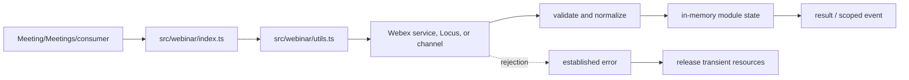
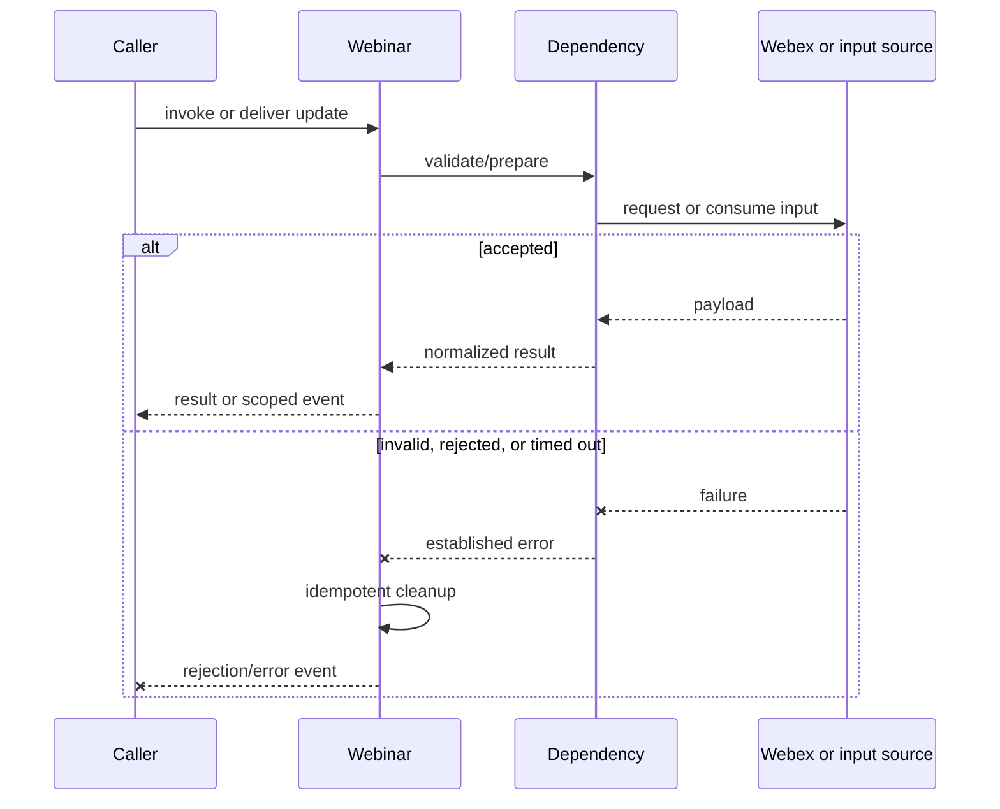
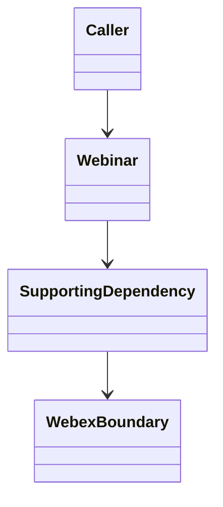
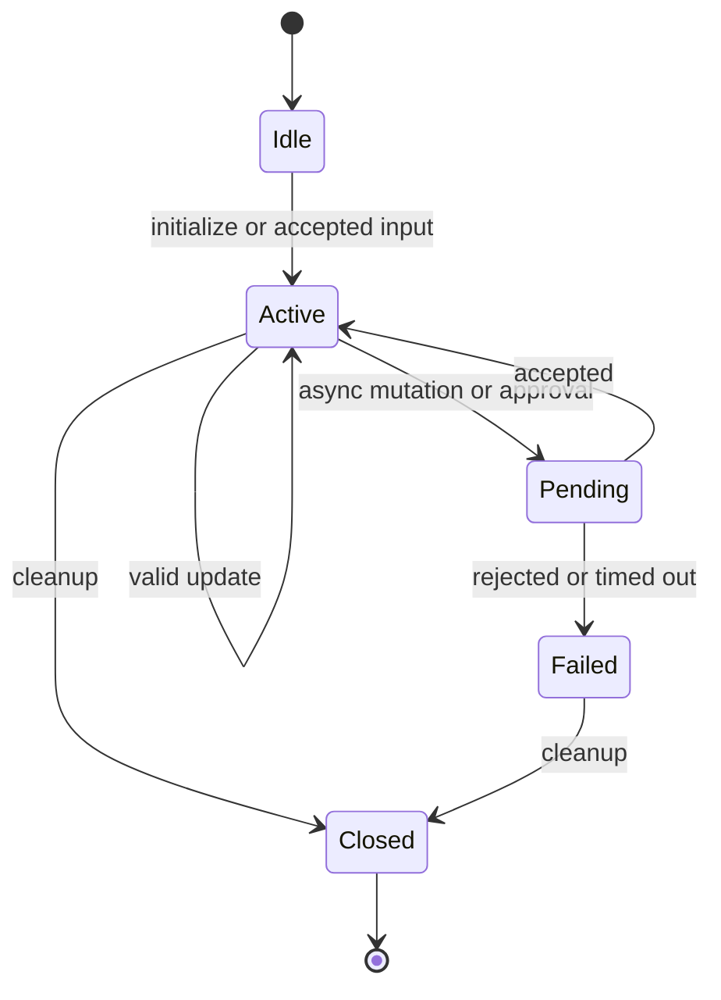

<!-- sdd-generated-metadata
doc_kind: module-spec
generated_from: module-spec@0.2.2
generator_plugin: repo-annotation@1.0.5+codex.20260818094939
generated_by: codex
approved_by: repository user
updated_at: 2026-08-18T15:33:39Z
validation_status: not-run
-->
# WEBINAR — SPEC

> Start here → root [`AGENTS.md`](../../../AGENTS.md) · router [`SPEC_INDEX.md`](../../../ai-docs/SPEC_INDEX.md) · system [`ARCHITECTURE.md`](../../../ai-docs/ARCHITECTURE.md). This is the canonical source-local spec for `src/webinar/`.

## Metadata

| Field | Value |
|---|---|
| Module id | `webinar` |
| Source path(s) | `src/webinar/` |
| Parent spec | — |
| Doc kind | Module spec |
| Coverage score | 93% assessed 2026-08-18; 13/14 mandatory fields present; all critical fields present, one noncritical detail gap remains |
| Generated from | `module-spec` @ SDLC template library `0.2.2` |
| generated_by / approved_by / updated_at | codex / repository user / 2026-08-18T15:33:39Z |
| Validation status | not-run |

## Evidence Rules

Requirements cite current source and mirrored tests. Current code wins over retained prose when they conflict; commit and PR history are excluded. Missing evidence stays a gap.

## Source Material Register

| Source material | Scope | Decision | Detail location or disposition |
|---|---|---|---|
| No routed legacy module spec | overview / API / behavior / tests | none; generated from current webinar controller, collection, utilities, and tests |
| Current source and mirrored tests | implementation / tests | verified | requirements, flows, failures, and test strategy below |

## Overview

For orientation, start at `src/webinar/index.ts`; supporting files under `src/webinar/` separate request, parsing, collection, type, or utility concerns from parent orchestration. The module is composed by `Meeting`, `Meetings`, or the package entry as applicable. Remote Webex services/Locus remain authoritative, and all local state is scoped to the SDK, plugin, meeting, or operation lifetime.

## Purpose / Responsibility

Owns webinar practice-session data-channel lifecycle, role/status projection, and host webcast controls including layout and attendee operations.

## Stack

TypeScript/JavaScript in the Node 22.14 Yarn workspace; Webex core/plugin abstractions and Mocha/Sinon/`@webex/test-helper-chai` tests.

## Folder / Package Structure

```text
src/webinar/
├── index.ts — primary behavior/entry point
├── utils.ts — supporting request, type, utility, or constant behavior
└── ai-docs/webinar-spec.md — canonical module specification
```

## Key Files (source of truth)

| File | Holds |
|---|---|
| `src/webinar/index.ts` | Primary lifecycle and module surface |
| `src/webinar/utils.ts` | Supporting transport, types, constants, or normalization |
| `test/unit/spec/webinar/index.ts` | Mirrored behavioral tests |

## Public Surface

| Contract ID | Type | Surface | Purpose | Compatibility / deprecation | Schema / detail link | Root index |
|---|---|---|---|---|---|---|
| `webinar.1` | SDK / in-process / remote | derive webinar role, practice-session, and webcast state | Focused operation group owned by this module | Preserve methods/events/wire values reachable from package objects | `src/webinar/index.ts` | [CONTRACTS](../../../ai-docs/CONTRACTS.md) |
| `webinar.2` | SDK / in-process / remote | start/stop practice-session data channel and webcast | Focused operation group owned by this module | Preserve methods/events/wire values reachable from package objects | `src/webinar/index.ts` | [CONTRACTS](../../../ai-docs/CONTRACTS.md) |
| `webinar.3` | SDK / in-process / remote | query/update layout and search/view/expel webcast attendees | Focused operation group owned by this module | Preserve methods/events/wire values reachable from package objects | `src/webinar/index.ts` | [CONTRACTS](../../../ai-docs/CONTRACTS.md) |

Compatibility notes:
- Prefer additive fields/options and preserve current rejection/event/cleanup semantics. Internal helpers are not public merely because they are exported within the source directory.

## Requires (dependencies)

Parent Meeting/Locus state, webinar service URLs, data-channel tokens/media, role/capability state, collection/request access, and metrics/events.

## Requirements

| ID | WHAT | WHY | Source Evidence | Test / Example Evidence | Assumptions / Gaps | Confidence |
|---|---|---|---|---|---|---|
| `WEBINAR-R-001` | derive webinar role, practice-session, and webcast state. | Owns webinar practice-session data-channel lifecycle, role/status projection, and host webcast controls including layout and attendee operations. | `src/webinar/index.ts` | `test/unit/spec/webinar/index.ts` | none | PRESENT |
| `WEBINAR-R-002` | start/stop practice-session data channel and webcast. | Consumers need deterministic behavior across meeting and remote updates. | `src/webinar/index.ts`, `src/webinar/utils.ts` | `test/unit/spec/webinar/index.ts` | inspect sibling tests for operation-specific cases | PRESENT |
| `WEBINAR-R-003` | Invalid, rejected, or terminal operations preserve the established failure signal and release module-owned transient resources. | Hidden failure or leaked state corrupts later meeting behavior. | `src/webinar/index.ts` | `test/unit/spec/webinar/index.ts` | verify every early exit during focused changes | PRESENT |
| `WEBINAR-R-004` | Practice-session data-channel token/connection state is created, replaced, and cleaned independently from the public meeting channel. | Practice participants must not receive or retain events on the wrong session transport. | `src/webinar/index.ts` | `test/unit/spec/webinar/index.ts` | none | PRESENT |
| `WEBINAR-R-005` | Webcast start/stop/layout and attendee search/view/expel operations require a validated webinar meeting and current management capability. | Large-webinar mutations are host-sensitive remote operations and server rejection must remain visible. | `src/webinar/index.ts`, `src/webinar/utils.ts` | `test/unit/spec/webinar/index.ts`, `test/unit/spec/webinar/utils.ts` | none | PRESENT |
| `WEBINAR-R-006` | Role and practice/webcast status updates refresh the controller before exposing the new state. | Consumer controls must follow the latest Locus role/status projection rather than stale local intent. | `src/webinar/index.ts`, `src/webinar/collection.ts` | `test/unit/spec/webinar/index.ts`, `test/unit/spec/webinar/collection.ts` | none | PRESENT |

## Design Overview

The primary controller/data module owns normalization and observable state while supporting files isolate request, type, constant, collection, or utility concerns. Capability and remote response data are checked before state changes. Async completion emits/returns one established outcome; cleanup handles listeners, timers, locks, channels, or transient requests owned by the module.

## Data Flow



## Sequence Diagram(s)

Sequence coverage:

The operation groups below share the same caller → module → supporting dependency → Webex/input ordering and the same rejection/cleanup contract, so one combined diagram covers their common sequence; operation-specific state and guards are stated in the requirements and use cases.

| Operation group | Diagram | Failure / recovery coverage |
|---|---|---|
| derive webinar role, practice-session, and webcast state | Read/derive or initialize | invalid/capability rejection |
| start/stop practice-session data channel and webcast | Mutate or react | remote rejection/timeout and cleanup |



## Class / Component Relationships



The module owns its projection/controller and composes supporting requests, types, constants, collections, or utilities. The Webex boundary remains authoritative.

## Use Cases

- **UC-1 Primary:** the parent/consumer requests derive webinar role, practice-session, and webcast state; the module validates or derives data and returns/emits the normalized outcome. Evidence: `src/webinar/index.ts`, `test/unit/spec/webinar/index.ts`.
- **UC-2 Change:** the parent/consumer triggers start/stop practice-session data channel and webcast; capability/current state is checked, the dependency is invoked, and accepted state is exposed once. Evidence: `src/webinar/index.ts`, `src/webinar/utils.ts`.

## State Model

Webcast URL, management capability, role transition, practice-session status/channel/token, layout, attendee collection, and listeners are meeting scoped.

## Business Rules & Invariants

- Webcast/practice operations require a validated webinar meeting and capability; data-channel replacement closes the prior channel; query parameters are sanitized. Enforced under `src/webinar/`.

## Concurrency & Reactive Flow

- Remote/event/promise/timer callbacks may interleave. Preserve current identity/sequence guards, allow only the intended in-flight operation, and make listener/timer/channel cleanup idempotent.

## State Machine



Exact state values/guards remain in `src/webinar/index.ts`; this diagram groups the externally meaningful lifecycle.

## Error Handling & Failure Modes

| Condition | Signal | Caller recovery |
|---|---|---|
| missing capability, identity, URL, or invalid options | validation/established rejection | refresh state or correct input; do not retry unchanged |
| service/channel/request rejection | propagated request or module error | branch on error; retry only through existing bounded policy |
| timeout, role change, or teardown race | rejected/ignored stale result with cleanup | re-read current meeting state and invoke again only if still eligible |

## Pitfalls

- Practice-session media/data-channel state differs from public webcast state. Reusing the ordinary meeting channel without cleanup can deliver events to the wrong session.
- Verify both typed constants/enums and raw wire values before changing a logical condition in this legacy package.

## Test-Case Strategy (module)

Start with the mirrored suite and sibling files in the same test directory. Cover successful derivation/mutation plus invalid capability/input, remote rejection, stale event, and cleanup. Use Sinon, `calledOnceWithExactly`, and fake timers for retry/lock/token/channel timing.

| Behavior / Requirement | Existing test evidence | Gap |
|---|---|---|
| `WEBINAR-R-001` | `test/unit/spec/webinar/index.ts` | inspect sibling tests for full operation matrix |
| `WEBINAR-R-002` | `test/unit/spec/webinar/index.ts` | verify rejected and role/capability-change branches |
| `WEBINAR-R-003` | `test/unit/spec/webinar/index.ts` | verify cleanup on all early exits |
| `WEBINAR-R-004` | `test/unit/spec/webinar/index.ts` | verify token/channel replacement cleanup |
| `WEBINAR-R-005` | `test/unit/spec/webinar/index.ts`, `test/unit/spec/webinar/utils.ts` | verify role/capability rejection |
| `WEBINAR-R-006` | `test/unit/spec/webinar/index.ts`, `test/unit/spec/webinar/collection.ts` | none |

## Traceability

- Repo architecture: [`ARCHITECTURE.md`](../../../ai-docs/ARCHITECTURE.md) · Registry: [`SPEC_INDEX.md`](../../../ai-docs/SPEC_INDEX.md)
- Coverage state and contracts baseline: `../../../.sdd/manifest.json`
