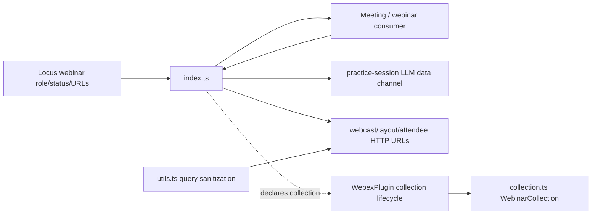
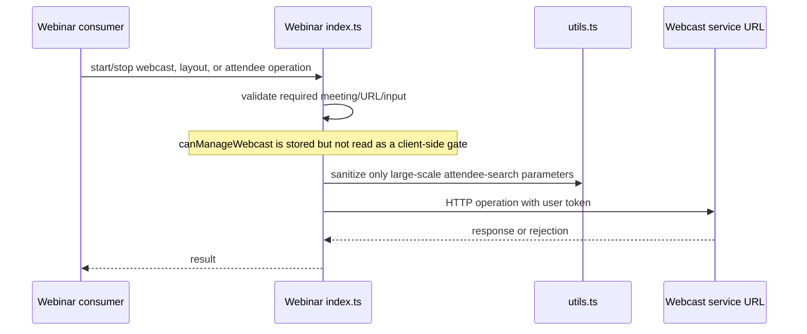
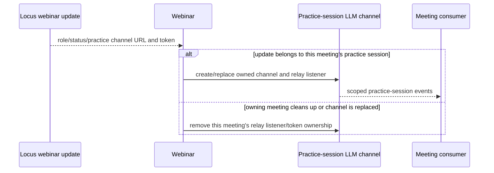
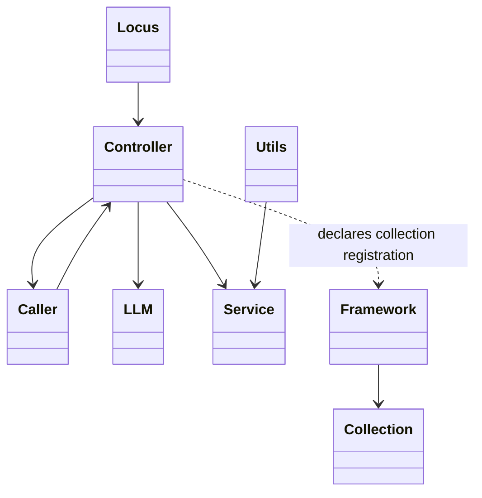
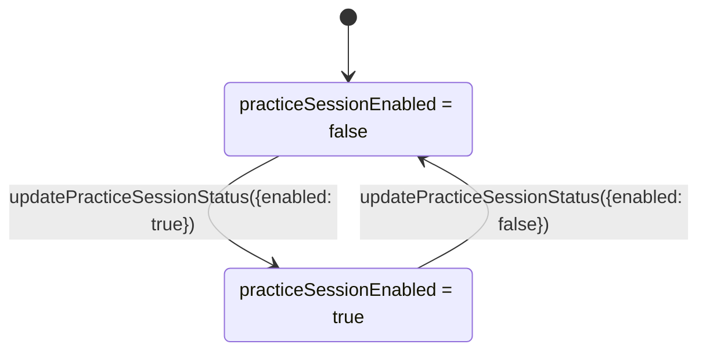

<!-- sdd-generated-metadata
doc_kind: module-spec
generated_from: module-spec@0.2.2
generator_plugin: repo-annotation@1.0.5+codex.20260818094939
generated_by: codex
approved_by: repository user
updated_at: 2026-08-22T15:21:29Z
validation_status: pass-with-warnings
-->
# WEBINAR — SPEC

> Start here → root [`AGENTS.md`](../../../AGENTS.md) · router [`SPEC_INDEX.md`](../../../ai-docs/SPEC_INDEX.md) · system [`ARCHITECTURE.md`](../../../ai-docs/ARCHITECTURE.md). This is the canonical source-local spec for `src/webinar/`.

## Metadata

| Field | Value |
|---|---|
| Module id | `webinar` |
| Source path(s) | `src/webinar/` |
| Parent spec | — |
| Doc kind | Module spec |
| Coverage score | 93% assessed 2026-08-22; 13/14 mandatory fields present; all critical and Important fields present; one noncritical polish gap remains; pending independent validation of the participant-role repair |
| Generated from | `module-spec` @ SDLC template library `0.2.2` |
| generated_by / approved_by / updated_at | codex / repository user / 2026-08-22T15:21:29Z |
| Validation status | pass-with-warnings |

## Evidence Rules

Requirements cite current source and mirrored tests. Current code wins over retained prose when they conflict; commit and PR history are excluded. Missing evidence stays a gap.

## Source Material Register

| Source material | Scope | Decision | Detail location or disposition |
|---|---|---|---|
| No routed legacy module spec | overview / API / behavior / tests | none; generated from current webinar controller, collection, utilities, and tests |
| Current source and mirrored tests | implementation / tests | verified | requirements, flows, failures, and test strategy below |

## Overview

`src/webinar/` contains 3 direct source/reference file(s) and has 3 mirrored unit-test file(s). This spec separates its public operations, runtime data movement, component ownership, state applicability, and verification boundary.

## Purpose / Responsibility

Owns webinar practice-session data-channel lifecycle, role/status projection, and host webcast controls including layout and attendee operations.

## Stack

TypeScript/JavaScript in the Node 22.14 Yarn workspace; Webex core/plugin abstractions and Mocha/Sinon/`@webex/test-helper-chai` tests.

## Folder / Package Structure

```text
src/webinar/
├── collection.ts — module-owned collection
├── index.ts — module facade/controller or primary exports
├── utils.ts — normalization/helper functions
└── ai-docs/webinar-spec.md — canonical module specification
```

## Key Files (source of truth)

| File | Holds |
|---|---|
| `src/webinar/collection.ts` | module-owned collection |
| `src/webinar/index.ts` | module facade/controller or primary exports |
| `src/webinar/utils.ts` | normalization/helper functions |
| `test/unit/spec/webinar/collection.ts` and 2 sibling test file(s) | mirrored characterization/unit coverage |

## Public Surface

| Contract ID | Type | Surface | Purpose | Compatibility / deprecation | Schema / detail link | Root index |
|---|---|---|---|---|---|---|
| `webinar.1` | SDK / state | `cleanUp()`, `locusUrlUpdate()`, `updateWebcastUrl()`, `updateCanManageWebcast()`, `updateRoleChanged()`, `getValidatedWebinarMeeting()`, and `updateStatusByRole()` | Derive webinar and practice-session state for the owning meeting from current Locus inputs. | Preserve owner validation and current role/status transitions. | `src/webinar/index.ts` | [CONTRACTS](../../../ai-docs/CONTRACTS.md) |
| `webinar.2` | SDK / lifecycle | `isJoinPracticeSessionDataChannel()`, `ensurePracticeSessionDatachannelToken()`, `updatePSDataChannel()`, `cleanupPSDataChannel()`, `setPracticeSessionState()`, and `updatePracticeSessionStatus()` | Own the meeting-specific practice-session LLM token, socket, and relay listener lifecycle. | Replacement/cleanup must affect only the owning meeting's channel resources. | `src/webinar/index.ts` | [CONTRACTS](../../../ai-docs/CONTRACTS.md) |
| `webinar.3` | SDK / remote | `startWebcast()` and `stopWebcast()` | Start or stop webcast through the current webcast URL. | Current code validates URL/input but does not consult `canManageWebcast` locally. | `src/webinar/index.ts` | [CONTRACTS](../../../ai-docs/CONTRACTS.md) |
| `webinar.4` | SDK / remote | `queryWebcastLayout()` and `updateWebcastLayout()` | Read or update the webcast layout using the current webcast instance URL and the supplied layout fields. | These methods do not call `sanitizeParams()` or enforce `canManageWebcast`; preserve their direct request outcome. | `src/webinar/index.ts` | [CONTRACTS](../../../ai-docs/CONTRACTS.md) |
| `webinar.5` | SDK / remote | `viewAllWebcastAttendees()`, `searchWebcastAttendees()`, `expelWebcastAttendee()`, and `searchLargeScaleWebinarAttendees()` | Query, search, or expel webcast attendees through the configured service endpoint. | Standard search uses `encodeURIComponent`; only large-scale search calls `sanitizeParams()` before `URLSearchParams`. None enforces `canManageWebcast`. | `src/webinar/index.ts`, `src/webinar/utils.ts` | [CONTRACTS](../../../ai-docs/CONTRACTS.md) |
| `webinar.6` | exported helpers/models | `sanitizeParams()` and `WebinarCollection.set()` / `get()` | Sanitize request parameters and provide the collection registered by the `Webinar` plugin definition. | `index.ts` declares `collections: {webinar: WebinarCollection}` for framework-managed instantiation; controller methods do not explicitly call the collection's read/write methods. | `src/webinar/index.ts`, `src/webinar/utils.ts`, `src/webinar/collection.ts` | [CONTRACTS](../../../ai-docs/CONTRACTS.md) |

Compatibility notes:
- Prefer additive fields/options and preserve current rejection/event/cleanup semantics. Internal helpers are not public merely because they are exported within the source directory.

## Requires (dependencies)

Parent Meeting/Locus state, webinar service URLs, data-channel tokens/media, role/capability state, collection/request access, and metrics/events.

## Requirements

| ID | WHAT | WHY | Source Evidence | Test / Example Evidence | Assumptions / Gaps | Confidence |
|---|---|---|---|---|---|---|
| `WEBINAR-R-001` | derive webinar role, practice-session, and webcast state. | Owns webinar practice-session data-channel lifecycle, role/status projection, and host webcast controls including layout and attendee operations. | `src/webinar/index.ts` | `test/unit/spec/webinar/index.ts` | none | PRESENT |
| `WEBINAR-R-002` | start/stop practice-session data channel and webcast. | Practice-channel and webcast operations use different owners and request paths, so their lifecycle and authorization behavior must stay distinct. | `src/webinar/index.ts` | `test/unit/spec/webinar/index.ts` | stored `canManageWebcast` is not read by webcast methods; retain as an authorization-gap characterization | PRESENT |
| `WEBINAR-R-003` | Invalid inputs and HTTP/channel failures remain visible; practice-session cleanup removes the relay listener/token ownership only for the meeting that owns the channel. | Practice resources are meeting-owned, while webcast authorization currently depends on the service rather than the stored capability. | `src/webinar/` | `test/unit/spec/webinar/index.ts` | none | PRESENT |
| `WEBINAR-R-004` | Practice-session data-channel token/connection state is created, replaced, and cleaned independently from the public meeting channel. | Practice participants must not receive or retain events on the wrong session transport. | `src/webinar/index.ts` | `test/unit/spec/webinar/index.ts` | none | PRESENT |
| `WEBINAR-R-005` | Webcast operations send the user token against the current webcast URL without reading `canManageWebcast`. `startWebcast()` validates `meeting`; large-scale attendee search validates the resolvable webinar meeting and attendee-search URL and sanitizes its optional query fields. Layout, standard view/search/expel, and stop operations perform no equivalent local validation/sanitization. | This preserves the method-specific enforcement boundary instead of generalizing the large-scale-search checks across unrelated operations. | `src/webinar/index.ts`, `src/webinar/utils.ts` | `test/unit/spec/webinar/index.ts`, `test/unit/spec/webinar/utils.ts` | Possible product authorization defect: confirm whether these operations should reject locally when `canManageWebcast` is false. | PRESENT |
| `WEBINAR-R-006` | Role and practice/webcast status updates refresh the controller before exposing the new state. | Consumer controls must follow the latest Locus role/status projection rather than stale local intent. | `src/webinar/index.ts` | `test/unit/spec/webinar/index.ts` | none | PRESENT |

## Design Overview

`Webinar` projects Locus role/practice/webcast data, owns the practice-session LLM data-channel token/listener lifecycle, and calls webcast/layout/attendee URLs directly. `utils.ts` sanitizes only large-scale attendee-search parameters. `index.ts` registers `WebinarCollection` through its WebexPlugin `collections` declaration for framework-managed instantiation, although controller methods do not explicitly read or populate it.

## Data Flow



## Sequence Diagram(s)

Sequence coverage:

| Operation group | Diagram | Failure coverage |
|---|---|---|
| UC-1…UC-4 — webinar practice and webcast operation groups | Webinar practice and webcast primary sequence | invalid URL/input, practice-channel failure/cleanup, webcast rejection, and absent local capability guard |
| UC-1…UC-4 — webinar practice and webcast alternate/failure paths | Webinar practice and webcast alternate/failure sequence | missing webinar/service URL, invalid layout/search input, practice-channel ownership conflict, token refresh failure, or HTTP rejection |

### Webinar practice and webcast primary sequence



### Webinar practice and webcast alternate/failure sequence



## Class / Component Relationships



The arrows identify ownership and delegation inside `src/webinar/`; files that only declare types or constants are not presented as transports.

## Use Cases

- **UC-1:** Project webinar role, webcast URL, practice status, and owner identity from Locus updates. Evidence: `src/webinar/index.ts`.
- **UC-2:** Acquire the practice-session token, connect/replace its LLM channel for the owning meeting, and remove its relay listener during cleanup. Evidence: `src/webinar/index.ts`.
- **UC-3:** Start/stop webcast or query/update layout after current URL/input checks; `canManageWebcast` is stored but not enforced by these methods. Evidence: `src/webinar/index.ts`.
- **UC-4:** View or expel attendees directly, standard-search with `encodeURIComponent`, or large-scale-search after `sanitizeParams()` and meeting/search-URL validation, while relying on service authorization. Evidence: `src/webinar/index.ts`, `src/webinar/utils.ts`.

## State Model

Webcast URL, management capability, role transition, practice-session status/channel/token, layout, attendee collection, and listeners are meeting scoped.

## Business Rules & Invariants

- Practice-channel replacement is meeting-owner scoped. Only `searchLargeScaleWebinarAttendees()` uses `sanitizeParams()`; standard attendee search URL-encodes its keyword, and layout/view/expel operations do neither. Webcast operations rely on server authorization and do not consult `canManageWebcast`. Evidence: `src/webinar/index.ts`, `src/webinar/utils.ts`.

## Concurrency & Reactive Flow

- Practice-session channel/listener/token ownership is keyed to the owning meeting and is detached when that meeting replaces or cleans up its practice channel. Webcast HTTP operations settle their returned promises; current code stores `canManageWebcast` but does not read it as a local authorization guard.

## State Machine



The diagram is limited to the stored boolean projection in `src/webinar/index.ts`. Practice-channel creation/replacement is a side effect of `updatePracticeSessionStatus()`/`updatePSDataChannel()`, not a separately named controller state.

## Error Handling & Failure Modes

| Condition | Signal | Caller recovery |
|---|---|---|
| `startWebcast()` lacks a meeting, or large-scale search cannot resolve its webinar meeting/attendee-search URL | The async operation rejects before issuing its request. Layout, stop, standard view/search, and expel do not perform the same local validation. | Supply the method-specific required context; do not infer a shared validation gate. |
| Practice-session channel/token setup fails or its owning meeting cleans up | The failure remains visible; cleanup removes only that meeting's relay listener/token ownership. | Re-establish the practice channel for the owning meeting if still required. |
| Webcast HTTP request rejects | The returned promise rejects. `canManageWebcast` is not consulted as a client-side guard by these operations. | Handle the service rejection; treat local capability enforcement as the recorded product-decision gap. |

## Pitfalls

- Practice-session media/data-channel state differs from public webcast state. Reusing the ordinary meeting channel without cleanup can deliver events to the wrong session.
- Verify both typed constants/enums and raw wire values before changing a logical condition in this legacy package.

## Test-Case Strategy (module)

Use the current mirrored suites: `test/unit/spec/webinar/collection.ts`, `test/unit/spec/webinar/index.ts`, `test/unit/spec/webinar/utils.ts`. Characterize the webinar-specific use cases above and each listed failure condition; add cleanup or transition cases only for resources and state this module actually owns.

| Behavior / Requirement | Existing test evidence | Gap |
|---|---|---|
| `WEBINAR-R-001` | `test/unit/spec/webinar/index.ts` | cover state, practice channel, webcast, layout, attendee, and standalone helper groups |
| `WEBINAR-R-002` | `test/unit/spec/webinar/index.ts` | cover start/stop, layout, search, pagination, and expel request inputs separately |
| `WEBINAR-R-003` | `test/unit/spec/webinar/index.ts` | prove practice cleanup is owner-scoped and webcast methods do not read `canManageWebcast` |
| `WEBINAR-R-004` | `test/unit/spec/webinar/index.ts` | verify token/channel replacement cleanup |
| `WEBINAR-R-005` | `test/unit/spec/webinar/index.ts`, `test/unit/spec/webinar/utils.ts` | characterize current no-client-gate behavior; capability enforcement remains a product-decision gap |
| `WEBINAR-R-006` | `test/unit/spec/webinar/index.ts` | none |

## Traceability

- Repo architecture: [`ARCHITECTURE.md`](../../../ai-docs/ARCHITECTURE.md) · Registry: [`SPEC_INDEX.md`](../../../ai-docs/SPEC_INDEX.md)
- Coverage state and contracts baseline: `../../../.sdd/manifest.json`
