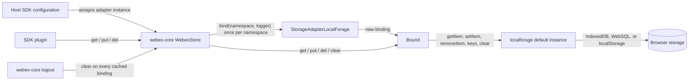
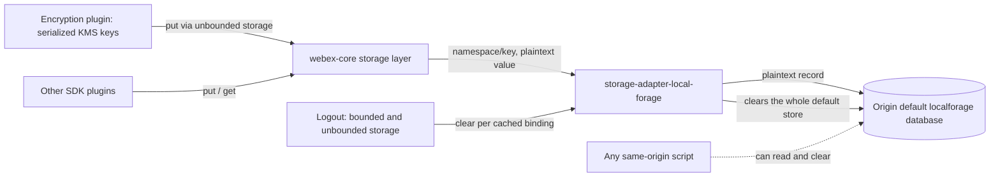

<!-- sdd-generated-metadata
doc_kind: standing-doc
generated_from: architecture@0.3.0
generated_by: claude-code
approved_by: rsarika@cisco.com
updated_at: 2026-10-06T12:02:00Z
validation_status: pass-with-warnings
-->

# @webex/storage-adapter-local-forage architecture

Canonical package-wide architecture for `@webex/storage-adapter-local-forage`. This document owns
the facts that span the package as a whole: what it publishes, what it depends on, where its data
lives, and the release, host, and security boundaries around it. Module-level behavior is specified
in the [module specification](../src/docs/README.md); this page summarizes only what a package-level
reader needs and links there for detail.

Related context: [specification registry](specs/README.md) ·
[repository agent instructions](../AGENTS.md)

## Applicability

| Condition ID                         | Status     | Evidence or reason | Owned section                       |
| ------------------------------------ | ---------- | ------------------ | ----------------------------------- |
| `repo.owns_datastore`                | Applicable | `src/index.js` writes namespaced records into the browser's default localforage database; the owner confirmed on 2026-10-06 that the package owns that layout | Repository data and schema |
| `repo.holds_client_state`            | Applicable | `src/index.js` keeps per-binding in-memory state and persists SDK client data in the browser | Client state model |
| `repo.components_interact`           | N/A        | One module (`src/index.js`); there is no internal component graph | Dependency and interaction topology |
| `repo.domain_data_across_components` | N/A        | One module; no domain object spans resources | Object and data ownership |
| `repo.caches_data`                   | N/A        | `src/index.js` is a store; it keeps no cache with expiry or invalidation | Caching catalog |
| `repo.observability_convention`      | Applicable | `src/index.js` requires an injected logger and logs every operation under a fixed prefix | Observability patterns |
| `repo.deploys_to_infra`              | N/A        | `package.json` declares a library with no deployable runtime | Runtime and infrastructure |
| `repo.shared_base_libs`              | Applicable | `package.json`, `.eslintrc.js`, `babel.config.js`, and `jest.config.js` inherit shared workspace libraries and configuration | Shared and base libraries |
| `repo.is_monorepo`                   | N/A        | The package is its own documentation root with one build (owner-confirmed 2026-10-06); sibling workspace packages are dependencies | Package map and dependencies |
| `repo.multi_platform`                | N/A        | `src/index.js` is browser-only, and `test/unit/spec/storage-adapter-local-forage.js` skips in Node | Platform matrix |
| `repo.published_package`             | Applicable | `package.json` declares npm entry points and a deploy:npm script | Release and versioning |
| `repo.embedded_in_host`              | Applicable | A host plugs the adapter into its Webex SDK storage configuration; `src/index.js` implements that contract | Host integration and theming |
| `repo.exposes_commands_or_artifacts` | Applicable | `package.json` defines the build that emits the published dist/index.js and the publish command | Commands and generated artifacts |
| `repo.cross_repo_deps_material`      | N/A        | `package.json` declares only npm and workspace dependencies, covered under Dependency topology | Cross-repository topology |
| `repo.security_arch_warranted`       | Applicable | Stored values are unencrypted and can include KMS key material from an in-repo consumer (owner-confirmed 2026-10-06) | Security architecture |

## Design overview

The package publishes one thing: a browser storage adapter that implements the Webex JS SDK
storage-adapter interface on top of the `localforage` library. A host application chooses it for one
of the SDK's two storage slots. The `@webex/webex-core` storage layer then drives it, binding one
namespace per SDK plugin and reading and writing values that survive page reloads and browser
restarts.

The package is deliberately thin. It owns argument validation, the `${namespace}/${key}` record
layout, and the translation from `localforage` results to the interface's semantics. It does not own
binding caching, value serialization, encryption, or driver selection. It uses the default
`localforage` database with no configuration, which keeps setup at zero but means every adapter
instance on an origin shares one database; the resulting hazards are specified in the module spec as
[`MOD-009` and `MOD-010`](../src/docs/README.md#requirements).

## Resource inventory and responsibilities

| Resource | Kind | Responsibility | Owner | Source | Detailed specification |
| -------- | ---- | -------------- | ----- | ------ | ---------------------- |
| `@webex/storage-adapter-local-forage` | Package | Published npm package containing the adapter | `@webex/web-client` | `package.json` | This document |
| `src/` | Module | `StorageAdapterLocalForage` and its namespace bindings | `@webex/web-client` | `src/index.js` | [`src/docs/README.md`](../src/docs/README.md) |
| Default `localforage` database | Browser datastore (external engine) | Holds every record the adapter writes, keyed `${namespace}/${key}` | Browser origin; layout owned by `src/` | `src/index.js` | [Data, schema, and migration discipline](../src/docs/README.md#data-schema-and-migration-discipline) |

## Interaction and execution flows

Representative flow: a host configures the SDK, the storage layer binds a plugin namespace on first
access, and the plugin reads and writes through that binding. Logout clears every cached binding.

| From | To | Interaction or transport | Purpose | Failure or compatibility behavior |
| ---- | -- | ------------------------ | ------- | --------------------------------- |
| Host configuration | `@webex/webex-core` storage layer | Object assignment in SDK config | Select this adapter for a storage slot | Constructor arguments are ignored |
| `@webex/webex-core` storage layer | Adapter | In-process promise call `bind` | Create one binding per namespace | Rejects without namespace or logger |
| `@webex/webex-core` storage layer | Binding | In-process promise calls | Read, write, delete, clear | A missing key rejects with `NotFoundError`, which the storage layer treats as no data |
| Binding | `localforage` | Library calls returning promises | Persist records | Driver, quota, and transaction errors propagate unchanged; no retry |

## Dependency topology

| Dependency | Type | Used by | Purpose | Version, failure, or fallback policy |
| ---------- | ---- | ------- | ------- | ------------------------------------ |
| `localforage` | External | `src/` | All persistence through the default instance | `^1.7.3` in `package.json`, resolving to 1.10.0; flagged stale by the workspace unmaintained-dependency catalog; no fallback when no driver exists |
| `@webex/common` | Internal (workspace) | `src/` | `oneFlight` decorator for `get` and `del` | `workspace:*`; documented by its own canonical spec |
| `@webex/webex-core` | Internal (workspace) | `src/` | `NotFoundError` type; also the runtime caller of the adapter | `workspace:*`; no canonical spec yet, so behavior is taken from its storage-layer code |
| `@webex/storage-adapter-spec` | Internal (workspace) | Package test | Shared conformance suite | `workspace:*`; declared as a runtime dependency though only the test imports it |

There are no cycles: this package depends on `@webex/common` and `@webex/webex-core`, and neither of
them imports it. The single point of failure is the browser storage engine behind `localforage`.

## Public and consumer surfaces

This is the package contract index. Exact declarations stay in `src/index.js` and the entry points in
`package.json`. Per-surface behavior is in the module specification's
[Public surface](../src/docs/README.md#public-surface).

| Surface | Type | Owner | Consumers | Compatibility policy | Source |
| ------- | ---- | ----- | --------- | -------------------- | ------ |
| `local-forage-storage-adapter` | SDK (published) | `src/` | Host SDK configurations (in-repo: `@webex/recipe-private-web-client`) and external npm consumers | Default export and the binding shape are semver-public; constructor arguments carry no meaning | `package.json` |
| `local-forage-indexeddb-store` | File (published, on-device record layout) | `src/` | Later page loads and releases on the same origin | Frozen; see Repository data and schema | `src/index.js` |

Required external contracts, recorded in `.sdd/manifest.json` and owned elsewhere:
`storage-adapter-spec-suite` (`@webex/storage-adapter-spec`), `webex-common-js-api`
(`@webex/common`), `webex-core-storage-layer` (`@webex/webex-core`), and `localforage-api` (npm
`localforage`). The package publishes no HTTP surface, so there is no OpenAPI document.

<!-- Include if: the repository owns a datastore. [condition-id: repo.owns_datastore] -->

## Repository data and schema

| Datastore or schema | Owning resource | Source of truth | Migration and compatibility rule |
| ------------------- | --------------- | --------------- | -------------------------------- |
| Browser default `localforage` database (`localforage` / `keyvaluepairs`) | `src/` | `src/index.js` | Unversioned key-value records with unbounded retention; no migration exists, so any change to the key composition, database, or store needs a data migration. Entity-level detail is in the module spec's [data section](../src/docs/README.md#data-schema-and-migration-discipline) |

<!-- Include if: the repository holds client-side or in-memory session state. [condition-id: repo.holds_client_state] -->

## Client state model

| State or slice | Owner | Transition triggers | Persistence or reset boundary |
| -------------- | ----- | ------------------- | ----------------------------- |
| Per-binding namespace and logger | `src/` | `bind` | In memory for the binding's lifetime |
| In-flight `get`/`del` promises | `src/` through `@webex/common` `oneFlight` | Concurrent calls for one key | In memory until the promise settles |

Persisted plugin data is repository data, not client state; it is covered under Repository data and
schema.

## Cross-cutting architecture

### Security

- Trust boundaries and identity flow: see Security architecture.
- Sensitive surfaces and data classes: see Security architecture.
- Encryption and secret boundaries: see Security architecture.

### Observability and operations

- Logging and correlation: through the host-injected SDK logger only; see Observability patterns.
- Metrics, traces, and audit signals: see Observability patterns.
- Ownership and operational entry points: `@webex/web-client` owns the package. There are no
  dashboards, alerts, or runbooks, because the package runs inside host applications.

### Quality attributes

- Footprint: one source file and one external runtime library (`localforage`).
- Compatibility: browser-only; record-layout compatibility is governed by Repository data and schema.
- Performance: roughly one storage transaction per operation; the read-miss cost is recorded in the
  module spec's [Key design trade-off](../src/docs/README.md#key-design-trade-off).

<!-- Include if: the repository has logging, metrics, tracing, or audit conventions worth standardizing. [condition-id: repo.observability_convention] -->

## Observability patterns

| Signal | Convention or required fields | Propagation or naming rule | Primary evidence |
| ------ | ----------------------------- | -------------------------- | ---------------- |
| Logs | Injected `options.logger` is mandatory; `bind` logs at info, every other operation at debug | Prefix `storage-adapter-local-forage:`; `get`, `put`, and `del` messages include the composed `${namespace}/${key}` unredacted; `clear` logs without a key | `src/index.js` |
| Metrics | None | N/A | `src/index.js` |
| Traces | None | N/A | `src/index.js` |
| Audit | None | N/A | `src/index.js` |

<!-- Include if: modules inherit a shared or base library stack. [condition-id: repo.shared_base_libs] -->

## Shared and base libraries

| Library | Inherited responsibility | Consumers | Version floor | Compatibility rule |
| ------- | ------------------------ | --------- | ------------- | ------------------ |
| `@webex/babel-config-legacy` | Babel transforms, including decorators | `babel.config.js` | `workspace:*` | No package-local override |
| `@webex/eslint-config-legacy` | Lint rules | `.eslintrc.js` | `workspace:*` | Package adds only `root: true` |
| `@webex/jest-config-legacy` | Jest configuration (Node environment) | `jest.config.js` | `workspace:*` | No package-local override |
| `@webex/legacy-tools` | `webex-legacy-tools` build and test runner | `package.json` scripts | `workspace:*` | Build and test flags are set in `package.json` |

<!-- Include if: the repository publishes a package or consumer artifact. [condition-id: repo.published_package] -->

## Release and versioning

| Artifact | Publish target | Versioning rule | Deprecation window | Changelog or migration obligation |
| -------- | -------------- | --------------- | ------------------ | --------------------------------- |
| `@webex/storage-adapter-local-forage` (`dist/index.js` via `main`) | npm, through the `deploy:npm` script (Yarn's npm publish) | Released with the workspace-wide version set by the monorepo release workflow | None defined in this package | Changelog generation is owned at the workspace root |

<!-- Include if: the repository is embedded in a host application. [condition-id: repo.embedded_in_host] -->

## Host integration and theming

| Host or integration | Mount or entry contract | Required providers or peers | Theming and accessibility constraints |
| ------------------- | ----------------------- | --------------------------- | ------------------------------------- |
| Webex JS SDK in a browser application (in-repo: `@webex/recipe-private-web-client` as `storage.unboundedAdapter`) | `config.storage.boundedAdapter` or `unboundedAdapter` set to an adapter instance; the storage layer calls `bind(namespace, {logger})` | `@webex/webex-core` storage layer and a browser storage engine reachable by `localforage` | N/A; no UI |

<!-- Include if: the repository exposes commands, generators, or stable file outputs. [condition-id: repo.exposes_commands_or_artifacts] -->

## Commands and generated artifacts

| Command or artifact | Owner | Inputs | Output or side effect | Compatibility boundary |
| ------------------- | ----- | ------ | --------------------- | ---------------------- |
| `build` (runs the `build:src` script) | Package | `src/` | `dist/index.js` and source maps through `webex-legacy-tools build` | `dist/index.js` is the published `main` entry |
| `deploy:npm` | Package | Built `dist/` and `package.json` | Publishes the package to npm | Run by the workspace release workflow |
| `test:style` | Package | `./src/**/*.*` | ESLint report | Markdown under `src/` matches the glob but is ignored by the shared ESLint configuration |
| `test:browser` | Package | `test/unit` | Karma run (unit scope) | Not the canonical unit-test command; the shared suite cannot load under Mocha |

<!-- Include if: trust boundaries or identity flows warrant a dedicated architectural view. [condition-id: repo.security_arch_warranted] -->

## Security architecture

The package sits entirely inside one browser origin. Values cross from SDK plugins through the
storage layer into the adapter and are written, unencrypted, to the origin's default `localforage`
database. Nothing in the path authenticates callers, encrypts values, or limits which same-origin
code can read the database.

- At rest: records persist until deleted. If the host's unbounded slot uses this adapter, the
  encryption plugin's cached KMS keys are among them.
- Erasure: logout clears both SDK storages, and each erases the database only through bindings it
  cached in that session. When it does, it also erases any other data written through the default
  `localforage` instance.
- Exposure in logs: composed keys appear in debug logs (for example, key URIs).
- Policy: no security policy file exists in this package or at the workspace root. Reporting and
  remediation stay with the owning team.

## Domain language

| Term | Repository-specific meaning | Authoritative source |
| ---- | --------------------------- | -------------------- |
| Adapter | A `StorageAdapterLocalForage` instance assigned to an SDK storage slot | `src/index.js` |
| Binding | The object `bind(namespace, options)` resolves, exposing `get`, `put`, `del`, and `clear` for one namespace | `src/index.js` |
| Namespace | The SDK plugin's storage namespace; the first segment of every stored key | `src/index.js` |
| Composed key | `${namespace}/${key}`, the record key actually stored in `localforage` | `src/index.js` |
| Bounded and unbounded storage | The SDK's two storage slots; the in-repo host uses this adapter for the unbounded slot | `.sdd/manifest.json` (contract webex-core-storage-layer, external to this package) |
| Stored null | A record whose value is `null`; `get` resolves it, unlike a missing key, which rejects | `src/index.js` |

## References and maintenance

- Decisions: [adr/](adr/index.md)
- Instantiated specifications and routing: [specs/README.md](specs/README.md)
- Module specification: [src/docs/README.md](../src/docs/README.md)
- Update this document in the same change that alters the package boundary, its dependencies, the
  record layout, the host contract, or the security posture.
